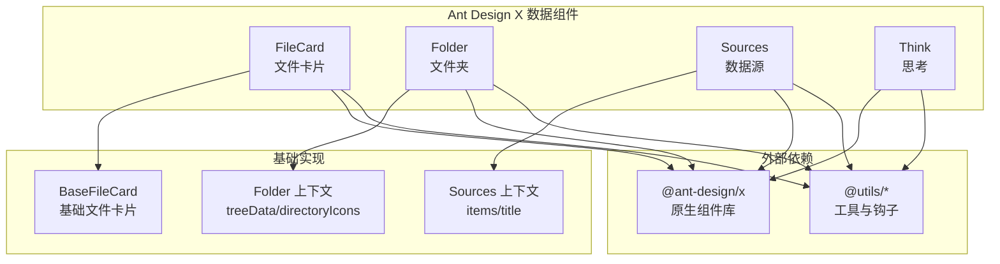
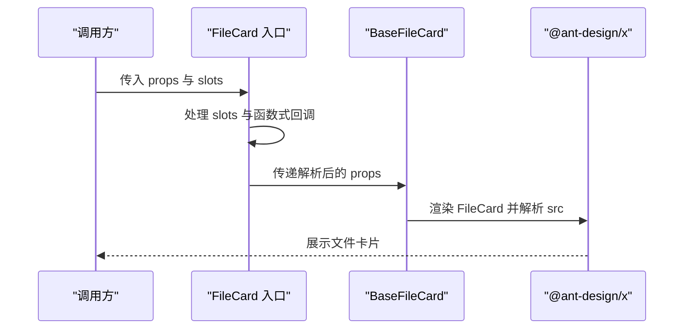
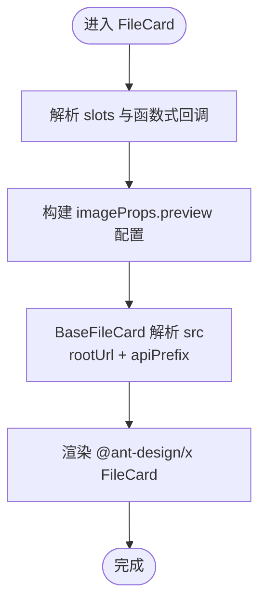
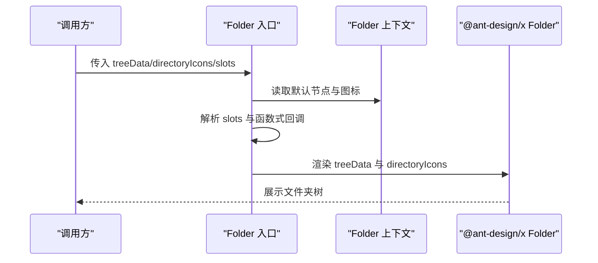
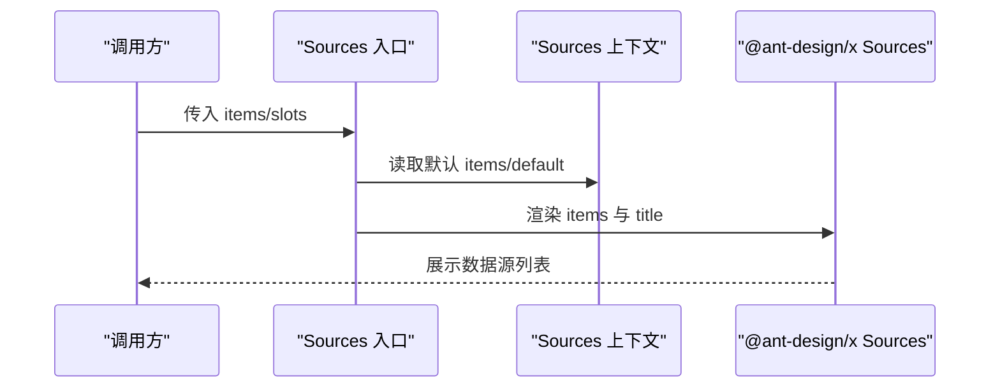
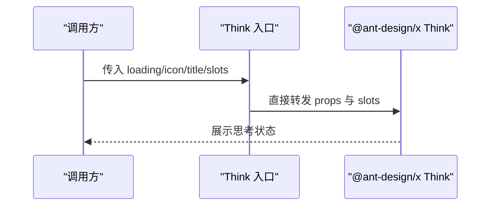
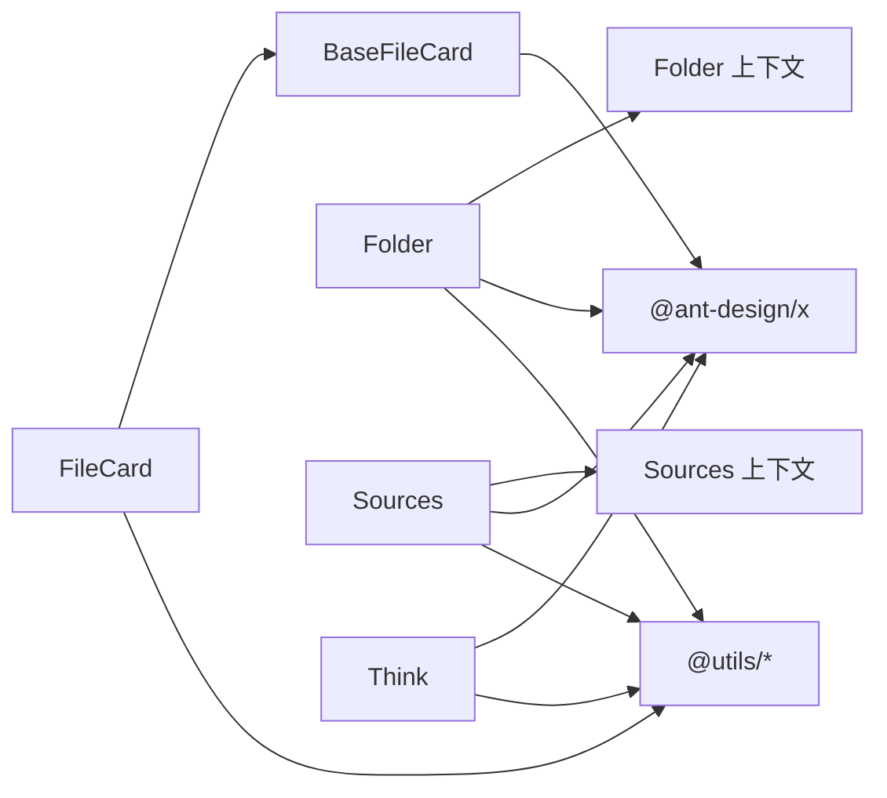

# 数据组件

<cite>
**本文引用的文件**
- [frontend/antdx/file-card/file-card.tsx](file://frontend/antdx/file-card/file-card.tsx)
- [frontend/antdx/file-card/base.tsx](file://frontend/antdx/file-card/base.tsx)
- [frontend/antdx/folder/folder.tsx](file://frontend/antdx/folder/folder.tsx)
- [frontend/antdx/folder/context.ts](file://frontend/antdx/folder/context.ts)
- [frontend/antdx/sources/sources.tsx](file://frontend/antdx/sources/sources.tsx)
- [frontend/antdx/sources/context.ts](file://frontend/antdx/sources/context.ts)
- [frontend/antdx/think/think.tsx](file://frontend/antdx/think/think.tsx)
</cite>

## 目录

1. [简介](#简介)
2. [项目结构](#项目结构)
3. [核心组件](#核心组件)
4. [架构总览](#架构总览)
5. [详细组件分析](#详细组件分析)
6. [依赖关系分析](#依赖关系分析)
7. [性能考量](#性能考量)
8. [故障排查指南](#故障排查指南)
9. [结论](#结论)
10. [附录](#附录)

## 简介

本文件面向 Ant Design X 的数据组件，聚焦以下四个组件：FileCard（文件卡片）、Folder（文件夹）、Sources（数据源）、Think（思考）。文档从系统架构、组件职责、数据流与处理逻辑、集成点与错误处理等方面进行深入解析，并提供可直接落地的使用示例与最佳实践，帮助开发者快速理解并正确使用这些组件。

## 项目结构

Ant Design X 的前端组件位于 `frontend/antdx` 目录下，每个组件通常由三部分组成：

- 组件入口文件：负责桥接 Svelte 与 React 生态，注入插槽与函数式回调。
- 基础实现文件：封装与 @ant-design/x 的实际组件交互，处理数据解析与默认行为。
- 上下文与工具：通过 createItemsContext 提供插槽项的上下文能力，支持动态渲染与扩展。

图表来源

- [frontend/antdx/file-card/file-card.tsx:1-127](file://frontend/antdx/file-card/file-card.tsx#L1-L127)
- [frontend/antdx/file-card/base.tsx:1-44](file://frontend/antdx/file-card/base.tsx#L1-L44)
- [frontend/antdx/folder/folder.tsx:1-123](file://frontend/antdx/folder/folder.tsx#L1-L123)
- [frontend/antdx/folder/context.ts:1-16](file://frontend/antdx/folder/context.ts#L1-L16)
- [frontend/antdx/sources/sources.tsx:1-42](file://frontend/antdx/sources/sources.tsx#L1-L42)
- [frontend/antdx/sources/context.ts:1-7](file://frontend/antdx/sources/context.ts#L1-L7)
- [frontend/antdx/think/think.tsx:1-24](file://frontend/antdx/think/think.tsx#L1-L24)

章节来源

- [frontend/antdx/file-card/file-card.tsx:1-127](file://frontend/antdx/file-card/file-card.tsx#L1-L127)
- [frontend/antdx/file-card/base.tsx:1-44](file://frontend/antdx/file-card/base.tsx#L1-L44)
- [frontend/antdx/folder/folder.tsx:1-123](file://frontend/antdx/folder/folder.tsx#L1-L123)
- [frontend/antdx/folder/context.ts:1-16](file://frontend/antdx/folder/context.ts#L1-L16)
- [frontend/antdx/sources/sources.tsx:1-42](file://frontend/antdx/sources/sources.tsx#L1-L42)
- [frontend/antdx/sources/context.ts:1-7](file://frontend/antdx/sources/context.ts#L1-L7)
- [frontend/antdx/think/think.tsx:1-24](file://frontend/antdx/think/think.tsx#L1-L24)

## 核心组件

- FileCard：用于展示单个文件卡片，支持图片占位、预览配置、遮罩与加载指示器的插槽化定制；内部通过 BaseFileCard 解析文件资源地址，确保可访问性。
  - **子组件层级关系**：FileCard 为顶层单卡片组件；`FileCardList`（列表层）用于署列展示多个文件卡片；`FileCardListItem`（列表项层）封装单个列表项的渲染逻辑。三者层级关系为：FileCardList → FileCardListItem → FileCard。
  - **后端导出**：`FileCard`、`FileCardList`、`FileCardListItem` 均通过 [backend/modelscope_studio/components/antdx/**init**.py](file://backend/modelscope_studio/components/antdx/__init__.py) 导出。
- Folder：用于展示文件夹树形结构，支持 treeData、directoryIcons、空态渲染、目录标题、预览标题与预览渲染等插槽；通过上下文提供节点与图标项的动态注入。
- Sources：用于展示数据源列表，支持 items 与 title 插槽；通过上下文提供默认项集合，便于在父级容器中统一注入。
- Think：用于展示“思考”记录与状态，支持 loading、icon、title 插槽，便于在不同状态下显示不同的视觉反馈。
  - **Think 与 ThoughtChain 的区别**：Think（`antdx.Think`）是轻量级单步骤“思考状态”展示组件，通常嵌入气泡流中用于指示“正在思考”的单一状态（属于数据组件）；ThoughtChain（`antdx.ThoughtChain`）则是多步骤思维链组件，用于展示完整的推理过程序列，内层支持子项渲染（属于确认组件）。两者使用场景不同：Think 适合单状态指示，ThoughtChain 适合多步骤推理展示。

章节来源

- [frontend/antdx/file-card/file-card.tsx:17-124](file://frontend/antdx/file-card/file-card.tsx#L17-L124)
- [frontend/antdx/file-card/base.tsx:9-41](file://frontend/antdx/file-card/base.tsx#L9-L41)
- [frontend/antdx/folder/folder.tsx:16-120](file://frontend/antdx/folder/folder.tsx#L16-L120)
- [frontend/antdx/folder/context.ts:3-13](file://frontend/antdx/folder/context.ts#L3-L13)
- [frontend/antdx/sources/sources.tsx:9-39](file://frontend/antdx/sources/sources.tsx#L9-L39)
- [frontend/antdx/sources/context.ts:3-4](file://frontend/antdx/sources/context.ts#L3-L4)
- [frontend/antdx/think/think.tsx:6-21](file://frontend/antdx/think/think.tsx#L6-L21)

## 架构总览

四个组件均采用“入口层 + 基础实现/上下文”的分层设计：

- 入口层：使用 sveltify 将 Svelte 组件桥接到 React 生态，统一处理 slots 与函数式回调，保证与 @ant-design/x 的属性对齐。
- 基础实现/上下文：在入口层之上，进一步封装数据解析、默认值处理、插槽渲染与上下文注入，降低重复逻辑，提升可维护性。

图表来源

- [frontend/antdx/file-card/file-card.tsx:34-124](file://frontend/antdx/file-card/file-card.tsx#L34-L124)
- [frontend/antdx/file-card/base.tsx:31-41](file://frontend/antdx/file-card/base.tsx#L31-L41)

章节来源

- [frontend/antdx/file-card/file-card.tsx:17-124](file://frontend/antdx/file-card/file-card.tsx#L17-L124)
- [frontend/antdx/file-card/base.tsx:9-41](file://frontend/antdx/file-card/base.tsx#L9-L41)

## 详细组件分析

### FileCard 组件分析

- 职责与能力
  - 文件信息展示：支持文件名、描述、图标、占位图、加载指示器等。
  - 操作与预览：支持图片预览配置（容器、遮罩、关闭图标、工具栏、自定义图片渲染）。
  - 插槽化扩展：通过 slots 对 icon、description、mask、spinProps._、imageProps._ 进行灵活替换。
  - 资源解析：通过 BaseFileCard 的 src 解析逻辑，将相对路径或 FileData 转换为可访问的 URL。
- 关键流程
  - 入口层解析 slots 与函数式回调，构造 preview 配置。
  - 将解析后的 imageProps 与 spinProps 传递给 BaseFileCard。
  - BaseFileCard 使用 rootUrl 与 apiPrefix 计算可访问的文件地址。
- 使用建议
  - 在需要自定义预览工具栏或遮罩时，优先使用 slots 注入，避免直接覆盖复杂对象。
  - 对于大文件或网络不稳定场景，合理设置占位图与加载指示器以提升用户体验。

图表来源

- [frontend/antdx/file-card/file-card.tsx:34-124](file://frontend/antdx/file-card/file-card.tsx#L34-L124)
- [frontend/antdx/file-card/base.tsx:15-41](file://frontend/antdx/file-card/base.tsx#L15-L41)

章节来源

- [frontend/antdx/file-card/file-card.tsx:9-124](file://frontend/antdx/file-card/file-card.tsx#L9-L124)
- [frontend/antdx/file-card/base.tsx:9-41](file://frontend/antdx/file-card/base.tsx#L9-L41)

### Folder 组件分析

- 职责与能力
  - 树形结构展示：支持 treeData 与目录图标映射 directoryIcons。
  - 动态内容服务：通过 fileContentService.onLoadFileContent 加载文件内容。
  - 插槽化扩展：支持 emptyRender、previewRender、directoryTitle、previewTitle。
  - 上下文注入：通过 useTreeNodeItems 与 useDirectoryIconItems 获取默认节点与图标集合。
- 关键流程
  - 从上下文解析 treeData 或 default，优先使用显式传入的 treeData。
  - 将 directoryIcons 转换为按扩展名映射的图标字典。
  - 将 slots 与函数式回调转换为 @ant-design/x 所需的渲染函数。
- 使用建议
  - 当目录结构复杂时，优先使用上下文注入默认节点，减少重复配置。
  - 预览渲染函数应尽量轻量，避免在渲染过程中执行重计算。

图表来源

- [frontend/antdx/folder/folder.tsx:25-119](file://frontend/antdx/folder/folder.tsx#L25-L119)
- [frontend/antdx/folder/context.ts:3-13](file://frontend/antdx/folder/context.ts#L3-L13)

章节来源

- [frontend/antdx/folder/folder.tsx:16-120](file://frontend/antdx/folder/folder.tsx#L16-L120)
- [frontend/antdx/folder/context.ts:1-16](file://frontend/antdx/folder/context.ts#L1-L16)

### Sources 组件分析

- 职责与能力
  - 数据源列表展示：支持 items 列表与标题 title 插槽。
  - 上下文注入：通过 useItems 获取默认 items 与 default，优先使用显式传入的 items。
  - 渲染增强：使用 renderItems 将上下文中的项集合克隆并渲染为 @ant-design/x 所需格式。
- 关键流程
  - 从上下文解析 items 或 default，合并为最终列表。
  - 将 title 与 items 传递给 @ant-design/x Sources。
- 使用建议
  - 在父级容器中集中注入默认 items，便于多处复用。
  - 对于大型列表，建议在上游进行分页或懒加载优化。

图表来源

- [frontend/antdx/sources/sources.tsx:9-39](file://frontend/antdx/sources/sources.tsx#L9-L39)
- [frontend/antdx/sources/context.ts:3-4](file://frontend/antdx/sources/context.ts#L3-L4)

章节来源

- [frontend/antdx/sources/sources.tsx:9-39](file://frontend/antdx/sources/sources.tsx#L9-L39)
- [frontend/antdx/sources/context.ts:1-7](file://frontend/antdx/sources/context.ts#L1-L7)

### Think 组件分析

- 职责与能力
  - 思考记录与状态展示：支持 loading、icon、title 插槽，便于在不同状态（如加载中、完成、失败）下切换显示内容。
  - 简洁桥接：作为 thin wrapper 直接转发到 @ant-design/x 的 Think 组件。
- 使用建议
  - 在异步思考流程中，结合 loading 插槽提供更友好的用户反馈。
  - 将 icon 与 title 插槽用于区分思考阶段或结果类型。

图表来源

- [frontend/antdx/think/think.tsx:6-21](file://frontend/antdx/think/think.tsx#L6-L21)

章节来源

- [frontend/antdx/think/think.tsx:6-21](file://frontend/antdx/think/think.tsx#L6-L21)

## 依赖关系分析

- 组件间耦合
  - FileCard 与 BaseFileCard：低耦合，通过 props 传递与解析实现解耦。
  - Folder 与 Sources：均依赖各自的上下文模块，彼此独立，通过 @ant-design/x 组件进行渲染。
  - Think：无上下文依赖，直接桥接 @ant-design/x。
- 外部依赖
  - @ant-design/x：所有组件最终渲染的基础库。
  - @utils/\*：提供插槽渲染、函数式回调包装、上下文创建等通用能力。

图表来源

- [frontend/antdx/file-card/file-card.tsx:1-7](file://frontend/antdx/file-card/file-card.tsx#L1-L7)
- [frontend/antdx/file-card/base.tsx:1-7](file://frontend/antdx/file-card/base.tsx#L1-L7)
- [frontend/antdx/folder/folder.tsx:1-7](file://frontend/antdx/folder/folder.tsx#L1-L7)
- [frontend/antdx/sources/sources.tsx:1-5](file://frontend/antdx/sources/sources.tsx#L1-L5)
- [frontend/antdx/think/think.tsx:1-4](file://frontend/antdx/think/think.tsx#L1-L4)

章节来源

- [frontend/antdx/file-card/file-card.tsx:1-7](file://frontend/antdx/file-card/file-card.tsx#L1-L7)
- [frontend/antdx/file-card/base.tsx:1-7](file://frontend/antdx/file-card/base.tsx#L1-L7)
- [frontend/antdx/folder/folder.tsx:1-7](file://frontend/antdx/folder/folder.tsx#L1-L7)
- [frontend/antdx/sources/sources.tsx:1-5](file://frontend/antdx/sources/sources.tsx#L1-L5)
- [frontend/antdx/think/think.tsx:1-4](file://frontend/antdx/think/think.tsx#L1-L4)

## 性能考量

- 插槽渲染成本控制
  - 尽量将 heavy 内容放入 slots，但注意在渲染函数中避免重复计算，必要时使用 useMemo 缓存。
- 数据解析与传输
  - FileCard 的 src 解析仅在依赖变化时触发，避免不必要的 URL 计算。
- 列表渲染优化
  - Sources 与 Folder 在解析 items 时使用 clone 与 memo 化策略，减少重复渲染。
- 预览与图片
  - 合理设置占位图与加载指示器，避免大图导致的首屏阻塞。

## 故障排查指南

- 图片无法显示
  - 检查 src 是否为相对路径，确认 rootUrl 与 apiPrefix 配置是否正确。
  - 参考路径：[frontend/antdx/file-card/base.tsx:15-29](file://frontend/antdx/file-card/base.tsx#L15-L29)
- 预览功能异常
  - 确认 imageProps.preview 的 slots 是否正确注入，函数式回调是否被正确包装。
  - 参考路径：[frontend/antdx/file-card/file-card.tsx:34-124](file://frontend/antdx/file-card/file-card.tsx#L34-L124)
- 目录图标不生效
  - 确认 directoryIcons 是否按扩展名映射，且已通过上下文注入。
  - 参考路径：[frontend/antdx/folder/folder.tsx:71-87](file://frontend/antdx/folder/folder.tsx#L71-L87)
- 数据源列表为空
  - 检查 items 与 default 是否正确注入，或是否被显式覆盖。
  - 参考路径：[frontend/antdx/sources/sources.tsx:13-33](file://frontend/antdx/sources/sources.tsx#L13-L33)
- 思考状态未更新
  - 确认 loading/icon/title 插槽是否正确注入，或函数式回调是否被正确包装。
  - 参考路径：[frontend/antdx/think/think.tsx:6-21](file://frontend/antdx/think/think.tsx#L6-L21)

章节来源

- [frontend/antdx/file-card/base.tsx:15-29](file://frontend/antdx/file-card/base.tsx#L15-L29)
- [frontend/antdx/file-card/file-card.tsx:34-124](file://frontend/antdx/file-card/file-card.tsx#L34-L124)
- [frontend/antdx/folder/folder.tsx:71-87](file://frontend/antdx/folder/folder.tsx#L71-L87)
- [frontend/antdx/sources/sources.tsx:13-33](file://frontend/antdx/sources/sources.tsx#L13-L33)
- [frontend/antdx/think/think.tsx:6-21](file://frontend/antdx/think/think.tsx#L6-L21)

## 结论

本文档系统梳理了 Ant Design X 数据组件在前端侧的实现与使用方式，重点围绕 FileCard、Folder、Sources、Think 四个组件展开。通过入口层的插槽与函数式回调桥接、基础实现的数据解析与默认值处理、以及上下文驱动的动态注入机制，这些组件在保持与 @ant-design/x 一致的 API 语义的同时，提供了更强的可扩展性与可维护性。建议在实际项目中遵循本文的使用建议与最佳实践，以获得更稳定、高效的体验。

## 附录

- 使用示例（基于组件职责与接口）
  - 文件卡片展示与预览
    - 步骤要点：准备文件数据 src，配置 imageProps.preview 的 slots（如遮罩、工具栏），必要时设置占位图与加载指示器。
    - 参考路径：[frontend/antdx/file-card/file-card.tsx:34-124](file://frontend/antdx/file-card/file-card.tsx#L34-L124)，[frontend/antdx/file-card/base.tsx:15-41](file://frontend/antdx/file-card/base.tsx#L15-L41)
  - 文件夹树形结构与目录管理
    - 步骤要点：准备 treeData 或通过上下文注入默认节点；配置 directoryIcons 的扩展名映射；根据需要注入 emptyRender、previewRender、directoryTitle、previewTitle。
    - 参考路径：[frontend/antdx/folder/folder.tsx:25-119](file://frontend/antdx/folder/folder.tsx#L25-L119)，[frontend/antdx/folder/context.ts:3-13](file://frontend/antdx/folder/context.ts#L3-L13)
  - 数据源管理与元数据展示
    - 步骤要点：在父级容器中注入默认 items 或 default；在需要时覆盖 items；通过 title 插槽自定义标题。
    - 参考路径：[frontend/antdx/sources/sources.tsx:9-39](file://frontend/antdx/sources/sources.tsx#L9-L39)，[frontend/antdx/sources/context.ts:3-4](file://frontend/antdx/sources/context.ts#L3-L4)
  - 思考记录与状态管理
    - 步骤要点：在不同阶段注入 loading/icon/title 插槽；在异步流程中根据状态切换显示内容。
    - 参考路径：[frontend/antdx/think/think.tsx:6-21](file://frontend/antdx/think/think.tsx#L6-L21)
