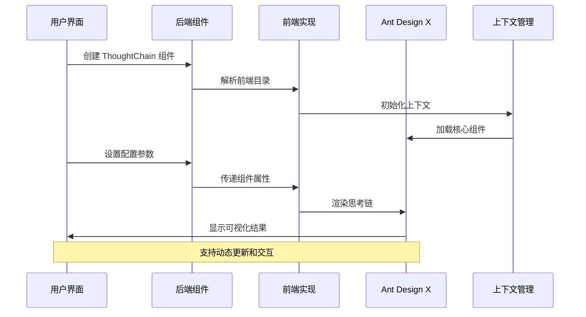
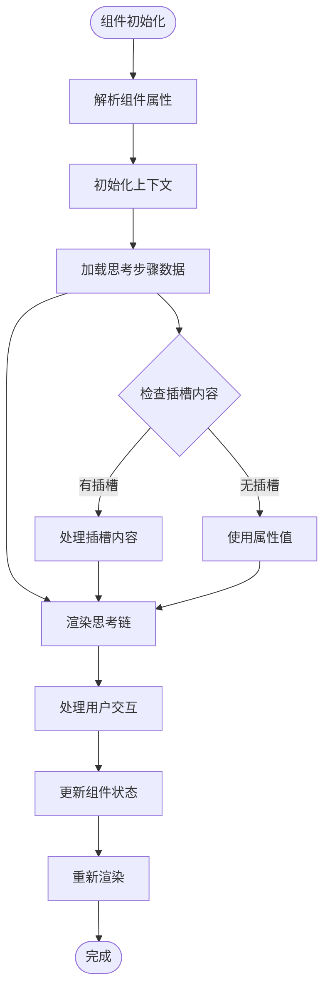
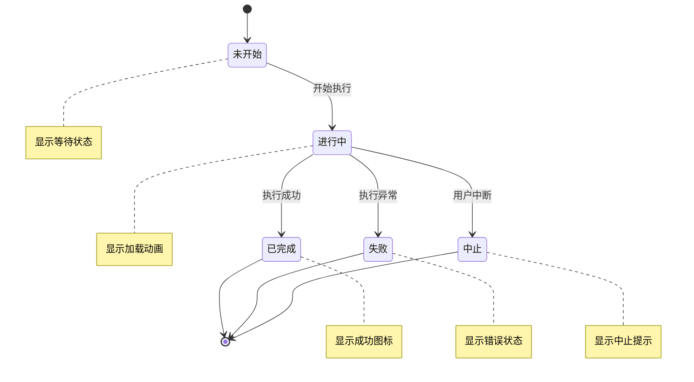
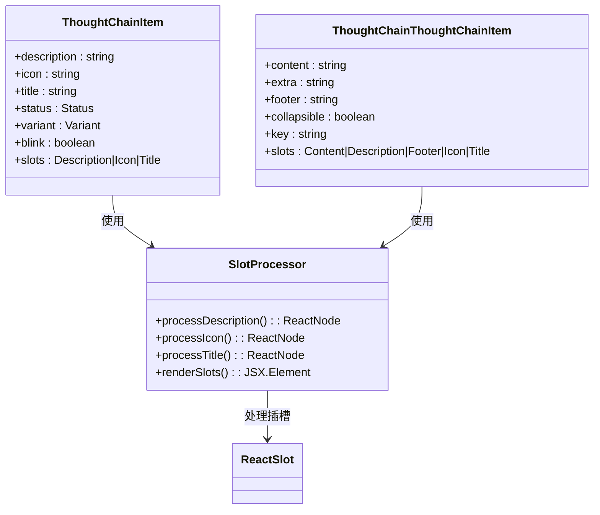

# ThoughtChain 思考链组件

<cite>
**本文档引用的文件**
- [backend 模块导出](file://backend/modelscope_studio/components/antdx/__init__.py)
- [ThoughtChain 主组件定义](file://backend/modelscope_studio/components/antdx/thought_chain/__init__.py)
- [ThoughtChain 子项组件定义](file://backend/modelscope_studio/components/antdx/thought_chain/item/__init__.py)
- [ThoughtChain 高级子项组件定义](file://backend/modelscope_studio/components/antdx/thought_chain/thought_chain_item/__init__.py)
- [前端 ThoughtChain 实现](file://frontend/antdx/thought-chain/thought-chain.tsx)
- [前端 ThoughtChain 子项实现](file://frontend/antdx/thought-chain/item/thought-chain.item.tsx)
- [前端 ThoughtChain 高级子项实现](file://frontend/antdx/thought-chain/thought-chain-item/thought-chain.thought-chain-item.tsx)
- [前端 ThoughtChain 上下文工具](file://frontend/antdx/thought-chain/context.ts)
</cite>

## 目录

1. [简介](#简介)
2. [项目结构](#项目结构)
3. [核心组件](#核心组件)
4. [架构概览](#架构概览)
5. [详细组件分析](#详细组件分析)
6. [依赖关系分析](#依赖关系分析)
7. [性能考虑](#性能考虑)
8. [故障排除指南](#故障排除指南)
9. [结论](#结论)

## 简介

ThoughtChain 思考链组件是 ModelScope Studio 提供的一个强大可视化工具，专门用于记录和展示 AI 的思考过程。该组件通过树形结构清晰地呈现复杂的推理路径，帮助用户理解 AI 决策的逻辑流程。

该组件的核心价值在于：

- **透明性增强**：让用户能够看到 AI 的完整思考过程
- **可解释性提升**：通过可视化的步骤展示提高 AI 行为的可理解性
- **调试支持**：便于开发者和用户追踪和分析 AI 的决策路径
- **用户体验优化**：提供直观的视觉反馈，增强人机交互体验

## 项目结构

ModelScope Studio 采用分层架构设计，ThoughtChain 组件位于 antdx 组件库中，与 Gradio 生态系统深度集成。

```mermaid
graph TB
subgraph "后端 Python 层"
A[Antdx 组件导出] --> B[ThoughtChain 主组件]
A --> C[ThoughtChain 子项组件]
A --> D[ThoughtChain 高级子项组件]
end
subgraph "前端 React 层"
E[ThoughtChain 前端实现]
F[ThoughtChain 子项前端实现]
G[ThoughtChain 高级子项前端实现]
H[上下文工具]
end
subgraph "第三方库"
I[@ant-design/x]
J[Gradio 生态]
end
B --> E
C --> F
D --> G
E --> I
F --> I
G --> I
H --> E
H --> G
E --> J
F --> J
G --> J
```

**图表来源**

- [backend 模块导出:35-41](file://backend/modelscope_studio/components/antdx/__init__.py#L35-L41)
- [ThoughtChain 主组件定义:12-18](file://backend/modelscope_studio/components/antdx/thought_chain/__init__.py#L12-L18)
- [ThoughtChain 子项组件定义:8-11](file://backend/modelscope_studio/components/antdx/thought_chain/item/__init__.py#L8-L11)
- [ThoughtChain 高级子项组件定义:8-11](file://backend/modelscope_studio/components/antdx/thought_chain/thought_chain_item/__init__.py#L8-L11)

**章节来源**

- [backend 模块导出:35-41](file://backend/modelscope_studio/components/antdx/__init__.py#L35-L41)
- [ThoughtChain 主组件定义:12-18](file://backend/modelscope_studio/components/antdx/thought_chain/__init__.py#L12-L18)

## 核心组件

### ThoughtChain 主组件

主组件负责整体布局和状态管理，支持多种配置选项：

**核心配置选项：**

- `expanded_keys`: 默认展开的节点键值列表
- `default_expanded_keys`: 初始默认展开的节点键值列表
- `items`: 思考步骤的数据数组
- `line`: 连接线样式（实线、虚线、点线）
- `prefix_cls`: 自定义前缀类名
- `styles`: 内联样式对象或字符串
- `class_names`: 类名映射对象

**事件处理：**

- `expand`: 展开/折叠键值变化时的回调函数

### ThoughtChainItem 子项组件

用于表示单个思考步骤，支持丰富的自定义选项：

**核心属性：**

- `description`: 步骤描述文本
- `icon`: 自定义图标名称
- `title`: 步骤标题
- `status`: 状态值（pending/pending, success/success, error/错误, abort/中止）
- `variant`: 外观变体（solid/实体, outlined/描边, text/文字）
- `blink`: 是否启用闪烁效果

**插槽支持：**

- `description`: 自定义描述内容
- `icon`: 自定义图标内容
- `title`: 自定义标题内容

### ThoughtChainThoughtChainItem 高级子项组件

提供更复杂的功能，支持嵌套结构：

**扩展属性：**

- `content`: 主要内容文本
- `extra`: 额外信息
- `footer`: 底部内容
- `collapsible`: 是否可折叠
- `key`: 唯一键标识符

**高级插槽：**

- `content`: 主要内容区域
- `description`: 描述内容
- `footer`: 底部内容
- `icon`: 图标内容
- `title`: 标题内容

**章节来源**

- [ThoughtChain 主组件定义:30-67](file://backend/modelscope_studio/components/antdx/thought_chain/__init__.py#L30-L67)
- [ThoughtChain 子项组件定义:18-58](file://backend/modelscope_studio/components/antdx/thought_chain/item/__init__.py#L18-L58)
- [ThoughtChain 高级子项组件定义:18-59](file://backend/modelscope_studio/components/antdx/thought_chain/thought_chain_item/__init__.py#L18-L59)

## 架构概览

ThoughtChain 组件采用前后端分离的架构设计，通过 Gradio 生态系统实现无缝集成。



**图表来源**

- [ThoughtChain 主组件定义:68-68](file://backend/modelscope_studio/components/antdx/thought_chain/__init__.py#L68-L68)
- [前端 ThoughtChain 实现:11-40](file://frontend/antdx/thought-chain/thought-chain.tsx#L11-L40)
- [前端 ThoughtChain 上下文工具:1-4](file://frontend/antdx/thought-chain/context.ts#L1-L4)

## 详细组件分析

### 数据流处理



**图表来源**

- [前端 ThoughtChain 实现:14-35](file://frontend/antdx/thought-chain/thought-chain.tsx#L14-L35)
- [前端 ThoughtChain 子项实现:12-27](file://frontend/antdx/thought-chain/item/thought-chain.item.tsx#L12-L27)

### 状态管理系统

组件支持四种核心状态，每种状态都有特定的视觉表现：



**图表来源**

- [ThoughtChain 子项组件定义:24-25](file://backend/modelscope_studio/components/antdx/thought_chain/item/__init__.py#L24-L25)
- [ThoughtChain 高级子项组件定义:29-30](file://backend/modelscope_studio/components/antdx/thought_chain/thought_chain_item/__init__.py#L29-L30)

### 插槽系统架构



**图表来源**

- [ThoughtChain 子项组件定义:15-16](file://backend/modelscope_studio/components/antdx/thought_chain/item/__init__.py#L15-L16)
- [ThoughtChain 高级子项组件定义:15-16](file://backend/modelscope_studio/components/antdx/thought_chain/thought_chain_item/__init__.py#L15-L16)
- [前端 ThoughtChain 子项实现:18-26](file://frontend/antdx/thought-chain/item/thought-chain.item.tsx#L18-L26)

**章节来源**

- [前端 ThoughtChain 实现:11-40](file://frontend/antdx/thought-chain/thought-chain.tsx#L11-L40)
- [前端 ThoughtChain 子项实现:9-30](file://frontend/antdx/thought-chain/item/thought-chain.item.tsx#L9-L30)
- [前端 ThoughtChain 高级子项实现:7-11](file://frontend/antdx/thought-chain/thought-chain-item/thought-chain.thought-chain-item.tsx#L7-L11)

## 依赖关系分析

### 组件依赖图

```mermaid
graph TB
subgraph "核心依赖"
A[@ant-design/x] --> B[ThoughtChain 核心]
A --> C[ThoughtChain.Item]
A --> D[ThoughtChain.ThoughtChainItem]
end
subgraph "工具依赖"
E[@svelte-preprocess-react] --> F[sveltify 转换]
E --> G[ReactSlot 插槽处理]
H[@utils/renderItems] --> I[项目渲染]
J[@utils/createItemsContext] --> K[上下文管理]
end
subgraph "Gradio 集成"
L[Gradio 事件系统] --> M[EventListener]
N[Gradio 组件系统] --> O[ModelScopeLayoutComponent]
end
B --> E
C --> E
D --> E
B --> L
C --> N
D --> N
E --> H
E --> J
```

**图表来源**

- [前端 ThoughtChain 实现:1-7](file://frontend/antdx/thought-chain/thought-chain.tsx#L1-L7)
- [前端 ThoughtChain 子项实现:1-7](file://frontend/antdx/thought-chain/item/thought-chain.item.tsx#L1-L7)
- [前端 ThoughtChain 高级子项实现:1-3](file://frontend/antdx/thought-chain/thought-chain-item/thought-chain.thought-chain-item.tsx#L1-L3)
- [ThoughtChain 主组件定义:5-8](file://backend/modelscope_studio/components/antdx/thought_chain/__init__.py#L5-L8)

### 版本兼容性

组件设计遵循以下兼容性原则：

- 支持 Gradio 最新版本特性
- 兼容 TypeScript 4.0+ 类型系统
- 适配 React 17+ 和 Svelte 3+ 生态
- 向后兼容 Ant Design X 0.x 版本

**章节来源**

- [ThoughtChain 主组件定义:1-8](file://backend/modelscope_studio/components/antdx/thought_chain/__init__.py#L1-L8)
- [前端 ThoughtChain 实现:1-7](file://frontend/antdx/thought-chain/thought-chain.tsx#L1-L7)

## 性能考虑

### 渲染优化策略

1. **懒加载机制**：使用 `sveltify` 实现按需加载
2. **内存管理**：合理使用 `useMemo` 缓存计算结果
3. **事件处理**：通过 `EventListener` 优化事件绑定
4. **插槽渲染**：延迟渲染插槽内容以减少初始负载

### 最佳实践建议

- **数据预处理**：在传入组件前对数据进行必要的格式化
- **状态最小化**：避免频繁的状态更新触发不必要的重渲染
- **资源管理**：及时清理不再使用的组件实例
- **错误边界**：利用 Gradio 的错误边界机制处理异常情况

## 故障排除指南

### 常见问题及解决方案

**问题 1：组件不显示**

- 检查 `visible` 属性设置
- 确认 `render` 属性为 `true`
- 验证父容器的 CSS 样式

**问题 2：状态显示异常**

- 确认状态值在允许范围内
- 检查 `blink` 属性是否正确配置
- 验证样式类名的正确性

**问题 3：插槽内容不生效**

- 确认插槽名称拼写正确
- 检查插槽内容的类型匹配
- 验证插槽的渲染时机

**章节来源**

- [ThoughtChain 主组件定义:74-85](file://backend/modelscope_studio/components/antdx/thought_chain/__init__.py#L74-L85)
- [前端 ThoughtChain 子项实现:12-27](file://frontend/antdx/thought-chain/item/thought-chain.item.tsx#L12-L27)

## 结论

ThoughtChain 思考链组件为 AI 应用提供了强大的可视化思考过程展示能力。通过精心设计的架构和丰富的配置选项，该组件不仅提升了 AI 的透明度和可信度，还为用户提供了直观的交互体验。

**核心优势总结：**

- **完整的思考过程可视化**：从简单到复杂的多层级展示
- **灵活的配置选项**：满足不同场景下的使用需求
- **良好的性能表现**：优化的渲染机制确保流畅体验
- **完善的错误处理**：健壮的异常处理机制保障稳定性
- **优秀的扩展性**：模块化的架构便于功能扩展和定制

该组件特别适用于需要展示 AI 决策过程的应用场景，如智能客服、数据分析、内容创作等领域，能够显著提升用户对 AI 行为的理解和信任度。
