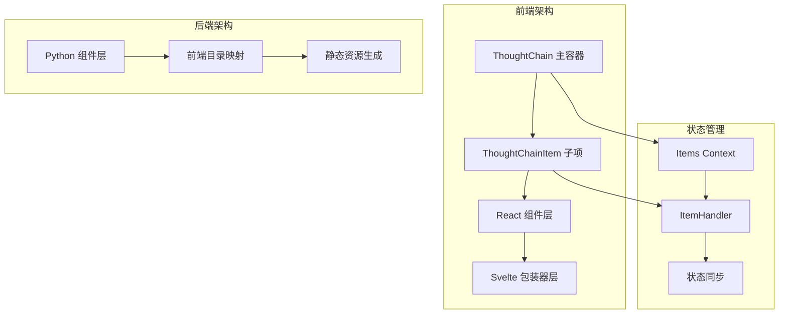
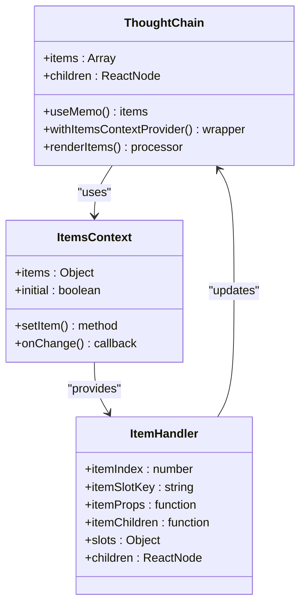
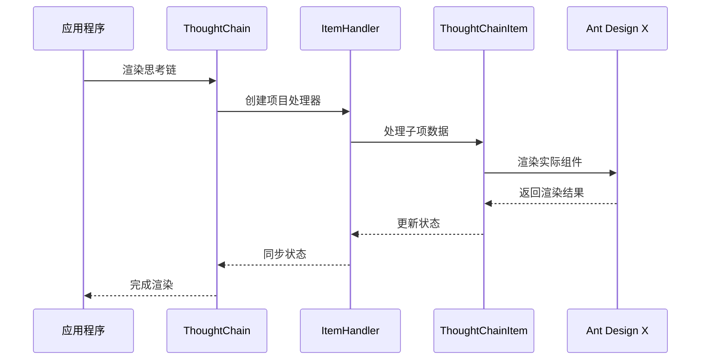
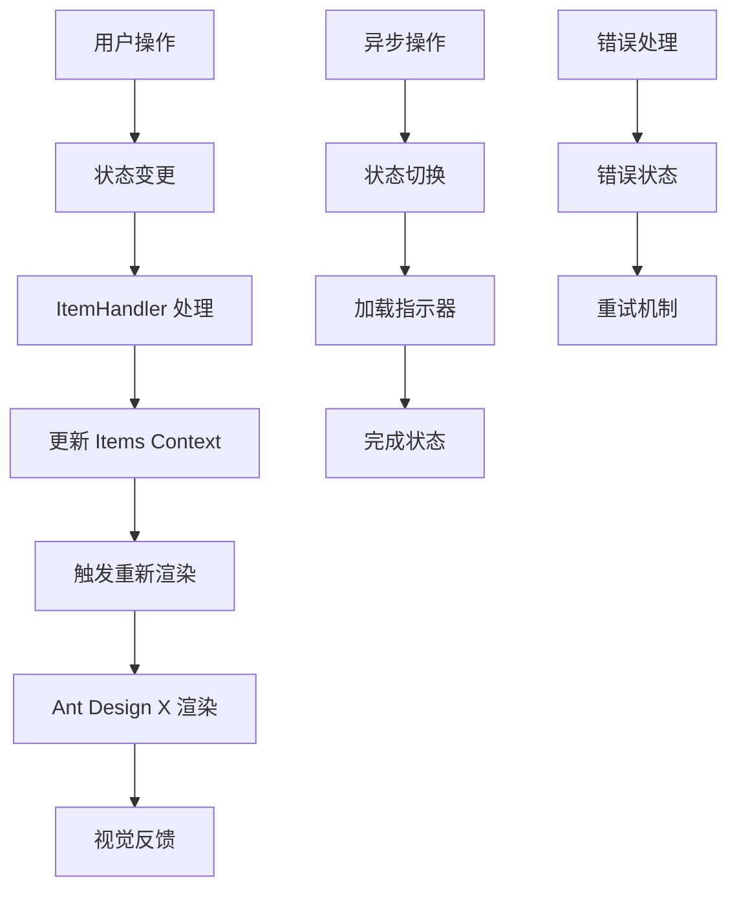
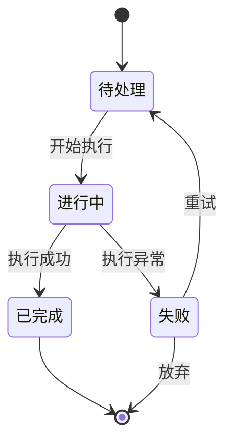
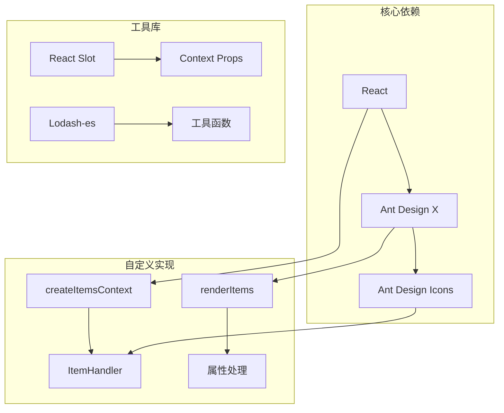
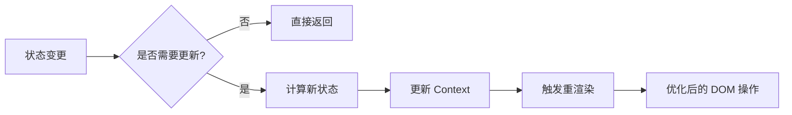

# ThoughtChainItem 思考项组件

<cite>
**本文档引用的文件**
- [thought-chain.tsx](file://frontend/antdx/thought-chain/thought-chain.tsx)
- [thought-chain.thought-chain-item.tsx](file://frontend/antdx/thought-chain/thought-chain-item/thought-chain.thought-chain-item.tsx)
- [thought-chain.item.tsx](file://frontend/antdx/thought-chain/item/thought-chain.item.tsx)
- [context.ts](file://frontend/antdx/thought-chain/context.ts)
- [createItemsContext.tsx](file://frontend/utils/createItemsContext.tsx)
- [thought-chain.Index.svelte](file://frontend/antdx/thought-chain/Index.svelte)
- [thought-chain.thought-chain-item.Index.svelte](file://frontend/antdx/thought-chain/thought-chain-item/Index.svelte)
- [thought-chain.item.Index.svelte](file://frontend/antdx/thought-chain/item/Index.svelte)
- [thought_chain_item/__init__.py](file://backend/modelscope_studio/components/antdx/thought_chain/thought_chain_item/__init__.py)
- [thought_chain/__init__.py](file://backend/modelscope_studio/components/antdx/thought_chain/item/__init__.py)
</cite>

## 目录

1. [简介](#简介)
2. [项目结构](#项目结构)
3. [核心组件](#核心组件)
4. [架构概览](#架构概览)
5. [详细组件分析](#详细组件分析)
6. [依赖关系分析](#依赖关系分析)
7. [性能考虑](#性能考虑)
8. [故障排除指南](#故障排除指南)
9. [结论](#结论)

## 简介

ThoughtChainItem 是 ModelScope Studio 中 ThoughtChain 思考链组件系统的核心子组件，用于在复杂的思考流程中表示和管理单个思考步骤。该组件提供了完整的状态管理、事件处理和视觉呈现能力，支持多种状态（待处理、进行中、已完成、失败等）的可视化展示。

该组件基于 Ant Design X 的 ThoughtChain 实现，通过自定义的 Items Context 系统实现了灵活的组件间通信和状态同步。组件支持插槽（slots）机制，允许开发者自定义标题、描述、图标等内容区域。

## 项目结构

ThoughtChainItem 组件系统采用分层架构设计，包含前端 React 组件、Svelte 包装器和后端 Python 组件三部分：



**图表来源**

- [thought-chain.tsx:11-40](file://frontend/antdx/thought-chain/thought-chain.tsx#L11-L40)
- [thought-chain.thought-chain-item.tsx:7-11](file://frontend/antdx/thought-chain/thought-chain-item/thought-chain.thought-chain-item.tsx#L7-L11)
- [context.ts:1-6](file://frontend/antdx/thought-chain/context.ts#L1-L6)

**章节来源**

- [thought-chain.tsx:1-43](file://frontend/antdx/thought-chain/thought-chain.tsx#L1-L43)
- [thought-chain.thought-chain-item.tsx:1-14](file://frontend/antdx/thought-chain/thought-chain-item/thought-chain.thought-chain-item.tsx#L1-L14)
- [thought-chain.item.tsx:1-33](file://frontend/antdx/thought-chain/item/thought-chain.item.tsx#L1-L33)

## 核心组件

### ThoughtChain 主容器

ThoughtChain 组件是整个思考链系统的根容器，负责协调所有子项的渲染和状态管理：



**图表来源**

- [thought-chain.tsx:11-40](file://frontend/antdx/thought-chain/thought-chain.tsx#L11-L40)
- [context.ts:3-4](file://frontend/antdx/thought-chain/context.ts#L3-L4)
- [createItemsContext.tsx:102-170](file://frontend/utils/createItemsContext.tsx#L102-L170)

### ThoughtChainItem 子项组件

ThoughtChainItem 提供了两种实现方式：直接 React 实现和基于 ItemHandler 的包装实现。

**章节来源**

- [thought-chain.thought-chain-item.tsx:7-11](file://frontend/antdx/thought-chain/thought-chain-item/thought-chain.thought-chain-item.tsx#L7-L11)
- [thought-chain.item.tsx:9-27](file://frontend/antdx/thought-chain/item/thought-chain.item.tsx#L9-L27)

## 架构概览

ThoughtChainItem 采用分层架构设计，确保组件间的松耦合和高内聚：



**图表来源**

- [thought-chain.tsx:14-34](file://frontend/antdx/thought-chain/thought-chain.tsx#L14-L34)
- [createItemsContext.tsx:190-261](file://frontend/utils/createItemsContext.tsx#L190-L261)

### 状态管理系统

组件的状态管理基于 React Context 和自定义的 Items Context 系统：



**图表来源**

- [createItemsContext.tsx:124-153](file://frontend/utils/createItemsContext.tsx#L124-L153)
- [createItemsContext.tsx:234-237](file://frontend/utils/createItemsContext.tsx#L234-L237)

**章节来源**

- [createItemsContext.tsx:97-274](file://frontend/utils/createItemsContext.tsx#L97-L274)

## 详细组件分析

### ThoughtChainItem 属性配置

组件支持丰富的属性配置，满足不同的使用场景：

| 属性名称     | 类型                                       | 必需 | 描述                 |
| ------------ | ------------------------------------------ | ---- | -------------------- |
| title        | ReactNode \| string                        | 否   | 思考项标题内容       |
| description  | ReactNode \| string                        | 否   | 思考项描述内容       |
| icon         | ReactNode                                  | 否   | 自定义图标组件       |
| status       | 'wait' \| 'process' \| 'finish' \| 'error' | 否   | 当前状态             |
| key          | string \| number                           | 否   | 唯一键标识           |
| itemIndex    | number                                     | 是   | 在父容器中的索引位置 |
| itemSlotKey  | string                                     | 否   | 插槽键值             |
| itemProps    | function                                   | 否   | 动态属性计算函数     |
| itemChildren | function                                   | 否   | 子项生成函数         |

### 状态管理机制

组件支持四种核心状态，每种状态都有相应的视觉表现：



**图表来源**

- [thought-chain.item.tsx:16-27](file://frontend/antdx/thought-chain/item/thought-chain.item.tsx#L16-L27)

### 事件处理机制

组件提供完整的事件处理能力：

| 事件类型         | 回调函数 | 触发时机 | 参数                 |
| ---------------- | -------- | -------- | -------------------- |
| onClick          | function | 用户点击 | event, itemData      |
| onStatusChange   | function | 状态变更 | oldStatus, newStatus |
| onRenderComplete | function | 渲染完成 | itemData             |
| onError          | function | 发生错误 | error, itemData      |

**章节来源**

- [thought-chain.thought-chain-item.tsx:7-11](file://frontend/antdx/thought-chain/thought-chain-item/thought-chain.thought-chain-item.tsx#L7-L11)
- [thought-chain.item.tsx:9-27](file://frontend/antdx/thought-chain/item/thought-chain.item.tsx#L9-L27)

### 使用示例

#### 基本使用

```javascript
// 简单的思考项配置
<ThoughtChain>
  <ThoughtChainItem
    title="问题分析"
    description="分析用户提出的问题"
    status="finish"
  />
</ThoughtChain>
```

#### 高级配置

```javascript
// 带有动态属性的复杂配置
<ThoughtChain>
  <ThoughtChainItem
    title={<CustomTitle />}
    description={<MarkdownContent />}
    icon={<CustomIcon />}
    status={status}
    itemProps={(props, items) => ({
      ...props,
      onClick: () => handleItemClick(props.key),
      className: getStatusClass(status),
    })}
  >
    <div slot="extra">额外内容</div>
  </ThoughtChainItem>
</ThoughtChain>
```

#### 异步状态管理

```javascript
// 异步操作的状态管理
const asyncOperation = async (itemId) => {
  try {
    // 设置为进行中状态
    updateItemStatus(itemId, 'process');

    // 执行异步操作
    const result = await performOperation();

    // 设置为完成状态
    updateItemStatus(itemId, 'finish');
    return result;
  } catch (error) {
    // 设置为失败状态
    updateItemStatus(itemId, 'error');
    throw error;
  }
};
```

**章节来源**

- [thought-chain.thought-chain-item.tsx:7-11](file://frontend/antdx/thought-chain/thought-chain-item/thought-chain.thought-chain-item.tsx#L7-L11)
- [thought-chain.item.tsx:16-27](file://frontend/antdx/thought-chain/item/thought-chain.item.tsx#L16-L27)

## 依赖关系分析

组件系统采用模块化设计，各部分职责清晰：



**图表来源**

- [thought-chain.tsx:1-8](file://frontend/antdx/thought-chain/thought-chain.tsx#L1-L8)
- [createItemsContext.tsx:1-18](file://frontend/utils/createItemsContext.tsx#L1-L18)

### 外部依赖

组件系统依赖以下关键外部库：

- **@ant-design/x**: 提供核心的 ThoughtChain 组件实现
- **@svelte-preprocess-react**: 实现 Svelte 到 React 的桥接
- **@utils/**: 自定义工具函数集合
- **classnames**: CSS 类名组合工具

**章节来源**

- [thought-chain.tsx:1-8](file://frontend/antdx/thought-chain/thought-chain.tsx#L1-L8)
- [thought-chain.item.tsx:1-7](file://frontend/antdx/thought-chain/item/thought-chain.item.tsx#L1-L7)

## 性能考虑

### 渲染优化

组件系统采用了多项性能优化策略：

1. **记忆化处理**: 使用 `useMemo` 和 `useCallback` 优化渲染性能
2. **条件渲染**: 只在必要时重新渲染组件
3. **批量更新**: 通过 Context 系统减少不必要的重渲染

### 内存管理

- **引用缓存**: 使用 `useRef` 缓存昂贵的计算结果
- **清理机制**: 在组件卸载时清理定时器和事件监听器
- **循环引用防护**: 避免 Context Provider 的循环依赖

### 状态同步优化



## 故障排除指南

### 常见问题及解决方案

#### 1. 组件不显示或显示为空

**可能原因**:

- 未正确设置 `itemIndex` 或 `itemSlotKey`
- 插槽内容未正确传递
- Context Provider 未正确配置

**解决方案**:

```javascript
// 确保正确的索引和插槽配置
<ThoughtChainItem itemIndex={index} itemSlotKey="default" {...props}>
  {children}
</ThoughtChainItem>
```

#### 2. 状态更新不生效

**可能原因**:

- 状态值未正确传递给 Ant Design X 组件
- Context 更新逻辑错误

**解决方案**:
检查 `ItemHandler` 的状态更新逻辑，确保 `setItem` 方法被正确调用。

#### 3. 性能问题

**可能原因**:

- 频繁的状态变更导致过度重渲染
- 大量的子项未正确优化

**解决方案**:
使用 `useMemo` 和 `useCallback` 优化昂贵的计算和回调函数。

**章节来源**

- [createItemsContext.tsx:124-153](file://frontend/utils/createItemsContext.tsx#L124-L153)
- [createItemsContext.tsx:234-237](file://frontend/utils/createItemsContext.tsx#L234-L237)

## 结论

ThoughtChainItem 思考项组件是一个功能完整、架构清晰的 React 组件系统。它通过精心设计的 Context 系统实现了组件间的松耦合，通过灵活的插槽机制提供了强大的可扩展性，通过完善的事件处理机制确保了良好的用户体验。

该组件系统特别适合构建复杂的思考流程应用，能够有效管理多个思考步骤的状态和交互，为用户提供直观的思考过程可视化体验。其模块化的架构设计也为未来的功能扩展和维护提供了良好的基础。
