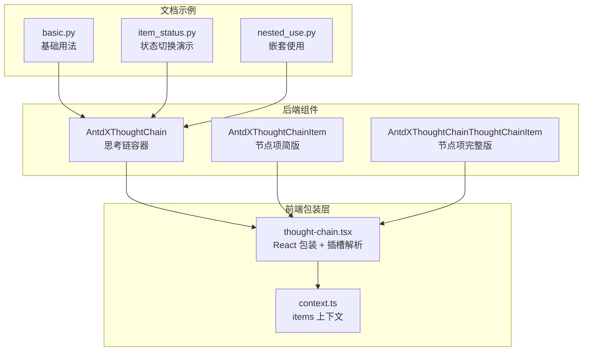
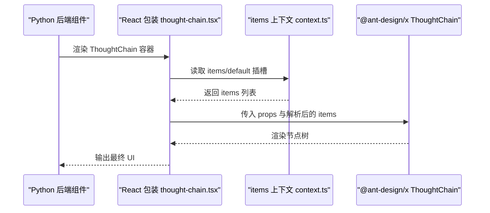
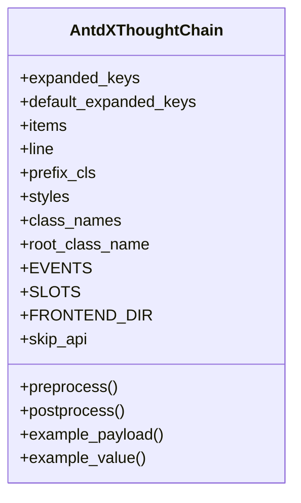
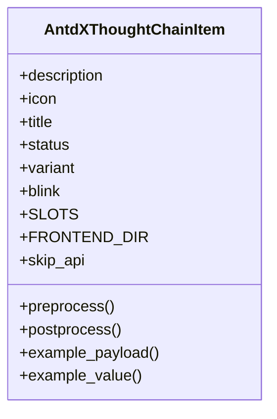
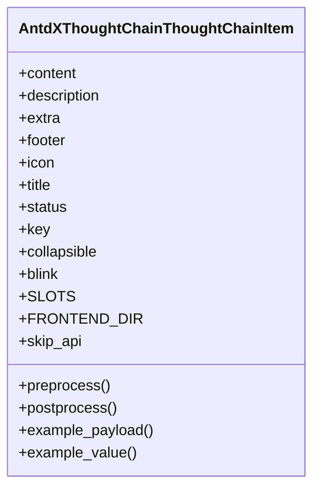
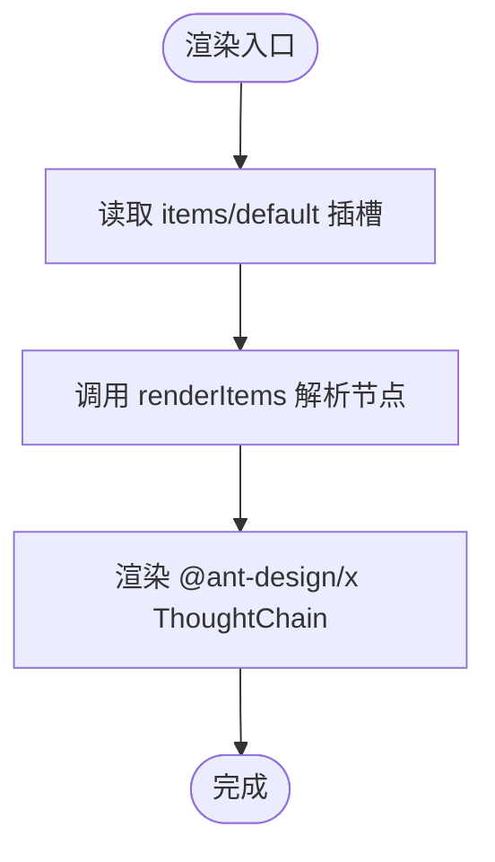
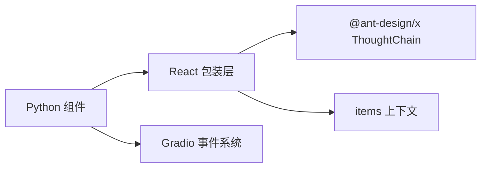

# 确认组件

<cite>
**本文引用的文件**
- [AntdXThoughtChain/__init__.py](file://backend/modelscope_studio/components/antdx/thought_chain/__init__.py)
- [AntdXThoughtChainItem/__init__.py](file://backend/modelscope_studio/components/antdx/thought_chain/item/__init__.py)
- [AntdXThoughtChainThoughtChainItem/__init__.py](file://backend/modelscope_studio/components/antdx/thought_chain/thought_chain_item/__init__.py)
- [thought-chain.tsx](file://frontend/antdx/thought-chain/thought-chain.tsx)
- [context.ts](file://frontend/antdx/thought-chain/context.ts)
- [basic.py](file://docs/components/antdx/thought_chain/demos/basic.py)
- [item_status.py](file://docs/components/antdx/thought_chain/demos/item_status.py)
- [nested_use.py](file://docs/components/antdx/thought_chain/demos/nested_use.py)
</cite>

## 目录

1. [简介](#简介)
2. [项目结构](#项目结构)
3. [核心组件](#核心组件)
4. [架构总览](#架构总览)
5. [详细组件分析](#详细组件分析)
6. [依赖分析](#依赖分析)
7. [性能考虑](#性能考虑)
8. [故障排查指南](#故障排查指南)
9. [结论](#结论)
10. [附录](#附录)

## 简介

本文件面向 Ant Design X 的确认组件（ThoughtChain 思考链）进行系统化技术文档整理，重点覆盖以下方面：

- 思维链的构建与状态管理：如何通过节点项配置状态、可折叠行为以及嵌套结构
- 可视化展示：如何将节点内容、图标、标题、描述、额外操作区与页脚组合呈现
- 配置选项与事件：支持的属性、插槽与事件回调
- 样式与类名定制：如何通过前缀类名、样式对象与根类名进行外观控制
- 使用示例：从基础用法到状态切换、嵌套使用与用户交互
- 价值说明：该组件在提升 AI 透明度与可信度方面的意义

## 项目结构

Ant Design X 的 ThoughtChain 组件由后端 Python 组件与前端 React/Svelte 包装层共同构成，文档示例位于 docs 目录中。

**图表来源**

- [AntdXThoughtChain/**init**.py:12-86](file://backend/modelscope_studio/components/antdx/thought_chain/__init__.py#L12-L86)
- [AntdXThoughtChainItem/**init**.py:8-78](file://backend/modelscope_studio/components/antdx/thought_chain/item/__init__.py#L8-L78)
- [AntdXThoughtChainThoughtChainItem/**init**.py:8-81](file://backend/modelscope_studio/components/antdx/thought_chain/thought_chain_item/__init__.py#L8-L81)
- [thought-chain.tsx:1-43](file://frontend/antdx/thought-chain/thought-chain.tsx#L1-L43)
- [context.ts:1-7](file://frontend/antdx/thought-chain/context.ts#L1-L7)
- [basic.py:24-77](file://docs/components/antdx/thought_chain/demos/basic.py#L24-L77)
- [item_status.py:36-71](file://docs/components/antdx/thought_chain/demos/item_status.py#L36-L71)
- [nested_use.py:6-68](file://docs/components/antdx/thought_chain/demos/nested_use.py#L6-L68)

**章节来源**

- [AntdXThoughtChain/**init**.py:12-86](file://backend/modelscope_studio/components/antdx/thought_chain/__init__.py#L12-L86)
- [thought-chain.tsx:1-43](file://frontend/antdx/thought-chain/thought-chain.tsx#L1-L43)

## 核心组件

- 容器组件：AntdXThoughtChain
  - 职责：作为思考链的根容器，负责接收节点列表、展开键、线条样式、前缀类名等配置；通过事件绑定实现展开状态变更通知
  - 关键能力：支持插槽 items；事件 expand；可配置默认展开键与当前展开键
- 节点项组件（简版）：AntdXThoughtChainItem
  - 职责：承载单个节点的基本信息与外观，支持标题、描述、图标、状态、变体与闪烁效果
  - 关键能力：支持 description、icon、title 插槽；状态枚举（pending/success/error/abort）
- 节点项组件（完整版）：AntdXThoughtChainThoughtChainItem
  - 职责：承载更丰富的节点内容，支持 content、description、footer、icon、title 插槽，以及 key、collapsible、status 等属性
  - 关键能力：支持折叠/展开、状态切换、额外操作区

**章节来源**

- [AntdXThoughtChain/**init**.py:12-86](file://backend/modelscope_studio/components/antdx/thought_chain/__init__.py#L12-L86)
- [AntdXThoughtChainItem/**init**.py:8-78](file://backend/modelscope_studio/components/antdx/thought_chain/item/__init__.py#L8-L78)
- [AntdXThoughtChainThoughtChainItem/**init**.py:8-81](file://backend/modelscope_studio/components/antdx/thought_chain/thought_chain_item/__init__.py#L8-L81)

## 架构总览

前端包装层将后端组件映射为 React 组件，统一解析插槽并传递给 @ant-design/x 的 ThoughtChain 实现，同时通过上下文机制收集 items 插槽内容。

**图表来源**

- [thought-chain.tsx:11-40](file://frontend/antdx/thought-chain/thought-chain.tsx#L11-L40)
- [context.ts:1-7](file://frontend/antdx/thought-chain/context.ts#L1-L7)

## 详细组件分析

### 容器组件：AntdXThoughtChain

- 主要职责
  - 接收 items 列表与展开键配置，决定初始展开状态
  - 支持事件 expand，用于监听展开键变化
  - 提供插槽 items，便于以声明式方式组织节点
- 关键属性
  - expanded_keys / default_expanded_keys：当前展开键与默认展开键
  - items：节点数据数组
  - line：连线样式（布尔或线型枚举）
  - prefix_cls：前缀类名
  - styles / class_names / root_class_name：样式与类名定制
- 事件
  - expand：展开键变更时触发
- 生命周期
  - preprocess/postprocess/example\_\* 均返回空值，表明该组件不参与数据序列化

**图表来源**

- [AntdXThoughtChain/**init**.py:30-86](file://backend/modelscope_studio/components/antdx/thought_chain/__init__.py#L30-L86)

**章节来源**

- [AntdXThoughtChain/**init**.py:12-86](file://backend/modelscope_studio/components/antdx/thought_chain/__init__.py#L12-L86)

### 节点项组件（简版）：AntdXThoughtChainItem

- 主要职责
  - 表达单个思考节点的标题、描述、图标与状态
  - 支持多种外观变体与闪烁效果
- 关键属性
  - description / icon / title：节点基本信息
  - status：节点状态（pending/success/error/abort）
  - variant：外观变体（solid/outlined/text）
  - blink：是否闪烁
  - 插槽：description、icon、title
- 生命周期
  - 与容器组件一致，不参与数据序列化

**图表来源**

- [AntdXThoughtChainItem/**init**.py:18-78](file://backend/modelscope_studio/components/antdx/thought_chain/item/__init__.py#L18-L78)

**章节来源**

- [AntdXThoughtChainItem/**init**.py:8-78](file://backend/modelscope_studio/components/antdx/thought_chain/item/__init__.py#L8-L78)

### 节点项组件（完整版）：AntdXThoughtChainThoughtChainItem

- 主要职责
  - 承载更丰富的节点内容，支持 content、footer、extra 等插槽
  - 支持 key、collapsible、status 等属性，便于复杂交互与状态管理
- 关键属性
  - content / description / footer / icon / title：内容与装饰
  - key：节点唯一标识
  - collapsible：是否可折叠
  - status：节点状态
  - 插槽：content、description、footer、icon、title
- 生命周期
  - 与容器组件一致，不参与数据序列化

**图表来源**

- [AntdXThoughtChainThoughtChainItem/**init**.py:18-81](file://backend/modelscope_studio/components/antdx/thought_chain/thought_chain_item/__init__.py#L18-L81)

**章节来源**

- [AntdXThoughtChainThoughtChainItem/**init**.py:8-81](file://backend/modelscope_studio/components/antdx/thought_chain/thought_chain_item/__init__.py#L8-L81)

### 前端包装与插槽解析

- thought-chain.tsx
  - 将 @ant-design/x 的 ThoughtChain 以 sveltify 方式包装
  - 使用 withItemsContextProvider 与 useItems 解析 items/default 插槽
  - 通过 renderItems 将插槽内容转换为 props.items
- context.ts
  - 提供 items 上下文，支持嵌套场景下的插槽收集

**图表来源**

- [thought-chain.tsx:11-40](file://frontend/antdx/thought-chain/thought-chain.tsx#L11-L40)
- [context.ts:1-7](file://frontend/antdx/thought-chain/context.ts#L1-L7)

**章节来源**

- [thought-chain.tsx:1-43](file://frontend/antdx/thought-chain/thought-chain.tsx#L1-L43)
- [context.ts:1-7](file://frontend/antdx/thought-chain/context.ts#L1-L7)

### 使用示例与场景

#### 基础用法与可折叠行为

- 示例要点
  - 在 XProvider 下创建 ThoughtChain 容器
  - 使用 Switch 控制 collapsible 属性，动态切换节点可折叠性
  - 通过 Slot 注入 extra/content/footer，实现丰富节点内容
- 适用场景
  - 展示多步骤任务的执行流程与当前状态
  - 提供节点级操作按钮与补充信息

**章节来源**

- [basic.py:24-77](file://docs/components/antdx/thought_chain/demos/basic.py#L24-L77)

#### 节点状态切换（成功/错误/进行中）

- 示例要点
  - 使用 Each 动态生成节点列表
  - 通过按钮点击逐步更新节点状态与图标，模拟真实运行状态
  - 支持 pending/error/success 三种状态的视觉反馈
- 适用场景
  - 展示 AI 推理过程中的阶段性结果
  - 增强用户对执行进度与结果的信心

**章节来源**

- [item_status.py:36-71](file://docs/components/antdx/thought_chain/demos/item_status.py#L36-L71)

#### 嵌套使用（子思考链）

- 示例要点
  - 在父级 ThoughtChain 的节点内容中嵌套另一个 ThoughtChain
  - 子级节点同样支持 extra/content/footer 等插槽
- 适用场景
  - 复杂任务拆分为多个子任务，逐层细化
  - 展示层级化的决策或推理链条

**章节来源**

- [nested_use.py:6-68](file://docs/components/antdx/thought_chain/demos/nested_use.py#L6-L68)

## 依赖分析

- 组件耦合
  - 容器与节点项均继承自 ModelScopeLayoutComponent，共享统一的生命周期与属性体系
  - 前端包装层仅负责插槽解析与属性透传，不引入业务逻辑
- 外部依赖
  - @ant-design/x 的 ThoughtChain 提供实际渲染能力
  - Gradio 事件系统用于 expand 事件绑定
- 潜在风险
  - 插槽名称与顺序需严格匹配，否则渲染异常
  - items 列表为空时，应确保 fallback 到 default 插槽

**图表来源**

- [AntdXThoughtChain/**init**.py:20-25](file://backend/modelscope_studio/components/antdx/thought_chain/__init__.py#L20-L25)
- [thought-chain.tsx:11-40](file://frontend/antdx/thought-chain/thought-chain.tsx#L11-L40)

**章节来源**

- [AntdXThoughtChain/**init**.py:20-25](file://backend/modelscope_studio/components/antdx/thought_chain/__init__.py#L20-L25)
- [thought-chain.tsx:11-40](file://frontend/antdx/thought-chain/thought-chain.tsx#L11-L40)

## 性能考虑

- 渲染优化
  - 使用 useMemo 缓存 items 计算结果，避免不必要的重渲染
  - 通过插槽懒加载与条件渲染减少 DOM 数量
- 数据流
  - items 列表建议保持稳定引用，配合 key 字段提升 diff 效率
- 交互体验
  - 对于大量节点的场景，优先使用可折叠与分步加载策略

## 故障排查指南

- 症状：节点未显示或显示为空
  - 检查 items 是否正确传入或 default 插槽是否填充
  - 确认插槽名称大小写与文档一致
- 症状：expand 事件无效
  - 确认事件绑定是否启用（bind_expand_event）
  - 检查容器是否处于可交互状态
- 症状：嵌套 ThoughtChain 不生效
  - 确保父级节点的 content 插槽内正确嵌套子级 ThoughtChain
  - 检查子级 ThoughtChain 的插槽是否正确声明

## 结论

Ant Design X 的 ThoughtChain 组件通过“容器 + 节点项”的分层设计，结合前端插槽解析与 @ant-design/x 的渲染能力，实现了对 AI 思考过程的结构化记录与可视化展示。其状态驱动的节点外观、灵活的插槽扩展与可折叠交互，能够有效提升用户对复杂推理流程的理解与信任。配合文档示例，开发者可以快速搭建从基础流程到嵌套子链的多种应用场景。

## 附录

### API 速查表

- 容器组件 AntdXThoughtChain
  - 属性：expanded_keys、default_expanded_keys、items、line、prefix_cls、styles、class_names、root_class_name
  - 事件：expand
  - 插槽：items
- 节点项组件（简版）AntdXThoughtChainItem
  - 属性：description、icon、title、status、variant、blink
  - 插槽：description、icon、title
- 节点项组件（完整版）AntdXThoughtChainThoughtChainItem
  - 属性：content、description、extra、footer、icon、title、status、key、collapsible、blink
  - 插槽：content、description、footer、icon、title

### 使用建议

- 透明度与可信度
  - 通过清晰的状态与图标提示，帮助用户理解每一步的执行结果
  - 对关键决策点提供额外说明与可操作入口，增强可控感
- 可访问性
  - 为图标与状态提供可读性替代文本
  - 保证键盘可访问与屏幕阅读器友好
