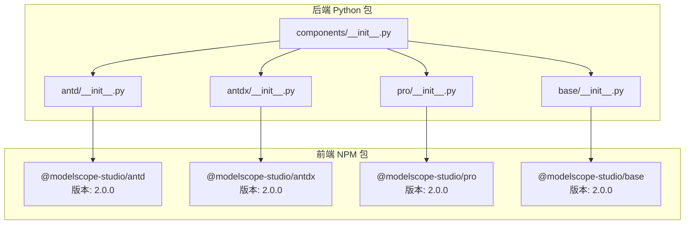
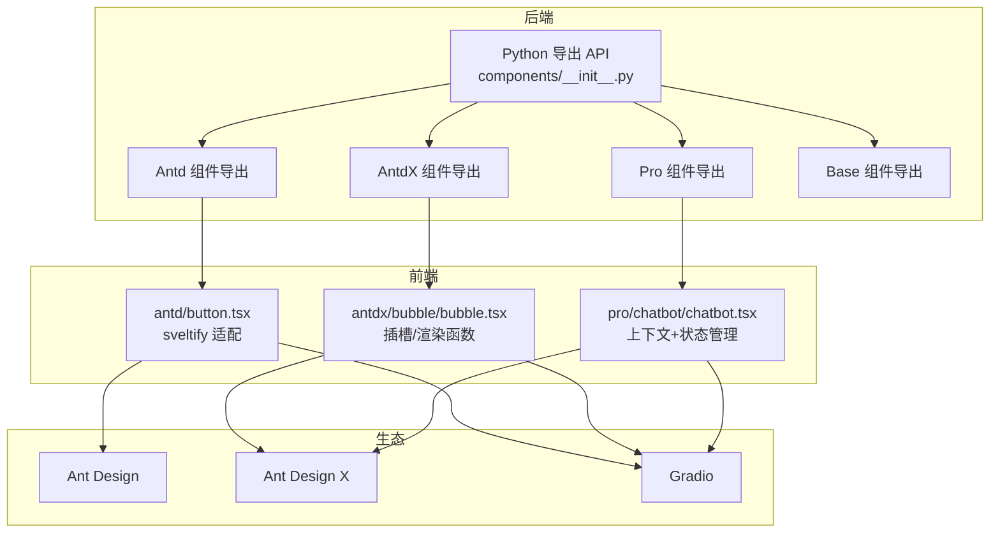
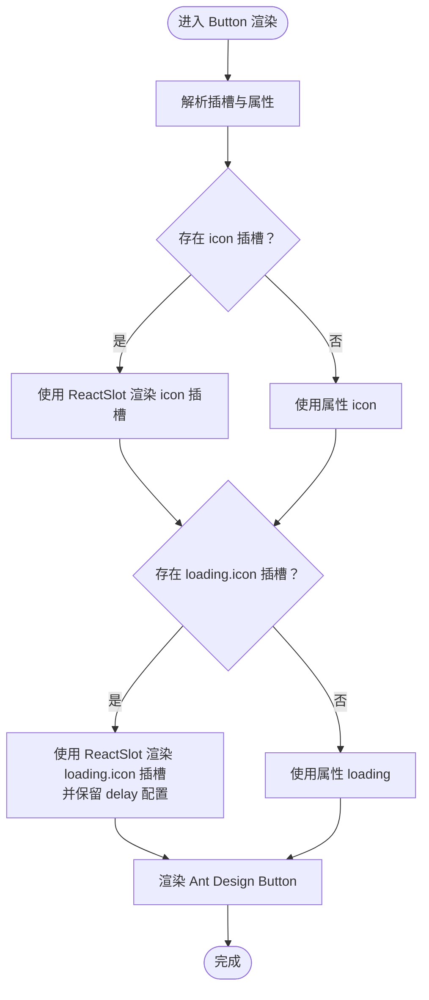
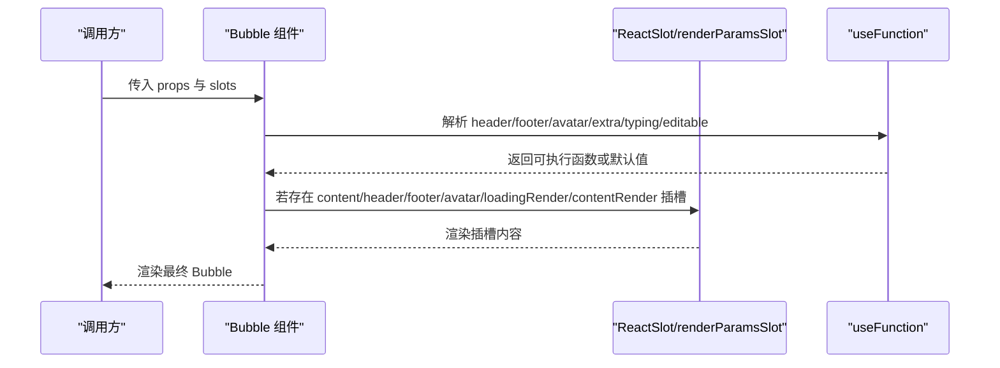
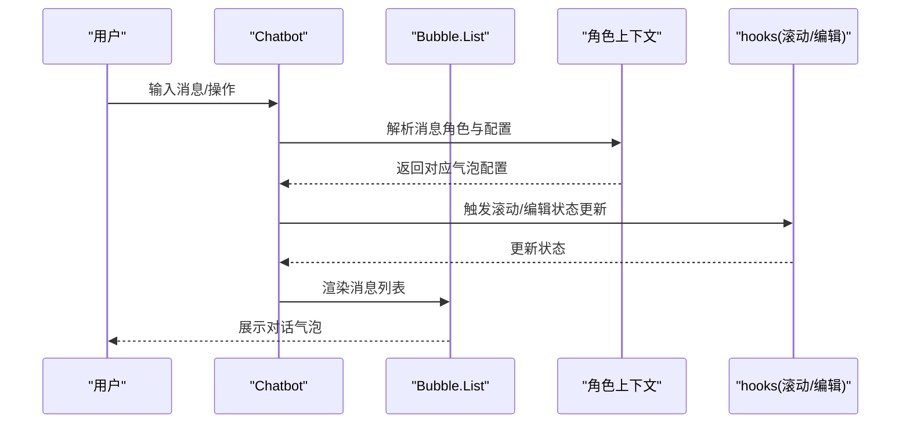
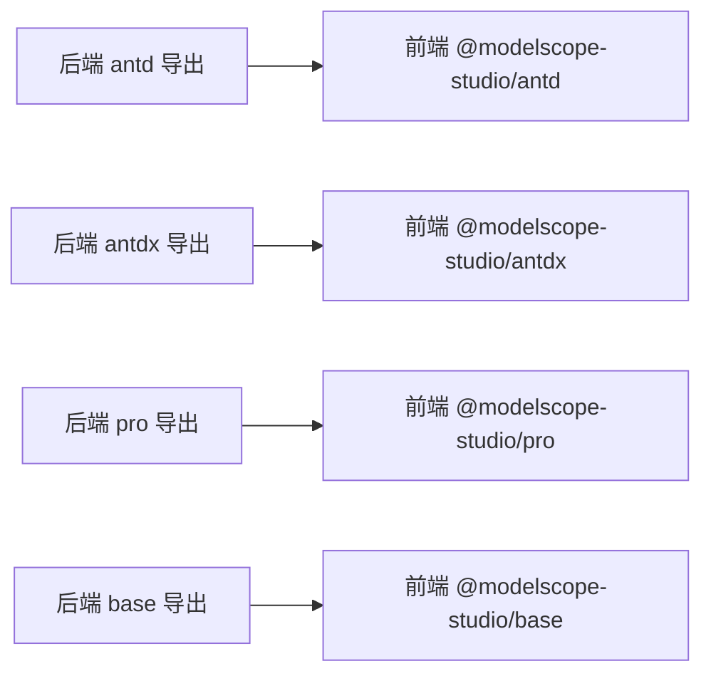

# 组件概览

<cite>
**本文引用的文件**
- [README-zh_CN.md](file://README-zh_CN.md)
- [backend/modelscope_studio/version.py](file://backend/modelscope_studio/version.py)
- [backend/modelscope_studio/components/__init__.py](file://backend/modelscope_studio/components/__init__.py)
- [backend/modelscope_studio/components/antd/__init__.py](file://backend/modelscope_studio/components/antd/__init__.py)
- [backend/modelscope_studio/components/antdx/__init__.py](file://backend/modelscope_studio/components/antdx/__init__.py)
- [backend/modelscope_studio/components/pro/__init__.py](file://backend/modelscope_studio/components/pro/__init__.py)
- [backend/modelscope_studio/components/antd/components.py](file://backend/modelscope_studio/components/antd/components.py)
- [backend/modelscope_studio/components/antdx/components.py](file://backend/modelscope_studio/components/antdx/components.py)
- [backend/modelscope_studio/components/base/__init__.py](file://backend/modelscope_studio/components/base/__init__.py)
- [backend/modelscope_studio/components/pro/components.py](file://backend/modelscope_studio/components/pro/components.py)
- [frontend/antd/package.json](file://frontend/antd/package.json)
- [frontend/antdx/package.json](file://frontend/antdx/package.json)
- [frontend/base/package.json](file://frontend/base/package.json)
- [frontend/pro/package.json](file://frontend/pro/package.json)
- [frontend/antd/button/button.tsx](file://frontend/antd/button/button.tsx)
- [frontend/antdx/bubble/bubble.tsx](file://frontend/antdx/bubble/bubble.tsx)
- [frontend/pro/chatbot/chatbot.tsx](file://frontend/pro/chatbot/chatbot.tsx)
</cite>

## 目录

1. [简介](#简介)
2. [项目结构](#项目结构)
3. [核心组件](#核心组件)
4. [架构总览](#架构总览)
5. [详细组件分析](#详细组件分析)
6. [依赖关系分析](#依赖关系分析)
7. [性能考虑](#性能考虑)
8. [故障排查指南](#故障排查指南)
9. [结论](#结论)
10. [附录](#附录)

## 简介

Ant Design X 组件库是面向机器学习与大模型应用场景的增强型 UI 组件体系，基于 Gradio 构建，提供更灵活的布局能力、更丰富的交互形态以及针对对话、可视化、多模态输入等 AI 场景的专用组件。其核心目标是在保持易用性的同时，显著提升 AI 应用的用户体验与开发效率。

- 设计理念
  - 以“可组合、可扩展、可定制”为核心，覆盖从基础控件到专业场景组件的全栈能力。
  - 面向 AI 应用的交互范式（如对话气泡、思维链、提示词工程、文件卡片、思维导图等）进行深度优化。
  - 与 Ant Design 和 Ant Design X 生态无缝衔接，复用成熟的设计语言与交互规范。

- 价值定位
  - 提升 AI 应用界面的专业度与一致性，降低从原型到上线的成本。
  - 通过专用组件（如聊天气泡、思维链、代码高亮、Mermaid 图表等）直接解决典型业务痛点。
  - 与 Gradio 生态兼容，既可独立使用，也可与传统组件混合搭配。

**章节来源**

- [README-zh_CN.md:17-32](file://README-zh_CN.md#L17-L32)

## 项目结构

该项目采用前后端分离的多包组织方式，后端 Python 包负责组件导出与生态桥接，前端以 Svelte/React 混编方式封装 Ant Design/Ant Design X 组件，并通过统一的 sveltify 工具适配为 Gradio 可用的组件。

**图表来源**

- [backend/modelscope_studio/components/**init**.py:1-5](file://backend/modelscope_studio/components/__init__.py#L1-L5)
- [backend/modelscope_studio/components/antd/**init**.py:1-150](file://backend/modelscope_studio/components/antd/__init__.py#L1-L150)
- [backend/modelscope_studio/components/antdx/**init**.py:1-42](file://backend/modelscope_studio/components/antdx/__init__.py#L1-L42)
- [backend/modelscope_studio/components/pro/**init**.py:1-7](file://backend/modelscope_studio/components/pro/__init__.py#L1-L7)
- [backend/modelscope_studio/components/base/**init**.py:1-11](file://backend/modelscope_studio/components/base/__init__.py#L1-L11)
- [frontend/antd/package.json:1-6](file://frontend/antd/package.json#L1-L6)
- [frontend/antdx/package.json:1-6](file://frontend/antdx/package.json#L1-L6)
- [frontend/pro/package.json:1-6](file://frontend/pro/package.json#L1-L6)
- [frontend/base/package.json:1-6](file://frontend/base/package.json#L1-L6)

**章节来源**

- [backend/modelscope_studio/components/**init**.py:1-5](file://backend/modelscope_studio/components/__init__.py#L1-L5)
- [backend/modelscope_studio/version.py:1-2](file://backend/modelscope_studio/version.py#L1-L2)
- [frontend/antd/package.json:1-6](file://frontend/antd/package.json#L1-L6)
- [frontend/antdx/package.json:1-6](file://frontend/antdx/package.json#L1-L6)
- [frontend/pro/package.json:1-6](file://frontend/pro/package.json#L1-L6)
- [frontend/base/package.json:1-6](file://frontend/base/package.json#L1-L6)

## 核心组件

- 基础层（Base）
  - 提供通用容器、文本、插槽、循环、过滤等基础能力，支撑复杂布局与条件渲染。
  - 典型组件：Application、AutoLoading、Div、Each、Filter、Fragment、Markdown、Slot、Span、Text。

- Ant Design（Antd）
  - 覆盖 Ant Design 的完整组件族，包括按钮、表单、布局、导航、反馈、展示、编辑器等。
  - 支持嵌套子组件（如 Button.Group、Form.Item、Tree.TreeNode 等），便于构建复杂表单与树形结构。

- Ant Design X（AntdX）
  - 专为 AI 场景打造的高级组件，如对话气泡、思维链、提示词、文件卡片、Mermaid 图等。
  - 强调内容可编辑、可渲染、可交互，适合 LLM 应用的动态内容呈现与编辑。

- Pro（Pro）
  - 面向专业场景的一体化组件集合，如 Chatbot、Monaco Editor、Multimodal Input、Web Sandbox。
  - 将多个子组件与上下文整合，提供开箱即用的 AI 应用骨架。

**章节来源**

- [backend/modelscope_studio/components/base/**init**.py:1-11](file://backend/modelscope_studio/components/base/__init__.py#L1-L11)
- [backend/modelscope_studio/components/antd/**init**.py:1-150](file://backend/modelscope_studio/components/antd/__init__.py#L1-L150)
- [backend/modelscope_studio/components/antdx/**init**.py:1-42](file://backend/modelscope_studio/components/antdx/__init__.py#L1-L42)
- [backend/modelscope_studio/components/pro/**init**.py:1-7](file://backend/modelscope_studio/components/pro/__init__.py#L1-L7)

## 架构总览

整体架构由“后端组件导出 + 前端适配层 + 生态集成”三部分组成。后端通过 Python 包聚合各子模块并统一导出；前端以 Svelte/React 混编方式封装原生组件，并通过 sveltify 将 React 组件桥接到 Svelte/Gradio 环境；同时提供工具函数与上下文，实现插槽、渲染函数、事件回调等高级能力。

**图表来源**

- [backend/modelscope_studio/components/**init**.py:1-5](file://backend/modelscope_studio/components/__init__.py#L1-L5)
- [backend/modelscope_studio/components/antd/components.py:1-144](file://backend/modelscope_studio/components/antd/components.py#L1-L144)
- [backend/modelscope_studio/components/antdx/components.py:1-40](file://backend/modelscope_studio/components/antdx/components.py#L1-L40)
- [backend/modelscope_studio/components/pro/components.py:1-8](file://backend/modelscope_studio/components/pro/components.py#L1-L8)
- [frontend/antd/button/button.tsx:1-39](file://frontend/antd/button/button.tsx#L1-L39)
- [frontend/antdx/bubble/bubble.tsx:1-119](file://frontend/antdx/bubble/bubble.tsx#L1-L119)
- [frontend/pro/chatbot/chatbot.tsx:1-475](file://frontend/pro/chatbot/chatbot.tsx#L1-L475)

## 详细组件分析

### Antd Button 组件（基础控件）

- 设计要点
  - 使用 sveltify 将 Ant Design 的 Button 适配为 Svelte/Gradio 组件。
  - 支持插槽（如 icon、loading.icon）与值绑定（value），自动处理 children 与受控值的优先级。
  - 对 loading 的延迟配置进行兼容处理，确保与 slots 的组合使用。

**图表来源**

- [frontend/antd/button/button.tsx:8-36](file://frontend/antd/button/button.tsx#L8-L36)

**章节来源**

- [frontend/antd/button/button.tsx:1-39](file://frontend/antd/button/button.tsx#L1-L39)

### AntdX Bubble 组件（AI 场景）

- 设计要点
  - 基于 Ant Design X 的 Bubble，提供头像、内容、底部、额外区域、加载渲染、内容渲染等多插槽。
  - 支持 editable 的 okText/cancelText 插槽与布尔开关，typing、header/footer/avatar/extra 等函数式配置。
  - 通过 useFunction 与 renderParamsSlot 将插槽转换为可执行函数，增强可编程性。

**图表来源**

- [frontend/antdx/bubble/bubble.tsx:14-116](file://frontend/antdx/bubble/bubble.tsx#L14-L116)

**章节来源**

- [frontend/antdx/bubble/bubble.tsx:1-119](file://frontend/antdx/bubble/bubble.tsx#L1-L119)

### Pro Chatbot 组件（对话场景）

- 设计要点
  - 基于 Ant Design X 的 Bubble.List，结合自定义上下文与 hooks 实现滚动、编辑、复制、点赞、重试、欢迎语等能力。
  - 通过 useRole 将不同角色（用户、助手、内部欢迎）映射为对应的气泡样式与行为。
  - 内置 Markdown 渲染、主题模式、根路径传递等配置，满足多模态内容展示需求。

**图表来源**

- [frontend/pro/chatbot/chatbot.tsx:76-472](file://frontend/pro/chatbot/chatbot.tsx#L76-L472)

**章节来源**

- [frontend/pro/chatbot/chatbot.tsx:1-475](file://frontend/pro/chatbot/chatbot.tsx#L1-L475)

## 依赖关系分析

- 版本与命名空间
  - 所有前端包均使用统一的版本号（2.0.0），命名空间为 @modelscope-studio，便于发布与管理。
- 组件导出与分组
  - 后端按功能域导出：antd、antdx、pro、base，分别对应 Ant Design 组件族、AI 专用组件、专业场景组件、基础能力。
- 前后端映射
  - 每个后端导出模块对应一个前端包，形成稳定的映射关系，保证组件名与生态一致。

**图表来源**

- [backend/modelscope_studio/components/antd/**init**.py:1-150](file://backend/modelscope_studio/components/antd/__init__.py#L1-L150)
- [backend/modelscope_studio/components/antdx/**init**.py:1-42](file://backend/modelscope_studio/components/antdx/__init__.py#L1-L42)
- [backend/modelscope_studio/components/pro/**init**.py:1-7](file://backend/modelscope_studio/components/pro/__init__.py#L1-L7)
- [backend/modelscope_studio/components/base/**init**.py:1-11](file://backend/modelscope_studio/components/base/__init__.py#L1-L11)
- [frontend/antd/package.json:1-6](file://frontend/antd/package.json#L1-L6)
- [frontend/antdx/package.json:1-6](file://frontend/antdx/package.json#L1-L6)
- [frontend/pro/package.json:1-6](file://frontend/pro/package.json#L1-L6)
- [frontend/base/package.json:1-6](file://frontend/base/package.json#L1-L6)

**章节来源**

- [backend/modelscope_studio/components/**init**.py:1-5](file://backend/modelscope_studio/components/__init__.py#L1-L5)
- [backend/modelscope_studio/version.py:1-2](file://backend/modelscope_studio/version.py#L1-L2)

## 性能考虑

- 渲染与插槽
  - 通过插槽与渲染函数的组合，避免不必要的重复渲染；仅在插槽存在时才进行参数化渲染。
- 状态与计算
  - 使用 useMemo 与 useMemoizedFn 缓存配置与回调，减少无效重渲染与对象创建。
- 滚动与交互
  - 对滚动、编辑、点赞等高频交互使用局部状态与节流策略，保证流畅体验。

[本节为通用指导，无需特定文件引用]

## 故障排查指南

- 页面未正确显示（Hugging Face Space）
  - 在 demo.launch() 中添加 ssr_mode=False 参数，避免服务端渲染导致的显示问题。
- 组件导入失败
  - 确认已安装 modelscope_studio 并正确引入 modelscope_studio.components.\* 命名空间。
- 版本不匹配
  - 检查后端与前端包版本是否一致，避免因版本差异导致的运行时错误。

**章节来源**

- [README-zh_CN.md:32-32](file://README-zh_CN.md#L32-L32)
- [README-zh_CN.md:38-42](file://README-zh_CN.md#L38-L42)
- [backend/modelscope_studio/version.py:1-2](file://backend/modelscope_studio/version.py#L1-L2)

## 结论

Ant Design X 组件库通过“基础控件 + AI 专用组件 + 专业场景组件”的三层架构，系统性提升了机器学习与大模型应用的界面表达力与交互效率。其以 Gradio 为入口、以 Ant Design/Ant Design X 为基石、以前端适配层为桥梁，形成了稳定、可扩展、易维护的组件体系。开发者可借助该库快速搭建高质量的 AI 应用界面，并在对话、可视化、多模态输入等场景中获得一致而专业的用户体验。

[本节为总结性内容，无需特定文件引用]

## 附录

### 快速开始

- 安装
  - 使用 pip 安装 modelscope_studio。
- 示例
  - 在 Blocks 中引入 modelscope_studio 的 Application、ConfigProvider、AutoLoading，并使用 antd 组件进行布局与交互。

**章节来源**

- [README-zh_CN.md:38-57](file://README-zh_CN.md#L38-L57)

### 组件分类与使用场景

- 基础层（Base）
  - 场景：通用布局、条件渲染、文本与插槽管理。
  - 典型：Application、AutoLoading、Markdown、Slot、Text、Span、Div、Each、Filter、Fragment。
- Ant Design（Antd）
  - 场景：表单、导航、反馈、展示、布局等通用 UI。
  - 典型：Button、Form、Layout、Menu、Modal、Table、Tabs、Tree、Upload 等。
- Ant Design X（AntdX）
  - 场景：对话气泡、思维链、提示词、文件卡片、Mermaid 图等 AI 专属交互。
  - 典型：Bubble、Conversations、Sender、ThoughtChain、Prompts、Attachments、Mermaid、Notification、Welcome、XProvider。
- Pro（Pro）
  - 场景：一体化 AI 应用骨架，如聊天机器人、代码编辑器、多模态输入、Web 沙盒。
  - 典型：Chatbot、MonacoEditor、MultimodalInput、WebSandbox。

**章节来源**

- [backend/modelscope_studio/components/base/**init**.py:1-11](file://backend/modelscope_studio/components/base/__init__.py#L1-L11)
- [backend/modelscope_studio/components/antd/**init**.py:1-150](file://backend/modelscope_studio/components/antd/__init__.py#L1-L150)
- [backend/modelscope_studio/components/antdx/**init**.py:1-42](file://backend/modelscope_studio/components/antdx/__init__.py#L1-L42)
- [backend/modelscope_studio/components/pro/**init**.py:1-7](file://backend/modelscope_studio/components/pro/__init__.py#L1-L7)
