# 附件组件（Attachments）文档

<cite>
**本文档引用的文件**
- [Index.svelte](file://frontend/antdx/attachments/Index.svelte)
- [attachments.tsx](file://frontend/antdx/attachments/attachments.tsx)
- [__init__.py](file://backend/modelscope_studio/components/antdx/attachments/__init__.py)
- [README-zh_CN.md](file://docs/components/antdx/attachments/README-zh_CN.md)
- [basic.py](file://docs/components/antdx/attachments/demos/basic.py)
- [combination.py](file://docs/components/antdx/attachments/demos/combination.py)
- [file_card.py](file://docs/components/antdx/attachments/demos/file_card.py)
- [multimodal-input.tsx](file://frontend/pro/multimodal-input/multimodal-input.tsx)
- [upload.ts](file://frontend/utils/upload.ts)
- [file-card.tsx](file://frontend/antdx/file-card/file-card.tsx)
- [base.tsx](file://frontend/antdx/file-card/base.tsx)
- [app.py](file://docs/components/antdx/attachments/app.py)
- [package.json](file://frontend/antdx/attachments/package.json)
</cite>

## 目录

1. [简介](#简介)
2. [项目结构](#项目结构)
3. [核心组件](#核心组件)
4. [架构概览](#架构概览)
5. [详细组件分析](#详细组件分析)
6. [依赖关系分析](#依赖关系分析)
7. [性能考虑](#性能考虑)
8. [故障排除指南](#故障排除指南)
9. [结论](#结论)
10. [附录](#附录)

## 简介

Attachments 附件组件是 ModelScope Studio 提供的一个强大文件管理和上传解决方案。该组件基于 Ant Design X 的 Attachments 组件构建，提供了完整的文件上传、预览、管理和删除功能。

### 主要特性

- **多格式支持**：支持图片、文档、音频、视频等多种文件类型的上传和预览
- **拖拽上传**：提供直观的拖拽式文件上传体验
- **批量管理**：支持多文件同时上传和管理
- **实时预览**：内置文件预览功能，支持缩略图和完整内容查看
- **灵活配置**：丰富的配置选项和自定义能力
- **响应式设计**：适配各种屏幕尺寸和设备

## 项目结构

Attachments 组件采用前后端分离的架构设计，主要由以下部分组成：

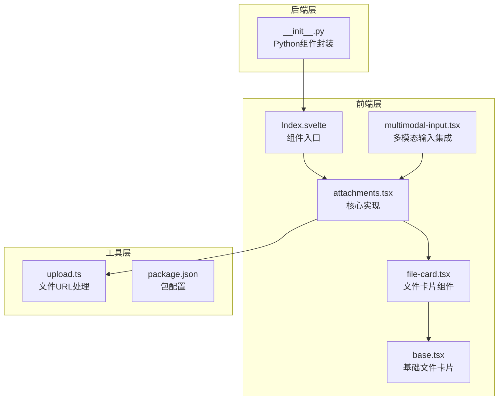

**图表来源**

- [Index.svelte:1-98](file://frontend/antdx/attachments/Index.svelte#L1-L98)
- [attachments.tsx:1-413](file://frontend/antdx/attachments/attachments.tsx#L1-L413)
- [**init**.py:21-64](file://backend/modelscope_studio/components/antdx/attachments/__init__.py#L21-L64)

**章节来源**

- [Index.svelte:1-98](file://frontend/antdx/attachments/Index.svelte#L1-L98)
- [attachments.tsx:1-413](file://frontend/antdx/attachments/attachments.tsx#L1-L413)
- [**init**.py:21-64](file://backend/modelscope_studio/components/antdx/attachments/__init__.py#L21-L64)

## 核心组件

### 组件架构

Attachments 组件采用分层架构设计，确保了良好的可维护性和扩展性：

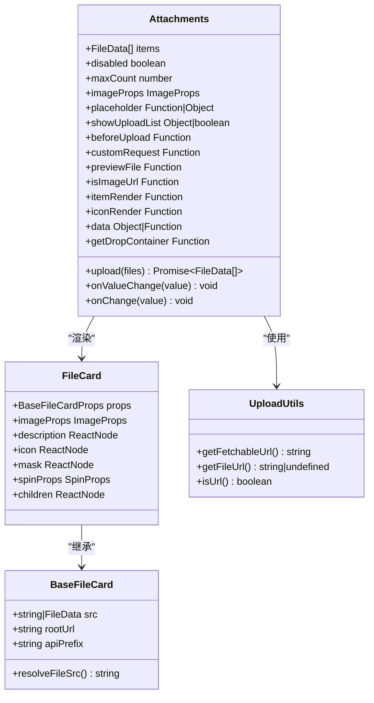

**图表来源**

- [attachments.tsx:36-83](file://frontend/antdx/attachments/attachments.tsx#L36-L83)
- [file-card.tsx:17-34](file://frontend/antdx/file-card/file-card.tsx#L17-L34)
- [base.tsx:9-13](file://frontend/antdx/file-card/base.tsx#L9-L13)
- [upload.ts:12-44](file://frontend/utils/upload.ts#L12-L44)

### 数据流处理

组件内部实现了复杂的数据流处理机制：

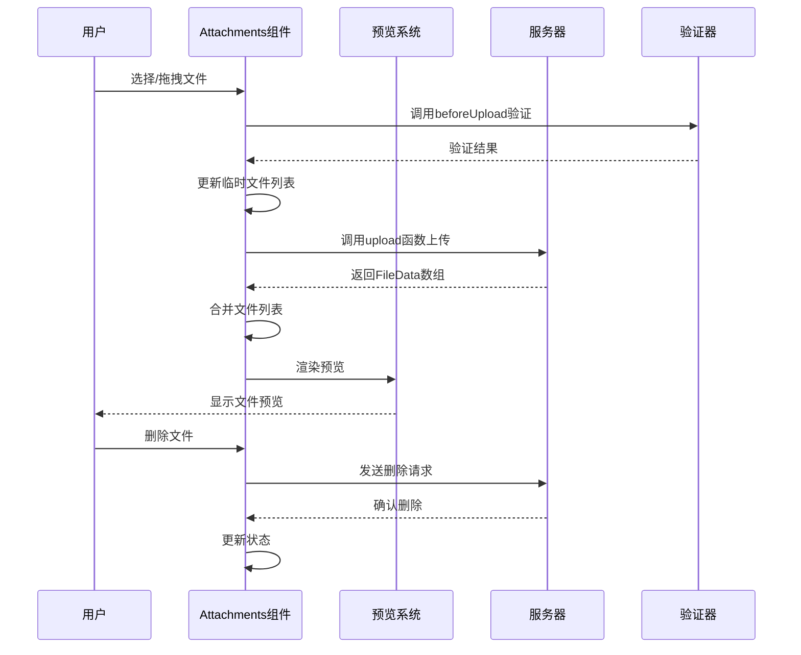

**图表来源**

- [attachments.tsx:275-354](file://frontend/antdx/attachments/attachments.tsx#L275-L354)

**章节来源**

- [attachments.tsx:1-413](file://frontend/antdx/attachments/attachments.tsx#L1-L413)
- [file-card.tsx:1-127](file://frontend/antdx/file-card/file-card.tsx#L1-L127)
- [base.tsx:1-44](file://frontend/antdx/file-card/base.tsx#L1-L44)

## 架构概览

### 整体架构设计

Attachments 组件采用了现代化的前端架构模式，结合了 React 和 Svelte 的优势：

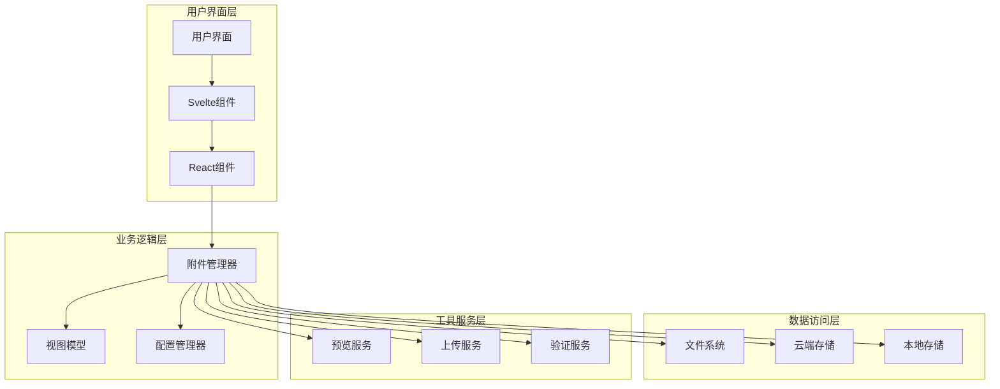

**图表来源**

- [Index.svelte:1-98](file://frontend/antdx/attachments/Index.svelte#L1-L98)
- [attachments.tsx:1-413](file://frontend/antdx/attachments/attachments.tsx#L1-L413)

### 组件生命周期

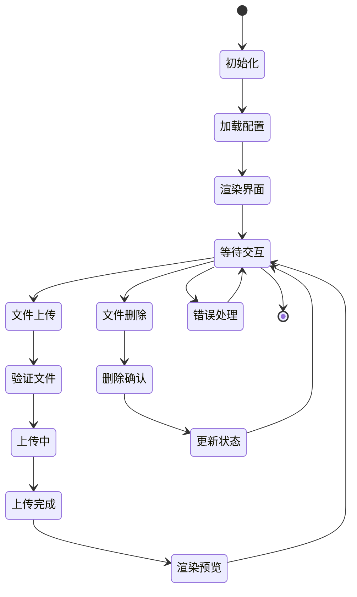

**图表来源**

- [attachments.tsx:132-354](file://frontend/antdx/attachments/attachments.tsx#L132-L354)

## 详细组件分析

### 核心功能实现

#### 文件上传机制

组件实现了完整的文件上传流程，支持多种上传策略：

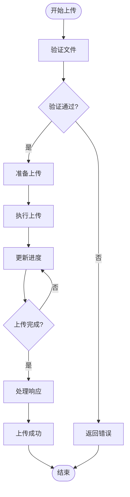

**图表来源**

- [attachments.tsx:292-354](file://frontend/antdx/attachments/attachments.tsx#L292-L354)

#### 文件预览系统

组件集成了强大的文件预览功能，支持多种文件类型的可视化展示：

| 文件类型 | 预览支持      | 特殊功能           |
| -------- | ------------- | ------------------ |
| 图片     | ✅ 完整预览   | 缩放、旋转、下载   |
| 文档     | ✅ 缩略图预览 | 在线查看、下载     |
| PDF      | ✅ 分页预览   | 导航、搜索         |
| 音频     | ✅ 播放器     | 播放控制、音量调节 |
| 视频     | ✅ 播放器     | 播放控制、全屏     |
| 压缩包   | ✅ 缩略图     | 解压预览           |

#### 批量管理功能

组件提供了高效的批量文件管理能力：

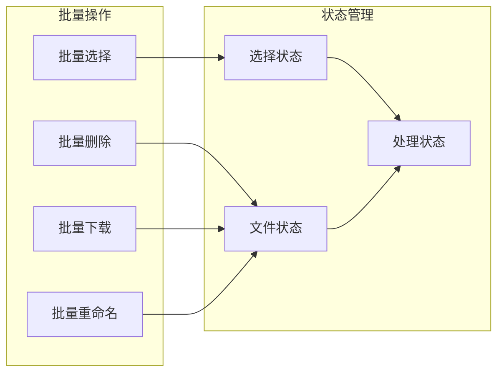

**图表来源**

- [attachments.tsx:304-342](file://frontend/antdx/attachments/attachments.tsx#L304-L342)

**章节来源**

- [attachments.tsx:275-409](file://frontend/antdx/attachments/attachments.tsx#L275-L409)

### 配置选项详解

#### 基础配置

| 配置项           | 类型              | 默认值   | 描述               |
| ---------------- | ----------------- | -------- | ------------------ |
| `disabled`       | boolean           | false    | 是否禁用上传功能   |
| `maxCount`       | number            | Infinity | 最大文件数量限制   |
| `multiple`       | boolean           | true     | 是否支持多文件上传 |
| `accept`         | string            | \*       | 接受的文件类型     |
| `showUploadList` | boolean \| object | true     | 是否显示上传列表   |

#### 高级配置

| 配置项          | 类型     | 默认值 | 描述              |
| --------------- | -------- | ------ | ----------------- |
| `beforeUpload`  | Function | -      | 上传前的验证函数  |
| `customRequest` | Function | -      | 自定义上传请求    |
| `previewFile`   | Function | -      | 自定义文件预览    |
| `isImageUrl`    | Function | -      | 判断是否为图片URL |
| `itemRender`    | Function | -      | 自定义文件项渲染  |
| `iconRender`    | Function | -      | 自定义图标渲染    |

#### 预览配置

| 配置项                             | 类型      | 默认值 | 描述             |
| ---------------------------------- | --------- | ------ | ---------------- |
| `imageProps.preview.mask`          | ReactNode | -      | 预览遮罩层       |
| `imageProps.preview.closeIcon`     | ReactNode | -      | 关闭按钮图标     |
| `imageProps.preview.toolbarRender` | Function  | -      | 工具栏自定义渲染 |
| `imageProps.preview.imageRender`   | Function  | -      | 图片自定义渲染   |

**章节来源**

- [attachments.tsx:36-83](file://frontend/antdx/attachments/attachments.tsx#L36-L83)

### 事件回调机制

组件提供了丰富的事件回调接口：

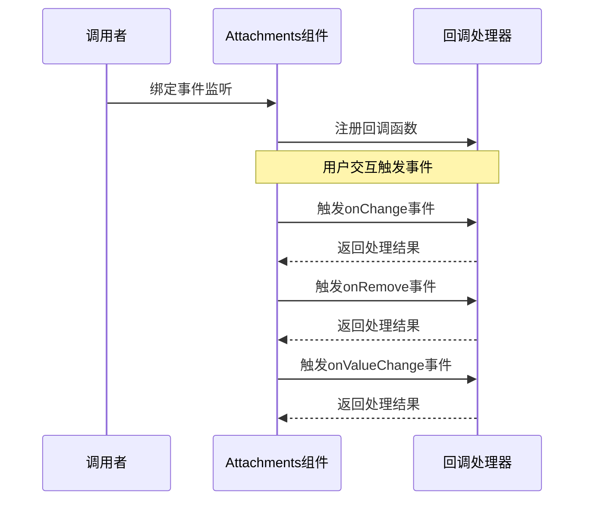

**图表来源**

- [**init**.py:27-43](file://backend/modelscope_studio/components/antdx/attachments/__init__.py#L27-L43)

#### 事件类型

| 事件名称   | 触发时机     | 参数       | 描述                   |
| ---------- | ------------ | ---------- | ---------------------- |
| `change`   | 文件状态变化 | FileData[] | 文件列表发生变化时触发 |
| `remove`   | 文件删除     | FileData   | 文件被删除时触发       |
| `preview`  | 文件预览     | FileData   | 文件开始预览时触发     |
| `download` | 文件下载     | FileData   | 文件开始下载时触发     |
| `drop`     | 文件拖拽     | FileData[] | 文件被拖拽到区域时触发 |

**章节来源**

- [**init**.py:27-43](file://backend/modelscope_studio/components/antdx/attachments/__init__.py#L27-L43)

### 错误处理机制

组件实现了完善的错误处理体系：

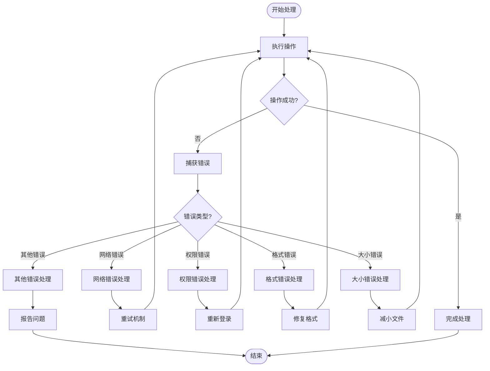

**图表来源**

- [attachments.tsx:350-354](file://frontend/antdx/attachments/attachments.tsx#L350-L354)

**章节来源**

- [attachments.tsx:350-354](file://frontend/antdx/attachments/attachments.tsx#L350-L354)

## 依赖关系分析

### 外部依赖

组件依赖于多个关键的外部库：

```mermaid
graph TB
subgraph "核心依赖"
AX[@ant-design/x<br/>Ant Design X组件库]
ANTD[antd<br/>Ant Design组件库]
GRADIO[@gradio/client<br/>Gradio客户端]
REACT[react<br/>React框架]
end
subgraph "工具库"
Lodash[lodash-es<br/>工具函数库]
Classnames[classnames<br/>类名处理]
SveltePreprocess[svelte-preprocess-react<br/>Svelte预处理]
end
subgraph "组件依赖"
FileCard[FileCard组件]
Utils[工具函数]
Hooks[React Hooks]
end
Attachments --> AX
Attachments --> ANTD
Attachments --> GRADIO
Attachments --> REACT
Attachments --> Lodash
Attachments --> Classnames
Attachments --> SveltePreprocess
Attachments --> FileCard
Attachments --> Utils
Attachments --> Hooks
```

**图表来源**

- [attachments.tsx:1-17](file://frontend/antdx/attachments/attachments.tsx#L1-L17)
- [package.json:1-15](file://frontend/antdx/attachments/package.json#L1-L15)

### 内部模块依赖

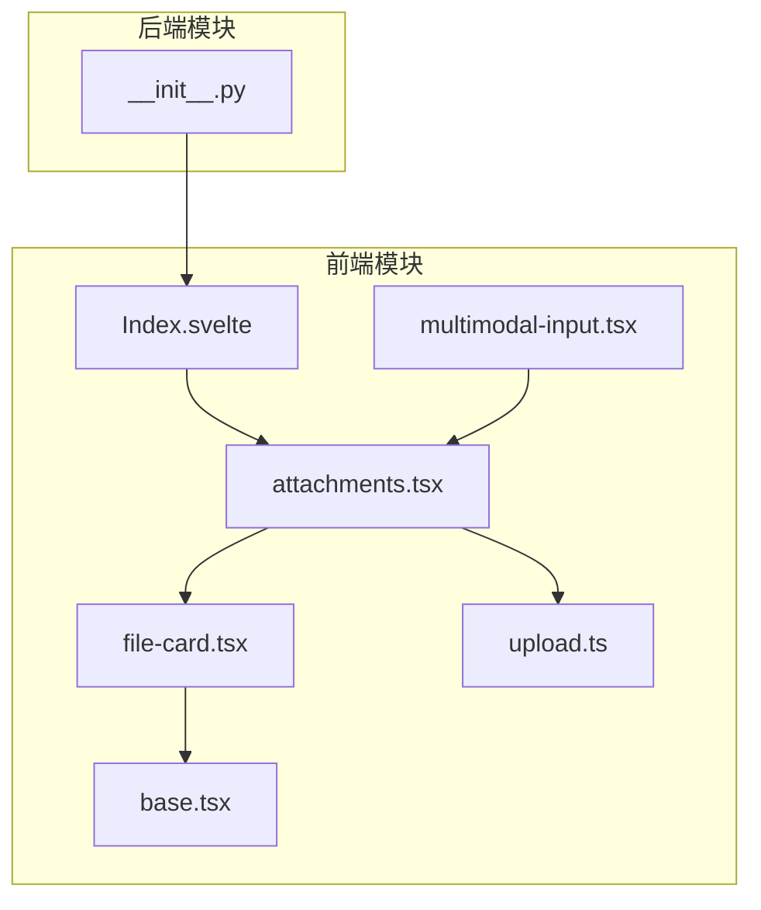

**图表来源**

- [Index.svelte:1-98](file://frontend/antdx/attachments/Index.svelte#L1-L98)
- [attachments.tsx:1-413](file://frontend/antdx/attachments/attachments.tsx#L1-L413)

**章节来源**

- [package.json:1-15](file://frontend/antdx/attachments/package.json#L1-L15)
- [Index.svelte:1-98](file://frontend/antdx/attachments/Index.svelte#L1-L98)

## 性能考虑

### 上传性能优化

组件在设计时充分考虑了性能优化：

- **并发上传控制**：通过 `maxCount` 限制同时上传的文件数量
- **进度条显示**：实时显示上传进度，提升用户体验
- **内存管理**：及时清理临时文件数据，避免内存泄漏
- **缓存策略**：对已上传文件进行缓存，减少重复上传

### 预览性能优化

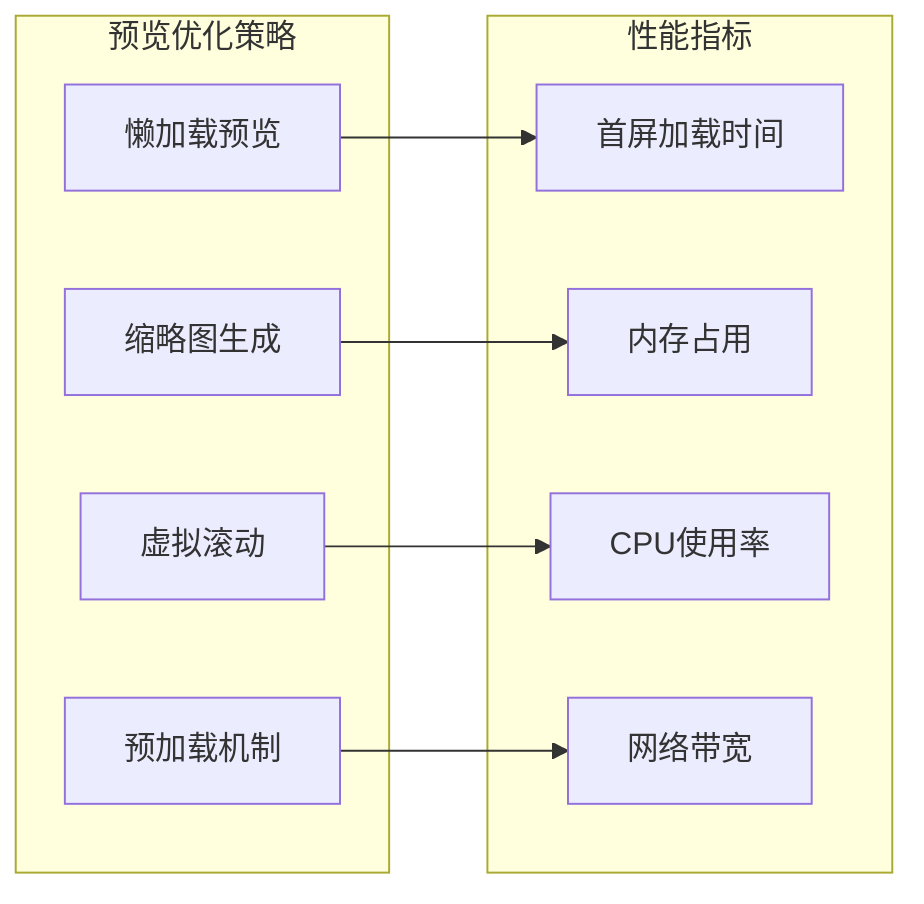

### 内存管理

组件实现了智能的内存管理机制：

- **文件对象复用**：重用已存在的文件对象，避免重复创建
- **垃圾回收**：及时释放不再使用的文件数据
- **状态同步**：保持本地状态与服务器状态的一致性

## 故障排除指南

### 常见问题及解决方案

#### 上传失败

**问题描述**：文件上传过程中出现错误

**可能原因**：

- 网络连接不稳定
- 文件格式不支持
- 文件大小超出限制
- 权限不足

**解决方案**：

1. 检查网络连接状态
2. 验证文件格式是否在 `accept` 列表中
3. 确认文件大小未超过 `maxSize` 限制
4. 检查用户权限设置

#### 预览失败

**问题描述**：文件无法正常预览

**可能原因**：

- 浏览器兼容性问题
- 文件损坏
- URL解析错误

**解决方案**：

1. 尝试在不同浏览器中打开
2. 重新上传文件
3. 检查文件完整性
4. 验证URL格式正确性

#### 性能问题

**问题描述**：组件运行缓慢或卡顿

**可能原因**：

- 文件数量过多
- 文件过大
- 内存不足

**解决方案**：

1. 减少同时上传的文件数量
2. 优化文件大小
3. 增加系统内存
4. 使用 `maxCount` 限制文件数量

**章节来源**

- [attachments.tsx:350-354](file://frontend/antdx/attachments/attachments.tsx#L350-L354)

### 调试技巧

#### 开启调试模式

```javascript
// 在开发环境中启用详细日志
const attachments = new Attachments({
  debug: true,
  // 其他配置...
});
```

#### 监控上传进度

```javascript
attachments.on('upload-progress', (progress) => {
  console.log(`上传进度: ${progress}%`);
});
```

## 结论

Attachments 附件组件是一个功能完整、性能优异的文件管理解决方案。它不仅提供了基本的文件上传和预览功能，还具备了高级的批量管理、自定义配置和错误处理能力。

### 主要优势

1. **功能全面**：涵盖文件上传、预览、管理的所有核心需求
2. **易于使用**：简洁的API设计，快速集成
3. **高度可定制**：丰富的配置选项满足各种使用场景
4. **性能优秀**：优化的算法和架构确保流畅的用户体验
5. **稳定可靠**：完善的错误处理和异常恢复机制

### 适用场景

- 在线文档管理系统
- 即时通讯应用的文件传输
- 内容创作平台的媒体管理
- 企业协作平台的文件共享
- 教育平台的作业提交系统

## 附录

### API参考

#### Props属性

| 属性名           | 类型              | 必填 | 默认值   | 描述                                 |
| ---------------- | ----------------- | ---- | -------- | ------------------------------------ |
| `items`          | FileData[]        | 是   | []       | 当前文件列表                         |
| `upload`         | Function          | 是   | -        | 上传函数，接收RcFile[]返回FileData[] |
| `onValueChange`  | Function          | 否   | -        | 值变化回调                           |
| `onChange`       | Function          | 否   | -        | 字符串路径变化回调                   |
| `disabled`       | boolean           | 否   | false    | 是否禁用                             |
| `maxCount`       | number            | 否   | Infinity | 最大文件数                           |
| `accept`         | string            | 否   | \*       | 接受的文件类型                       |
| `multiple`       | boolean           | 否   | true     | 是否多选                             |
| `showUploadList` | boolean \| object | 否   | true     | 是否显示上传列表                     |
| `imageProps`     | ImageProps        | 否   | -        | 图片预览配置                         |

#### 事件

| 事件名     | 参数       | 描述         |
| ---------- | ---------- | ------------ |
| `change`   | FileData[] | 文件列表变化 |
| `remove`   | FileData   | 文件删除     |
| `preview`  | FileData   | 文件预览开始 |
| `download` | FileData   | 文件下载开始 |
| `drop`     | FileData[] | 文件拖拽     |

#### 插槽

| 插槽名                             | 参数                     | 描述             |
| ---------------------------------- | ------------------------ | ---------------- |
| `placeholder`                      | type: 'drop' \| 'inline' | 占位符内容       |
| `placeholder.title`                | type                     | 标题内容         |
| `placeholder.description`          | type                     | 描述内容         |
| `placeholder.icon`                 | type                     | 图标内容         |
| `iconRender`                       | file, fileList           | 自定义图标渲染   |
| `itemRender`                       | file, fileList           | 自定义文件项渲染 |
| `showUploadList.previewIcon`       | file, fileList           | 预览图标         |
| `showUploadList.removeIcon`        | file, fileList           | 删除图标         |
| `showUploadList.downloadIcon`      | file, fileList           | 下载图标         |
| `showUploadList.extra`             | file, fileList           | 额外操作         |
| `imageProps.placeholder`           | file, fileList           | 图片占位符       |
| `imageProps.preview.mask`          | file, fileList           | 预览遮罩         |
| `imageProps.preview.closeIcon`     | file, fileList           | 关闭图标         |
| `imageProps.preview.toolbarRender` | file, fileList           | 工具栏渲染       |
| `imageProps.preview.imageRender`   | file, fileList           | 图片渲染         |

### 最佳实践

#### 性能优化建议

1. **合理设置 `maxCount`**：根据应用场景设置合适的最大文件数量
2. **使用懒加载**：对于大量文件，考虑使用分页或虚拟滚动
3. **优化文件大小**：在上传前压缩图片和视频文件
4. **缓存策略**：对常用文件建立缓存机制

#### 安全考虑

1. **文件类型验证**：在服务端也进行文件类型检查
2. **大小限制**：设置合理的文件大小上限
3. **病毒扫描**：对上传文件进行安全扫描
4. **权限控制**：确保只有授权用户可以访问文件

#### 用户体验优化

1. **进度反馈**：提供清晰的上传进度指示
2. **错误提示**：友好的错误信息和解决方案
3. **批量操作**：支持批量选择和操作
4. **响应式设计**：适配各种设备和屏幕尺寸

**章节来源**

- [README-zh_CN.md:1-10](file://docs/components/antdx/attachments/README-zh_CN.md#L1-L10)
- [basic.py:1-51](file://docs/components/antdx/attachments/demos/basic.py#L1-L51)
- [combination.py:1-75](file://docs/components/antdx/attachments/demos/combination.py#L1-L75)
- [file_card.py:1-72](file://docs/components/antdx/attachments/demos/file_card.py#L1-L72)
