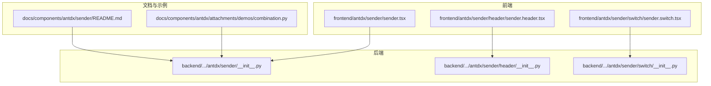
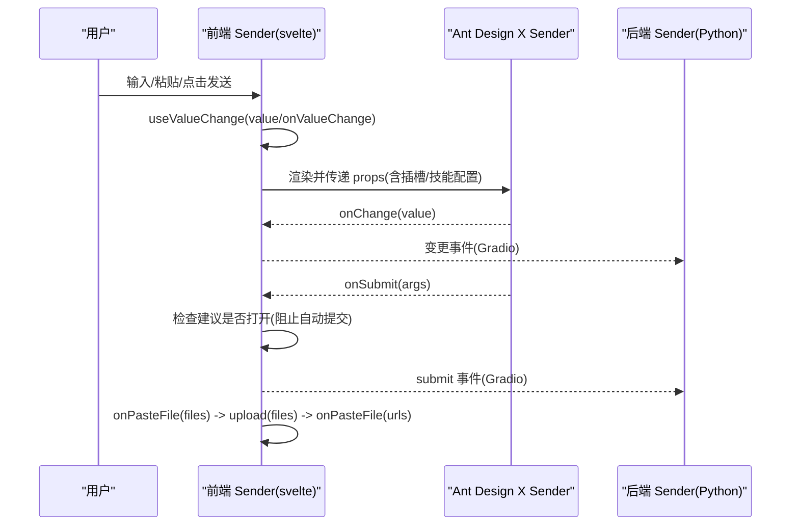
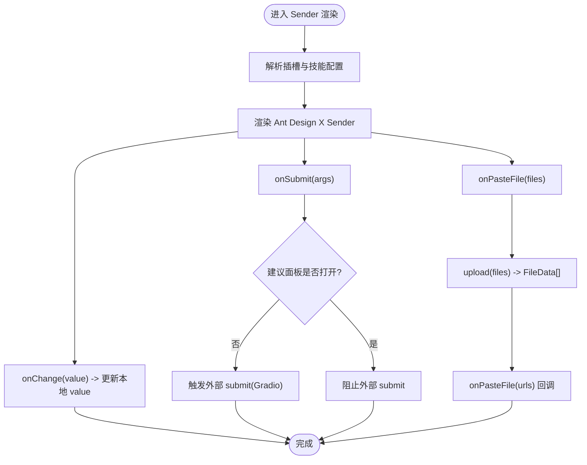
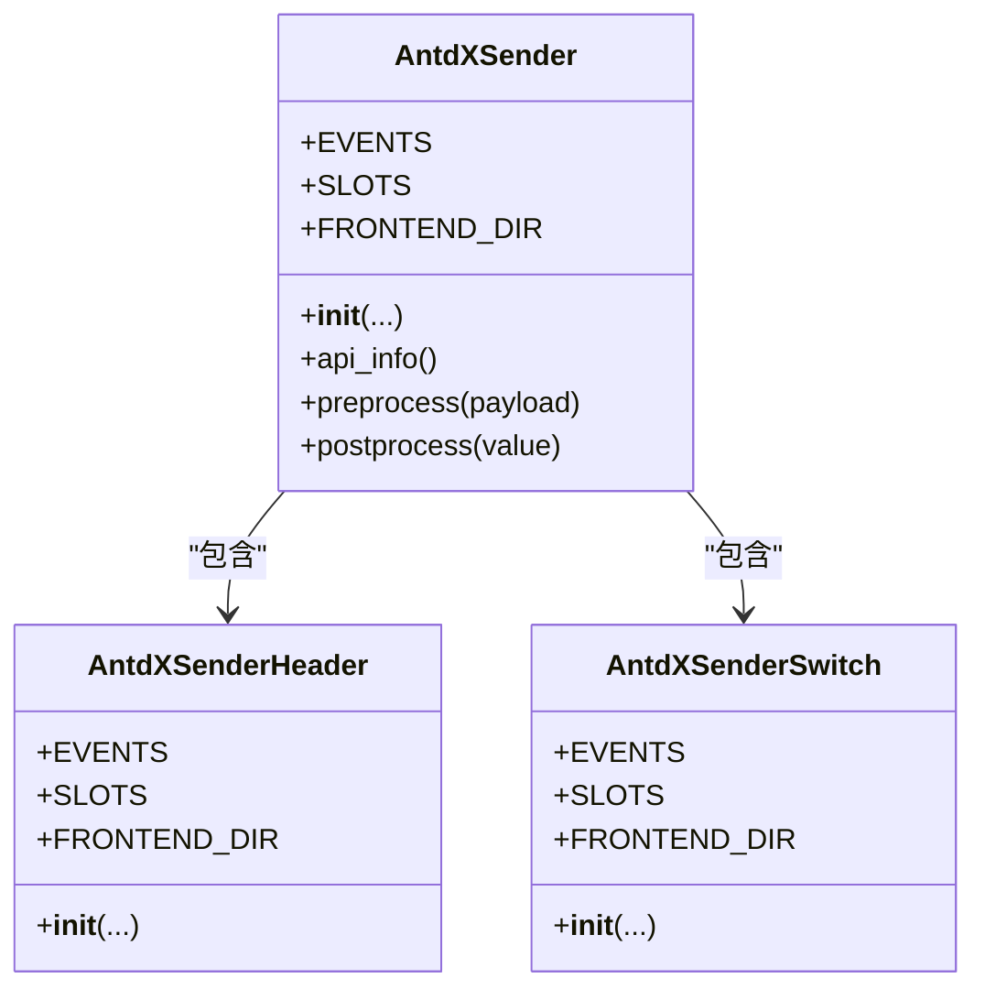
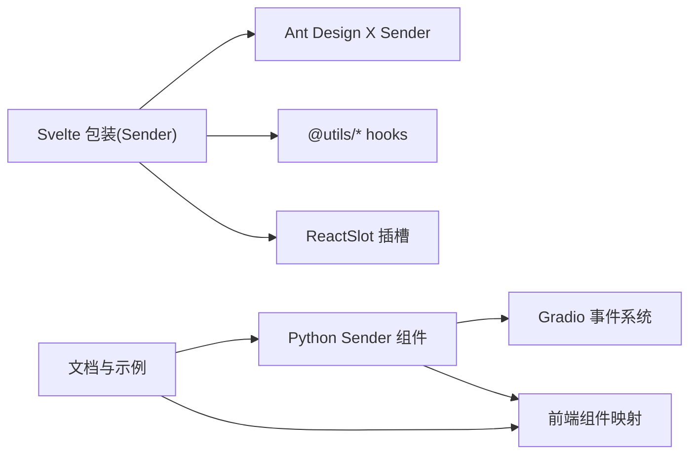

# Sender 发送器组件

<cite>
**本文引用的文件**
- [frontend/antdx/sender/sender.tsx](file://frontend/antdx/sender/sender.tsx)
- [frontend/antdx/sender/header/sender.header.tsx](file://frontend/antdx/sender/header/sender.header.tsx)
- [frontend/antdx/sender/switch/sender.switch.tsx](file://frontend/antdx/sender/switch/sender.switch.tsx)
- [backend/modelscope_studio/components/antdx/sender/__init__.py](file://backend/modelscope_studio/components/antdx/sender/__init__.py)
- [backend/modelscope_studio/components/antdx/sender/header/__init__.py](file://backend/modelscope_studio/components/antdx/sender/header/__init__.py)
- [backend/modelscope_studio/components/antdx/sender/switch/__init__.py](file://backend/modelscope_studio/components/antdx/sender/switch/__init__.py)
- [docs/components/antdx/sender/README.md](file://docs/components/antdx/sender/README.md)
- [docs/components/antdx/attachments/demos/combination.py](file://docs/components/antdx/attachments/demos/combination.py)
</cite>

## 目录

1. [简介](#简介)
2. [项目结构](#项目结构)
3. [核心组件](#核心组件)
4. [架构总览](#架构总览)
5. [详细组件分析](#详细组件分析)
6. [依赖关系分析](#依赖关系分析)
7. [性能考虑](#性能考虑)
8. [故障排查指南](#故障排查指南)
9. [结论](#结论)
10. [附录：配置与用法示例](#附录配置与用法示例)

## 简介

Sender 发送器组件是面向聊天场景的输入组件，提供消息发送、输入处理、粘贴上传、提交类型控制、头部面板与开关控制等能力。它在前端基于 Ant Design X 的 Sender 实现，并通过 Gradio 适配层在后端提供 Python API，支持插槽化扩展（如前缀/后缀、头部、页脚、技能面板等）以及事件绑定。

## 项目结构

Sender 组件由“前端 Svelte 包装 + 后端 Python 组件”两部分构成，同时配套 Header 与 Switch 子组件，文档与示例位于 docs 目录中。

**图表来源**

- [frontend/antdx/sender/sender.tsx:1-174](file://frontend/antdx/sender/sender.tsx#L1-L174)
- [frontend/antdx/sender/header/sender.header.tsx:1-21](file://frontend/antdx/sender/header/sender.header.tsx#L1-L21)
- [frontend/antdx/sender/switch/sender.switch.tsx:1-34](file://frontend/antdx/sender/switch/sender.switch.tsx#L1-L34)
- [backend/modelscope_studio/components/antdx/sender/**init**.py:1-149](file://backend/modelscope_studio/components/antdx/sender/__init__.py#L1-L149)
- [backend/modelscope_studio/components/antdx/sender/header/**init**.py:1-74](file://backend/modelscope_studio/components/antdx/sender/header/__init__.py#L1-L74)
- [backend/modelscope_studio/components/antdx/sender/switch/**init**.py:1-81](file://backend/modelscope_studio/components/antdx/sender/switch/__init__.py#L1-L81)
- [docs/components/antdx/sender/README.md:1-10](file://docs/components/antdx/sender/README.md#L1-L10)
- [docs/components/antdx/attachments/demos/combination.py:1-75](file://docs/components/antdx/attachments/demos/combination.py#L1-L75)

**章节来源**

- [frontend/antdx/sender/sender.tsx:1-174](file://frontend/antdx/sender/sender.tsx#L1-L174)
- [backend/modelscope_studio/components/antdx/sender/**init**.py:1-149](file://backend/modelscope_studio/components/antdx/sender/__init__.py#L1-L149)

## 核心组件

- Sender（主组件）
  - 负责输入值管理、提交事件拦截、粘贴文件上传、插槽渲染、技能面板（含 Tooltip、可关闭）配置。
  - 对外暴露 value、onChange、onSubmit、onPasteFile 等回调与属性。
- Sender.Header（头部面板）
  - 支持标题插槽、可选展开/收起、可关闭等特性。
- Sender.Switch（开关控件）
  - 支持自定义“选中/未选中”文案与图标插槽。

**章节来源**

- [frontend/antdx/sender/sender.tsx:18-171](file://frontend/antdx/sender/sender.tsx#L18-L171)
- [frontend/antdx/sender/header/sender.header.tsx:7-18](file://frontend/antdx/sender/header/sender.header.tsx#L7-L18)
- [frontend/antdx/sender/switch/sender.switch.tsx:7-31](file://frontend/antdx/sender/switch/sender.switch.tsx#L7-L31)

## 架构总览

Sender 在前端以 Svelte 包装形式桥接 Ant Design X 的 Sender，并在后端通过 Python 组件暴露到 Gradio 生态。其数据流与事件流如下：

**图表来源**

- [frontend/antdx/sender/sender.tsx:68-138](file://frontend/antdx/sender/sender.tsx#L68-L138)
- [backend/modelscope_studio/components/antdx/sender/**init**.py:21-59](file://backend/modelscope_studio/components/antdx/sender/__init__.py#L21-L59)

## 详细组件分析

### 主组件 Sender（消息发送与输入处理）

- 输入与状态
  - 使用受控 value 与 onChange，结合 useValueChange 管理外部传入 value 与内部变更。
- 提交逻辑
  - onSubmit 会被拦截：若建议面板处于打开状态则不触发外部 submit，避免误触。
  - 外部 submit 事件通过 Gradio 事件系统上报。
- 粘贴上传
  - onPasteFile 接收原生 File 列表，调用 upload 回调进行上传，再将返回的文件路径数组回传给 onPasteFile。
- 插槽与高级功能
  - 支持 suffix/header/prefix/footer 插槽；支持 skill.title、skill.toolTip.title、skill.closable.closeIcon 插槽。
  - skill 配置支持 Tooltip 与可关闭行为，Tooltip 的 afterOpenChange、getPopupContainer 可通过函数包装。
- 事件映射
  - change、submit、cancel、allow_speech_recording_change、key_down/key_press、focus/blur、paste、paste_file、skill_closable_close 等事件均映射到 Gradio 事件。

**图表来源**

- [frontend/antdx/sender/sender.tsx:68-138](file://frontend/antdx/sender/sender.tsx#L68-L138)

**章节来源**

- [frontend/antdx/sender/sender.tsx:18-171](file://frontend/antdx/sender/sender.tsx#L18-L171)
- [backend/modelscope_studio/components/antdx/sender/**init**.py:21-66](file://backend/modelscope_studio/components/antdx/sender/__init__.py#L21-L66)

### 子组件 Sender.Header（头部面板）

- 功能要点
  - 支持 title 插槽，其余属性透传至 Ant Design X Header。
  - 事件 open_change 通过 Gradio 映射。
- 使用场景
  - 与 Sender 结合用于插入附件或扩展输入区域。

**章节来源**

- [frontend/antdx/sender/header/sender.header.tsx:7-18](file://frontend/antdx/sender/header/sender.header.tsx#L7-L18)
- [backend/modelscope_studio/components/antdx/sender/header/**init**.py:12-20](file://backend/modelscope_studio/components/antdx/sender/header/__init__.py#L12-L20)

### 子组件 Sender.Switch（开关控制）

- 功能要点
  - 支持 checkedChildren、unCheckedChildren、icon 插槽，便于自定义文案与图标。
  - 事件 change 通过 Gradio 映射。
- 使用场景
  - 控制语音输入、快捷提交模式等。

**章节来源**

- [frontend/antdx/sender/switch/sender.switch.tsx:7-31](file://frontend/antdx/sender/switch/sender.switch.tsx#L7-L31)
- [backend/modelscope_studio/components/antdx/sender/switch/**init**.py:12-19](file://backend/modelscope_studio/components/antdx/sender/switch/__init__.py#L12-L19)

### 类关系图（代码级）

**图表来源**

- [backend/modelscope_studio/components/antdx/sender/**init**.py:14-128](file://backend/modelscope_studio/components/antdx/sender/__init__.py#L14-L128)
- [backend/modelscope_studio/components/antdx/sender/header/**init**.py:8-56](file://backend/modelscope_studio/components/antdx/sender/header/__init__.py#L8-L56)
- [backend/modelscope_studio/components/antdx/sender/switch/**init**.py:8-63](file://backend/modelscope_studio/components/antdx/sender/switch/__init__.py#L8-L63)

## 依赖关系分析

- 前端依赖
  - 使用 @svelte-preprocess-react 将 React 组件桥接到 Svelte。
  - 使用 @ant-design/x 的 Sender/Header/Switch。
  - 使用 @gradio/client 的 FileData 类型与 Gradio 事件。
- 后端依赖
  - 基于 Gradio 的 ModelScopeDataLayoutComponent/ModelScopeLayoutComponent 抽象，统一事件与插槽映射。
- 文档与示例
  - README 提供基本示例入口；组合示例展示与 Attachments、Badge、Button 等组件协同。

**图表来源**

- [frontend/antdx/sender/sender.tsx:1-10](file://frontend/antdx/sender/sender.tsx#L1-L10)
- [backend/modelscope_studio/components/antdx/sender/**init**.py:14-128](file://backend/modelscope_studio/components/antdx/sender/__init__.py#L14-L128)
- [docs/components/antdx/sender/README.md:1-10](file://docs/components/antdx/sender/README.md#L1-L10)

**章节来源**

- [frontend/antdx/sender/sender.tsx:1-10](file://frontend/antdx/sender/sender.tsx#L1-L10)
- [backend/modelscope_studio/components/antdx/sender/**init**.py:14-128](file://backend/modelscope_studio/components/antdx/sender/__init__.py#L14-L128)

## 性能考虑

- 插槽与函数包装
  - 对 Tooltip 的回调与插槽采用函数包装与 ReactSlot 渲染，避免不必要的重渲染；建议在上层缓存或稳定化插槽内容。
- 提交拦截
  - 建议在建议面板打开时禁用自动提交，减少无效请求。
- 文件上传
  - onPasteFile 应尽量异步处理，避免阻塞 UI；对大文件建议分片或服务端直传策略。

## 故障排查指南

- 提交被意外拦截
  - 若建议面板未关闭导致 submit 未触发，请检查建议面板状态或临时关闭拦截逻辑。
- 粘贴上传未生效
  - 确认 upload 回调已正确返回包含 path 字段的 FileData 数组；onPasteFile 回调应接收字符串数组。
- 插槽内容不显示
  - 确认插槽名称与组件支持一致（如 skill.title、skill.toolTip.title、skill.closable.closeIcon）。
- 事件未触发
  - 检查后端 EVENTS 列表是否包含对应事件名，前端是否正确绑定。

**章节来源**

- [frontend/antdx/sender/sender.tsx:126-138](file://frontend/antdx/sender/sender.tsx#L126-L138)
- [backend/modelscope_studio/components/antdx/sender/**init**.py:21-59](file://backend/modelscope_studio/components/antdx/sender/__init__.py#L21-L59)

## 结论

Sender 发送器组件通过前后端一体化设计，提供了聊天场景下强大的输入与提交能力，配合 Header、Switch 与插槽系统，能够灵活扩展为多模态输入与复杂交互。建议在实际应用中关注事件拦截、插槽稳定性与上传流程的健壮性。

## 附录：配置与用法示例

### 配置项概览（后端）

- 基础属性
  - value/default_value/placeholder/loading/disabled/read_only/auto_size/submit_type 等。
- 插槽
  - suffix/header/prefix/footer/skill.title/skill.toolTip.title/skill.closable.closeIcon。
- 事件
  - change、submit、cancel、allow_speech_recording_change、key_down/key_press、focus/blur、paste、paste_file、skill_closable_close。
- 子组件
  - Header、Switch（分别支持相应插槽与事件）。

**章节来源**

- [backend/modelscope_studio/components/antdx/sender/**init**.py:61-127](file://backend/modelscope_studio/components/antdx/sender/__init__.py#L61-L127)
- [backend/modelscope_studio/components/antdx/sender/header/**init**.py:19-54](file://backend/modelscope_studio/components/antdx/sender/header/__init__.py#L19-L54)
- [backend/modelscope_studio/components/antdx/sender/switch/**init**.py:18-61](file://backend/modelscope_studio/components/antdx/sender/switch/__init__.py#L18-L61)

### 聊天机器人集成示例（概述）

- 文本消息
  - 使用 Sender 作为输入，监听 submit 事件获取文本内容，结合后端模型推理返回结果。
- 多模态内容
  - 与 Sender.Header/Attachents 协同，通过粘贴或拖拽上传图片/文件，onPasteFile 返回的路径列表可用于后续处理。
- 特殊命令
  - 在 onChange 或 submit 中解析输入，识别“/reset”“/help”等命令，执行相应逻辑。

**章节来源**

- [docs/components/antdx/attachments/demos/combination.py:26-71](file://docs/components/antdx/attachments/demos/combination.py#L26-L71)
- [docs/components/antdx/sender/README.md:5-10](file://docs/components/antdx/sender/README.md#L5-L10)
