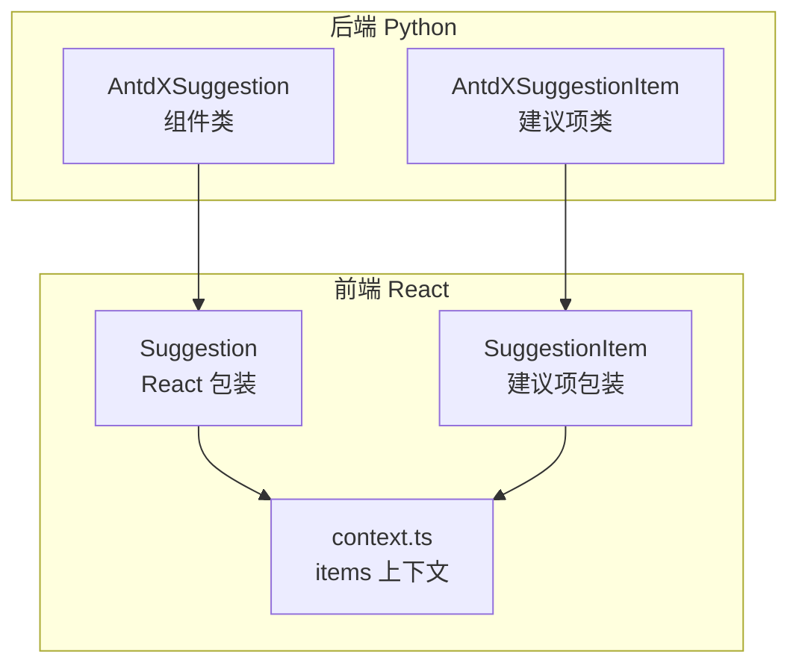
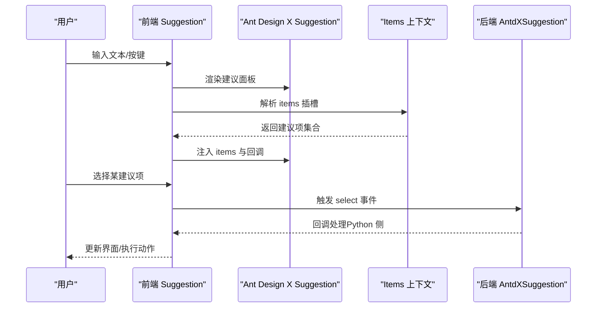
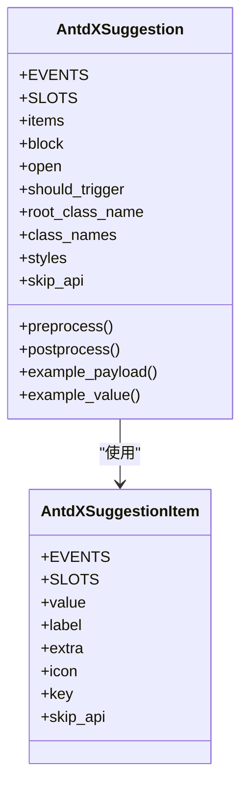
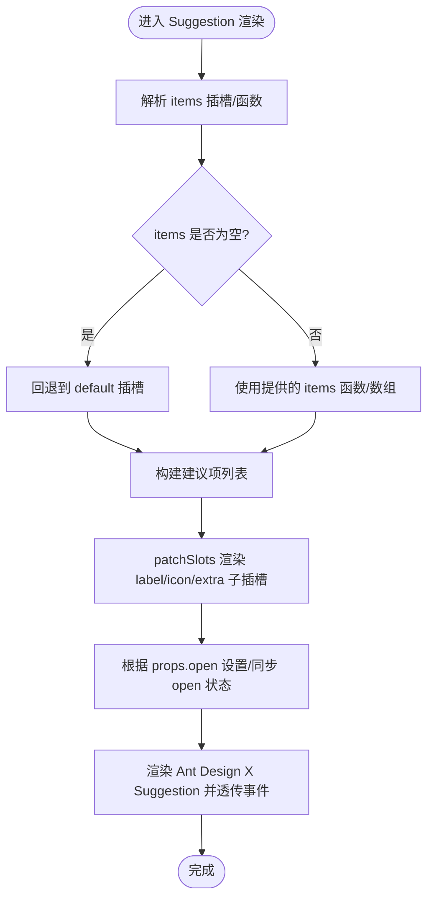
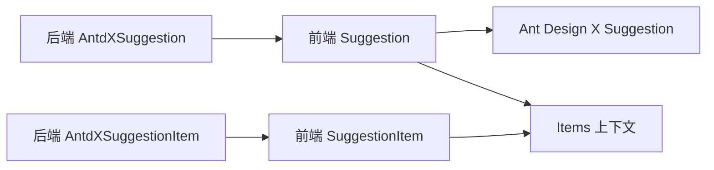

# Suggestion 快捷指令组件

<cite>
**本文引用的文件**
- [backend/modelscope_studio/components/antdx/suggestion/__init__.py](file://backend/modelscope_studio/components/antdx/suggestion/__init__.py)
- [backend/modelscope_studio/components/antdx/suggestion/item/__init__.py](file://backend/modelscope_studio/components/antdx/suggestion/item/__init__.py)
- [frontend/antdx/suggestion/suggestion.tsx](file://frontend/antdx/suggestion/suggestion.tsx)
- [frontend/antdx/suggestion/item/suggestion.item.tsx](file://frontend/antdx/suggestion/item/suggestion.item.tsx)
- [frontend/antdx/suggestion/context.ts](file://frontend/antdx/suggestion/context.ts)
- [docs/components/antdx/suggestion/README.md](file://docs/components/antdx/suggestion/README.md)
- [backend/modelscope_studio/components/pro/chatbot/__init__.py](file://backend/modelscope_studio/components/pro/chatbot/__init__.py)
</cite>

## 目录

1. [简介](#简介)
2. [项目结构](#项目结构)
3. [核心组件](#核心组件)
4. [架构总览](#架构总览)
5. [组件详解](#组件详解)
6. [依赖关系分析](#依赖关系分析)
7. [性能与交互特性](#性能与交互特性)
8. [使用示例与最佳实践](#使用示例与最佳实践)
9. [故障排查](#故障排查)
10. [结论](#结论)

## 简介

Suggestion 快捷指令组件用于在智能助手对话场景中提供“快捷指令”“智能补全”“上下文相关建议”“个性化推荐”等能力。它基于 Ant Design X 的 Suggestion 能力，通过 React 包装与 Gradio 布局组件桥接，实现：

- 指令定义：以“建议项”形式组织，支持标签、图标、额外内容等多维信息。
- 触发条件：可由输入框键盘事件或外部状态控制面板开合。
- 执行逻辑：选择建议后触发回调，便于在 Python 侧进行后续处理。
- 控制方式：支持受控/非受控两种模式；可通过 Python 侧直接设置 open 状态。
- 动态更新：建议列表可由 slot 或函数动态生成，运行时可热更新。

本组件广泛应用于聊天机器人、代码助手、内容创作等需要“快速行动”的交互场景。

## 项目结构

Suggestion 组件由后端 Python 组件与前端 React 实现共同构成，并通过统一的上下文系统实现插槽渲染与动态数据注入。

**图表来源**

- [backend/modelscope_studio/components/antdx/suggestion/**init**.py:11-86](file://backend/modelscope_studio/components/antdx/suggestion/__init__.py#L11-L86)
- [backend/modelscope_studio/components/antdx/suggestion/item/**init**.py:8-68](file://backend/modelscope_studio/components/antdx/suggestion/item/__init__.py#L8-L68)
- [frontend/antdx/suggestion/suggestion.tsx:64-165](file://frontend/antdx/suggestion/suggestion.tsx#L64-L165)
- [frontend/antdx/suggestion/item/suggestion.item.tsx:7-22](file://frontend/antdx/suggestion/item/suggestion.item.tsx#L7-L22)
- [frontend/antdx/suggestion/context.ts:1-7](file://frontend/antdx/suggestion/context.ts#L1-L7)

**章节来源**

- [backend/modelscope_studio/components/antdx/suggestion/**init**.py:11-86](file://backend/modelscope_studio/components/antdx/suggestion/__init__.py#L11-L86)
- [backend/modelscope_studio/components/antdx/suggestion/item/**init**.py:8-68](file://backend/modelscope_studio/components/antdx/suggestion/item/__init__.py#L8-L68)
- [frontend/antdx/suggestion/suggestion.tsx:64-165](file://frontend/antdx/suggestion/suggestion.tsx#L64-L165)
- [frontend/antdx/suggestion/item/suggestion.item.tsx:7-22](file://frontend/antdx/suggestion/item/suggestion.item.tsx#L7-L22)
- [frontend/antdx/suggestion/context.ts:1-7](file://frontend/antdx/suggestion/context.ts#L1-L7)

## 核心组件

- AntdXSuggestion（后端组件）
  - 支持事件：select（选中）、open_change（面板开合）。
  - 支持插槽：items、children。
  - 关键属性：items（建议列表）、block（块级显示）、open（受控开合）、should_trigger（自定义触发器）、根样式类名与内联样式等。
  - 前端映射：resolve_frontend_dir("suggestion", type="antdx")。
- AntdXSuggestionItem（后端建议项）
  - 支持插槽：label、icon、extra。
  - 关键属性：value、label、extra、icon、key。
  - 前端映射：resolve_frontend_dir("suggestion", "item", type="antdx")。

上述组件均声明 skip_api=True，表明其不参与标准 API 流程，而是通过事件与插槽完成交互。

**章节来源**

- [backend/modelscope_studio/components/antdx/suggestion/**init**.py:11-86](file://backend/modelscope_studio/components/antdx/suggestion/__init__.py#L11-L86)
- [backend/modelscope_studio/components/antdx/suggestion/item/**init**.py:8-68](file://backend/modelscope_studio/components/antdx/suggestion/item/__init__.py#L8-L68)

## 架构总览

Suggestion 在前端通过 React 包装 Ant Design X 的 Suggestion 组件，结合插槽系统与上下文，实现“建议项”渲染与事件透传；在后端通过 Gradio 布局组件桥接，支持 Python 侧控制与事件绑定。

**图表来源**

- [frontend/antdx/suggestion/suggestion.tsx:77-162](file://frontend/antdx/suggestion/suggestion.tsx#L77-L162)
- [frontend/antdx/suggestion/context.ts:1-7](file://frontend/antdx/suggestion/context.ts#L1-L7)
- [backend/modelscope_studio/components/antdx/suggestion/**init**.py:18-27](file://backend/modelscope_studio/components/antdx/suggestion/__init__.py#L18-L27)

## 组件详解

### 后端组件：AntdXSuggestion

- 事件绑定
  - select：建议项被选中时触发，后端通过内部标记启用事件绑定。
  - open_change：面板开合状态变化时触发，便于受控/非受控切换。
- 插槽支持
  - items：建议项集合，可由 slot 或函数动态生成。
  - children：用于包裹输入框等宿主元素，配合 should_trigger 自定义触发逻辑。
- 属性要点
  - items：可为字符串、列表或函数，函数形式支持动态计算。
  - open：受控模式下由 Python 侧显式设置面板开合。
  - should_trigger：自定义键盘事件触发器，决定何时弹出建议面板。
  - 样式：支持 class_names、styles、root_class_name 等。
- 生命周期
  - preprocess/postprocess/example_payload/example_value 均返回空值，表示该组件不参与数据序列化。

**图表来源**

- [backend/modelscope_studio/components/antdx/suggestion/**init**.py:11-86](file://backend/modelscope_studio/components/antdx/suggestion/__init__.py#L11-L86)
- [backend/modelscope_studio/components/antdx/suggestion/item/**init**.py:8-68](file://backend/modelscope_studio/components/antdx/suggestion/item/__init__.py#L8-L68)

**章节来源**

- [backend/modelscope_studio/components/antdx/suggestion/**init**.py:11-86](file://backend/modelscope_studio/components/antdx/suggestion/__init__.py#L11-L86)

### 前端实现：Suggestion（React 包装）

- 插槽与上下文
  - 使用 withItemsContextProvider 提供 items 上下文，支持 default 与 items 两套插槽。
  - 通过 renderItems 与 patchSlots 将插槽内容转换为建议项结构。
- 动态建议列表
  - items 可为函数或插槽解析结果；若为空则回退到默认插槽。
  - 使用 useMemoizedEqualValue 与 useMemo 优化渲染与比较。
- 触发与开合
  - shouldTrigger：在 onKeyDown 中按需触发 onTrigger，决定是否弹出面板。
  - open：支持 props.open 非受控模式与内部状态受控模式。
- 事件透传
  - onOpenChange：根据 props.open 是否存在决定是否更新内部状态。
  - children：通过 SuggestionChildrenWrapper 注入上下文并透传事件。

**图表来源**

- [frontend/antdx/suggestion/suggestion.tsx:77-162](file://frontend/antdx/suggestion/suggestion.tsx#L77-L162)
- [frontend/antdx/suggestion/context.ts:1-7](file://frontend/antdx/suggestion/context.ts#L1-L7)

**章节来源**

- [frontend/antdx/suggestion/suggestion.tsx:64-165](file://frontend/antdx/suggestion/suggestion.tsx#L64-L165)
- [frontend/antdx/suggestion/context.ts:1-7](file://frontend/antdx/suggestion/context.ts#L1-L7)

### 前端实现：SuggestionItem（建议项包装）

- 通过 ItemHandler 将插槽 default 渲染为建议项 children。
- 仅允许 default 插槽，简化建议项内容组织。

**章节来源**

- [frontend/antdx/suggestion/item/suggestion.item.tsx:7-22](file://frontend/antdx/suggestion/item/suggestion.item.tsx#L7-L22)

## 依赖关系分析

- 组件耦合
  - AntdXSuggestion 依赖 AntdXSuggestionItem 作为建议项容器。
  - 前端 Suggestion 依赖 Ant Design X 的 Suggestion 组件与内部工具函数（如 patchSlots、renderItems）。
- 数据流
  - 插槽 → 上下文解析 → 建议项结构 → 渲染 → 事件回调 → Python 处理。
- 事件链路
  - 前端 onOpenChange/select → 后端事件监听器 → Python 回调。

**图表来源**

- [backend/modelscope_studio/components/antdx/suggestion/**init**.py:11-16](file://backend/modelscope_studio/components/antdx/suggestion/__init__.py#L11-L16)
- [frontend/antdx/suggestion/suggestion.tsx:64-86](file://frontend/antdx/suggestion/suggestion.tsx#L64-L86)
- [frontend/antdx/suggestion/item/suggestion.item.tsx:7-18](file://frontend/antdx/suggestion/item/suggestion.item.tsx#L7-L18)

**章节来源**

- [backend/modelscope_studio/components/antdx/suggestion/**init**.py:11-16](file://backend/modelscope_studio/components/antdx/suggestion/__init__.py#L11-L16)
- [frontend/antdx/suggestion/suggestion.tsx:64-86](file://frontend/antdx/suggestion/suggestion.tsx#L64-L86)
- [frontend/antdx/suggestion/item/suggestion.item.tsx:7-18](file://frontend/antdx/suggestion/item/suggestion.item.tsx#L7-L18)

## 性能与交互特性

- 渲染优化
  - 使用 useMemoizedEqualValue 与 useMemo 缓存 props 与 items，避免重复渲染。
  - 仅在 items 或插槽变化时重建建议项列表。
- 事件节流
  - shouldTrigger 中使用 requestAnimationFrame 将键盘事件处理延后，降低主线程阻塞风险。
- 开合控制
  - 非受控模式：onOpenChange 内部维护 open 状态。
  - 受控模式：由 props.open 决定，onOpenChange 仅回调不修改状态。
- 插槽渲染
  - patchSlots 将 label/icon/extra 子插槽转换为对应字段，减少跨组件通信成本。

**章节来源**

- [frontend/antdx/suggestion/suggestion.tsx:36-57](file://frontend/antdx/suggestion/suggestion.tsx#L36-L57)
- [frontend/antdx/suggestion/suggestion.tsx:94-121](file://frontend/antdx/suggestion/suggestion.tsx#L94-L121)
- [frontend/antdx/suggestion/suggestion.tsx:135-140](file://frontend/antdx/suggestion/suggestion.tsx#L135-L140)

## 使用示例与最佳实践

### 基础用法（文档示例）

- 文档提供了基础、块级展示、Python 受控三种示例，可参考：
  - [docs/components/antdx/suggestion/README.md:5-10](file://docs/components/antdx/suggestion/README.md#L5-L10)

### 智能助手场景示例（概念性说明）

- 常用命令
  - 定义一组固定命令建议项，点击即执行，适合“快速开始”场景。
- 上下文相关建议
  - 根据当前输入或历史消息动态生成建议列表，提升相关性。
- 个性化推荐
  - 基于用户偏好或使用记录，优先展示高命中率的建议项。
- Python 侧控制
  - 通过设置 open 属性实现面板显隐控制；通过 select 事件接收选中项并在 Python 侧执行相应逻辑。

### 指令定义与触发

- 指令定义
  - 使用 AntdXSuggestionItem 组织建议项，支持 label、icon、extra 等字段。
- 触发条件
  - 可通过 should_trigger 自定义键盘事件触发；也可由 open 属性控制面板开合。
- 执行逻辑
  - 选中建议项后触发 select 事件，Python 侧可在回调中处理业务逻辑。

### 样式与交互定制

- 样式
  - 通过 class*names、styles、root_class_name 与后端 elem*\* 属性进行样式定制。
- 交互
  - children 插槽用于承载输入框等宿主组件，配合 should_trigger 实现更灵活的触发策略。

**章节来源**

- [docs/components/antdx/suggestion/README.md:5-10](file://docs/components/antdx/suggestion/README.md#L5-L10)
- [backend/modelscope_studio/components/antdx/suggestion/**init**.py:32-67](file://backend/modelscope_studio/components/antdx/suggestion/__init__.py#L32-L67)
- [frontend/antdx/suggestion/suggestion.tsx:77-86](file://frontend/antdx/suggestion/suggestion.tsx#L77-L86)

## 故障排查

- 建议项不显示
  - 检查 items 是否为空；若为空，确认 default 插槽是否正确填充。
  - 确认插槽名称是否匹配（items/default）。
- 面板无法打开
  - 若使用受控 open，请确保 Python 侧正确设置 open。
  - 检查 should_trigger 是否正确实现触发逻辑。
- 事件未回调
  - 确认事件监听器已注册（select/open_change）。
  - 检查 Python 侧回调是否正确绑定。

**章节来源**

- [frontend/antdx/suggestion/suggestion.tsx:87-121](file://frontend/antdx/suggestion/suggestion.tsx#L87-L121)
- [backend/modelscope_studio/components/antdx/suggestion/**init**.py:18-27](file://backend/modelscope_studio/components/antdx/suggestion/__init__.py#L18-L27)

## 结论

Suggestion 快捷指令组件通过“后端布局组件 + 前端 React 包装 + 插槽上下文”的架构，实现了高性能、可扩展的快捷指令与智能补全能力。其支持受控/非受控开合、动态建议列表、自定义触发器与事件回调，适用于多种智能助手与创作场景。建议在实际应用中结合业务上下文动态生成建议项，并通过 Python 侧事件实现闭环交互。
