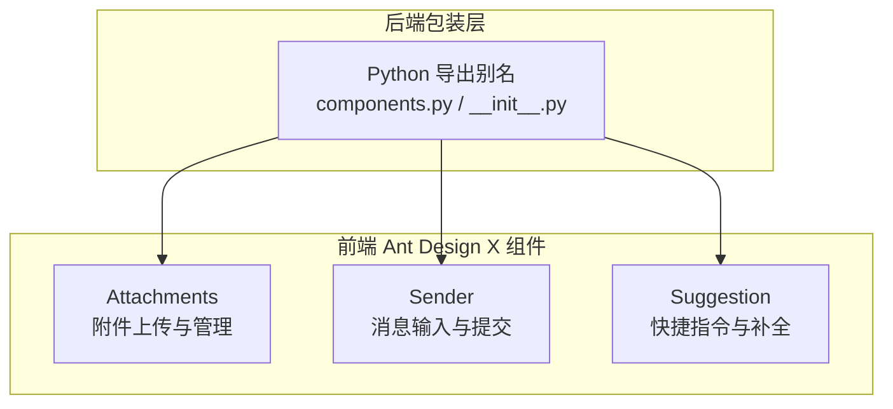
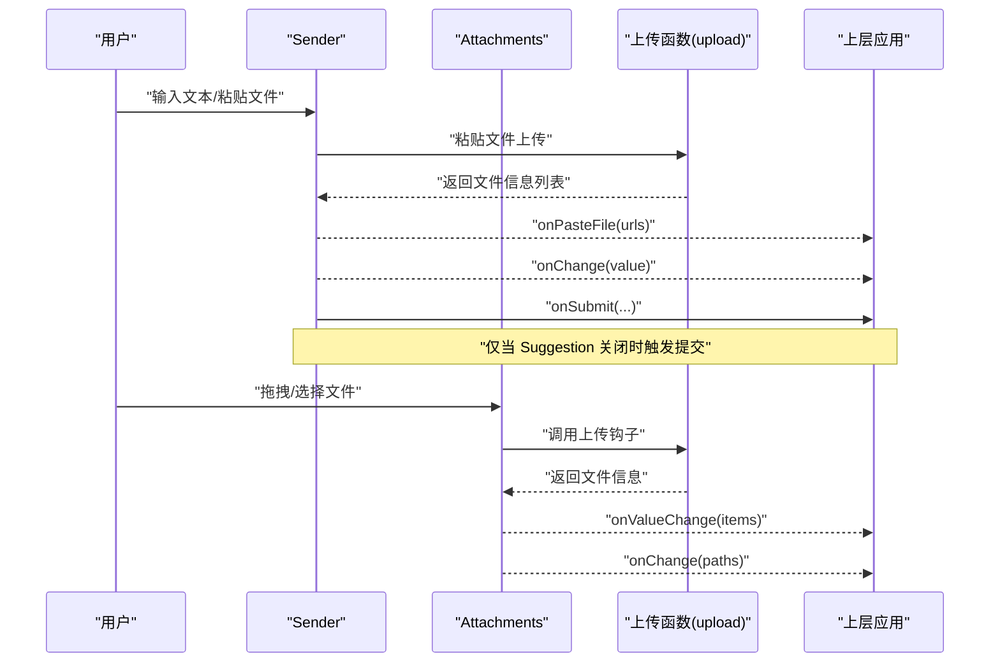
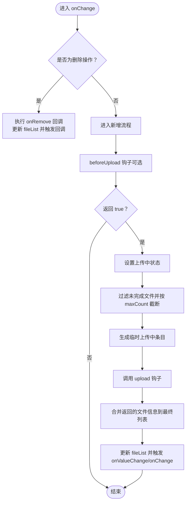
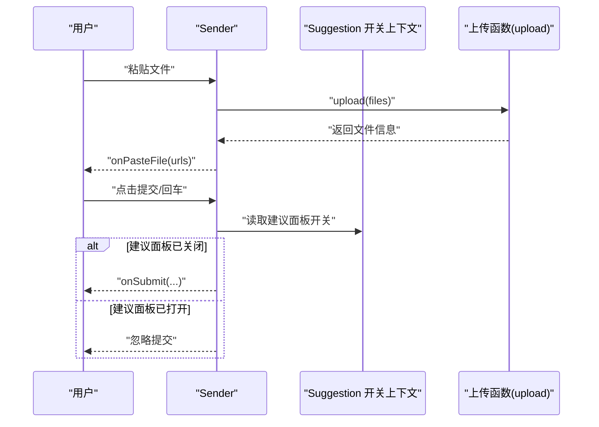
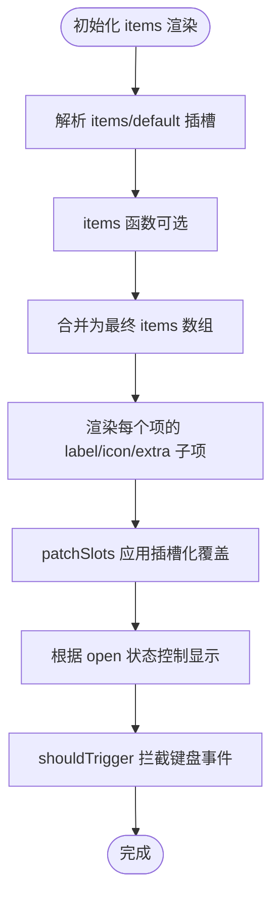
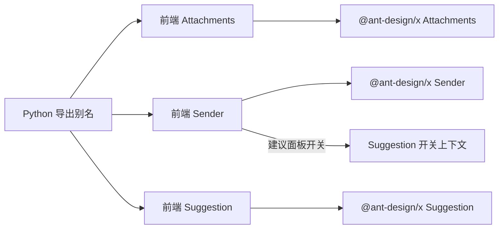

# 表达组件

<cite>
**本文引用的文件**
- [frontend/antdx/attachments/attachments.tsx](file://frontend/antdx/attachments/attachments.tsx)
- [frontend/antdx/sender/sender.tsx](file://frontend/antdx/sender/sender.tsx)
- [frontend/antdx/suggestion/suggestion.tsx](file://frontend/antdx/suggestion/suggestion.tsx)
- [backend/modelscope_studio/components/antdx/components.py](file://backend/modelscope_studio/components/antdx/components.py)
- [backend/modelscope_studio/components/antdx/__init__.py](file://backend/modelscope_studio/components/antdx/__init__.py)
</cite>

## 目录

1. [简介](#简介)
2. [项目结构](#项目结构)
3. [核心组件](#核心组件)
4. [架构总览](#架构总览)
5. [组件详解](#组件详解)
6. [依赖关系分析](#依赖关系分析)
7. [性能与可用性建议](#性能与可用性建议)
8. [故障排查指南](#故障排查指南)
9. [结论](#结论)
10. [附录：使用示例与最佳实践](#附录使用示例与最佳实践)

## 简介

本文件面向 Ant Design X 的表达组件体系，聚焦三大组件：

- 附件（Attachments）：负责文件上传、预览、列表管理与占位渲染
- 发送器（Sender）：负责消息输入、粘贴附件上传、提交与输入状态同步
- 快捷指令（Suggestion）：负责指令补全、触发策略、上下文传递与弹层容器配置

文档将从系统架构、数据流、处理逻辑、组件间协作机制到使用示例与排障建议进行完整说明，帮助开发者快速理解并正确集成。

## 项目结构

Ant Design X 的前端组件位于 frontend/antdx 下，分别以模块化方式组织；后端 Python 包装层在 backend/modelscope_studio/components/antdx 中导出统一别名，便于在 Python 生态中直接使用。

图表来源

- [backend/modelscope_studio/components/antdx/components.py:7-32](file://backend/modelscope_studio/components/antdx/components.py#L7-L32)
- [backend/modelscope_studio/components/antdx/**init**.py:7-41](file://backend/modelscope_studio/components/antdx/__init__.py#L7-L41)

章节来源

- [backend/modelscope_studio/components/antdx/components.py:1-40](file://backend/modelscope_studio/components/antdx/components.py#L1-L40)
- [backend/modelscope_studio/components/antdx/**init**.py:1-42](file://backend/modelscope_studio/components/antdx/__init__.py#L1-L42)

## 核心组件

- 附件（Attachments）
  - 职责：封装 @ant-design/x 的 Attachments，提供上传钩子、占位图渲染、图片预览增强、图标自定义、最大数量控制、移除回调与值变更通知
  - 关键能力：上传前校验、并发上传状态、文件列表去重与合并、错误兜底
- 发送器（Sender）
  - 职责：封装 @ant-design/x 的 Sender，提供输入值双向绑定、粘贴文件上传、技能面板（skill）插槽化、提交事件在建议面板关闭时才触发
  - 关键能力：输入变更同步、粘贴文件上传、插槽化头部/尾部/前后缀、技能提示与可关闭配置
- 快捷指令（Suggestion）
  - 职责：封装 @ant-design/x 的 Suggestion，支持动态 items 渲染、插槽化标签/图标/额外区域、弹层容器定制、打开状态受控与非受控切换
  - 关键能力：触发策略钩子、上下文透传、键盘事件拦截与转发、弹层容器定位

章节来源

- [frontend/antdx/attachments/attachments.tsx:36-410](file://frontend/antdx/attachments/attachments.tsx#L36-L410)
- [frontend/antdx/sender/sender.tsx:18-171](file://frontend/antdx/sender/sender.tsx#L18-L171)
- [frontend/antdx/suggestion/suggestion.tsx:64-162](file://frontend/antdx/suggestion/suggestion.tsx#L64-L162)

## 架构总览

三者协同工作：用户在 Sender 输入文本并粘贴文件，Sender 将文件交由上传函数生成可持久化的文件信息，再通过回调回传给上层；同时，Suggestion 提供指令补全，当其关闭时，Sender 才会真正提交内容，避免误触。

图表来源

- [frontend/antdx/sender/sender.tsx:135-138](file://frontend/antdx/sender/sender.tsx#L135-L138)
- [frontend/antdx/attachments/attachments.tsx:329-348](file://frontend/antdx/attachments/attachments.tsx#L329-L348)
- [frontend/antdx/suggestion/suggestion.tsx:135-140](file://frontend/antdx/suggestion/suggestion.tsx#L135-L140)

## 组件详解

### 附件（Attachments）组件

- 功能要点
  - 文件上传：通过 upload 钩子接收原生文件对象数组，返回文件信息数组；支持 maxCount 控制单/多文件模式
  - 预览增强：imageProps.preview 支持 mask、closeIcon、toolbarRender、imageRender 插槽化与函数化配置
  - 列表管理：自动去重（基于 uid/url/path）、状态标记（done/uploading）、移除回调与值变更通知
  - 占位渲染：placeholder 支持标题/描述/图标插槽化与函数化
  - 交互保护：上传过程中禁用交互，防止重复提交
- 数据流与关键路径
  - 变更处理：onChange 内区分新增/删除分支，新增时先注入临时“上传中”状态，再调用 upload，最后合并结果并触发回调
  - 图片预览：通过 imageProps.preview 的 getContainer、toolbarRender、imageRender 等插槽或函数实现高度定制
  - 显示列表：showUploadList 的图标与 extra 支持插槽化与函数化覆盖
- 错误处理
  - 捕获上传异常并恢复上传状态，避免界面卡死
- 复杂度与性能
  - 去重与状态合并为 O(n)，适合中等规模文件列表
  - 插槽化渲染按需计算，避免不必要的重渲染

图表来源

- [frontend/antdx/attachments/attachments.tsx:275-354](file://frontend/antdx/attachments/attachments.tsx#L275-L354)

章节来源

- [frontend/antdx/attachments/attachments.tsx:36-410](file://frontend/antdx/attachments/attachments.tsx#L36-L410)

### 发送器（Sender）组件

- 功能要点
  - 输入绑定：value 与 onChange 双向同步，支持外部受控
  - 粘贴上传：onPasteFile 将粘贴的文件集合转交给 upload 钩子，并回传文件路径数组
  - 技能面板：skill.title/toolTip/closable 支持插槽化与函数化配置
  - 提交控制：只有当 Suggestion 关闭时，onSubmit 才会被触发，避免建议面板开启时误提交
  - 插槽化布局：header/footer/prefix/suffix 支持 ReactSlot 注入
- 关键交互
  - 使用 useSuggestionOpenContext 获取建议面板开关状态，从而决定是否允许提交
  - slotConfig 中的 formatResult/customRender 通过 createFunction 进行函数化包装
- 错误处理
  - 粘贴上传失败不影响输入框状态，仅记录日志
- 性能与复杂度
  - 值变更与插槽渲染均为轻量级，适合高频输入场景

图表来源

- [frontend/antdx/sender/sender.tsx:126-130](file://frontend/antdx/sender/sender.tsx#L126-L130)
- [frontend/antdx/sender/sender.tsx:135-138](file://frontend/antdx/sender/sender.tsx#L135-L138)

章节来源

- [frontend/antdx/sender/sender.tsx:18-171](file://frontend/antdx/sender/sender.tsx#L18-L171)

### 快捷指令（Suggestion）组件

- 功能要点
  - 动态 items：支持 items 函数或插槽化 items/default 两种来源，优先使用插槽 items
  - 插槽化渲染：label/icon/extra/children 支持 ReactSlot 注入与 patchSlots 处理
  - 触发策略：shouldTrigger 钩子可拦截键盘事件，实现自定义触发条件
  - 弹层容器：getPopupContainer 支持函数化与插槽化，便于在复杂布局中定位
  - 状态控制：open 可受控（undefined 时内部自管），onOpenChange 透传底层状态
- 上下文与事件
  - 通过 SuggestionContext 与 SuggestionOpenContext 向子树传递当前激活项与键盘事件处理
  - children 渲染函数中隐藏真实 children，仅在存在插槽时显示
- 性能与复杂度
  - items 渲染按需计算，插槽化 patch 仅对必要字段生效

图表来源

- [frontend/antdx/suggestion/suggestion.tsx:89-121](file://frontend/antdx/suggestion/suggestion.tsx#L89-L121)
- [frontend/antdx/suggestion/suggestion.tsx:135-140](file://frontend/antdx/suggestion/suggestion.tsx#L135-L140)

章节来源

- [frontend/antdx/suggestion/suggestion.tsx:64-162](file://frontend/antdx/suggestion/suggestion.tsx#L64-L162)

## 依赖关系分析

- 后端导出
  - components.py 与 **init**.py 将 AntdXAttachments/AntdXSender/AntdXSuggestion 等组件统一导出为 Attachments/Sender/Suggestion，便于 Python 端直接使用
- 前端封装
  - 三个组件均通过 sveltify 将 @ant-design/x 的原生组件桥接为支持插槽与函数化配置的 React 组件
  - 通过 useFunction/useValueChange/useTargets 等工具钩子，实现参数函数化与值同步
- 组件间耦合
  - Sender 与 Suggestion 通过上下文建立弱耦合：Sender 仅在 Suggestion 关闭时提交，避免交互冲突
  - Attachments 与 Sender 通过 upload 回调解耦：上传逻辑由上层提供，组件只负责 UI 与状态

图表来源

- [backend/modelscope_studio/components/antdx/components.py:7-32](file://backend/modelscope_studio/components/antdx/components.py#L7-L32)
- [backend/modelscope_studio/components/antdx/**init**.py:7-41](file://backend/modelscope_studio/components/antdx/__init__.py#L7-L41)
- [frontend/antdx/sender/sender.tsx:72-72](file://frontend/antdx/sender/sender.tsx#L72-L72)

章节来源

- [backend/modelscope_studio/components/antdx/components.py:1-40](file://backend/modelscope_studio/components/antdx/components.py#L1-L40)
- [backend/modelscope_studio/components/antdx/**init**.py:1-42](file://backend/modelscope_studio/components/antdx/__init__.py#L1-L42)

## 性能与可用性建议

- 附件上传
  - 合理设置 maxCount，避免一次性上传过多文件导致内存压力
  - beforeUpload 中进行格式/大小校验，减少无效请求
  - 使用 imageProps.preview 的 getContainer 将预览浮层挂载到合适容器，避免滚动穿透
- 发送器
  - 对高频输入使用节流/防抖策略（可在上层实现），降低 onChange 频率
  - 在多插槽场景下，尽量复用函数化配置，减少插槽渲染开销
- 快捷指令
  - items 渲染尽量保持稳定结构，避免频繁重建 DOM
  - shouldTrigger 中仅做必要判断，避免阻塞键盘事件
- 全局
  - 在复杂布局中，优先使用 getPopupContainer 定位建议面板，确保可见性
  - 对上传失败进行友好提示，避免用户困惑

## 故障排查指南

- 附件无法删除
  - 检查 onChange 分支中的删除逻辑是否被提前 return
  - 确认 validFileList 中是否存在匹配 uid 的条目
- 上传无响应
  - 确认 upload 钩子返回值是否为 Promise<FileData[]>，且未抛错
  - 检查 maxCount 是否限制了新增数量
- 预览不显示
  - 确认 imageProps.preview 配置是否启用，以及 getContainer 返回的容器存在
- 提交被阻止
  - 检查 Suggestion 的 open 状态是否为 true，Sender 仅在关闭时触发 onSubmit
- 粘贴上传失败
  - onPasteFile 回调中检查 upload 返回的路径数组是否为空
  - 查看控制台是否有异常堆栈

章节来源

- [frontend/antdx/attachments/attachments.tsx:275-354](file://frontend/antdx/attachments/attachments.tsx#L275-L354)
- [frontend/antdx/sender/sender.tsx:126-138](file://frontend/antdx/sender/sender.tsx#L126-L138)
- [frontend/antdx/suggestion/suggestion.tsx:135-140](file://frontend/antdx/suggestion/suggestion.tsx#L135-L140)

## 结论

表达组件围绕“输入—上传—补全—提交”的闭环设计，通过插槽化与函数化配置实现高扩展性，同时在交互层面通过上下文隔离避免误触。Attachments 负责文件生命周期管理，Sender 负责输入与提交时机控制，Suggestion 提供智能补全与触发策略。三者配合可满足多模态输入、附件处理与指令执行等典型场景。

## 附录：使用示例与最佳实践

- 多模态输入与附件处理
  - 在 Sender 中监听 onChange/onPasteFile，将粘贴的文件通过 upload 钩子转换为持久化路径，再将文本与文件路径一并提交
  - 在 Attachments 中配置 beforeUpload/isImageUrl 等钩子，提升上传体验
- 快捷指令与用户行为分析
  - 使用 Suggestion 的 items 与 shouldTrigger 实现指令补全，结合 getPopupContainer 保证弹层定位
  - 通过 onOpenChange 与 SuggestionOpenContext 记录用户打开/关闭建议面板的行为，用于后续分析
- 组件协同
  - 当 Suggestion 打开时，Sender 不应提交；当 Suggestion 关闭时，再触发 onSubmit，避免干扰用户输入
  - 通过插槽化（header/footer/prefix/suffix/skill.\*）实现 UI 层面的灵活组合
