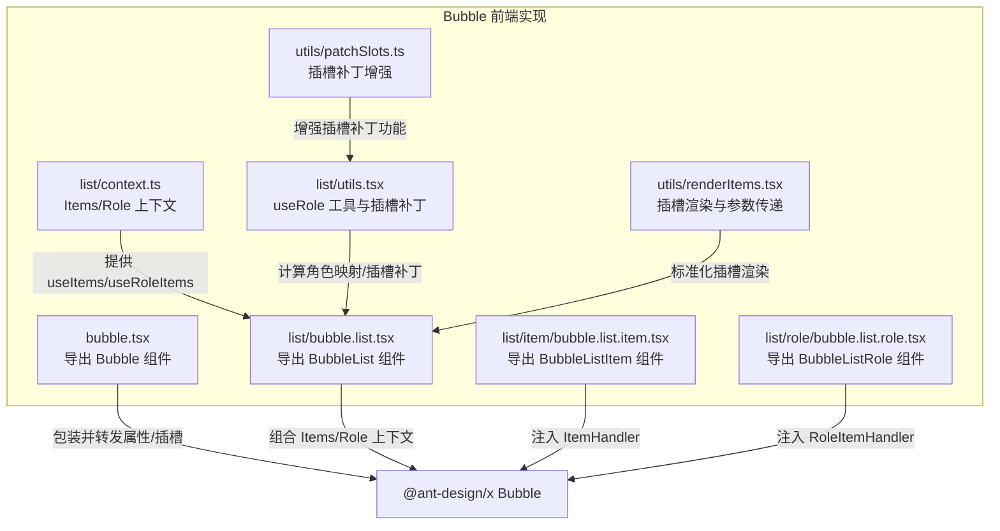
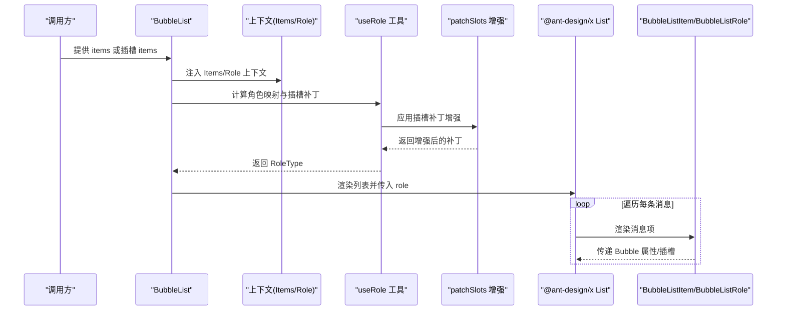
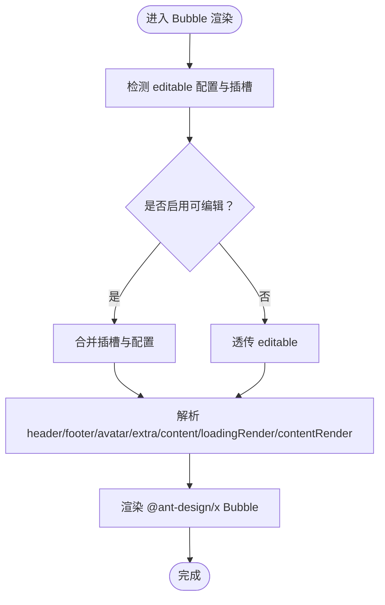
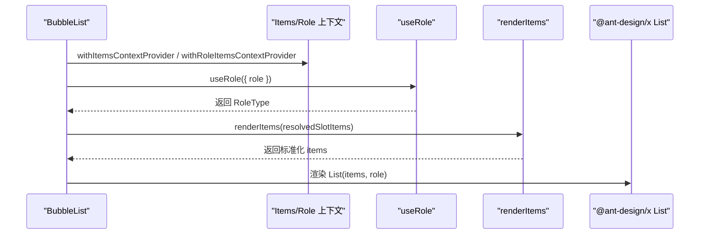
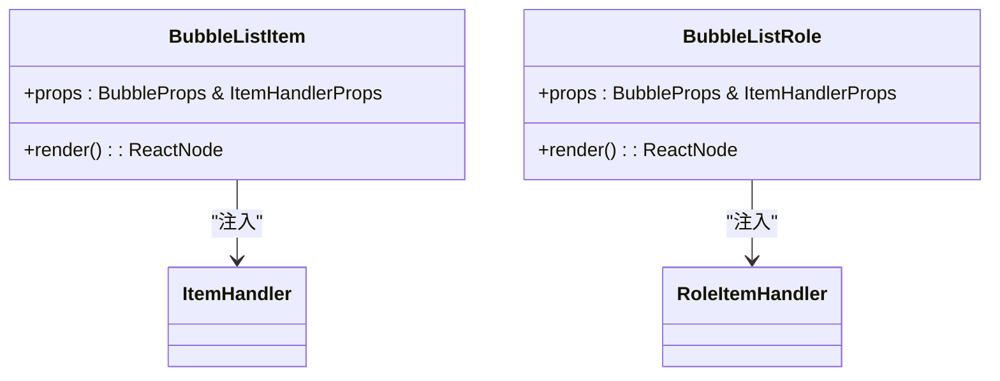
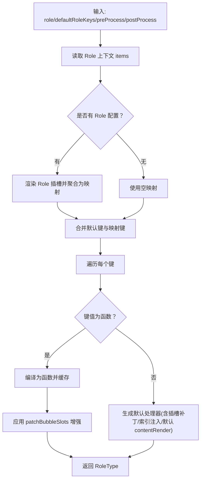
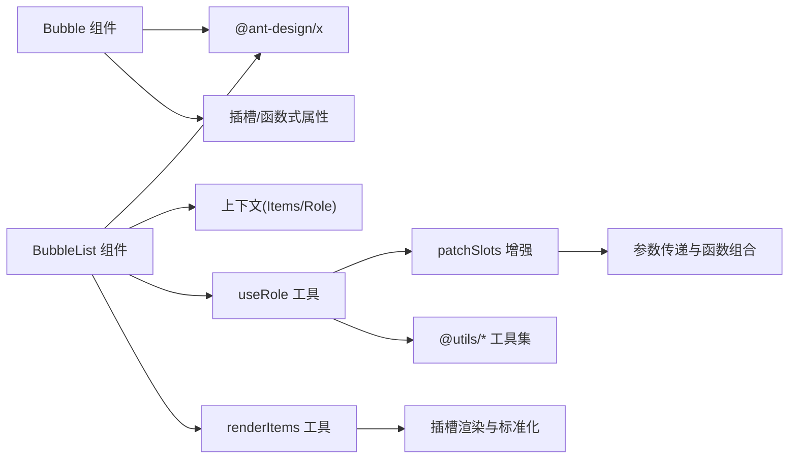

# Bubble 对话气泡

<cite>
**本文引用的文件**
- [frontend/antdx/bubble/bubble.tsx](file://frontend/antdx/bubble/bubble.tsx)
- [frontend/antdx/bubble/list/bubble.list.tsx](file://frontend/antdx/bubble/list/bubble.list.tsx)
- [frontend/antdx/bubble/list/item/bubble.list.item.tsx](file://frontend/antdx/bubble/list/item/bubble.list.item.tsx)
- [frontend/antdx/bubble/list/role/bubble.list.role.tsx](file://frontend/antdx/bubble/list/role/bubble.list.role.tsx)
- [frontend/antdx/bubble/list/context.ts](file://frontend/antdx/bubble/list/context.ts)
- [frontend/antdx/bubble/list/utils.tsx](file://frontend/antdx/bubble/list/utils.tsx)
- [frontend/utils/patchSlots.ts](file://frontend/utils/patchSlots.ts)
- [frontend/utils/renderItems.tsx](file://frontend/utils/renderItems.tsx)
</cite>

## 更新摘要

**所做更改**

- 更新了 Bubble 组件槽处理逻辑的性能优化部分
- 移除了未使用的 unshift 行为，提升了渲染性能
- 完善了插槽补丁机制的技术细节说明

## 目录

1. [简介](#简介)
2. [项目结构](#项目结构)
3. [核心组件](#核心组件)
4. [架构总览](#架构总览)
5. [组件详解](#组件详解)
6. [依赖关系分析](#依赖关系分析)
7. [性能与可维护性](#性能与可维护性)
8. [故障排查指南](#故障排查指南)
9. [结论](#结论)
10. [附录：使用示例与最佳实践](#附录使用示例与最佳实践)

## 简介

本文件面向 Bubble 对话气泡组件体系，系统梳理其整体架构、核心能力与使用方式，覆盖以下要点：

- Bubble 组件的渲染机制与插槽/函数式内容适配
- Bubble.List 列表组件的消息展示逻辑与角色分发
- Bubble.Item 消息项的渲染规则与上下文注入
- Bubble.Role 角色标识的使用方法与动态装配
- Divider 分割线组件在对话中的作用与适用场景
- 样式定制、事件处理与最佳实践

## 项目结构

Bubble 组件位于前端 antdx 子包中，采用 Svelte 包装层对接 @ant-design/x 的原生组件，并通过上下文与工具函数实现列表化、角色化与插槽渲染。

**图示来源**

- [frontend/antdx/bubble/bubble.tsx:1-120](file://frontend/antdx/bubble/bubble.tsx#L1-L120)
- [frontend/antdx/bubble/list/bubble.list.tsx:1-50](file://frontend/antdx/bubble/list/bubble.list.tsx#L1-L50)
- [frontend/antdx/bubble/list/item/bubble.list.item.tsx:1-14](file://frontend/antdx/bubble/list/item/bubble.list.item.tsx#L1-L14)
- [frontend/antdx/bubble/list/role/bubble.list.role.tsx:1-14](file://frontend/antdx/bubble/list/role/bubble.list.role.tsx#L1-L14)
- [frontend/antdx/bubble/list/context.ts:1-13](file://frontend/antdx/bubble/list/context.ts#L1-L13)
- [frontend/antdx/bubble/list/utils.tsx:1-135](file://frontend/antdx/bubble/list/utils.tsx#L1-L135)
- [frontend/utils/patchSlots.ts:1-32](file://frontend/utils/patchSlots.ts#L1-L32)
- [frontend/utils/renderItems.tsx:1-114](file://frontend/utils/renderItems.tsx#L1-L114)

**章节来源**

- [frontend/antdx/bubble/bubble.tsx:1-120](file://frontend/antdx/bubble/bubble.tsx#L1-L120)
- [frontend/antdx/bubble/list/bubble.list.tsx:1-50](file://frontend/antdx/bubble/list/bubble.list.tsx#L1-L50)
- [frontend/antdx/bubble/list/item/bubble.list.item.tsx:1-14](file://frontend/antdx/bubble/list/item/bubble.list.item.tsx#L1-L14)
- [frontend/antdx/bubble/list/role/bubble.list.role.tsx:1-14](file://frontend/antdx/bubble/list/role/bubble.list.role.tsx#L1-L14)
- [frontend/antdx/bubble/list/context.ts:1-13](file://frontend/antdx/bubble/list/context.ts#L1-L13)
- [frontend/antdx/bubble/list/utils.tsx:1-135](file://frontend/antdx/bubble/list/utils.tsx#L1-L135)
- [frontend/utils/patchSlots.ts:1-32](file://frontend/utils/patchSlots.ts#L1-L32)
- [frontend/utils/renderItems.tsx:1-114](file://frontend/utils/renderItems.tsx#L1-L114)

## 核心组件

- Bubble：对 @ant-design/x 的 Bubble 进行 Svelte 包装，支持插槽与函数式属性的统一渲染，同时兼容可编辑态的文案插槽。
- BubbleList：列表容器，负责合并外部 items 与插槽 items，注入角色上下文，将消息逐条交给 @ant-design/x 的 List 渲染。
- BubbleListItem：消息项包装器，通过 ItemHandler 注入上下文，使单个 Bubble 能感知列表环境。
- BubbleListRole：角色项包装器，通过 RoleItemHandler 注入角色上下文，使角色配置可被 useRole 解析。
- useRole：核心角色解析工具，支持默认键、预处理、后处理与插槽补丁，将角色映射为 @ant-design/x 所需的 RoleType。

**章节来源**

- [frontend/antdx/bubble/bubble.tsx:1-120](file://frontend/antdx/bubble/bubble.tsx#L1-L120)
- [frontend/antdx/bubble/list/bubble.list.tsx:1-50](file://frontend/antdx/bubble/list/bubble.list.tsx#L1-L50)
- [frontend/antdx/bubble/list/item/bubble.list.item.tsx:1-14](file://frontend/antdx/bubble/list/item/bubble.list.item.tsx#L1-L14)
- [frontend/antdx/bubble/list/role/bubble.list.role.tsx:1-14](file://frontend/antdx/bubble/list/role/bubble.list.role.tsx#L1-L14)
- [frontend/antdx/bubble/list/utils.tsx:49-135](file://frontend/antdx/bubble/list/utils.tsx#L49-L135)

## 架构总览

Bubble 体系通过"包装层 + 上下文 + 工具函数"的方式，将 @ant-design/x 的原生能力与 Gradio 风格的插槽/函数式属性打通，形成可扩展的角色化消息列表。

**图示来源**

- [frontend/antdx/bubble/list/bubble.list.tsx:18-46](file://frontend/antdx/bubble/list/bubble.list.tsx#L18-L46)
- [frontend/antdx/bubble/list/context.ts:1-13](file://frontend/antdx/bubble/list/context.ts#L1-L13)
- [frontend/antdx/bubble/list/utils.tsx:84-134](file://frontend/antdx/bubble/list/utils.tsx#L84-L134)
- [frontend/utils/patchSlots.ts:4-31](file://frontend/utils/patchSlots.ts#L4-L31)

## 组件详解

### Bubble 组件

- 功能定位：对 @ant-design/x 的 Bubble 进行 Svelte 包装，统一处理插槽与函数式属性，支持可编辑态文案插槽。
- 关键点：
  - 插槽优先：当存在对应插槽时，优先渲染插槽内容；否则回退到属性值或函数。
  - 可编辑态：通过 editable 配置与插槽组合，支持自定义"确定/取消"文案。
  - 函数式属性：通过 useFunction 将传入的函数转换为可渲染的 React 组件。
  - 隐藏子节点：将 children 放入不可见容器，避免重复渲染。

**图示来源**

- [frontend/antdx/bubble/bubble.tsx:27-117](file://frontend/antdx/bubble/bubble.tsx#L27-L117)

**章节来源**

- [frontend/antdx/bubble/bubble.tsx:1-120](file://frontend/antdx/bubble/bubble.tsx#L1-L120)

### BubbleList 列表组件

- 功能定位：消息列表容器，负责：
  - 合并外部 items 与插槽 items
  - 注入 Items 与 Role 上下文
  - 使用 useRole 解析角色映射
  - 将最终 items 交由 @ant-design/x 的 List 渲染
- 关键点：
  - 优先使用 props.items；若无则使用插槽 items/default
  - 通过 renderItems 将插槽内容标准化为数组
  - 通过 useMemo 缓存 items，减少重渲染

**图示来源**

- [frontend/antdx/bubble/list/bubble.list.tsx:18-46](file://frontend/antdx/bubble/list/bubble.list.tsx#L18-L46)
- [frontend/antdx/bubble/list/context.ts:1-13](file://frontend/antdx/bubble/list/context.ts#L1-L13)
- [frontend/antdx/bubble/list/utils.tsx:84-134](file://frontend/antdx/bubble/list/utils.tsx#L84-L134)
- [frontend/utils/renderItems.tsx:8-114](file://frontend/utils/renderItems.tsx#L8-L114)

**章节来源**

- [frontend/antdx/bubble/list/bubble.list.tsx:1-50](file://frontend/antdx/bubble/list/bubble.list.tsx#L1-L50)
- [frontend/antdx/bubble/list/context.ts:1-13](file://frontend/antdx/bubble/list/context.ts#L1-L13)
- [frontend/antdx/bubble/list/utils.tsx:1-135](file://frontend/antdx/bubble/list/utils.tsx#L1-L135)
- [frontend/utils/renderItems.tsx:1-114](file://frontend/utils/renderItems.tsx#L1-L114)

### BubbleListItem 与 BubbleListRole

- BubbleListItem：将 ItemHandler 注入到 Bubble，使单个消息项具备列表上下文能力。
- BubbleListRole：将 RoleItemHandler 注入到角色配置，使角色项可被 useRole 解析为 RoleType。

**图示来源**

- [frontend/antdx/bubble/list/item/bubble.list.item.tsx:7-11](file://frontend/antdx/bubble/list/item/bubble.list.item.tsx#L7-L11)
- [frontend/antdx/bubble/list/role/bubble.list.role.tsx:7-11](file://frontend/antdx/bubble/list/role/bubble.list.role.tsx#L7-L11)
- [frontend/antdx/bubble/list/context.ts:3-10](file://frontend/antdx/bubble/list/context.ts#L3-L10)

**章节来源**

- [frontend/antdx/bubble/list/item/bubble.list.item.tsx:1-14](file://frontend/antdx/bubble/list/item/bubble.list.item.tsx#L1-L14)
- [frontend/antdx/bubble/list/role/bubble.list.role.tsx:1-14](file://frontend/antdx/bubble/list/role/bubble.list.role.tsx#L1-L14)
- [frontend/antdx/bubble/list/context.ts:1-13](file://frontend/antdx/bubble/list/context.ts#L1-L13)

### useRole 角色解析工具

- 功能定位：将角色配置（字符串函数或对象）转换为 @ant-design/x 所需的 RoleType，并进行插槽补丁与索引注入。
- 关键点：
  - 支持默认键 defaultRoleKeys
  - 支持 preProcess 与 defaultRolePostProcess 钩子
  - 自动将角色配置中的 header/footer/avatar/extra/loadingRender/contentRender 等插槽与内容进行补丁合并
  - 默认 contentRender 会将对象序列化为字符串

**更新** 优化了插槽补丁处理逻辑，移除了未使用的 unshift 行为，提升了渲染性能

**图示来源**

- [frontend/antdx/bubble/list/utils.tsx:49-135](file://frontend/antdx/bubble/list/utils.tsx#L49-L135)
- [frontend/utils/patchSlots.ts:4-31](file://frontend/utils/patchSlots.ts#L4-L31)

**章节来源**

- [frontend/antdx/bubble/list/utils.tsx:1-135](file://frontend/antdx/bubble/list/utils.tsx#L1-L135)
- [frontend/utils/patchSlots.ts:1-32](file://frontend/utils/patchSlots.ts#L1-L32)

### Divider 分割线组件

- 作用：在对话气泡之间插入分割线，用于视觉分段与节奏控制。
- 使用场景：多轮对话、模块化展示、时间/主题切换提示等。
- 注意：Divider 作为独立组件，通常与 BubbleList 协作，通过插槽或布局控制其出现位置与样式。

（本节为概念性说明，不直接分析具体源码）

## 依赖关系分析

- 组件耦合：
  - Bubble 仅作为包装层，依赖 @ant-design/x 的原生能力，耦合度低，便于升级替换。
  - BubbleList 依赖上下文与工具函数，职责清晰，耦合集中在 useRole 与 renderItems。
- 上下文与工具：
  - createItemsContext 提供 Items/Role 两套上下文，分别服务于列表项与角色项。
  - useRole 是角色解析的核心，承担了从配置到渲染参数的转换职责。
  - patchSlots 提供插槽补丁增强功能，支持参数传递与函数组合。
- 外部依赖：
  - @ant-design/x：提供 Bubble/List/Role 类型与渲染能力
  - @svelte-preprocess-react：桥接 Svelte 与 React 插槽
  - @utils/\*：提供渲染与函数封装工具

**图示来源**

- [frontend/antdx/bubble/bubble.tsx:1-120](file://frontend/antdx/bubble/bubble.tsx#L1-L120)
- [frontend/antdx/bubble/list/bubble.list.tsx:1-50](file://frontend/antdx/bubble/list/bubble.list.tsx#L1-L50)
- [frontend/antdx/bubble/list/context.ts:1-13](file://frontend/antdx/bubble/list/context.ts#L1-L13)
- [frontend/antdx/bubble/list/utils.tsx:1-135](file://frontend/antdx/bubble/list/utils.tsx#L1-L135)
- [frontend/utils/patchSlots.ts:1-32](file://frontend/utils/patchSlots.ts#L1-L32)
- [frontend/utils/renderItems.tsx:1-114](file://frontend/utils/renderItems.tsx#L1-L114)

**章节来源**

- [frontend/antdx/bubble/bubble.tsx:1-120](file://frontend/antdx/bubble/bubble.tsx#L1-L120)
- [frontend/antdx/bubble/list/bubble.list.tsx:1-50](file://frontend/antdx/bubble/list/bubble.list.tsx#L1-L50)
- [frontend/antdx/bubble/list/context.ts:1-13](file://frontend/antdx/bubble/list/context.ts#L1-L13)
- [frontend/antdx/bubble/list/utils.tsx:1-135](file://frontend/antdx/bubble/list/utils.tsx#L1-L135)
- [frontend/utils/patchSlots.ts:1-32](file://frontend/utils/patchSlots.ts#L1-L32)
- [frontend/utils/renderItems.tsx:1-114](file://frontend/utils/renderItems.tsx#L1-L114)

## 性能与可维护性

- 性能优化建议：
  - 使用 useMemo 缓存 BubbleList 的 items，避免不必要的重渲染。
  - 在 useRole 中合理设置依赖数组，避免重复计算角色映射。
  - 将大型插槽内容拆分为可复用组件，减少闭包与对象创建。
  - **优化** 移除了未使用的 unshift 行为，减少了不必要的参数重组开销。
- 可维护性建议：
  - 将角色配置集中管理，避免散落于多处。
  - 使用 preProcess/postProcess 钩子统一处理消息预处理与后处理，降低模板复杂度。
  - 保持 Bubble 的插槽命名一致性，便于团队协作与文档维护。

**更新** 通过移除未使用的 unshift 行为，进一步优化了插槽补丁处理的性能表现

（本节为通用建议，不直接分析具体源码）

## 故障排查指南

- 插槽未生效
  - 检查插槽名称是否与组件约定一致（如 avatar/header/footer/extra/content 等）
  - 确认 Bubble/BubbleList 是否正确包裹插槽
- 角色配置无效
  - 确认 BubbleListRole 是否正确注入 RoleItemHandler
  - 检查 useRole 的 defaultRoleKeys 与 preProcess/postProcess 是否按预期工作
- 可编辑文案不显示
  - 确认 editable 配置与插槽是否同时存在，插槽优先级更高
  - 检查 editable.okText/editable.cancelText 的插槽是否正确传入
- 列表渲染异常
  - 确认 BubbleListItem 是否正确注入 ItemHandler
  - 检查 items 与插槽 items 的数据结构是否符合要求
- **新增** 插槽参数传递问题
  - 检查 patchSlots 中的 unshift 配置是否正确设置
  - 确认插槽函数的参数顺序与预期一致

**章节来源**

- [frontend/antdx/bubble/bubble.tsx:36-64](file://frontend/antdx/bubble/bubble.tsx#L36-L64)
- [frontend/antdx/bubble/list/bubble.list.tsx:18-46](file://frontend/antdx/bubble/list/bubble.list.tsx#L18-L46)
- [frontend/antdx/bubble/list/role/bubble.list.role.tsx:7-11](file://frontend/antdx/bubble/list/role/bubble.list.role.tsx#L7-L11)
- [frontend/antdx/bubble/list/item/bubble.list.item.tsx:7-11](file://frontend/antdx/bubble/list/item/bubble.list.item.tsx#L7-L11)
- [frontend/antdx/bubble/list/utils.tsx:84-134](file://frontend/antdx/bubble/list/utils.tsx#L84-L134)
- [frontend/utils/patchSlots.ts:16-29](file://frontend/utils/patchSlots.ts#L16-L29)

## 结论

Bubble 对话气泡组件体系以"包装层 + 上下文 + 工具函数"为核心设计，既保留了 @ant-design/x 的强大能力，又提供了灵活的插槽与角色化扩展。通过 BubbleList、BubbleListItem、BubbleListRole 与 useRole 的协同，开发者可以快速构建复杂、可定制的对话界面，并在样式、交互与可维护性之间取得良好平衡。

**更新** 最新的性能优化通过移除未使用的 unshift 行为，进一步提升了插槽处理的效率，为大规模对话场景提供了更好的性能保障。

## 附录：使用示例与最佳实践

- 基本对话气泡
  - 使用 Bubble 组件承载消息内容，通过 content 插槽或属性传入文本/富文本
  - 通过 avatar/header/footer/extra 等插槽添加头像、标题、操作区与额外信息
- 复杂消息格式
  - 使用 contentRender 对象/数组进行结构化渲染
  - 通过 preProcess/postProcess 钩子统一处理消息字段与样式
- 自定义样式
  - 通过 role 映射为不同角色配置，结合插槽补丁实现差异化样式
  - 使用 Divider 在关键节点插入分割线，提升可读性
- 最佳实践
  - 将角色配置集中管理，避免分散在模板中
  - 使用 useMemo 缓存 items 与角色映射，减少重渲染
  - 保持插槽命名规范，便于团队协作与文档维护
  - **优化建议** 在使用插槽参数传递时，合理利用 patchSlots 的增强功能，避免不必要的参数重组

（本节为概念性说明，不直接分析具体源码）
