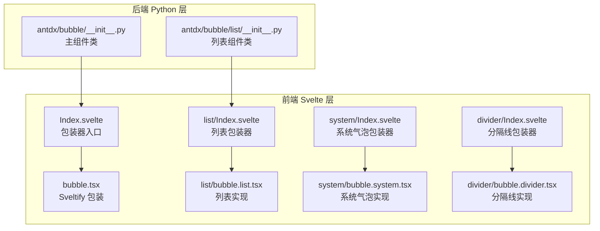
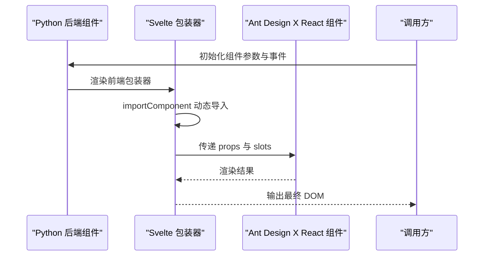
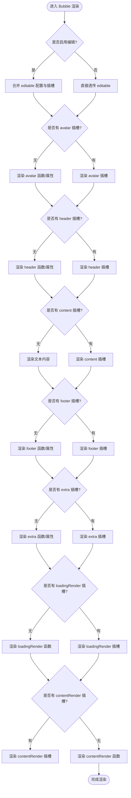
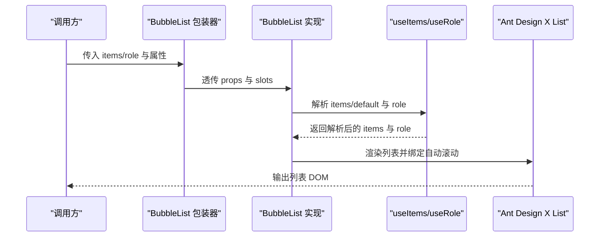
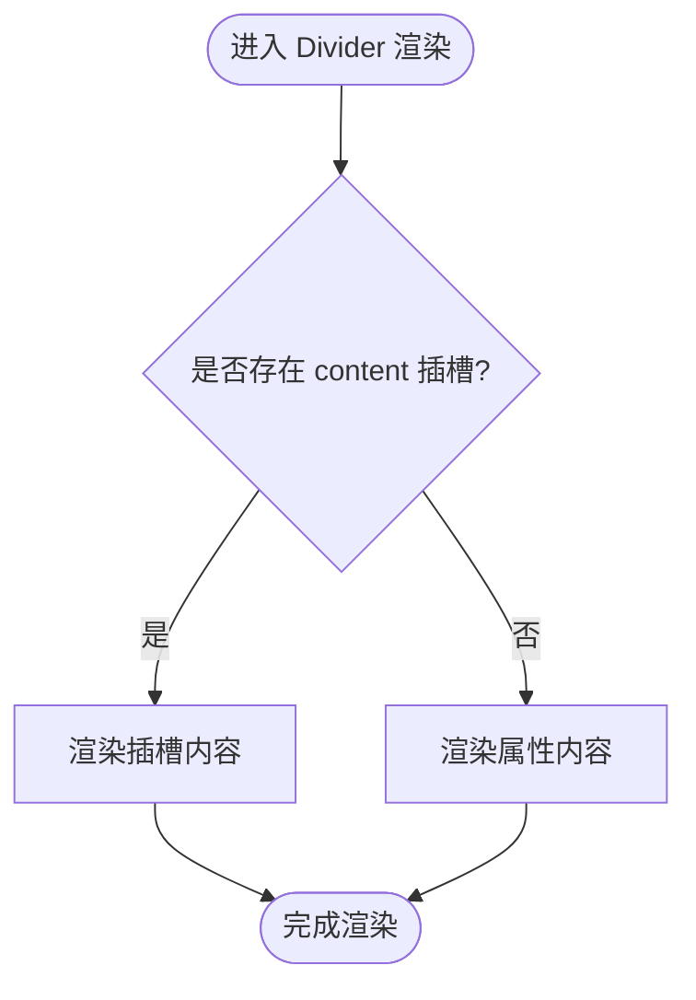
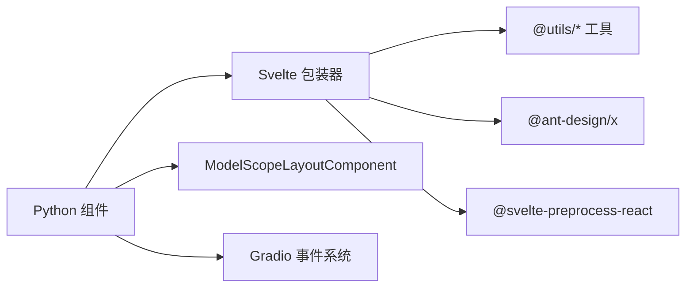

# Bubble 组件概览

<cite>
**本文档引用的文件**
- [frontend/antdx/bubble/Index.svelte](file://frontend/antdx/bubble/Index.svelte)
- [frontend/antdx/bubble/bubble.tsx](file://frontend/antdx/bubble/bubble.tsx)
- [frontend/antdx/bubble/list/Index.svelte](file://frontend/antdx/bubble/list/Index.svelte)
- [frontend/antdx/bubble/list/bubble.list.tsx](file://frontend/antdx/bubble/list/bubble.list.tsx)
- [frontend/antdx/bubble/system/Index.svelte](file://frontend/antdx/bubble/system/Index.svelte)
- [frontend/antdx/bubble/system/bubble.system.tsx](file://frontend/antdx/bubble/system/bubble.system.tsx)
- [frontend/antdx/bubble/divider/Index.svelte](file://frontend/antdx/bubble/divider/Index.svelte)
- [frontend/antdx/bubble/divider/bubble.divider.tsx](file://frontend/antdx/bubble/divider/bubble.divider.tsx)
- [backend/modelscope_studio/components/antdx/bubble/__init__.py](file://backend/modelscope_studio/components/antdx/bubble/__init__.py)
- [backend/modelscope_studio/components/antdx/bubble/list/__init__.py](file://backend/modelscope_studio/components/antdx/bubble/list/__init__.py)
</cite>

## 目录

1. [简介](#简介)
2. [项目结构](#项目结构)
3. [核心组件](#核心组件)
4. [架构总览](#架构总览)
5. [详细组件分析](#详细组件分析)
6. [依赖关系分析](#依赖关系分析)
7. [性能考虑](#性能考虑)
8. [故障排查指南](#故障排查指南)
9. [结论](#结论)
10. [附录](#附录)

## 简介

Bubble 是面向机器学习对话场景的可视化气泡组件，基于 Ant Design X 的 Bubble 能力构建，提供消息气泡的渲染、编辑、打字动画、内容分发等能力，并通过 Gradio/ModelScope 生态实现前后端一体化开发体验。该组件族包含单个气泡、气泡列表、系统消息分隔线以及系统型气泡等子组件，覆盖从基础展示到复杂交互的多种对话形态。

## 项目结构

Bubble 组件由前端 Svelte 包装层与后端 Python 组件层共同构成，采用“前端 React 组件 + 后端 Gradio 组件”的双层设计，确保在 Python 环境中以声明式方式使用 Ant Design X 的能力。

图表来源

- [frontend/antdx/bubble/Index.svelte:1-78](file://frontend/antdx/bubble/Index.svelte#L1-L78)
- [frontend/antdx/bubble/bubble.tsx:1-119](file://frontend/antdx/bubble/bubble.tsx#L1-L119)
- [frontend/antdx/bubble/list/Index.svelte:1-66](file://frontend/antdx/bubble/list/Index.svelte#L1-L66)
- [frontend/antdx/bubble/list/bubble.list.tsx:1-49](file://frontend/antdx/bubble/list/bubble.list.tsx#L1-L49)
- [frontend/antdx/bubble/system/Index.svelte:1-64](file://frontend/antdx/bubble/system/Index.svelte#L1-L64)
- [frontend/antdx/bubble/system/bubble.system.tsx:1-27](file://frontend/antdx/bubble/system/bubble.system.tsx#L1-L27)
- [frontend/antdx/bubble/divider/Index.svelte:1-66](file://frontend/antdx/bubble/divider/Index.svelte#L1-L66)
- [frontend/antdx/bubble/divider/bubble.divider.tsx:1-27](file://frontend/antdx/bubble/divider/bubble.divider.tsx#L1-L27)
- [backend/modelscope_studio/components/antdx/bubble/**init**.py:1-135](file://backend/modelscope_studio/components/antdx/bubble/__init__.py#L1-L135)
- [backend/modelscope_studio/components/antdx/bubble/list/**init**.py:1-84](file://backend/modelscope_studio/components/antdx/bubble/list/__init__.py#L1-L84)

章节来源

- [frontend/antdx/bubble/Index.svelte:1-78](file://frontend/antdx/bubble/Index.svelte#L1-L78)
- [frontend/antdx/bubble/bubble.tsx:1-119](file://frontend/antdx/bubble/bubble.tsx#L1-L119)
- [frontend/antdx/bubble/list/Index.svelte:1-66](file://frontend/antdx/bubble/list/Index.svelte#L1-L66)
- [frontend/antdx/bubble/list/bubble.list.tsx:1-49](file://frontend/antdx/bubble/list/bubble.list.tsx#L1-L49)
- [frontend/antdx/bubble/system/Index.svelte:1-64](file://frontend/antdx/bubble/system/Index.svelte#L1-L64)
- [frontend/antdx/bubble/system/bubble.system.tsx:1-27](file://frontend/antdx/bubble/system/bubble.system.tsx#L1-L27)
- [frontend/antdx/bubble/divider/Index.svelte:1-66](file://frontend/antdx/bubble/divider/Index.svelte#L1-L66)
- [frontend/antdx/bubble/divider/bubble.divider.tsx:1-27](file://frontend/antdx/bubble/divider/bubble.divider.tsx#L1-L27)
- [backend/modelscope_studio/components/antdx/bubble/**init**.py:1-135](file://backend/modelscope_studio/components/antdx/bubble/__init__.py#L1-L135)
- [backend/modelscope_studio/components/antdx/bubble/list/**init**.py:1-84](file://backend/modelscope_studio/components/antdx/bubble/list/__init__.py#L1-L84)

## 核心组件

- 单个气泡组件：负责渲染一条消息气泡，支持头像、标题、内容、额外操作、底部栏、加载与内容自定义渲染、可编辑模式、打字动画等。
- 气泡列表组件：用于承载多条气泡，支持角色分组、自动滚动、插槽注入 items/role 等。
- 系统气泡组件：用于渲染系统提示或状态信息，强调语义化展示。
- 分隔线组件：用于在对话中插入分隔提示，如时间分隔、会话切换提示等。

章节来源

- [frontend/antdx/bubble/bubble.tsx:1-119](file://frontend/antdx/bubble/bubble.tsx#L1-L119)
- [frontend/antdx/bubble/list/bubble.list.tsx:1-49](file://frontend/antdx/bubble/list/bubble.list.tsx#L1-L49)
- [frontend/antdx/bubble/system/bubble.system.tsx:1-27](file://frontend/antdx/bubble/system/bubble.system.tsx#L1-L27)
- [frontend/antdx/bubble/divider/bubble.divider.tsx:1-27](file://frontend/antdx/bubble/divider/bubble.divider.tsx#L1-L27)

## 架构总览

Bubble 组件采用“Svelte 包装 + Ant Design X React 组件 + Gradio/ModelScope 后端桥接”的三层架构。前端通过 Svelte 的 importComponent 实现按需加载，使用 sveltify 将 React 组件桥接到 Svelte；后端通过 ModelScopeLayoutComponent 抽象，统一处理事件绑定、插槽映射与属性透传。

图表来源

- [frontend/antdx/bubble/Index.svelte:10-77](file://frontend/antdx/bubble/Index.svelte#L10-L77)
- [frontend/antdx/bubble/bubble.tsx:27-116](file://frontend/antdx/bubble/bubble.tsx#L27-L116)
- [backend/modelscope_studio/components/antdx/bubble/**init**.py:13-54](file://backend/modelscope_studio/components/antdx/bubble/__init__.py#L13-L54)

## 详细组件分析

### 单个气泡组件（Bubble）

- 设计理念：以 Ant Design X 的 Bubble 为核心，提供丰富的插槽与回调扩展点，满足对话场景中对头像、标题、内容、操作区、加载态与编辑态的多样化需求。
- 关键特性
  - 插槽体系：avatar、content、header、footer、extra、loadingRender、contentRender、editable.okText、editable.cancelText。
  - 编辑能力：支持 editable 布尔开关与配置对象，结合插槽实现自定义文案与渲染。
  - 打字动画：typing 支持布尔与配置对象，配合 typingComplete 事件完成动画生命周期管理。
  - 自定义渲染：loadingRender 与 contentRender 支持函数或插槽注入，灵活控制加载态与内容渲染。
  - 头像与额外区域：avatar、extra 支持函数或插槽，便于扩展图标、操作按钮等。
- 数据流与渲染流程

图表来源

- [frontend/antdx/bubble/bubble.tsx:27-116](file://frontend/antdx/bubble/bubble.tsx#L27-L116)

章节来源

- [frontend/antdx/bubble/bubble.tsx:1-119](file://frontend/antdx/bubble/bubble.tsx#L1-L119)
- [backend/modelscope_studio/components/antdx/bubble/**init**.py:21-54](file://backend/modelscope_studio/components/antdx/bubble/__init__.py#L21-L54)

### 气泡列表组件（BubbleList）

- 设计理念：在单个气泡基础上，提供批量渲染与角色分组能力，适合多轮对话、历史消息列表等场景。
- 关键特性
  - 角色分组：通过 role 插槽或属性定义不同角色（如用户、系统、助手）的展示策略。
  - 插槽 items/default：支持通过插槽注入列表项，或直接传入 items 数组。
  - 自动滚动：可配置自动滚动至最新消息，提升用户体验。
  - 上下文注入：通过 useItems 与 useRole 解析插槽与默认值，保证灵活性与一致性。
- 列表渲染流程

图表来源

- [frontend/antdx/bubble/list/Index.svelte:10-65](file://frontend/antdx/bubble/list/Index.svelte#L10-L65)
- [frontend/antdx/bubble/list/bubble.list.tsx:13-46](file://frontend/antdx/bubble/list/bubble.list.tsx#L13-L46)

章节来源

- [frontend/antdx/bubble/list/Index.svelte:1-66](file://frontend/antdx/bubble/list/Index.svelte#L1-L66)
- [frontend/antdx/bubble/list/bubble.list.tsx:1-49](file://frontend/antdx/bubble/list/bubble.list.tsx#L1-L49)
- [backend/modelscope_studio/components/antdx/bubble/list/**init**.py:12-30](file://backend/modelscope_studio/components/antdx/bubble/list/__init__.py#L12-L30)

### 系统气泡组件（BubbleSystem）

- 设计理念：用于展示系统级提示或状态信息，强调语义化与一致性，常用于“系统通知”“会话开始”“模型切换”等场景。
- 关键特性
  - 内容插槽：content 插槽优先于属性 content，便于动态渲染。
  - 语义化展示：基于 Ant Design X 的 System 类型，统一风格与行为。
- 渲染流程

图表来源

- [frontend/antdx/bubble/system/Index.svelte:10-63](file://frontend/antdx/bubble/system/Index.svelte#L10-L63)
- [frontend/antdx/bubble/system/bubble.system.tsx:12-23](file://frontend/antdx/bubble/system/bubble.system.tsx#L12-L23)

章节来源

- [frontend/antdx/bubble/system/Index.svelte:1-64](file://frontend/antdx/bubble/system/Index.svelte#L1-L64)
- [frontend/antdx/bubble/system/bubble.system.tsx:1-27](file://frontend/antdx/bubble/system/bubble.system.tsx#L1-L27)

### 分隔线组件（BubbleDivider）

- 设计理念：在对话中插入分隔提示，如时间戳、会话切换等，帮助用户理解对话结构。
- 关键特性
  - 内容插槽：content 插槽优先于属性 content。
  - 语义化分隔：基于 Ant Design X 的 Divider 类型，保持一致的视觉与交互。
- 渲染流程

图表来源

- [frontend/antdx/bubble/divider/Index.svelte:10-65](file://frontend/antdx/bubble/divider/Index.svelte#L10-L65)
- [frontend/antdx/bubble/divider/bubble.divider.tsx:12-23](file://frontend/antdx/bubble/divider/bubble.divider.tsx#L12-L23)

章节来源

- [frontend/antdx/bubble/divider/Index.svelte:1-66](file://frontend/antdx/bubble/divider/Index.svelte#L1-L66)
- [frontend/antdx/bubble/divider/bubble.divider.tsx:1-27](file://frontend/antdx/bubble/divider/bubble.divider.tsx#L1-L27)

## 依赖关系分析

- 前端依赖
  - @svelte-preprocess-react：提供 importComponent、processProps、slot 上下文等能力，实现 Svelte 与 React 的桥接。
  - @ant-design/x：提供 Bubble、List、System、Divider 等核心组件与类型定义。
  - @utils/\*：提供 useFunction、renderParamsSlot、renderItems、上下文 Provider 等工具。
- 后端依赖
  - ModelScopeLayoutComponent：统一抽象前端组件的渲染、事件绑定与属性透传。
  - Gradio 事件系统：typing、typing_complete、edit_confirm、edit_cancel 等事件绑定。

图表来源

- [frontend/antdx/bubble/Index.svelte:1-78](file://frontend/antdx/bubble/Index.svelte#L1-L78)
- [frontend/antdx/bubble/bubble.tsx:1-119](file://frontend/antdx/bubble/bubble.tsx#L1-L119)
- [backend/modelscope_studio/components/antdx/bubble/**init**.py:1-135](file://backend/modelscope_studio/components/antdx/bubble/__init__.py#L1-L135)

章节来源

- [backend/modelscope_studio/components/antdx/bubble/**init**.py:1-135](file://backend/modelscope_studio/components/antdx/bubble/__init__.py#L1-L135)
- [backend/modelscope_studio/components/antdx/bubble/list/**init**.py:1-84](file://backend/modelscope_studio/components/antdx/bubble/list/__init__.py#L1-L84)

## 性能考虑

- 按需加载：前端通过 importComponent 实现动态导入，避免初始包体过大，提升首屏性能。
- 插槽与函数渲染：合理使用插槽与函数渲染，减少不必要的重复渲染；对 contentRender/loadingRender 使用稳定的函数引用，避免重渲染抖动。
- 列表优化：BubbleList 使用 useMemo 与 renderItems，确保 items 变更时仅重新计算必要部分；auto_scroll 在大量数据时应谨慎开启，避免频繁滚动导致卡顿。
- 事件绑定：typing_complete、edit_confirm、edit_cancel 等事件仅在需要时绑定，避免无意义的回调触发。

## 故障排查指南

- 插槽未生效
  - 检查插槽名称是否正确（如 avatar、content、header、footer、extra、loadingRender、contentRender、editable.okText、editable.cancelText）。
  - 确认插槽优先级高于属性，若同时设置属性与插槽，插槽优先。
- 编辑功能不工作
  - 确认 editable 为布尔或配置对象，且存在 cancelText/okText 插槽或属性。
  - 检查 edit_confirm、edit_cancel 事件是否正确绑定。
- 打字动画异常
  - 确认 typing 为布尔或配置对象；若未设置 typing，typing_complete 会在渲染完成后立即触发。
- 列表滚动问题
  - 检查 auto_scroll 是否开启；在大量消息时建议延迟滚动或节流。
- 样式与主题冲突
  - 使用 root_class_name 或 class_names/styles 注入自定义样式；注意与 Ant Design X 主题变量的兼容性。

章节来源

- [frontend/antdx/bubble/bubble.tsx:27-116](file://frontend/antdx/bubble/bubble.tsx#L27-L116)
- [frontend/antdx/bubble/list/bubble.list.tsx:13-46](file://frontend/antdx/bubble/list/bubble.list.tsx#L13-L46)
- [backend/modelscope_studio/components/antdx/bubble/**init**.py:21-54](file://backend/modelscope_studio/components/antdx/bubble/__init__.py#L21-L54)
- [backend/modelscope_studio/components/antdx/bubble/list/**init**.py:19-30](file://backend/modelscope_studio/components/antdx/bubble/list/__init__.py#L19-L30)

## 结论

Bubble 组件族以 Ant Design X 为基础，结合 Svelte 与 Gradio/ModelScope 的生态能力，提供了从单条消息到多轮对话列表的完整解决方案。其插槽化设计与事件系统使得在机器学习对话场景中能够灵活地呈现不同类型的提示与消息，同时保持良好的性能与可维护性。

## 附录

### 基本使用示例（步骤说明）

- 单个气泡
  - 设置 content 文本或通过 content 插槽注入复杂内容。
  - 如需编辑，设置 editable 并提供 editable.okText/ editable.cancelText 插槽或属性。
  - 如需打字动画，设置 typing；监听 typing_complete 完成动画。
- 气泡列表
  - 通过 items/default 插槽或 items 属性传入消息数组。
  - 使用 role 插槽或属性定义角色分组。
  - 开启 auto_scroll 以自动滚动至最新消息。
- 系统气泡与分隔线
  - 使用 System 组件展示系统提示；使用 Divider 组件插入分隔提示。
  - 两者均支持 content 插槽优先策略。

### 最佳实践

- 优先使用插槽而非内联字符串，提升可维护性与可测试性。
- 对频繁变化的内容使用 memo 化策略，减少重渲染。
- 在对话密集场景中，合理控制自动滚动与动画效果，避免性能问题。
- 使用 root_class_name/class_names/styles 进行主题定制，确保与整体设计一致。
