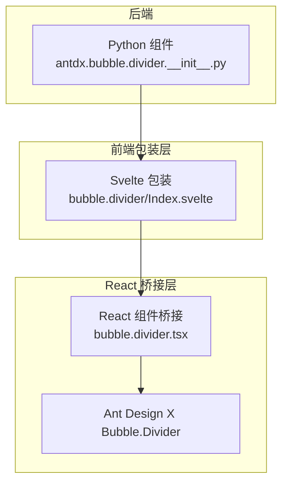
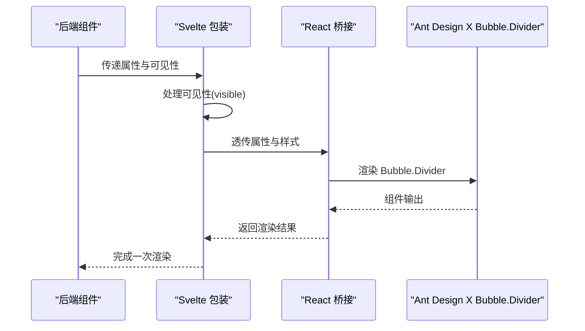
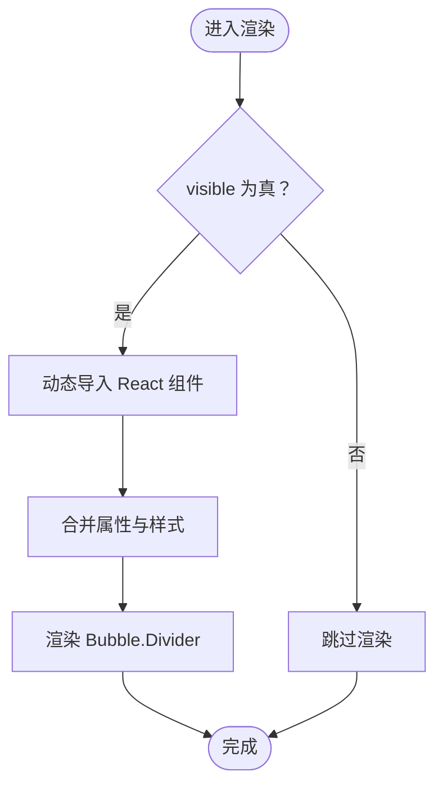
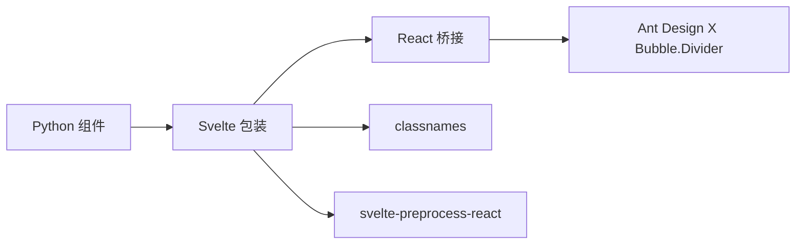

# Bubble.Divider 分割线组件

<cite>
**本文档引用的文件**
- [frontend/antdx/bubble/divider/Index.svelte](file://frontend/antdx/bubble/divider/Index.svelte)
- [frontend/antdx/bubble/divider/bubble.divider.tsx](file://frontend/antdx/bubble/divider/bubble.divider.tsx)
- [backend/modelscope_studio/components/antdx/bubble/divider/__init__.py](file://backend/modelscope_studio/components/antdx/bubble/divider/__init__.py)
- [frontend/antdx/bubble/bubble.tsx](file://frontend/antdx/bubble/bubble.tsx)
- [docs/components/antdx/bubble/README.md](file://docs/components/antdx/bubble/README.md)
</cite>

## 目录

1. [简介](#简介)
2. [项目结构](#项目结构)
3. [核心组件](#核心组件)
4. [架构总览](#架构总览)
5. [详细组件分析](#详细组件分析)
6. [依赖关系分析](#依赖关系分析)
7. [性能考虑](#性能考虑)
8. [故障排除指南](#故障排除指南)
9. [结论](#结论)
10. [附录](#附录)

## 简介

Bubble.Divider 是对话气泡中的时间分隔与内容分区组件，用于在长对话中清晰地划分不同时间段或逻辑区块，提升可读性与用户体验。它基于 Ant Design X 的 Bubble.Divider 能力，通过内容插槽支持自定义标题/标签，并具备可见性控制与样式透传能力。

## 项目结构

Bubble.Divider 位于 antdx 气泡体系下，采用“后端 Python 组件 + 前端 Svelte 包装 + React 组件桥接”的分层设计：

- 后端组件：负责属性定义、可见性与样式透传、生命周期钩子（如预处理/后处理）
- 前端包装：Svelte 组件负责按需加载、属性合并、类名与样式注入、插槽渲染
- React 组件桥接：将 Ant Design X 的 Bubble.Divider 能力以 Svelte 形式暴露

图表来源

- [frontend/antdx/bubble/divider/Index.svelte:1-66](file://frontend/antdx/bubble/divider/Index.svelte#L1-L66)
- [frontend/antdx/bubble/divider/bubble.divider.tsx:1-27](file://frontend/antdx/bubble/divider/bubble.divider.tsx#L1-L27)
- [backend/modelscope_studio/components/antdx/bubble/divider/**init**.py:1-95](file://backend/modelscope_studio/components/antdx/bubble/divider/__init__.py#L1-L95)

章节来源

- [frontend/antdx/bubble/divider/Index.svelte:1-66](file://frontend/antdx/bubble/divider/Index.svelte#L1-L66)
- [frontend/antdx/bubble/divider/bubble.divider.tsx:1-27](file://frontend/antdx/bubble/divider/bubble.divider.tsx#L1-L27)
- [backend/modelscope_studio/components/antdx/bubble/divider/**init**.py:1-95](file://backend/modelscope_studio/components/antdx/bubble/divider/__init__.py#L1-L95)

## 核心组件

- 后端 Python 组件：定义 Bubble.Divider 的属性集合（如可见性、元素 ID/类名/样式、额外属性等），并声明前端目录映射与渲染行为
- 前端 Svelte 包装：按需导入 React 桥接组件，合并属性、处理可见性、注入类名与样式、透传插槽
- React 桥接：将 Ant Design X 的 Bubble.Divider 能力以 Svelte 可用的形式封装，支持内容插槽

章节来源

- [backend/modelscope_studio/components/antdx/bubble/divider/**init**.py:1-95](file://backend/modelscope_studio/components/antdx/bubble/divider/__init__.py#L1-L95)
- [frontend/antdx/bubble/divider/Index.svelte:1-66](file://frontend/antdx/bubble/divider/Index.svelte#L1-L66)
- [frontend/antdx/bubble/divider/bubble.divider.tsx:1-27](file://frontend/antdx/bubble/divider/bubble.divider.tsx#L1-L27)

## 架构总览

Bubble.Divider 的调用链路如下：

- 后端组件接收属性并决定是否渲染
- 前端 Svelte 包装根据 visible 决定是否挂载
- React 桥接组件将 props 透传给 Ant Design X 的 Bubble.Divider
- 插槽系统支持 content 内容与 children 渲染

图表来源

- [frontend/antdx/bubble/divider/Index.svelte:49-65](file://frontend/antdx/bubble/divider/Index.svelte#L49-L65)
- [frontend/antdx/bubble/divider/bubble.divider.tsx:12-24](file://frontend/antdx/bubble/divider/bubble.divider.tsx#L12-L24)

## 详细组件分析

### 属性与配置

- 可见性控制：visible 控制组件是否渲染
- 元素标识：elem_id、elem_classes、elem_style 用于定位与样式定制
- 额外属性：additionalProps 透传给底层组件
- 内容插槽：content 插槽优先于 props.content
- 子节点：children 作为后备内容兜底

章节来源

- [frontend/antdx/bubble/divider/Index.svelte:14-44](file://frontend/antdx/bubble/divider/Index.svelte#L14-L44)
- [frontend/antdx/bubble/divider/bubble.divider.tsx:7-24](file://frontend/antdx/bubble/divider/bubble.divider.tsx#L7-L24)

### 渲染机制与显示条件

- 可见性判断：仅当 visible 为真时才渲染 React 组件
- 动态导入：使用 importComponent 实现按需加载，降低首屏负担
- 类名与样式：通过 cls 与内联样式注入，确保与主题一致
- 插槽渲染：优先使用 content 插槽，其次使用 props.content，最后为空字符串兜底

图表来源

- [frontend/antdx/bubble/divider/Index.svelte:49-65](file://frontend/antdx/bubble/divider/Index.svelte#L49-L65)

### 样式定制与布局影响

- 样式透传：elem_style 与 elem_classes 直接应用于根节点，便于覆盖默认主题
- 主题一致性：通过 Ant Design X 的主题系统保证视觉统一
- 布局影响：作为气泡列表中的分隔元素，建议保持紧凑间距与清晰的视觉层级，避免过度装饰

章节来源

- [frontend/antdx/bubble/divider/Index.svelte:52-53](file://frontend/antdx/bubble/divider/Index.svelte#L52-L53)

### 与消息时间戳的关系与最佳使用场景

- 时间分隔：适合在长时间对话中插入“今日”“昨天”等时间分组提示
- 内容分区：用于区分不同话题、角色切换或状态变更
- 最佳实践：
  - 避免过于频繁地插入分割线，以免打断阅读节奏
  - 将时间戳与分割线结合使用，增强可读性
  - 使用简洁明了的内容文本，避免冗长

章节来源

- [docs/components/antdx/bubble/README.md:1-13](file://docs/components/antdx/bubble/README.md#L1-L13)

### 使用示例（路径指引）

以下为常见使用场景的代码片段路径（请在对应文件中查看具体实现）：

- 在气泡列表中插入时间分隔：[frontend/antdx/bubble/list/bubble.list.tsx:1-48](file://frontend/antdx/bubble/list/bubble.list.tsx#L1-L48)
- 在聊天机器人中使用分割线：[docs/components/antdx/bubble/README.md:1-13](file://docs/components/antdx/bubble/README.md#L1-L13)

章节来源

- [frontend/antdx/bubble/list/bubble.list.tsx:1-48](file://frontend/antdx/bubble/list/bubble.list.tsx#L1-L48)
- [docs/components/antdx/bubble/README.md:1-13](file://docs/components/antdx/bubble/README.md#L1-L13)

## 依赖关系分析

- 后端依赖：ModelScopeLayoutComponent 提供通用布局与渲染能力
- 前端依赖：@svelte-preprocess-react 提供 Svelte 与 React 的桥接能力；classnames 用于类名拼接
- React 依赖：Ant Design X 的 Bubble.Divider 提供核心渲染能力

图表来源

- [frontend/antdx/bubble/divider/Index.svelte:1-8](file://frontend/antdx/bubble/divider/Index.svelte#L1-L8)
- [frontend/antdx/bubble/divider/bubble.divider.tsx:1-5](file://frontend/antdx/bubble/divider/bubble.divider.tsx#L1-L5)

章节来源

- [frontend/antdx/bubble/divider/Index.svelte:1-8](file://frontend/antdx/bubble/divider/Index.svelte#L1-L8)
- [frontend/antdx/bubble/divider/bubble.divider.tsx:1-5](file://frontend/antdx/bubble/divider/bubble.divider.tsx#L1-L5)

## 性能考虑

- 按需加载：通过动态导入减少初始包体体积
- 条件渲染：visible 为假时不渲染，避免无意义的 DOM 占用
- 属性最小化：仅透传必要属性，减少 React 层级开销
- 插槽优化：优先使用插槽而非大对象 props，降低重渲染概率

## 故障排除指南

- 组件不显示：检查 visible 是否为真；确认 additionalProps 未覆盖关键样式
- 样式异常：核对 elem_id/ elem_classes/ elem_style 是否正确传入；确认主题变量生效
- 内容不显示：确认 content 插槽或 props.content 是否设置；children 仅作为兜底
- 运行时错误：检查 Ant Design X 版本兼容性；确保 @svelte-preprocess-react 正常工作

章节来源

- [frontend/antdx/bubble/divider/Index.svelte:49-65](file://frontend/antdx/bubble/divider/Index.svelte#L49-L65)
- [frontend/antdx/bubble/divider/bubble.divider.tsx:12-24](file://frontend/antdx/bubble/divider/bubble.divider.tsx#L12-L24)

## 结论

Bubble.Divider 通过简洁的属性与强大的插槽系统，在对话气泡中提供了高效的时间分隔与内容分区能力。其按需加载与条件渲染策略兼顾了性能与可用性，适合在长对话场景中提升用户阅读体验。建议与时间戳配合使用，并遵循适度原则，避免过度分割。

## 附录

- 相关组件参考
  - 气泡容器：[frontend/antdx/bubble/bubble.tsx:1-119](file://frontend/antdx/bubble/bubble.tsx#L1-L119)
  - 文档示例入口：[docs/components/antdx/bubble/README.md:1-13](file://docs/components/antdx/bubble/README.md#L1-L13)
