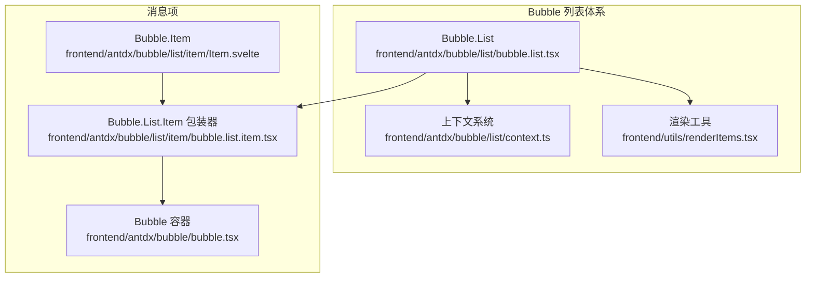
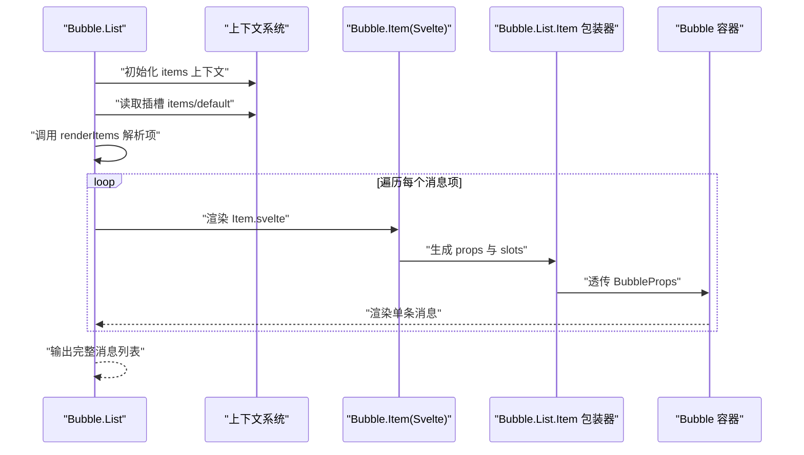
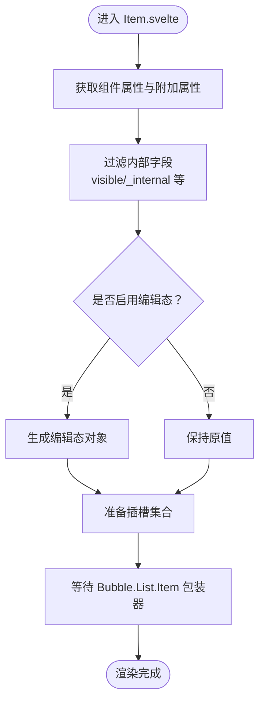
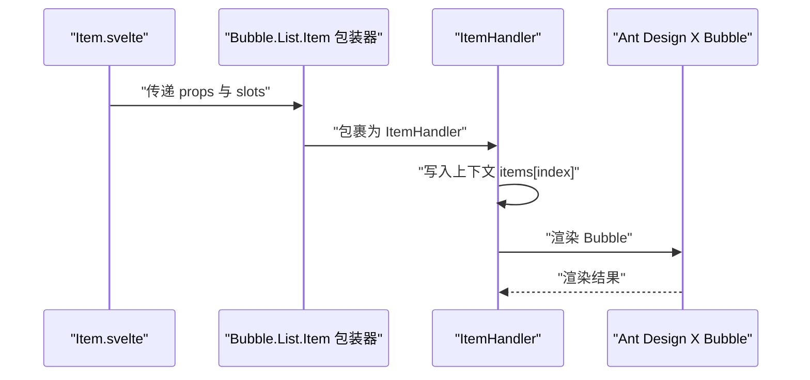
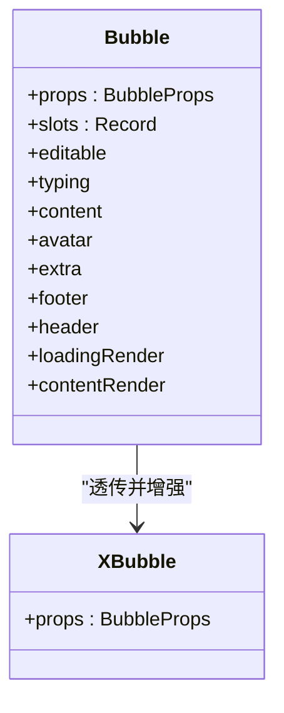
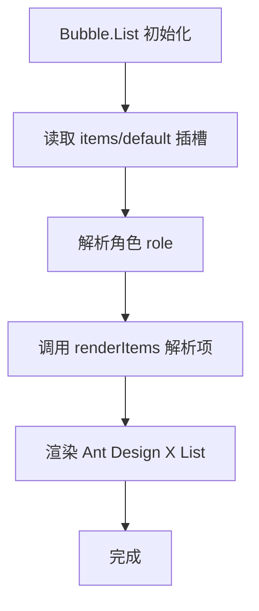
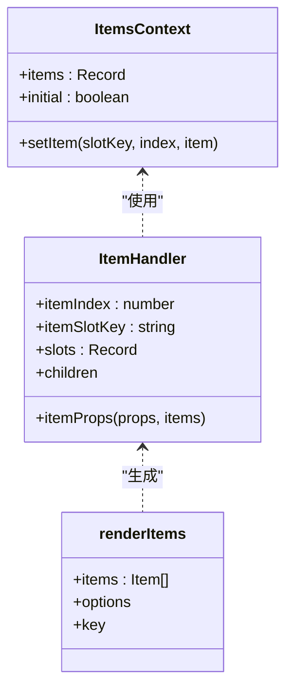
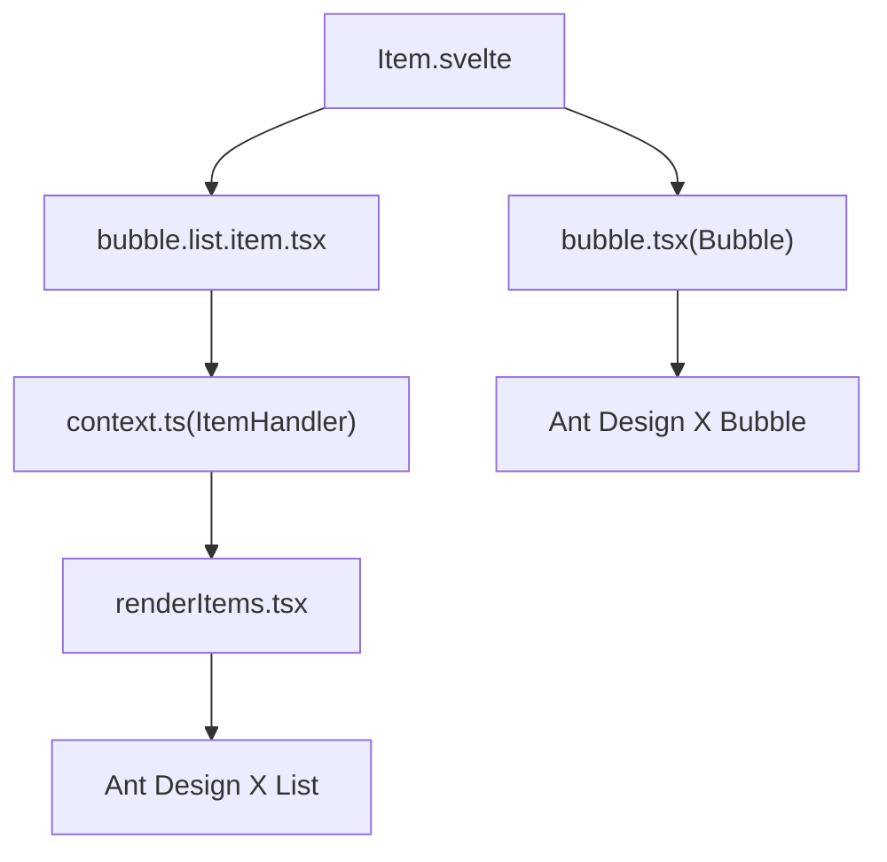

# Bubble.Item 消息项组件

<cite>
**本文档引用的文件**
- [frontend/antdx/bubble/list/item/Item.svelte](file://frontend/antdx/bubble/list/item/Item.svelte)
- [frontend/antdx/bubble/list/item/bubble.list.item.tsx](file://frontend/antdx/bubble/list/item/bubble.list.item.tsx)
- [frontend/antdx/bubble/bubble.tsx](file://frontend/antdx/bubble/bubble.tsx)
- [frontend/antdx/bubble/list/bubble.list.tsx](file://frontend/antdx/bubble/list/bubble.list.tsx)
- [frontend/antdx/bubble/list/context.ts](file://frontend/antdx/bubble/list/context.ts)
- [frontend/utils/createItemsContext.tsx](file://frontend/utils/createItemsContext.tsx)
- [frontend/utils/renderItems.tsx](file://frontend/utils/renderItems.tsx)
</cite>

## 目录

1. [简介](#简介)
2. [项目结构](#项目结构)
3. [核心组件](#核心组件)
4. [架构总览](#架构总览)
5. [详细组件分析](#详细组件分析)
6. [依赖关系分析](#依赖关系分析)
7. [性能考虑](#性能考虑)
8. [故障排查指南](#故障排查指南)
9. [结论](#结论)
10. [附录](#附录)

## 简介

Bubble.Item 是 Modelscope Studio 前端组件体系中用于表示“单条消息”的基础单元，通常配合 Bubble.List 使用以渲染消息列表。它封装了 Ant Design X 的 Bubble 组件能力，并通过统一的上下文系统将消息项的属性、插槽、事件回调等进行标准化处理，支持文本、图片、代码块等多种内容格式，以及可编辑、加载态、头部/尾部/额外区域等扩展能力。

本组件的关键特性包括：

- 作为消息项的最小渲染单元，负责将内容、头像、操作区等组合展示
- 支持多种内容格式：文本、富文本、图片、代码块等
- 提供消息状态：加载态、可编辑态、打字机态等
- 与 Bubble.List 协作，基于上下文系统完成数据绑定与渲染
- 支持插槽化扩展：avatar、header、footer、extra、content、contentRender、loadingRender 等

## 项目结构

Bubble.Item 所在的目录位于前端 antdx 组件库中，与 Bubble.List、上下文系统、渲染工具共同构成消息列表渲染链路。

**图表来源**

- [frontend/antdx/bubble/list/bubble.list.tsx:1-49](file://frontend/antdx/bubble/list/bubble.list.tsx#L1-L49)
- [frontend/antdx/bubble/list/context.ts:1-13](file://frontend/antdx/bubble/list/context.ts#L1-L13)
- [frontend/utils/renderItems.tsx:1-114](file://frontend/utils/renderItems.tsx#L1-L114)
- [frontend/antdx/bubble/list/item/Item.svelte:1-150](file://frontend/antdx/bubble/list/item/Item.svelte#L1-L150)
- [frontend/antdx/bubble/list/item/bubble.list.item.tsx:1-14](file://frontend/antdx/bubble/list/item/bubble.list.item.tsx#L1-L14)
- [frontend/antdx/bubble/bubble.tsx:1-119](file://frontend/antdx/bubble/bubble.tsx#L1-L119)

**章节来源**

- [frontend/antdx/bubble/list/bubble.list.tsx:1-49](file://frontend/antdx/bubble/list/bubble.list.tsx#L1-L49)
- [frontend/antdx/bubble/list/context.ts:1-13](file://frontend/antdx/bubble/list/context.ts#L1-L13)
- [frontend/utils/renderItems.tsx:1-114](file://frontend/utils/renderItems.tsx#L1-L114)
- [frontend/antdx/bubble/list/item/Item.svelte:1-150](file://frontend/antdx/bubble/list/item/Item.svelte#L1-L150)
- [frontend/antdx/bubble/list/item/bubble.list.item.tsx:1-14](file://frontend/antdx/bubble/list/item/bubble.list.item.tsx#L1-L14)
- [frontend/antdx/bubble/bubble.tsx:1-119](file://frontend/antdx/bubble/bubble.tsx#L1-L119)

## 核心组件

- Bubble.Item（Svelte）：消息项的入口组件，负责收集属性、插槽与事件，转换为 Bubble.List.Item 可消费的结构，并注入上下文索引与插槽键值。
- Bubble.List.Item（React 包装器）：将 Svelte 的消息项 props 与 slots 转换为 Ant Design X 的 Bubble.List.Item 所需的结构，并通过 ItemHandler 注入到上下文系统。
- Bubble（React 容器）：对 Ant Design X 的 Bubble 进行二次封装，支持 slots 与函数型渲染器，统一 editable、typing、contentRender、loadingRender 等能力。
- Bubble.List（React 容器）：对 Ant Design X 的 Bubble.List 进行二次封装，提供 items 与 roles 的上下文，负责将插槽中的消息项解析为最终渲染数据。
- 上下文系统（createItemsContext）：提供 items 上下文、ItemHandler 与 withItemsContextProvider，支撑 Bubble.List 与 Bubble.Item 的数据绑定与子项递归构建。
- 渲染工具（renderItems）：将 Item 结构数组渲染为 React 对象树，支持插槽克隆、参数传递、子项递归等。

**章节来源**

- [frontend/antdx/bubble/list/item/Item.svelte:1-150](file://frontend/antdx/bubble/list/item/Item.svelte#L1-L150)
- [frontend/antdx/bubble/list/item/bubble.list.item.tsx:1-14](file://frontend/antdx/bubble/list/item/bubble.list.item.tsx#L1-L14)
- [frontend/antdx/bubble/bubble.tsx:1-119](file://frontend/antdx/bubble/bubble.tsx#L1-L119)
- [frontend/antdx/bubble/list/bubble.list.tsx:1-49](file://frontend/antdx/bubble/list/bubble.list.tsx#L1-L49)
- [frontend/antdx/bubble/list/context.ts:1-13](file://frontend/antdx/bubble/list/context.ts#L1-L13)
- [frontend/utils/createItemsContext.tsx:1-274](file://frontend/utils/createItemsContext.tsx#L1-L274)
- [frontend/utils/renderItems.tsx:1-114](file://frontend/utils/renderItems.tsx#L1-L114)

## 架构总览

Bubble.Item 的工作流从 Bubble.List 开始，通过上下文系统收集各消息项，再由 Bubble.Item 将属性与插槽转换为 React 可渲染对象，最终由 Ant Design X 的 Bubble 渲染。

**图表来源**

- [frontend/antdx/bubble/list/bubble.list.tsx:13-46](file://frontend/antdx/bubble/list/bubble.list.tsx#L13-L46)
- [frontend/utils/renderItems.tsx:8-113](file://frontend/utils/renderItems.tsx#L8-L113)
- [frontend/antdx/bubble/list/item/Item.svelte:69-135](file://frontend/antdx/bubble/list/item/Item.svelte#L69-L135)
- [frontend/antdx/bubble/list/item/bubble.list.item.tsx:7-11](file://frontend/antdx/bubble/list/item/bubble.list.item.tsx#L7-L11)
- [frontend/antdx/bubble/bubble.tsx:14-116](file://frontend/antdx/bubble/bubble.tsx#L14-L116)

## 详细组件分析

### Bubble.Item（消息项入口）

职责与实现要点：

- 属性与事件映射：将 gradio 传入的属性与额外属性合并，过滤掉内部可见性控制字段，保留样式、类名、id 等。
- 插槽处理：支持 avatar、header、footer、extra、content、contentRender、loadingRender 等插槽；对带参数的插槽进行克隆与参数注入。
- 编辑态支持：根据 editable 的布尔或对象形式，生成编辑态配置并传递给底层组件。
- 子项递归：通过 ItemHandler 将当前项及其子项写入上下文，支持嵌套消息结构。

**图表来源**

- [frontend/antdx/bubble/list/item/Item.svelte:36-135](file://frontend/antdx/bubble/list/item/Item.svelte#L36-L135)

**章节来源**

- [frontend/antdx/bubble/list/item/Item.svelte:1-150](file://frontend/antdx/bubble/list/item/Item.svelte#L1-L150)

### Bubble.List.Item 包装器

职责与实现要点：

- 将 Svelte 的 props 与 slots 转换为 Ant Design X 的 BubbleProps。
- 通过 ItemHandler 将消息项注册到上下文中，携带索引与插槽键值，便于 Bubble.List 统一消费。

**图表来源**

- [frontend/antdx/bubble/list/item/bubble.list.item.tsx:7-11](file://frontend/antdx/bubble/list/item/bubble.list.item.tsx#L7-L11)
- [frontend/antdx/bubble/list/context.ts:3-4](file://frontend/antdx/bubble/list/context.ts#L3-L4)

**章节来源**

- [frontend/antdx/bubble/list/item/bubble.list.item.tsx:1-14](file://frontend/antdx/bubble/list/item/bubble.list.item.tsx#L1-L14)
- [frontend/antdx/bubble/list/context.ts:1-13](file://frontend/antdx/bubble/list/context.ts#L1-L13)

### Bubble（容器与插槽桥接）

职责与实现要点：

- 将 editable、typing、content、avatar、extra、footer、header、loadingRender、contentRender 等属性与插槽统一为 Ant Design X 的 BubbleProps。
- 支持函数型渲染器与 ReactSlot 插槽，确保插槽可带参数、可克隆。

**图表来源**

- [frontend/antdx/bubble/bubble.tsx:14-116](file://frontend/antdx/bubble/bubble.tsx#L14-L116)

**章节来源**

- [frontend/antdx/bubble/bubble.tsx:1-119](file://frontend/antdx/bubble/bubble.tsx#L1-L119)

### Bubble.List（列表容器与上下文）

职责与实现要点：

- 提供 items 与 roles 的上下文，支持多插槽 items/default。
- 通过 renderItems 将插槽中的消息项解析为最终渲染数据，交由 Ant Design X 的 Bubble.List 渲染。

**图表来源**

- [frontend/antdx/bubble/list/bubble.list.tsx:18-42](file://frontend/antdx/bubble/list/bubble.list.tsx#L18-L42)

**章节来源**

- [frontend/antdx/bubble/list/bubble.list.tsx:1-49](file://frontend/antdx/bubble/list/bubble.list.tsx#L1-L49)

### 上下文系统与渲染工具

职责与实现要点：

- createItemsContext：提供 useItems、withItemsContextProvider、ItemHandler，支持多插槽 items 管理与子项递归构建。
- renderItems：将 Item 结构数组渲染为 React 对象树，支持插槽克隆、参数传递、子项递归。

**图表来源**

- [frontend/utils/createItemsContext.tsx:102-261](file://frontend/utils/createItemsContext.tsx#L102-L261)
- [frontend/utils/renderItems.tsx:8-113](file://frontend/utils/renderItems.tsx#L8-L113)

**章节来源**

- [frontend/utils/createItemsContext.tsx:1-274](file://frontend/utils/createItemsContext.tsx#L1-L274)
- [frontend/utils/renderItems.tsx:1-114](file://frontend/utils/renderItems.tsx#L1-L114)

## 依赖关系分析

Bubble.Item 的依赖关系围绕“属性/插槽 -> 上下文 -> 渲染”展开，关键耦合点如下：

**图表来源**

- [frontend/antdx/bubble/list/item/Item.svelte:14-16](file://frontend/antdx/bubble/list/item/Item.svelte#L14-L16)
- [frontend/antdx/bubble/list/item/bubble.list.item.tsx:5-9](file://frontend/antdx/bubble/list/item/bubble.list.item.tsx#L5-L9)
- [frontend/antdx/bubble/list/context.ts:3-4](file://frontend/antdx/bubble/list/context.ts#L3-L4)
- [frontend/utils/renderItems.tsx:8-113](file://frontend/utils/renderItems.tsx#L8-L113)
- [frontend/antdx/bubble/bubble.tsx:41-113](file://frontend/antdx/bubble/bubble.tsx#L41-L113)

**章节来源**

- [frontend/antdx/bubble/list/item/Item.svelte:1-150](file://frontend/antdx/bubble/list/item/Item.svelte#L1-L150)
- [frontend/antdx/bubble/list/item/bubble.list.item.tsx:1-14](file://frontend/antdx/bubble/list/item/bubble.list.item.tsx#L1-L14)
- [frontend/antdx/bubble/list/context.ts:1-13](file://frontend/antdx/bubble/list/context.ts#L1-L13)
- [frontend/utils/renderItems.tsx:1-114](file://frontend/utils/renderItems.tsx#L1-L114)
- [frontend/antdx/bubble/bubble.tsx:1-119](file://frontend/antdx/bubble/bubble.tsx#L1-L119)

## 性能考虑

- 插槽克隆与参数传递：当插槽带有参数时，renderItems 会以函数形式注入参数，避免不必要的重复渲染。建议仅在必要时开启 withParams 与 clone，减少 DOM 克隆成本。
- 上下文更新去重：createItemsContext 使用浅比较与记忆化函数，避免重复 setItem 导致的无意义重渲染。
- 列表渲染优化：Bubble.List 在 items 变更时才重新计算渲染结果，尽量复用已渲染节点。
- 编辑态与加载态：合理使用 editable 与 loadingRender，避免频繁切换导致的重排。

[本节为通用性能建议，不直接分析具体文件]

## 故障排查指南

- 插槽未生效
  - 检查插槽键名是否正确（如 avatar、header、footer、extra、content、contentRender、loadingRender），并确认是否启用 withParams 与 clone。
  - 参考路径：[frontend/antdx/bubble/list/item/Item.svelte:101-133](file://frontend/antdx/bubble/list/item/Item.svelte#L101-L133)
- 编辑态不显示
  - 确认 editable 传入的是布尔值或包含 editing 字段的对象；若使用插槽，确保插槽键名正确。
  - 参考路径：[frontend/antdx/bubble/bubble.tsx:43-64](file://frontend/antdx/bubble/bubble.tsx#L43-L64)
- 内容为空或渲染异常
  - 检查 content、contentRender 是否正确传入；若使用插槽，确认插槽元素存在且可克隆。
  - 参考路径：[frontend/antdx/bubble/list/item/Item.svelte:88-99](file://frontend/antdx/bubble/list/item/Item.svelte#L88-L99)
- 列表不更新
  - 确认 Bubble.List 的 items/default 插槽是否正确填充；检查上下文 setItem 是否被调用。
  - 参考路径：[frontend/antdx/bubble/list/bubble.list.tsx:19-42](file://frontend/antdx/bubble/list/bubble.list.tsx#L19-L42)，[frontend/utils/createItemsContext.tsx:124-153](file://frontend/utils/createItemsContext.tsx#L124-L153)

**章节来源**

- [frontend/antdx/bubble/list/item/Item.svelte:88-133](file://frontend/antdx/bubble/list/item/Item.svelte#L88-L133)
- [frontend/antdx/bubble/bubble.tsx:43-64](file://frontend/antdx/bubble/bubble.tsx#L43-L64)
- [frontend/antdx/bubble/list/bubble.list.tsx:19-42](file://frontend/antdx/bubble/list/bubble.list.tsx#L19-L42)
- [frontend/utils/createItemsContext.tsx:124-153](file://frontend/utils/createItemsContext.tsx#L124-L153)

## 结论

Bubble.Item 通过清晰的属性/插槽桥接、上下文驱动的数据绑定与 Ant Design X 的渲染能力，实现了灵活、可扩展的消息项渲染。其设计遵循“Svelte 入口 + React 包装 + 上下文系统”的模式，既保证了易用性，又兼顾了性能与可维护性。结合 Bubble.List 的上下文与渲染工具，开发者可以快速构建复杂的消息列表场景。

[本节为总结性内容，不直接分析具体文件]

## 附录

### 使用示例（路径指引）

- 文本消息
  - 在 Bubble.Item 中设置 content 或使用 content 插槽
  - 参考路径：[frontend/antdx/bubble/list/item/Item.svelte:88-99](file://frontend/antdx/bubble/list/item/Item.svelte#L88-L99)
- 图片消息
  - 使用 avatar 插槽或 avatar 属性传入头像
  - 参考路径：[frontend/antdx/bubble/bubble.tsx:69-75](file://frontend/antdx/bubble/bubble.tsx#L69-L75)
- 代码块消息
  - 使用 contentRender 插槽或属性，返回代码高亮组件
  - 参考路径：[frontend/antdx/bubble/bubble.tsx:105-112](file://frontend/antdx/bubble/bubble.tsx#L105-L112)
- 可编辑消息
  - 设置 editable 为布尔值或对象，支持编辑确认/取消回调
  - 参考路径：[frontend/antdx/bubble/bubble.tsx:43-64](file://frontend/antdx/bubble/bubble.tsx#L43-L64)，[frontend/antdx/bubble/list/item/Item.svelte:72-87](file://frontend/antdx/bubble/list/item/Item.svelte#L72-L87)
- 加载态消息
  - 使用 loadingRender 插槽或属性，返回加载组件
  - 参考路径：[frontend/antdx/bubble/bubble.tsx:97-104](file://frontend/antdx/bubble/bubble.tsx#L97-L104)
- 自定义头部/尾部/额外区域
  - 使用 header/footer/extra 插槽或属性
  - 参考路径：[frontend/antdx/bubble/bubble.tsx:83-96](file://frontend/antdx/bubble/bubble.tsx#L83-L96)

### 与 Bubble.List 的上下文关系

- Bubble.List 通过 withItemsContextProvider 与 withRoleItemsContextProvider 提供上下文
- renderItems 将插槽中的消息项解析为 React 对象树
- ItemHandler 将每条消息项写入上下文，携带索引与插槽键值
- 参考路径：
  - [frontend/antdx/bubble/list/bubble.list.tsx:13-46](file://frontend/antdx/bubble/list/bubble.list.tsx#L13-L46)
  - [frontend/utils/renderItems.tsx:8-113](file://frontend/utils/renderItems.tsx#L8-L113)
  - [frontend/antdx/bubble/list/context.ts:3-10](file://frontend/antdx/bubble/list/context.ts#L3-L10)
