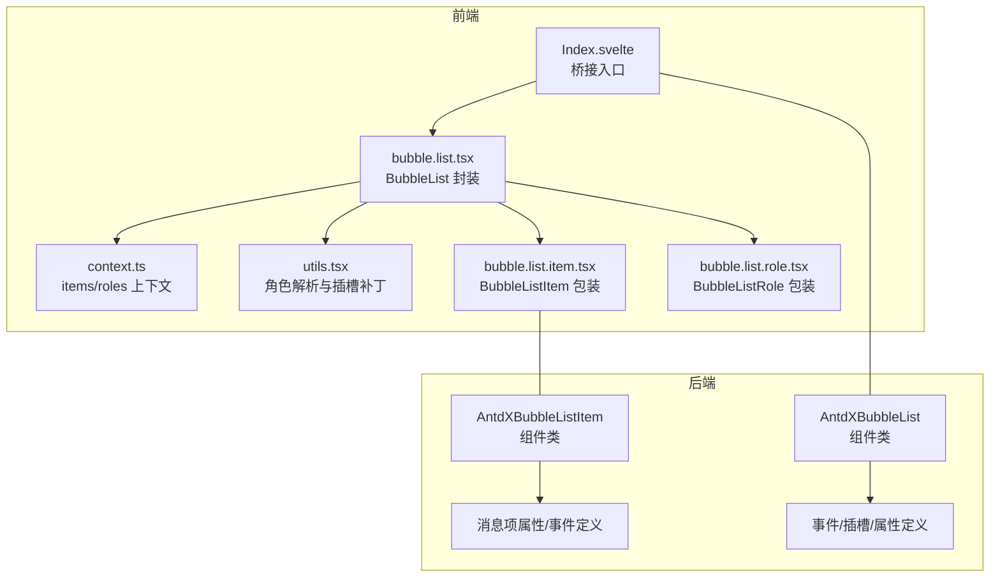
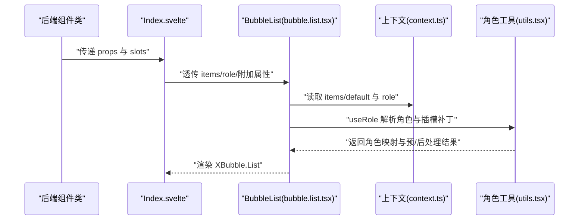
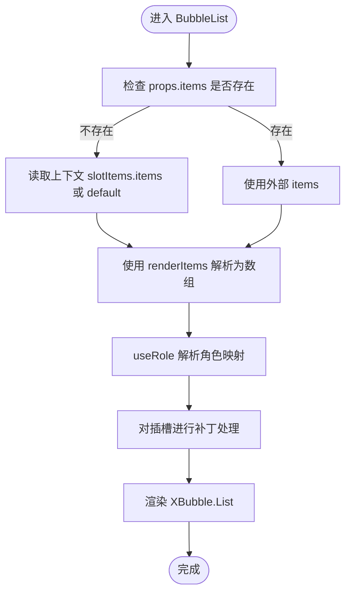
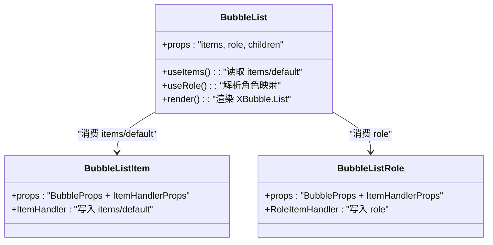
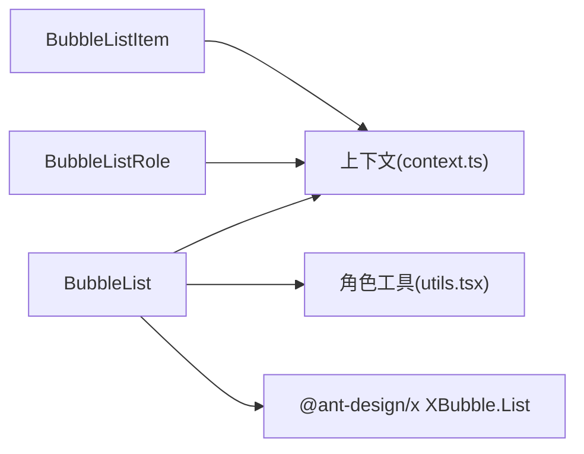

# Bubble.List 列表组件

<cite>
**本文引用的文件**
- [frontend/antdx/bubble/list/bubble.list.tsx](file://frontend/antdx/bubble/list/bubble.list.tsx)
- [frontend/antdx/bubble/list/Index.svelte](file://frontend/antdx/bubble/list/Index.svelte)
- [frontend/antdx/bubble/list/context.ts](file://frontend/antdx/bubble/list/context.ts)
- [frontend/antdx/bubble/list/utils.tsx](file://frontend/antdx/bubble/list/utils.tsx)
- [frontend/antdx/bubble/list/item/bubble.list.item.tsx](file://frontend/antdx/bubble/list/item/bubble.list.item.tsx)
- [frontend/antdx/bubble/list/role/bubble.list.role.tsx](file://frontend/antdx/bubble/list/role/bubble.list.role.tsx)
- [backend/modelscope_studio/components/antdx/bubble/list/__init__.py](file://backend/modelscope_studio/components/antdx/bubble/list/__init__.py)
- [backend/modelscope_studio/components/antdx/bubble/list/item/__init__.py](file://backend/modelscope_studio/components/antdx/bubble/list/item/__init__.py)
- [docs/components/antdx/bubble/README.md](file://docs/components/antdx/bubble/README.md)
- [docs/components/antdx/bubble/demos/bubble_list.py](file://docs/components/antdx/bubble/demos/bubble_list.py)
- [docs/components/antdx/bubble/demos/custom_list_content.py](file://docs/components/antdx/bubble/demos/custom_list_content.py)
</cite>

## 目录

1. [简介](#简介)
2. [项目结构](#项目结构)
3. [核心组件](#核心组件)
4. [架构总览](#架构总览)
5. [详细组件分析](#详细组件分析)
6. [依赖分析](#依赖分析)
7. [性能考虑](#性能考虑)
8. [故障排查指南](#故障排查指南)
9. [结论](#结论)
10. [附录](#附录)

## 简介

Bubble.List 是一个基于 Ant Design X 的消息容器组件，用于在聊天或对话场景中展示一组 Bubble（气泡）消息。它通过统一的数据结构与渲染机制，支持消息项的排列、滚动行为控制、角色化样式与内容定制，并与 Bubble.Item 与 Bubble.Role 协作完成数据与样式的分发。

本组件面向前端 Svelte 与后端 Gradio 双端：前端负责渲染与交互，后端提供 Python API 以声明式地组织消息数据、角色与插槽。

## 项目结构

Bubble.List 所在的目录位于前端 antdx/bubble/list，包含以下关键文件：

- bubble.list.tsx：Bubble.List 的 Svelte 化封装，对接 @ant-design/x 的 XBubble.List
- Index.svelte：Gradio 前端桥接入口，负责属性透传与插槽注入
- context.ts：定义 items 与 roles 的上下文，供子组件读取
- utils.tsx：角色解析与插槽补丁工具，支持函数式角色与默认回退
- item/bubble.list.item.tsx：Bubble.Item 的桥接包装
- role/bubble.list.role.tsx：Bubble.Role 的桥接包装

后端侧：

- backend/modelscope_studio/components/antdx/bubble/list/**init**.py：AntdXBubbleList 组件类，声明事件、插槽与属性
- backend/modelscope_studio/components/antdx/bubble/list/item/**init**.py：AntdXBubbleListItem 组件类，声明消息项的属性与事件

图表来源

- [frontend/antdx/bubble/list/Index.svelte:1-66](file://frontend/antdx/bubble/list/Index.svelte#L1-L66)
- [frontend/antdx/bubble/list/bubble.list.tsx:1-49](file://frontend/antdx/bubble/list/bubble.list.tsx#L1-L49)
- [frontend/antdx/bubble/list/context.ts:1-13](file://frontend/antdx/bubble/list/context.ts#L1-L13)
- [frontend/antdx/bubble/list/utils.tsx:1-152](file://frontend/antdx/bubble/list/utils.tsx#L1-L152)
- [frontend/antdx/bubble/list/item/bubble.list.item.tsx:1-14](file://frontend/antdx/bubble/list/item/bubble.list.item.tsx#L1-L14)
- [frontend/antdx/bubble/list/role/bubble.list.role.tsx:1-14](file://frontend/antdx/bubble/list/role/bubble.list.role.tsx#L1-L14)
- [backend/modelscope_studio/components/antdx/bubble/list/**init**.py:1-84](file://backend/modelscope_studio/components/antdx/bubble/list/__init__.py#L1-L84)
- [backend/modelscope_studio/components/antdx/bubble/list/item/**init**.py:1-129](file://backend/modelscope_studio/components/antdx/bubble/list/item/__init__.py#L1-L129)

章节来源

- [frontend/antdx/bubble/list/Index.svelte:1-66](file://frontend/antdx/bubble/list/Index.svelte#L1-L66)
- [frontend/antdx/bubble/list/bubble.list.tsx:1-49](file://frontend/antdx/bubble/list/bubble.list.tsx#L1-L49)
- [frontend/antdx/bubble/list/context.ts:1-13](file://frontend/antdx/bubble/list/context.ts#L1-L13)
- [frontend/antdx/bubble/list/utils.tsx:1-152](file://frontend/antdx/bubble/list/utils.tsx#L1-L152)
- [frontend/antdx/bubble/list/item/bubble.list.item.tsx:1-14](file://frontend/antdx/bubble/list/item/bubble.list.item.tsx#L1-L14)
- [frontend/antdx/bubble/list/role/bubble.list.role.tsx:1-14](file://frontend/antdx/bubble/list/role/bubble.list.role.tsx#L1-L14)
- [backend/modelscope_studio/components/antdx/bubble/list/**init**.py:1-84](file://backend/modelscope_studio/components/antdx/bubble/list/__init__.py#L1-L84)
- [backend/modelscope_studio/components/antdx/bubble/list/item/**init**.py:1-129](file://backend/modelscope_studio/components/antdx/bubble/list/item/__init__.py#L1-L129)

## 核心组件

- Bubble.List（前端）：负责接收 items 与 roles，解析并渲染消息列表；支持自动滚动绑定与滚动事件回调。
- Bubble.Item（前端）：单条消息项的包装器，承载头像、内容、额外区域、加载态等插槽。
- Bubble.Role（前端）：角色定义器，为不同角色（如 ai、user）提供默认样式与渲染策略。
- 后端 AntdXBubbleList/AntdXBubbleListItem：Python 层组件类，声明属性、事件与插槽，驱动前端渲染。

章节来源

- [frontend/antdx/bubble/list/bubble.list.tsx:13-46](file://frontend/antdx/bubble/list/bubble.list.tsx#L13-L46)
- [frontend/antdx/bubble/list/item/bubble.list.item.tsx:7-11](file://frontend/antdx/bubble/list/item/bubble.list.item.tsx#L7-L11)
- [frontend/antdx/bubble/list/role/bubble.list.role.tsx:7-11](file://frontend/antdx/bubble/list/role/bubble.list.role.tsx#L7-L11)
- [backend/modelscope_studio/components/antdx/bubble/list/**init**.py:12-31](file://backend/modelscope_studio/components/antdx/bubble/list/__init__.py#L12-L31)
- [backend/modelscope_studio/components/antdx/bubble/list/item/**init**.py:10-47](file://backend/modelscope_studio/components/antdx/bubble/list/item/__init__.py#L10-L47)

## 架构总览

Bubble.List 的运行时流程如下：

- 前端 Index.svelte 接收来自后端的 props 与 slots，将 items 与 role 注入到 BubbleList。
- BubbleList 从上下文中读取 items/default 与 role，解析为最终的 items 数组与角色映射。
- 使用 utils.useRole 计算角色函数或对象，必要时对插槽进行补丁处理，确保角色优先级覆盖。
- 最终调用 @ant-design/x 的 XBubble.List 渲染消息列表。

图表来源

- [frontend/antdx/bubble/list/Index.svelte:49-65](file://frontend/antdx/bubble/list/Index.svelte#L49-L65)
- [frontend/antdx/bubble/list/bubble.list.tsx:18-42](file://frontend/antdx/bubble/list/bubble.list.tsx#L18-L42)
- [frontend/antdx/bubble/list/context.ts:3-10](file://frontend/antdx/bubble/list/context.ts#L3-L10)
- [frontend/antdx/bubble/list/utils.tsx:51-151](file://frontend/antdx/bubble/list/utils.tsx#L51-L151)

## 详细组件分析

### Bubble.List 实现机制

- 数据源解析
  - 优先使用外部传入的 items；若未提供，则从上下文读取 slotItems 中的 items 或 default。
  - 使用 renderItems 将插槽内容转换为可渲染的数组。
- 角色解析
  - useRole 支持 role 为字符串函数或对象，支持 preProcess 与 defaultRolePostProcess 钩子。
  - 对插槽进行补丁处理，使角色的 avatar/header/footer/extra/loadingRender/contentRender 能前置覆盖。
- 渲染与滚动
  - 通过 @ant-design/x 的 XBubble.List 渲染，支持自动滚动绑定与滚动事件回调。

图表来源

- [frontend/antdx/bubble/list/bubble.list.tsx:18-42](file://frontend/antdx/bubble/list/bubble.list.tsx#L18-L42)
- [frontend/antdx/bubble/list/utils.tsx:51-151](file://frontend/antdx/bubble/list/utils.tsx#L51-L151)

章节来源

- [frontend/antdx/bubble/list/bubble.list.tsx:13-46](file://frontend/antdx/bubble/list/bubble.list.tsx#L13-L46)
- [frontend/antdx/bubble/list/context.ts:3-10](file://frontend/antdx/bubble/list/context.ts#L3-L10)
- [frontend/antdx/bubble/list/utils.tsx:44-151](file://frontend/antdx/bubble/list/utils.tsx#L44-L151)

### Bubble.Item 与 Bubble.Role 的协作

- Bubble.Item
  - 作为 ItemHandler 的包装，将消息项的属性与插槽注入到上下文中，供 Bubble.List 在渲染时读取。
- Bubble.Role
  - 作为 RoleItemHandler 的包装，将角色定义注入到角色上下文中，供 useRole 解析。
- 数据流转
  - Bubble.List 在渲染前从上下文读取 items/default 与 role，结合 useRole 的预/后处理钩子，生成最终的渲染配置。

图表来源

- [frontend/antdx/bubble/list/bubble.list.tsx:18-42](file://frontend/antdx/bubble/list/bubble.list.tsx#L18-L42)
- [frontend/antdx/bubble/list/item/bubble.list.item.tsx:7-11](file://frontend/antdx/bubble/list/item/bubble.list.item.tsx#L7-L11)
- [frontend/antdx/bubble/list/role/bubble.list.role.tsx:7-11](file://frontend/antdx/bubble/list/role/bubble.list.role.tsx#L7-L11)

章节来源

- [frontend/antdx/bubble/list/item/bubble.list.item.tsx:7-11](file://frontend/antdx/bubble/list/item/bubble.list.item.tsx#L7-L11)
- [frontend/antdx/bubble/list/role/bubble.list.role.tsx:7-11](file://frontend/antdx/bubble/list/role/bubble.list.role.tsx#L7-L11)

### 消息渲染逻辑与排列方式

- 渲染回调
  - 通过 useFunction 与 renderParamsSlot 将插槽转换为可执行的渲染函数，支持带参渲染。
- 排列方式
  - 由 @ant-design/x 的 XBubble.List 决定消息的排列与布局，Bubble.List 仅负责数据与角色的准备。
- 插槽优先级
  - 角色插槽会前置覆盖消息项插槽，保证角色级别的统一风格。

章节来源

- [frontend/antdx/bubble/list/bubble.list.tsx:18-42](file://frontend/antdx/bubble/list/bubble.list.tsx#L18-L42)
- [frontend/antdx/bubble/list/utils.tsx:18-42](file://frontend/antdx/bubble/list/utils.tsx#L18-L42)

### 滚动行为控制与性能优化策略

- 滚动控制
  - 后端事件定义包含滚动事件回调，前端可通过绑定实现滚动行为控制（例如自动滚动至底部）。
- 性能优化
  - 使用 useMemo 缓存解析后的 items 与角色映射，避免重复计算。
  - 使用 useMemoizedFn 与 useMemoizedEqualValue 降低函数与值变更带来的重渲染。
  - 通过上下文按需注入 items/default 与 role，减少不必要的 props 传递。

章节来源

- [backend/modelscope_studio/components/antdx/bubble/list/**init**.py:19-24](file://backend/modelscope_studio/components/antdx/bubble/list/__init__.py#L19-L24)
- [frontend/antdx/bubble/list/bubble.list.tsx:31-39](file://frontend/antdx/bubble/list/bubble.list.tsx#L31-L39)
- [frontend/antdx/bubble/list/utils.tsx:60-62](file://frontend/antdx/bubble/list/utils.tsx#L60-L62)

### 属性配置与使用示例

- 基本消息列表
  - 使用 items 参数传入消息数组，配合 role 定义默认样式与行为。
- 动态消息添加
  - 通过更新 items 或重新渲染 Bubble.List 触发增量渲染。
- 消息过滤与排序
  - 在传入 items 前进行过滤与排序，再交由 Bubble.List 渲染。
- 自定义内容渲染
  - 通过 role 的 contentRender 插槽自定义消息内容展示。

参考示例路径

- [docs/components/antdx/bubble/demos/bubble_list.py:28-52](file://docs/components/antdx/bubble/demos/bubble_list.py#L28-L52)
- [docs/components/antdx/bubble/demos/custom_list_content.py:65-89](file://docs/components/antdx/bubble/demos/custom_list_content.py#L65-L89)

章节来源

- [backend/modelscope_studio/components/antdx/bubble/list/**init**.py:32-64](file://backend/modelscope_studio/components/antdx/bubble/list/__init__.py#L32-L64)
- [backend/modelscope_studio/components/antdx/bubble/list/item/**init**.py:49-108](file://backend/modelscope_studio/components/antdx/bubble/list/item/__init__.py#L49-L108)
- [docs/components/antdx/bubble/demos/bubble_list.py:28-52](file://docs/components/antdx/bubble/demos/bubble_list.py#L28-L52)
- [docs/components/antdx/bubble/demos/custom_list_content.py:65-89](file://docs/components/antdx/bubble/demos/custom_list_content.py#L65-L89)

## 依赖分析

- 组件耦合
  - BubbleList 依赖上下文读取 items/default 与 role，依赖 utils.useRole 进行角色解析。
  - BubbleListItem/BubbleListRole 通过 ItemHandler/RoleItemHandler 将自身注入上下文。
- 外部依赖
  - @ant-design/x 的 XBubble.List 提供核心渲染能力。
  - @svelte-preprocess-react 工具链负责 Svelte 到 React 的桥接与插槽渲染。

图表来源

- [frontend/antdx/bubble/list/bubble.list.tsx:18-42](file://frontend/antdx/bubble/list/bubble.list.tsx#L18-L42)
- [frontend/antdx/bubble/list/context.ts:3-10](file://frontend/antdx/bubble/list/context.ts#L3-L10)
- [frontend/antdx/bubble/list/utils.tsx:51-151](file://frontend/antdx/bubble/list/utils.tsx#L51-L151)

章节来源

- [frontend/antdx/bubble/list/bubble.list.tsx:1-49](file://frontend/antdx/bubble/list/bubble.list.tsx#L1-L49)
- [frontend/antdx/bubble/list/context.ts:1-13](file://frontend/antdx/bubble/list/context.ts#L1-L13)
- [frontend/antdx/bubble/list/utils.tsx:1-152](file://frontend/antdx/bubble/list/utils.tsx#L1-L152)

## 性能考虑

- 依赖缓存
  - 对 items 与角色映射使用 useMemo 缓存，避免每次渲染都重新计算。
- 函数稳定化
  - 使用 useMemoizedFn 与 useMemoizedEqualValue 保持函数与默认值稳定，减少副作用。
- 渲染粒度
  - 通过上下文按需注入数据，避免将大量无关 props 传递给子树。

[本节为通用性能建议，不直接分析具体文件]

## 故障排查指南

- 滚动事件无效
  - 检查后端是否正确绑定滚动事件，前端是否启用滚动回调。
- 消息内容未按预期渲染
  - 确认 role 的插槽是否被正确设置，以及插槽优先级是否覆盖了消息项插槽。
- 角色函数未生效
  - 检查 role 的字符串函数是否可被正确解析，或对象形式的角色配置是否完整。

章节来源

- [backend/modelscope_studio/components/antdx/bubble/list/**init**.py:19-24](file://backend/modelscope_studio/components/antdx/bubble/list/__init__.py#L19-L24)
- [frontend/antdx/bubble/list/utils.tsx:101-133](file://frontend/antdx/bubble/list/utils.tsx#L101-L133)

## 结论

Bubble.List 通过清晰的上下文分发与角色解析机制，实现了消息列表的高扩展性与高性能渲染。结合 Bubble.Item 与 Bubble.Role，开发者可以灵活地定义消息样式与内容，满足多样化的聊天场景需求。后端组件类提供了稳定的 API 与事件绑定，便于在 Gradio 应用中集成。

[本节为总结性内容，不直接分析具体文件]

## 附录

- 示例入口
  - [docs/components/antdx/bubble/README.md:1-13](file://docs/components/antdx/bubble/README.md#L1-L13)
- 基础示例
  - [docs/components/antdx/bubble/demos/bubble_list.py:28-52](file://docs/components/antdx/bubble/demos/bubble_list.py#L28-L52)
- 自定义内容示例
  - [docs/components/antdx/bubble/demos/custom_list_content.py:65-89](file://docs/components/antdx/bubble/demos/custom_list_content.py#L65-L89)
