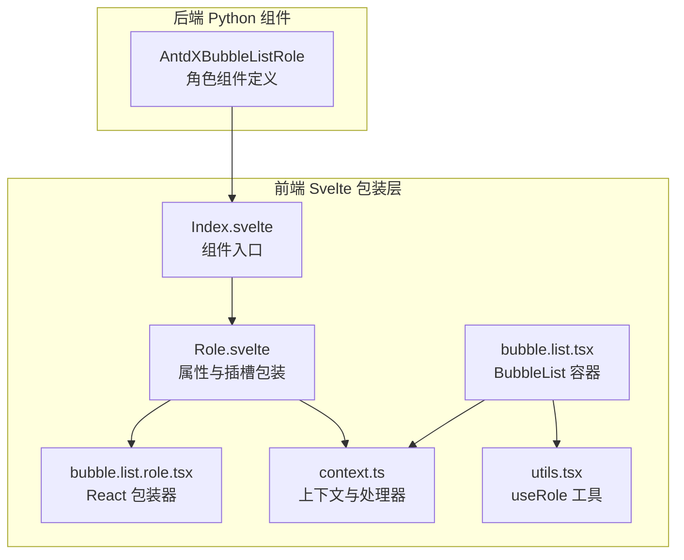
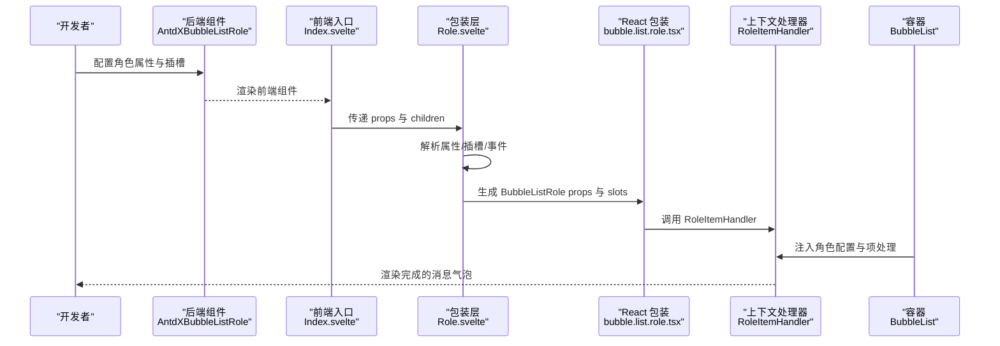
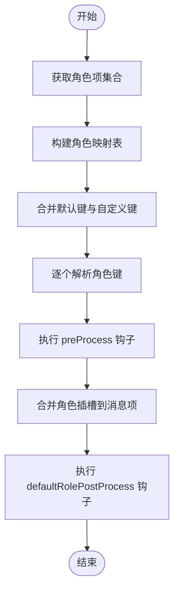
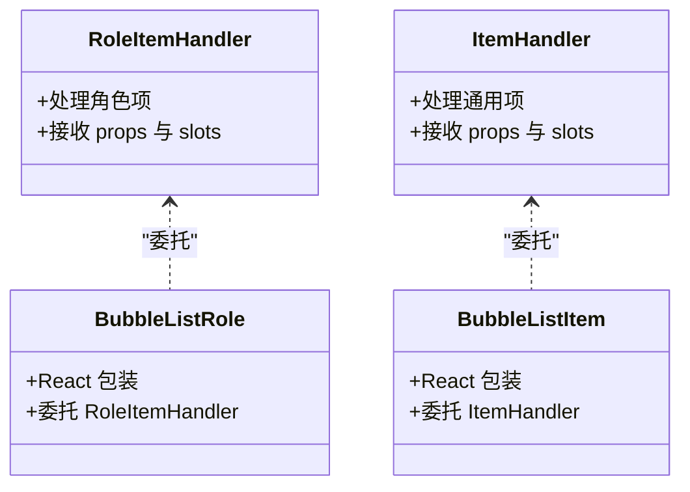
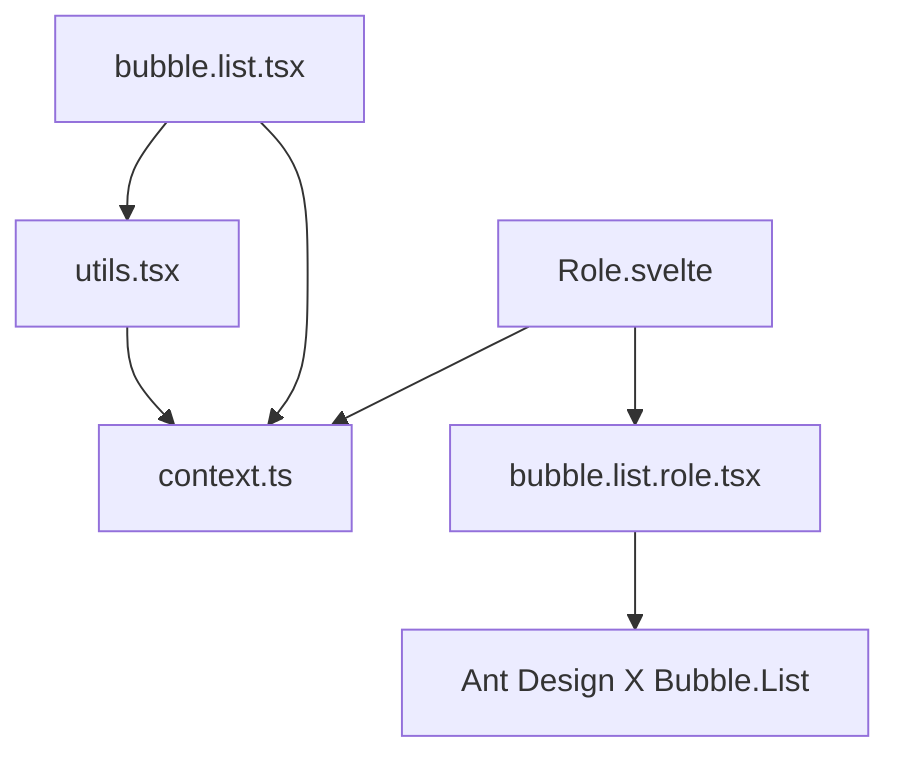

# Bubble.Role 角色标识组件

<cite>
**本文档引用的文件**
- [frontend/antdx/bubble/list/role/Role.svelte](file://frontend/antdx/bubble/list/role/Role.svelte)
- [frontend/antdx/bubble/list/role/bubble.list.role.tsx](file://frontend/antdx/bubble/list/role/bubble.list.role.tsx)
- [backend/modelscope_studio/components/antdx/bubble/list/role/__init__.py](file://backend/modelscope_studio/components/antdx/bubble/list/role/__init__.py)
- [frontend/antdx/bubble/list/role/Index.svelte](file://frontend/antdx/bubble/list/role/Index.svelte)
- [frontend/antdx/bubble/list/context.ts](file://frontend/antdx/bubble/list/context.ts)
- [frontend/antdx/bubble/list/utils.tsx](file://frontend/antdx/bubble/list/utils.tsx)
- [frontend/antdx/bubble/list/bubble.list.tsx](file://frontend/antdx/bubble/list/bubble.list.tsx)
- [frontend/antdx/bubble/list/item/Item.svelte](file://frontend/antdx/bubble/list/item/Item.svelte)
- [frontend/antdx/bubble/list/item/bubble.list.item.tsx](file://frontend/antdx/bubble/list/item/bubble.list.item.tsx)
- [docs/components/antdx/bubble/README-zh_CN.md](file://docs/components/antdx/bubble/README-zh_CN.md)
</cite>

## 目录

1. [简介](#简介)
2. [项目结构](#项目结构)
3. [核心组件](#核心组件)
4. [架构总览](#架构总览)
5. [详细组件分析](#详细组件分析)
6. [依赖关系分析](#依赖关系分析)
7. [性能考虑](#性能考虑)
8. [故障排除指南](#故障排除指南)
9. [结论](#结论)
10. [附录](#附录)

## 简介

Bubble.Role 是消息气泡列表中的角色标识组件，用于在聊天界面中为每条消息或消息片段标注发送者角色（如用户、系统、助手等）。它通过统一的角色配置与 Bubble.Item 协同工作，实现角色头像、标题、副标题、额外信息、底部信息等区域的渲染，并支持可编辑、打字动画、流式渲染等高级特性。该组件既可在前端 Svelte 层直接使用，也可通过后端 Python 组件桥接，实现从服务端到前端的完整数据流转。

## 项目结构

Bubble.Role 所属的 Bubble 列表体系采用“前端 Svelte 包装层 + 后端 Python 组件桥接”的双层设计：

- 前端层：Svelte 组件负责属性透传、插槽处理、事件绑定与渲染。
- 后端层：Python 组件负责声明属性、事件、插槽与生命周期钩子，并将渲染结果传递给前端。

图表来源

- [backend/modelscope_studio/components/antdx/bubble/list/role/**init**.py:10-128](file://backend/modelscope_studio/components/antdx/bubble/list/role/__init__.py#L10-L128)
- [frontend/antdx/bubble/list/role/Index.svelte:1-20](file://frontend/antdx/bubble/list/role/Index.svelte#L1-L20)
- [frontend/antdx/bubble/list/role/Role.svelte:1-148](file://frontend/antdx/bubble/list/role/Role.svelte#L1-L148)
- [frontend/antdx/bubble/list/role/bubble.list.role.tsx:1-14](file://frontend/antdx/bubble/list/role/bubble.list.role.tsx#L1-L14)
- [frontend/antdx/bubble/list/context.ts:1-12](file://frontend/antdx/bubble/list/context.ts#L1-L12)
- [frontend/antdx/bubble/list/utils.tsx:1-112](file://frontend/antdx/bubble/list/utils.tsx#L1-L112)
- [frontend/antdx/bubble/list/bubble.list.tsx:1-48](file://frontend/antdx/bubble/list/bubble.list.tsx#L1-L48)

章节来源

- [backend/modelscope_studio/components/antdx/bubble/list/role/**init**.py:10-128](file://backend/modelscope_studio/components/antdx/bubble/list/role/__init__.py#L10-L128)
- [frontend/antdx/bubble/list/role/Index.svelte:1-20](file://frontend/antdx/bubble/list/role/Index.svelte#L1-L20)
- [frontend/antdx/bubble/list/role/Role.svelte:1-148](file://frontend/antdx/bubble/list/role/Role.svelte#L1-L148)
- [frontend/antdx/bubble/list/role/bubble.list.role.tsx:1-14](file://frontend/antdx/bubble/list/role/bubble.list.role.tsx#L1-L14)
- [frontend/antdx/bubble/list/context.ts:1-12](file://frontend/antdx/bubble/list/context.ts#L1-L12)
- [frontend/antdx/bubble/list/utils.tsx:1-112](file://frontend/antdx/bubble/list/utils.tsx#L1-L112)
- [frontend/antdx/bubble/list/bubble.list.tsx:1-48](file://frontend/antdx/bubble/list/bubble.list.tsx#L1-L48)

## 核心组件

- AntdXBubbleListRole（后端）：定义角色组件的属性、事件、插槽与生命周期行为，支持 typing、typing_complete、edit_confirm、edit_cancel 等事件绑定，以及 avatar、header、footer、extra、loadingRender、contentRender 等插槽。
- Role.svelte（前端包装）：负责将后端传入的属性与插槽进行处理，生成 BubbleListRole 的 props 与 slots，并支持可见性控制与子节点渲染。
- bubble.list.role.tsx（React 包装）：将 Svelte 组件映射为 React 可用的组件，内部委托给 RoleItemHandler 处理项级逻辑。
- context.ts：提供 RoleItemHandler 上下文，供 Bubble.Role 与 Bubble.Item 共享状态与事件。
- utils.tsx：提供 useRole 工具，用于根据角色键值解析并合并角色配置，支持默认角色键与预处理/后处理钩子。
- bubble.list.tsx：BubbleList 容器，负责将角色配置注入到 Ant Design X 的 Bubble.List 中，并渲染最终的气泡列表。

章节来源

- [backend/modelscope_studio/components/antdx/bubble/list/role/**init**.py:14-46](file://backend/modelscope_studio/components/antdx/bubble/list/role/__init__.py#L14-L46)
- [frontend/antdx/bubble/list/role/Role.svelte:35-133](file://frontend/antdx/bubble/list/role/Role.svelte#L35-L133)
- [frontend/antdx/bubble/list/role/bubble.list.role.tsx:7-11](file://frontend/antdx/bubble/list/role/bubble.list.role.tsx#L7-L11)
- [frontend/antdx/bubble/list/context.ts:6-10](file://frontend/antdx/bubble/list/context.ts#L6-L10)
- [frontend/antdx/bubble/list/utils.tsx:44-112](file://frontend/antdx/bubble/list/utils.tsx#L44-L112)
- [frontend/antdx/bubble/list/bubble.list.tsx:13-46](file://frontend/antdx/bubble/list/bubble.list.tsx#L13-L46)

## 架构总览

Bubble.Role 的调用链路如下：

- 后端 Python 组件接收开发者配置的角色参数与插槽，将其转换为前端可识别的数据结构。
- 前端 Index.svelte 加载 Role.svelte，Role.svelte 解析属性与插槽，生成 BubbleListRole 的 props 与 slots。
- bubble.list.role.tsx 将 props 交由 RoleItemHandler 处理，最终渲染为 Ant Design X 的 Bubble.List 子项。
- BubbleList 容器通过 useRole 工具解析角色配置，结合 Bubble.Item 的通用项处理，完成整体布局与交互。

图表来源

- [backend/modelscope_studio/components/antdx/bubble/list/role/**init**.py:109-110](file://backend/modelscope_studio/components/antdx/bubble/list/role/__init__.py#L109-L110)
- [frontend/antdx/bubble/list/role/Index.svelte:5-19](file://frontend/antdx/bubble/list/role/Index.svelte#L5-L19)
- [frontend/antdx/bubble/list/role/Role.svelte:136-147](file://frontend/antdx/bubble/list/role/Role.svelte#L136-L147)
- [frontend/antdx/bubble/list/role/bubble.list.role.tsx:7-11](file://frontend/antdx/bubble/list/role/bubble.list.role.tsx#L7-L11)
- [frontend/antdx/bubble/list/context.ts:6-10](file://frontend/antdx/bubble/list/context.ts#L6-L10)
- [frontend/antdx/bubble/list/bubble.list.tsx:13-46](file://frontend/antdx/bubble/list/bubble.list.tsx#L13-L46)

## 详细组件分析

### 组件职责与属性配置

- 角色标识属性
  - role：角色键名，用于在 useRole 中匹配对应的角色配置。
  - avatar：角色头像资源路径或内容。
  - header/footer/extra：顶部、底部与额外区域的内容。
  - placement：角色区域的起始/结束位置控制。
  - shape：气泡形状（圆润/角形/默认）。
  - variant：外观变体（填充/无边框/描边/阴影）。
  - typing/streaming：打字动画与流式渲染开关。
  - editable：是否允许编辑，支持布尔或对象形式。
  - class_names/styles/root_class_name：样式类名与内联样式的扩展。
  - additional_props/as_item/\_internal：附加属性、作为项标识与内部索引。
  - 可见性与 DOM 属性：visible、elem_id、elem_classes、elem_style、render。

- 插槽
  - avatar、header、footer、extra、loadingRender、contentRender。
  - 可选编辑插槽：editable.okText、editable.cancelText。

- 事件
  - typing、typing_complete、edit_confirm、edit_cancel。

章节来源

- [backend/modelscope_studio/components/antdx/bubble/list/role/**init**.py:48-107](file://backend/modelscope_studio/components/antdx/bubble/list/role/__init__.py#L48-L107)
- [backend/modelscope_studio/components/antdx/bubble/list/role/**init**.py:14-46](file://backend/modelscope_studio/components/antdx/bubble/list/role/__init__.py#L14-L46)
- [backend/modelscope_studio/components/antdx/bubble/list/role/**init**.py:14-34](file://backend/modelscope_studio/components/antdx/bubble/list/role/__init__.py#L14-L34)

### 显示逻辑与角色类型

- 角色解析流程
  - useRole 接收 role、defaultRoleKeys、preProcess、defaultRolePostProcess 等参数。
  - 通过 useRoleItems 获取角色项集合，构建角色映射表。
  - 合并默认角色键与用户自定义角色键，按顺序解析为函数或对象。
  - 对于每个消息项，先执行 preProcess，再将角色插槽通过 patchSlots 合并到消息项上，最后应用 defaultRolePostProcess 进行最终调整。

图表来源

- [frontend/antdx/bubble/list/utils.tsx:44-112](file://frontend/antdx/bubble/list/utils.tsx#L44-L112)

章节来源

- [frontend/antdx/bubble/list/utils.tsx:44-112](file://frontend/antdx/bubble/list/utils.tsx#L44-L112)

### 样式定制与位置控制

- 样式定制
  - class_names：支持为根元素、头像、内容等区域分别设置类名。
  - styles：支持为根元素、内容等区域设置内联样式。
  - root_class_name：根元素的额外类名。
  - shape/variant/placement：通过 Ant Design X 的 Bubble.List 传入，控制外观与对齐。

- 位置控制
  - placement 控制角色区域位于起始或结束侧。
  - footer_placement 支持外侧起始/结束与内侧起始/结束的底部区域定位。

章节来源

- [backend/modelscope_studio/components/antdx/bubble/list/role/**init**.py:62-66](file://backend/modelscope_studio/components/antdx/bubble/list/role/__init__.py#L62-L66)
- [backend/modelscope_studio/components/antdx/bubble/list/role/**init**.py:57-66](file://backend/modelscope_studio/components/antdx/bubble/list/role/__init__.py#L57-L66)

### 与 Bubble.Item 的配合使用

- Bubble.Item 提供通用的消息项能力，包括内容、头像、标题、副标题、底部信息、额外信息、加载与内容渲染插槽等。
- Bubble.Role 通过 RoleItemHandler 与 Bubble.Item 的 ItemHandler 共享上下文，使角色信息能够无缝融入消息项的渲染流程。
- BubbleList 容器同时管理 items 与 roles 的上下文，确保角色配置与消息项正确关联。

图表来源

- [frontend/antdx/bubble/list/context.ts:6-10](file://frontend/antdx/bubble/list/context.ts#L6-L10)
- [frontend/antdx/bubble/list/item/bubble.list.item.tsx:7-11](file://frontend/antdx/bubble/list/item/bubble.list.item.tsx#L7-L11)
- [frontend/antdx/bubble/list/role/bubble.list.role.tsx:7-11](file://frontend/antdx/bubble/list/role/bubble.list.role.tsx#L7-L11)

章节来源

- [frontend/antdx/bubble/list/context.ts:1-12](file://frontend/antdx/bubble/list/context.ts#L1-L12)
- [frontend/antdx/bubble/list/item/bubble.list.item.tsx:1-14](file://frontend/antdx/bubble/list/item/bubble.list.item.tsx#L1-L14)
- [frontend/antdx/bubble/list/role/bubble.list.role.tsx:1-14](file://frontend/antdx/bubble/list/role/bubble.list.role.tsx#L1-L14)

### 使用示例与最佳实践

- 基础角色标识
  - 设置 role、avatar、header、footer 等基础属性，即可快速渲染角色头像与标题区域。
- 自定义角色样式
  - 通过 class_names 与 styles 为不同区域设置类名与内联样式；利用 shape 与 variant 控制外观。
- 动态角色信息
  - 结合 useRole 的 preProcess 与 defaultRolePostProcess，实现根据消息索引或上下文动态调整角色配置。
- 与 Bubble.Item 的组合
  - 在 BubbleList 中同时提供 items 与 roles，确保角色信息与消息内容协同渲染。

章节来源

- [frontend/antdx/bubble/list/utils.tsx:44-112](file://frontend/antdx/bubble/list/utils.tsx#L44-L112)
- [frontend/antdx/bubble/list/bubble.list.tsx:13-46](file://frontend/antdx/bubble/list/bubble.list.tsx#L13-L46)

## 依赖关系分析

- 组件耦合
  - Role.svelte 依赖 context.ts 提供的 RoleItemHandler，通过 bubble.list.role.tsx 与 Ant Design X 的 Bubble.List 对接。
  - utils.tsx 通过 useRoleItems 获取角色上下文，与 BubbleList 容器形成松耦合的配置注入机制。
- 外部依赖
  - Ant Design X 的 Bubble.List 作为渲染核心，Bubble.Role 仅负责角色维度的配置与插槽处理。
  - Gradio 事件系统用于 typing、typing_complete、edit_confirm、edit_cancel 等回调绑定。

图表来源

- [frontend/antdx/bubble/list/role/Role.svelte:14-16](file://frontend/antdx/bubble/list/role/Role.svelte#L14-L16)
- [frontend/antdx/bubble/list/role/bubble.list.role.tsx:7-11](file://frontend/antdx/bubble/list/role/bubble.list.role.tsx#L7-L11)
- [frontend/antdx/bubble/list/context.ts:6-10](file://frontend/antdx/bubble/list/context.ts#L6-L10)
- [frontend/antdx/bubble/list/bubble.list.tsx:13-46](file://frontend/antdx/bubble/list/bubble.list.tsx#L13-L46)
- [frontend/antdx/bubble/list/utils.tsx:64-90](file://frontend/antdx/bubble/list/utils.tsx#L64-L90)

章节来源

- [frontend/antdx/bubble/list/role/Role.svelte:1-148](file://frontend/antdx/bubble/list/role/Role.svelte#L1-L148)
- [frontend/antdx/bubble/list/role/bubble.list.role.tsx:1-14](file://frontend/antdx/bubble/list/role/bubble.list.role.tsx#L1-L14)
- [frontend/antdx/bubble/list/context.ts:1-12](file://frontend/antdx/bubble/list/context.ts#L1-L12)
- [frontend/antdx/bubble/list/bubble.list.tsx:1-48](file://frontend/antdx/bubble/list/bubble.list.tsx#L1-L48)
- [frontend/antdx/bubble/list/utils.tsx:1-112](file://frontend/antdx/bubble/list/utils.tsx#L1-L112)

## 性能考虑

- 按需渲染
  - 通过 visible 控制组件可见性，避免不必要的渲染与 DOM 更新。
- 插槽克隆与参数传递
  - 插槽采用克隆与带参渲染策略，减少重复计算与副作用。
- 事件绑定优化
  - 事件回调通过 Gradio 内部更新绑定标志位，避免频繁重绑导致的性能损耗。
- 计算缓存
  - useRole 通过 useMemoizedFn 与 useMemoizedEqualValue 缓存函数与默认键，降低重复解析成本。

## 故障排除指南

- 角色未生效
  - 检查 role 键是否存在于 useRole 的角色映射中；确认 defaultRoleKeys 是否包含该键。
  - 确认 BubbleList 已注入 roles 上下文。
- 插槽不显示
  - 确认插槽名称拼写正确（avatar/header/footer/extra/loadingRender/contentRender）。
  - 检查插槽是否被父级容器覆盖或未正确传递至 BubbleListRole。
- 事件无效
  - 确认事件监听器已启用（bind_typing_event/bind_typingComplete_event 等）。
  - 检查事件回调是否正确绑定到组件实例。
- 样式不生效
  - 检查 class_names 与 styles 的键名是否与目标区域一致。
  - 确认 root_class_name 与 elem_classes 的优先级关系。

章节来源

- [backend/modelscope_studio/components/antdx/bubble/list/role/**init**.py:14-34](file://backend/modelscope_studio/components/antdx/bubble/list/role/__init__.py#L14-L34)
- [frontend/antdx/bubble/list/role/Role.svelte:66-133](file://frontend/antdx/bubble/list/role/Role.svelte#L66-L133)
- [frontend/antdx/bubble/list/utils.tsx:91-112](file://frontend/antdx/bubble/list/utils.tsx#L91-L112)

## 结论

Bubble.Role 通过清晰的前后端分层设计与灵活的角色配置机制，实现了在消息气泡中对发送者角色的高效标识与渲染。其与 Bubble.Item 的紧密协作、与 Ant Design X 的无缝对接，以及对插槽、事件与样式的全面支持，使其成为构建复杂聊天界面的理想选择。建议在实际项目中结合 useRole 的钩子与 BubbleList 的上下文能力，实现更丰富的角色化体验。

## 附录

- 相关文档与示例
  - Bubble 组件文档与示例页面，包含基础气泡、打字效果、外观变体、气泡列表与自定义列表内容等演示。

章节来源

- [docs/components/antdx/bubble/README-zh_CN.md:1-13](file://docs/components/antdx/bubble/README-zh_CN.md#L1-L13)
