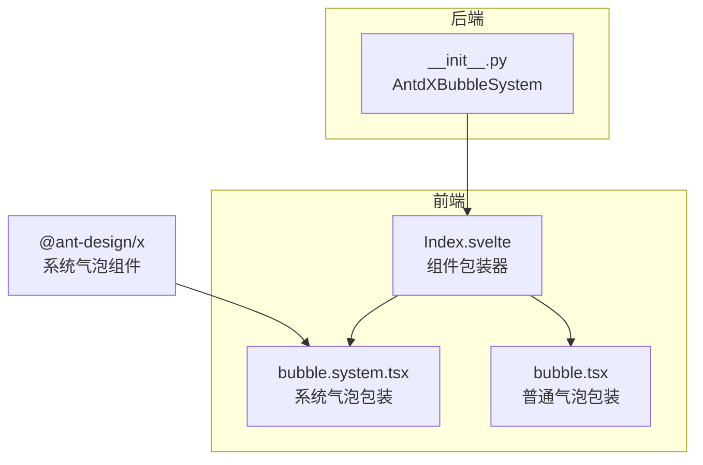
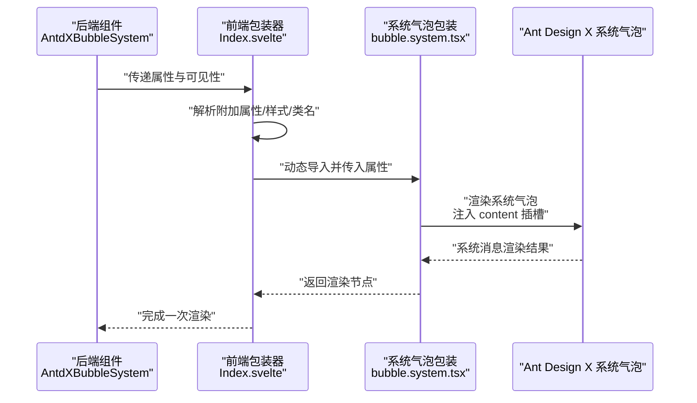
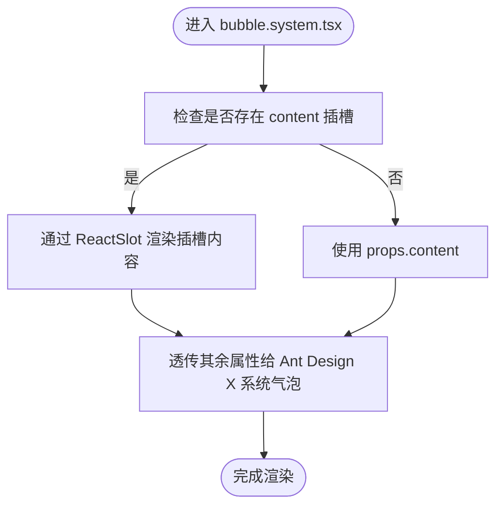
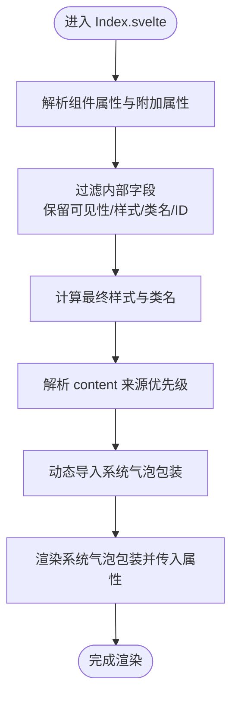
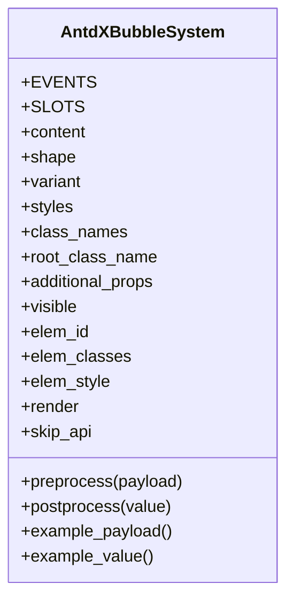
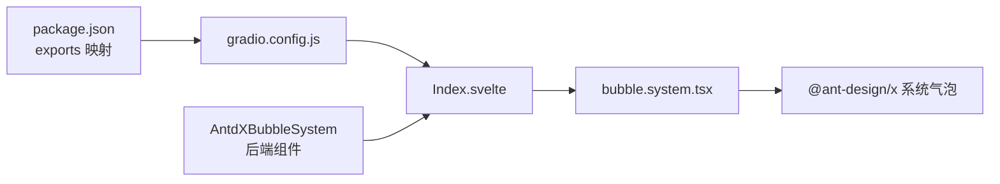

# Bubble.System 系统消息组件

<cite>
**本文档引用的文件**
- [frontend/antdx/bubble/system/bubble.system.tsx](file://frontend/antdx/bubble/system/bubble.system.tsx)
- [frontend/antdx/bubble/system/Index.svelte](file://frontend/antdx/bubble/system/Index.svelte)
- [backend/modelscope_studio/components/antdx/bubble/system/__init__.py](file://backend/modelscope_studio/components/antdx/bubble/system/__init__.py)
- [frontend/antdx/bubble/bubble.tsx](file://frontend/antdx/bubble/bubble.tsx)
- [frontend/antdx/bubble/system/package.json](file://frontend/antdx/bubble/system/package.json)
- [frontend/antdx/bubble/system/gradio.config.js](file://frontend/antdx/bubble/system/gradio.config.js)
</cite>

## 目录

1. [简介](#简介)
2. [项目结构](#项目结构)
3. [核心组件](#核心组件)
4. [架构总览](#架构总览)
5. [详细组件分析](#详细组件分析)
6. [依赖关系分析](#依赖关系分析)
7. [性能考虑](#性能考虑)
8. [故障排除指南](#故障排除指南)
9. [结论](#结论)
10. [附录](#附录)

## 简介

Bubble.System 是专用于渲染“系统消息”的组件，区别于普通用户或机器人消息，系统消息通常用于呈现系统提示、状态通知、操作反馈等非对话型信息。该组件基于 Ant Design X 的系统气泡能力进行封装，提供统一的渲染入口与属性配置，确保在聊天界面中以一致的视觉风格和交互行为展示系统类内容。

## 项目结构

Bubble.System 组件由前端 Svelte 包装层与后端 Python 组件两部分组成：

- 前端包装层：负责将 Ant Design X 的系统气泡组件桥接到 Gradio/Svelte 生态，并支持插槽（slot）与额外属性透传。
- 后端组件：作为 ModelScope Studio 的布局组件，定义可选插槽、属性集合以及渲染控制策略。

图表来源

- [frontend/antdx/bubble/system/Index.svelte:10-63](file://frontend/antdx/bubble/system/Index.svelte#L10-L63)
- [frontend/antdx/bubble/system/bubble.system.tsx:12-24](file://frontend/antdx/bubble/system/bubble.system.tsx#L12-L24)
- [backend/modelscope_studio/components/antdx/bubble/system/**init**.py:8-55](file://backend/modelscope_studio/components/antdx/bubble/system/__init__.py#L8-L55)

章节来源

- [frontend/antdx/bubble/system/Index.svelte:1-64](file://frontend/antdx/bubble/system/Index.svelte#L1-L64)
- [frontend/antdx/bubble/system/bubble.system.tsx:1-27](file://frontend/antdx/bubble/system/bubble.system.tsx#L1-L27)
- [backend/modelscope_studio/components/antdx/bubble/system/**init**.py:1-73](file://backend/modelscope_studio/components/antdx/bubble/system/__init__.py#L1-L73)

## 核心组件

- 前端系统气泡包装（bubble.system.tsx）
  - 将 Ant Design X 的系统气泡组件桥接为 Svelte 可用形态，支持 content 插槽与普通属性透传。
  - 使用 ReactSlot 渲染插槽内容，确保与 Gradio/Svelte 的插槽机制兼容。
- 前端组件包装器（Index.svelte）
  - 动态导入系统气泡包装组件，按需渲染。
  - 提供可见性控制、样式与 ID 注入、附加属性透传等通用能力。
- 后端组件（AntdXBubbleSystem）
  - 定义系统消息可用的属性集合（如 shape、variant、content 等）。
  - 支持 content 插槽，声明式地注入系统消息内容。
  - 控制渲染可见性与元素级样式/类名注入。

章节来源

- [frontend/antdx/bubble/system/bubble.system.tsx:7-24](file://frontend/antdx/bubble/system/bubble.system.tsx#L7-L24)
- [frontend/antdx/bubble/system/Index.svelte:13-63](file://frontend/antdx/bubble/system/Index.svelte#L13-L63)
- [backend/modelscope_studio/components/antdx/bubble/system/**init**.py:20-55](file://backend/modelscope_studio/components/antdx/bubble/system/__init__.py#L20-L55)

## 架构总览

Bubble.System 的调用链路如下：

- 后端 AntdXBubbleSystem 接收属性与插槽，决定是否渲染。
- 前端 Index.svelte 在可见时动态加载 bubble.system.tsx。
- bubble.system.tsx 将 Ant Design X 的系统气泡组件与插槽内容对接，完成最终渲染。

图表来源

- [backend/modelscope_studio/components/antdx/bubble/system/**init**.py:40-55](file://backend/modelscope_studio/components/antdx/bubble/system/__init__.py#L40-L55)
- [frontend/antdx/bubble/system/Index.svelte:47-63](file://frontend/antdx/bubble/system/Index.svelte#L47-L63)
- [frontend/antdx/bubble/system/bubble.system.tsx:12-24](file://frontend/antdx/bubble/system/bubble.system.tsx#L12-L24)

## 详细组件分析

### 前端系统气泡包装（bubble.system.tsx）

- 设计要点
  - 使用 sveltify 将原生 React 组件桥接为 Svelte 形态，保留 slot 能力。
  - content 插槽优先级高于直接属性，便于灵活定制系统消息内容。
  - 隐藏 children，避免重复渲染与样式冲突。
- 关键流程
  - 判断是否存在 content 插槽，若存在则通过 ReactSlot 渲染；否则回退到 props.content。
  - 将除 content 外的属性透传给 Ant Design X 的系统气泡组件。

图表来源

- [frontend/antdx/bubble/system/bubble.system.tsx:12-24](file://frontend/antdx/bubble/system/bubble.system.tsx#L12-L24)

章节来源

- [frontend/antdx/bubble/system/bubble.system.tsx:1-27](file://frontend/antdx/bubble/system/bubble.system.tsx#L1-L27)

### 前端组件包装器（Index.svelte）

- 设计要点
  - 动态导入系统气泡包装组件，避免不必要的初始加载。
  - 对可见性、样式、类名、元素 ID 进行统一处理，保证与 Gradio 生态一致。
  - 将 content 优先从附加属性或组件属性中获取，确保灵活性。
- 关键流程
  - 解析组件属性与附加属性，过滤掉内部字段。
  - 计算最终样式与类名，注入到系统气泡包装组件。
  - 传入 slots 与 children，交由包装层完成渲染。

图表来源

- [frontend/antdx/bubble/system/Index.svelte:20-63](file://frontend/antdx/bubble/system/Index.svelte#L20-L63)

章节来源

- [frontend/antdx/bubble/system/Index.svelte:1-64](file://frontend/antdx/bubble/system/Index.svelte#L1-L64)

### 后端组件（AntdXBubbleSystem）

- 设计要点
  - 继承 ModelScope Studio 的布局组件基类，具备统一的生命周期与渲染策略。
  - 显式声明支持的插槽（content），确保前端包装层正确对接。
  - 属性集合覆盖系统消息常见需求：内容、形状、变体、样式与类名等。
- 关键流程
  - 初始化阶段设置可见性、元素 ID/类名/样式、附加属性等。
  - 指定前端目录映射，确保前端资源正确加载。
  - 标记为跳过 API 调用，避免冗余的前后端通信。

图表来源

- [backend/modelscope_studio/components/antdx/bubble/system/**init**.py:8-73](file://backend/modelscope_studio/components/antdx/bubble/system/__init__.py#L8-L73)

章节来源

- [backend/modelscope_studio/components/antdx/bubble/system/**init**.py:1-73](file://backend/modelscope_studio/components/antdx/bubble/system/__init__.py#L1-L73)

### 与普通气泡组件的差异

- 角色定位
  - 普通气泡（Bubble）用于用户/机器人对话内容渲染，支持头像、标题、底部操作等丰富插槽。
  - 系统气泡（Bubble.System）专注于系统提示、状态通知、操作反馈等非对话型内容。
- 插槽与属性
  - 普通气泡支持更多插槽（如 avatar、header、footer、extra、contentRender 等）。
  - 系统气泡仅聚焦 content 插槽与基础属性，保持简洁与一致性。
- 渲染目标
  - 普通气泡面向“人”与“角色”的交互内容。
  - 系统气泡面向“系统”向用户传达的信息。

章节来源

- [frontend/antdx/bubble/bubble.tsx:14-116](file://frontend/antdx/bubble/bubble.tsx#L14-L116)
- [frontend/antdx/bubble/system/bubble.system.tsx:7-24](file://frontend/antdx/bubble/system/bubble.system.tsx#L7-L24)

## 依赖关系分析

- 前端依赖
  - @svelte-preprocess-react：提供 sveltify 与 ReactSlot 能力，实现 React 组件与 Svelte 的桥接。
  - @ant-design/x：系统气泡组件的实际实现来源。
  - 前端包导出配置与 Gradio 集成：通过 package.json 的 exports 字段与 gradio.config.js 实现。
- 后端依赖
  - ModelScopeLayoutComponent：统一的布局组件基类，提供可见性、样式、类名等通用能力。
  - resolve_frontend_dir：根据组件类型与名称解析前端目录，确保资源正确加载。

图表来源

- [frontend/antdx/bubble/system/package.json:1-15](file://frontend/antdx/bubble/system/package.json#L1-L15)
- [frontend/antdx/bubble/system/gradio.config.js:1-4](file://frontend/antdx/bubble/system/gradio.config.js#L1-L4)
- [frontend/antdx/bubble/system/Index.svelte:10-10](file://frontend/antdx/bubble/system/Index.svelte#L10-L10)
- [frontend/antdx/bubble/system/bubble.system.tsx:4-4](file://frontend/antdx/bubble/system/bubble.system.tsx#L4-L4)
- [backend/modelscope_studio/components/antdx/bubble/system/**init**.py:55-55](file://backend/modelscope_studio/components/antdx/bubble/system/__init__.py#L55-L55)

章节来源

- [frontend/antdx/bubble/system/package.json:1-15](file://frontend/antdx/bubble/system/package.json#L1-L15)
- [frontend/antdx/bubble/system/gradio.config.js:1-4](file://frontend/antdx/bubble/system/gradio.config.js#L1-L4)
- [backend/modelscope_studio/components/antdx/bubble/system/**init**.py:55-55](file://backend/modelscope_studio/components/antdx/bubble/system/__init__.py#L55-L55)

## 性能考虑

- 按需加载
  - Index.svelte 采用动态导入，仅在可见时加载系统气泡包装组件，降低初始渲染开销。
- 插槽渲染优化
  - ReactSlot 仅在插槽存在时才渲染，避免空内容造成的不必要计算。
- 属性透传最小化
  - 仅传递必要属性与插槽，减少不必要的重渲染与样式计算。

## 故障排除指南

- 内容未显示
  - 检查 content 是否通过插槽或属性正确传入；插槽优先级高于属性。
  - 确认组件可见性（visible）为真值。
- 样式异常
  - 检查 elem_id、elem_classes、elem_style 是否按预期注入。
  - 确认附加属性（additional_props）未覆盖关键样式。
- 插槽无效
  - 确保插槽名称与后端声明一致（当前仅支持 content 插槽）。
  - 避免同时使用插槽与属性导致的优先级混淆。

章节来源

- [frontend/antdx/bubble/system/Index.svelte:47-63](file://frontend/antdx/bubble/system/Index.svelte#L47-L63)
- [frontend/antdx/bubble/system/bubble.system.tsx:12-24](file://frontend/antdx/bubble/system/bubble.system.tsx#L12-L24)
- [backend/modelscope_studio/components/antdx/bubble/system/**init**.py:16-18](file://backend/modelscope_studio/components/antdx/bubble/system/__init__.py#L16-L18)

## 结论

Bubble.System 通过清晰的前后端分层设计，将 Ant Design X 的系统气泡能力无缝集成到 ModelScope Studio 的组件生态中。其简洁的属性集与插槽机制，使其非常适合用于系统提示、状态通知与操作反馈等场景。配合按需加载与插槽渲染优化，能够在保证功能完整性的同时兼顾性能表现。

## 附录

### 使用示例（场景化）

- 欢迎消息
  - 场景：用户首次进入页面时展示欢迎语。
  - 方案：通过 content 插槽注入欢迎文案，设置合适的 shape/variant 以突出系统提示风格。
- 错误提示
  - 场景：网络异常或服务错误时向用户提示。
  - 方案：使用 content 插槽承载错误描述，结合样式与类名注入统一视觉风格。
- 进度通知
  - 场景：后台任务执行中的阶段性提示。
  - 方案：通过 content 插槽动态更新进度文本，保持系统消息的一致性与可读性。

### 配置选项与最佳实践

- 常用属性
  - content：系统消息内容（字符串或插槽）。
  - shape：气泡形状（round/corner/default）。
  - variant：外观变体（filled/borderless/outlined/shadow）。
  - styles/elem_style：内联样式。
  - elem_id/elem_classes：元素 ID 与类名。
  - additional_props：附加属性集合。
  - visible：是否渲染。
- 最佳实践
  - 优先使用 content 插槽以获得更高的灵活性。
  - 保持系统消息的简洁与一致性，避免过度装饰影响可读性。
  - 合理使用 shape 与 variant，确保在不同主题下具有良好的对比度与可识别性。
  - 通过 elem_id/elem_classes 精准控制样式，避免全局污染。

章节来源

- [backend/modelscope_studio/components/antdx/bubble/system/**init**.py:20-55](file://backend/modelscope_studio/components/antdx/bubble/system/__init__.py#L20-L55)
- [frontend/antdx/bubble/system/Index.svelte:20-63](file://frontend/antdx/bubble/system/Index.svelte#L20-L63)
