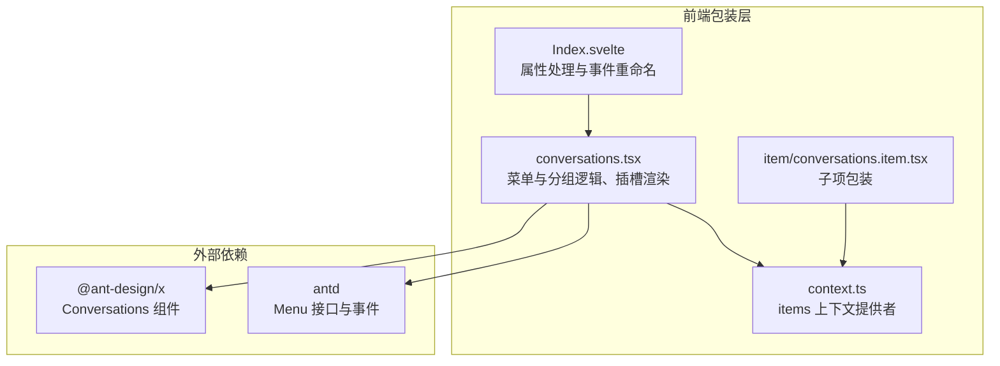
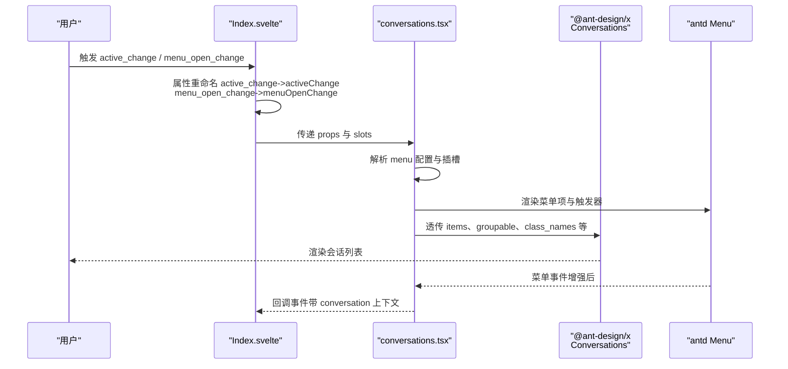
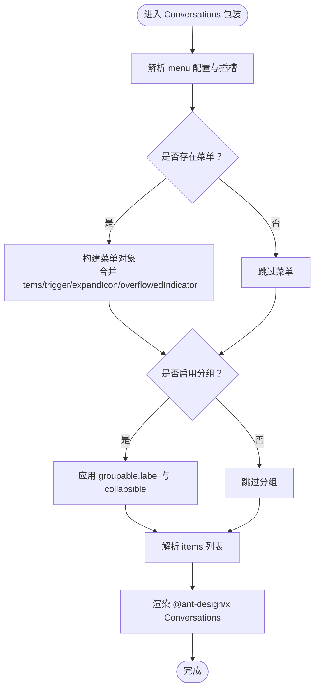
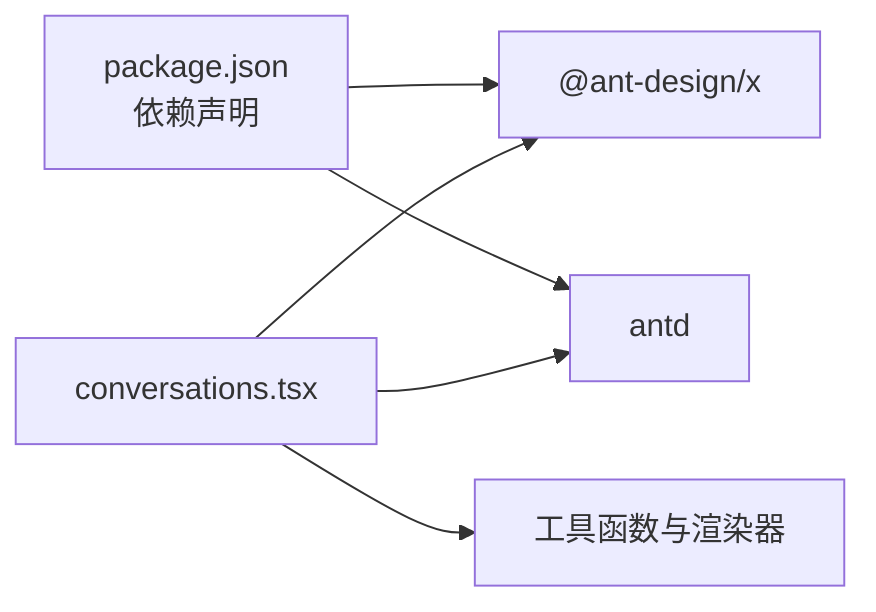

# API 参考

<cite>
**本文引用的文件**
- [conversations.tsx](file://frontend/antdx/conversations/conversations.tsx)
- [context.ts](file://frontend/antdx/conversations/context.ts)
- [Index.svelte](file://frontend/antdx/conversations/Index.svelte)
- [conversations.item.tsx](file://frontend/antdx/conversations/item/conversations.item.tsx)
- [basic.py](file://docs/components/antdx/conversations/demos/basic.py)
- [operations.py](file://docs/components/antdx/conversations/demos/operations.py)
- [group.py](file://docs/components/antdx/conversations/demos/group.py)
- [package.json](file://frontend/package.json)
</cite>

## 目录

1. [简介](#简介)
2. [项目结构](#项目结构)
3. [核心组件](#核心组件)
4. [架构总览](#架构总览)
5. [详细组件分析](#详细组件分析)
6. [依赖分析](#依赖分析)
7. [性能考虑](#性能考虑)
8. [故障排查指南](#故障排查指南)
9. [结论](#结论)
10. [附录](#附录)

## 简介

本文件为 Conversations 组件的详细 API 参考文档，覆盖以下方面：

- 所有属性参数：active_key、default_active_key、items、menu、groupable、shortcut_keys、creation、styles、class_names 等
- 事件监听器：active_change、menu_open_change、menu_click、menu_select 等
- 插槽（slots）：menu.expandIcon、menu.overflowedIndicator、menu.trigger、groupable.label、items、creation.icon 等
- 参数类型、默认值、使用场景与配置示例
- 内部数据流与渲染机制说明

## 项目结构

Conversations 组件由前端 Svelte 包装层与 Ant Design X 的真实组件组合而成，并通过 Gradio 前端桥接层进行事件映射与插槽透传。

图表来源

- [Index.svelte:1-70](file://frontend/antdx/conversations/Index.svelte#L1-L70)
- [conversations.tsx:1-178](file://frontend/antdx/conversations/conversations.tsx#L1-L178)
- [context.ts:1-7](file://frontend/antdx/conversations/context.ts#L1-L7)
- [conversations.item.tsx:1-13](file://frontend/antdx/conversations/item/conversations.item.tsx#L1-L13)

章节来源

- [Index.svelte:1-70](file://frontend/antdx/conversations/Index.svelte#L1-L70)
- [conversations.tsx:1-178](file://frontend/antdx/conversations/conversations.tsx#L1-L178)
- [context.ts:1-7](file://frontend/antdx/conversations/context.ts#L1-L7)
- [conversations.item.tsx:1-13](file://frontend/antdx/conversations/item/conversations.item.tsx#L1-L13)

## 核心组件

- 组件名称：Conversations
- 包装来源：@ant-design/x 的 Conversations 组件
- 作用：管理与展示会话列表，支持菜单、分组、快捷键等高级能力
- 事件映射：active_change、menu_open_change 在前端桥接层中被重命名为 activeChange、menu_openChange

章节来源

- [Index.svelte:24-51](file://frontend/antdx/conversations/Index.svelte#L24-L51)
- [conversations.tsx:59-178](file://frontend/antdx/conversations/conversations.tsx#L59-L178)

## 架构总览

下图展示了从调用到渲染的关键流程，包括菜单事件增强、插槽渲染与分组配置。

图表来源

- [Index.svelte:24-51](file://frontend/antdx/conversations/Index.svelte#L24-L51)
- [conversations.tsx:35-122](file://frontend/antdx/conversations/conversations.tsx#L35-L122)
- [conversations.tsx:142-170](file://frontend/antdx/conversations/conversations.tsx#L142-L170)

## 详细组件分析

### 属性参数（Props）

- active_key
  - 类型：string | number
  - 默认值：未设置时由内部状态管理决定
  - 使用场景：受控激活项键值
  - 注意：在桥接层中对应 activeChange 事件，事件回调参数包含 payload
  - 示例路径：[basic.py:14-28](file://docs/components/antdx/conversations/demos/basic.py#L14-L28)

- default_active_key
  - 类型：string | number
  - 默认值：无
  - 使用场景：初始化默认激活项
  - 示例路径：[basic.py:32-45](file://docs/components/antdx/conversations/demos/basic.py#L32-L45)

- items
  - 类型：数组，元素为对象或通过插槽提供的子项
  - 默认值：空数组
  - 使用场景：直接传入会话项列表；也可通过插槽 items/default 提供
  - 渲染机制：优先使用传入的 items，否则使用插槽解析后的结果
  - 示例路径：[basic.py:14-28](file://docs/components/antdx/conversations/demos/basic.py#L14-L28)

- menu
  - 类型：对象或函数；对象包含 items、trigger、expandIcon、overflowedIndicator 等字段
  - 默认值：undefined
  - 使用场景：为每个会话项提供操作菜单
  - 行为说明：
    - 若传入字符串，则作为函数使用
    - 若传入对象且存在 items 或插槽 items，则生成菜单
    - onClick 事件会自动阻止 DOM 事件冒泡，并将当前 conversation 作为第一个参数传递给原始回调
  - 示例路径：[operations.py:29-43](file://docs/components/antdx/conversations/demos/operations.py#L29-L43)

- groupable
  - 类型：boolean 或对象；对象可包含 label、collapsible 等
  - 默认值：false
  - 使用场景：启用分组显示与可折叠行为
  - 行为说明：当传入对象或存在 groupable.label 插槽时生效；collapsible 支持函数或布尔值
  - 示例路径：[group.py:8-27](file://docs/components/antdx/conversations/demos/group.py#L8-L27)

- shortcut_keys
  - 类型：boolean
  - 默认值：未显式设置时遵循 @ant-design/x 默认行为
  - 使用场景：启用键盘快捷键导航
  - 注意：具体可用性取决于底层 @ant-design/x 实现

- creation
  - 类型：对象或函数
  - 默认值：未设置
  - 使用场景：自定义“新建”入口或行为
  - 注意：具体字段与行为以 @ant-design/x 文档为准

- styles / class_names
  - 类型：对象；class_names 支持额外类名拼接
  - 默认值：无
  - 使用场景：自定义样式与主题类名
  - 行为说明：内部会为 item 自动拼接特定类名，同时保留用户传入的 classNames

章节来源

- [conversations.tsx:72-170](file://frontend/antdx/conversations/conversations.tsx#L72-L170)
- [Index.svelte:24-51](file://frontend/antdx/conversations/Index.svelte#L24-L51)
- [basic.py:14-45](file://docs/components/antdx/conversations/demos/basic.py#L14-L45)
- [operations.py:29-43](file://docs/components/antdx/conversations/demos/operations.py#L29-L43)
- [group.py:8-27](file://docs/components/antdx/conversations/demos/group.py#L8-L27)

### 事件监听器（Events）

- active_change
  - 说明：激活项变更事件
  - 桥接层重命名：activeChange
  - 回调参数：包含 payload，可用于获取当前激活项信息
  - 示例路径：[basic.py:7-8](file://docs/components/antdx/conversations/demos/basic.py#L7-L8)

- menu_open_change
  - 说明：菜单打开状态变化事件
  - 桥接层重命名：menuOpenChange
  - 回调参数：事件数据对象
  - 示例路径：[Index.svelte:20-21](file://frontend/antdx/conversations/Index.svelte#L20-L21)

- menu_click
  - 说明：菜单点击事件
  - 回调参数：事件数据对象，包含 payload
  - 行为说明：onClick 事件会被增强，确保 DOM 事件不冒泡，并将 conversation 作为首个参数传递
  - 示例路径：[operations.py:7-8](file://docs/components/antdx/conversations/demos/operations.py#L7-L8)

- menu_select
  - 说明：菜单选择事件
  - 回调参数：事件数据对象
  - 行为说明：与 menu_click 类似，但触发时机为选择菜单项

章节来源

- [Index.svelte:20-21](file://frontend/antdx/conversations/Index.svelte#L20-L21)
- [conversations.tsx:35-57](file://frontend/antdx/conversations/conversations.tsx#L35-L57)
- [operations.py:7-8](file://docs/components/antdx/conversations/demos/operations.py#L7-L8)

### 插槽（Slots）

- menu.expandIcon
  - 说明：自定义菜单展开图标
  - 位置：menu 分组
  - 用法：通过插槽渲染，支持参数化渲染
  - 示例路径：[operations.py:30-42](file://docs/components/antdx/conversations/demos/operations.py#L30-L42)

- menu.overflowedIndicator
  - 说明：菜单溢出指示器
  - 位置：menu 分组
  - 用法：通过插槽渲染，支持 ReactSlot 透传
  - 示例路径：[operations.py:30-42](file://docs/components/antdx/conversations/demos/operations.py#L30-L42)

- menu.trigger
  - 说明：自定义菜单触发器
  - 位置：menu 分组
  - 用法：通过插槽渲染，支持参数化渲染
  - 示例路径：[operations.py:30-42](file://docs/components/antdx/conversations/demos/operations.py#L30-L42)

- groupable.label
  - 说明：自定义分组标签
  - 位置：groupable 分组
  - 用法：通过插槽渲染，支持参数化渲染
  - 示例路径：[group.py:8-27](file://docs/components/antdx/conversations/demos/group.py#L8-L27)

- items / default
  - 说明：会话项内容插槽
  - 位置：Conversations 容器
  - 用法：通过子级 Conversations.Item 提供 label、icon 等内容
  - 示例路径：[basic.py:32-45](file://docs/components/antdx/conversations/demos/basic.py#L32-L45)

- creation.icon
  - 说明：自定义“新建”入口图标
  - 位置：creation 分组
  - 用法：通过插槽渲染
  - 注意：具体支持以 @ant-design/x 文档为准

章节来源

- [conversations.tsx:103-120](file://frontend/antdx/conversations/conversations.tsx#L103-L120)
- [conversations.tsx:157-162](file://frontend/antdx/conversations/conversations.tsx#L157-L162)
- [conversations.tsx:123-137](file://frontend/antdx/conversations/conversations.tsx#L123-L137)
- [basic.py:32-45](file://docs/components/antdx/conversations/demos/basic.py#L32-L45)
- [operations.py:29-43](file://docs/components/antdx/conversations/demos/operations.py#L29-L43)
- [group.py:8-27](file://docs/components/antdx/conversations/demos/group.py#L8-L27)

### 数据流与渲染机制

图表来源

- [conversations.tsx:72-170](file://frontend/antdx/conversations/conversations.tsx#L72-L170)

章节来源

- [conversations.tsx:72-170](file://frontend/antdx/conversations/conversations.tsx#L72-L170)

## 依赖分析

- 外部依赖
  - @ant-design/x：提供 Conversations 与相关类型
  - antd：提供 Menu 接口与事件类型
- 内部工具
  - createFunction/useFunction：将字符串或函数转换为可执行函数
  - renderItems/renderParamsSlot/ReactSlot：插槽渲染与克隆
  - classNames：类名拼接

图表来源

- [package.json:8-39](file://frontend/package.json#L8-L39)
- [conversations.tsx:1-26](file://frontend/antdx/conversations/conversations.tsx#L1-L26)

章节来源

- [package.json:8-39](file://frontend/package.json#L8-L39)
- [conversations.tsx:1-26](file://frontend/antdx/conversations/conversations.tsx#L1-L26)

## 性能考虑

- 插槽渲染采用克隆策略，避免重复创建节点，提升渲染效率
- 菜单事件增强仅在存在 on 前缀的回调时进行，减少不必要的包裹
- items 与 groupable 的解析在 useMemo 中进行，避免不必要的重算
- 建议：
  - 尽量复用菜单项与分组配置，避免频繁重建
  - 对于大量会话项，优先使用受控 items 并按需更新

章节来源

- [conversations.tsx:127-137](file://frontend/antdx/conversations/conversations.tsx#L127-L137)
- [conversations.tsx:153-168](file://frontend/antdx/conversations/conversations.tsx#L153-L168)

## 故障排查指南

- 菜单点击事件未触发
  - 检查是否正确使用 menu.items 插槽或传入 menu 对象
  - 确认 onClick 是否为函数且未被错误地覆盖
  - 参考：[operations.py:29-43](file://docs/components/antdx/conversations/demos/operations.py#L29-L43)
- 激活项变更事件未收到 payload
  - 确认事件绑定方式与桥接层重命名一致（activeChange）
  - 参考：[Index.svelte:48-49](file://frontend/antdx/conversations/Index.svelte#L48-L49)
- 分组标签未生效
  - 确认 groupable 为对象或存在 groupable.label 插槽
  - 参考：[group.py:8-27](file://docs/components/antdx/conversations/demos/group.py#L8-L27)
- 子项内容未渲染
  - 确认通过 Conversations.Item 提供 label/icon 等插槽
  - 参考：[basic.py:32-45](file://docs/components/antdx/conversations/demos/basic.py#L32-L45)

章节来源

- [operations.py:29-43](file://docs/components/antdx/conversations/demos/operations.py#L29-L43)
- [Index.svelte:48-49](file://frontend/antdx/conversations/Index.svelte#L48-L49)
- [group.py:8-27](file://docs/components/antdx/conversations/demos/group.py#L8-L27)
- [basic.py:32-45](file://docs/components/antdx/conversations/demos/basic.py#L32-L45)

## 结论

Conversations 组件通过包装层实现了对 @ant-design/x 的增强，提供了灵活的菜单、分组与插槽能力，并在桥接层中完成了事件命名与参数增强。合理使用 items、menu、groupable 与各类插槽，可快速构建功能完备的会话列表界面。

## 附录

### 事件回调参数与返回值约定

- active_change / activeChange
  - 参数：包含 payload 的事件对象
  - 返回：无（副作用处理）
- menu_open_change / menuOpenChange
  - 参数：事件对象
  - 返回：无
- menu_click
  - 参数：事件对象（onClick 增强后，首参为 conversation）
  - 返回：无
- menu_select
  - 参数：事件对象
  - 返回：无

章节来源

- [Index.svelte:20-21](file://frontend/antdx/conversations/Index.svelte#L20-L21)
- [conversations.tsx:35-57](file://frontend/antdx/conversations/conversations.tsx#L35-L57)
