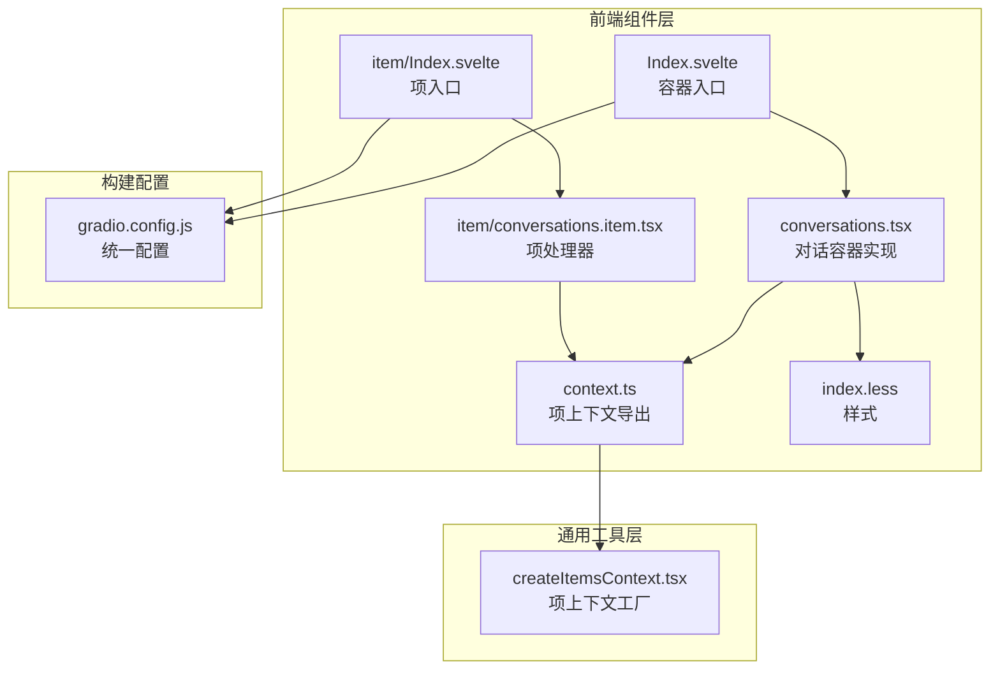
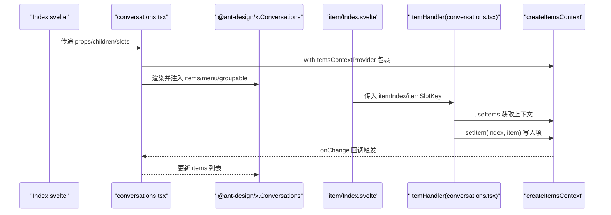
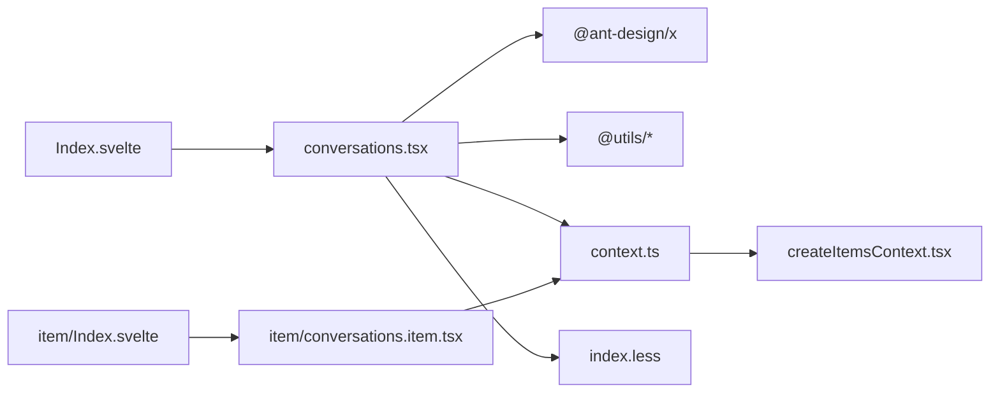

# Conversations 对话管理

<cite>
**本文引用的文件**
- [frontend/antdx/conversations/Index.svelte](file://frontend/antdx/conversations/Index.svelte)
- [frontend/antdx/conversations/conversations.tsx](file://frontend/antdx/conversations/conversations.tsx)
- [frontend/antdx/conversations/context.ts](file://frontend/antdx/conversations/context.ts)
- [frontend/antdx/conversations/item/Index.svelte](file://frontend/antdx/conversations/item/Index.svelte)
- [frontend/antdx/conversations/item/conversations.item.tsx](file://frontend/antdx/conversations/item/conversations.item.tsx)
- [frontend/utils/createItemsContext.tsx](file://frontend/utils/createItemsContext.tsx)
- [frontend/antdx/conversations/index.less](file://frontend/antdx/conversations/index.less)
- [frontend/antdx/conversations/gradio.config.js](file://frontend/antdx/conversations/gradio.config.js)
</cite>

## 目录

1. [简介](#简介)
2. [项目结构](#项目结构)
3. [核心组件](#核心组件)
4. [架构总览](#架构总览)
5. [详细组件分析](#详细组件分析)
6. [依赖关系分析](#依赖关系分析)
7. [性能考量](#性能考量)
8. [故障排查指南](#故障排查指南)
9. [结论](#结论)
10. [附录](#附录)

## 简介

本文件系统性阐述 Conversations 对话管理组件的设计与实现，覆盖以下方面：

- 对话列表管理：添加、删除、排序、状态管理
- Conversations.Item 对话项组件的渲染逻辑、交互行为、状态控制
- 组件上下文（Context）的作用与对话状态共享机制
- 属性配置、事件回调、样式定制与最佳实践
- 完整使用示例：基本用法、动态增删、状态同步

## 项目结构

Conversations 组件由“容器层 + 项处理器 + 上下文”三层构成，并通过 Gradio 配置桥接运行时环境。



图表来源

- [frontend/antdx/conversations/Index.svelte:1-71](file://frontend/antdx/conversations/Index.svelte#L1-L71)
- [frontend/antdx/conversations/conversations.tsx:1-178](file://frontend/antdx/conversations/conversations.tsx#L1-L178)
- [frontend/antdx/conversations/context.ts:1-7](file://frontend/antdx/conversations/context.ts#L1-L7)
- [frontend/antdx/conversations/item/Index.svelte:1-73](file://frontend/antdx/conversations/item/Index.svelte#L1-L73)
- [frontend/antdx/conversations/item/conversations.item.tsx:1-14](file://frontend/antdx/conversations/item/conversations.item.tsx#L1-L14)
- [frontend/utils/createItemsContext.tsx:1-274](file://frontend/utils/createItemsContext.tsx#L1-L274)
- [frontend/antdx/conversations/index.less:1-4](file://frontend/antdx/conversations/index.less#L1-L4)
- [frontend/antdx/conversations/gradio.config.js:1-4](file://frontend/antdx/conversations/gradio.config.js#L1-L4)

章节来源

- [frontend/antdx/conversations/Index.svelte:1-71](file://frontend/antdx/conversations/Index.svelte#L1-L71)
- [frontend/antdx/conversations/conversations.tsx:1-178](file://frontend/antdx/conversations/conversations.tsx#L1-L178)
- [frontend/antdx/conversations/context.ts:1-7](file://frontend/antdx/conversations/context.ts#L1-L7)
- [frontend/antdx/conversations/item/Index.svelte:1-73](file://frontend/antdx/conversations/item/Index.svelte#L1-L73)
- [frontend/antdx/conversations/item/conversations.item.tsx:1-14](file://frontend/antdx/conversations/item/conversations.item.tsx#L1-L14)
- [frontend/utils/createItemsContext.tsx:1-274](file://frontend/utils/createItemsContext.tsx#L1-L274)
- [frontend/antdx/conversations/index.less:1-4](file://frontend/antdx/conversations/index.less#L1-L4)
- [frontend/antdx/conversations/gradio.config.js:1-4](file://frontend/antdx/conversations/gradio.config.js#L1-L4)

## 核心组件

- Conversations 容器：负责接收 items、菜单配置、分组配置与插槽，最终渲染 antd-x 的 Conversations。
- Conversations.Item 项处理器：通过 ItemHandler 将 Svelte 插槽与 React 侧的项数据打通，支持动态收集子项、计算 props、克隆/透传插槽。
- 项上下文（Items Context）：提供 setItem、useItems、withItemsContextProvider 等能力，支撑对话项的声明式收集与变更通知。
- 样式与配置：统一类名前缀与样式表；通过 gradio.config.js 汇聚构建配置。

章节来源

- [frontend/antdx/conversations/conversations.tsx:59-175](file://frontend/antdx/conversations/conversations.tsx#L59-L175)
- [frontend/antdx/conversations/item/conversations.item.tsx:7-11](file://frontend/antdx/conversations/item/conversations.item.tsx#L7-L11)
- [frontend/antdx/conversations/context.ts:1-7](file://frontend/antdx/conversations/context.ts#L1-L7)
- [frontend/utils/createItemsContext.tsx:97-273](file://frontend/utils/createItemsContext.tsx#L97-L273)
- [frontend/antdx/conversations/index.less:1-4](file://frontend/antdx/conversations/index.less#L1-L4)
- [frontend/antdx/conversations/gradio.config.js:1-4](file://frontend/antdx/conversations/gradio.config.js#L1-L4)

## 架构总览

Conversations 的运行时架构如下：



图表来源

- [frontend/antdx/conversations/Index.svelte:57-70](file://frontend/antdx/conversations/Index.svelte#L57-L70)
- [frontend/antdx/conversations/conversations.tsx:68-175](file://frontend/antdx/conversations/conversations.tsx#L68-L175)
- [frontend/antdx/conversations/item/Index.svelte:54-72](file://frontend/antdx/conversations/item/Index.svelte#L54-L72)
- [frontend/antdx/conversations/item/conversations.item.tsx:9-11](file://frontend/antdx/conversations/item/conversations.item.tsx#L9-L11)
- [frontend/utils/createItemsContext.tsx:171-184](file://frontend/utils/createItemsContext.tsx#L171-L184)

## 详细组件分析

### Conversations 容器组件

- 职责
  - 解析容器级 props（visible、elem\_\*、额外属性），拼装到最终渲染参数
  - 处理菜单配置：支持字符串或对象形式；自动合并插槽与静态 items；对菜单事件进行包裹以透传当前对话项
  - 处理分组配置：支持 groupable.label 插槽与可折叠回调
  - 支持插槽：menu.trigger、menu.expandIcon、menu.overflowedIndicator、groupable.label
  - 将 items 从插槽或外部 props 解析为数组，交由 antd-x 渲染
- 关键点
  - 使用 useMemo 缓存 menu 与 resolvedItems，避免重复渲染
  - 通过 classNames 合并自定义类名，保证项元素具备统一类名前缀
  - 通过 renderItems 与 renderParamsSlot 统一处理插槽与参数化渲染

章节来源

- [frontend/antdx/conversations/conversations.tsx:28-57](file://frontend/antdx/conversations/conversations.tsx#L28-L57)
- [frontend/antdx/conversations/conversations.tsx:72-175](file://frontend/antdx/conversations/conversations.tsx#L72-L175)

### Conversations.Item 项处理器

- 职责
  - 将 Svelte 插槽与 React 侧的项数据打通
  - 通过 ItemHandler 注入 itemIndex、itemSlotKey、slots 等信息
  - 支持 itemProps、itemChildren、allowedSlots 等扩展能力
- 渲染流程
  - 在 useEffect 中根据 props、slots、子项上下文生成项值
  - 通过 setItem 写入上下文，驱动容器更新
  - 子树再次被包裹于 ItemsContextProvider，形成递归收集

章节来源

- [frontend/antdx/conversations/item/conversations.item.tsx:7-11](file://frontend/antdx/conversations/item/conversations.item.tsx#L7-L11)
- [frontend/utils/createItemsContext.tsx:190-261](file://frontend/utils/createItemsContext.tsx#L190-L261)

### 项上下文（Items Context）

- 设计要点
  - 提供 withItemsContextProvider、useItems、ItemHandler 三件套
  - setItem 支持显式 slotKey 与默认 default slot，内部深拷贝避免意外修改
  - onChange 回调在 items 变更时触发，便于上层感知
  - ItemHandler 内部 memo 化 props 与 children，减少重渲染
- 数据结构
  - items：按 slotKey 分组的项数组
  - setItem：写入指定索引的项
  - initial：标记初始状态，用于首次渲染优化

章节来源

- [frontend/antdx/conversations/context.ts:1-7](file://frontend/antdx/conversations/context.ts#L1-L7)
- [frontend/utils/createItemsContext.tsx:97-273](file://frontend/utils/createItemsContext.tsx#L97-L273)

### Svelte 入口与属性透传

- Index.svelte
  - 延迟加载容器组件，避免首屏阻塞
  - 仅在 visible 为真时渲染
  - 透传 elem\_\*、additionalProps、slots 等到 React 容器
- item/Index.svelte
  - 透传 itemIndex、itemSlotKey 等到项处理器
  - 保持可见性控制与样式类名

章节来源

- [frontend/antdx/conversations/Index.svelte:57-70](file://frontend/antdx/conversations/Index.svelte#L57-L70)
- [frontend/antdx/conversations/item/Index.svelte:54-72](file://frontend/antdx/conversations/item/Index.svelte#L54-L72)

### 类图：组件与上下文关系

```mermaid
classDiagram
class ConversationsContainer {
+props : "items, menu, groupable, classNames"
+slots : "menu.trigger, menu.expandIcon, menu.overflowedIndicator, groupable.label"
+render() : "XConversations"
}
class ConversationsItemHandler {
+props : "itemIndex, itemSlotKey, slots, itemProps, itemChildren"
+setItem() : "写入上下文"
+render() : "子项上下文Provider"
}
class ItemsContext {
+items : "{[slotKey] : Item[]}"
+setItem(slotKey, index, item)
+useItems() : "获取items/setItem"
}
ConversationsContainer --> ItemsContext : "消费/订阅"
ConversationsItemHandler --> ItemsContext : "写入项"
ConversationsContainer --> ConversationsItemHandler : "渲染项"
```

图表来源

- [frontend/antdx/conversations/conversations.tsx:68-175](file://frontend/antdx/conversations/conversations.tsx#L68-L175)
- [frontend/antdx/conversations/item/conversations.item.tsx:9-11](file://frontend/antdx/conversations/item/conversations.item.tsx#L9-L11)
- [frontend/utils/createItemsContext.tsx:102-170](file://frontend/utils/createItemsContext.tsx#L102-L170)

## 依赖关系分析

- 容器依赖
  - @ant-design/x：实际渲染对话列表与菜单
  - @utils/\*：渲染工具（renderItems、renderParamsSlot）、函数包装（useFunction）
  - 本地 context：与 antd menu 的 ItemsContext 协作，复用菜单插槽体系
- 项处理器依赖
  - createItemsContext：提供 setItem/useItems/ItemHandler
- 样式与构建
  - index.less：统一类名前缀
  - gradio.config.js：统一构建配置



图表来源

- [frontend/antdx/conversations/conversations.tsx:1-26](file://frontend/antdx/conversations/conversations.tsx#L1-L26)
- [frontend/antdx/conversations/context.ts:1-7](file://frontend/antdx/conversations/context.ts#L1-L7)
- [frontend/antdx/conversations/item/conversations.item.tsx:1-14](file://frontend/antdx/conversations/item/conversations.item.tsx#L1-L14)
- [frontend/utils/createItemsContext.tsx:1-274](file://frontend/utils/createItemsContext.tsx#L1-L274)
- [frontend/antdx/conversations/index.less:1-4](file://frontend/antdx/conversations/index.less#L1-L4)
- [frontend/antdx/conversations/Index.svelte:1-71](file://frontend/antdx/conversations/Index.svelte#L1-L71)
- [frontend/antdx/conversations/item/Index.svelte:1-73](file://frontend/antdx/conversations/item/Index.svelte#L1-L73)

章节来源

- [frontend/antdx/conversations/conversations.tsx:1-26](file://frontend/antdx/conversations/conversations.tsx#L1-L26)
- [frontend/antdx/conversations/context.ts:1-7](file://frontend/antdx/conversations/context.ts#L1-L7)
- [frontend/antdx/conversations/item/conversations.item.tsx:1-14](file://frontend/antdx/conversations/item/conversations.item.tsx#L1-L14)
- [frontend/utils/createItemsContext.tsx:1-274](file://frontend/utils/createItemsContext.tsx#L1-L274)
- [frontend/antdx/conversations/index.less:1-4](file://frontend/antdx/conversations/index.less#L1-L4)
- [frontend/antdx/conversations/Index.svelte:1-71](file://frontend/antdx/conversations/Index.svelte#L1-L71)
- [frontend/antdx/conversations/item/Index.svelte:1-73](file://frontend/antdx/conversations/item/Index.svelte#L1-L73)

## 性能考量

- 渲染缓存
  - 使用 useMemo 缓存 menu 与 resolvedItems，避免不必要的重渲染
- 事件包裹
  - 菜单事件通过 patchMenuEvents 包裹，确保点击冒泡被阻止且原事件仍可访问当前对话项
- 上下文写入
  - setItem 采用浅拷贝数组并在必要时替换索引位置，避免深层不可变导致的昂贵操作
- 插槽渲染
  - renderItems 与 renderParamsSlot 支持 clone 与 withParams，减少重复创建 DOM

章节来源

- [frontend/antdx/conversations/conversations.tsx:83-122](file://frontend/antdx/conversations/conversations.tsx#L83-L122)
- [frontend/antdx/conversations/conversations.tsx:35-57](file://frontend/antdx/conversations/conversations.tsx#L35-L57)
- [frontend/utils/createItemsContext.tsx:124-153](file://frontend/utils/createItemsContext.tsx#L124-L153)

## 故障排查指南

- 问题：菜单项不显示
  - 检查是否提供 menu.items 或通过插槽注入菜单项
  - 确认 menu.trigger、menu.expandIcon、menu.overflowedIndicator 插槽是否正确传入
- 问题：对话项未生效
  - 确保 Conversations.Item 正确包裹在 Conversations 内部
  - 检查 itemIndex 与 itemSlotKey 是否正确传递
- 问题：分组标签不显示
  - 确认 groupable.label 插槽或配置已提供
- 问题：样式异常
  - 检查是否应用了统一类名前缀 ms-gr-antdx-conversations 与 ms-gr-antdx-conversations-item
- 问题：事件未触发或冒泡异常
  - 确认菜单事件是否通过 onClick 包裹，确保 domEvent.stopPropagation 已生效

章节来源

- [frontend/antdx/conversations/conversations.tsx:95-121](file://frontend/antdx/conversations/conversations.tsx#L95-L121)
- [frontend/antdx/conversations/conversations.tsx:153-168](file://frontend/antdx/conversations/conversations.tsx#L153-L168)
- [frontend/antdx/conversations/index.less:1-4](file://frontend/antdx/conversations/index.less#L1-L4)

## 结论

Conversations 通过“容器 + 项处理器 + 上下文”的组合，实现了对话列表的声明式管理与高效渲染。其设计强调：

- 明确的职责分离：容器负责布局与配置，项处理器负责数据收集与渲染
- 强大的插槽与事件系统：菜单、分组、触发器均可灵活定制
- 高性能的缓存与变更通知：减少重渲染，提升交互流畅度

## 附录

### 使用示例与最佳实践

- 基本用法
  - 在 Conversations 下放置多个 Conversations.Item，每个项通过 itemIndex 标识顺序
  - 通过插槽提供菜单项与分组标签
- 动态增删
  - 通过 setItem 动态写入或删除某索引处的项，容器会自动响应
  - 删除后建议同步调整后续项的 itemIndex，避免索引错位
- 状态同步
  - 使用 onChange 订阅 items 变化，实现与外部状态的双向绑定
- 样式定制
  - 通过 classNames.item 自定义项样式，或覆盖 index.less 中的类名前缀
- 事件回调
  - 菜单事件通过 onClick 包裹，确保可访问当前对话项与原始事件

章节来源

- [frontend/antdx/conversations/conversations.tsx:139-171](file://frontend/antdx/conversations/conversations.tsx#L139-L171)
- [frontend/antdx/conversations/item/Index.svelte:66-67](file://frontend/antdx/conversations/item/Index.svelte#L66-L67)
- [frontend/utils/createItemsContext.tsx:154-156](file://frontend/utils/createItemsContext.tsx#L154-L156)
