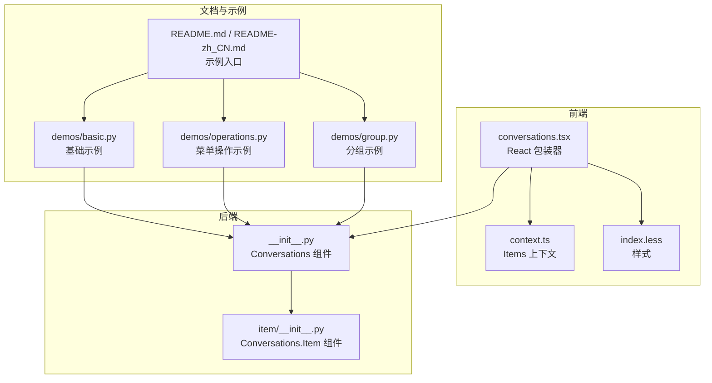
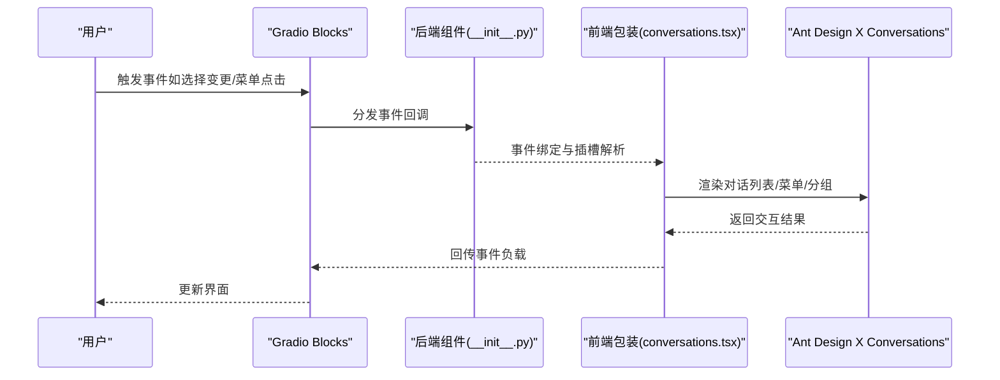
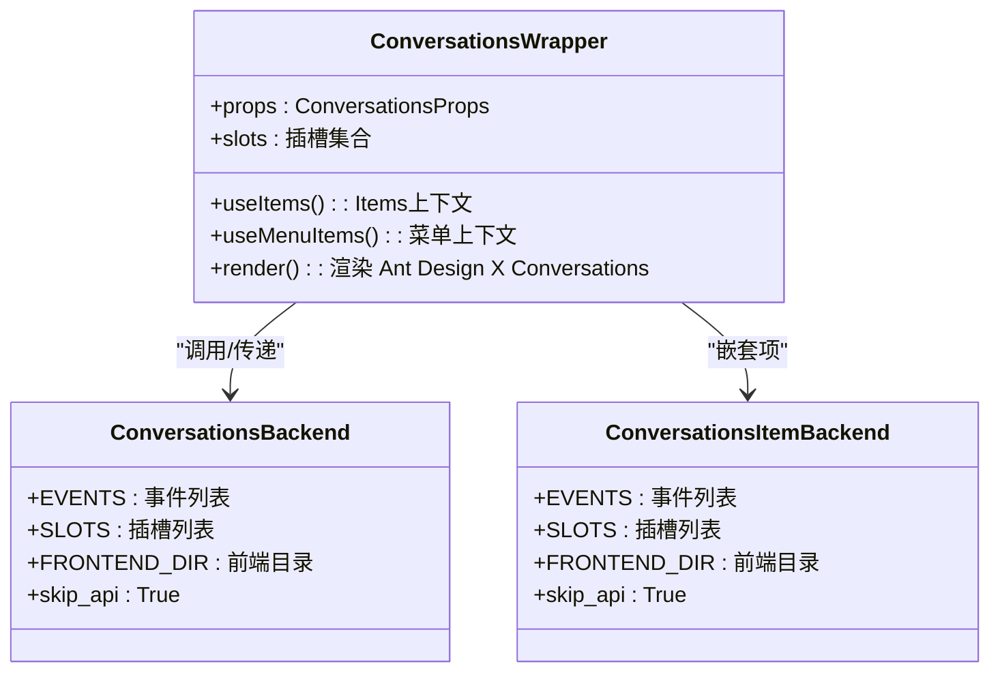

# 使用示例

<cite>
**本文引用的文件**
- [conversations.tsx](file://frontend/antdx/conversations/conversations.tsx)
- [context.ts](file://frontend/antdx/conversations/context.ts)
- [index.less](file://frontend/antdx/conversations/index.less)
- [__init__.py](file://backend/modelscope_studio/components/antdx/conversations/__init__.py)
- [item/__init__.py](file://backend/modelscope_studio/components/antdx/conversations/item/__init__.py)
- [README.md](file://docs/components/antdx/conversations/README.md)
- [README-zh_CN.md](file://docs/components/antdx/conversations/README-zh_CN.md)
- [demos/basic.py](file://docs/components/antdx/conversations/demos/basic.py)
- [demos/operations.py](file://docs/components/antdx/conversations/demos/operations.py)
- [demos/group.py](file://docs/components/antdx/conversations/demos/group.py)
</cite>

## 目录

1. [简介](#简介)
2. [项目结构](#项目结构)
3. [核心组件](#核心组件)
4. [架构总览](#架构总览)
5. [详细组件分析](#详细组件分析)
6. [依赖关系分析](#依赖关系分析)
7. [性能考虑](#性能考虑)
8. [故障排查指南](#故障排查指南)
9. [结论](#结论)
10. [附录](#附录)

## 简介

本文件围绕 Conversations 组件提供从基础到高级的完整使用示例，涵盖：

- 基础对话列表创建与默认选中项设置
- 对话分组显示与可折叠配置
- 对话项菜单操作（添加、删除、重命名）
- 对话状态管理（选中项变更、菜单点击事件）
- 与 Gradio 应用集成的实际案例（聊天应用、任务管理应用等场景）

所有示例均基于仓库中的真实实现与演示脚本，确保可直接运行与复用。

## 项目结构

Conversations 组件由前端 Svelte 包装层与后端 Gradio 组件两部分组成：

- 前端：通过 React 包装器桥接 Ant Design X 的 Conversations，并提供上下文与插槽能力
- 后端：Gradio 组件封装，暴露事件与插槽，支持在 Blocks 中直接使用

图表来源

- [conversations.tsx:1-178](file://frontend/antdx/conversations/conversations.tsx#L1-L178)
- [context.ts:1-7](file://frontend/antdx/conversations/context.ts#L1-L7)
- [index.less:1-4](file://frontend/antdx/conversations/index.less#L1-L4)
- [**init**.py:1-109](file://backend/modelscope_studio/components/antdx/conversations/__init__.py#L1-L109)
- [item/**init**.py:1-75](file://backend/modelscope_studio/components/antdx/conversations/item/__init__.py#L1-L75)
- [README.md:1-10](file://docs/components/antdx/conversations/README.md#L1-L10)
- [README-zh_CN.md:1-10](file://docs/components/antdx/conversations/README-zh_CN.md#L1-L10)
- [demos/basic.py:1-50](file://docs/components/antdx/conversations/demos/basic.py#L1-L50)
- [demos/operations.py:1-47](file://docs/components/antdx/conversations/demos/operations.py#L1-L47)
- [demos/group.py:1-31](file://docs/components/antdx/conversations/demos/group.py#L1-L31)

章节来源

- [README.md:1-10](file://docs/components/antdx/conversations/README.md#L1-L10)
- [README-zh_CN.md:1-10](file://docs/components/antdx/conversations/README-zh_CN.md#L1-L10)

## 核心组件

- 前端包装器：负责将 Ant Design X 的 Conversations 能力以 Gradio 可用的方式呈现，支持菜单插槽、分组标签插槽、事件透传与样式扩展
- 后端组件：定义事件、插槽、属性与渲染行为，适配 Gradio Blocks 的数据流
- 插槽系统：支持菜单项、触发器、溢出指示器、图标、标签等自定义内容注入

章节来源

- [conversations.tsx:1-178](file://frontend/antdx/conversations/conversations.tsx#L1-L178)
- [**init**.py:11-109](file://backend/modelscope_studio/components/antdx/conversations/__init__.py#L11-L109)
- [item/**init**.py:8-75](file://backend/modelscope_studio/components/antdx/conversations/item/__init__.py#L8-L75)

## 架构总览

前端包装器通过上下文与插槽机制，将 Ant Design X 的 Conversations 与 Gradio 组件桥接起来；后端组件负责事件绑定与插槽声明，最终在 Blocks 中以声明式方式组合使用。

图表来源

- [**init**.py:18-41](file://backend/modelscope_studio/components/antdx/conversations/__init__.py#L18-L41)
- [conversations.tsx:59-175](file://frontend/antdx/conversations/conversations.tsx#L59-L175)

## 详细组件分析

### 基础对话列表

- 功能要点
  - 通过 items 属性直接传入对话项数组
  - 设置 default_active_key 指定初始选中项
  - 支持禁用项（disabled）
- 运行效果
  - 列表按顺序渲染，初始高亮指定项
  - 选中项变化时触发 active_change 事件
- 示例参考
  - [demos/basic.py:11-46](file://docs/components/antdx/conversations/demos/basic.py#L11-L46)

章节来源

- [demos/basic.py:11-46](file://docs/components/antdx/conversations/demos/basic.py#L11-L46)
- [**init**.py:49-90](file://backend/modelscope_studio/components/antdx/conversations/__init__.py#L49-L90)

### 自定义对话项与图标

- 功能要点
  - 使用 Conversations.Item 定义项
  - 通过 Slot 注入 label 与 icon 内容
  - 结合 Typography 与 Icon 实现富文本与图标
- 运行效果
  - 每个对话项显示自定义标签与图标
- 示例参考
  - [demos/basic.py:32-44](file://docs/components/antdx/conversations/demos/basic.py#L32-L44)

章节来源

- [demos/basic.py:32-44](file://docs/components/antdx/conversations/demos/basic.py#L32-L44)
- [item/**init**.py:21-55](file://backend/modelscope_studio/components/antdx/conversations/item/__init__.py#L21-L55)

### 菜单操作（添加、删除、重命名）

- 功能要点
  - 通过 Slot 注入菜单项（menu.items），支持图标、禁用、危险样式
  - 事件回调 menu_click 获取当前点击项与菜单信息
- 运行效果
  - 右侧触发器打开菜单，点击菜单项触发回调
- 示例参考
  - [demos/operations.py:29-43](file://docs/components/antdx/conversations/demos/operations.py#L29-L43)

章节来源

- [demos/operations.py:29-43](file://docs/components/antdx/conversations/demos/operations.py#L29-L43)
- [**init**.py:18-41](file://backend/modelscope_studio/components/antdx/conversations/__init__.py#L18-L41)

### 对话分组显示与可折叠

- 功能要点
  - 通过 groupable=True 开启分组
  - 每个对话项设置 group 字段进行分组
  - 支持分组标签插槽与可折叠函数
- 运行效果
  - 相同 group 的项被归为一组，支持展开/折叠
- 示例参考
  - [demos/group.py:8-27](file://docs/components/antdx/conversations/demos/group.py#L8-L27)

章节来源

- [demos/group.py:8-27](file://docs/components/antdx/conversations/demos/group.py#L8-L27)
- [**init**.py:49-90](file://backend/modelscope_studio/components/antdx/conversations/__init__.py#L49-L90)

### 事件与状态管理

- 关键事件
  - active_change：选中项变更
  - menu_click/menu_select/menu_deselect/menu_open_change：菜单交互
  - groupable_expand：分组展开/收起
  - creation_click：创建按钮点击
- 使用建议
  - 在回调中读取事件负载，更新应用状态或发起后续请求
- 示例参考
  - [demos/basic.py:7-8](file://docs/components/antdx/conversations/demos/basic.py#L7-L8)
  - [demos/operations.py:7-8](file://docs/components/antdx/conversations/demos/operations.py#L7-L8)

章节来源

- [**init**.py:18-41](file://backend/modelscope_studio/components/antdx/conversations/__init__.py#L18-L41)
- [demos/basic.py:7-8](file://docs/components/antdx/conversations/demos/basic.py#L7-L8)
- [demos/operations.py:7-8](file://docs/components/antdx/conversations/demos/operations.py#L7-L8)

### 插槽与样式定制

- 支持的插槽
  - menu.items、menu.trigger、menu.expandIcon、menu.overflowedIndicator
  - groupable.label
  - creation.icon、creation.label
  - item 的 label、icon
- 样式
  - 默认样式类名与自定义类名合并
- 示例参考
  - [conversations.tsx:68-175](file://frontend/antdx/conversations/conversations.tsx#L68-L175)
  - [index.less:1-4](file://frontend/antdx/conversations/index.less#L1-L4)

章节来源

- [conversations.tsx:68-175](file://frontend/antdx/conversations/conversations.tsx#L68-L175)
- [index.less:1-4](file://frontend/antdx/conversations/index.less#L1-L4)

### 与 Gradio 应用集成（聊天应用）

- 场景描述
  - 使用 Conversations 列表承载历史会话，结合 Chatbot 组件实现对话展示与输入
- 实现思路
  - 将 Conversations 的选中项作为 Chatbot 的会话标识
  - 通过 active_change 事件加载对应会话消息
  - 通过菜单操作实现“新建”、“删除”、“重命名”等动作
- 示例参考
  - [demos/basic.py:11-46](file://docs/components/antdx/conversations/demos/basic.py#L11-L46)
  - [demos/operations.py:11-43](file://docs/components/antdx/conversations/demos/operations.py#L11-L43)

章节来源

- [demos/basic.py:11-46](file://docs/components/antdx/conversations/demos/basic.py#L11-L46)
- [demos/operations.py:11-43](file://docs/components/antdx/conversations/demos/operations.py#L11-L43)

### 与 Gradio 应用集成（任务管理应用）

- 场景描述
  - 将对话项映射为任务条目，分组表示不同优先级或状态
- 实现思路
  - group 字段用于分组（如“进行中/已完成”）
  - 菜单操作实现任务编辑、删除、状态切换
  - 通过 active_change 事件联动任务详情面板
- 示例参考
  - [demos/group.py:8-27](file://docs/components/antdx/conversations/demos/group.py#L8-L27)

章节来源

- [demos/group.py:8-27](file://docs/components/antdx/conversations/demos/group.py#L8-L27)

## 依赖关系分析

前端包装器与后端组件之间的依赖关系如下：

图表来源

- [conversations.tsx:59-175](file://frontend/antdx/conversations/conversations.tsx#L59-L175)
- [**init**.py:11-109](file://backend/modelscope_studio/components/antdx/conversations/__init__.py#L11-L109)
- [item/**init**.py:8-75](file://backend/modelscope_studio/components/antdx/conversations/item/__init__.py#L8-L75)

章节来源

- [conversations.tsx:59-175](file://frontend/antdx/conversations/conversations.tsx#L59-L175)
- [**init**.py:11-109](file://backend/modelscope_studio/components/antdx/conversations/__init__.py#L11-L109)
- [item/**init**.py:8-75](file://backend/modelscope_studio/components/antdx/conversations/item/__init__.py#L8-L75)

## 性能考虑

- 列表渲染优化
  - 使用 useMemo 缓存菜单与分组配置，避免重复计算
  - 仅在 items 或插槽变化时重新解析渲染
- 事件处理
  - 通过 useFunction 包装函数型 props，减少不必要的重渲染
- 样式与插槽
  - 合理使用 classNames 合并类名，避免过度 DOM 操作
- 大列表场景
  - 建议分页或虚拟化策略（若 Ant Design X 提供）以降低内存占用

章节来源

- [conversations.tsx:83-137](file://frontend/antdx/conversations/conversations.tsx#L83-L137)

## 故障排查指南

- 无法显示菜单
  - 检查是否正确注入 menu.items 插槽，或是否传入了有效的 menu 配置
  - 确认菜单项的 key 与 label 是否正确
- 事件未触发
  - 确认已为组件绑定相应事件（如 menu_click、active_change）
  - 检查事件回调函数是否正确接收并处理事件负载
- 分组不生效
  - 确认 groupable 是否开启，且每个项的 group 字段一致
- 插槽内容未渲染
  - 确认插槽名称拼写正确（如 menu.trigger、groupable.label）

章节来源

- [**init**.py:44-47](file://backend/modelscope_studio/components/antdx/conversations/__init__.py#L44-L47)
- [demos/operations.py:29-43](file://docs/components/antdx/conversations/demos/operations.py#L29-L43)
- [demos/group.py:8-27](file://docs/components/antdx/conversations/demos/group.py#L8-L27)

## 结论

Conversations 组件提供了在 Gradio 中管理与查看对话列表的完整能力，配合菜单插槽、事件系统与分组功能，能够覆盖聊天应用、任务管理等多种场景。通过本文示例与最佳实践，开发者可以快速搭建具备良好交互体验的应用界面。

## 附录

- 示例入口
  - [README.md:5-9](file://docs/components/antdx/conversations/README.md#L5-L9)
  - [README-zh_CN.md:5-9](file://docs/components/antdx/conversations/README-zh_CN.md#L5-L9)
- 相关文件
  - [conversations.tsx:1-178](file://frontend/antdx/conversations/conversations.tsx#L1-L178)
  - [context.ts:1-7](file://frontend/antdx/conversations/context.ts#L1-L7)
  - [index.less:1-4](file://frontend/antdx/conversations/index.less#L1-L4)
  - [**init**.py:1-109](file://backend/modelscope_studio/components/antdx/conversations/__init__.py#L1-L109)
  - [item/**init**.py:1-75](file://backend/modelscope_studio/components/antdx/conversations/item/__init__.py#L1-L75)
  - [demos/basic.py:1-50](file://docs/components/antdx/conversations/demos/basic.py#L1-L50)
  - [demos/operations.py:1-47](file://docs/components/antdx/conversations/demos/operations.py#L1-L47)
  - [demos/group.py:1-31](file://docs/components/antdx/conversations/demos/group.py#L1-L31)
