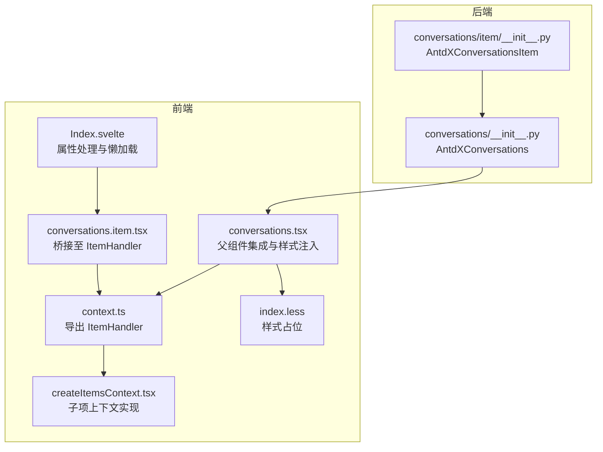
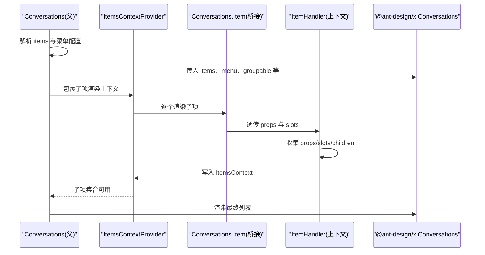
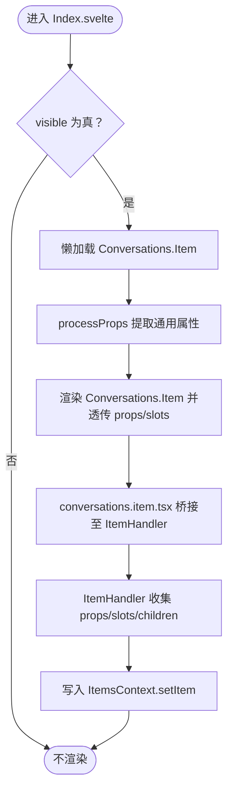
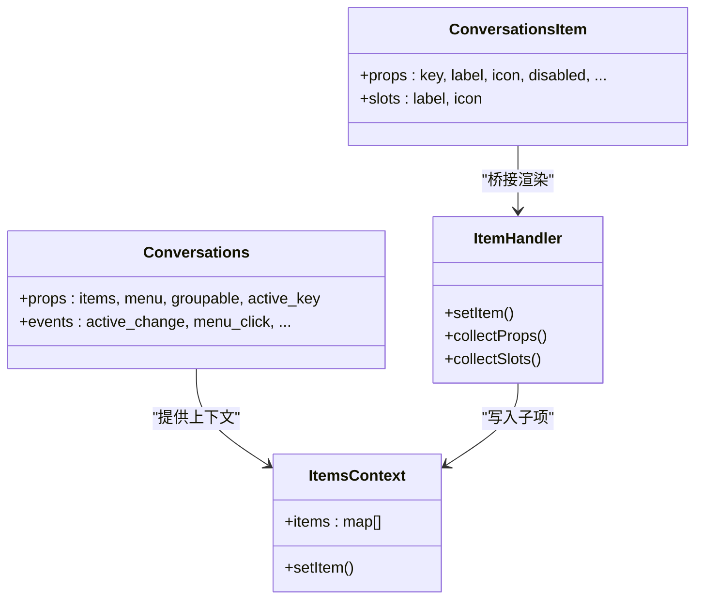
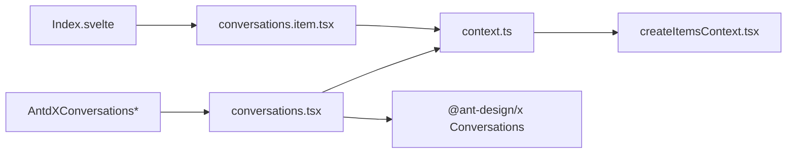

# 对话项组件

<cite>
**本文引用的文件**
- [frontend/antdx/conversations/item/conversations.item.tsx](file://frontend/antdx/conversations/item/conversations.item.tsx)
- [frontend/antdx/conversations/item/Index.svelte](file://frontend/antdx/conversations/item/Index.svelte)
- [frontend/antdx/conversations/context.ts](file://frontend/antdx/conversations/context.ts)
- [frontend/antdx/conversations/conversations.tsx](file://frontend/antdx/conversations/conversations.tsx)
- [frontend/antdx/conversations/index.less](file://frontend/antdx/conversations/index.less)
- [frontend/utils/createItemsContext.tsx](file://frontend/utils/createItemsContext.tsx)
- [backend/modelscope_studio/components/antdx/conversations/__init__.py](file://backend/modelscope_studio/components/antdx/conversations/__init__.py)
- [backend/modelscope_studio/components/antdx/conversations/item/__init__.py](file://backend/modelscope_studio/components/antdx/conversations/item/__init__.py)
- [docs/components/antdx/conversations/demos/basic.py](file://docs/components/antdx/conversations/demos/basic.py)
- [docs/components/antdx/conversations/demos/operations.py](file://docs/components/antdx/conversations/demos/operations.py)
</cite>

## 目录

1. [简介](#简介)
2. [项目结构](#项目结构)
3. [核心组件](#核心组件)
4. [架构总览](#架构总览)
5. [详细组件分析](#详细组件分析)
6. [依赖关系分析](#依赖关系分析)
7. [性能考虑](#性能考虑)
8. [故障排查指南](#故障排查指南)
9. [结论](#结论)
10. [附录](#附录)

## 简介

本文件聚焦于 Conversations.Item 对话项组件的实现与使用，涵盖其数据结构、渲染逻辑、交互行为、状态管理（激活、选中、右键菜单等），并提供多种配置示例与父组件 Conversations 的通信机制及数据绑定方式说明。目标是帮助开发者快速理解并正确使用该组件。

## 项目结构

Conversations.Item 属于 antdx 前端组件体系中的子项，由后端 Python 组件包装并在前端以 Svelte + React 混合模式渲染。其核心文件分布如下：

- 前端入口与桥接：Index.svelte 负责属性处理与懒加载；conversations.item.tsx 将 React 组件桥接到 Svelte。
- 上下文与子项收集：context.ts 导出 ItemHandler，并通过 createItemsContext.tsx 提供统一的“子项上下文”能力。
- 父组件集成：conversations.tsx 负责将 items 与菜单等配置传递给 @ant-design/x 的 Conversations，并注入样式与事件。
- 后端封装：backend 中的 Conversations 与 Conversations.Item 作为 Gradio 组件，负责声明事件、插槽与渲染桥接。

图表来源

- [frontend/antdx/conversations/item/Index.svelte:1-73](file://frontend/antdx/conversations/item/Index.svelte#L1-L73)
- [frontend/antdx/conversations/item/conversations.item.tsx:1-14](file://frontend/antdx/conversations/item/conversations.item.tsx#L1-L14)
- [frontend/antdx/conversations/context.ts:1-7](file://frontend/antdx/conversations/context.ts#L1-L7)
- [frontend/utils/createItemsContext.tsx:1-274](file://frontend/utils/createItemsContext.tsx#L1-L274)
- [frontend/antdx/conversations/conversations.tsx:1-178](file://frontend/antdx/conversations/conversations.tsx#L1-L178)
- [frontend/antdx/conversations/index.less:1-4](file://frontend/antdx/conversations/index.less#L1-L4)
- [backend/modelscope_studio/components/antdx/conversations/**init**.py:1-109](file://backend/modelscope_studio/components/antdx/conversations/__init__.py#L1-L109)
- [backend/modelscope_studio/components/antdx/conversations/item/**init**.py:1-75](file://backend/modelscope_studio/components/antdx/conversations/item/__init__.py#L1-L75)

章节来源

- [frontend/antdx/conversations/item/Index.svelte:1-73](file://frontend/antdx/conversations/item/Index.svelte#L1-L73)
- [frontend/antdx/conversations/item/conversations.item.tsx:1-14](file://frontend/antdx/conversations/item/conversations.item.tsx#L1-L14)
- [frontend/antdx/conversations/context.ts:1-7](file://frontend/antdx/conversations/context.ts#L1-L7)
- [frontend/utils/createItemsContext.tsx:1-274](file://frontend/utils/createItemsContext.tsx#L1-L274)
- [frontend/antdx/conversations/conversations.tsx:1-178](file://frontend/antdx/conversations/conversations.tsx#L1-L178)
- [frontend/antdx/conversations/index.less:1-4](file://frontend/antdx/conversations/index.less#L1-L4)
- [backend/modelscope_studio/components/antdx/conversations/**init**.py:1-109](file://backend/modelscope_studio/components/antdx/conversations/__init__.py#L1-L109)
- [backend/modelscope_studio/components/antdx/conversations/item/**init**.py:1-75](file://backend/modelscope_studio/components/antdx/conversations/item/__init__.py#L1-L75)

## 核心组件

- Conversations.Item（前端桥接）：将 React 版本的 ItemHandler 注入到 Svelte 环境，负责把属性与插槽透传给 ItemHandler。
- ItemHandler（上下文子项处理器）：从 createItemsContext.tsx 导出，负责收集子项数据、处理 props 与 slots、维护子项树，并写入父级 ItemsContext。
- Conversations（父组件）：负责将 items、菜单、分组等配置传递给 @ant-design/x 的 Conversations，并注入样式类名与事件。
- 后端组件：AntdXConversations 与 AntdXConversationsItem 作为 Gradio 组件，声明事件、插槽与渲染桥接。

章节来源

- [frontend/antdx/conversations/item/conversations.item.tsx:1-14](file://frontend/antdx/conversations/item/conversations.item.tsx#L1-L14)
- [frontend/antdx/conversations/context.ts:1-7](file://frontend/antdx/conversations/context.ts#L1-L7)
- [frontend/utils/createItemsContext.tsx:190-261](file://frontend/utils/createItemsContext.tsx#L190-L261)
- [frontend/antdx/conversations/conversations.tsx:59-175](file://frontend/antdx/conversations/conversations.tsx#L59-L175)
- [backend/modelscope_studio/components/antdx/conversations/**init**.py:11-47](file://backend/modelscope_studio/components/antdx/conversations/__init__.py#L11-L47)
- [backend/modelscope_studio/components/antdx/conversations/item/**init**.py:8-20](file://backend/modelscope_studio/components/antdx/conversations/item/__init__.py#L8-L20)

## 架构总览

下图展示了从父组件到子项的调用链路与数据流：

图表来源

- [frontend/antdx/conversations/conversations.tsx:68-175](file://frontend/antdx/conversations/conversations.tsx#L68-L175)
- [frontend/antdx/conversations/item/conversations.item.tsx:7-11](file://frontend/antdx/conversations/item/conversations.item.tsx#L7-L11)
- [frontend/antdx/conversations/context.ts:3-4](file://frontend/antdx/conversations/context.ts#L3-L4)
- [frontend/utils/createItemsContext.tsx:171-184](file://frontend/utils/createItemsContext.tsx#L171-L184)
- [frontend/utils/createItemsContext.tsx:190-261](file://frontend/utils/createItemsContext.tsx#L190-L261)

## 详细组件分析

### 数据结构与状态

- 子项数据模型（来自上下文）：
  - props：子项的属性对象
  - slots：具名插槽映射（如 label、icon）
  - el：DOM 元素引用（可选）
  - ctx：上下文参数（包含 forceClone 等）
  - itemChildrenKey：默认 children，支持自定义键
- 状态来源：
  - 激活/选中：由父组件 Conversations 控制，通过 active_key/default_active_key 驱动
  - 右键菜单：由父组件注入的 menu 配置决定，支持触发器、展开图标、溢出指示器等
  - 分组与折叠：groupable 配置控制分组标题与可折叠行为
  - 禁用/禁用态：disabled 字段影响交互与视觉

章节来源

- [frontend/utils/createItemsContext.tsx:20-48](file://frontend/utils/createItemsContext.tsx#L20-L48)
- [frontend/antdx/conversations/conversations.tsx:77-168](file://frontend/antdx/conversations/conversations.tsx#L77-L168)
- [backend/modelscope_studio/components/antdx/conversations/item/**init**.py:21-55](file://backend/modelscope_studio/components/antdx/conversations/item/__init__.py#L21-L55)

### 渲染逻辑

- Index.svelte
  - 使用 importComponent 懒加载 Conversations.Item
  - processProps 提取 visible、_internal.index、as_item、elem_\* 等通用属性
  - 条件渲染：仅当 visible 为真时渲染
  - 透传 restProps、additionalProps、slots、itemIndex、itemSlotKey
- conversations.item.tsx
  - 将 props 透传给 ItemHandler，实现 React 到 Svelte 的桥接
- ItemHandler（createItemsContext.tsx）
  - 在 useEffect 中根据 props/slots/children 构造子项值
  - 通过 setItem 将当前子项写入 ItemsContext，触发父级更新
  - 支持 itemProps 与 itemChildren 的动态计算

图表来源

- [frontend/antdx/conversations/item/Index.svelte:13-72](file://frontend/antdx/conversations/item/Index.svelte#L13-L72)
- [frontend/antdx/conversations/item/conversations.item.tsx:7-11](file://frontend/antdx/conversations/item/conversations.item.tsx#L7-L11)
- [frontend/utils/createItemsContext.tsx:190-261](file://frontend/utils/createItemsContext.tsx#L190-L261)

章节来源

- [frontend/antdx/conversations/item/Index.svelte:1-73](file://frontend/antdx/conversations/item/Index.svelte#L1-L73)
- [frontend/antdx/conversations/item/conversations.item.tsx:1-14](file://frontend/antdx/conversations/item/conversations.item.tsx#L1-L14)
- [frontend/utils/createItemsContext.tsx:190-261](file://frontend/utils/createItemsContext.tsx#L190-L261)

### 交互行为与事件

- 选择变更：父组件通过 active_change 事件回调通知当前激活项变化
- 菜单交互：menu_click、menu_select、menu_deselect、menu_open_change 等事件由父组件绑定
- 分组扩展：groupable_expand 事件用于分组展开/收起
- 创建按钮：creation_click 事件用于“新建”按钮点击
- 右键菜单：通过父组件的 menu 配置注入，支持触发器、展开图标、溢出指示器等插槽

章节来源

- [backend/modelscope_studio/components/antdx/conversations/**init**.py:18-41](file://backend/modelscope_studio/components/antdx/conversations/__init__.py#L18-L41)
- [frontend/antdx/conversations/conversations.tsx:35-57](file://frontend/antdx/conversations/conversations.tsx#L35-L57)

### 状态管理

- 激活状态（激活/选中）
  - 由父组件 Conversations 的 active_key/default_active_key 控制
  - 子项本身不直接维护激活状态，而是由父组件统一管理
- 选中状态（菜单选中）
  - 通过 menu_select/menu_deselect 事件与父组件联动
- 右键菜单状态
  - 由父组件注入的 menu 配置决定是否显示菜单、如何触发
  - 菜单项的 disabled、danger 等状态由父组件统一处理
- 分组状态
  - groupable.label/groupable.collapsible 由父组件注入，支持插槽与函数式配置

章节来源

- [frontend/antdx/conversations/conversations.tsx:77-168](file://frontend/antdx/conversations/conversations.tsx#L77-L168)
- [backend/modelscope_studio/components/antdx/conversations/**init**.py:44-47](file://backend/modelscope_studio/components/antdx/conversations/__init__.py#L44-L47)

### 配置示例与使用方法

以下示例基于文档中的演示脚本，展示不同类型的对话项配置与交互。

- 基本对话项
  - 使用 items 数组直接传入键值与标签
  - 示例路径：[docs/components/antdx/conversations/demos/basic.py:14-28](file://docs/components/antdx/conversations/demos/basic.py#L14-L28)
- 带图标和标签的对话项
  - 通过 Slots 定义 label/icon 插槽，实现自定义渲染
  - 示例路径：[docs/components/antdx/conversations/demos/basic.py:32-44](file://docs/components/antdx/conversations/demos/basic.py#L32-L44)
- 带操作菜单的对话项
  - 通过 Slot("menu.items") 注入菜单项，支持 icon、disabled、danger 等属性
  - 示例路径：[docs/components/antdx/conversations/demos/operations.py:29-43](file://docs/components/antdx/conversations/demos/operations.py#L29-L43)

章节来源

- [docs/components/antdx/conversations/demos/basic.py:1-50](file://docs/components/antdx/conversations/demos/basic.py#L1-L50)
- [docs/components/antdx/conversations/demos/operations.py:1-47](file://docs/components/antdx/conversations/demos/operations.py#L1-L47)

### 与父组件的通信机制与数据绑定

- 父组件 Conversations
  - 解析 items 与菜单配置，注入到 @ant-design/x 的 Conversations
  - 通过 withItemsContextProvider 与 withMenuItemsContextProvider 包裹，提供 ItemsContext 与菜单上下文
  - 统一注入样式类名（如 item 类名），保证与主题一致
- 子项 Conversations.Item
  - 通过 ItemHandler 将自身 props/slots/children 写入 ItemsContext
  - 由父组件统一消费并渲染
- 后端桥接
  - AntdXConversations/AntdXConversationsItem 声明事件与插槽，确保前后端一致

图表来源

- [frontend/antdx/conversations/conversations.tsx:68-175](file://frontend/antdx/conversations/conversations.tsx#L68-L175)
- [frontend/antdx/conversations/context.ts:3-4](file://frontend/antdx/conversations/context.ts#L3-L4)
- [frontend/utils/createItemsContext.tsx:108-170](file://frontend/utils/createItemsContext.tsx#L108-L170)
- [frontend/utils/createItemsContext.tsx:190-261](file://frontend/utils/createItemsContext.tsx#L190-L261)

章节来源

- [frontend/antdx/conversations/conversations.tsx:68-175](file://frontend/antdx/conversations/conversations.tsx#L68-L175)
- [frontend/antdx/conversations/context.ts:1-7](file://frontend/antdx/conversations/context.ts#L1-L7)
- [frontend/utils/createItemsContext.tsx:108-170](file://frontend/utils/createItemsContext.tsx#L108-L170)

## 依赖关系分析

- 组件耦合
  - Conversations.Item 依赖 ItemHandler 与 ItemsContext，耦合度低，便于复用
  - 父组件 Conversations 通过上下文与工具函数集中处理 items、菜单与分组
- 外部依赖
  - @ant-design/x：提供核心 Conversations 组件
  - Gradio 组件系统：后端 AntdXConversations/AntdXConversationsItem 作为桥接层
- 潜在循环依赖
  - 无直接循环依赖；上下文通过 Provider 与 Context 解耦

图表来源

- [frontend/antdx/conversations/conversations.tsx:1-178](file://frontend/antdx/conversations/conversations.tsx#L1-L178)
- [frontend/antdx/conversations/context.ts:1-7](file://frontend/antdx/conversations/context.ts#L1-L7)
- [frontend/utils/createItemsContext.tsx:1-274](file://frontend/utils/createItemsContext.tsx#L1-L274)
- [frontend/antdx/conversations/item/Index.svelte:1-73](file://frontend/antdx/conversations/item/Index.svelte#L1-L73)
- [frontend/antdx/conversations/item/conversations.item.tsx:1-14](file://frontend/antdx/conversations/item/conversations.item.tsx#L1-L14)
- [backend/modelscope_studio/components/antdx/conversations/**init**.py:1-109](file://backend/modelscope_studio/components/antdx/conversations/__init__.py#L1-L109)
- [backend/modelscope_studio/components/antdx/conversations/item/**init**.py:1-75](file://backend/modelscope_studio/components/antdx/conversations/item/__init__.py#L1-L75)

章节来源

- [frontend/antdx/conversations/conversations.tsx:1-178](file://frontend/antdx/conversations/conversations.tsx#L1-L178)
- [frontend/antdx/conversations/context.ts:1-7](file://frontend/antdx/conversations/context.ts#L1-L7)
- [frontend/utils/createItemsContext.tsx:1-274](file://frontend/utils/createItemsContext.tsx#L1-L274)
- [frontend/antdx/conversations/item/Index.svelte:1-73](file://frontend/antdx/conversations/item/Index.svelte#L1-L73)
- [frontend/antdx/conversations/item/conversations.item.tsx:1-14](file://frontend/antdx/conversations/item/conversations.item.tsx#L1-L14)
- [backend/modelscope_studio/components/antdx/conversations/**init**.py:1-109](file://backend/modelscope_studio/components/antdx/conversations/__init__.py#L1-L109)
- [backend/modelscope_studio/components/antdx/conversations/item/**init**.py:1-75](file://backend/modelscope_studio/components/antdx/conversations/item/__init__.py#L1-L75)

## 性能考虑

- 懒加载与条件渲染：Index.svelte 仅在 visible 为真时渲染子项，避免不必要的初始化开销
- 上下文更新最小化：ItemHandler 使用 useMemoizedFn 与 useMemoizedEqualValue，减少重复计算与无效更新
- 批量写入：ItemsContextProvider 通过一次 setItem 更新整个子项数组，降低重渲染频率
- 样式注入：父组件统一注入样式类名，避免子项重复设置样式带来的抖动

章节来源

- [frontend/antdx/conversations/item/Index.svelte:54-72](file://frontend/antdx/conversations/item/Index.svelte#L54-L72)
- [frontend/utils/createItemsContext.tsx:113-156](file://frontend/utils/createItemsContext.tsx#L113-L156)
- [frontend/utils/createItemsContext.tsx:171-184](file://frontend/utils/createItemsContext.tsx#L171-L184)
- [frontend/antdx/conversations/conversations.tsx:145-151](file://frontend/antdx/conversations/conversations.tsx#L145-L151)

## 故障排查指南

- 子项未显示
  - 检查 visible 是否为真；Index.svelte 会在 visible 为假时不渲染
  - 确认父组件是否正确包裹 withItemsContextProvider
- 子项内容不更新
  - 确认 props 是否稳定；ItemHandler 会比较前值，若相等则不会写入
  - 检查 itemProps 与 itemChildren 的返回值是否随输入变化
- 菜单不生效
  - 确认父组件是否正确注入 menu 配置或通过 Slot 注入菜单项
  - 检查菜单项的 onClick 等事件是否被正确拦截与转发
- 样式异常
  - 父组件已注入 item 类名，确认未被外部覆盖
  - 检查 index.less 是否被正确引入

章节来源

- [frontend/antdx/conversations/item/Index.svelte:54-72](file://frontend/antdx/conversations/item/Index.svelte#L54-L72)
- [frontend/utils/createItemsContext.tsx:234-237](file://frontend/utils/createItemsContext.tsx#L234-L237)
- [frontend/antdx/conversations/conversations.tsx:83-122](file://frontend/antdx/conversations/conversations.tsx#L83-L122)
- [frontend/antdx/conversations/conversations.tsx:145-151](file://frontend/antdx/conversations/conversations.tsx#L145-L151)

## 结论

Conversations.Item 通过 ItemHandler 与 ItemsContext 实现了灵活的子项收集与渲染，配合父组件 Conversations 的统一配置与事件管理，能够高效地构建复杂的对话列表场景。其设计强调解耦与可扩展性，适合在多插槽、多菜单、多分组的复杂界面中使用。

## 附录

- 后端组件事件与插槽清单
  - 事件：active_change、menu_click、menu_deselect、menu_open_change、menu_select、groupable_expand、creation_click
  - 插槽：menu.expandIcon、menu.overflowedIndicator、menu.trigger、groupable.label、items、creation.icon、creation.label
- 关键实现参考
  - 子项上下文与处理器：[frontend/utils/createItemsContext.tsx:97-274](file://frontend/utils/createItemsContext.tsx#L97-L274)
  - 父组件集成与样式注入：[frontend/antdx/conversations/conversations.tsx:59-175](file://frontend/antdx/conversations/conversations.tsx#L59-L175)
  - 前端桥接与懒加载：[frontend/antdx/conversations/item/Index.svelte:13-72](file://frontend/antdx/conversations/item/Index.svelte#L13-L72)、[frontend/antdx/conversations/item/conversations.item.tsx:7-11](file://frontend/antdx/conversations/item/conversations.item.tsx#L7-L11)
  - 后端桥接与事件声明：[backend/modelscope_studio/components/antdx/conversations/**init**.py:18-41](file://backend/modelscope_studio/components/antdx/conversations/__init__.py#L18-L41)、[backend/modelscope_studio/components/antdx/conversations/item/**init**.py:13-19](file://backend/modelscope_studio/components/antdx/conversations/item/__init__.py#L13-L19)
