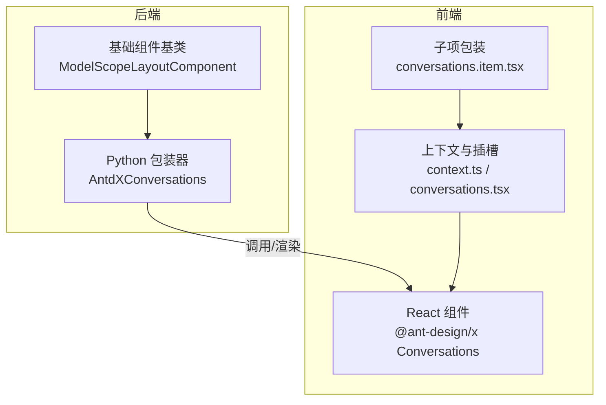
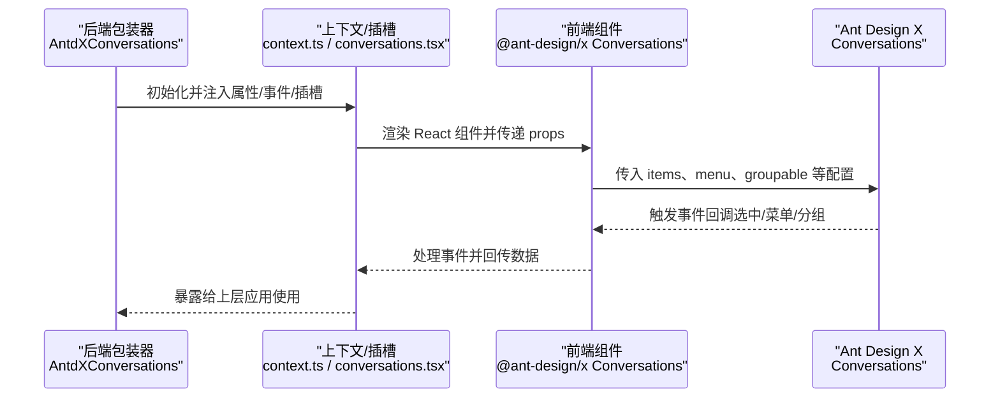
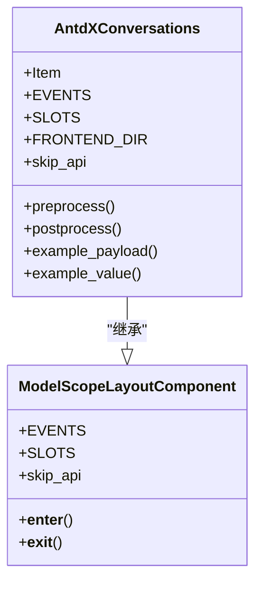
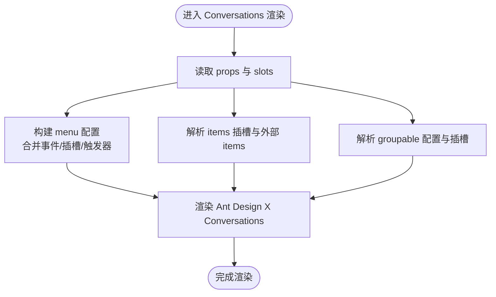
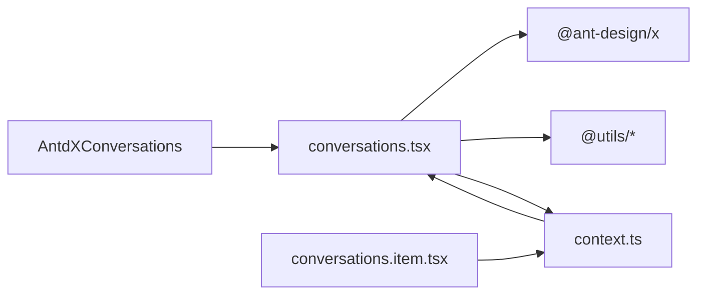

# 组件概览

<cite>
**本文引用的文件**
- [backend/modelscope_studio/components/antdx/__init__.py](file://backend/modelscope_studio/components/antdx/__init__.py)
- [backend/modelscope_studio/components/antdx/conversations/__init__.py](file://backend/modelscope_studio/components/antdx/conversations/__init__.py)
- [frontend/antdx/conversations/conversations.tsx](file://frontend/antdx/conversations/conversations.tsx)
- [frontend/antdx/conversations/context.ts](file://frontend/antdx/conversations/context.ts)
- [frontend/antdx/conversations/item/conversations.item.tsx](file://frontend/antdx/conversations/item/conversations.item.tsx)
- [docs/components/antdx/conversations/README.md](file://docs/components/antdx/conversations/README.md)
- [backend/modelscope_studio/utils/dev/component.py](file://backend/modelscope_studio/utils/dev/component.py)
</cite>

## 目录

1. [简介](#简介)
2. [项目结构](#项目结构)
3. [核心组件](#核心组件)
4. [架构总览](#架构总览)
5. [详细组件分析](#详细组件分析)
6. [依赖关系分析](#依赖关系分析)
7. [性能考量](#性能考量)
8. [故障排查指南](#故障排查指南)
9. [结论](#结论)
10. [附录](#附录)

## 简介

本概览面向 Conversations 对话管理组件，系统性介绍其整体架构、核心功能与设计理念，并说明其与 Ant Design X 组件库的关系以及在机器学习与对话式应用中的典型用法。文档同时提供基本使用路径与核心概念，帮助开发者快速理解与集成该组件。

## 项目结构

Conversations 组件位于 Ant Design X 前端生态中，后端通过 Python 包装器桥接到 Gradio 生态；前端以 React 组件形式对接 Ant Design X 的 Conversations 实现，并通过上下文与插槽机制扩展菜单、分组等能力。

图表来源

- [backend/modelscope_studio/components/antdx/conversations/**init**.py:11-109](file://backend/modelscope_studio/components/antdx/conversations/__init__.py#L11-L109)
- [frontend/antdx/conversations/conversations.tsx:59-175](file://frontend/antdx/conversations/conversations.tsx#L59-L175)
- [frontend/antdx/conversations/context.ts:1-7](file://frontend/antdx/conversations/context.ts#L1-L7)
- [frontend/antdx/conversations/item/conversations.item.tsx:1-14](file://frontend/antdx/conversations/item/conversations.item.tsx#L1-L14)

章节来源

- [backend/modelscope_studio/components/antdx/conversations/**init**.py:11-109](file://backend/modelscope_studio/components/antdx/conversations/__init__.py#L11-L109)
- [frontend/antdx/conversations/conversations.tsx:59-175](file://frontend/antdx/conversations/conversations.tsx#L59-L175)
- [frontend/antdx/conversations/context.ts:1-7](file://frontend/antdx/conversations/context.ts#L1-L7)
- [frontend/antdx/conversations/item/conversations.item.tsx:1-14](file://frontend/antdx/conversations/item/conversations.item.tsx#L1-L14)

## 核心组件

- AntdXConversations（后端包装器）
  - 负责将前端组件注册到 Gradio 生态，暴露属性、事件与插槽，屏蔽底层实现细节。
  - 支持事件绑定：选中变化、菜单点击、展开/收起、新建等。
  - 支持插槽：菜单图标、溢出指示器、触发器、分组标签等。
- Conversations（前端 React 组件）
  - 基于 Ant Design X 的 Conversations，封装菜单、分组、插槽与上下文逻辑。
  - 提供对菜单事件的增强处理，确保与对话项绑定正确。
- ConversationsItem（子项包装）
  - 将子项数据与上下文结合，作为 Conversations 的 items 子项使用。
- 上下文与工具
  - 使用 createItemsContext 管理 items 上下文，支持插槽渲染与参数化插槽。

章节来源

- [backend/modelscope_studio/components/antdx/conversations/**init**.py:11-109](file://backend/modelscope_studio/components/antdx/conversations/__init__.py#L11-L109)
- [frontend/antdx/conversations/conversations.tsx:59-175](file://frontend/antdx/conversations/conversations.tsx#L59-L175)
- [frontend/antdx/conversations/item/conversations.item.tsx:7-11](file://frontend/antdx/conversations/item/conversations.item.tsx#L7-L11)
- [frontend/antdx/conversations/context.ts:1-7](file://frontend/antdx/conversations/context.ts#L1-L7)

## 架构总览

下图展示从后端包装器到前端渲染、再到 Ant Design X 组件的完整链路，以及事件与插槽如何贯穿其中。

图表来源

- [backend/modelscope_studio/components/antdx/conversations/**init**.py:18-47](file://backend/modelscope_studio/components/antdx/conversations/__init__.py#L18-L47)
- [frontend/antdx/conversations/conversations.tsx:72-171](file://frontend/antdx/conversations/conversations.tsx#L72-L171)

章节来源

- [backend/modelscope_studio/components/antdx/conversations/**init**.py:18-47](file://backend/modelscope_studio/components/antdx/conversations/__init__.py#L18-L47)
- [frontend/antdx/conversations/conversations.tsx:72-171](file://frontend/antdx/conversations/conversations.tsx#L72-L171)

## 详细组件分析

### 后端包装器：AntdXConversations

- 设计要点
  - 继承自 ModelScopeLayoutComponent，具备布局上下文能力与事件声明机制。
  - 显式声明支持的事件与插槽，便于前端按需绑定与渲染。
  - 前端目录解析通过 resolve_frontend_dir("conversations", type="antdx") 完成。
  - API 跳过策略（skip_api）用于避免不必要的数据传输，聚焦事件驱动。
- 关键行为
  - preprocess/postprocess/example\_\* 返回空值或占位，表明该组件主要通过事件与插槽交互。
  - 通过内部状态更新（\_internal.update）参与布局渲染流程。

图表来源

- [backend/modelscope_studio/utils/dev/component.py:11-53](file://backend/modelscope_studio/utils/dev/component.py#L11-L53)
- [backend/modelscope_studio/components/antdx/conversations/**init**.py:11-109](file://backend/modelscope_studio/components/antdx/conversations/__init__.py#L11-L109)

章节来源

- [backend/modelscope_studio/utils/dev/component.py:11-53](file://backend/modelscope_studio/utils/dev/component.py#L11-L53)
- [backend/modelscope_studio/components/antdx/conversations/**init**.py:11-109](file://backend/modelscope_studio/components/antdx/conversations/__init__.py#L11-L109)

### 前端组件：Conversations（React）

- 设计要点
  - 通过 sveltify 包装 Ant Design X 的 Conversations，统一与 Svelte/React 预处理体系协作。
  - 使用 useFunction 与 createFunction 将字符串或函数转换为可执行回调，提升灵活性。
  - 通过 renderItems 与 renderParamsSlot 渲染插槽与菜单项，支持克隆与参数化。
  - 对菜单事件进行增强：阻止冒泡并注入当前对话项上下文，保证事件回调签名一致。
  - 支持 groupable 的动态配置与插槽覆盖，满足分组标题与可折叠逻辑定制。
- 数据流
  - 接收 items、menu、groupable、slots 等输入，计算最终传给 Ant Design X 的 props。
  - 通过 classNames 注入额外样式类名，保持与主题/布局的一致性。

图表来源

- [frontend/antdx/conversations/conversations.tsx:72-171](file://frontend/antdx/conversations/conversations.tsx#L72-L171)

章节来源

- [frontend/antdx/conversations/conversations.tsx:59-175](file://frontend/antdx/conversations/conversations.tsx#L59-L175)

### 子项包装：ConversationsItem

- 设计要点
  - 作为子项的轻量包装，直接复用 ItemHandler 上下文，简化子项配置。
  - 通过 sveltify 将 Ant Design X 的子项类型与上下文结合，形成统一的子项接口。

章节来源

- [frontend/antdx/conversations/item/conversations.item.tsx:7-11](file://frontend/antdx/conversations/item/conversations.item.tsx#L7-L11)

### 事件与插槽

- 事件
  - active_change、menu_click、menu_deselect、menu_open_change、menu_select、groupable_expand、creation_click。
- 插槽
  - menu.expandIcon、menu.overflowedIndicator、menu.trigger、groupable.label、items、creation.icon、creation.label。

章节来源

- [backend/modelscope_studio/components/antdx/conversations/**init**.py:18-47](file://backend/modelscope_studio/components/antdx/conversations/__init__.py#L18-L47)

## 依赖关系分析

- 后端依赖
  - 继承自 ModelScopeLayoutComponent，获得布局上下文与事件声明能力。
  - 通过 resolve_frontend_dir 解析前端目录，确保组件正确加载。
- 前端依赖
  - @ant-design/x 提供核心 Conversations 实现。
  - @svelte-preprocess-react 提供 React 与 Svelte 的互操作能力。
  - @utils/\* 工具函数与 hooks 提供事件处理、插槽渲染与上下文管理。
- 组件间耦合
  - AntdXConversations 与前端 Conversations 通过 props 与事件解耦。
  - 上下文与插槽机制降低耦合度，提高可扩展性。

图表来源

- [backend/modelscope_studio/components/antdx/conversations/**init**.py:91-91](file://backend/modelscope_studio/components/antdx/conversations/__init__.py#L91-L91)
- [frontend/antdx/conversations/conversations.tsx:1-26](file://frontend/antdx/conversations/conversations.tsx#L1-L26)
- [frontend/antdx/conversations/context.ts:1-7](file://frontend/antdx/conversations/context.ts#L1-L7)
- [frontend/antdx/conversations/item/conversations.item.tsx:1-14](file://frontend/antdx/conversations/item/conversations.item.tsx#L1-L14)

章节来源

- [backend/modelscope_studio/components/antdx/conversations/**init**.py:91-91](file://backend/modelscope_studio/components/antdx/conversations/__init__.py#L91-L91)
- [frontend/antdx/conversations/conversations.tsx:1-26](file://frontend/antdx/conversations/conversations.tsx#L1-L26)
- [frontend/antdx/conversations/context.ts:1-7](file://frontend/antdx/conversations/context.ts#L1-L7)
- [frontend/antdx/conversations/item/conversations.item.tsx:1-14](file://frontend/antdx/conversations/item/conversations.item.tsx#L1-L14)

## 性能考量

- 事件驱动优先：组件默认跳过 API 层数据传输，仅通过事件与插槽交互，减少不必要的网络往返。
- 插槽与上下文：通过上下文与插槽减少重复渲染，提升复杂列表的渲染效率。
- 菜单事件增强：在前端对菜单事件进行增强处理，避免事件冒泡带来的重复触发风险。
- 建议
  - 控制 items 数量与层级，避免一次性渲染过多节点。
  - 合理使用 groupable 与插槽，避免过度嵌套导致的重排与重绘。

## 故障排查指南

- 组件不显示或无响应
  - 检查 FRONTEND_DIR 是否正确解析，确认前端包已安装且版本匹配。
  - 确认事件绑定是否生效（如 active_change、menu_click），必要时检查回调函数签名。
- 菜单不出现或点击无效
  - 确认 menu 配置或插槽是否正确设置，检查 menu.items 或 slots 中的触发器与图标。
  - 若使用字符串函数，请确认字符串可被安全解析为可执行函数。
- 分组标签不显示
  - 确认 groupable 配置或 groupable.label 插槽是否正确传入。
- 子项渲染异常
  - 检查 ConversationsItem 的上下文是否正确注入，确保 ItemHandler 正常工作。

章节来源

- [backend/modelscope_studio/components/antdx/conversations/**init**.py:91-109](file://backend/modelscope_studio/components/antdx/conversations/__init__.py#L91-L109)
- [frontend/antdx/conversations/conversations.tsx:83-122](file://frontend/antdx/conversations/conversations.tsx#L83-L122)
- [frontend/antdx/conversations/context.ts:1-7](file://frontend/antdx/conversations/context.ts#L1-L7)

## 结论

Conversations 组件通过“后端包装器 + 前端 React 组件 + 上下文/插槽”的架构，实现了与 Ant Design X 的深度集成与灵活扩展。其事件驱动与插槽机制使其在对话列表管理、菜单操作与分组展示方面具备良好的可维护性与可扩展性，适合在机器学习与对话式应用中作为核心交互组件使用。

## 附录

- 快速使用路径
  - 在后端引入 AntdXConversations 并配置 items、menu、groupable 等属性。
  - 在前端通过插槽配置菜单图标、触发器与分组标签。
  - 通过事件监听实现选中切换、菜单操作与分组展开/收起。
- 参考示例
  - 文档示例页面提供了基础、操作与分组三类示例，可作为集成起点。

章节来源

- [docs/components/antdx/conversations/README.md:1-10](file://docs/components/antdx/conversations/README.md#L1-L10)
