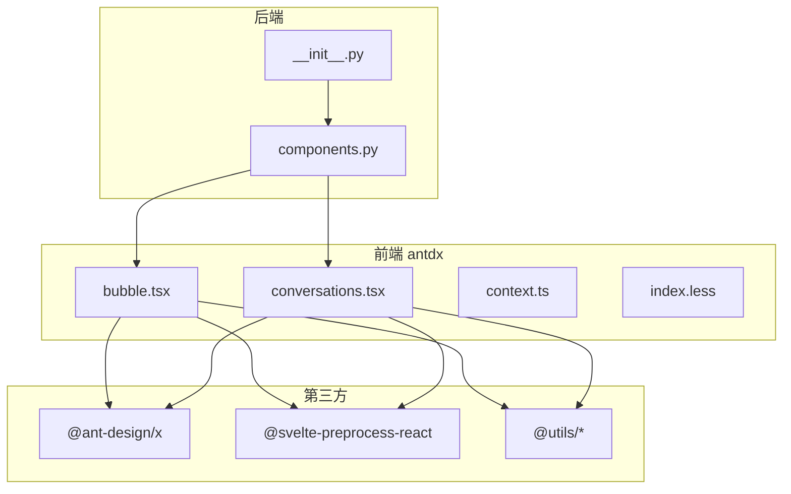
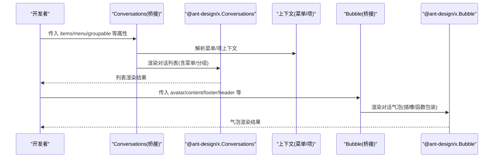
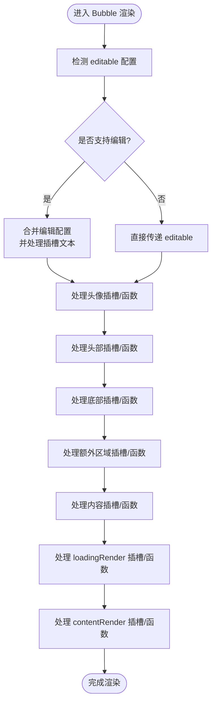
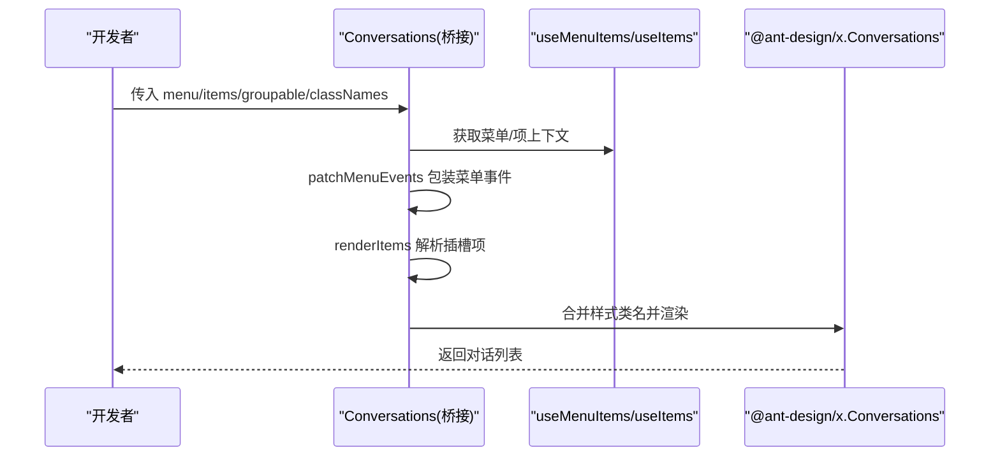
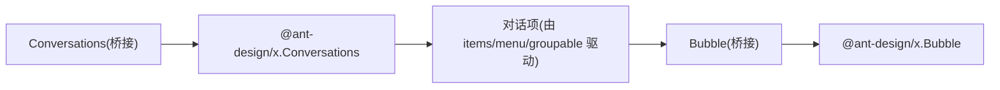
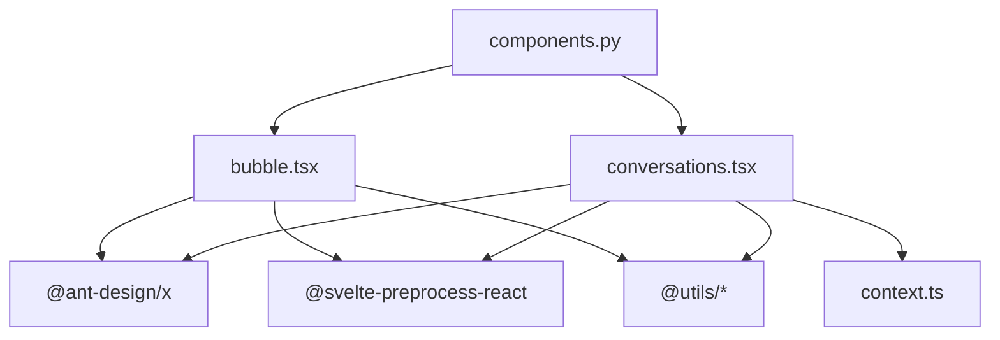

# 通用组件

<cite>
**本文引用的文件**
- [bubble.tsx](file://frontend/antdx/bubble/bubble.tsx)
- [conversations.tsx](file://frontend/antdx/conversations/conversations.tsx)
- [context.ts](file://frontend/antdx/conversations/context.ts)
- [index.less](file://frontend/antdx/conversations/index.less)
- [__init__.py](file://backend/modelscope_studio/components/antdx/__init__.py)
- [components.py](file://backend/modelscope_studio/components/antdx/components.py)
- [README-zh_CN.md](file://README-zh_CN.md)
</cite>

## 目录

1. [简介](#简介)
2. [项目结构](#项目结构)
3. [核心组件](#核心组件)
4. [架构总览](#架构总览)
5. [详细组件分析](#详细组件分析)
6. [依赖分析](#依赖分析)
7. [性能考虑](#性能考虑)
8. [故障排查指南](#故障排查指南)
9. [结论](#结论)
10. [附录](#附录)

## 简介

本文件面向 Ant Design X 通用组件，聚焦于 Bubble 对话气泡组件与 Conversations 对话管理组件的实现与使用。内容涵盖：

- Bubble 的对话展示能力、消息类型区分、样式与内容定制
- Conversations 的对话列表管理、状态控制、菜单与分组操作接口
- 组件间协作关系与最佳实践
- 完整使用示例（基础用法、高级配置、样式定制）

## 项目结构

Ant Design X 通用组件位于前端目录的 antdx 分类下，采用 Svelte + React 预处理桥接方案，通过 sveltify 将 @ant-design/x 的原生组件包装为可在 Svelte 中使用的组件。后端 Python 包提供统一导出入口。

图表来源

- [bubble.tsx:1-119](file://frontend/antdx/bubble/bubble.tsx#L1-L119)
- [conversations.tsx:1-178](file://frontend/antdx/conversations/conversations.tsx#L1-L178)
- [context.ts:1-7](file://frontend/antdx/conversations/context.ts#L1-L7)
- [**init**.py](file://backend/modelscope_studio/components/antdx/__init__.py)
- [components.py](file://backend/modelscope_studio/components/antdx/components.py)

章节来源

- [bubble.tsx:1-119](file://frontend/antdx/bubble/bubble.tsx#L1-L119)
- [conversations.tsx:1-178](file://frontend/antdx/conversations/conversations.tsx#L1-L178)
- [context.ts:1-7](file://frontend/antdx/conversations/context.ts#L1-L7)
- [**init**.py](file://backend/modelscope_studio/components/antdx/__init__.py)
- [components.py](file://backend/modelscope_studio/components/antdx/components.py)

## 核心组件

- Bubble：对话气泡展示组件，支持头像、标题、内容、底部栏、额外区域、可编辑文案、加载态渲染、内容渲染等插槽化扩展。
- Conversations：对话列表管理组件，支持菜单注入、分组配置、项渲染、样式类名合并、事件透传等。

章节来源

- [bubble.tsx:14-116](file://frontend/antdx/bubble/bubble.tsx#L14-L116)
- [conversations.tsx:59-175](file://frontend/antdx/conversations/conversations.tsx#L59-L175)

## 架构总览

Bubble 与 Conversations 均通过 sveltify 桥接到 @ant-design/x 的原生组件，并在桥接层中完成：

- 插槽到 ReactSlot 的映射
- 函数型属性的 useFunction 包装
- 菜单与分组配置的上下文与渲染工具集成
- 样式类名的合并与覆盖

图表来源

- [conversations.tsx:68-175](file://frontend/antdx/conversations/conversations.tsx#L68-L175)
- [bubble.tsx:27-116](file://frontend/antdx/bubble/bubble.tsx#L27-L116)

## 详细组件分析

### Bubble 组件分析

- 功能要点
  - 支持头像、标题、内容、底部栏、额外区域等插槽化扩展
  - 支持可编辑模式（布尔或配置对象），并允许通过插槽自定义“确定/取消”文本
  - 支持 typing 回调与 loadingRender/contentRender 的函数化配置
  - 内部对 editable、avatar、header、footer、extra、loadingRender、contentRender 等进行统一处理与回退
- 数据流与处理逻辑
  - 使用 useFunction 包装函数型属性，确保在 Svelte 环境中正确执行
  - 通过 ReactSlot 渲染插槽内容，renderParamsSlot 支持带参数的插槽
  - 对 editable 进行配置合并与条件渲染，兼容布尔值与对象配置
- 复杂度与性能
  - 主要为属性映射与渲染开销，复杂度与插槽数量和嵌套深度相关
  - 通过函数包装避免重复渲染，提升交互响应性

图表来源

- [bubble.tsx:27-116](file://frontend/antdx/bubble/bubble.tsx#L27-L116)

章节来源

- [bubble.tsx:8-116](file://frontend/antdx/bubble/bubble.tsx#L8-L116)

### Conversations 组件分析

- 功能要点
  - 对接 @ant-design/x 的 Conversations，提供菜单注入、分组配置、项渲染与样式类名合并
  - 通过 useMenuItems 与 useItems 上下文解析菜单与项插槽
  - 支持字符串形式的 menu 属性与对象配置，自动合并事件并阻止冒泡
  - 支持 groupable 的 label 插槽与 collapsible 函数配置
- 数据流与处理逻辑
  - patchMenuEvents：对菜单事件进行包装，注入 conversation 参数并阻止 DOM 事件冒泡
  - renderItems：将插槽项转换为实际渲染项，支持克隆与深拷贝
  - useMemo：对 menu 与 items 进行记忆化，减少不必要的重渲染
- 复杂度与性能
  - 记忆化与上下文解析带来稳定性能；插槽项越多，renderItems 开销越大
  - 菜单事件包装仅在存在菜单时生效，避免无谓开销

图表来源

- [conversations.tsx:35-175](file://frontend/antdx/conversations/conversations.tsx#L35-L175)
- [context.ts:1-7](file://frontend/antdx/conversations/context.ts#L1-L7)

章节来源

- [conversations.tsx:28-175](file://frontend/antdx/conversations/conversations.tsx#L28-L175)
- [context.ts:1-7](file://frontend/antdx/conversations/context.ts#L1-L7)

### 组件协作关系

- Conversations 作为容器，负责对话列表的渲染与菜单/分组配置
- Bubble 作为子元素，负责单个对话气泡的展示与交互
- 两者通过 @ant-design/x 的原生组件协同工作，桥接层提供插槽与函数包装能力

图表来源

- [conversations.tsx:139-171](file://frontend/antdx/conversations/conversations.tsx#L139-L171)
- [bubble.tsx:38-115](file://frontend/antdx/bubble/bubble.tsx#L38-L115)

## 依赖分析

- 第三方依赖
  - @ant-design/x：提供原生对话与气泡组件
  - @svelte-preprocess-react：提供 sveltify 与 ReactSlot 能力
  - @utils/\*：提供 useFunction、renderItems、renderParamsSlot、createFunction 等工具
  - classnames：用于类名合并
- 后端导出
  - Python 包通过 **init**.py 与 components.py 暴露 antdx 组件，便于在 Python 环境中使用

图表来源

- [bubble.tsx:1-7](file://frontend/antdx/bubble/bubble.tsx#L1-L7)
- [conversations.tsx:1-17](file://frontend/antdx/conversations/conversations.tsx#L1-L17)
- [context.ts:1-7](file://frontend/antdx/conversations/context.ts#L1-L7)
- [components.py](file://backend/modelscope_studio/components/antdx/components.py)

章节来源

- [bubble.tsx:1-7](file://frontend/antdx/bubble/bubble.tsx#L1-L7)
- [conversations.tsx:1-17](file://frontend/antdx/conversations/conversations.tsx#L1-L17)
- [context.ts:1-7](file://frontend/antdx/conversations/context.ts#L1-L7)
- [components.py](file://backend/modelscope_studio/components/antdx/components.py)

## 性能考虑

- 使用 useMemo 对菜单与项进行记忆化，避免不必要的重渲染
- 通过 useFunction 包装函数型属性，减少闭包创建与渲染抖动
- 插槽项通过 renderItems 克隆渲染，避免共享状态导致的副作用
- 在大量对话场景下，建议按需加载与虚拟滚动（如 @ant-design/x 提供的能力）以降低内存占用

## 故障排查指南

- 插槽未生效
  - 确认插槽名称与桥接层声明一致（如 editable.okText、editable.cancelText、content、footer、header、extra、loadingRender、contentRender）
  - 确认插槽内容通过 ReactSlot 正确渲染
- 菜单事件异常
  - 检查是否正确使用 useMenuItems 上下文
  - 确认 patchMenuEvents 是否正确包裹 onClick 等事件并阻止冒泡
- 样式类名冲突
  - 通过 classNames 合并自定义类名，避免覆盖默认样式
- 编辑模式不显示
  - 确认 editable 为对象且包含 editing 字段，或通过插槽提供自定义文案

章节来源

- [bubble.tsx:36-64](file://frontend/antdx/bubble/bubble.tsx#L36-L64)
- [conversations.tsx:35-57](file://frontend/antdx/conversations/conversations.tsx#L35-L57)
- [conversations.tsx:145-151](file://frontend/antdx/conversations/conversations.tsx#L145-L151)

## 结论

Bubble 与 Conversations 通过桥接层实现了对 @ant-design/x 的完整能力封装，提供了灵活的插槽化与函数化配置，满足从基础对话展示到复杂对话管理的多种场景。建议在实际项目中结合上下文与工具函数，合理组织插槽与事件，以获得更佳的开发体验与运行性能。

## 附录

- 使用示例（基于仓库现有文件与组件能力）
  - 基础用法
    - 使用 Bubble 展示一条消息，设置头像、内容与底部栏
    - 使用 Conversations 渲染对话列表，传入 items 与 menu 配置
  - 高级配置
    - 在 Bubble 中启用编辑模式，通过插槽自定义“确定/取消”文本
    - 在 Conversations 中使用 groupable 实现分组与折叠，通过插槽自定义分组标签
  - 样式定制
    - 通过 classNames 合并自定义类名，覆盖默认样式
    - 引入 index.less 进行主题化定制（如需要）

章节来源

- [bubble.tsx:14-116](file://frontend/antdx/bubble/bubble.tsx#L14-L116)
- [conversations.tsx:59-175](file://frontend/antdx/conversations/conversations.tsx#L59-L175)
- [index.less](file://frontend/antdx/conversations/index.less)
- [README-zh_CN.md](file://README-zh_CN.md)
