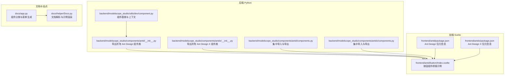
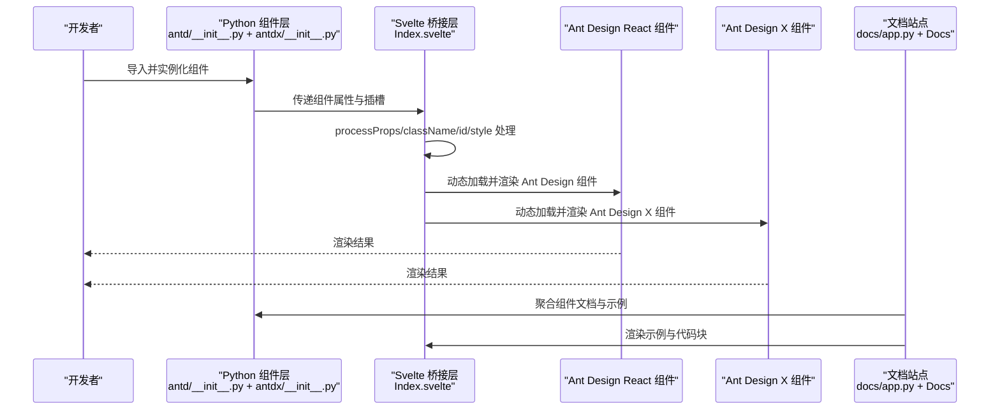
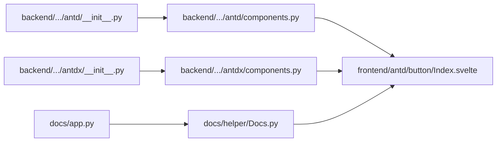

# Ant Design 组件库

<cite>
**本文引用的文件**
- [backend/modelscope_studio/components/antd/__init__.py](file://backend/modelscope_studio/components/antd/__init__.py)
- [backend/modelscope_studio/components/antd/components.py](file://backend/modelscope_studio/components/antd/components.py)
- [backend/modelscope_studio/components/antdx/__init__.py](file://backend/modelscope_studio/components/antdx/__init__.py)
- [backend/modelscope_studio/components/antdx/components.py](file://backend/modelscope_studio/components/antdx/components.py)
- [frontend/antd/package.json](file://frontend/antd/package.json)
- [frontend/antdx/package.json](file://frontend/antdx/package.json)
- [docs/app.py](file://docs/app.py)
- [docs/helper/Docs.py](file://docs/helper/Docs.py)
- [backend/modelscope_studio/utils/dev/component.py](file://backend/modelscope_studio/utils/dev/component.py)
- [frontend/antd/button/Index.svelte](file://frontend/antd/button/Index.svelte)
- [README-zh_CN.md](file://README-zh_CN.md)
- [.changeset/pink-sails-itch.md](file://.changeset/pink-sails-itch.md)
- [.changeset/eleven-aliens-sell.md](file://.changeset/eleven-aliens-sell.md)
- [backend/modelscope_studio/components/antdx/thought_chain/thought_chain_item/__init__.py](file://backend/modelscope_studio/components/antdx/thought_chain/thought_chain_item/__init__.py)
- [backend/modelscope_studio/components/antdx/folder/directory_icon/__init__.py](file://backend/modelscope_studio/components/antdx/folder/directory_icon/__init__.py)
- [backend/modelscope_studio/components/antdx/sender/header/__init__.py](file://backend/modelscope_studio/components/antdx/sender/header/__init__.py)
</cite>

## 更新摘要

**所做更改**

- 更新了版本信息，反映从 Gradio 5.x 到 6.0、Ant Design 5.x 到 6.0、Ant Design X 1.x 到 2.0 的重大升级
- 新增了 Ant Design X 组件库的完整功能介绍，包括思维链、文件夹、发送者等新组件
- 扩展了组件分类，增加了新的组件组别和功能特性
- 更新了架构说明，反映新的组件组织结构

## 目录

1. [简介](#简介)
2. [项目结构](#项目结构)
3. [核心组件](#核心组件)
4. [架构总览](#架构总览)
5. [组件详解](#组件详解)
6. [Ant Design X 组件库](#ant-design-x-组件库)
7. [依赖关系分析](#依赖关系分析)
8. [性能考量](#性能考量)
9. [故障排查指南](#故障排查指南)
10. [结论](#结论)
11. [附录](#附录)

## 简介

本文件面向 ModelScope Studio 的 Ant Design 组件库，系统梳理其组件分类、功能特性与使用方式，覆盖通用组件、布局组件、导航组件、数据录入组件、数据展示组件、反馈组件六大类别。随着 Gradio 6.0、Ant Design 6.0 和 Ant Design X 2.0 的重大升级，组件库现已支持更丰富的交互能力和更现代化的设计系统。文档同时提供属性说明、事件处理、样式定制、响应式与国际化支持、性能优化与最佳实践，辅以丰富的示例与场景化说明，帮助开发者快速上手并高质量落地。

## 项目结构

ModelScope Studio 将 Ant Design 组件以 Python 包的形式导出，并通过前端 Svelte 包桥接至 Ant Design React 组件，形成"Python 层组件定义 + 前端渲染桥接"的双层架构。现在还集成了 Ant Design X 组件库，提供更丰富的交互组件。文档站点通过统一入口聚合各组件的文档与示例，便于浏览与对比。

**图示来源**

- [backend/modelscope_studio/components/antd/**init**.py:1-150](file://backend/modelscope_studio/components/antd/__init__.py#L1-L150)
- [backend/modelscope_studio/components/antd/components.py:1-147](file://backend/modelscope_studio/components/antd/components.py#L1-L147)
- [backend/modelscope_studio/components/antdx/**init**.py:1-42](file://backend/modelscope_studio/components/antdx/__init__.py#L1-L42)
- [backend/modelscope_studio/components/antdx/components.py:1-40](file://backend/modelscope_studio/components/antdx/components.py#L1-L40)
- [backend/modelscope_studio/utils/dev/component.py:1-169](file://backend/modelscope_studio/utils/dev/component.py#L1-L169)
- [frontend/antd/package.json:1-6](file://frontend/antd/package.json#L1-L6)
- [frontend/antdx/package.json:1-6](file://frontend/antdx/package.json#L1-L6)
- [frontend/antd/button/Index.svelte:1-74](file://frontend/antd/button/Index.svelte#L1-L74)
- [docs/app.py:19-438](file://docs/app.py#L19-L438)
- [docs/helper/Docs.py:12-178](file://docs/helper/Docs.py#L12-L178)

**章节来源**

- [docs/app.py:19-438](file://docs/app.py#L19-L438)
- [docs/helper/Docs.py:12-178](file://docs/helper/Docs.py#L12-L178)
- [backend/modelscope_studio/components/antd/**init**.py:1-150](file://backend/modelscope_studio/components/antd/__init__.py#L1-L150)
- [backend/modelscope_studio/components/antd/components.py:1-147](file://backend/modelscope_studio/components/antd/components.py#L1-L147)
- [backend/modelscope_studio/components/antdx/**init**.py:1-42](file://backend/modelscope_studio/components/antdx/__init__.py#L1-L42)
- [backend/modelscope_studio/components/antdx/components.py:1-40](file://backend/modelscope_studio/components/antdx/components.py#L1-L40)
- [backend/modelscope_studio/utils/dev/component.py:1-169](file://backend/modelscope_studio/utils/dev/component.py#L1-L169)
- [frontend/antd/package.json:1-6](file://frontend/antd/package.json#L1-L6)
- [frontend/antdx/package.json:1-6](file://frontend/antdx/package.json#L1-L6)
- [frontend/antd/button/Index.svelte:1-74](file://frontend/antd/button/Index.svelte#L1-L74)

## 核心组件

- 组件导出与命名：后端通过 **init**.py 与 components.py 将 Ant Design 组件类统一导出，现在还包括 Ant Design X 组件，便于按需导入与批量使用。
- 组件基类：ModelScopeComponent/ModelScopeLayoutComponent/ModelScopeDataLayoutComponent 提供统一的可见性、元素 ID、类名、内联样式、插槽与生命周期行为。
- 前端桥接：Svelte 组件通过 importComponent 动态加载 Ant Design React 组件，统一处理 props、slots 与样式注入。
- 版本升级：从 Gradio 5.x 升级到 6.0，支持更强大的事件系统和组件生命周期管理。

**章节来源**

- [backend/modelscope_studio/components/antd/**init**.py:1-150](file://backend/modelscope_studio/components/antd/__init__.py#L1-L150)
- [backend/modelscope_studio/components/antd/components.py:1-147](file://backend/modelscope_studio/components/antd/components.py#L1-L147)
- [backend/modelscope_studio/components/antdx/**init**.py:1-42](file://backend/modelscope_studio/components/antdx/__init__.py#L1-L42)
- [backend/modelscope_studio/components/antdx/components.py:1-40](file://backend/modelscope_studio/components/antdx/components.py#L1-L40)
- [backend/modelscope_studio/utils/dev/component.py:54-169](file://backend/modelscope_studio/utils/dev/component.py#L54-L169)
- [frontend/antd/button/Index.svelte:10-74](file://frontend/antd/button/Index.svelte#L10-L74)

## 架构总览

下图展示了从 Python 组件调用到前端渲染的关键流程，以及文档站点如何组织与呈现组件示例。现在包含了 Ant Design X 组件的支持。

**图示来源**

- [docs/app.py:19-438](file://docs/app.py#L19-L438)
- [docs/helper/Docs.py:82-178](file://docs/helper/Docs.py#L82-L178)
- [frontend/antd/button/Index.svelte:24-74](file://frontend/antd/button/Index.svelte#L24-L74)

## 组件详解

### 通用组件

- 按钮 Button：支持链接跳转、图标、尺寸与主题变体；通过 href_target 控制 target 行为；支持插槽与样式定制。
- 悬浮按钮 FloatButton：支持返回顶部、分组与图标；可组合多个悬浮动作。
- 图标 Icon：支持图标字体提供者；可与其它组件配合使用。
- 排版 Typography：支持标题、文本、段落、链接等语义化排版元素。

使用要点

- 属性映射：前端通过 processProps 将 visible、elem_id、elem_classes、elem_style、value 等统一透传。
- 插槽：Svelte 侧通过 getSlots 获取默认插槽，用于渲染子节点。
- 示例：按钮组件的桥接示例展示了动态加载与样式拼接。

**章节来源**

- [frontend/antd/button/Index.svelte:24-74](file://frontend/antd/button/Index.svelte#L24-L74)
- [docs/app.py:198-209](file://docs/app.py#L198-L209)

### 布局组件

- 分割线 Divider：支持水平/垂直与虚线样式。
- 弹性布局 Flex：提供灵活的弹性容器能力。
- 栅格 Grid：行 Row 与列 Col 支持响应式断点与间距。
- 布局 Layout：包含 Header、Sider、Content、Footer 子组件，适合构建页面骨架。
- 间距 Space：支持紧凑模式与包裹子项。
- 分割面板 Splitter：支持面板与拖拽分割。
- 瀑布流布局 Masonry：支持响应式列数与项目高度自动调整。

使用要点

- 响应式：栅格与 Flex 提供多断点配置，适配移动端与桌面端。
- 样式：elem_style 可直接作用于容器，实现定位、宽高与边距控制。

**章节来源**

- [docs/app.py:216-233](file://docs/app.py#L216-L233)

### 导航组件

- 锚点 Anchor：支持滚动定位与锚点项。
- 面包屑 Breadcrumb：支持自定义分隔符与路由项。
- 下拉菜单 Dropdown：支持按钮下拉与菜单项。
- 导航菜单 Menu：支持多级菜单与选中态。
- 分页 Pagination：支持页码切换与尺寸。
- 步骤条 Steps：支持步骤状态与描述。

使用要点

- 事件：导航组件通常通过回调或状态变更触发页面跳转或内容更新。
- 国际化：可通过 ConfigProvider 统一设置语言环境（见"国际化支持"）。

**章节来源**

- [docs/app.py:240-257](file://docs/app.py#L240-L257)

### 数据录入组件

- 自动完成 AutoComplete：支持选项与回填。
- 级联选择 Cascader：支持多级联动与懒加载。
- 多选框 Checkbox：支持组与选项。
- 颜色选择器 ColorPicker：支持预设与格式化。
- 日期选择 DatePicker：支持范围选择与预设快捷项。
- 表单 Form：支持字段校验规则、动态增减与 Provider。
- 输入框 Input：支持密码、搜索、多行与 OTP。
- 数字输入 InputNumber：支持步长与精度。
- 提及 Mentions：支持关键词提及与选项。
- 单选框 Radio：支持按钮与组。
- 评分 Rate：支持只读与半星。
- 选择器 Select：支持多选与搜索。
- 滑动输入条 Slider：支持标记与范围。
- 开关 Switch：支持禁用与加载。
- 时间选择器 TimePicker：支持范围选择。
- 穿梭框 Transfer：支持源与目标列表。
- 树选择 TreeSelect：支持目录树与节点。
- 上传 Upload：支持拖拽与自定义请求。

使用要点

- 校验：FormItemRule 提供校验规则定义；动态表单支持条件渲染与字段增删。
- 事件：onChange/onFocus/onBlur 等常见事件可用于联动与状态管理。
- 样式：elem_style/elem_classes 用于微调外观与布局。

**章节来源**

- [docs/app.py:264-317](file://docs/app.py#L264-L317)

### 数据展示组件

- 头像 Avatar：支持头像组与徽标。
- 徽标数 Badge：支持徽章与缎带。
- 日历 Calendar：支持月份视图与事件标注。
- 卡片 Card：支持网格与元信息。
- 走马灯 Carousel：支持自动轮播与指示器。
- 折叠面板 Collapse：支持手风琴与面板项。
- 描述列表 Descriptions：支持键值对展示。
- 空状态 Empty：支持自定义图片与操作。
- 图片 Image：支持预览组与懒加载。
- 列表 List：支持项与元信息。
- 气泡卡片 Popover：支持触发与内容。
- 二维码 QRCode：支持颜色与尺寸。
- 分段控制器 Segmented：支持选项与禁用。
- 统计数值 Statistic：支持计数与定时器。
- 表格 Table：支持列、展开、选择与排序。
- 标签页 Tabs：支持标签项与类型。
- 标签 Tag：支持可勾选标签。
- 时间轴 Timeline：支持节点与方向。
- 文字提示 Tooltip：支持触发与位置。
- 漫游式引导 Tour：支持步骤与高亮。
- 树 Tree：支持目录树与节点。

使用要点

- 表格：支持固定列、排序、筛选与分页；可结合分段控制器进行维度切换。
- 图片：ImagePreviewGroup 提供多图预览能力。
- 交互：Popover/Tooltip/Tour 提升信息密度与引导效率。

**章节来源**

- [docs/app.py:324-386](file://docs/app.py#L324-L386)

### 反馈组件

- 警告提示 Alert：支持多种类型与关闭。
- 抽屉 Drawer：支持位置与嵌套内容。
- 全局提示 Message：支持全局消息与持续时间。
- 对话框 Modal：支持静态对话框与遮罩层。
- 通知提醒框 Notification：支持多条通知与关闭。
- 气泡确认框 Popconfirm：支持确认与取消回调。
- 进度条 Progress：支持圆形与百分比。
- 结果 Result：支持成功/失败/等待等状态页。
- 骨架屏 Skeleton：支持头像、按钮、输入与图片。
- 加载中 Spin：支持全屏与内联。
- 水印 Watermark：支持文本与图片水印。

使用要点

- 全局组件：Message/Notification/Modal/Drawer 等通常通过 API 调用而非直接渲染。
- 动画与过渡：Progress/Spin/Skeleton 提升加载体验与占位效果。
- 可访问性：建议为交互组件提供键盘可达与屏幕阅读器友好提示。

**章节来源**

- [docs/app.py:393-425](file://docs/app.py#L393-L425)

### 其他组件

- 固钉 Affix：支持吸附与偏移。
- 全局化配置 ConfigProvider：提供主题、语言与全局样式覆盖。

使用要点

- 国际化：ConfigProvider 支持 locales 注入，实现中英文切换。
- 主题：通过 ConfigProvider 覆盖全局主题变量，统一风格。

**章节来源**

- [docs/app.py:432-437](file://docs/app.py#L432-L437)

## Ant Design X 组件库

### 新增组件概览

Ant Design X 是 Ant Design 的扩展组件库，提供了更丰富的交互组件和专业应用场景的解决方案。本次升级包含了以下主要组件：

#### 思维链组件 (Thought Chain)

- ThoughtChain：思维链容器组件，支持多步骤思维过程展示
- ThoughtChainItem：思维链项组件，支持状态管理、可折叠和闪烁效果
- 支持 pending、success、error、abort 状态
- 可配置内容、描述、页脚、图标和标题

#### 文件管理组件

- Folder：文件夹组件，支持目录树和文件管理
- FolderDirectoryIcon：目录图标组件，支持不同文件类型的图标显示
- FileCard：文件卡片组件，支持文件列表展示
- FileCardList：文件列表组件，支持文件项管理

#### 会话交互组件

- Bubble：消息气泡组件，支持用户和系统消息展示
- BubbleList：消息列表组件，支持消息项和角色管理
- Conversations：对话组件，支持历史对话管理
- Sender：发送者组件，支持消息发送和头部管理
- SenderHeader：发送者头部组件，支持展开状态控制

#### 内容展示组件

- CodeHighlighter：代码高亮组件，支持多种编程语言语法高亮
- Mermaid：图表组件，支持 Mermaid 语法图表渲染
- Prompts：提示词组件，支持提示词管理和展示
- Sources：来源组件，支持内容来源展示
- Suggestion：建议组件，支持智能建议展示

#### 交互工具组件

- Actions：操作组件，支持多种操作按钮
- Attachments：附件组件，支持文件附件管理
- Notification：通知组件，支持系统通知展示
- Welcome：欢迎组件，支持欢迎页面展示
- XProvider：提供者组件，支持上下文提供

使用要点

- 插槽系统：大部分组件支持具名插槽，如 content、description、footer、icon、title 等
- 事件系统：支持 open_change 等事件监听
- 状态管理：支持状态属性如 open、closable、collapsible 等
- 样式定制：支持 styles 和 class_names 属性进行样式定制

**章节来源**

- [backend/modelscope_studio/components/antdx/thought_chain/thought_chain_item/**init**.py:1-81](file://backend/modelscope_studio/components/antdx/thought_chain/thought_chain_item/__init__.py#L1-L81)
- [backend/modelscope_studio/components/antdx/folder/directory_icon/**init**.py:1-61](file://backend/modelscope_studio/components/antdx/folder/directory_icon/__init__.py#L1-L61)
- [backend/modelscope_studio/components/antdx/sender/header/**init**.py:1-74](file://backend/modelscope_studio/components/antdx/sender/header/__init__.py#L1-L74)
- [backend/modelscope_studio/components/antdx/**init**.py:1-42](file://backend/modelscope_studio/components/antdx/__init__.py#L1-L42)
- [backend/modelscope_studio/components/antdx/components.py:1-40](file://backend/modelscope_studio/components/antdx/components.py#L1-L40)

## 依赖关系分析

- Python 层导出：**init**.py 与 components.py 将 Ant Design 和 Ant Design X 组件类集中导出，便于统一导入。
- 前端桥接：Svelte 组件通过 importComponent 动态加载 Ant Design React 和 Ant Design X 组件，processProps 统一处理属性与样式。
- 文档站点：docs/app.py 聚合各组件文档与示例，Docs.py 解析 Markdown 并渲染示例与代码块。

**图示来源**

- [backend/modelscope_studio/components/antd/**init**.py:1-150](file://backend/modelscope_studio/components/antd/__init__.py#L1-L150)
- [backend/modelscope_studio/components/antd/components.py:1-147](file://backend/modelscope_studio/components/antd/components.py#L1-L147)
- [backend/modelscope_studio/components/antdx/**init**.py:1-42](file://backend/modelscope_studio/components/antdx/__init__.py#L1-L42)
- [backend/modelscope_studio/components/antdx/components.py:1-40](file://backend/modelscope_studio/components/antdx/components.py#L1-L40)
- [frontend/antd/button/Index.svelte:10-74](file://frontend/antd/button/Index.svelte#L10-L74)
- [docs/app.py:19-438](file://docs/app.py#L19-L438)
- [docs/helper/Docs.py:12-178](file://docs/helper/Docs.py#L12-L178)

**章节来源**

- [backend/modelscope_studio/components/antd/**init**.py:1-150](file://backend/modelscope_studio/components/antd/__init__.py#L1-L150)
- [backend/modelscope_studio/components/antd/components.py:1-147](file://backend/modelscope_studio/components/antd/components.py#L1-L147)
- [backend/modelscope_studio/components/antdx/**init**.py:1-42](file://backend/modelscope_studio/components/antdx/__init__.py#L1-L42)
- [backend/modelscope_studio/components/antdx/components.py:1-40](file://backend/modelscope_studio/components/antdx/components.py#L1-L40)
- [frontend/antd/button/Index.svelte:10-74](file://frontend/antd/button/Index.svelte#L10-L74)
- [docs/app.py:19-438](file://docs/app.py#L19-L438)
- [docs/helper/Docs.py:12-178](file://docs/helper/Docs.py#L12-L178)

## 性能考量

- 动态加载：前端通过 importComponent 实现按需加载，减少初始包体积与首屏阻塞。
- 属性透传：processProps 统一处理属性与样式，避免重复计算与冗余渲染。
- 表格与列表：合理使用虚拟化与分页，避免一次性渲染大量节点。
- 图片与骨架：使用 Skeleton 与 Image.lazy 降低资源压力与白屏时间。
- 全局组件：Message/Notification/Modal 等建议限制并发数量，避免频繁弹窗造成卡顿。
- 样式：elem_style/elem_classes 应尽量复用，避免内联样式过多导致重绘。
- 组件懒加载：Ant Design X 组件支持懒加载，提升应用启动性能。

## 故障排查指南

- 页面空白或组件不显示
  - 确认已在外层包裹 Application 与 ConfigProvider。
  - 在 Hugging Face Space 中启动时启用 ssr_mode=False。
  - 检查 Ant Design X 组件的依赖版本兼容性。
- 组件样式异常
  - 使用 elem_style/elem_classes 调整容器样式；避免与全局样式冲突。
  - 检查是否正确引入主题与字体资源。
  - 确认 Ant Design X 组件的样式文件已正确加载。
- 国际化未生效
  - 通过 ConfigProvider 注入 locales；确保语言键值与 Ant Design 语言包一致。
- 示例无法运行
  - 确认 docs/app.py 中组件文档路径与示例文件存在；检查 Docs.py 的示例模块加载逻辑。
  - 检查新组件的导入路径是否正确。
- 版本兼容性问题
  - 确保 Gradio、Ant Design 和 Ant Design X 版本匹配。
  - 检查组件属性是否与新版本兼容。

**章节来源**

- [README-zh_CN.md:32-32](file://README-zh_CN.md#L32-L32)
- [docs/app.py:577-595](file://docs/app.py#L577-L595)
- [docs/helper/Docs.py:58-75](file://docs/helper/Docs.py#L58-L75)

## 结论

ModelScope Studio 的 Ant Design 组件库通过清晰的 Python 导出层与前端桥接层，实现了 Ant Design 组件在 Gradio 生态中的无缝集成。随着 Gradio 6.0、Ant Design 6.0 和 Ant Design X 2.0 的重大升级，组件库现在提供了更丰富的交互能力和更现代化的设计系统。借助统一的基类体系、插槽机制、事件系统与文档站点，开发者可以高效地构建美观、易维护的界面。建议在实际项目中结合响应式与国际化策略，遵循性能优化与最佳实践，以获得更佳的用户体验。

## 附录

### 组件属性与事件通用说明

- 通用属性
  - visible：控制组件可见性
  - elem_id：元素 ID
  - elem_classes：类名数组或字符串
  - elem_style：内联样式对象
  - value：组件值（如适用）
- 事件
  - onChange/onFocus/onBlur：常用于输入类组件
  - onClick/onContextMenu：常用于按钮与交互组件
  - onConfirm/onCancel：常用于确认类组件
  - open_change：用于可展开组件的状态变更
- 插槽
  - 默认插槽用于渲染子节点；部分组件支持具名插槽如 content、description、footer、icon、title 等

**章节来源**

- [backend/modelscope_studio/utils/dev/component.py:54-169](file://backend/modelscope_studio/utils/dev/component.py#L54-L169)
- [frontend/antd/button/Index.svelte:24-74](file://frontend/antd/button/Index.svelte#L24-L74)

### 响应式设计与国际化支持

- 响应式
  - 栅格 Grid 与 Flex 提供多断点配置，建议针对移动端与桌面端分别设置断点与间距。
- 国际化
  - 通过 ConfigProvider 注入 locales，实现中英文切换；注意语言包与组件文案的对应关系。

**章节来源**

- [docs/app.py:435-437](file://docs/app.py#L435-L437)

### 代码示例与场景化应用

- 示例组织
  - 文档站点通过 Docs.py 自动扫描 demos 目录，渲染示例与代码块；支持折叠显示与标题标注。
- 场景化建议
  - 表单：使用 Form + FormItem + 校验规则，结合动态表单实现条件渲染。
  - 数据表格：结合 Pagination 与虚拟滚动，提升大数据量下的交互流畅度。
  - 导航：使用 Menu + Breadcrumb + Steps 构建清晰的层级与流程指引。
  - 反馈：使用 Message/Notification/Modal/Drawer 提供及时的用户反馈与操作确认。
  - 思维链：使用 ThoughtChain + ThoughtChainItem 构建 AI 应用的思维过程展示。
  - 文件管理：使用 Folder + FileCard + Attachments 实现文件管理系统。

**章节来源**

- [docs/helper/Docs.py:82-178](file://docs/helper/Docs.py#L82-L178)
- [docs/app.py:19-438](file://docs/app.py#L19-L438)

### 参数映射补充说明

- Collapse 折叠面板属性
  - active_key：当前展开的面板 key
  - default_active_key：默认展开的面板 key
  - accordion：手风琴模式
  - bordered：是否有边框
  - collapsible：可折叠触发区域
  - destroy_inactive_panel：销毁折叠隐藏的面板
  - expand_icon：自定义切换图标
  - expand_icon_placement：切换图标位置，可选 `start` 或 `end`
  - ghost：透明无边框
  - size：尺寸大小

### 版本升级说明

- Gradio 6.0 升级
  - 支持新的事件系统和组件生命周期管理
  - 改进的组件状态管理和数据流
- Ant Design 6.0 升级
  - 更现代化的设计系统和视觉规范
  - 增强的无障碍访问支持
  - 改进的主题定制能力
- Ant Design X 2.0 升级
  - 新增丰富的交互组件
  - 改进的组件 API 和插槽系统
  - 增强的 TypeScript 类型支持

**章节来源**

- [.changeset/pink-sails-itch.md:12-12](file://.changeset/pink-sails-itch.md#L12-L12)
- [.changeset/eleven-aliens-sell.md:12-12](file://.changeset/eleven-aliens-sell.md#L12-L12)
- [frontend/antd/package.json:1-6](file://frontend/antd/package.json#L1-L6)
- [frontend/antdx/package.json:1-6](file://frontend/antdx/package.json#L1-L6)
