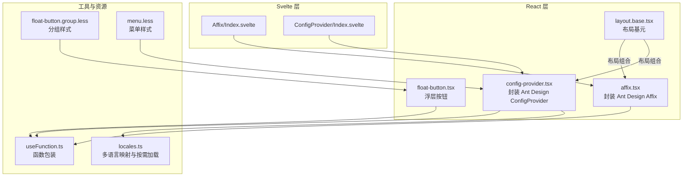
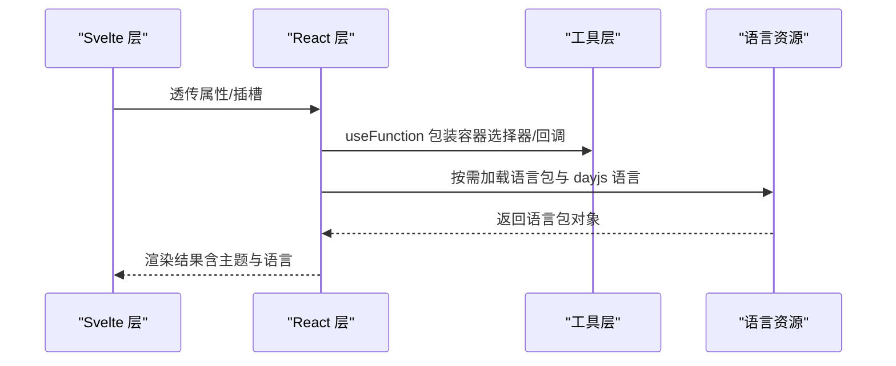
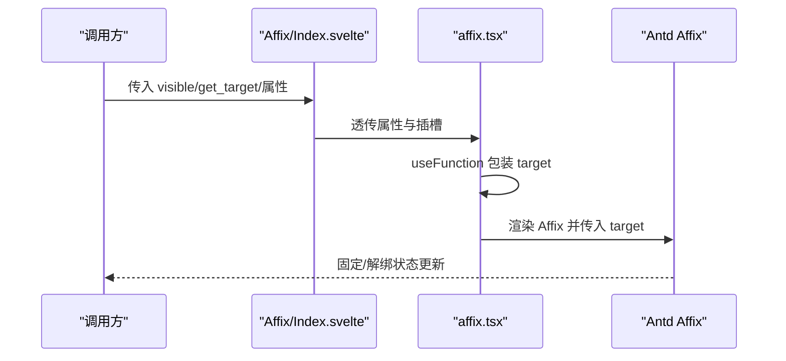
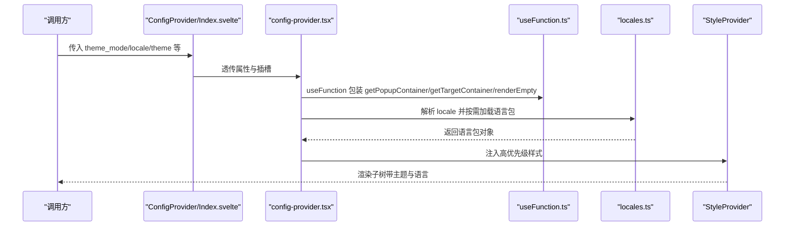
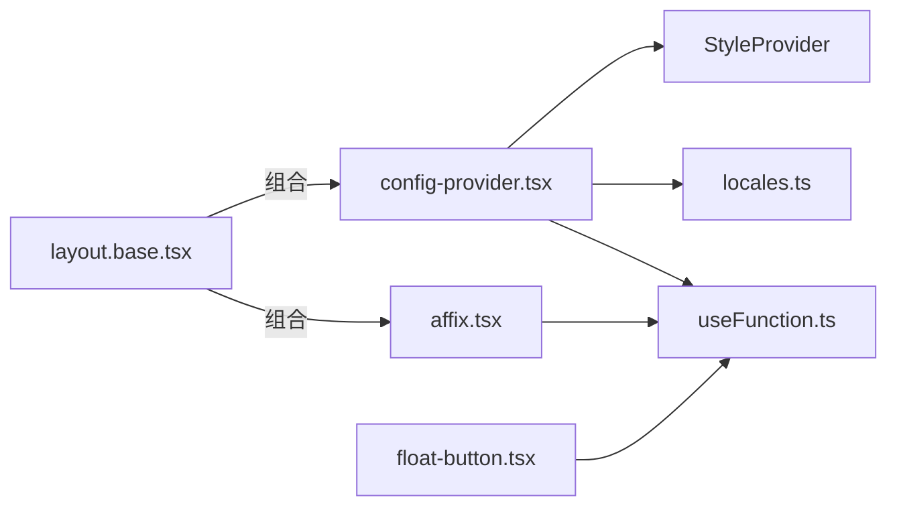

# 其他组件

<cite>
**本文引用的文件**
- [frontend/antd/affix/affix.tsx](file://frontend/antd/affix/affix.tsx)
- [frontend/antd/affix/Index.svelte](file://frontend/antd/affix/Index.svelte)
- [frontend/antd/config-provider/config-provider.tsx](file://frontend/antd/config-provider/config-provider.tsx)
- [frontend/antd/config-provider/locales.ts](file://frontend/antd/config-provider/locales.ts)
- [frontend/antd/config-provider/Index.svelte](file://frontend/antd/config-provider/Index.svelte)
- [frontend/antd/float-button/float-button.tsx](file://frontend/antd/float-button/float-button.tsx)
- [frontend/antd/layout/layout.base.tsx](file://frontend/antd/layout/layout.base.tsx)
- [frontend/antd/float-button/group/float-button.group.less](file://frontend/antd/float-button/group/float-button.group.less)
- [frontend/antd/menu/menu.less](file://frontend/antd/menu/menu.less)
- [frontend/utils/hooks/useFunction.ts](file://frontend/utils/hooks/useFunction.ts)
</cite>

## 目录

1. [引言](#引言)
2. [项目结构](#项目结构)
3. [核心组件](#核心组件)
4. [架构总览](#架构总览)
5. [详细组件分析](#详细组件分析)
6. [依赖关系分析](#依赖关系分析)
7. [性能考量](#性能考量)
8. [故障排查指南](#故障排查指南)
9. [结论](#结论)
10. [附录](#附录)

## 引言

本章节面向 Ant Design Studio 的“其他组件”场景，重点覆盖两类辅助性组件：固钉（Affix）与全局化配置（ConfigProvider）。我们将从定位机制、滚动监听与边界处理，到主题定制、语言切换与组件默认配置进行系统讲解，并结合仓库中的真实实现，给出可操作的应用场景、性能优化与内存管理建议，以及组件间协作的最佳实践。

## 项目结构

- 前端采用 Svelte + React 混合封装模式：Svelte 层负责属性/插槽透传与条件渲染，React 层负责具体 UI 行为（如 Affix、ConfigProvider 等）。
- 工具层提供通用能力，例如将外部函数转换为可在 React 中安全使用的函数包装器。
- 样式层通过 CSS-in-JS 的 StyleProvider 保证主题与前缀隔离，避免全局污染。

图表来源

- [frontend/antd/affix/Index.svelte:1-72](file://frontend/antd/affix/Index.svelte#L1-L72)
- [frontend/antd/affix/affix.tsx:1-14](file://frontend/antd/affix/affix.tsx#L1-L14)
- [frontend/antd/config-provider/Index.svelte:1-72](file://frontend/antd/config-provider/Index.svelte#L1-L72)
- [frontend/antd/config-provider/config-provider.tsx:1-154](file://frontend/antd/config-provider/config-provider.tsx#L1-L154)
- [frontend/antd/float-button/float-button.tsx:1-75](file://frontend/antd/float-button/float-button.tsx#L1-L75)
- [frontend/antd/layout/layout.base.tsx:1-40](file://frontend/antd/layout/layout.base.tsx#L1-L40)
- [frontend/utils/hooks/useFunction.ts:1-13](file://frontend/utils/hooks/useFunction.ts#L1-L13)
- [frontend/antd/config-provider/locales.ts:1-863](file://frontend/antd/config-provider/locales.ts#L1-L863)
- [frontend/antd/float-button/group/float-button.group.less:1-31](file://frontend/antd/float-button/group/float-button.group.less#L1-L31)
- [frontend/antd/menu/menu.less:1-45](file://frontend/antd/menu/menu.less#L1-L45)

章节来源

- [frontend/antd/affix/Index.svelte:1-72](file://frontend/antd/affix/Index.svelte#L1-L72)
- [frontend/antd/config-provider/Index.svelte:1-72](file://frontend/antd/config-provider/Index.svelte#L1-L72)
- [frontend/antd/affix/affix.tsx:1-14](file://frontend/antd/affix/affix.tsx#L1-L14)
- [frontend/antd/config-provider/config-provider.tsx:1-154](file://frontend/antd/config-provider/config-provider.tsx#L1-L154)
- [frontend/antd/float-button/float-button.tsx:1-75](file://frontend/antd/float-button/float-button.tsx#L1-L75)
- [frontend/antd/layout/layout.base.tsx:1-40](file://frontend/antd/layout/layout.base.tsx#L1-L40)
- [frontend/utils/hooks/useFunction.ts:1-13](file://frontend/utils/hooks/useFunction.ts#L1-L13)
- [frontend/antd/config-provider/locales.ts:1-863](file://frontend/antd/config-provider/locales.ts#L1-L863)
- [frontend/antd/float-button/group/float-button.group.less:1-31](file://frontend/antd/float-button/group/float-button.group.less#L1-L31)
- [frontend/antd/menu/menu.less:1-45](file://frontend/antd/menu/menu.less#L1-L45)

## 核心组件

- 固钉（Affix）
  - 定位机制：基于目标容器滚动位置计算元素固定状态；支持自定义目标容器（如页面或某个滚动区域）。
  - 边界处理：通过阈值控制固定/解绑时机，避免元素被错误固定或提前解绑。
  - 滚动监听：通过函数包装器将外部传入的容器选择器转换为 React 可用的回调。
- 全局化配置（ConfigProvider）
  - 主题定制：支持明暗模式与紧凑算法开关，动态组合算法列表，实现主题切换。
  - 语言切换：根据浏览器或指定语言，按需异步加载 Antd 语言包与 dayjs 语言包。
  - 组件默认配置：统一封装 getPopupContainer、getTargetContainer、renderEmpty 等全局行为。
  - 样式隔离：通过 CSS-in-JS 的 StyleProvider 高优先级注入，避免样式冲突。

章节来源

- [frontend/antd/affix/affix.tsx:1-14](file://frontend/antd/affix/affix.tsx#L1-L14)
- [frontend/antd/config-provider/config-provider.tsx:1-154](file://frontend/antd/config-provider/config-provider.tsx#L1-L154)
- [frontend/antd/config-provider/locales.ts:1-863](file://frontend/antd/config-provider/locales.ts#L1-L863)

## 架构总览

下图展示了 Svelte 与 React 层之间的交互关系，以及 ConfigProvider 在主题与语言层面的扩展点。

图表来源

- [frontend/antd/affix/Index.svelte:1-72](file://frontend/antd/affix/Index.svelte#L1-L72)
- [frontend/antd/affix/affix.tsx:1-14](file://frontend/antd/affix/affix.tsx#L1-L14)
- [frontend/antd/config-provider/Index.svelte:1-72](file://frontend/antd/config-provider/Index.svelte#L1-L72)
- [frontend/antd/config-provider/config-provider.tsx:1-154](file://frontend/antd/config-provider/config-provider.tsx#L1-L154)
- [frontend/antd/config-provider/locales.ts:1-863](file://frontend/antd/config-provider/locales.ts#L1-L863)
- [frontend/utils/hooks/useFunction.ts:1-13](file://frontend/utils/hooks/useFunction.ts#L1-L13)

## 详细组件分析

### 固钉（Affix）组件

- 设计要点
  - Svelte 层负责条件渲染与属性透传，支持 visible 控制显示。
  - React 层通过 useFunction 将外部传入的容器选择器转换为 React 可执行的函数，确保滚动监听稳定可靠。
  - 支持插槽与子节点渲染，便于在固定状态下承载复杂内容。
- 关键流程
  - 属性处理：将 get_target 映射为 target，交由 Affix 组件内部处理。
  - 渲染：仅在 visible 为真时渲染，减少不必要的 DOM 开销。
- 使用建议
  - 对于非窗口滚动容器，务必显式传入 target 函数以指向正确容器。
  - 合理设置阈值，避免频繁切换固定/解绑状态导致的抖动。

图表来源

- [frontend/antd/affix/Index.svelte:1-72](file://frontend/antd/affix/Index.svelte#L1-L72)
- [frontend/antd/affix/affix.tsx:1-14](file://frontend/antd/affix/affix.tsx#L1-L14)

章节来源

- [frontend/antd/affix/Index.svelte:1-72](file://frontend/antd/affix/Index.svelte#L1-L72)
- [frontend/antd/affix/affix.tsx:1-14](file://frontend/antd/affix/affix.tsx#L1-L14)
- [frontend/utils/hooks/useFunction.ts:1-13](file://frontend/utils/hooks/useFunction.ts#L1-L13)

### 全局化配置（ConfigProvider）组件

- 设计要点
  - 主题：通过 themeMode 与 theme.algorithm 动态组合算法，支持暗色与紧凑模式。
  - 语言：根据 locale 自动映射到可用语言集，按需异步加载 Antd 语言包与 dayjs 语言包。
  - 容器：统一提供 getPopupContainer 与 getTargetContainer 的函数包装，确保弹窗与浮层渲染到正确容器。
  - 插槽：支持 renderEmpty 等插槽参数，通过 renderParamsSlot 实现灵活扩展。
  - 样式：通过 StyleProvider 高优先级注入，避免样式冲突。
- 关键流程
  - 语言初始化：根据浏览器语言或传入 locale，解析为标准格式并加载对应语言包。
  - 主题初始化：根据 themeMode 与用户配置生成算法数组，传递给 Ant Design。
  - 容器回调：使用 useFunction 包装回调，确保在 React 生命周期内稳定工作。
  - 插槽渲染：将插槽内容包裹为 ReactSlot 或 renderParamsSlot，保持类型安全。

图表来源

- [frontend/antd/config-provider/Index.svelte:1-72](file://frontend/antd/config-provider/Index.svelte#L1-L72)
- [frontend/antd/config-provider/config-provider.tsx:1-154](file://frontend/antd/config-provider/config-provider.tsx#L1-L154)
- [frontend/antd/config-provider/locales.ts:1-863](file://frontend/antd/config-provider/locales.ts#L1-L863)
- [frontend/utils/hooks/useFunction.ts:1-13](file://frontend/utils/hooks/useFunction.ts#L1-L13)

章节来源

- [frontend/antd/config-provider/Index.svelte:1-72](file://frontend/antd/config-provider/Index.svelte#L1-L72)
- [frontend/antd/config-provider/config-provider.tsx:1-154](file://frontend/antd/config-provider/config-provider.tsx#L1-L154)
- [frontend/antd/config-provider/locales.ts:1-863](file://frontend/antd/config-provider/locales.ts#L1-L863)
- [frontend/utils/hooks/useFunction.ts:1-13](file://frontend/utils/hooks/useFunction.ts#L1-L13)

### 浮层按钮（FloatButton）与布局基元（Layout.Base）

- 浮层按钮（FloatButton）
  - 支持 icon/description/tooltip/badge 等插槽，通过 ReactSlot 实现灵活渲染。
  - tooltip 支持对象配置与回调包装，确保弹出容器与回调稳定。
- 布局基元（Layout.Base）
  - 通过组件类型选择器动态选择 Header/Footer/Content/Layout，统一类名前缀，便于样式控制。

章节来源

- [frontend/antd/float-button/float-button.tsx:1-75](file://frontend/antd/float-button/float-button.tsx#L1-L75)
- [frontend/antd/layout/layout.base.tsx:1-40](file://frontend/antd/layout/layout.base.tsx#L1-L40)

## 依赖关系分析

- 组件耦合
  - Affix 与 ConfigProvider 均依赖 useFunction 进行函数包装，降低跨层调用风险。
  - ConfigProvider 依赖 locales.ts 提供的语言映射与按需加载能力。
- 外部依赖
  - Ant Design 组件库与 dayjs 语言包。
  - CSS-in-JS 的 StyleProvider 用于样式隔离与优先级控制。
- 潜在循环依赖
  - 当前实现未见直接循环依赖；若业务侧在插槽中再次引入 ConfigProvider/Affix，请谨慎控制渲染层级。

图表来源

- [frontend/antd/affix/affix.tsx:1-14](file://frontend/antd/affix/affix.tsx#L1-L14)
- [frontend/antd/config-provider/config-provider.tsx:1-154](file://frontend/antd/config-provider/config-provider.tsx#L1-L154)
- [frontend/antd/config-provider/locales.ts:1-863](file://frontend/antd/config-provider/locales.ts#L1-L863)
- [frontend/antd/float-button/float-button.tsx:1-75](file://frontend/antd/float-button/float-button.tsx#L1-L75)
- [frontend/antd/layout/layout.base.tsx:1-40](file://frontend/antd/layout/layout.base.tsx#L1-L40)
- [frontend/utils/hooks/useFunction.ts:1-13](file://frontend/utils/hooks/useFunction.ts#L1-L13)

章节来源

- [frontend/antd/affix/affix.tsx:1-14](file://frontend/antd/affix/affix.tsx#L1-L14)
- [frontend/antd/config-provider/config-provider.tsx:1-154](file://frontend/antd/config-provider/config-provider.tsx#L1-L154)
- [frontend/antd/config-provider/locales.ts:1-863](file://frontend/antd/config-provider/locales.ts#L1-L863)
- [frontend/antd/float-button/float-button.tsx:1-75](file://frontend/antd/float-button/float-button.tsx#L1-L75)
- [frontend/antd/layout/layout.base.tsx:1-40](file://frontend/antd/layout/layout.base.tsx#L1-L40)
- [frontend/utils/hooks/useFunction.ts:1-13](file://frontend/utils/hooks/useFunction.ts#L1-L13)

## 性能考量

- 滚动监听与重绘
  - Affix 的 target 应尽量指向最小化滚动容器，避免对整页滚动造成压力。
  - 合理设置阈值与固定高度，减少频繁切换导致的重排与重绘。
- 语言包按需加载
  - ConfigProvider 仅在 locale 变更时触发语言包加载，避免重复请求。
  - dayjs 语言包与 Antd 语言包异步加载，注意网络与缓存策略。
- 函数包装与稳定性
  - 使用 useFunction 包装回调，避免每次渲染产生新函数导致子组件不必要更新。
- 样式注入
  - StyleProvider 高优先级注入，减少样式覆盖成本；避免在热路径中频繁切换主题。

## 故障排查指南

- 固钉不生效
  - 检查是否正确传入 target 函数，或在容器滚动时未触发更新。
  - 确认 visible 条件满足，且容器具备滚动条。
- 语言切换无效
  - 检查 locale 是否在 locales.ts 中存在映射；确认异步加载成功。
  - 确保 dayjs.locale 切换成功。
- 主题切换异常
  - 检查 themeMode 与 theme.algorithm 的组合是否符合预期。
  - 注意算法数组的拼接顺序与空值过滤。
- 插槽渲染问题
  - 确认插槽 key 与 renderParamsSlot 的映射一致。
  - ReactSlot 的 clone 参数应按需启用，避免重复挂载。

章节来源

- [frontend/antd/affix/affix.tsx:1-14](file://frontend/antd/affix/affix.tsx#L1-L14)
- [frontend/antd/config-provider/config-provider.tsx:1-154](file://frontend/antd/config-provider/config-provider.tsx#L1-L154)
- [frontend/antd/config-provider/locales.ts:1-863](file://frontend/antd/config-provider/locales.ts#L1-L863)

## 结论

- Affix 与 ConfigProvider 作为辅助性组件，在 Ant Design Studio 中承担了“定位与滚动”“主题与语言”的关键职责。
- 通过 Svelte 与 React 的分层封装，既保证了易用性，又提供了强大的可扩展性。
- 在实际项目中，建议优先使用 ConfigProvider 进行全局统一配置，再在需要的页面局部使用 Affix 实现固定布局或工具栏。

## 附录

- 组件间协作最佳实践
  - 在应用根部放置 ConfigProvider，集中管理主题与语言；在需要固定元素的页面局部使用 Affix。
  - 使用 Layout.Base 统一布局结构，配合 FloatButton 提升交互效率。
  - 对于复杂插槽场景，优先使用 ReactSlot 与 renderParamsSlot，确保类型安全与渲染可控。
- 样式与主题
  - 通过 StyleProvider 与前缀类名（如 ms-gr-ant）避免样式冲突。
  - 菜单与浮层按钮的样式文件可作为参考，按需调整圆角、间距与过渡效果。
