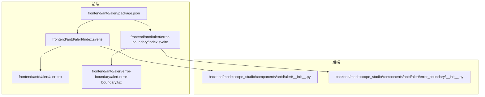
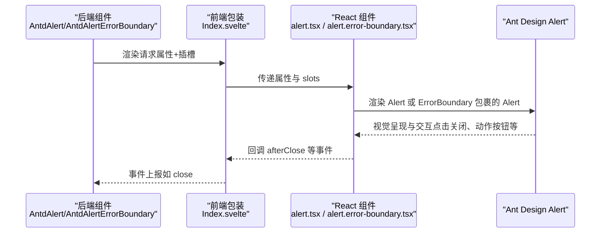
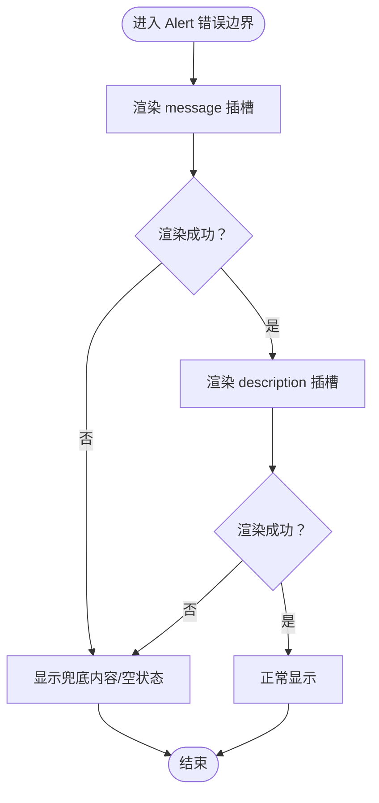
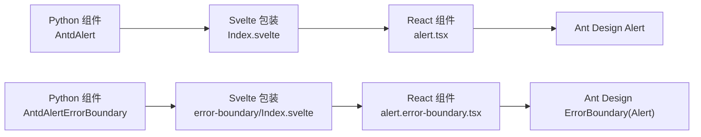

# Alert 警告提示

<cite>
**本文引用的文件**
- [frontend/antd/alert/alert.tsx](file://frontend/antd/alert/alert.tsx)
- [frontend/antd/alert/Index.svelte](file://frontend/antd/alert/Index.svelte)
- [frontend/antd/alert/error-boundary/alert.error-boundary.tsx](file://frontend/antd/alert/error-boundary/alert.error-boundary.tsx)
- [frontend/antd/alert/error-boundary/Index.svelte](file://frontend/antd/alert/error-boundary/Index.svelte)
- [backend/modelscope_studio/components/antd/alert/__init__.py](file://backend/modelscope_studio/components/antd/alert/__init__.py)
- [backend/modelscope_studio/components/antd/alert/error_boundary/__init__.py](file://backend/modelscope_studio/components/antd/alert/error_boundary/__init__.py)
- [frontend/antd/alert/package.json](file://frontend/antd/alert/package.json)
- [docs/components/antd/alert/README-zh_CN.md](file://docs/components/antd/alert/README-zh_CN.md)
- [docs/components/antd/alert/README.md](file://docs/components/antd/alert/README.md)
</cite>

## 目录

1. [简介](#简介)
2. [项目结构](#项目结构)
3. [核心组件](#核心组件)
4. [架构总览](#架构总览)
5. [详细组件分析](#详细组件分析)
6. [依赖关系分析](#依赖关系分析)
7. [性能考虑](#性能考虑)
8. [故障排查指南](#故障排查指南)
9. [结论](#结论)
10. [附录](#附录)

## 简介

Alert 警告提示用于向用户传达需要关注的信息或状态反馈，常用于表单验证提示、操作结果反馈、系统通知等场景。本组件基于 Ant Design 的 Alert 组件进行封装，提供类型化（成功、信息、警告、错误）、可关闭、图标与描述插槽、以及错误边界包装能力，确保在复杂渲染场景下仍能稳定呈现。

## 项目结构

Alert 组件由前端 Svelte 包装层与后端 Gradio 组件层共同构成，并提供独立的错误边界版本以增强稳定性。

图表来源

- [frontend/antd/alert/Index.svelte:10-47](file://frontend/antd/alert/Index.svelte#L10-L47)
- [frontend/antd/alert/alert.tsx:7-43](file://frontend/antd/alert/alert.tsx#L7-L43)
- [frontend/antd/alert/error-boundary/Index.svelte:10-47](file://frontend/antd/alert/error-boundary/Index.svelte#L10-L47)
- [frontend/antd/alert/error-boundary/alert.error-boundary.tsx:6-32](file://frontend/antd/alert/error-boundary/alert.error-boundary.tsx#L6-L32)
- [backend/modelscope_studio/components/antd/alert/**init**.py:11-71](file://backend/modelscope_studio/components/antd/alert/__init__.py#L11-L71)
- [backend/modelscope_studio/components/antd/alert/error_boundary/**init**.py:10-55](file://backend/modelscope_studio/components/antd/alert/error_boundary/__init__.py#L10-L55)
- [frontend/antd/alert/package.json:1-15](file://frontend/antd/alert/package.json#L1-L15)

章节来源

- [frontend/antd/alert/Index.svelte:1-66](file://frontend/antd/alert/Index.svelte#L1-L66)
- [frontend/antd/alert/alert.tsx:1-46](file://frontend/antd/alert/alert.tsx#L1-L46)
- [frontend/antd/alert/error-boundary/Index.svelte:1-70](file://frontend/antd/alert/error-boundary/Index.svelte#L1-L70)
- [frontend/antd/alert/error-boundary/alert.error-boundary.tsx:1-35](file://frontend/antd/alert/error-boundary/alert.error-boundary.tsx#L1-L35)
- [backend/modelscope_studio/components/antd/alert/**init**.py:1-89](file://backend/modelscope_studio/components/antd/alert/__init__.py#L1-L89)
- [backend/modelscope_studio/components/antd/alert/error_boundary/**init**.py:1-73](file://backend/modelscope_studio/components/antd/alert/error_boundary/__init__.py#L1-L73)
- [frontend/antd/alert/package.json:1-15](file://frontend/antd/alert/package.json#L1-L15)

## 核心组件

- 前端主组件：负责将 Ant Design 的 Alert 包装为 Svelte 可消费的形式，支持 slots 插槽（action、closable.closeIcon、description、icon、message），并透传属性与事件回调。
- 错误边界组件：对 Alert 进行错误边界包裹，保证子树异常不会导致整个界面崩溃，同时保留消息与描述的插槽能力。
- 后端 Gradio 组件：提供类型化参数（type）、插槽映射、事件绑定（close）与样式/类名注入能力；错误边界版本同样提供对应事件与插槽。

章节来源

- [frontend/antd/alert/alert.tsx:7-43](file://frontend/antd/alert/alert.tsx#L7-L43)
- [frontend/antd/alert/error-boundary/alert.error-boundary.tsx:6-32](file://frontend/antd/alert/error-boundary/alert.error-boundary.tsx#L6-L32)
- [backend/modelscope_studio/components/antd/alert/**init**.py:11-71](file://backend/modelscope_studio/components/antd/alert/__init__.py#L11-L71)
- [backend/modelscope_studio/components/antd/alert/error_boundary/**init**.py:10-55](file://backend/modelscope_studio/components/antd/alert/error_boundary/__init__.py#L10-L55)

## 架构总览

以下序列图展示了从后端 Gradio 组件到前端 Svelte 包装层再到 Ant Design 组件的调用链路，以及错误边界包装的路径。

图表来源

- [backend/modelscope_studio/components/antd/alert/**init**.py:11-71](file://backend/modelscope_studio/components/antd/alert/__init__.py#L11-L71)
- [frontend/antd/alert/Index.svelte:10-47](file://frontend/antd/alert/Index.svelte#L10-L47)
- [frontend/antd/alert/alert.tsx:12-42](file://frontend/antd/alert/alert.tsx#L12-L42)
- [frontend/antd/alert/error-boundary/alert.error-boundary.tsx:17-29](file://frontend/antd/alert/error-boundary/alert.error-boundary.tsx#L17-L29)

## 详细组件分析

### 类型与语义

- 类型（type）支持：success、info、warning、error。分别对应不同的视觉强调与语义含义，便于用户快速识别状态。
- 语义建议：
  - 成功：操作完成、流程结束等正向反馈
  - 信息：一般性提示、补充说明
  - 警告：潜在问题、需注意的操作
  - 错误：失败、异常、需要立即处理的问题

章节来源

- [backend/modelscope_studio/components/antd/alert/**init**.py:37-37](file://backend/modelscope_studio/components/antd/alert/__init__.py#L37-L37)

### 插槽与可定制点

- 支持插槽：
  - action：自定义操作区域（如“查看详情”按钮）
  - closable.closeIcon：自定义关闭图标
  - description：辅助描述文本/富内容
  - icon：自定义图标
  - message：标题/消息主体
- 属性透传：除上述插槽外，其余属性直接透传至 Ant Design Alert，包括 closable、show_icon、banner、after_close 等。

章节来源

- [backend/modelscope_studio/components/antd/alert/**init**.py:22-23](file://backend/modelscope_studio/components/antd/alert/__init__.py#L22-L23)
- [frontend/antd/alert/alert.tsx:11-43](file://frontend/antd/alert/alert.tsx#L11-L43)

### 事件与交互

- close 事件：当用户点击关闭按钮时触发，后端可通过事件监听器绑定处理逻辑。
- after_close 回调：在动画结束后触发，可用于清理资源或切换状态。
- 键盘操作：默认遵循 Ant Design 行为，通常通过 Tab 导航聚焦关闭按钮，Enter/Space 触发关闭。

章节来源

- [backend/modelscope_studio/components/antd/alert/**init**.py:16-20](file://backend/modelscope_studio/components/antd/alert/__init__.py#L16-L20)
- [frontend/antd/alert/alert.tsx:13-13](file://frontend/antd/alert/alert.tsx#L13-L13)

### 错误边界（Error Boundary）

- 作用：对 Alert 子树进行错误捕获，避免单个插槽或内容渲染异常导致整页崩溃。
- 使用场景：当 message/description 等插槽中包含动态渲染或外部数据时，建议使用错误边界版本。
- 事件：同样支持 close 事件，便于统一处理关闭行为。

图表来源

- [frontend/antd/alert/error-boundary/alert.error-boundary.tsx:17-29](file://frontend/antd/alert/error-boundary/alert.error-boundary.tsx#L17-L29)

章节来源

- [frontend/antd/alert/error-boundary/alert.error-boundary.tsx:6-32](file://frontend/antd/alert/error-boundary/alert.error-boundary.tsx#L6-L32)
- [backend/modelscope_studio/components/antd/alert/error_boundary/**init**.py:10-55](file://backend/modelscope_studio/components/antd/alert/error_boundary/__init__.py#L10-L55)

### 样式与类名

- 支持通过 elem_id、elem_classes、elem_style 注入基础样式与标识。
- 主要类名前缀：
  - ms-gr-antd-alert：主 Alert 组件
  - ms-gr-antd-alert-error-boundary：错误边界版本
- 可结合 Ant Design 自身的 type、show_icon、closable 等属性控制外观。

章节来源

- [frontend/antd/alert/Index.svelte:53-53](file://frontend/antd/alert/Index.svelte#L53-L53)
- [frontend/antd/alert/error-boundary/Index.svelte:56-56](file://frontend/antd/alert/error-boundary/Index.svelte#L56-L56)

### 无障碍与键盘支持

- 无障碍：遵循 Ant Design 默认可访问性设计，确保屏幕阅读器可读取消息与描述。
- 键盘：Tab 导航至关闭按钮，Enter/Space 关闭；建议在 action 中提供明确的可访问名称。

章节来源

- [frontend/antd/alert/alert.tsx:17-40](file://frontend/antd/alert/alert.tsx#L17-L40)

### 典型使用场景

- 表单验证提示：使用 info/warning/error 类型，配合 description 提供具体错误信息，action 提供“查看详情”。
- 操作反馈：成功后使用 success 类型，展示简短消息与 icon。
- 系统通知：使用 banner 模式与 closable，提升可见性与可控性。
- 动态内容：当 message/description 来自外部数据或异步渲染时，优先使用错误边界版本。

章节来源

- [docs/components/antd/alert/README-zh_CN.md:1-8](file://docs/components/antd/alert/README-zh_CN.md#L1-L8)
- [docs/components/antd/alert/README.md:1-8](file://docs/components/antd/alert/README.md#L1-L8)

## 依赖关系分析

- 前端导出：通过 package.json 将 Gradio 与默认入口指向 Index.svelte，确保后端按约定加载。
- 组件耦合：前端包装层与 Ant Design 组件强耦合，但通过 slots 与属性透传保持高扩展性。
- 后端集成：后端组件通过 resolve_frontend_dir 解析前端目录，事件与插槽在 Python 层声明，运行时由前端执行。

图表来源

- [frontend/antd/alert/package.json:4-12](file://frontend/antd/alert/package.json#L4-L12)
- [backend/modelscope_studio/components/antd/alert/**init**.py:71-71](file://backend/modelscope_studio/components/antd/alert/__init__.py#L71-L71)
- [backend/modelscope_studio/components/antd/alert/error_boundary/**init**.py:55-55](file://backend/modelscope_studio/components/antd/alert/error_boundary/__init__.py#L55-L55)

章节来源

- [frontend/antd/alert/package.json:1-15](file://frontend/antd/alert/package.json#L1-L15)
- [backend/modelscope_studio/components/antd/alert/**init**.py:71-71](file://backend/modelscope_studio/components/antd/alert/__init__.py#L71-L71)
- [backend/modelscope_studio/components/antd/alert/error_boundary/**init**.py:55-55](file://backend/modelscope_studio/components/antd/alert/error_boundary/__init__.py#L55-L55)

## 性能考虑

- 避免频繁重渲染：message/description/icon 等插槽尽量使用稳定值，必要时在上层缓存计算结果。
- 控制插槽复杂度：复杂子树建议拆分组件并在错误边界内使用，降低整体渲染压力。
- 合理使用 banner：banner 模式会占据更多空间，仅在关键提示时启用。
- 事件节流：after_close 与 close 事件回调中避免重型同步操作，必要时使用微任务或防抖。

## 故障排查指南

- 插槽不生效
  - 检查插槽名称是否正确（action、closable.closeIcon、description、icon、message）。
  - 确认前端包装层已透传 slots 至 React 组件。
- 关闭事件未触发
  - 确认后端事件监听器已注册 close 事件。
  - 检查 closable 是否为对象且包含 closeIcon 插槽时，是否正确透传。
- 错误边界未捕获异常
  - 确认使用的是错误边界版本组件。
  - 检查 message/description 插槽中的异常是否被正确包裹。
- 样式未生效
  - 检查 elem_id、elem_classes、elem_style 是否正确传入。
  - 确认类名前缀 ms-gr-antd-alert 或 ms-gr-antd-alert-error-boundary 已应用。

章节来源

- [frontend/antd/alert/alert.tsx:11-43](file://frontend/antd/alert/alert.tsx#L11-L43)
- [frontend/antd/alert/error-boundary/alert.error-boundary.tsx:12-29](file://frontend/antd/alert/error-boundary/alert.error-boundary.tsx#L12-L29)
- [backend/modelscope_studio/components/antd/alert/**init**.py:16-23](file://backend/modelscope_studio/components/antd/alert/__init__.py#L16-L23)
- [backend/modelscope_studio/components/antd/alert/error_boundary/**init**.py:14-21](file://backend/modelscope_studio/components/antd/alert/error_boundary/__init__.py#L14-L21)

## 结论

Alert 警告提示组件在本项目中提供了类型化、可插槽、可关闭与错误边界保护的完整能力。通过前后端清晰的职责划分与稳定的导出约定，既能满足常规提示需求，也能在复杂渲染场景下保持健壮性。建议在涉及动态/外部内容时优先采用错误边界版本，并结合事件与样式系统实现一致的用户体验。

## 附录

- 示例入口参考：文档中提供的 demo 名称为 basic，可在对应文档页面查看演示效果。

章节来源

- [docs/components/antd/alert/README-zh_CN.md:5-7](file://docs/components/antd/alert/README-zh_CN.md#L5-L7)
- [docs/components/antd/alert/README.md:5-7](file://docs/components/antd/alert/README.md#L5-L7)
