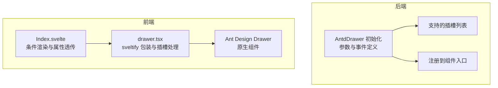
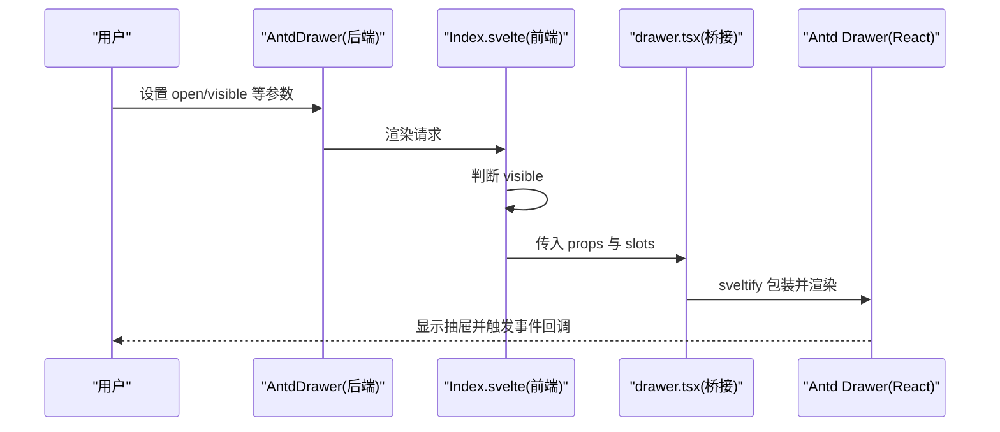
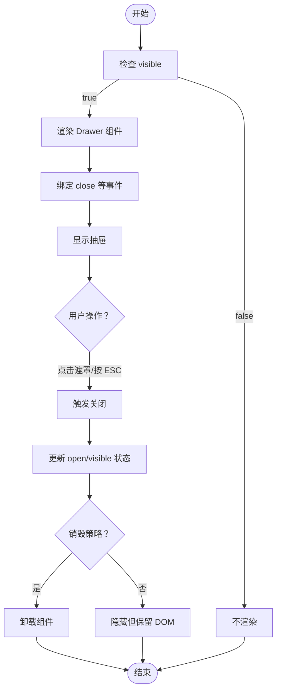
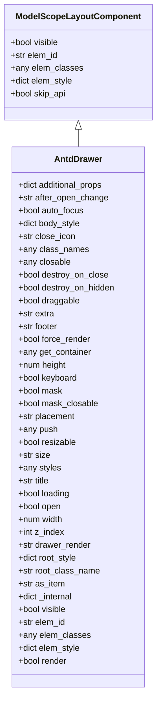

# Drawer 抽屉

<cite>
**本文引用的文件**
- [frontend/antd/drawer/drawer.tsx](file://frontend/antd/drawer/drawer.tsx)
- [frontend/antd/drawer/Index.svelte](file://frontend/antd/drawer/Index.svelte)
- [backend/modelscope_studio/components/antd/drawer/__init__.py](file://backend/modelscope_studio/components/antd/drawer/__init__.py)
- [backend/modelscope_studio/components/antd/components.py](file://backend/modelscope_studio/components/antd/components.py)
- [backend/modelscope_studio/utils/dev/component.py](file://backend/modelscope_studio/utils/dev/component.py)
- [docs/components/antd/drawer/README.md](file://docs/components/antd/drawer/README.md)
- [docs/components/antd/drawer/README-zh_CN.md](file://docs/components/antd/drawer/README-zh_CN.md)
- [docs/components/antd/watermark/demos/modal_or_drawer.py](file://docs/components/antd/watermark/demos/modal_or_drawer.py)
- [frontend/antd/layout/layout.base.tsx](file://frontend/antd/layout/layout.base.tsx)
</cite>

## 目录

1. [简介](#简介)
2. [项目结构](#项目结构)
3. [核心组件](#核心组件)
4. [架构总览](#架构总览)
5. [详细组件分析](#详细组件分析)
6. [依赖关系分析](#依赖关系分析)
7. [性能考量](#性能考量)
8. [故障排查指南](#故障排查指南)
9. [结论](#结论)
10. [附录](#附录)

## 简介

Drawer 抽屉是一个从屏幕边缘滑出的面板，常用于承载侧边栏导航、详情面板、设置面板等场景。本组件基于 Ant Design Drawer 实现，并通过 Gradio 生态进行桥接，支持位置配置（左、右、上、下）、尺寸控制、遮罩行为、键盘交互以及丰富的插槽扩展能力。本文将系统阐述其布局设计、交互模式、使用场景与最佳实践，并提供可直接参考的示例路径。

## 项目结构

Drawer 组件在前端与后端分别由 Svelte 前端包装器与 Python 后端组件构成，二者通过 Gradio 的桥接机制协同工作。整体结构如下：

图表来源

- [frontend/antd/drawer/Index.svelte:10-61](file://frontend/antd/drawer/Index.svelte#L10-L61)
- [frontend/antd/drawer/drawer.tsx:14-57](file://frontend/antd/drawer/drawer.tsx#L14-L57)
- [backend/modelscope_studio/components/antd/drawer/**init**.py:10-108](file://backend/modelscope_studio/components/antd/drawer/__init__.py#L10-L108)
- [backend/modelscope_studio/components/antd/components.py:38](file://backend/modelscope_studio/components/antd/components.py#L38)

章节来源

- [frontend/antd/drawer/Index.svelte:1-65](file://frontend/antd/drawer/Index.svelte#L1-L65)
- [frontend/antd/drawer/drawer.tsx:1-60](file://frontend/antd/drawer/drawer.tsx#L1-L60)
- [backend/modelscope_studio/components/antd/drawer/**init**.py:1-126](file://backend/modelscope_studio/components/antd/drawer/__init__.py#L1-L126)
- [backend/modelscope_studio/components/antd/components.py:38](file://backend/modelscope_studio/components/antd/components.py#L38)

## 核心组件

- 后端组件：AntdDrawer（Python）
  - 支持的参数覆盖位置、尺寸、遮罩、键盘、推挤、渲染策略等关键行为
  - 定义了 close 事件绑定机制
  - 暴露多个插槽以支持自定义标题、页脚、额外操作、关闭图标等
- 前端包装器：Index.svelte 与 drawer.tsx
  - 条件渲染：仅在 visible 为真时加载并挂载 Drawer
  - 属性透传：将 Gradio 属性与额外属性合并传递给底层组件
  - 插槽处理：支持 closeIcon、closable.closeIcon、extra、footer、title、drawerRender 等插槽
- 基础布局组件：Base（layout.base.tsx）
  - 提供 Ant Design Layout 的基础封装，便于与 Drawer 协同构建页面布局

章节来源

- [backend/modelscope_studio/components/antd/drawer/**init**.py:10-108](file://backend/modelscope_studio/components/antd/drawer/__init__.py#L10-L108)
- [frontend/antd/drawer/Index.svelte:13-42](file://frontend/antd/drawer/Index.svelte#L13-L42)
- [frontend/antd/drawer/drawer.tsx:14-57](file://frontend/antd/drawer/drawer.tsx#L14-L57)
- [frontend/antd/layout/layout.base.tsx:6-37](file://frontend/antd/layout/layout.base.tsx#L6-L37)

## 架构总览

Drawer 的调用链路从后端 AntdDrawer 开始，经由前端 Index.svelte 条件渲染，再由 drawer.tsx 使用 sveltify 将 React 组件桥接到 Svelte 环境，最终渲染为 Ant Design Drawer。该流程确保了参数与事件的双向绑定，同时保留了 Ant Design Drawer 的全部能力。

图表来源

- [frontend/antd/drawer/Index.svelte:48-61](file://frontend/antd/drawer/Index.svelte#L48-L61)
- [frontend/antd/drawer/drawer.tsx:24-56](file://frontend/antd/drawer/drawer.tsx#L24-L56)
- [backend/modelscope_studio/components/antd/drawer/**init**.py:14-18](file://backend/modelscope_studio/components/antd/drawer/__init__.py#L14-L18)

## 详细组件分析

### 参数与插槽总览

- 关键参数（节选）
  - 位置与尺寸：placement（left/right/top/bottom）、width、height、size（default/large）
  - 行为控制：open、keyboard、mask、maskClosable、closable、destroyOnClose、destroyOnHidden、forceRender
  - 布局与渲染：getContainer、push、resizable、drawerRender、as_item、visible、elem_id/elem_classes/elem_style
- 插槽（slots）
  - closeIcon、closable.closeIcon、extra、footer、title、drawerRender

章节来源

- [backend/modelscope_studio/components/antd/drawer/**init**.py:26-107](file://backend/modelscope_studio/components/antd/drawer/__init__.py#L26-L107)
- [backend/modelscope_studio/components/antd/drawer/**init**.py:20-24](file://backend/modelscope_studio/components/antd/drawer/__init__.py#L20-L24)
- [frontend/antd/drawer/drawer.tsx:14-57](file://frontend/antd/drawer/drawer.tsx#L14-L57)

### 打开/关闭机制与事件

- 可见性控制：Index.svelte 通过 visible 控制是否渲染 Drawer
- 事件绑定：后端定义了 close 事件监听，用于在关闭时更新状态
- 回调函数：afterOpenChange 等回调通过 useFunction 转换为可安全传递的函数

图表来源

- [frontend/antd/drawer/Index.svelte:48-61](file://frontend/antd/drawer/Index.svelte#L48-L61)
- [backend/modelscope_studio/components/antd/drawer/**init**.py:14-18](file://backend/modelscope_studio/components/antd/drawer/__init__.py#L14-L18)
- [frontend/antd/drawer/drawer.tsx:24-26](file://frontend/antd/drawer/drawer.tsx#L24-L26)

### 位置配置与尺寸控制

- 位置：placement 支持 left、right、top、bottom
- 尺寸：width/height 或 size（default/large）控制抽屉大小
- 推挤与容器：push 可配合布局推动内容；getContainer 指定挂载容器

章节来源

- [backend/modelscope_studio/components/antd/drawer/**init**.py:47-50](file://backend/modelscope_studio/components/antd/drawer/__init__.py#L47-L50)
- [backend/modelscope_studio/components/antd/drawer/**init**.py:42-56](file://backend/modelscope_studio/components/antd/drawer/__init__.py#L42-L56)
- [frontend/antd/drawer/drawer.tsx:52-54](file://frontend/antd/drawer/drawer.tsx#L52-L54)

### 遮罩层行为与键盘交互

- 遮罩：mask 控制是否显示遮罩；maskClosable 控制点击遮罩是否关闭
- 键盘：keyboard 控制是否启用 ESC 关闭
- 自动聚焦：autoFocus 可在打开时自动聚焦到抽屉

章节来源

- [backend/modelscope_studio/components/antd/drawer/**init**.py:44-46](file://backend/modelscope_studio/components/antd/drawer/__init__.py#L44-L46)
- [backend/modelscope_studio/components/antd/drawer/**init**.py:31-32](file://backend/modelscope_studio/components/antd/drawer/__init__.py#L31-L32)
- [backend/modelscope_studio/components/antd/drawer/**init**.py:91](file://backend/modelscope_studio/components/antd/drawer/__init__.py#L91)

### 动画与渲染策略

- 动画：由 Ant Design Drawer 内置动画驱动，无需额外配置
- 渲染策略：destroyOnClose、destroyOnHidden、forceRender 控制销毁时机与强制渲染

章节来源

- [backend/modelscope_studio/components/antd/drawer/**init**.py:36-39](file://backend/modelscope_studio/components/antd/drawer/__init__.py#L36-L39)
- [backend/modelscope_studio/components/antd/drawer/**init**.py:87-89](file://backend/modelscope_studio/components/antd/drawer/__init__.py#L87-L89)

### 插槽与样式定制

- 插槽映射：closeIcon、closable.closeIcon、extra、footer、title、drawerRender
- 样式：elem_id、elem_classes、elem_style、styles、class_names、root_style、root_class_name
- 自定义渲染：drawerRender 可接收参数并返回自定义渲染内容

章节来源

- [backend/modelscope_studio/components/antd/drawer/**init**.py:20-24](file://backend/modelscope_studio/components/antd/drawer/__init__.py#L20-L24)
- [backend/modelscope_studio/components/antd/drawer/**init**.py:33-35](file://backend/modelscope_studio/components/antd/drawer/__init__.py#L33-L35)
- [backend/modelscope_studio/components/antd/drawer/**init**.py:57-60](file://backend/modelscope_studio/components/antd/drawer/__init__.py#L57-L60)
- [frontend/antd/drawer/drawer.tsx:41-51](file://frontend/antd/drawer/drawer.tsx#L41-L51)

### 与页面布局的协调与响应式适配

- 布局协作：可与 Ant Design Layout（Header/Footer/Content/Sider）组合使用
- 响应式：结合 Flex/Grid 等布局组件，根据屏幕尺寸调整抽屉宽度或切换 placement

章节来源

- [frontend/antd/layout/layout.base.tsx:6-37](file://frontend/antd/layout/layout.base.tsx#L6-L37)

### 无障碍访问与移动端优化

- 无障碍：keyboard 与 focus 策略需配合自动聚焦与标签语义化
- 移动端：建议在小屏设备上优先使用 bottom 或较小的 width，避免遮挡主要内容

章节来源

- [backend/modelscope_studio/components/antd/drawer/**init**.py:91](file://backend/modelscope_studio/components/antd/drawer/__init__.py#L91)
- [backend/modelscope_studio/components/antd/drawer/**init**.py:31-32](file://backend/modelscope_studio/components/antd/drawer/__init__.py#L31-L32)

### 常见应用场景与示例路径

- 侧边栏导航：在左侧抽屉中放置菜单项，点击菜单项时更新路由或数据
- 详情面板：在右侧抽屉中展示详情内容，支持滚动与底部操作区
- 设置面板：在顶部或底部抽屉中提供设置项，支持快速开关与保存
- 示例参考：
  - Drawer 基础用法与额外操作：[docs/components/antd/drawer/README.md](file://docs/components/antd/drawer/README.md)
  - Drawer 与 Modal 对比演示：[docs/components/antd/watermark/demos/modal_or_drawer.py](file://docs/components/antd/watermark/demos/modal_or_drawer.py)

章节来源

- [docs/components/antd/drawer/README.md:1-9](file://docs/components/antd/drawer/README.md#L1-L9)
- [docs/components/antd/watermark/demos/modal_or_drawer.py:19-26](file://docs/components/antd/watermark/demos/modal_or_drawer.py#L19-L26)

## 依赖关系分析

- 组件继承与上下文
  - AntdDrawer 继承自 ModelScopeLayoutComponent，具备布局组件的通用特性
  - 通过 AppContext 保证应用上下文可用
- 组件注册
  - 在组件入口中导出 AntdDrawer，便于统一导入使用

图表来源

- [backend/modelscope_studio/utils/dev/component.py:11-50](file://backend/modelscope_studio/utils/dev/component.py#L11-L50)
- [backend/modelscope_studio/components/antd/drawer/**init**.py:10-108](file://backend/modelscope_studio/components/antd/drawer/__init__.py#L10-L108)

章节来源

- [backend/modelscope_studio/utils/dev/component.py:11-50](file://backend/modelscope_studio/utils/dev/component.py#L11-L50)
- [backend/modelscope_studio/components/antd/components.py:38](file://backend/modelscope_studio/components/antd/components.py#L38)

## 性能考量

- 条件渲染：仅在 visible 为真时渲染 Drawer，减少不必要的 DOM 开销
- 渲染策略：合理使用 destroyOnClose/destroyOnHidden 以平衡内存占用与交互流畅度
- 插槽与自定义渲染：避免在 drawerRender 中执行重型计算，必要时进行缓存或异步处理

## 故障排查指南

- 抽屉不显示
  - 检查 visible/open 是否为真
  - 确认 Index.svelte 的条件渲染逻辑
- 插槽未生效
  - 确认插槽名称正确（closeIcon、closable.closeIcon、extra、footer、title、drawerRender）
  - 确认 drawer.tsx 中的插槽映射逻辑
- 关闭事件未触发
  - 检查后端事件绑定与回调函数传递
- 遮罩无效或无法点击关闭
  - 检查 mask 与 maskClosable 配置
- 键盘关闭失效
  - 检查 keyboard 配置与自动聚焦策略

章节来源

- [frontend/antd/drawer/Index.svelte:48-61](file://frontend/antd/drawer/Index.svelte#L48-L61)
- [frontend/antd/drawer/drawer.tsx:41-51](file://frontend/antd/drawer/drawer.tsx#L41-L51)
- [backend/modelscope_studio/components/antd/drawer/**init**.py:14-18](file://backend/modelscope_studio/components/antd/drawer/__init__.py#L14-L18)

## 结论

Drawer 抽屉组件通过前后端一体化的设计，在保持 Ant Design Drawer 原生能力的同时，提供了更灵活的参数与插槽扩展。借助条件渲染与事件绑定机制，它能够高效地适配多种交互场景，包括侧边导航、详情面板与设置面板等。在布局层面，可与 Ant Design Layout 协同工作；在无障碍与移动端方面，建议结合键盘与尺寸策略提升体验。

## 附录

- 示例参考
  - Drawer 基础与额外操作：[docs/components/antd/drawer/README.md](file://docs/components/antd/drawer/README.md)
  - Drawer 与 Modal 对比演示：[docs/components/antd/watermark/demos/modal_or_drawer.py](file://docs/components/antd/watermark/demos/modal_or_drawer.py)
- 相关文档
  - Ant Design Drawer 官方文档：[Ant Design Drawer](https://ant.design/components/drawer/)
