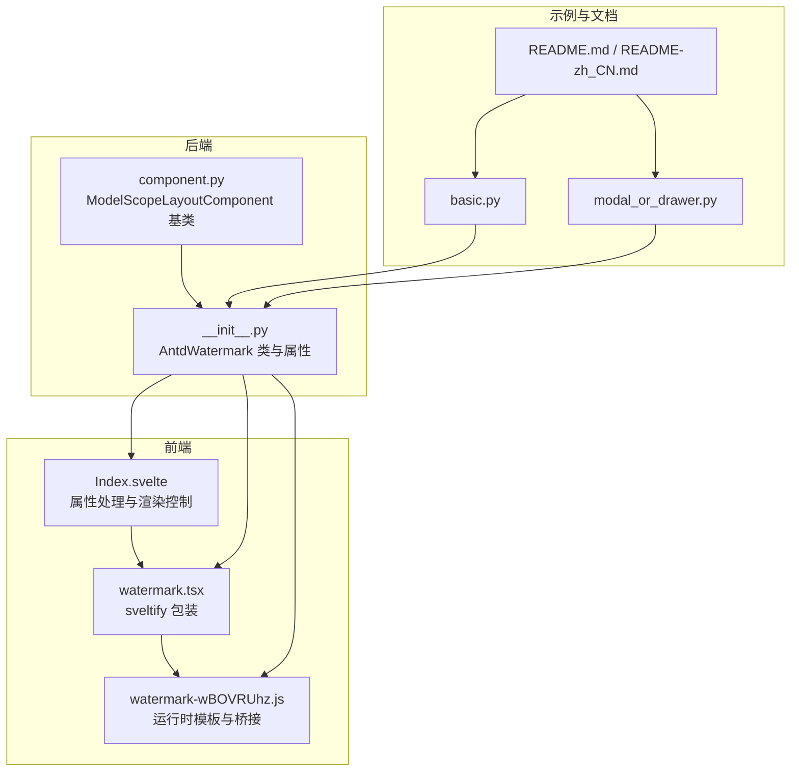
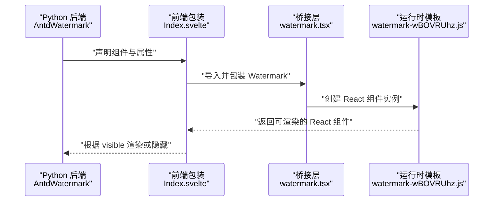
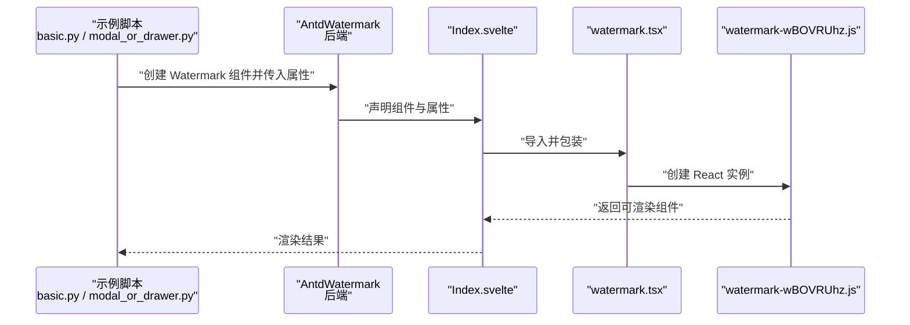
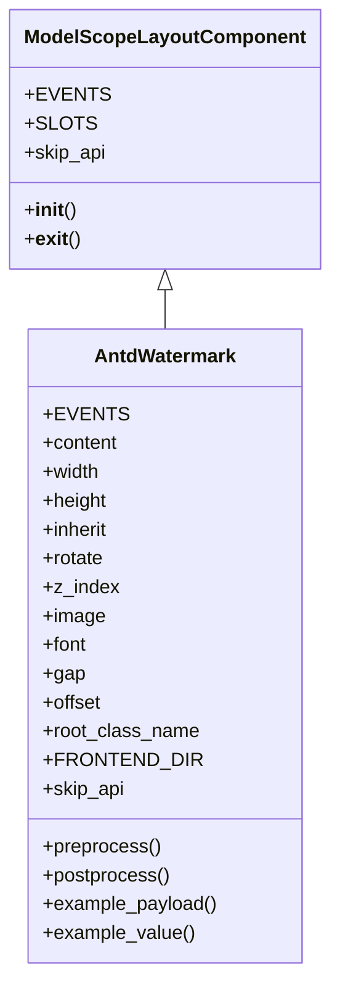
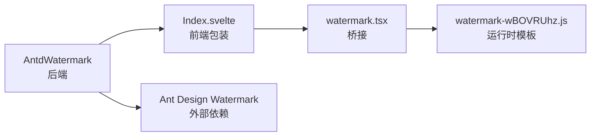

# Watermark 水印

<cite>
**本文引用的文件**
- [watermark.tsx](file://frontend/antd/watermark/watermark.tsx)
- [Index.svelte](file://frontend/antd/watermark/Index.svelte)
- [__init__.py](file://backend/modelscope_studio/components/antd/watermark/__init__.py)
- [watermark-wBOVRUhz.js](file://backend/modelscope_studio/components/antd/watermark/templates/component/watermark-wBOVRUhz.js)
- [basic.py](file://docs/components/antd/watermark/demos/basic.py)
- [modal_or_drawer.py](file://docs/components/antd/watermark/demos/modal_or_drawer.py)
- [README.md](file://docs/components/antd/watermark/README.md)
- [README-zh_CN.md](file://docs/components/antd/watermark/README-zh_CN.md)
- [app.py](file://docs/components/antd/watermark/app.py)
- [component.py](file://backend/modelscope_studio/utils/dev/component.py)
</cite>

## 目录

1. [简介](#简介)
2. [项目结构](#项目结构)
3. [核心组件](#核心组件)
4. [架构总览](#架构总览)
5. [详细组件分析](#详细组件分析)
6. [依赖关系分析](#依赖关系分析)
7. [性能考量](#性能考量)
8. [故障排查指南](#故障排查指南)
9. [结论](#结论)
10. [附录](#附录)

## 简介

Watermark 水印组件用于在页面或容器上叠加显示文本或图片水印，常用于版权保护、版本标识、客户区分等场景。本仓库中的 Watermark 组件基于 Ant Design 的 Watermark 实现，并通过 Svelte/React 桥接层在 Gradio 生态中使用。

- 功能特性
  - 文本水印：支持单行或多行文本水印。
  - 图片水印：支持自定义图片作为水印源。
  - 位置与布局：通过宽度、高度、间距、偏移等参数控制重复与排布。
  - 角度旋转与缩放：支持旋转角度与缩放比例配置。
  - 透明度与层级：支持透明度与 z-index 控制。
  - 嵌入式使用：可包裹任意子元素，随容器变化自动生效。
  - 事件绑定：支持移除事件绑定，便于动态控制。

- 应用场景
  - 版权保护：在预览图或报表上添加“受版权保护”水印。
  - 版本标识：在开发/测试环境添加“DEVELOPMENT”或“TEST”水印。
  - 客户区分：按客户或租户添加专属水印，便于识别与审计。
  - 敏感数据保护：在导出或展示界面添加水印，降低误传播风险。

- 实现原理
  - 前端桥接：通过 sveltify 将 Ant Design 的 Watermark 组件包装为 Svelte 可用组件。
  - 属性透传：将 Gradio 属性（如 elem_id、elem_classes、elem_style、visible）与额外属性合并后传递给底层组件。
  - 渲染控制：根据 visible 控制是否渲染；支持 slots 插槽与 children 子节点。
  - 后端封装：Python 层提供 AntdWatermark 类，承载属性并声明前端目录映射，同时声明事件监听。

- 使用要点
  - 文本与图片：可通过 content 或 image 参数设置；多行文本可用数组形式。
  - 重复模式：通过 width、height、gap、offset 控制重复与偏移。
  - 旋转与缩放：rotate 控制角度；z_index 控制层级。
  - 动态更新：通过 Gradio 的更新机制可动态切换水印内容与样式。
  - 样式定制：通过 elem_style、elem_classes 与额外属性进行样式扩展。

**章节来源**

- [README.md:1-9](file://docs/components/antd/watermark/README.md#L1-L9)
- [README-zh_CN.md:1-9](file://docs/components/antd/watermark/README-zh_CN.md#L1-L9)

## 项目结构

Watermark 组件在仓库中的组织方式如下：

- 前端
  - Svelte 包装层：Index.svelte 负责属性处理、可见性控制与子节点渲染。
  - React 桥接层：watermark.tsx 使用 sveltify 将 Ant Design 的 Watermark 包装为 Svelte 组件。
  - 运行时模板：watermark-wBOVRUhz.js 是组件运行时模板，负责 React 组件挂载与桥接逻辑。
- 后端
  - Python 封装：AntdWatermark 类承载属性与事件，声明前端目录映射。
- 示例与文档
  - 基础示例：basic.py 展示文本与图片水印的基本用法。
  - 弹窗示例：modal_or_drawer.py 展示在 Modal/Drawer 中使用水印的方法。
  - 文档页：README/README-zh_CN.md 提供示例占位与链接。

**图表来源**

- [Index.svelte:1-64](file://frontend/antd/watermark/Index.svelte#L1-L64)
- [watermark.tsx:1-6](file://frontend/antd/watermark/watermark.tsx#L1-L6)
- [watermark-wBOVRUhz.js:1-442](file://backend/modelscope_studio/components/antd/watermark/templates/component/watermark-wBOVRUhz.js#L1-L442)
- [**init**.py:1-83](file://backend/modelscope_studio/components/antd/watermark/__init__.py#L1-L83)
- [component.py:1-169](file://backend/modelscope_studio/utils/dev/component.py#L1-L169)
- [basic.py:1-23](file://docs/components/antd/watermark/demos/basic.py#L1-L23)
- [modal_or_drawer.py:1-30](file://docs/components/antd/watermark/demos/modal_or_drawer.py#L1-L30)
- [README.md:1-9](file://docs/components/antd/watermark/README.md#L1-L9)
- [README-zh_CN.md:1-9](file://docs/components/antd/watermark/README-zh_CN.md#L1-L9)

**章节来源**

- [Index.svelte:1-64](file://frontend/antd/watermark/Index.svelte#L1-L64)
- [watermark.tsx:1-6](file://frontend/antd/watermark/watermark.tsx#L1-L6)
- [watermark-wBOVRUhz.js:1-442](file://backend/modelscope_studio/components/antd/watermark/templates/component/watermark-wBOVRUhz.js#L1-L442)
- [**init**.py:1-83](file://backend/modelscope_studio/components/antd/watermark/__init__.py#L1-L83)
- [component.py:1-169](file://backend/modelscope_studio/utils/dev/component.py#L1-L169)
- [README.md:1-9](file://docs/components/antd/watermark/README.md#L1-L9)
- [README-zh_CN.md:1-9](file://docs/components/antd/watermark/README-zh_CN.md#L1-L9)

## 核心组件

- AntdWatermark（后端）
  - 职责：承载水印组件的属性与事件，声明前端目录映射，跳过 API 调用。
  - 关键属性（来自构造函数）：content、width、height、inherit、rotate、z_index、image、font、gap、offset、root_class_name 等。
  - 事件：remove（绑定移除事件）。
  - 其他：skip_api 返回 True，表示该组件不参与标准 API 流程。

- Watermark（前端桥接）
  - 职责：通过 sveltify 将 Ant Design 的 Watermark 组件包装为 Svelte 组件，便于在 Gradio 中使用。
  - 行为：直接导出 Watermark 并默认导出。

- Index.svelte（前端包装）
  - 职责：处理 Gradio 属性（elem_id、elem_classes、elem_style、visible），合并额外属性，控制可见性与子节点渲染。
  - 行为：当 visible 为真时，异步加载 Watermark 并渲染；支持 slots 与 children。

- 运行时模板（watermark-wBOVRUhz.js）
  - 职责：提供 React 组件桥接、上下文合并、Portal 渲染与效果注册等能力，确保组件在浏览器环境中正确挂载与更新。

**章节来源**

- [**init**.py:8-83](file://backend/modelscope_studio/components/antd/watermark/__init__.py#L8-L83)
- [watermark.tsx:1-6](file://frontend/antd/watermark/watermark.tsx#L1-L6)
- [Index.svelte:1-64](file://frontend/antd/watermark/Index.svelte#L1-L64)
- [watermark-wBOVRUhz.js:330-442](file://backend/modelscope_studio/components/antd/watermark/templates/component/watermark-wBOVRUhz.js#L330-L442)

## 架构总览

下图展示了从 Python 到前端再到运行时的整体调用链路与职责分工：

**图表来源**

- [**init**.py:66-66](file://backend/modelscope_studio/components/antd/watermark/__init__.py#L66-L66)
- [Index.svelte:10-63](file://frontend/antd/watermark/Index.svelte#L10-L63)
- [watermark.tsx:1-6](file://frontend/antd/watermark/watermark.tsx#L1-L6)
- [watermark-wBOVRUhz.js:330-442](file://backend/modelscope_studio/components/antd/watermark/templates/component/watermark-wBOVRUhz.js#L330-L442)

## 详细组件分析

### 属性与配置

- 文本水印
  - content：字符串或字符串数组，用于设置水印文本；支持多行文本。
  - font：字体相关配置（如颜色、字号等），由底层 Ant Design 支持。
- 图片水印
  - image：图片地址，用于设置图片水印源。
- 重复与布局
  - width、height：水印单元的宽高。
  - gap：水印之间的水平与垂直间距。
  - offset：水印的初始偏移量（通常用于控制起始位置）。
- 旋转与缩放
  - rotate：水印旋转角度。
  - inherit：是否继承父级样式。
- 层级与透明度
  - z_index：水印层级。
  - 其他样式：通过 elem_style 与 elem_classes 控制透明度、背景等。
- 其他
  - root_class_name：根节点类名前缀。
  - additional_props：额外属性透传。

- 动态更新与样式定制
  - visible：控制组件是否渲染。
  - elem_id、elem_classes、elem_style：用于定位与样式定制。
  - slots 与 children：支持插槽与子节点渲染。

**章节来源**

- [**init**.py:50-64](file://backend/modelscope_studio/components/antd/watermark/__init__.py#L50-L64)
- [Index.svelte:21-44](file://frontend/antd/watermark/Index.svelte#L21-L44)
- [watermark.tsx:1-6](file://frontend/antd/watermark/watermark.tsx#L1-L6)

### 使用流程与示例

- 基础文本水印
  - 在容器内嵌套 Watermark，并设置 content 为字符串或数组。
  - 可参考示例：basic.py。
- 图片水印
  - 设置 image 为图片地址，配合 width、height 控制水印尺寸。
  - 可参考示例：basic.py。
- 在弹窗/抽屉中使用
  - 在 Modal/Drawer 外层包裹 Watermark，实现弹窗内的水印覆盖。
  - 可参考示例：modal_or_drawer.py。

**图表来源**

- [basic.py:1-23](file://docs/components/antd/watermark/demos/basic.py#L1-L23)
- [modal_or_drawer.py:1-30](file://docs/components/antd/watermark/demos/modal_or_drawer.py#L1-L30)
- [**init**.py:8-83](file://backend/modelscope_studio/components/antd/watermark/__init__.py#L8-L83)
- [Index.svelte:50-63](file://frontend/antd/watermark/Index.svelte#L50-L63)
- [watermark.tsx:1-6](file://frontend/antd/watermark/watermark.tsx#L1-L6)
- [watermark-wBOVRUhz.js:330-442](file://backend/modelscope_studio/components/antd/watermark/templates/component/watermark-wBOVRUhz.js#L330-L442)

**章节来源**

- [basic.py:1-23](file://docs/components/antd/watermark/demos/basic.py#L1-L23)
- [modal_or_drawer.py:1-30](file://docs/components/antd/watermark/demos/modal_or_drawer.py#L1-L30)

### 事件与生命周期

- remove 事件
  - 通过事件监听绑定，可在需要时移除水印。
  - 事件回调会更新内部状态以启用移除行为。

**章节来源**

- [**init**.py:12-16](file://backend/modelscope_studio/components/antd/watermark/__init__.py#L12-L16)

### 类关系图

**图表来源**

- [component.py:11-127](file://backend/modelscope_studio/utils/dev/component.py#L11-L127)
- [**init**.py:8-83](file://backend/modelscope_studio/components/antd/watermark/__init__.py#L8-L83)

## 依赖关系分析

- 组件耦合
  - AntdWatermark 依赖于前端目录映射与运行时模板，确保在浏览器中正确渲染。
  - Index.svelte 依赖于包装层与运行时模板，负责属性处理与可见性控制。
  - watermark.tsx 仅负责桥接，耦合度低，便于维护。
- 外部依赖
  - Ant Design Watermark：底层实现。
  - Svelte/React 桥接工具：sveltify、@svelte-preprocess-react 等。
- 潜在问题
  - 若未正确设置 FRONTEND_DIR，可能导致前端资源无法加载。
  - visible 为假时不会渲染，需注意动态切换时的副作用。

**图表来源**

- [**init**.py:66-66](file://backend/modelscope_studio/components/antd/watermark/__init__.py#L66-L66)
- [Index.svelte:10-10](file://frontend/antd/watermark/Index.svelte#L10-L10)
- [watermark.tsx:1-1](file://frontend/antd/watermark/watermark.tsx#L1-L1)
- [watermark-wBOVRUhz.js:330-330](file://backend/modelscope_studio/components/antd/watermark/templates/component/watermark-wBOVRUhz.js#L330-L330)

**章节来源**

- [**init**.py:66-66](file://backend/modelscope_studio/components/antd/watermark/__init__.py#L66-L66)
- [Index.svelte:10-10](file://frontend/antd/watermark/Index.svelte#L10-L10)
- [watermark.tsx:1-1](file://frontend/antd/watermark/watermark.tsx#L1-L1)
- [watermark-wBOVRUhz.js:330-330](file://backend/modelscope_studio/components/antd/watermark/templates/component/watermark-wBOVRUhz.js#L330-L330)

## 性能考量

- 渲染开销
  - 水印本质上是叠加在容器上的背景层，对主内容渲染影响较小；但大量重复单元可能增加绘制成本。
- 重绘与重排
  - 频繁变更 content、image、rotate、z_index 等属性可能触发重绘；建议批量更新或减少变更频率。
- 图片水印
  - 图片加载与解码会带来额外开销；建议使用合适尺寸与格式的图片，避免超大图片导致卡顿。
- 可见性控制
  - 通过 visible 控制渲染时机，可有效减少不必要的开销。
- 建议
  - 合理设置 width、height、gap，避免过度密集的重复。
  - 对于频繁切换的场景，优先使用缓存与节流策略。
  - 在弹窗/抽屉中使用时，注意弹窗打开/关闭时的渲染时机。

[本节为通用性能建议，无需特定文件来源]

## 故障排查指南

- 无法显示水印
  - 检查 visible 是否为真；确认属性是否正确透传到组件。
  - 确认 FRONTEND_DIR 是否正确指向前端目录。
- 图片水印不显示
  - 检查 image 地址是否可访问；确认图片尺寸与格式合理。
  - 调整 width、height 使其适配容器。
- 旋转或层级异常
  - 检查 rotate、z_index 设置是否符合预期；确认是否有其他样式覆盖。
- 动态更新无效
  - 确认更新逻辑是否正确；必要时使用重新渲染策略。
- 事件未生效
  - 确认已绑定 remove 事件；检查事件回调是否正确执行。

**章节来源**

- [Index.svelte:50-63](file://frontend/antd/watermark/Index.svelte#L50-L63)
- [**init**.py:66-66](file://backend/modelscope_studio/components/antd/watermark/__init__.py#L66-L66)

## 结论

Watermark 组件通过简洁的属性体系与稳定的桥接机制，在 Gradio 生态中提供了灵活的水印能力。其支持文本与图片水印、重复布局、旋转缩放与层级控制，适用于版权保护、版本标识与客户区分等多种场景。结合可见性控制与事件绑定，可实现动态化与可维护的水印方案。

[本节为总结性内容，无需特定文件来源]

## 附录

### 常见使用场景示例路径

- 版权保护：在预览图或报表容器上添加“受版权保护”的文本或图片水印。
- 版本标识：在开发/测试环境添加“DEVELOPMENT”或“TEST”水印。
- 客户区分：按客户或租户添加专属水印，便于识别与审计。
- 导出保护：在导出界面或打印预览中添加水印，降低误传播风险。

**章节来源**

- [basic.py:1-23](file://docs/components/antd/watermark/demos/basic.py#L1-L23)
- [modal_or_drawer.py:1-30](file://docs/components/antd/watermark/demos/modal_or_drawer.py#L1-L30)

### 属性配置速查

- 文本水印：content（字符串或数组）、font
- 图片水印：image、width、height
- 重复与布局：gap、offset
- 旋转与层级：rotate、z_index
- 样式与可见性：elem_style、elem_classes、elem_id、visible
- 其他：root_class_name、additional_props

**章节来源**

- [**init**.py:50-64](file://backend/modelscope_studio/components/antd/watermark/__init__.py#L50-L64)
- [Index.svelte:21-44](file://frontend/antd/watermark/Index.svelte#L21-L44)

### 安全与防篡改建议

- 内容来源可信：确保 content 与 image 来源可信，避免注入恶意内容。
- 访问控制：限制水印组件的修改权限，防止被绕过或删除。
- 日志审计：记录水印变更日志，便于追踪与审计。
- 最小权限原则：仅授予必要的水印配置权限，避免过度授权。

[本节为通用安全建议，无需特定文件来源]

### 无障碍访问与屏幕阅读器兼容

- 文本水印
  - 确保文本语义清晰，避免使用装饰性文本。
  - 为关键信息提供替代文本或标题。
- 图片水印
  - 为图片水印提供描述性 alt 文本，便于屏幕阅读器识别。
- 交互与焦点
  - 水印不应干扰用户操作；确保可聚焦元素不受遮挡。
- 样式与对比度
  - 确保水印与背景有足够对比度，避免影响可读性。
- 可访问性测试
  - 使用屏幕阅读器与键盘导航进行测试，验证无障碍体验。

[本节为通用无障碍建议，无需特定文件来源]
