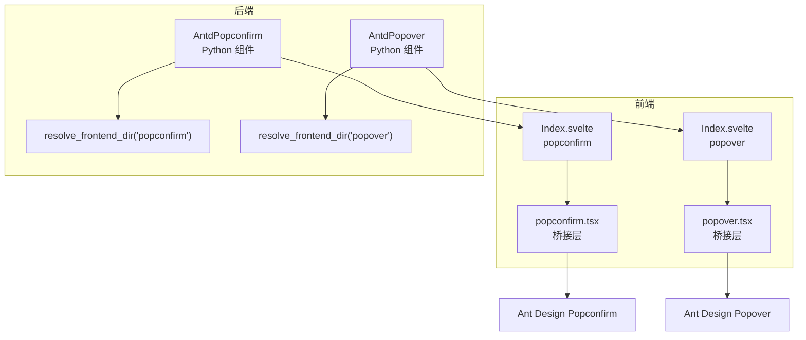
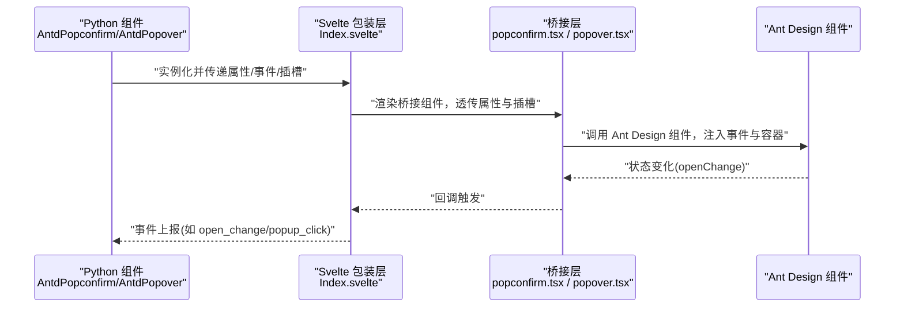
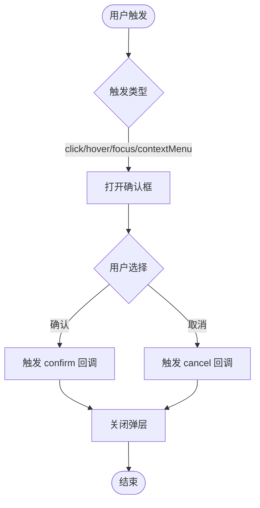
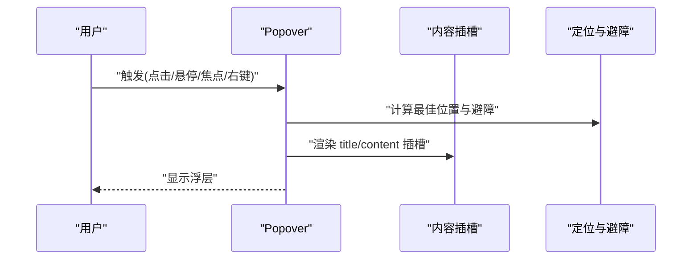
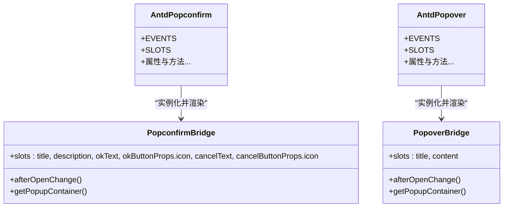
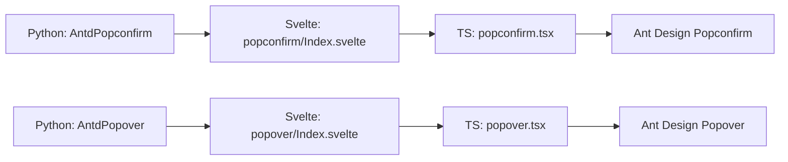

# 交互反馈组件

<cite>
**本文引用的文件**
- [frontend/antd/popconfirm/popconfirm.tsx](file://frontend/antd/popconfirm/popconfirm.tsx)
- [frontend/antd/popover/popover.tsx](file://frontend/antd/popover/popover.tsx)
- [frontend/antd/popconfirm/Index.svelte](file://frontend/antd/popconfirm/Index.svelte)
- [frontend/antd/popover/Index.svelte](file://frontend/antd/popover/Index.svelte)
- [backend/modelscope_studio/components/antd/popconfirm/__init__.py](file://backend/modelscope_studio/components/antd/popconfirm/__init__.py)
- [backend/modelscope_studio/components/antd/popover/__init__.py](file://backend/modelscope_studio/components/antd/popover/__init__.py)
- [docs/components/antd/popconfirm/README-zh_CN.md](file://docs/components/antd/popconfirm/README-zh_CN.md)
- [docs/components/antd/popover/README-zh_CN.md](file://docs/components/antd/popover/README-zh_CN.md)
</cite>

## 目录

1. [引言](#引言)
2. [项目结构](#项目结构)
3. [核心组件](#核心组件)
4. [架构总览](#架构总览)
5. [详细组件分析](#详细组件分析)
6. [依赖关系分析](#依赖关系分析)
7. [性能考量](#性能考量)
8. [故障排查指南](#故障排查指南)
9. [结论](#结论)
10. [附录](#附录)

## 引言

本文件聚焦于交互反馈组件群组中的两类：气泡确认框（Popconfirm）与气泡卡片（Popover）。我们将从设计理念、交互模式、确认流程、内容承载、触发与定位策略、属性与事件、样式定制以及常见使用场景等方面进行系统化说明，并给出可追溯到源码的参考路径，帮助开发者快速理解与正确使用。

## 项目结构

这两个组件在前端采用“Svelte 包装层 + React 组件库桥接”的模式，后端通过 Gradio 组件封装暴露 Python API。其组织方式如下：

- 前端层：Svelte 组件负责属性透传、插槽渲染与事件映射；TypeScript 桥接层将 Ant Design 的 React 组件适配为 Svelte 可用形式。
- 后端层：Python 组件类定义属性、事件、插槽与默认值，并声明前端目录映射，使运行时可加载对应前端组件。

图表来源

- [frontend/antd/popconfirm/Index.svelte:1-76](file://frontend/antd/popconfirm/Index.svelte#L1-L76)
- [frontend/antd/popover/Index.svelte:1-76](file://frontend/antd/popover/Index.svelte#L1-L76)
- [frontend/antd/popconfirm/popconfirm.tsx:1-65](file://frontend/antd/popconfirm/popconfirm.tsx#L1-L65)
- [frontend/antd/popover/popover.tsx:1-37](file://frontend/antd/popover/popover.tsx#L1-L37)
- [backend/modelscope_studio/components/antd/popconfirm/**init**.py:138-138](file://backend/modelscope_studio/components/antd/popconfirm/__init__.py#L138-L138)
- [backend/modelscope_studio/components/antd/popover/**init**.py:106-106](file://backend/modelscope_studio/components/antd/popover/__init__.py#L106-L106)

章节来源

- [frontend/antd/popconfirm/Index.svelte:1-76](file://frontend/antd/popconfirm/Index.svelte#L1-L76)
- [frontend/antd/popover/Index.svelte:1-76](file://frontend/antd/popover/Index.svelte#L1-L76)
- [backend/modelscope_studio/components/antd/popconfirm/**init**.py:138-138](file://backend/modelscope_studio/components/antd/popconfirm/__init__.py#L138-L138)
- [backend/modelscope_studio/components/antd/popover/**init**.py:106-106](file://backend/modelscope_studio/components/antd/popover/__init__.py#L106-L106)

## 核心组件

- 气泡确认框（Popconfirm）
  - 设计理念：对危险或不可逆操作进行二次确认，减少误操作风险。
  - 关键交互：支持 hover/focus/click/contextMenu 触发；提供“确认/取消”双按钮与文案/图标插槽。
  - 确认流程：点击确认触发回调；取消关闭弹层；支持 open 状态受控与受控事件回调。
- 气泡卡片（Popover）
  - 设计理念：在不改变页面布局的前提下，对目标元素进行上下文信息提示或简短操作入口。
  - 关键交互：支持 hover/focus/click/contextMenu 触发；标题与内容可插槽化，支持自动避障与定位。

章节来源

- [backend/modelscope_studio/components/antd/popconfirm/**init**.py:10-27](file://backend/modelscope_studio/components/antd/popconfirm/__init__.py#L10-L27)
- [backend/modelscope_studio/components/antd/popover/**init**.py:10-18](file://backend/modelscope_studio/components/antd/popover/__init__.py#L10-L18)

## 架构总览

下图展示了从前端 Svelte 到后端 Python 组件的调用链路与数据流。

图表来源

- [frontend/antd/popconfirm/Index.svelte:24-55](file://frontend/antd/popconfirm/Index.svelte#L24-L55)
- [frontend/antd/popover/Index.svelte:24-52](file://frontend/antd/popover/Index.svelte#L24-L52)
- [frontend/antd/popconfirm/popconfirm.tsx:17-62](file://frontend/antd/popconfirm/popconfirm.tsx#L17-L62)
- [frontend/antd/popover/popover.tsx:10-34](file://frontend/antd/popover/popover.tsx#L10-L34)
- [backend/modelscope_studio/components/antd/popconfirm/**init**.py:14-27](file://backend/modelscope_studio/components/antd/popconfirm/__init__.py#L14-L27)
- [backend/modelscope_studio/components/antd/popover/**init**.py:14-18](file://backend/modelscope_studio/components/antd/popover/__init__.py#L14-L18)

## 详细组件分析

### 气泡确认框（Popconfirm）

- 设计理念与交互模式
  - 面向“高风险操作”，通过二次确认降低误触成本。
  - 支持多种触发方式，弹层内提供确认/取消按钮与可选图标。
- 属性与事件
  - 属性要点：标题、描述、确认文案/按钮属性、取消文案/按钮属性、触发类型、定位与避障、容器挂载点、延迟、z-index 等。
  - 事件要点：open_change、cancel、confirm、popup_click。
  - 插槽要点：title、description、okText、okButtonProps.icon、cancelText、cancelButtonProps.icon。
- 回调与状态
  - 通过 afterOpenChange 获取打开/关闭状态变化。
  - 通过 getPopupContainer 自定义挂载容器，便于复杂布局下的定位与层级控制。
- 使用场景
  - 删除确认、编辑确认、批量操作确认等。

图表来源

- [backend/modelscope_studio/components/antd/popconfirm/**init**.py:14-27](file://backend/modelscope_studio/components/antd/popconfirm/__init__.py#L14-L27)
- [frontend/antd/popconfirm/popconfirm.tsx:17-62](file://frontend/antd/popconfirm/popconfirm.tsx#L17-L62)

章节来源

- [backend/modelscope_studio/components/antd/popconfirm/**init**.py:10-137](file://backend/modelscope_studio/components/antd/popconfirm/__init__.py#L10-L137)
- [frontend/antd/popconfirm/popconfirm.tsx:7-62](file://frontend/antd/popconfirm/popconfirm.tsx#L7-L62)
- [frontend/antd/popconfirm/Index.svelte:24-75](file://frontend/antd/popconfirm/Index.svelte#L24-L75)

### 气泡卡片（Popover）

- 设计理念与交互模式
  - 提供非侵入式的信息展示与轻量操作入口。
  - 支持标题与内容插槽，自动避障与多方位定位。
- 属性与事件
  - 属性要点：标题、内容、触发类型、定位、箭头、颜色、容器挂载点、延迟、z-index 等。
  - 事件要点：open_change。
  - 插槽要点：title、content。
- 使用场景
  - 信息提示、操作菜单、辅助说明等。

图表来源

- [backend/modelscope_studio/components/antd/popover/**init**.py:14-18](file://backend/modelscope_studio/components/antd/popover/__init__.py#L14-L18)
- [frontend/antd/popover/popover.tsx:10-34](file://frontend/antd/popover/popover.tsx#L10-L34)

章节来源

- [backend/modelscope_studio/components/antd/popover/**init**.py:10-104](file://backend/modelscope_studio/components/antd/popover/__init__.py#L10-L104)
- [frontend/antd/popover/popover.tsx:7-34](file://frontend/antd/popover/popover.tsx#L7-L34)
- [frontend/antd/popover/Index.svelte:24-72](file://frontend/antd/popover/Index.svelte#L24-L72)

### 组件类与桥接层关系

图表来源

- [backend/modelscope_studio/components/antd/popconfirm/**init**.py:10-37](file://backend/modelscope_studio/components/antd/popconfirm/__init__.py#L10-L37)
- [frontend/antd/popconfirm/popconfirm.tsx:7-17](file://frontend/antd/popconfirm/popconfirm.tsx#L7-L17)
- [backend/modelscope_studio/components/antd/popover/**init**.py:10-21](file://backend/modelscope_studio/components/antd/popover/__init__.py#L10-L21)
- [frontend/antd/popover/popover.tsx:7-12](file://frontend/antd/popover/popover.tsx#L7-L12)

## 依赖关系分析

- 前端依赖
  - Svelte 包装层依赖桥接层；桥接层依赖 Ant Design React 组件库。
  - 事件与插槽通过函数包装与 ReactSlot 渲染实现跨框架传递。
- 后端依赖
  - Python 组件类通过 resolve_frontend_dir 将组件名映射到前端目录，确保运行时可加载。
- 耦合与内聚
  - 组件职责清晰：Python 负责属性/事件/插槽定义，Svelte 负责属性透传与事件映射，TS 桥接层负责插槽渲染与回调包装。

图表来源

- [backend/modelscope_studio/components/antd/popconfirm/**init**.py:138-138](file://backend/modelscope_studio/components/antd/popconfirm/__init__.py#L138-L138)
- [frontend/antd/popconfirm/Index.svelte:10-10](file://frontend/antd/popconfirm/Index.svelte#L10-L10)
- [frontend/antd/popconfirm/popconfirm.tsx:1-5](file://frontend/antd/popconfirm/popconfirm.tsx#L1-L5)
- [backend/modelscope_studio/components/antd/popover/**init**.py:106-106](file://backend/modelscope_studio/components/antd/popover/__init__.py#L106-L106)
- [frontend/antd/popover/Index.svelte:10-10](file://frontend/antd/popover/Index.svelte#L10-L10)
- [frontend/antd/popover/popover.tsx:1-5](file://frontend/antd/popover/popover.tsx#L1-L5)

章节来源

- [backend/modelscope_studio/components/antd/popconfirm/**init**.py:138-138](file://backend/modelscope_studio/components/antd/popconfirm/__init__.py#L138-L138)
- [backend/modelscope_studio/components/antd/popover/**init**.py:106-106](file://backend/modelscope_studio/components/antd/popover/__init__.py#L106-L106)
- [frontend/antd/popconfirm/Index.svelte:10-10](file://frontend/antd/popconfirm/Index.svelte#L10-L10)
- [frontend/antd/popover/Index.svelte:10-10](file://frontend/antd/popover/Index.svelte#L10-L10)
- [frontend/antd/popconfirm/popconfirm.tsx:1-5](file://frontend/antd/popconfirm/popconfirm.tsx#L1-L5)
- [frontend/antd/popover/popover.tsx:1-5](file://frontend/antd/popover/popover.tsx#L1-L5)

## 性能考量

- 按需加载与懒渲染
  - Svelte 包装层使用动态导入组件，避免初始包体过大。
- 插槽渲染优化
  - 仅在需要时渲染插槽内容，减少不必要的虚拟 DOM 更新。
- 容器挂载与层级管理
  - 通过 getPopupContainer 将弹层挂载到合适容器，避免层级冲突与重排。
- 延迟与销毁策略
  - 合理设置鼠标进入/离开延迟，避免频繁抖动；根据场景选择隐藏即销毁策略以节省内存。

## 故障排查指南

- 无法打开/关闭
  - 检查触发类型与 open 状态是否一致；确认 open_change 事件是否正确绑定。
  - 参考路径：[frontend/antd/popconfirm/Index.svelte:24-55](file://frontend/antd/popconfirm/Index.svelte#L24-L55)、[frontend/antd/popover/Index.svelte:24-52](file://frontend/antd/popover/Index.svelte#L24-L52)
- 内容未显示或错位
  - 确认插槽名称与渲染逻辑；检查 getPopupContainer 是否返回有效容器。
  - 参考路径：[frontend/antd/popconfirm/popconfirm.tsx:17-62](file://frontend/antd/popconfirm/popconfirm.tsx#L17-L62)、[frontend/antd/popover/popover.tsx:10-34](file://frontend/antd/popover/popover.tsx#L10-L34)
- 事件未触发
  - 确认后端事件监听与前端事件映射是否一致；检查回调函数包装是否生效。
  - 参考路径：[backend/modelscope_studio/components/antd/popconfirm/**init**.py:14-27](file://backend/modelscope_studio/components/antd/popconfirm/__init__.py#L14-L27)、[backend/modelscope_studio/components/antd/popover/**init**.py:14-18](file://backend/modelscope_studio/components/antd/popover/__init__.py#L14-L18)

章节来源

- [frontend/antd/popconfirm/Index.svelte:24-55](file://frontend/antd/popconfirm/Index.svelte#L24-L55)
- [frontend/antd/popover/Index.svelte:24-52](file://frontend/antd/popover/Index.svelte#L24-L52)
- [frontend/antd/popconfirm/popconfirm.tsx:17-62](file://frontend/antd/popconfirm/popconfirm.tsx#L17-L62)
- [frontend/antd/popover/popover.tsx:10-34](file://frontend/antd/popover/popover.tsx#L10-L34)
- [backend/modelscope_studio/components/antd/popconfirm/**init**.py:14-27](file://backend/modelscope_studio/components/antd/popconfirm/__init__.py#L14-L27)
- [backend/modelscope_studio/components/antd/popover/**init**.py:14-18](file://backend/modelscope_studio/components/antd/popover/__init__.py#L14-L18)

## 结论

Popconfirm 与 Popover 在本项目中通过统一的“Python 组件 + Svelte 包装 + TS 桥接 + Ant Design 组件”的架构实现，既保证了与 Ant Design 行为的一致性，又提供了灵活的插槽与事件扩展能力。合理利用触发、定位、容器挂载与事件回调，可在复杂界面中实现稳定且友好的交互体验。

## 附录

- 示例入口
  - Popconfirm 示例入口：[docs/components/antd/popconfirm/README-zh_CN.md:5-8](file://docs/components/antd/popconfirm/README-zh_CN.md#L5-L8)
  - Popover 示例入口：[docs/components/antd/popover/README-zh_CN.md:5-8](file://docs/components/antd/popover/README-zh_CN.md#L5-L8)
