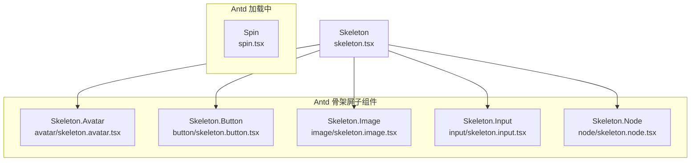
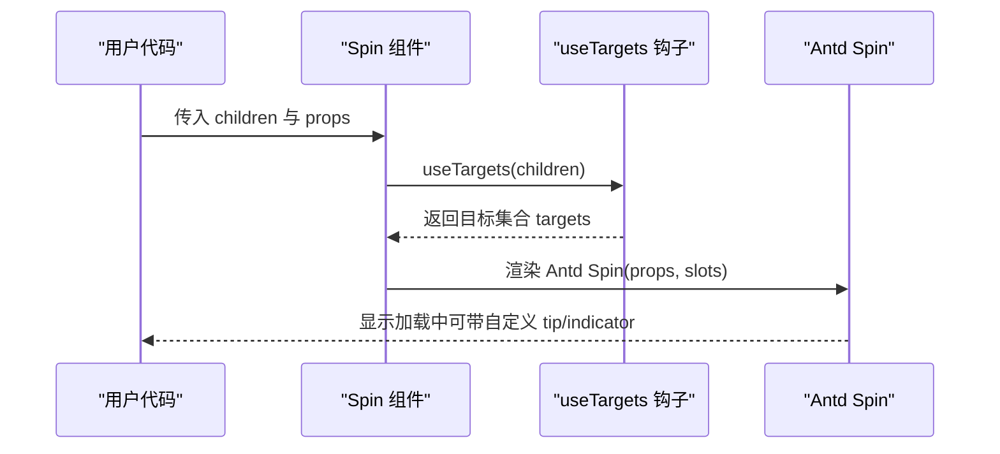
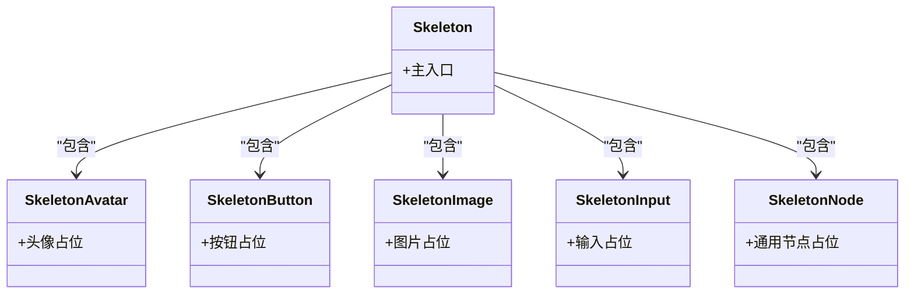
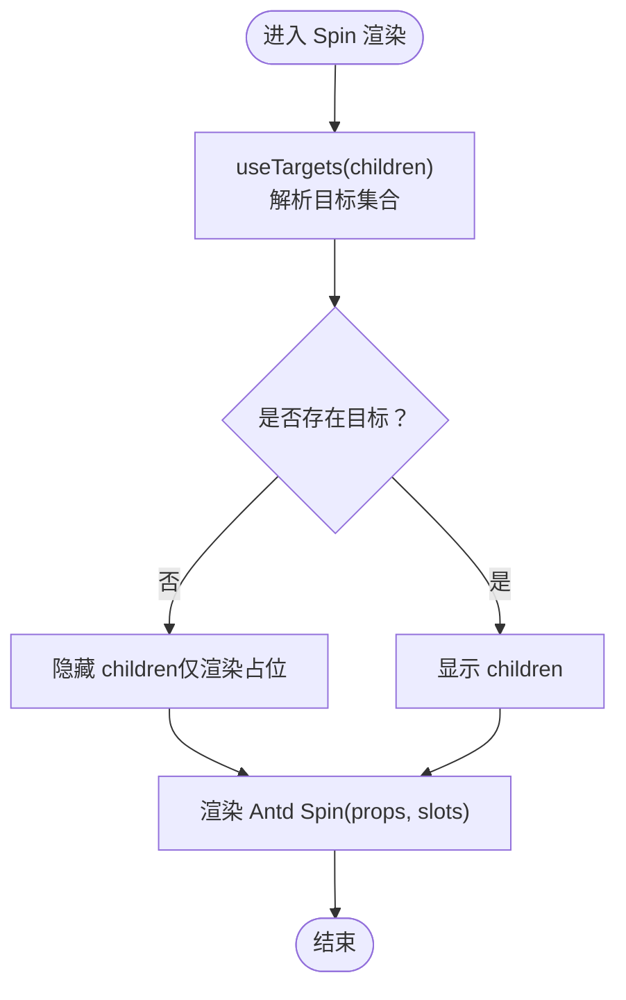
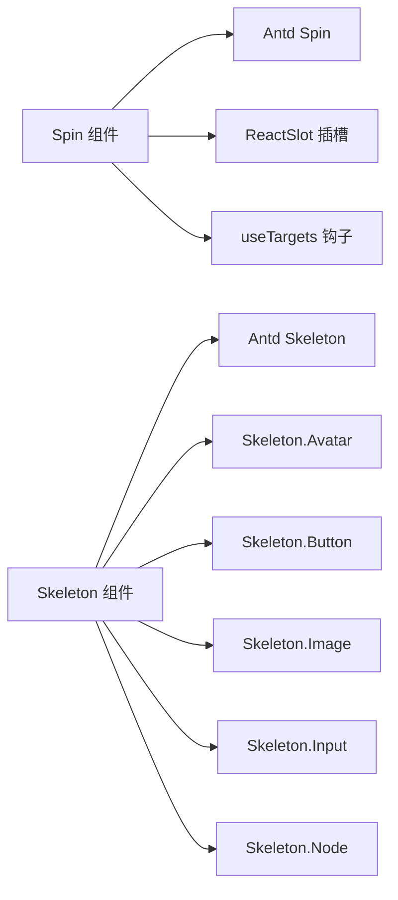

# 加载骨架组件

<cite>
**本文引用的文件**
- [frontend/antd/skeleton/skeleton.tsx](file://frontend/antd/skeleton/skeleton.tsx)
- [frontend/antd/skeleton/avatar/skeleton.avatar.tsx](file://frontend/antd/skeleton/avatar/skeleton.avatar.tsx)
- [frontend/antd/skeleton/button/skeleton.button.tsx](file://frontend/antd/skeleton/button/skeleton.button.tsx)
- [frontend/antd/skeleton/image/skeleton.image.tsx](file://frontend/antd/skeleton/image/skeleton.image.tsx)
- [frontend/antd/skeleton/input/skeleton.input.tsx](file://frontend/antd/skeleton/input/skeleton.input.tsx)
- [frontend/antd/skeleton/node/skeleton.node.tsx](file://frontend/antd/skeleton/node/skeleton.node.tsx)
- [frontend/antd/spin/spin.tsx](file://frontend/antd/spin/spin.tsx)
</cite>

## 目录

1. [简介](#简介)
2. [项目结构](#项目结构)
3. [核心组件](#核心组件)
4. [架构总览](#架构总览)
5. [详细组件分析](#详细组件分析)
6. [依赖关系分析](#依赖关系分析)
7. [性能考量](#性能考量)
8. [故障排查指南](#故障排查指南)
9. [结论](#结论)
10. [附录：常见使用场景与最佳实践](#附录常见使用场景与最佳实践)

## 简介

本文件聚焦于加载骨架组件群组，系统性阐述骨架屏（Skeleton）与加载中（Spin）两类组件在本仓库中的实现方式、使用策略与用户体验设计要点。内容涵盖：

- 骨架屏占位符类型、动画效果与内容布局模拟思路
- 加载中旋转指示器的尺寸变化与状态管理
- 组件属性配置、自定义动画与样式定制方法
- 列表加载、图片占位、表单加载、页面切换等常见场景的实践建议
- 骨架屏与真实内容的切换时机与过渡效果
- 性能优化建议与网络状态适配方案

## 项目结构

加载骨架组件群组位于前端 Ant Design 组件层，采用统一的“适配器”封装模式，将 Ant Design 的 React 组件通过预处理工具桥接到 Svelte 生态中，确保在本项目的组件体系中保持一致的调用体验。

图表来源

- [frontend/antd/skeleton/skeleton.tsx:1-7](file://frontend/antd/skeleton/skeleton.tsx#L1-L7)
- [frontend/antd/skeleton/avatar/skeleton.avatar.tsx:1-9](file://frontend/antd/skeleton/avatar/skeleton.avatar.tsx#L1-L9)
- [frontend/antd/skeleton/button/skeleton.button.tsx:1-9](file://frontend/antd/skeleton/button/skeleton.button.tsx#L1-L9)
- [frontend/antd/skeleton/image/skeleton.image.tsx:1-9](file://frontend/antd/skeleton/image/skeleton.image.tsx#L1-L9)
- [frontend/antd/skeleton/input/skeleton.input.tsx:1-9](file://frontend/antd/skeleton/input/skeleton.input.tsx#L1-L9)
- [frontend/antd/skeleton/node/skeleton.node.tsx:1-9](file://frontend/antd/skeleton/node/skeleton.node.tsx#L1-L9)
- [frontend/antd/spin/spin.tsx:1-38](file://frontend/antd/spin/spin.tsx#L1-L38)

章节来源

- [frontend/antd/skeleton/skeleton.tsx:1-7](file://frontend/antd/skeleton/skeleton.tsx#L1-L7)
- [frontend/antd/skeleton/avatar/skeleton.avatar.tsx:1-9](file://frontend/antd/skeleton/avatar/skeleton.avatar.tsx#L1-L9)
- [frontend/antd/skeleton/button/skeleton.button.tsx:1-9](file://frontend/antd/skeleton/button/skeleton.button.tsx#L1-L9)
- [frontend/antd/skeleton/image/skeleton.image.tsx:1-9](file://frontend/antd/skeleton/image/skeleton.image.tsx#L1-L9)
- [frontend/antd/skeleton/input/skeleton.input.tsx:1-9](file://frontend/antd/skeleton/input/skeleton.input.tsx#L1-L9)
- [frontend/antd/skeleton/node/skeleton.node.tsx:1-9](file://frontend/antd/skeleton/node/skeleton.node.tsx#L1-L9)
- [frontend/antd/spin/spin.tsx:1-38](file://frontend/antd/spin/spin.tsx#L1-L38)

## 核心组件

- Skeleton（骨架屏）
  - 主入口：将 Ant Design 的 Skeleton 组件以统一方式桥接至 Svelte 环境
  - 子组件：Avatar、Button、Image、Input、Node，分别对应不同元素类型的占位骨架
- Spin（加载中）
  - 主入口：将 Ant Design 的 Spin 组件以统一方式桥接至 Svelte 环境，并支持插槽化 tip 与 indicator 自定义

章节来源

- [frontend/antd/skeleton/skeleton.tsx:1-7](file://frontend/antd/skeleton/skeleton.tsx#L1-L7)
- [frontend/antd/skeleton/avatar/skeleton.avatar.tsx:1-9](file://frontend/antd/skeleton/avatar/skeleton.avatar.tsx#L1-L9)
- [frontend/antd/skeleton/button/skeleton.button.tsx:1-9](file://frontend/antd/skeleton/button/skeleton.button.tsx#L1-L9)
- [frontend/antd/skeleton/image/skeleton.image.tsx:1-9](file://frontend/antd/skeleton/image/skeleton.image.tsx#L1-L9)
- [frontend/antd/skeleton/input/skeleton.input.tsx:1-9](file://frontend/antd/skeleton/input/skeleton.input.tsx#L1-L9)
- [frontend/antd/skeleton/node/skeleton.node.tsx:1-9](file://frontend/antd/skeleton/node/skeleton.node.tsx#L1-L9)
- [frontend/antd/spin/spin.tsx:1-38](file://frontend/antd/spin/spin.tsx#L1-L38)

## 架构总览

整体架构采用“适配器 + 插槽”的组合模式：

- 适配器：通过统一的 sveltify 工具将 Ant Design 的 React 组件桥接为 Svelte 可用组件
- 插槽化：Spin 支持 tip 与 indicator 两个插槽，便于自定义提示文案与指示器样式
- 目标选择：Spin 内部通过目标选择钩子将 children 转换为可定位的目标集合，保证包裹逻辑正确

图表来源

- [frontend/antd/spin/spin.tsx:1-38](file://frontend/antd/spin/spin.tsx#L1-L38)

章节来源

- [frontend/antd/spin/spin.tsx:1-38](file://frontend/antd/spin/spin.tsx#L1-L38)

## 详细组件分析

### 骨架屏（Skeleton）组件族

- 设计目标
  - 在数据未就绪时提供稳定的内容布局占位，避免页面跳动与布局抖动
  - 通过合理的动画与形状模拟真实内容，提升感知速度与可用性
- 占位符类型
  - Avatar：头像占位
  - Button：按钮占位
  - Image：图片占位
  - Input：输入框占位
  - Node：通用节点占位
- 动画与布局
  - 基于 Ant Design 的 Skeleton 动画机制，通常表现为渐变闪烁（shimmer）效果
  - 通过设置不同的形状（圆形/方形/矩形）与行数，模拟文本、卡片、列表等复杂布局
- 使用建议
  - 列表加载：优先使用 Node 或多行 Input 模拟行项
  - 图片占位：使用 Image 占位，尺寸与真实图片一致
  - 表单加载：使用 Input/Button 模拟字段与操作区域
  - 页面切换：在路由切换期间使用 Skeleton 包裹容器，减少白屏感知

图表来源

- [frontend/antd/skeleton/skeleton.tsx:1-7](file://frontend/antd/skeleton/skeleton.tsx#L1-L7)
- [frontend/antd/skeleton/avatar/skeleton.avatar.tsx:1-9](file://frontend/antd/skeleton/avatar/skeleton.avatar.tsx#L1-L9)
- [frontend/antd/skeleton/button/skeleton.button.tsx:1-9](file://frontend/antd/skeleton/button/skeleton.button.tsx#L1-L9)
- [frontend/antd/skeleton/image/skeleton.image.tsx:1-9](file://frontend/antd/skeleton/image/skeleton.image.tsx#L1-L9)
- [frontend/antd/skeleton/input/skeleton.input.tsx:1-9](file://frontend/antd/skeleton/input/skeleton.input.tsx#L1-L9)
- [frontend/antd/skeleton/node/skeleton.node.tsx:1-9](file://frontend/antd/skeleton/node/skeleton.node.tsx#L1-L9)

章节来源

- [frontend/antd/skeleton/skeleton.tsx:1-7](file://frontend/antd/skeleton/skeleton.tsx#L1-L7)
- [frontend/antd/skeleton/avatar/skeleton.avatar.tsx:1-9](file://frontend/antd/skeleton/avatar/skeleton.avatar.tsx#L1-L9)
- [frontend/antd/skeleton/button/skeleton.button.tsx:1-9](file://frontend/antd/skeleton/button/skeleton.button.tsx#L1-L9)
- [frontend/antd/skeleton/image/skeleton.image.tsx:1-9](file://frontend/antd/skeleton/image/skeleton.image.tsx#L1-L9)
- [frontend/antd/skeleton/input/skeleton.input.tsx:1-9](file://frontend/antd/skeleton/input/skeleton.input.tsx#L1-L9)
- [frontend/antd/skeleton/node/skeleton.node.tsx:1-9](file://frontend/antd/skeleton/node/skeleton.node.tsx#L1-L9)

### 加载中（Spin）组件

- 设计目标
  - 在异步操作期间提供明确的反馈，避免用户误以为页面无响应
  - 支持自定义提示文案与指示器，满足不同场景的视觉需求
- 关键特性
  - 插槽化：支持 tip 与 indicator 插槽，便于注入自定义文案与图标
  - 目标选择：内部通过目标选择钩子将 children 转为目标集合，保证包裹逻辑正确
  - 属性透传：除额外扩展外，其余属性直接透传至 Ant Design 的 Spin
- 使用建议
  - 列表加载：将 Spin 作为列表容器，children 为列表项，tip 提示“加载中”
  - 图片占位：在图片未加载完成时包裹图片，indicator 使用简洁的旋转图标
  - 表单提交：在提交过程中禁用交互并显示 Spin，tip 提示“提交中”
  - 页面切换：在路由切换期间包裹整个页面，提供全局加载反馈

图表来源

- [frontend/antd/spin/spin.tsx:1-38](file://frontend/antd/spin/spin.tsx#L1-L38)

章节来源

- [frontend/antd/spin/spin.tsx:1-38](file://frontend/antd/spin/spin.tsx#L1-L38)

## 依赖关系分析

- 组件耦合
  - Skeleton 家族均依赖 Ant Design 的 Skeleton 实现，通过 sveltify 进行桥接
  - Spin 依赖 Ant Design 的 Spin 实现，并引入目标选择钩子与 ReactSlot 插槽机制
- 外部依赖
  - @svelte-preprocess-react：提供 sveltify 与 ReactSlot 能力
  - Ant Design：提供 Skeleton 与 Spin 的具体实现
- 潜在问题
  - 插槽名称与属性命名需与 Ant Design 保持一致，避免运行时错误
  - 目标选择逻辑需确保 children 结构合理，避免包裹异常

图表来源

- [frontend/antd/spin/spin.tsx:1-38](file://frontend/antd/spin/spin.tsx#L1-L38)
- [frontend/antd/skeleton/skeleton.tsx:1-7](file://frontend/antd/skeleton/skeleton.tsx#L1-L7)
- [frontend/antd/skeleton/avatar/skeleton.avatar.tsx:1-9](file://frontend/antd/skeleton/avatar/skeleton.avatar.tsx#L1-L9)
- [frontend/antd/skeleton/button/skeleton.button.tsx:1-9](file://frontend/antd/skeleton/button/skeleton.button.tsx#L1-L9)
- [frontend/antd/skeleton/image/skeleton.image.tsx:1-9](file://frontend/antd/skeleton/image/skeleton.image.tsx#L1-L9)
- [frontend/antd/skeleton/input/skeleton.input.tsx:1-9](file://frontend/antd/skeleton/input/skeleton.input.tsx#L1-L9)
- [frontend/antd/skeleton/node/skeleton.node.tsx:1-9](file://frontend/antd/skeleton/node/skeleton.node.tsx#L1-L9)

章节来源

- [frontend/antd/spin/spin.tsx:1-38](file://frontend/antd/spin/spin.tsx#L1-L38)
- [frontend/antd/skeleton/skeleton.tsx:1-7](file://frontend/antd/skeleton/skeleton.tsx#L1-L7)

## 性能考量

- 骨架屏渲染成本
  - Skeleton 的占位元素数量与层级应与真实内容尽量接近，避免过度渲染导致卡顿
  - 对长列表使用 Skeleton.Node 或少量行输入进行占位，减少 DOM 数量
- 加载中反馈
  - Spin 的 tip 与 indicator 应尽量轻量，避免额外的重绘与回流
  - 在高频刷新场景下，建议使用节流或防抖控制加载状态的切换频率
- 网络状态适配
  - 对弱网环境，建议延长 Skeleton 显示时间阈值，避免频繁闪烁
  - 对高延迟场景，Spin 的 tip 文案应明确告知用户等待原因（如“正在连接服务器”）

## 故障排查指南

- 问题：Spin 无法正确包裹 children
  - 排查：确认 children 是否为可识别的目标结构；检查 useTargets 的返回结果
  - 参考实现位置：[frontend/antd/spin/spin.tsx:1-38](file://frontend/antd/spin/spin.tsx#L1-L38)
- 问题：插槽 tip/indicator 不生效
  - 排查：确认插槽名称是否为 tip 与 indicator；确保 slots 对象存在对应键
  - 参考实现位置：[frontend/antd/spin/spin.tsx:1-38](file://frontend/antd/spin/spin.tsx#L1-L38)
- 问题：Skeleton 子组件样式异常
  - 排查：确认子组件是否正确导入 Ant Design 的对应模块；检查主题与样式覆盖
  - 参考实现位置：
    - [frontend/antd/skeleton/skeleton.tsx:1-7](file://frontend/antd/skeleton/skeleton.tsx#L1-L7)
    - [frontend/antd/skeleton/avatar/skeleton.avatar.tsx:1-9](file://frontend/antd/skeleton/avatar/skeleton.avatar.tsx#L1-L9)
    - [frontend/antd/skeleton/button/skeleton.button.tsx:1-9](file://frontend/antd/skeleton/button/skeleton.button.tsx#L1-L9)
    - [frontend/antd/skeleton/image/skeleton.image.tsx:1-9](file://frontend/antd/skeleton/image/skeleton.image.tsx#L1-L9)
    - [frontend/antd/skeleton/input/skeleton.input.tsx:1-9](file://frontend/antd/skeleton/input/skeleton.input.tsx#L1-L9)
    - [frontend/antd/skeleton/node/skeleton.node.tsx:1-9](file://frontend/antd/skeleton/node/skeleton.node.tsx#L1-L9)

章节来源

- [frontend/antd/spin/spin.tsx:1-38](file://frontend/antd/spin/spin.tsx#L1-L38)
- [frontend/antd/skeleton/skeleton.tsx:1-7](file://frontend/antd/skeleton/skeleton.tsx#L1-L7)
- [frontend/antd/skeleton/avatar/skeleton.avatar.tsx:1-9](file://frontend/antd/skeleton/avatar/skeleton.avatar.tsx#L1-L9)
- [frontend/antd/skeleton/button/skeleton.button.tsx:1-9](file://frontend/antd/skeleton/button/skeleton.button.tsx#L1-L9)
- [frontend/antd/skeleton/image/skeleton.image.tsx:1-9](file://frontend/antd/skeleton/image/skeleton.image.tsx#L1-L9)
- [frontend/antd/skeleton/input/skeleton.input.tsx:1-9](file://frontend/antd/skeleton/input/skeleton.input.tsx#L1-L9)
- [frontend/antd/skeleton/node/skeleton.node.tsx:1-9](file://frontend/antd/skeleton/node/skeleton.node.tsx#L1-L9)

## 结论

本仓库的加载骨架组件群组通过统一的适配器与插槽化设计，实现了对 Ant Design Skeleton 与 Spin 的无缝集成。在实际应用中，应结合业务场景合理选择骨架屏类型与加载中反馈形式，并通过属性与插槽定制满足品牌与交互需求。同时，关注渲染性能与网络状态适配，确保在不同设备与环境下提供一致、流畅的用户体验。

## 附录：常见使用场景与最佳实践

- 列表加载
  - 使用 Skeleton.Node 或多行 Input 模拟列表项占位
  - 在 Spin 中包裹列表容器，tip 提示“加载中”，indicator 使用默认旋转图标
- 图片占位
  - 使用 Skeleton.Image 模拟图片尺寸与占位
  - 在图片加载失败时，可切换为占位骨架或错误提示
- 表单加载
  - 使用 Skeleton.Input 与 Skeleton.Button 模拟输入与提交区域
  - 在提交过程中禁用交互并显示 Spin，tip 提示“提交中”
- 页面切换
  - 在路由切换期间使用 Skeleton 包裹页面主体，减少白屏感知
  - 对高延迟场景，Spin 的 tip 文案应明确告知用户等待原因
