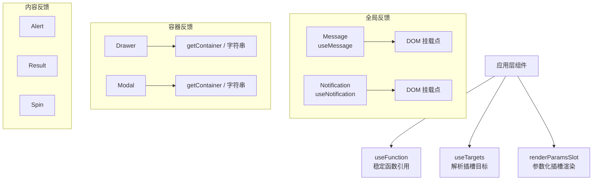
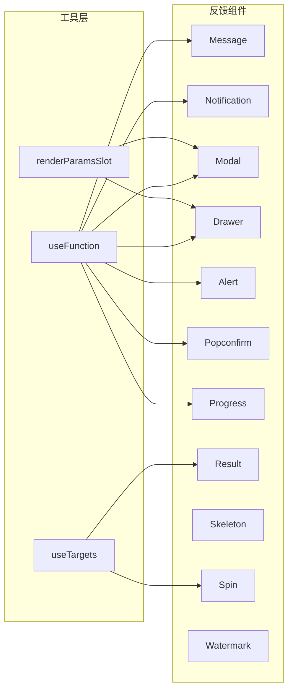

# 反馈组件

<cite>
**本文引用的文件**
- [alert.tsx](file://frontend/antd/alert/alert.tsx)
- [drawer.tsx](file://frontend/antd/drawer/drawer.tsx)
- [message.tsx](file://frontend/antd/message/message.tsx)
- [modal.tsx](file://frontend/antd/modal/modal.tsx)
- [notification.tsx](file://frontend/antd/notification/notification.tsx)
- [popconfirm.tsx](file://frontend/antd/popconfirm/popconfirm.tsx)
- [progress.tsx](file://frontend/antd/progress/progress.tsx)
- [result.tsx](file://frontend/antd/result/result.tsx)
- [skeleton.tsx](file://frontend/antd/skeleton/skeleton.tsx)
- [spin.tsx](file://frontend/antd/spin/spin.tsx)
- [watermark.tsx](file://frontend/antd/watermark/watermark.tsx)
- [useFunction.ts](file://frontend/utils/hooks/useFunction.ts)
- [useTargets.ts](file://frontend/utils/hooks/useTargets.ts)
- [renderParamsSlot.tsx](file://frontend/utils/renderParamsSlot.tsx)
</cite>

## 目录

1. [简介](#简介)
2. [项目结构](#项目结构)
3. [核心组件](#核心组件)
4. [架构总览](#架构总览)
5. [组件详解](#组件详解)
6. [依赖关系分析](#依赖关系分析)
7. [性能考量](#性能考量)
8. [故障排查指南](#故障排查指南)
9. [结论](#结论)
10. [附录](#附录)

## 简介

本文件系统性梳理 Ant Design 反馈类组件在前端侧的封装与使用，覆盖以下组件：警告提示（Alert）、抽屉（Drawer）、全局提示（Message）、对话框（Modal）、通知提醒框（Notification）、气泡确认框（Popconfirm）、进度条（Progress）、结果（Result）、骨架屏（Skeleton）、加载中（Spin）、水印（Watermark）。文档重点阐述各组件的触发机制、显示时机、交互逻辑、动画与过渡状态管理、错误与异常处理策略、无障碍与键盘操作支持，以及复杂交互场景下的反馈设计模式。

## 项目结构

反馈组件均位于前端目录下，采用统一的封装模式：通过 sveltify 将 Ant Design 原生组件桥接为 Svelte 风格组件；利用 ReactSlot 与 renderParamsSlot 实现插槽化渲染；通过 useFunction/useTargets 等工具钩子确保回调与插槽目标的正确传递与排序。

```mermaid
graph TB
subgraph "Ant Design 反馈组件"
A1["Alert<br/>frontend/antd/alert/alert.tsx"]
A2["Drawer<br/>frontend/antd/drawer/drawer.tsx"]
A3["Message<br/>frontend/antd/message/message.tsx"]
A4["Modal<br/>frontend/antd/modal/modal.tsx"]
A5["Notification<br/>frontend/antd/notification/notification.tsx"]
A6["Popconfirm<br/>frontend/antd/popconfirm/popconfirm.tsx"]
A7["Progress<br/>frontend/antd/progress/progress.tsx"]
A8["Result<br/>frontend/antd/result/result.tsx"]
A9["Skeleton<br/>frontend/antd/skeleton/skeleton.tsx"]
A10["Spin<br/>frontend/antd/spin/spin.tsx"]
A11["Watermark<br/>frontend/antd/watermark/watermark.tsx"]
end
subgraph "工具与钩子"
U1["useFunction<br/>frontend/utils/hooks/useFunction.ts"]
U2["useTargets<br/>frontend/utils/hooks/useTargets.ts"]
U3["renderParamsSlot<br/>frontend/utils/renderParamsSlot.tsx"]
end
A1 --> U1
A2 --> U1
A3 --> U1
A4 --> U1
A5 --> U1
A6 --> U1
A7 --> U1
A8 --> U2
A9 --> U1
A10 --> U2
A11 --> U1
A2 --> U3
A4 --> U3
```

图表来源

- [alert.tsx:1-46](file://frontend/antd/alert/alert.tsx#L1-L46)
- [drawer.tsx:1-60](file://frontend/antd/drawer/drawer.tsx#L1-L60)
- [message.tsx:1-79](file://frontend/antd/message/message.tsx#L1-L79)
- [modal.tsx:1-107](file://frontend/antd/modal/modal.tsx#L1-L107)
- [notification.tsx:1-106](file://frontend/antd/notification/notification.tsx#L1-L106)
- [popconfirm.tsx:1-65](file://frontend/antd/popconfirm/popconfirm.tsx#L1-L65)
- [progress.tsx:1-24](file://frontend/antd/progress/progress.tsx#L1-L24)
- [result.tsx:1-33](file://frontend/antd/result/result.tsx#L1-L33)
- [skeleton.tsx:1-7](file://frontend/antd/skeleton/skeleton.tsx#L1-L7)
- [spin.tsx:1-38](file://frontend/antd/spin/spin.tsx#L1-L38)
- [watermark.tsx:1-6](file://frontend/antd/watermark/watermark.tsx#L1-L6)
- [useFunction.ts:1-13](file://frontend/utils/hooks/useFunction.ts#L1-L13)
- [useTargets.ts:1-52](file://frontend/utils/hooks/useTargets.ts#L1-L52)
- [renderParamsSlot.tsx:1-51](file://frontend/utils/renderParamsSlot.tsx#L1-L51)

章节来源

- [alert.tsx:1-46](file://frontend/antd/alert/alert.tsx#L1-L46)
- [drawer.tsx:1-60](file://frontend/antd/drawer/drawer.tsx#L1-L60)
- [message.tsx:1-79](file://frontend/antd/message/message.tsx#L1-L79)
- [modal.tsx:1-107](file://frontend/antd/modal/modal.tsx#L1-L107)
- [notification.tsx:1-106](file://frontend/antd/notification/notification.tsx#L1-L106)
- [popconfirm.tsx:1-65](file://frontend/antd/popconfirm/popconfirm.tsx#L1-L65)
- [progress.tsx:1-24](file://frontend/antd/progress/progress.tsx#L1-L24)
- [result.tsx:1-33](file://frontend/antd/result/result.tsx#L1-L33)
- [skeleton.tsx:1-7](file://frontend/antd/skeleton/skeleton.tsx#L1-L7)
- [spin.tsx:1-38](file://frontend/antd/spin/spin.tsx#L1-L38)
- [watermark.tsx:1-6](file://frontend/antd/watermark/watermark.tsx#L1-L6)
- [useFunction.ts:1-13](file://frontend/utils/hooks/useFunction.ts#L1-L13)
- [useTargets.ts:1-52](file://frontend/utils/hooks/useTargets.ts#L1-L52)
- [renderParamsSlot.tsx:1-51](file://frontend/utils/renderParamsSlot.tsx#L1-L51)

## 核心组件

- 统一封装：所有反馈组件均通过 sveltify 包裹原生 Ant Design 组件，保留其 API 并扩展插槽能力。
- 插槽系统：使用 ReactSlot 渲染具名插槽（如 title、description、icon、footer 等），部分组件支持带参数的插槽渲染（renderParamsSlot）。
- 回调适配：useFunction 将传入的函数包装为稳定引用，避免因每次渲染导致的副作用或重复订阅。
- 目标选择：useTargets 用于从 children 中提取可投递的目标节点，支撑复杂布局与条件渲染。
- 上下文持有：Message/Notification 通过 useMessage/useNotification 获取上下文持有器，实现全局消息与通知的挂载与销毁。

章节来源

- [alert.tsx:7-43](file://frontend/antd/alert/alert.tsx#L7-L43)
- [drawer.tsx:14-57](file://frontend/antd/drawer/drawer.tsx#L14-L57)
- [message.tsx:9-76](file://frontend/antd/message/message.tsx#L9-L76)
- [modal.tsx:8-104](file://frontend/antd/modal/modal.tsx#L8-L104)
- [notification.tsx:8-103](file://frontend/antd/notification/notification.tsx#L8-L103)
- [popconfirm.tsx:7-62](file://frontend/antd/popconfirm/popconfirm.tsx#L7-L62)
- [progress.tsx:5-21](file://frontend/antd/progress/progress.tsx#L5-L21)
- [result.tsx:7-30](file://frontend/antd/result/result.tsx#L7-L30)
- [skeleton.tsx:1-7](file://frontend/antd/skeleton/skeleton.tsx#L1-L7)
- [spin.tsx:7-35](file://frontend/antd/spin/spin.tsx#L7-L35)
- [watermark.tsx:1-6](file://frontend/antd/watermark/watermark.tsx#L1-L6)
- [useFunction.ts:5-12](file://frontend/utils/hooks/useFunction.ts#L5-L12)
- [useTargets.ts:5-51](file://frontend/utils/hooks/useTargets.ts#L5-L51)
- [renderParamsSlot.tsx:5-50](file://frontend/utils/renderParamsSlot.tsx#L5-L50)

## 架构总览

反馈组件的运行时架构围绕“属性透传 + 插槽渲染 + 回调适配”展开。对于需要全局挂载的组件（Message/Notification），通过 useMessage/useNotification 获取上下文持有器并在组件挂载时注入到 DOM；对于容器型组件（Drawer/Modal），通过 getContainer 或字符串选择器决定挂载目标；对于内容型组件（Alert/Result/Spin），通过插槽控制标题、描述、图标、额外内容等。

图表来源

- [message.tsx:30-33](file://frontend/antd/message/message.tsx#L30-L33)
- [notification.tsx:31-36](file://frontend/antd/notification/notification.tsx#L31-L36)
- [drawer.tsx:52-54](file://frontend/antd/drawer/drawer.tsx#L52-L54)
- [modal.tsx:96-98](file://frontend/antd/modal/modal.tsx#L96-L98)
- [useFunction.ts:5-12](file://frontend/utils/hooks/useFunction.ts#L5-L12)
- [useTargets.ts:5-51](file://frontend/utils/hooks/useTargets.ts#L5-L51)
- [renderParamsSlot.tsx:5-50](file://frontend/utils/renderParamsSlot.tsx#L5-L50)

## 组件详解

### 警告提示（Alert）

- 触发机制：由业务状态变化或用户操作触发显示；可通过 closable 关闭并触发 afterClose 回调。
- 显示时机：页面初始化后根据数据源决定是否展示；支持动态切换 message/description/icon/action 插槽。
- 交互逻辑：点击关闭按钮触发动画收起，afterClose 回调可用于清理资源或跳转。
- 动画与过渡：基于 Ant Design 内置动画；插槽内容可自定义图标与操作按钮。
- 错误处理：当插槽内容为空时回退到 props 提供的内容；关闭后释放资源。
- 无障碍与键盘：遵循 Ant Design 的默认可访问性；建议为关闭按钮提供明确的 ARIA 标签。

章节来源

- [alert.tsx:7-43](file://frontend/antd/alert/alert.tsx#L7-L43)

### 抽屉（Drawer）

- 触发机制：按钮点击或路由变化触发 visible；支持 afterOpenChange 控制打开/关闭后的状态。
- 显示时机：首次打开时执行动画入场；关闭时执行动画离场。
- 交互逻辑：支持自定义 closeIcon、extra、footer、title；closable.closeIcon 可替换默认关闭图标。
- 动画与过渡：由 Ant Design 控制抽屉滑入/滑出动画；drawerRender 支持自定义渲染逻辑。
- 错误处理：getContainer 为字符串时通过 useFunction 包装；异常时回退到默认容器。
- 无障碍与键盘：保持原生焦点顺序；建议在 footer 中提供明确的操作按钮。

章节来源

- [drawer.tsx:8-57](file://frontend/antd/drawer/drawer.tsx#L8-L57)

### 全局提示（Message）

- 触发机制：通过 visible 属性控制显示/隐藏；内部使用 messageApi.open 打开消息。
- 显示时机：effect 监听 visible=true 时打开消息；duration 到期或手动关闭后触发 onClose。
- 交互逻辑：onVisible(false) 与 onClose 同步回调；支持 key 去重与 destroy。
- 动画与过渡：由 Ant Design 内置动画；content/icon 插槽可自定义内容与图标。
- 错误处理：effect 清理阶段调用 destroy；异常时保证只打开一次。
- 无障碍与键盘：自动挂载到上下文持有器；建议提供可读性强的文本与简短描述。

章节来源

- [message.tsx:19-76](file://frontend/antd/message/message.tsx#L19-L76)

### 对话框（Modal）

- 触发机制：visible 控制显示；afterOpenChange/afterClose 管理打开/关闭后的生命周期。
- 显示时机：首次打开时动画入场；关闭时动画离场。
- 交互逻辑：ok/cancel 文案与图标均可通过插槽定制；footer 支持函数或默认值。
- 动画与过渡：Ant Design 内置动画；modalRender 支持自定义渲染。
- 错误处理：getContainer 为字符串时包装为函数；footer 为 DEFAULT_FOOTER 时回退为 undefined。
- 无障碍与键盘：保持默认焦点与 ESC 关闭；建议提供明确的确认/取消语义。

章节来源

- [modal.tsx:22-104](file://frontend/antd/modal/modal.tsx#L22-L104)

### 通知提醒框（Notification）

- 触发机制：visible 控制显示；useNotification 返回的 open/destroy 控制消息生命周期。
- 显示时机：effect 监听 visible=true 时打开；duration 到期或手动关闭后触发 onClose。
- 交互逻辑：onVisible(false)/onClose 同步回调；支持 placement、stack、top/bottom 定位。
- 动画与过渡：由 Ant Design 内置动画；支持 description/icon/actions/btn 插槽。
- 错误处理：effect 清理阶段调用 destroy；异常时保证只打开一次。
- 无障碍与键盘：建议提供可读性强的标题与描述；支持 hover 暂停与进度条。

章节来源

- [notification.tsx:18-103](file://frontend/antd/notification/notification.tsx#L18-L103)

### 气泡确认框（Popconfirm）

- 触发机制：用户点击触发气泡弹窗；afterOpenChange 管理弹窗打开状态。
- 显示时机：点击目标元素后立即弹出；确认/取消后关闭。
- 交互逻辑：ok/cancel 文案与图标均可通过插槽定制；title/description 支持 clone 渲染。
- 动画与过渡：由 Ant Design 控制气泡动画；getPopupContainer 支持指定挂载容器。
- 错误处理：插槽内容为空时回退到 props；异常时保持交互可用。
- 无障碍与键盘：保持默认焦点与 ESC 关闭；建议提供明确的确认/取消语义。

章节来源

- [popconfirm.tsx:7-62](file://frontend/antd/popconfirm/popconfirm.tsx#L7-L62)

### 进度条（Progress）

- 触发机制：数值变化驱动进度更新；format 与 rounding 支持自定义格式化。
- 显示时机：数值变化即刻反映；支持静态与动态两种模式。
- 交互逻辑：format 与 rounding 通过 useFunction 包装为稳定引用。
- 动画与过渡：由 Ant Design 内置动画；支持百分比、状态与自定义文案。
- 错误处理：数值越界时由 Ant Design 处理；异常时保持组件稳定。
- 无障碍与键盘：无交互输入；建议提供可读性强的文案。

章节来源

- [progress.tsx:5-21](file://frontend/antd/progress/progress.tsx#L5-L21)

### 结果（Result）

- 触发机制：业务结果完成后展示；支持 title/subTitle/icon/extra 插槽。
- 显示时机：数据就绪后立即渲染；children 作为附加内容。
- 交互逻辑：useTargets 解析插槽目标；无插槽时回退到 children。
- 动画与过渡：由 Ant Design 内置动画；支持多种状态图标与文案。
- 错误处理：插槽内容为空时回退到 props；异常时保持内容可见。
- 无障碍与键盘：建议提供可读性强的标题与描述。

章节来源

- [result.tsx:7-30](file://frontend/antd/result/result.tsx#L7-L30)

### 骨架屏（Skeleton）

- 触发机制：数据加载前展示骨架；加载完成后切换真实内容。
- 显示时机：组件挂载即刻显示；真实内容就绪后自动切换。
- 交互逻辑：无交互；支持动画与形状配置。
- 动画与过渡：由 Ant Design 内置骨架动画。
- 错误处理：异常时保持骨架稳定；建议提供超时降级。
- 无障碍与键盘：无交互；建议提供加载状态的 ARIA 提示。

章节来源

- [skeleton.tsx:1-7](file://frontend/antd/skeleton/skeleton.tsx#L1-L7)

### 加载中（Spin）

- 触发机制：异步任务开始时显示；任务结束时隐藏。
- 显示时机：组件挂载即刻显示；children 为空时包裹真实内容。
- 交互逻辑：useTargets 解析插槽目标；tip/indicator 支持插槽。
- 动画与过渡：由 Ant Design 内置旋转动画；支持自定义指示器与提示文案。
- 错误处理：插槽内容为空时回退到 props；异常时保持加载态。
- 无障碍与键盘：建议提供 ARIA label 与 loading 状态提示。

章节来源

- [spin.tsx:7-35](file://frontend/antd/spin/spin.tsx#L7-L35)

### 水印（Watermark）

- 触发机制：页面加载后生成水印；支持动态更新文本与尺寸。
- 显示时机：组件挂载即刻生效；适合全屏或局部水印。
- 交互逻辑：无交互；支持多行文本与透明度配置。
- 动画与过渡：无动画；适合背景装饰。
- 错误处理：异常时保持水印稳定；建议提供降级方案。
- 无障碍与键盘：无交互；不影响可访问性。

章节来源

- [watermark.tsx:1-6](file://frontend/antd/watermark/watermark.tsx#L1-L6)

## 依赖关系分析

- 组件间耦合：反馈组件彼此独立，仅共享工具钩子；容器型组件共享 getContainer 与 renderParamsSlot；全局型组件共享上下文持有器。
- 外部依赖：Ant Design 原生组件与样式；React Slot 渲染；Svelte Preprocess React 桥接。
- 循环依赖：未发现循环依赖；工具钩子为纯函数式封装。
- 接口契约：所有组件均通过 sveltify 保持与 Ant Design API 的兼容性；插槽键名与渲染策略一致。

图表来源

- [useFunction.ts:5-12](file://frontend/utils/hooks/useFunction.ts#L5-L12)
- [useTargets.ts:5-51](file://frontend/utils/hooks/useTargets.ts#L5-L51)
- [renderParamsSlot.tsx:5-50](file://frontend/utils/renderParamsSlot.tsx#L5-L50)
- [message.tsx:29-33](file://frontend/antd/message/message.tsx#L29-L33)
- [notification.tsx:31-36](file://frontend/antd/notification/notification.tsx#L31-L36)
- [modal.tsx:34-35](file://frontend/antd/modal/modal.tsx#L34-L35)
- [drawer.tsx:27-28](file://frontend/antd/drawer/drawer.tsx#L27-L28)
- [alert.tsx:13-20](file://frontend/antd/alert/alert.tsx#L13-L20)
- [popconfirm.tsx:18-20](file://frontend/antd/popconfirm/popconfirm.tsx#L18-L20)
- [progress.tsx:10-12](file://frontend/antd/progress/progress.tsx#L10-L12)
- [result.tsx:11-12](file://frontend/antd/result/result.tsx#L11-L12)
- [spin.tsx:13-14](file://frontend/antd/spin/spin.tsx#L13-L14)

章节来源

- [useFunction.ts:5-12](file://frontend/utils/hooks/useFunction.ts#L5-L12)
- [useTargets.ts:5-51](file://frontend/utils/hooks/useTargets.ts#L5-L51)
- [renderParamsSlot.tsx:5-50](file://frontend/utils/renderParamsSlot.tsx#L5-L50)
- [message.tsx:29-33](file://frontend/antd/message/message.tsx#L29-L33)
- [notification.tsx:31-36](file://frontend/antd/notification/notification.tsx#L31-L36)
- [modal.tsx:34-35](file://frontend/antd/modal/modal.tsx#L34-L35)
- [drawer.tsx:27-28](file://frontend/antd/drawer/drawer.tsx#L27-L28)
- [alert.tsx:13-20](file://frontend/antd/alert/alert.tsx#L13-L20)
- [popconfirm.tsx:18-20](file://frontend/antd/popconfirm/popconfirm.tsx#L18-L20)
- [progress.tsx:10-12](file://frontend/antd/progress/progress.tsx#L10-L12)
- [result.tsx:11-12](file://frontend/antd/result/result.tsx#L11-L12)
- [spin.tsx:13-14](file://frontend/antd/spin/spin.tsx#L13-L14)

## 性能考量

- 函数引用稳定化：useFunction 将回调包装为 useMemo 引用，减少不必要的重渲染与副作用。
- 插槽渲染优化：ReactSlot 与 renderParamsSlot 仅在必要时克隆与渲染，避免全量重排。
- 生命周期管理：Message/Notification 在 effect 清理阶段主动 destroy，防止内存泄漏。
- 容器挂载：Drawer/Modal 的 getContainer 为字符串时通过包装函数避免重复绑定。
- 条件渲染：Spin/Result 使用 useTargets 与条件分支，仅在有插槽时渲染真实内容，降低 DOM 开销。

## 故障排查指南

- 插槽不生效
  - 检查插槽键名是否与组件声明一致；确认 ReactSlot 是否正确包裹。
  - 参考路径：[alert.tsx:17-40](file://frontend/antd/alert/alert.tsx#L17-L40)、[result.tsx:17-27](file://frontend/antd/result/result.tsx#L17-L27)、[spin.tsx:20-32](file://frontend/antd/spin/spin.tsx#L20-L32)
- 回调未触发或重复触发
  - 使用 useFunction 包装回调，确保引用稳定；检查 effect 依赖数组。
  - 参考路径：[message.tsx:35-68](file://frontend/antd/message/message.tsx#L35-L68)、[notification.tsx:38-95](file://frontend/antd/notification/notification.tsx#L38-L95)
- 全局消息未显示
  - 确认上下文持有器已渲染；visible 与 key 配置正确；duration 设置合理。
  - 参考路径：[message.tsx:30-33](file://frontend/antd/message/message.tsx#L30-L33)、[notification.tsx:31-36](file://frontend/antd/notification/notification.tsx#L31-L36)
- 容器挂载异常
  - getContainer 为字符串时需确保包装为函数；检查选择器有效性。
  - 参考路径：[drawer.tsx:52-54](file://frontend/antd/drawer/drawer.tsx#L52-L54)、[modal.tsx:96-98](file://frontend/antd/modal/modal.tsx#L96-L98)
- 动画卡顿或闪烁
  - 检查插槽内容是否频繁变更；避免在动画期间进行大量 DOM 操作。
  - 参考路径：[progress.tsx:10-12](file://frontend/antd/progress/progress.tsx#L10-L12)、[spin.tsx:13-14](file://frontend/antd/spin/spin.tsx#L13-L14)

章节来源

- [alert.tsx:17-40](file://frontend/antd/alert/alert.tsx#L17-L40)
- [result.tsx:17-27](file://frontend/antd/result/result.tsx#L17-L27)
- [spin.tsx:20-32](file://frontend/antd/spin/spin.tsx#L20-L32)
- [message.tsx:30-33](file://frontend/antd/message/message.tsx#L30-L33)
- [notification.tsx:31-36](file://frontend/antd/notification/notification.tsx#L31-L36)
- [drawer.tsx:52-54](file://frontend/antd/drawer/drawer.tsx#L52-L54)
- [modal.tsx:96-98](file://frontend/antd/modal/modal.tsx#L96-L98)
- [progress.tsx:10-12](file://frontend/antd/progress/progress.tsx#L10-L12)

## 结论

本仓库对 Ant Design 反馈组件进行了系统化的封装，统一了插槽渲染、回调适配与生命周期管理。通过稳定的函数引用、条件渲染与上下文持有器，实现了高可用、可维护的反馈体系。建议在实际项目中结合业务场景选择合适的组件与触发策略，并关注无障碍与性能细节。

## 附录

- 最佳实践
  - 使用 visible 与 key 管理全局消息的唯一性与生命周期。
  - 为重要操作提供明确的确认/取消语义与键盘支持。
  - 在复杂布局中优先使用 renderParamsSlot 与 useTargets 管理插槽目标。
  - 为加载态与错误态提供清晰的文案与视觉提示。
- 复杂交互场景
  - 多步骤流程：使用 Result 展示最终状态；Progress 展示进度；Spin 包裹关键区域。
  - 全局通知：Notification 放置在右上角或右下角，支持堆叠与暂停。
  - 模态确认：Modal/Popconfirm 用于关键删除与危险操作，提供二次确认。
  - 抽屉导航：Drawer 作为二级面板承载长列表或设置页，注意 getContainer 与层级管理。
