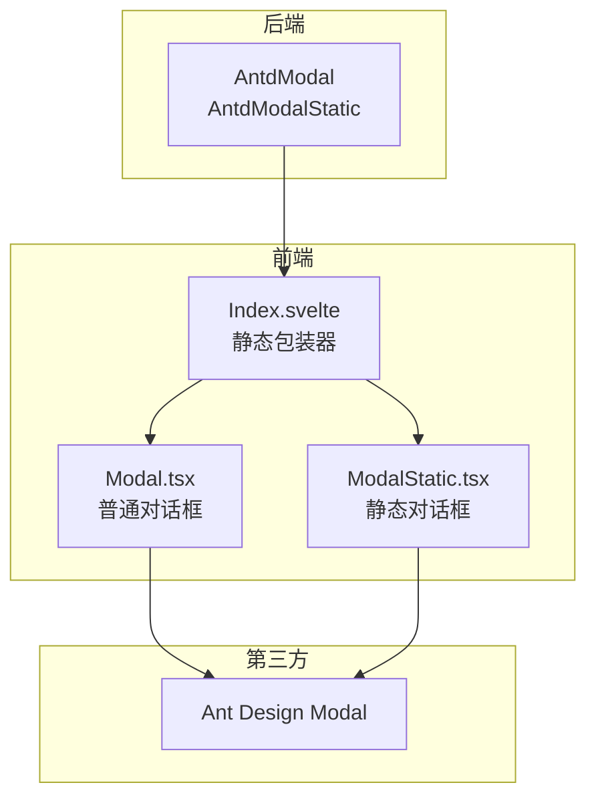
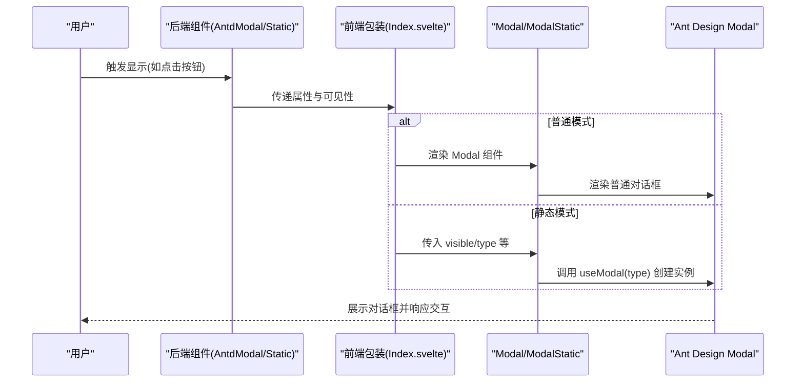
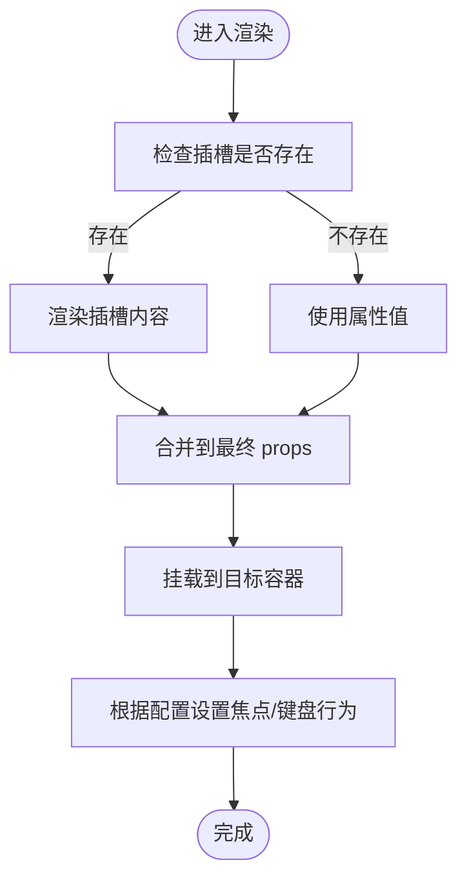
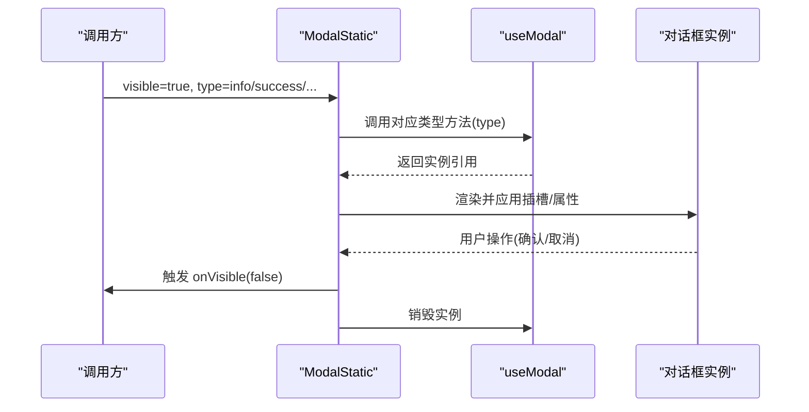
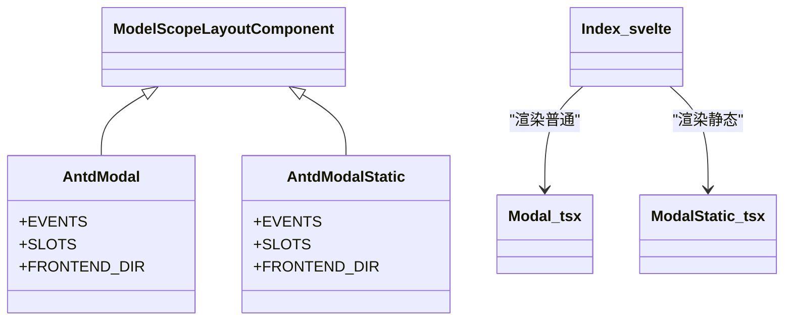
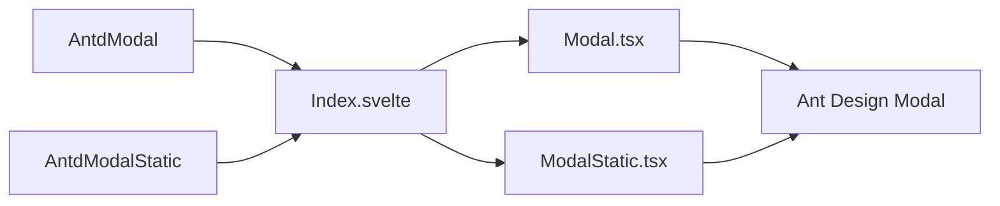

# 模态对话框组件

<cite>
**本文引用的文件**
- [frontend/antd/modal/modal.tsx](file://frontend/antd/modal/modal.tsx)
- [frontend/antd/modal/static/modal.static.tsx](file://frontend/antd/modal/static/modal.static.tsx)
- [backend/modelscope_studio/components/antd/modal/__init__.py](file://backend/modelscope_studio/components/antd/modal/__init__.py)
- [backend/modelscope_studio/components/antd/modal/static/__init__.py](file://backend/modelscope_studio/components/antd/modal/static/__init__.py)
- [frontend/antd/modal/static/Index.svelte](file://frontend/antd/modal/static/Index.svelte)
- [docs/components/antd/modal/README.md](file://docs/components/antd/modal/README.md)
- [docs/components/antd/modal/demos/basic.py](file://docs/components/antd/modal/demos/basic.py)
- [docs/components/antd/modal/demos/custom_footer.py](file://docs/components/antd/modal/demos/custom_footer.py)
- [docs/components/antd/modal/demos/static.py](file://docs/components/antd/modal/demos/static.py)
</cite>

## 目录

1. [简介](#简介)
2. [项目结构](#项目结构)
3. [核心组件](#核心组件)
4. [架构总览](#架构总览)
5. [组件详解](#组件详解)
6. [依赖关系分析](#依赖关系分析)
7. [性能与动画](#性能与动画)
8. [无障碍与键盘交互](#无障碍与键盘交互)
9. [故障排查](#故障排查)
10. [结论](#结论)
11. [附录：常用场景示例](#附录常用场景示例)

## 简介

本文件系统性梳理“模态对话框”组件群组，覆盖普通模态对话框（Modal）与静态模态对话框（Static Modal）的设计原理、使用场景、层级管理、焦点控制、键盘交互、事件与样式定制、动画与过渡、性能优化以及无障碍支持。文档同时提供基于仓库示例的实践指引，帮助开发者在 Gradio/ModelScope 生态中高效集成与扩展。

## 项目结构

该组件位于前端 Ant Design 包装层与后端 Python 组件桥接层之间，采用“前端 Svelte + React Slot + 后端 LayoutComponent”的分层设计：

- 前端层：通过 sveltify 将 Ant Design 的 Modal 包装为可插槽组件；静态模态通过 useModal API 动态渲染。
- 后端层：Python 组件封装 AntdModal/AntdModalStatic，暴露统一的属性与事件接口，并声明支持的插槽。
- 文档与示例：提供基础、自定义页脚、静态调用三类示例，便于快速上手。

图表来源

- [frontend/antd/modal/modal.tsx:1-107](file://frontend/antd/modal/modal.tsx#L1-L107)
- [frontend/antd/modal/static/modal.static.tsx:1-132](file://frontend/antd/modal/static/modal.static.tsx#L1-L132)
- [frontend/antd/modal/static/Index.svelte:1-69](file://frontend/antd/modal/static/Index.svelte#L1-L69)
- [backend/modelscope_studio/components/antd/modal/**init**.py:1-136](file://backend/modelscope_studio/components/antd/modal/__init__.py#L1-L136)
- [backend/modelscope_studio/components/antd/modal/static/**init**.py:1-133](file://backend/modelscope_studio/components/antd/modal/static/__init__.py#L1-L133)

章节来源

- [docs/components/antd/modal/README.md:1-13](file://docs/components/antd/modal/README.md#L1-L13)

## 核心组件

- 普通模态对话框（AntdModal）
  - 设计定位：以组件形式直接渲染，适合需要在布局树中显式管理生命周期与层级的场景。
  - 关键能力：支持插槽化标题、页脚、按钮图标与文本、关闭图标、自定义渲染器、容器挂载点、键盘与遮罩行为等。
- 静态模态对话框（AntdModalStatic）
  - 设计定位：通过 useModal 动态触发，无需在布局树中声明，适合消息提示、确认流程等一次性弹窗。
  - 关键能力：支持 info/success/error/warning/confirm 类型，自动聚焦按钮、可见性受控、onOk/onCancel 回调联动。

章节来源

- [backend/modelscope_studio/components/antd/modal/**init**.py:11-136](file://backend/modelscope_studio/components/antd/modal/__init__.py#L11-L136)
- [backend/modelscope_studio/components/antd/modal/static/**init**.py:10-133](file://backend/modelscope_studio/components/antd/modal/static/__init__.py#L10-L133)

## 架构总览

下图展示从用户触发到对话框呈现的关键调用链路，包括普通与静态两种模式：

图表来源

- [frontend/antd/modal/static/Index.svelte:54-68](file://frontend/antd/modal/static/Index.svelte#L54-L68)
- [frontend/antd/modal/modal.tsx:36-102](file://frontend/antd/modal/modal.tsx#L36-L102)
- [frontend/antd/modal/static/modal.static.tsx:46-128](file://frontend/antd/modal/static/modal.static.tsx#L46-L128)

## 组件详解

### 普通模态对话框（Modal）

- 插槽与属性映射
  - 支持插槽：okText、okButtonProps.icon、cancelText、cancelButtonProps.icon、closable.closeIcon、closeIcon、footer、title、modalRender。
  - 属性透传：afterOpenChange、afterClose、getContainer、keyboard、mask、maskClosable、width、zIndex、wrapClassName 等。
- 事件绑定
  - 通过事件监听器绑定 ok/cancel 事件，用于触发回调或更新可见性。
- 容器挂载与层级
  - 可通过 getContainer 指定挂载节点，避免层级被局部容器遮挡；默认挂载至 body。
- 焦点与键盘
  - keyboard 控制是否允许 Esc 关闭；可通过 autoFocusButton 等属性影响初始焦点。
- 自定义渲染
  - modalRender 可替换整块渲染逻辑；footer 支持函数式插槽，实现复杂页脚布局。

图表来源

- [frontend/antd/modal/modal.tsx:36-99](file://frontend/antd/modal/modal.tsx#L36-L99)

章节来源

- [frontend/antd/modal/modal.tsx:1-107](file://frontend/antd/modal/modal.tsx#L1-L107)
- [backend/modelscope_studio/components/antd/modal/**init**.py:18-32](file://backend/modelscope_studio/components/antd/modal/__init__.py#L18-L32)

### 静态模态对话框（ModalStatic）

- 动态创建与销毁
  - 通过 useModal 获取 API；当 visible 为真时创建对应类型实例，否则销毁当前实例。
  - 默认禁用自动聚焦按钮，除非显式传入。
- 事件与可见性联动
  - onOk/onCancel 内部会同步触发 onVisible(false)，实现“确认/取消即关闭”的一致行为。
- 插槽与属性
  - 支持 title、content、footer、okText、okButtonProps.icon、cancelText、cancelButtonProps.icon、closable.closeIcon、closeIcon、modalRender 等。
- 使用限制
  - 不在布局树中声明，仅通过 visible/type 等属性驱动；适合一次性提示与确认流程。

图表来源

- [frontend/antd/modal/static/modal.static.tsx:46-128](file://frontend/antd/modal/static/modal.static.tsx#L46-L128)

章节来源

- [frontend/antd/modal/static/modal.static.tsx:1-132](file://frontend/antd/modal/static/modal.static.tsx#L1-L132)
- [backend/modelscope_studio/components/antd/modal/static/**init**.py:14-28](file://backend/modelscope_studio/components/antd/modal/static/__init__.py#L14-L28)

### 组件关系与继承

- 后端组件类 AntdModal 与 AntdModalStatic 均继承自 ModelScopeLayoutComponent，统一了事件、插槽、属性与生命周期处理。
- 前端 Index.svelte 作为动态加载入口，负责将 props 与 slots 传递给 Modal 或 ModalStatic。

图表来源

- [backend/modelscope_studio/components/antd/modal/**init**.py:11-16](file://backend/modelscope_studio/components/antd/modal/__init__.py#L11-L16)
- [backend/modelscope_studio/components/antd/modal/static/**init**.py:10-13](file://backend/modelscope_studio/components/antd/modal/static/__init__.py#L10-L13)
- [frontend/antd/modal/static/Index.svelte:10-68](file://frontend/antd/modal/static/Index.svelte#L10-L68)

## 依赖关系分析

- 前端依赖
  - sveltify：将 React 组件桥接到 Svelte。
  - useFunction：将回调函数稳定化，避免重复渲染导致的副作用。
  - renderParamsSlot：支持带参数的插槽渲染。
  - Ant Design Modal：核心 UI 行为与样式。
- 后端依赖
  - Gradio 事件系统：通过事件监听器绑定 ok/cancel。
  - 组件基类 ModelScopeLayoutComponent：统一生命周期与属性处理。

图表来源

- [frontend/antd/modal/modal.tsx:1-107](file://frontend/antd/modal/modal.tsx#L1-L107)
- [frontend/antd/modal/static/modal.static.tsx:1-132](file://frontend/antd/modal/static/modal.static.tsx#L1-L132)
- [frontend/antd/modal/static/Index.svelte:1-69](file://frontend/antd/modal/static/Index.svelte#L1-L69)
- [backend/modelscope_studio/components/antd/modal/**init**.py:1-136](file://backend/modelscope_studio/components/antd/modal/__init__.py#L1-L136)
- [backend/modelscope_studio/components/antd/modal/static/**init**.py:1-133](file://backend/modelscope_studio/components/antd/modal/static/__init__.py#L1-L133)

## 性能与动画

- 渲染策略
  - 普通模式：按需渲染，open=false 时可配合 destroyOnClose/destroyOnHidden 减少内存占用。
  - 静态模式：visible 切换时动态创建/销毁实例，避免常驻 DOM。
- 动画与过渡
  - 由 Ant Design Modal 提供开合动画与遮罩过渡；可通过 width、zIndex、wrapClassName 等调整视觉层级与尺寸。
- 性能建议
  - 大量弹窗场景优先使用静态模式，减少布局树节点数量。
  - 对频繁切换的弹窗，合理设置 getContainer，避免不必要的重排。
  - 使用 modalRender 自定义渲染时，尽量减少深层嵌套与昂贵计算。

[本节为通用指导，不直接分析具体文件]

## 无障碍与键盘交互

- 键盘交互
  - keyboard 控制是否允许 Esc 关闭；maskClosable 控制点击遮罩是否关闭。
  - 静态模式默认禁用自动聚焦按钮，避免打断用户操作；可通过 autoFocusButton 显式指定。
- 焦点管理
  - 打开后应将焦点移至首个交互元素（如确认按钮），关闭后返回触发源（focusTriggerAfterClose）。
- 屏幕阅读器
  - 提供清晰的标题与内容；必要时通过 aria-\* 属性补充语义。
  - 避免在 modalRender 中使用仅有颜色区分的提示，确保文本可读。

[本节为通用指导，不直接分析具体文件]

## 故障排查

- 问题：弹窗未显示
  - 检查 visible/open 是否正确传入；静态模式需确保 visible 从 false 切换为 true。
  - 确认 getContainer 指向有效节点，避免被父级裁剪。
- 问题：点击遮罩无法关闭
  - 检查 maskClosable 与 keyboard 设置；确认未被外部事件拦截。
- 问题：静态弹窗不消失
  - 确保 onOk/onCancel 回调中调用了 onVisible(false)；或直接将 visible 更新为 false。
- 问题：插槽不生效
  - 确认插槽名称与组件支持列表一致；普通模式使用 slots，静态模式使用 visible/type 驱动。

章节来源

- [frontend/antd/modal/static/modal.static.tsx:107-114](file://frontend/antd/modal/static/modal.static.tsx#L107-L114)
- [backend/modelscope_studio/components/antd/modal/**init**.py:18-32](file://backend/modelscope_studio/components/antd/modal/__init__.py#L18-L32)

## 结论

- 普通模态对话框适合需要在布局树中精细控制生命周期与层级的场景；静态模态对话框适合一次性提示与确认流程。
- 通过插槽与属性的灵活组合，可实现丰富的交互与样式定制；结合 useModal 与事件系统，可构建一致的用户体验。
- 在性能与无障碍方面，建议优先选择静态模式处理高频弹窗，合理设置焦点与键盘行为，并确保内容对屏幕阅读器友好。

[本节为总结性内容，不直接分析具体文件]

## 附录：常用场景示例

以下示例来自仓库文档与演示，展示不同使用方式与典型场景。

- 基础弹窗
  - 场景：打开/关闭、确认/取消。
  - 示例路径：[docs/components/antd/modal/demos/basic.py:1-19](file://docs/components/antd/modal/demos/basic.py#L1-L19)
- 自定义页脚
  - 场景：自定义底部按钮、链接跳转、组合交互。
  - 示例路径：[docs/components/antd/modal/demos/custom_footer.py:1-31](file://docs/components/antd/modal/demos/custom_footer.py#L1-L31)
- 静态弹窗（信息/成功/错误/警告/确认）
  - 场景：消息提示、确认对话框。
  - 示例路径：[docs/components/antd/modal/demos/static.py:1-74](file://docs/components/antd/modal/demos/static.py#L1-L74)

章节来源

- [docs/components/antd/modal/demos/basic.py:1-19](file://docs/components/antd/modal/demos/basic.py#L1-L19)
- [docs/components/antd/modal/demos/custom_footer.py:1-31](file://docs/components/antd/modal/demos/custom_footer.py#L1-L31)
- [docs/components/antd/modal/demos/static.py:1-74](file://docs/components/antd/modal/demos/static.py#L1-L74)
