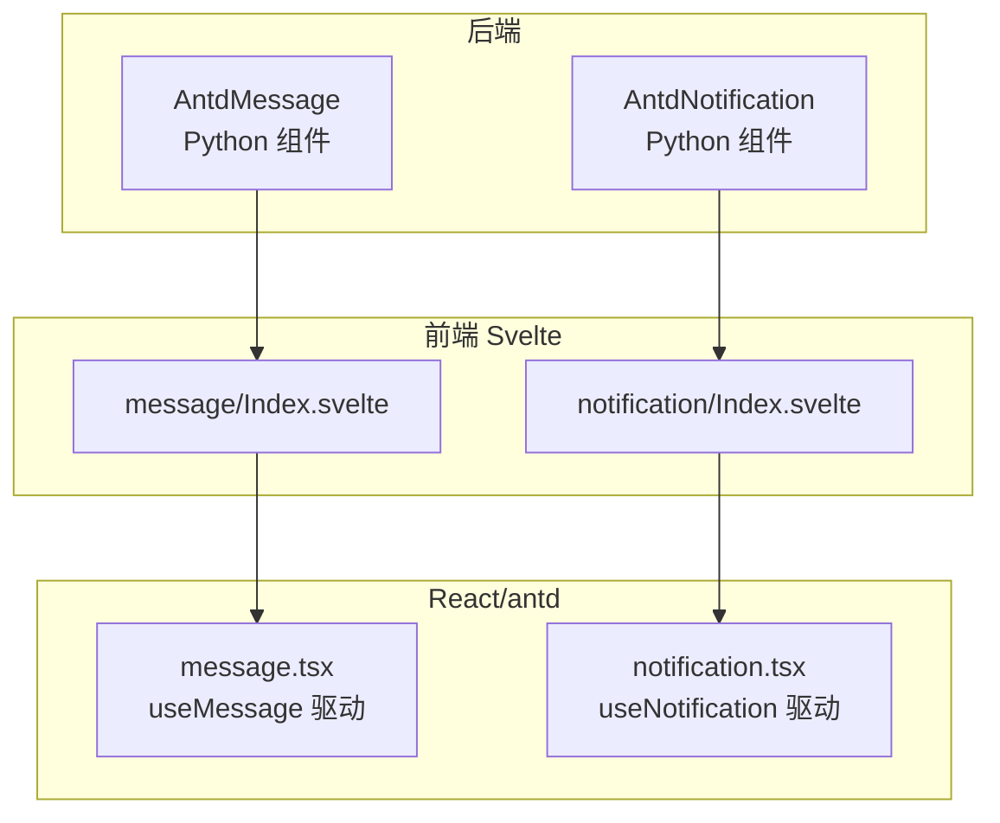
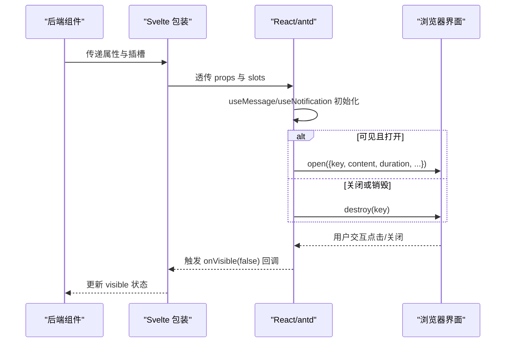
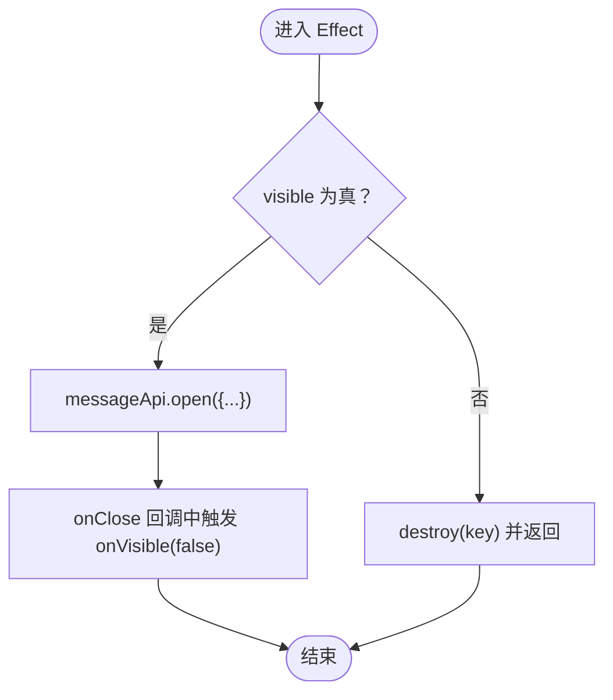
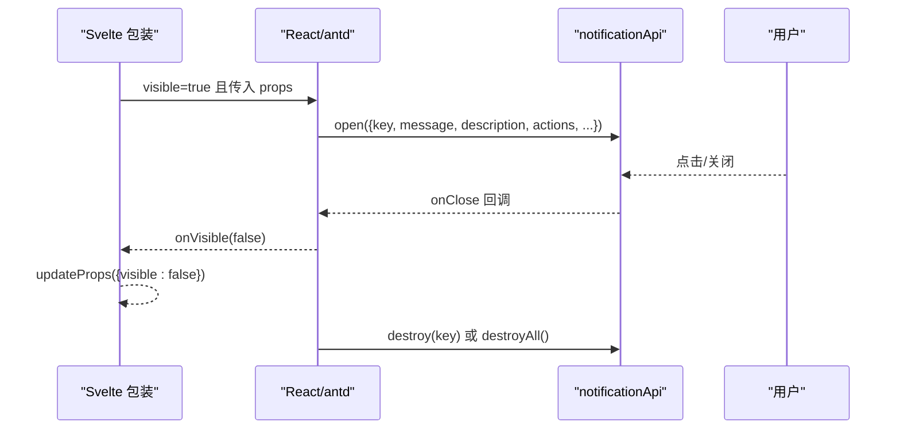
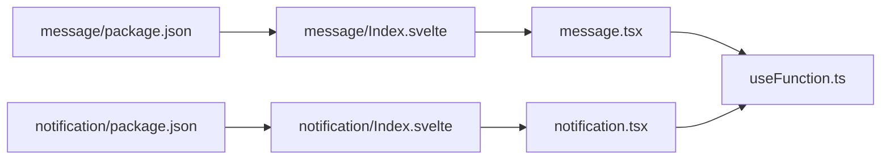

# 消息通知组件

<cite>
**本文引用的文件**
- [frontend/antd/message/message.tsx](file://frontend/antd/message/message.tsx)
- [frontend/antd/notification/notification.tsx](file://frontend/antd/notification/notification.tsx)
- [frontend/antd/message/Index.svelte](file://frontend/antd/message/Index.svelte)
- [frontend/antd/notification/Index.svelte](file://frontend/antd/notification/Index.svelte)
- [backend/modelscope_studio/components/antd/message/__init__.py](file://backend/modelscope_studio/components/antd/message/__init__.py)
- [backend/modelscope_studio/components/antd/notification/__init__.py](file://backend/modelscope_studio/components/antd/notification/__init__.py)
- [frontend/utils/hooks/useFunction.ts](file://frontend/utils/hooks/useFunction.ts)
- [frontend/antd/message/package.json](file://frontend/antd/message/package.json)
- [frontend/antd/notification/package.json](file://frontend/antd/notification/package.json)
</cite>

## 目录

1. [简介](#简介)
2. [项目结构](#项目结构)
3. [核心组件](#核心组件)
4. [架构总览](#架构总览)
5. [详细组件分析](#详细组件分析)
6. [依赖关系分析](#依赖关系分析)
7. [性能与内存管理](#性能与内存管理)
8. [故障排查指南](#故障排查指南)
9. [结论](#结论)
10. [附录：使用示例与最佳实践](#附录使用示例与最佳实践)

## 简介

本文件系统性梳理消息通知组件群组，聚焦两类全局反馈组件：全局提示（Message）与通知提醒框（Notification）。文档从设计理念、使用场景、差异对比、配置项与动态行为、生命周期与内存清理、到无障碍与体验优化进行完整说明，并提供可直接定位到源码的路径指引，帮助开发者快速上手并正确使用。

## 项目结构

消息通知组件由“后端 Python 组件 + 前端 Svelte 包装 + React/antd 实现”三层构成：

- 后端组件负责参数校验、事件绑定、渲染控制与前端包导出声明；
- 前端 Svelte 层负责属性透传、插槽（slots）映射与可见性状态同步；
- React 层基于 antd 的 message/notification API 实现具体的消息弹出、堆叠与销毁逻辑。

图表来源

- [backend/modelscope_studio/components/antd/message/**init**.py:10-91](file://backend/modelscope_studio/components/antd/message/__init__.py#L10-L91)
- [backend/modelscope_studio/components/antd/notification/**init**.py:10-109](file://backend/modelscope_studio/components/antd/notification/__init__.py#L10-L109)
- [frontend/antd/message/Index.svelte:10-78](file://frontend/antd/message/Index.svelte#L10-L78)
- [frontend/antd/notification/Index.svelte:10-80](file://frontend/antd/notification/Index.svelte#L10-L80)
- [frontend/antd/message/message.tsx:9-79](file://frontend/antd/message/message.tsx#L9-L79)
- [frontend/antd/notification/notification.tsx:8-106](file://frontend/antd/notification/notification.tsx#L8-L106)

章节来源

- [frontend/antd/message/package.json:1-15](file://frontend/antd/message/package.json#L1-L15)
- [frontend/antd/notification/package.json:1-15](file://frontend/antd/notification/package.json#L1-L15)

## 核心组件

- 全局提示（Message）
  - 设计目标：对用户操作给出即时、简洁的反馈，常用于提交成功、失败、警告或加载提示。
  - 关键特性：轻量、无遮罩、自动消失、可配置时长、可按 key 控制唯一性与覆盖。
- 通知提醒框（Notification）
  - 设计目标：在页面角落区域弹出较丰富的内容，适合需要携带标题、描述、按钮、动作等的提醒。
  - 关键特性：支持多位置放置（top/bottom/left/right）、堆叠管理、进度条、悬停暂停、可自定义按钮与动作。

章节来源

- [backend/modelscope_studio/components/antd/message/**init**.py:10-91](file://backend/modelscope_studio/components/antd/message/__init__.py#L10-L91)
- [backend/modelscope_studio/components/antd/notification/**init**.py:10-109](file://backend/modelscope_studio/components/antd/notification/__init__.py#L10-L109)

## 架构总览

消息组件的调用链路如下：后端组件实例化 → 前端 Svelte 渲染 → React/antd 执行 open/destroy → 生命周期回调触发状态回传。

图表来源

- [frontend/antd/message/message.tsx:30-68](file://frontend/antd/message/message.tsx#L30-L68)
- [frontend/antd/notification/notification.tsx:31-95](file://frontend/antd/notification/notification.tsx#L31-L95)
- [frontend/antd/message/Index.svelte:58-77](file://frontend/antd/message/Index.svelte#L58-L77)
- [frontend/antd/notification/Index.svelte:59-79](file://frontend/antd/notification/Index.svelte#L59-L79)

## 详细组件分析

### 全局提示（Message）组件

- 职责与行为
  - 基于 antd 的 message.useMessage 提供全局提示能力；
  - 支持通过 visible 控制是否打开，messageKey 控制唯一性；
  - 支持 slots.content 与 slots.icon 自定义内容与图标；
  - 关闭时触发 onVisible(false)，并在组件卸载时销毁对应 key。
- 关键配置项（节选）
  - 内容与类型：content、type（success/info/warning/error/loading）
  - 显示时长：duration（秒）
  - 容器挂载点：getContainer（函数）
  - 文案与样式：className、style、rootClassName
  - 键值与可见性：messageKey、visible
- 动态更新与批量
  - 通过 messageKey 实现同一位置的覆盖与更新；
  - 多个消息可同时存在，互不干扰；
  - 使用 destroy(key) 或 destroyAll() 进行批量清理。
- 生命周期与内存
  - 打开时注册；关闭/卸载时销毁；避免残留 DOM 与事件监听。

图表来源

- [frontend/antd/message/message.tsx:35-68](file://frontend/antd/message/message.tsx#L35-L68)

章节来源

- [frontend/antd/message/message.tsx:9-79](file://frontend/antd/message/message.tsx#L9-L79)
- [frontend/antd/message/Index.svelte:19-77](file://frontend/antd/message/Index.svelte#L19-L77)
- [backend/modelscope_studio/components/antd/message/**init**.py:26-72](file://backend/modelscope_studio/components/antd/message/__init__.py#L26-L72)

### 通知提醒框（Notification）组件

- 职责与行为
  - 基于 antd 的 notification.useNotification 提供全局通知能力；
  - 支持多位置（top/bottom/left/right 及其组合）与堆叠管理；
  - 支持 slots.message/description/icon/actions/btn/closeIcon 等丰富插槽；
  - 关闭时触发 onVisible(false)，并在卸载时销毁对应 key。
- 关键配置项（节选）
  - 位置与堆叠：placement、stack、top、bottom、rtl
  - 内容与交互：message、description、btn、actions、closeIcon、icon
  - 行为与体验：duration、showProgress、pauseOnHover、role（alert/status）
  - 键值与可见性：notificationKey、visible
- 动态更新与批量
  - 通过 notificationKey 实现同一通知的覆盖；
  - 支持 destroyAll() 进行批量清理；
  - 堆叠模式下可控制新旧通知的排列与覆盖策略。
- 生命周期与内存
  - 打开时注册；关闭/卸载时销毁；避免内存泄漏。

图表来源

- [frontend/antd/notification/notification.tsx:38-95](file://frontend/antd/notification/notification.tsx#L38-L95)
- [frontend/antd/notification/Index.svelte:59-79](file://frontend/antd/notification/Index.svelte#L59-L79)

章节来源

- [frontend/antd/notification/notification.tsx:8-106](file://frontend/antd/notification/notification.tsx#L8-L106)
- [frontend/antd/notification/Index.svelte:19-79](file://frontend/antd/notification/Index.svelte#L19-L79)
- [backend/modelscope_studio/components/antd/notification/**init**.py:26-90](file://backend/modelscope_studio/components/antd/notification/__init__.py#L26-L90)

### 两者的区别与适用场景

- 适用场景
  - Message：轻量反馈、短文本提示、无需复杂交互；
  - Notification：需要标题/描述/按钮/动作、多位置展示、强调重要信息。
- 显示位置与堆叠
  - Message：默认在容器内顶部或指定容器出现，不支持多位置；
  - Notification：支持 top/bottom/left/right 及组合，具备堆叠管理与进度条。
- 交互与可访问性
  - Notification：支持 role（alert/status），便于屏幕阅读器识别；
  - Message：更偏向一次性提示，交互较少。
- 动态与批量
  - 两者均支持 key 唯一性与覆盖；Notification 更易实现批量清理与堆叠策略。

章节来源

- [backend/modelscope_studio/components/antd/message/**init**.py:26-72](file://backend/modelscope_studio/components/antd/message/__init__.py#L26-L72)
- [backend/modelscope_studio/components/antd/notification/**init**.py:26-90](file://backend/modelscope_studio/components/antd/notification/__init__.py#L26-L90)

## 依赖关系分析

- 组件导出与入口
  - message/notification 均通过 package.json 暴露 Gradio 兼容入口；
- 前端桥接
  - Svelte 包装负责属性与插槽透传、visible 状态回写；
  - React 层通过 useFunction 将 getContainer 等函数安全注入 antd API；
- 事件与插槽
  - 后端声明事件 click/close，Svelte 侧通过 \_internal 标志绑定；
  - 插槽映射：Message(content/icon)、Notification(actions/btn/closeIcon/description/icon/message/title)。

图表来源

- [frontend/antd/message/package.json:1-15](file://frontend/antd/message/package.json#L1-L15)
- [frontend/antd/notification/package.json:1-15](file://frontend/antd/notification/package.json#L1-L15)
- [frontend/antd/message/Index.svelte:10](file://frontend/antd/message/Index.svelte#L10)
- [frontend/antd/notification/Index.svelte:10](file://frontend/antd/notification/Index.svelte#L10)
- [frontend/antd/message/message.tsx:29](file://frontend/antd/message/message.tsx#L29)
- [frontend/antd/notification/notification.tsx:31](file://frontend/antd/notification/notification.tsx#L31)
- [frontend/utils/hooks/useFunction.ts:5-12](file://frontend/utils/hooks/useFunction.ts#L5-L12)

章节来源

- [frontend/utils/hooks/useFunction.ts:1-13](file://frontend/utils/hooks/useFunction.ts#L1-L13)

## 性能与内存管理

- 性能特征
  - Message：轻量、无遮罩、DOM 数量少，适合高频提示；
  - Notification：支持堆叠与进度条，视觉反馈更强但 DOM 数量可能增加。
- 内存清理策略
  - 关闭与卸载时统一调用 destroy(key)/destroyAll()；
  - 通过 key 精准控制资源回收，避免重复渲染与事件累积；
  - 使用 getContainer 将消息挂载到最小必要容器，减少重排与重绘。
- 最佳实践
  - 为每个独立消息设置唯一 key；
  - 合理设置 duration，避免过多消息长期驻留；
  - 在批量操作中使用 destroyAll() 清理过期消息；
  - 对于频繁触发的操作，优先使用 Message，必要时再引入 Notification。

章节来源

- [frontend/antd/message/message.tsx:51-58](file://frontend/antd/message/message.tsx#L51-L58)
- [frontend/antd/notification/notification.tsx:74-77](file://frontend/antd/notification/notification.tsx#L74-L77)

## 故障排查指南

- 常见问题
  - 消息未显示：检查 visible 是否为 true，以及 messageKey 是否正确传入；
  - 无法关闭：确认 onClose 回调是否被覆盖，确保 onVisible 回调链路正常；
  - 重复消息：为每个消息设置唯一 key，避免被后续 open 覆盖；
  - 位置异常：确认 getContainer 返回的挂载节点存在且可见。
- 排查步骤
  - 在 Svelte 层打印 props 与 visible 状态；
  - 在 React 层确认 messageApi/notificationApi 已初始化；
  - 使用 destroyAll() 快速清场，验证是否仍残留 DOM；
  - 检查 getContainer 函数是否稳定返回同一节点。

章节来源

- [frontend/antd/message/message.tsx:35-68](file://frontend/antd/message/message.tsx#L35-L68)
- [frontend/antd/notification/notification.tsx:38-95](file://frontend/antd/notification/notification.tsx#L38-L95)

## 结论

消息通知组件群组以“后端参数 + 前端桥接 + React/antd 驱动”的分层设计实现了高可用、可扩展的全局反馈能力。Message 适合轻量提示，Notification 适合丰富通知。通过合理的 key 策略、时长配置与销毁机制，可在保证体验的同时维持良好的性能与内存健康。

## 附录：使用示例与最佳实践

- 成功提示（Message）
  - 设置 type 为 success，duration 为合适时长，messageKey 唯一化；
  - 通过 visible 切换显示，onClose 同步 visible 状态。
  - 示例路径参考：[frontend/antd/message/message.tsx:35-50](file://frontend/antd/message/message.tsx#L35-L50)
- 错误警告（Notification）
  - 设置 type 为 error，message/description 丰富内容，actions 提供操作；
  - 使用 destroyAll() 清理历史错误消息，避免堆积。
  - 示例路径参考：[frontend/antd/notification/notification.tsx:38-69](file://frontend/antd/notification/notification.tsx#L38-L69)
- 信息通知（Notification）
  - 使用 placement 指定位置（如 topRight），role 设为 status；
  - 通过 stack 控制堆叠，pauseOnHover 提升可读性。
  - 示例路径参考：[frontend/antd/notification/notification.tsx:31-36](file://frontend/antd/notification/notification.tsx#L31-L36)
- 手动关闭
  - 通过 onVisible(false) 主动关闭，或在外部调用 destroy(key)；
  - 示例路径参考：[frontend/antd/message/message.tsx:46-50](file://frontend/antd/message/message.tsx#L46-L50)、[frontend/antd/notification/notification.tsx:65-69](file://frontend/antd/notification/notification.tsx#L65-L69)
- 动态更新与批量操作
  - 使用 messageKey 覆盖已有消息；
  - 使用 destroyAll() 批量清理，避免内存泄漏。
  - 示例路径参考：[frontend/antd/message/message.tsx:51-58](file://frontend/antd/message/message.tsx#L51-L58)、[frontend/antd/notification/notification.tsx:74-77](file://frontend/antd/notification/notification.tsx#L74-L77)

无障碍与体验优化建议

- 为 Notification 设置 role（alert/status），提升可访问性；
- 合理设置 duration，避免打断用户任务；
- 对关键操作提供明确的反馈文案与操作按钮；
- 在暗色主题或高对比度场景下，确保消息颜色与图标清晰可辨。

章节来源

- [backend/modelscope_studio/components/antd/notification/**init**.py:40-44](file://backend/modelscope_studio/components/antd/notification/__init__.py#L40-L44)
- [frontend/antd/notification/notification.tsx:65-69](file://frontend/antd/notification/notification.tsx#L65-L69)
