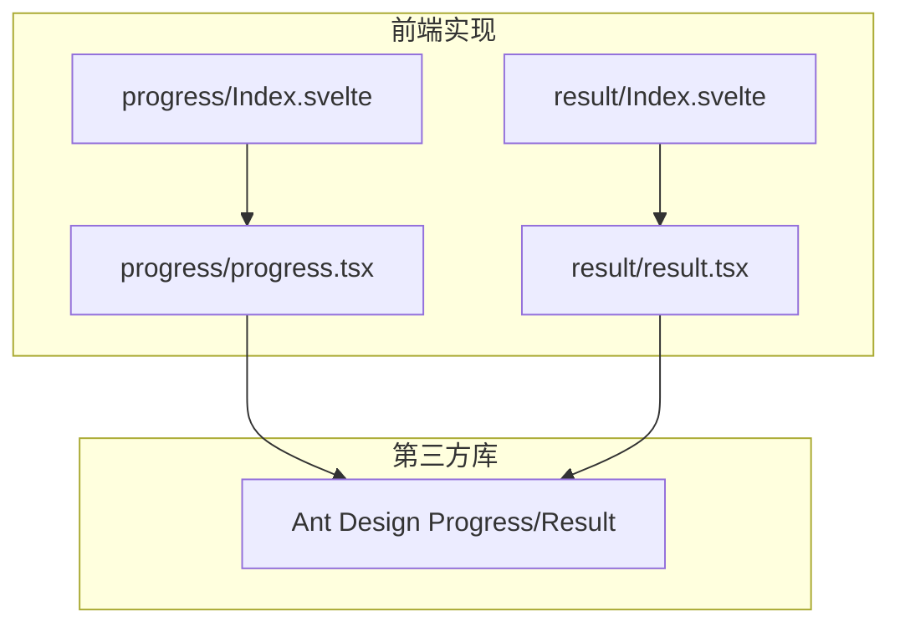
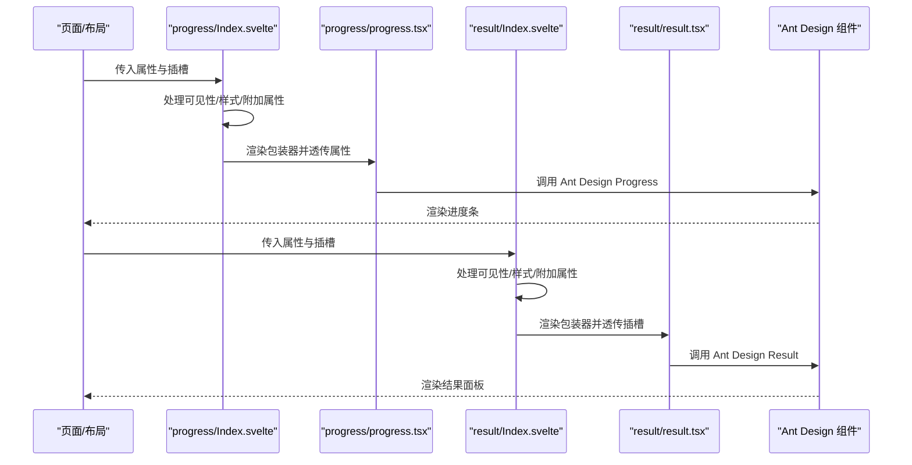
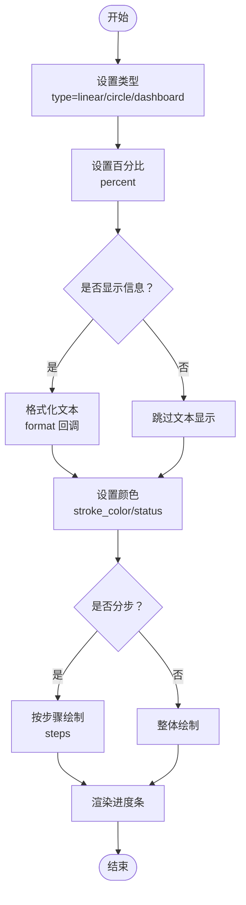
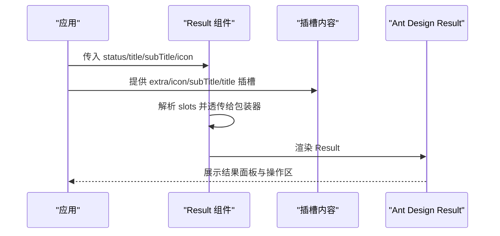
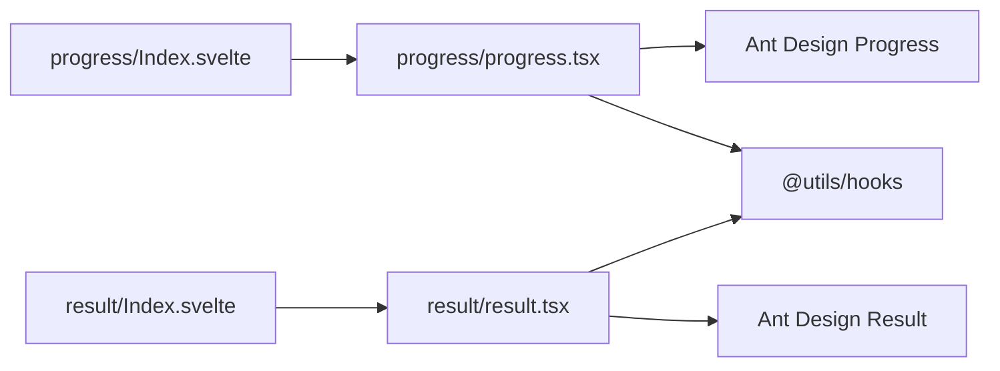

# 进度结果组件

<cite>
**本文引用的文件**
- [frontend/antd/progress/progress.tsx](file://frontend/antd/progress/progress.tsx)
- [frontend/antd/progress/Index.svelte](file://frontend/antd/progress/Index.svelte)
- [docs/components/antd/progress/README.md](file://docs/components/antd/progress/README.md)
- [docs/components/antd/progress/demos/basic.py](file://docs/components/antd/progress/demos/basic.py)
- [frontend/antd/result/result.tsx](file://frontend/antd/result/result.tsx)
- [frontend/antd/result/Index.svelte](file://frontend/antd/result/Index.svelte)
- [docs/components/antd/result/README.md](file://docs/components/antd/result/README.md)
- [docs/components/antd/result/demos/basic.py](file://docs/components/antd/result/demos/basic.py)
</cite>

## 目录

1. [简介](#简介)
2. [项目结构](#项目结构)
3. [核心组件](#核心组件)
4. [架构总览](#架构总览)
5. [详细组件分析](#详细组件分析)
6. [依赖关系分析](#依赖关系分析)
7. [性能考量](#性能考量)
8. [故障排查指南](#故障排查指南)
9. [结论](#结论)
10. [附录](#附录)

## 简介

本文件聚焦于进度结果组件群组，系统性梳理进度条（Progress）与结果（Result）两大组件的功能特性、形态差异、状态语义、属性配置、动画与样式定制方法，并结合仓库内的演示示例，给出文件上传进度、任务执行状态、操作结果反馈等典型应用场景的实践建议。同时，提供用户体验优化与无障碍访问支持要点，帮助开发者在 Gradio 生态中高效、一致地使用进度与结果组件。

## 项目结构

- 组件实现位于前端层：每个组件由 Svelte 入口文件负责属性处理与插槽渲染，TypeScript 包装器对接 Ant Design 原生组件。
- 文档与演示位于 docs/components/antd 下，提供组件说明与可运行示例。
- 组件入口与包装器的关系如下图所示：

图表来源

- [frontend/antd/progress/Index.svelte:1-64](file://frontend/antd/progress/Index.svelte#L1-L64)
- [frontend/antd/progress/progress.tsx:1-24](file://frontend/antd/progress/progress.tsx#L1-L24)
- [frontend/antd/result/Index.svelte:1-64](file://frontend/antd/result/Index.svelte#L1-L64)
- [frontend/antd/result/result.tsx:1-33](file://frontend/antd/result/result.tsx#L1-L33)

章节来源

- [frontend/antd/progress/Index.svelte:1-64](file://frontend/antd/progress/Index.svelte#L1-L64)
- [frontend/antd/progress/progress.tsx:1-24](file://frontend/antd/progress/progress.tsx#L1-L24)
- [frontend/antd/result/Index.svelte:1-64](file://frontend/antd/result/Index.svelte#L1-L64)
- [frontend/antd/result/result.tsx:1-33](file://frontend/antd/result/result.tsx#L1-L33)

## 核心组件

- 进度条（Progress）
  - 支持线形、环形、仪表盘三种形态（通过 type 控制），并可叠加步骤分段（steps）、数值显示开关（show_info）、状态色（stroke_color）等。
  - 提供百分比（percent）与格式化回调（format）以灵活控制文本显示；支持自定义取整函数（rounding）。
  - 常见状态：默认、进行中（status='active'）、异常（status='exception'）、完成（status='success'）。
- 结果（Result）
  - 用于反馈一系列操作的最终结果，支持成功、信息、警告、错误四种状态（status）。
  - 支持标题（title）、副标题（sub_title）、图标（icon）与额外操作区（extra）插槽，便于扩展按钮、链接或复杂内容。

章节来源

- [docs/components/antd/progress/README.md:1-8](file://docs/components/antd/progress/README.md#L1-L8)
- [docs/components/antd/result/README.md:1-8](file://docs/components/antd/result/README.md#L1-L8)
- [docs/components/antd/progress/demos/basic.py:1-39](file://docs/components/antd/progress/demos/basic.py#L1-L39)
- [docs/components/antd/result/demos/basic.py:1-57](file://docs/components/antd/result/demos/basic.py#L1-L57)

## 架构总览

下图展示了从 Svelte 入口到 Ant Design 原生组件的调用链路与插槽传递机制：

图表来源

- [frontend/antd/progress/Index.svelte:10-61](file://frontend/antd/progress/Index.svelte#L10-L61)
- [frontend/antd/progress/progress.tsx:5-21](file://frontend/antd/progress/progress.tsx#L5-L21)
- [frontend/antd/result/Index.svelte:10-59](file://frontend/antd/result/Index.svelte#L10-L59)
- [frontend/antd/result/result.tsx:7-30](file://frontend/antd/result/result.tsx#L7-L30)

## 详细组件分析

### 进度条（Progress）组件

- 形态与行为
  - 线形进度条：默认类型，适合长流程、持续时间较长的任务。
  - 环形进度条：type="circle"，适合强调完成度或作为卡片内指标。
  - 仪表盘进度条：type="dashboard"，适合阈值判断与区间可视化。
  - 步骤分段：steps 参数将进度拆分为若干阶段，常用于多阶段任务。
- 数值显示与格式化
  - percent 百分比输入，show_info 控制是否显示数字或状态图标。
  - format 回调可自定义文本内容，如完成时显示“完成”文案。
  - rounding 可对百分比进行取整策略定制。
- 颜色与状态
  - stroke_color 支持单色或渐变数组，按步骤或整体着色。
  - status 控制状态色与动画：默认、进行中（active）、异常（exception）、成功（success）。
- 属性与插槽
  - 属性：percent、type、steps、stroke_color、status、show_info、format、rounding 等。
  - 插槽：无内置插槽，主要通过 format 自定义文本。
- 使用场景
  - 文件上传进度：线形进度条展示实时百分比，完成时切换为成功状态。
  - 任务执行状态：环形进度条作为卡片内指标，仪表盘用于阈值提醒。
  - 分步流程：steps 将复杂流程拆解为多个阶段，提升可感知性。

图表来源

- [frontend/antd/progress/progress.tsx:5-21](file://frontend/antd/progress/progress.tsx#L5-L21)
- [docs/components/antd/progress/demos/basic.py:9-35](file://docs/components/antd/progress/demos/basic.py#L9-L35)

章节来源

- [frontend/antd/progress/progress.tsx:1-24](file://frontend/antd/progress/progress.tsx#L1-L24)
- [frontend/antd/progress/Index.svelte:10-61](file://frontend/antd/progress/Index.svelte#L10-L61)
- [docs/components/antd/progress/README.md:1-8](file://docs/components/antd/progress/README.md#L1-L8)
- [docs/components/antd/progress/demos/basic.py:1-39](file://docs/components/antd/progress/demos/basic.py#L1-L39)

### 结果（Result）组件

- 状态与语义
  - 成功（success）：操作已成功完成，鼓励继续下一步。
  - 信息（info）：提供中性提示，引导用户查看详情。
  - 警告（warning）：存在风险或需注意的问题，建议用户确认。
  - 错误（error）：操作失败，需要修正后重试。
- 视觉与内容
  - 标题（title）与副标题（sub_title）清晰传达结果与上下文。
  - 图标（icon）可自定义，配合状态色增强识别。
  - 额外区域（extra）插槽放置操作按钮、链接或补充说明。
- 属性与插槽
  - 属性：status、title、sub_title、icon、extra 等。
  - 插槽：extra、icon、subTitle、title。
- 使用场景
  - 操作结果反馈：提交表单、购买服务后的统一反馈界面。
  - 错误诊断：在错误状态下展示具体问题与修复指引。
  - 引导转化：在成功后提供“前往控制台”“再次购买”等操作。

图表来源

- [frontend/antd/result/result.tsx:7-30](file://frontend/antd/result/result.tsx#L7-L30)
- [frontend/antd/result/Index.svelte:10-59](file://frontend/antd/result/Index.svelte#L10-L59)

章节来源

- [frontend/antd/result/result.tsx:1-33](file://frontend/antd/result/result.tsx#L1-L33)
- [frontend/antd/result/Index.svelte:1-64](file://frontend/antd/result/Index.svelte#L1-L64)
- [docs/components/antd/result/README.md:1-8](file://docs/components/antd/result/README.md#L1-L8)
- [docs/components/antd/result/demos/basic.py:1-57](file://docs/components/antd/result/demos/basic.py#L1-L57)

## 依赖关系分析

- 组件耦合与职责
  - Svelte 入口负责属性收集、可见性控制、样式拼接与插槽解析。
  - TypeScript 包装器负责对接 Ant Design 组件，透传属性与回调（format、rounding）。
  - 插槽系统通过 ReactSlot 与 useTargets 实现，确保 slots 的动态渲染与回退。
- 外部依赖
  - Ant Design Progress/Result：提供核心 UI 与交互行为。
  - @svelte-preprocess-react：桥接 React 组件与 Svelte 上下文。
  - @utils/hooks：提供 useFunction、useTargets 等工具函数。

图表来源

- [frontend/antd/progress/Index.svelte:1-64](file://frontend/antd/progress/Index.svelte#L1-L64)
- [frontend/antd/progress/progress.tsx:1-24](file://frontend/antd/progress/progress.tsx#L1-L24)
- [frontend/antd/result/Index.svelte:1-64](file://frontend/antd/result/Index.svelte#L1-L64)
- [frontend/antd/result/result.tsx:1-33](file://frontend/antd/result/result.tsx#L1-L33)

章节来源

- [frontend/antd/progress/progress.tsx:1-24](file://frontend/antd/progress/progress.tsx#L1-L24)
- [frontend/antd/result/result.tsx:1-33](file://frontend/antd/result/result.tsx#L1-L33)

## 性能考量

- 渲染开销
  - 进度条：线形与环形渲染成本相近，分步（steps）会增加路径绘制次数；建议在高频更新场景下减少不必要的重渲染。
  - 结果：内容相对静态，插槽渲染仅在内容变化时触发。
- 动画与流畅度
  - 使用 format 回调时避免复杂计算，尽量返回轻量字符串。
  - 圆形/仪表盘进度条在高刷新率下可能带来 GPU 压力，建议在移动端谨慎使用大尺寸环形进度。
- 样式与主题
  - 通过 elem_style/elem_classes 注入样式时，优先使用原子类或主题变量，减少内联样式的抖动。

## 故障排查指南

- 插槽未生效
  - 确认插槽名称正确（extra、icon、subTitle、title），并在包装器中显式透传 slots。
  - 若未提供插槽内容，包装器会回退到 props 对应字段。
- 百分比不更新
  - 确保 percent 属性随数据变化而更新；避免在 format 中进行昂贵计算导致卡顿。
  - 如需自定义取整，检查 rounding 函数的输入输出类型与边界值。
- 状态色异常
  - status 与 stroke_color 同时使用时，注意状态优先级与颜色覆盖顺序。
  - steps 为数组时，确保长度与阶段数一致，避免越界。
- 可访问性
  - 为关键状态（成功/错误）提供语义化标签与屏幕阅读器友好的文本。
  - 在环形进度条中为不可见文本提供替代描述，确保辅助技术可理解进度含义。

章节来源

- [frontend/antd/result/result.tsx:10-30](file://frontend/antd/result/result.tsx#L10-L30)
- [frontend/antd/progress/progress.tsx:9-21](file://frontend/antd/progress/progress.tsx#L9-L21)

## 结论

进度条与结果组件在 Gradio 生态中承担了“过程可见性”与“结果反馈”的双重职责。通过 Ant Design 的成熟能力与本项目的 Svelte 包装器，开发者可以以最小成本获得一致、可扩展且可定制的进度与结果体验。建议在实际项目中结合业务场景选择合适的形态与状态，并遵循可访问性与性能最佳实践，以提升用户满意度与可维护性。

## 附录

- 示例参考
  - 进度条基础演示：[docs/components/antd/progress/demos/basic.py:1-39](file://docs/components/antd/progress/demos/basic.py#L1-L39)
  - 结果组件基础演示：[docs/components/antd/result/demos/basic.py:1-57](file://docs/components/antd/result/demos/basic.py#L1-L57)
- 组件文档
  - 进度条文档：[docs/components/antd/progress/README.md:1-8](file://docs/components/antd/progress/README.md#L1-L8)
  - 结果文档：[docs/components/antd/result/README.md:1-8](file://docs/components/antd/result/README.md#L1-L8)
