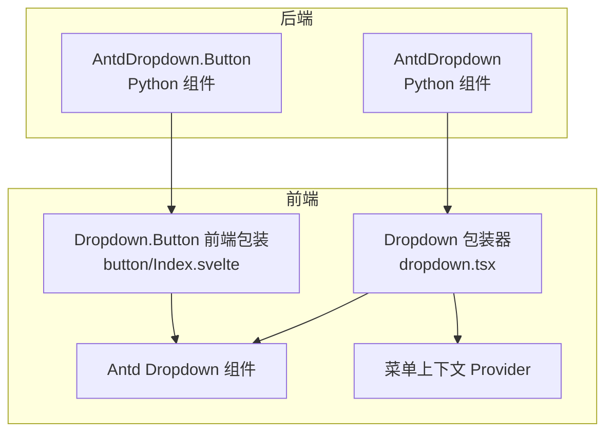
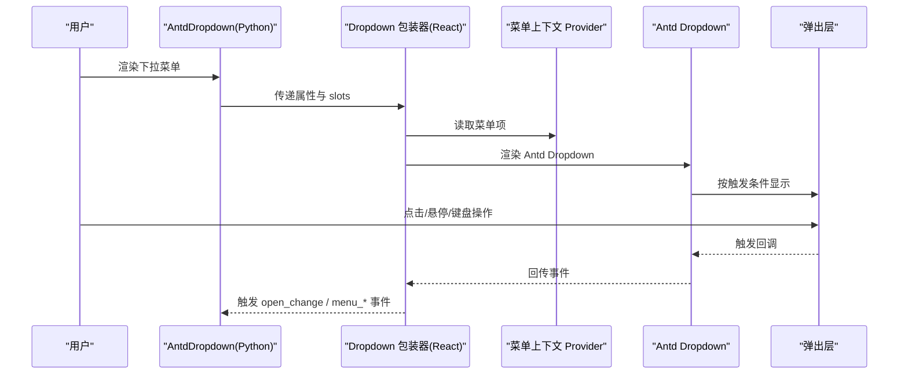
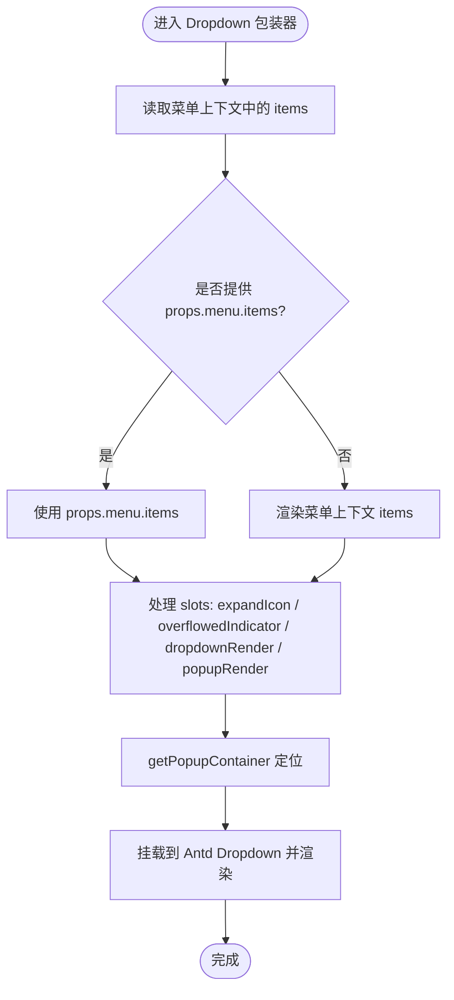
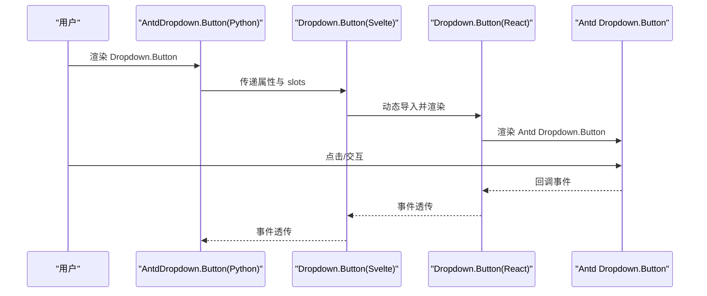
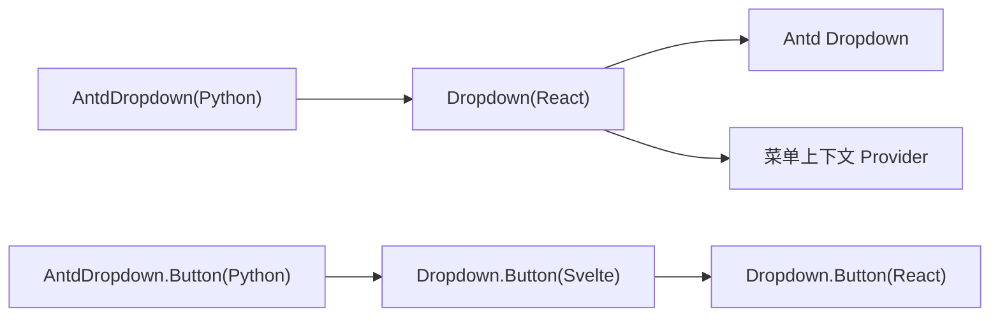

# 下拉菜单组件（Dropdown）

<cite>
**本文引用的文件**
- [frontend/antd/dropdown/dropdown.tsx](file://frontend/antd/dropdown/dropdown.tsx)
- [frontend/antd/dropdown/button/Index.svelte](file://frontend/antd/dropdown/button/Index.svelte)
- [backend/modelscope_studio/components/antd/dropdown/__init__.py](file://backend/modelscope_studio/components/antd/dropdown/__init__.py)
- [backend/modelscope_studio/components/antd/components.py](file://backend/modelscope_studio/components/antd/components.py)
- [docs/components/antd/dropdown/README.md](file://docs/components/antd/dropdown/README.md)
- [docs/components/antd/dropdown/demos/basic.py](file://docs/components/antd/dropdown/demos/basic.py)
</cite>

## 目录

1. [简介](#简介)
2. [项目结构](#项目结构)
3. [核心组件](#核心组件)
4. [架构总览](#架构总览)
5. [详细组件分析](#详细组件分析)
6. [依赖关系分析](#依赖关系分析)
7. [性能考虑](#性能考虑)
8. [故障排查指南](#故障排查指南)
9. [结论](#结论)
10. [附录](#附录)

## 简介

本文件系统性地介绍下拉菜单组件（Dropdown）在模型空间前端中的实现与使用方式，覆盖以下主题：

- 触发机制与弹出容器
- 菜单项配置与渲染
- 弹出位置与定位策略
- 交互行为与事件处理
- 键盘导航与无障碍支持
- 与表单、图标按钮、文本链接的集成
- 高级用法：多级菜单、动态菜单、远程加载
- 性能优化建议与常见问题

## 项目结构

下拉菜单组件由后端 Python 组件与前端 Svelte/React 包装层共同构成，并通过 Gradio 生态进行桥接。

图表来源

- [backend/modelscope_studio/components/antd/dropdown/**init**.py:11-38](file://backend/modelscope_studio/components/antd/dropdown/__init__.py#L11-L38)
- [frontend/antd/dropdown/dropdown.tsx:15-108](file://frontend/antd/dropdown/dropdown.tsx#L15-L108)
- [frontend/antd/dropdown/button/Index.svelte:10-70](file://frontend/antd/dropdown/button/Index.svelte#L10-L70)

章节来源

- [backend/modelscope_studio/components/antd/dropdown/**init**.py:11-38](file://backend/modelscope_studio/components/antd/dropdown/__init__.py#L11-L38)
- [frontend/antd/dropdown/dropdown.tsx:15-108](file://frontend/antd/dropdown/dropdown.tsx#L15-L108)
- [frontend/antd/dropdown/button/Index.svelte:10-70](file://frontend/antd/dropdown/button/Index.svelte#L10-L70)

## 核心组件

- 后端 Python 组件：AntdDropdown 与 AntdDropdown.Button
- 前端包装层：Dropdown（React 包装 + Antd Dropdown）、Dropdown.Button（Svelte 包装）
- 菜单上下文：通过菜单上下文 Provider 将“菜单项”注入到下拉菜单中

关键特性

- 支持通过 slots 注入菜单项、展开图标、溢出指示器、自定义弹出渲染
- 支持 getPopupContainer 自定义弹出容器
- 支持 open*change、menu*\* 系列事件绑定
- 提供内联样式透传（innerStyle）与容器样式（overlayStyle）

章节来源

- [backend/modelscope_studio/components/antd/dropdown/**init**.py:34-38](file://backend/modelscope_studio/components/antd/dropdown/__init__.py#L34-L38)
- [backend/modelscope_studio/components/antd/dropdown/**init**.py:40-100](file://backend/modelscope_studio/components/antd/dropdown/__init__.py#L40-L100)
- [frontend/antd/dropdown/dropdown.tsx:15-25](file://frontend/antd/dropdown/dropdown.tsx#L15-L25)
- [frontend/antd/dropdown/dropdown.tsx:44-92](file://frontend/antd/dropdown/dropdown.tsx#L44-L92)

## 架构总览

下拉菜单的调用链路如下：

图表来源

- [backend/modelscope_studio/components/antd/dropdown/**init**.py:16-32](file://backend/modelscope_studio/components/antd/dropdown/__init__.py#L16-L32)
- [frontend/antd/dropdown/dropdown.tsx:26-107](file://frontend/antd/dropdown/dropdown.tsx#L26-L107)

## 详细组件分析

### 组件一：下拉菜单（Dropdown）

- 角色：将 Ant Design 的 Dropdown 与内部菜单上下文结合，支持 slots 注入菜单项与自定义渲染
- 关键点
  - 菜单项来源：优先使用 props.menu.items；否则从菜单上下文中渲染“menu.items”
  - 扩展图标与溢出指示器：可通过 slots 注入 ReactSlot 或回退到原生属性
  - 弹出容器：支持 getPopupContainer 自定义容器
  - 自定义渲染：dropdownRender、popupRender 可通过 slots 注入或函数形式传入
  - 内联样式：innerStyle 透传到内容容器

图表来源

- [frontend/antd/dropdown/dropdown.tsx:26-107](file://frontend/antd/dropdown/dropdown.tsx#L26-L107)

章节来源

- [frontend/antd/dropdown/dropdown.tsx:15-108](file://frontend/antd/dropdown/dropdown.tsx#L15-L108)

### 组件二：下拉按钮（Dropdown.Button）

- 角色：将 Antd Dropdown.Button 以 Svelte 方式包装，支持 slots 与事件映射
- 关键点
  - 通过 importComponent 动态导入 React 版本的 Dropdown.Button
  - 属性映射：open_change → openChange，menu_open_change → menu_OpenChange
  - 可见性控制：通过 visible 控制是否渲染
  - 样式与 ID：支持 elem_style、elem_id、elem_classes 透传

图表来源

- [frontend/antd/dropdown/button/Index.svelte:10-70](file://frontend/antd/dropdown/button/Index.svelte#L10-L70)
- [backend/modelscope_studio/components/antd/dropdown/**init**.py:8-8](file://backend/modelscope_studio/components/antd/dropdown/__init__.py#L8-L8)

章节来源

- [frontend/antd/dropdown/button/Index.svelte:10-70](file://frontend/antd/dropdown/button/Index.svelte#L10-L70)
- [backend/modelscope_studio/components/antd/dropdown/**init**.py:15-15](file://backend/modelscope_studio/components/antd/dropdown/__init__.py#L15-L15)

### 事件处理与键盘导航

- 事件绑定
  - open_change：下拉面板显隐状态变化
  - menu_click / menu_select / menu_deselect / menu_open_change：菜单项点击、选择、取消选择、菜单面板显隐
- 键盘导航
  - 使用 Antd Dropdown 的默认键盘行为（上下移动、Enter/空格选择、Esc 关闭）
- 无障碍支持
  - 保持原生语义标签与可访问性属性（由 Antd Dropdown 提供）
  - 建议：为触发元素设置 aria-controls、aria-expanded 等属性以增强可访问性

章节来源

- [backend/modelscope_studio/components/antd/dropdown/**init**.py:16-32](file://backend/modelscope_studio/components/antd/dropdown/__init__.py#L16-L32)

### 弹出位置与容器

- 定位策略
  - placement：支持 topLeft/top/topRight/bottomLeft/bottom/bottomRight
  - auto_adjust_overflow：自动调整溢出
- 容器选择
  - get_popup_container：自定义弹出容器，常用于固定在特定区域或滚动容器内

章节来源

- [backend/modelscope_studio/components/antd/dropdown/**init**.py:56-59](file://backend/modelscope_studio/components/antd/dropdown/__init__.py#L56-L59)
- [backend/modelscope_studio/components/antd/dropdown/**init**.py:52-52](file://backend/modelscope_studio/components/antd/dropdown/__init__.py#L52-L52)

### 与表单、图标按钮、文本链接的集成

- 表单组件
  - 在菜单项中嵌入输入类组件时，注意表单联动与校验时机
- 图标按钮
  - 使用 antd.Icon 与 antd.Button（type="text" 或 "primary"/"default"）组合
- 文本链接
  - 使用 antd.Button（type="link"）作为菜单项标签，支持 href 与新窗口打开

章节来源

- [docs/components/antd/dropdown/demos/basic.py:6-31](file://docs/components/antd/dropdown/demos/basic.py#L6-L31)
- [docs/components/antd/dropdown/demos/basic.py:37-47](file://docs/components/antd/dropdown/demos/basic.py#L37-L47)

### 高级用法

- 多级菜单
  - 在菜单项中嵌套子菜单项，实现二级或多级下拉
- 动态菜单
  - 通过 slots 注入“menu.items”，运行时根据状态更新
- 远程加载
  - 在 dropdownRender/popupRender 中加入加载态与错误态，异步请求后更新菜单项

章节来源

- [frontend/antd/dropdown/dropdown.tsx:20-24](file://frontend/antd/dropdown/dropdown.tsx#L20-L24)
- [frontend/antd/dropdown/dropdown.tsx:71-92](file://frontend/antd/dropdown/dropdown.tsx#L71-L92)

## 依赖关系分析

- Python 层
  - AntdDropdown 导出 Button 子组件，并声明支持的 slots 与事件
  - 组件注册于 components.py，统一导出
- 前端层
  - Dropdown 包装器依赖 Antd Dropdown、菜单上下文 Provider、slots 渲染工具
  - Dropdown.Button 通过 Svelte 包装 React 组件

图表来源

- [backend/modelscope_studio/components/antd/dropdown/**init**.py:39-40](file://backend/modelscope_studio/components/antd/dropdown/__init__.py#L39-L40)
- [backend/modelscope_studio/components/antd/components.py:39-40](file://backend/modelscope_studio/components/antd/components.py#L39-L40)
- [frontend/antd/dropdown/dropdown.tsx:10-13](file://frontend/antd/dropdown/dropdown.tsx#L10-L13)
- [frontend/antd/dropdown/button/Index.svelte:10-12](file://frontend/antd/dropdown/button/Index.svelte#L10-L12)

章节来源

- [backend/modelscope_studio/components/antd/components.py:39-40](file://backend/modelscope_studio/components/antd/components.py#L39-L40)
- [frontend/antd/dropdown/dropdown.tsx:10-13](file://frontend/antd/dropdown/dropdown.tsx#L10-L13)

## 性能考虑

- 菜单项渲染
  - 使用 useMemo 缓存菜单项列表，避免不必要的重渲染
- slots 渲染
  - 仅在需要时渲染 slots，减少无用节点
- 弹出容器
  - 合理设置 getPopupContainer，避免弹出层频繁重排
- 事件绑定
  - 仅在必要时绑定 open*change 与 menu*\* 事件，避免过度监听

章节来源

- [frontend/antd/dropdown/dropdown.tsx:49-57](file://frontend/antd/dropdown/dropdown.tsx#L49-L57)
- [frontend/antd/dropdown/dropdown.tsx:37-39](file://frontend/antd/dropdown/dropdown.tsx#L37-L39)

## 故障排查指南

- 无法显示菜单项
  - 检查是否通过 slots 注入“menu.items”，或是否正确传入 props.menu.items
- 弹出层位置异常
  - 检查 getPopupContainer 是否返回正确的容器元素
  - 调整 placement 与 auto_adjust_overflow
- 事件未触发
  - 确认已启用对应事件（open*change、menu*\*），并在 Python 层正确绑定
- 样式不生效
  - innerStyle 仅作用于内容容器；overlayStyle 应通过后端属性传入

章节来源

- [frontend/antd/dropdown/dropdown.tsx:44-92](file://frontend/antd/dropdown/dropdown.tsx#L44-L92)
- [backend/modelscope_studio/components/antd/dropdown/**init**.py:52-59](file://backend/modelscope_studio/components/antd/dropdown/__init__.py#L52-L59)
- [backend/modelscope_studio/components/antd/dropdown/**init**.py:16-32](file://backend/modelscope_studio/components/antd/dropdown/__init__.py#L16-L32)

## 结论

下拉菜单组件通过“Python 组件 + 前端包装 + 菜单上下文”的设计，实现了灵活的菜单项注入、弹出层自定义与事件绑定。配合 Antd Dropdown 的成熟能力，能够满足从基础下拉到复杂多级菜单、动态与远程加载等场景。建议在实际项目中关注性能与可访问性，合理使用 slots 与事件，确保良好的用户体验。

## 附录

- 示例参考
  - 基础示例：包含普通下拉与下拉按钮，以及菜单项中嵌入按钮与链接
- 文档入口
  - 组件文档首页与示例入口

章节来源

- [docs/components/antd/dropdown/README.md:1-8](file://docs/components/antd/dropdown/README.md#L1-L8)
- [docs/components/antd/dropdown/demos/basic.py:33-47](file://docs/components/antd/dropdown/demos/basic.py#L33-L47)
