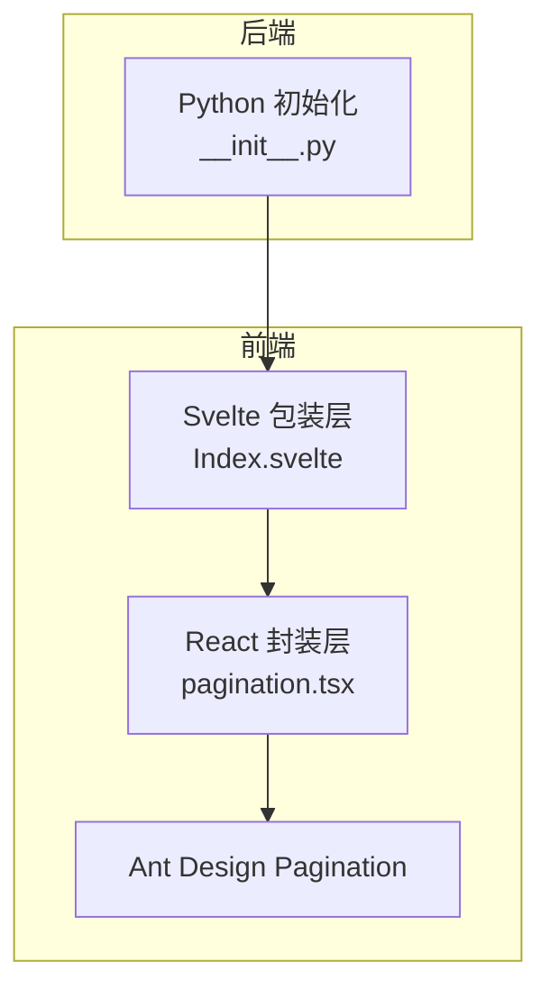
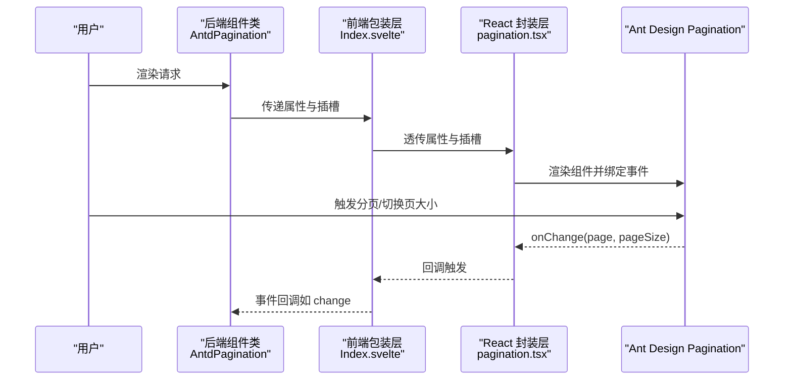
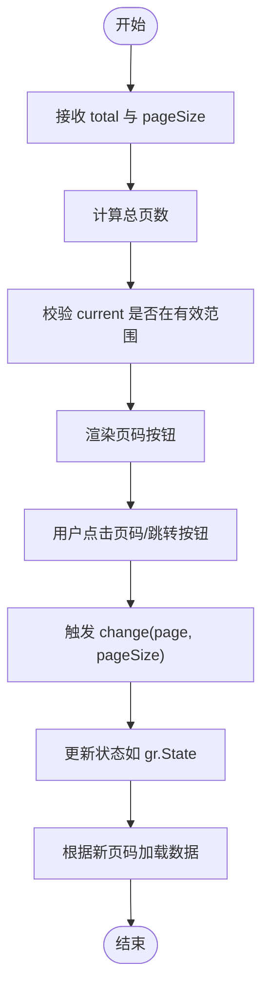
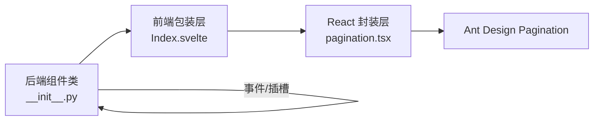

# 分页组件（Pagination）

<cite>
**本文引用的文件**
- [pagination.tsx](file://frontend/antd/pagination/pagination.tsx)
- [Index.svelte](file://frontend/antd/pagination/Index.svelte)
- [__init__.py](file://backend/modelscope_studio/components/antd/pagination/__init__.py)
- [basic.py](file://docs/components/antd/pagination/demos/basic.py)
- [data_changes.py](file://docs/components/antd/pagination/demos/data_changes.py)
- [README.md](file://docs/components/antd/pagination/README.md)
- [app.py](file://docs/components/antd/pagination/app.py)
- [table/__init__.py](file://backend/modelscope_studio/components/antd/table/__init__.py)
- [list/__init__.py](file://backend/modelscope_studio/components/antd/list/__init__.py)
</cite>

## 目录

1. [简介](#简介)
2. [项目结构](#项目结构)
3. [核心组件](#核心组件)
4. [架构总览](#架构总览)
5. [详细组件分析](#详细组件分析)
6. [依赖分析](#依赖分析)
7. [性能考虑](#性能考虑)
8. [故障排查指南](#故障排查指南)
9. [结论](#结论)
10. [附录](#附录)

## 简介

本文件系统性地介绍分页组件（Pagination）在模型空间前端与后端的实现与使用方式，覆盖以下主题：

- 数据分页机制：如何基于总条目数与每页条数计算页码范围与边界
- 页面跳转逻辑：点击页码、快速跳转、上一页/下一页、首页/末页
- 数据量统计：通过“显示总数”回调或属性展示当前范围与总量
- 配置项详解：每页数量设置、默认页码、页面大小选择器、跳转器、简单模式、尺寸、禁用、隐藏单页等
- 与数据表格、列表视图的集成：如何将分页与表格/列表联动，实现数据加载、状态同步与错误处理
- 国际化支持、样式定制、响应式适配
- 高级用法：大数据量分页、虚拟滚动、服务端分页
- 完整示例与性能优化建议

## 项目结构

分页组件由三部分组成：

- 前端 Svelte 包装层：负责属性透传、插槽渲染与可见性控制
- 前端 React 封装层：对接 Ant Design 的 Pagination，并支持插槽与函数型渲染
- 后端 Gradio 组件：定义事件、插槽、属性映射与渲染入口

图表来源

- [Index.svelte:1-68](file://frontend/antd/pagination/Index.svelte#L1-L68)
- [pagination.tsx:1-55](file://frontend/antd/pagination/pagination.tsx#L1-L55)
- [**init**.py:1-107](file://backend/modelscope_studio/components/antd/pagination/__init__.py#L1-L107)

章节来源

- [Index.svelte:1-68](file://frontend/antd/pagination/Index.svelte#L1-L68)
- [pagination.tsx:1-55](file://frontend/antd/pagination/pagination.tsx#L1-L55)
- [**init**.py:1-107](file://backend/modelscope_studio/components/antd/pagination/__init__.py#L1-L107)

## 核心组件

- 后端组件类：定义事件、插槽、属性映射与渲染目录
- 前端包装层：统一处理属性、类名、样式、可见性与插槽
- React 封装层：对接 Ant Design 的 Pagination，支持自定义渲染与插槽注入

关键点

- 事件：change、showSizeChange
- 插槽：showQuickJumper.goButton、itemRender
- 属性映射：如 show_size_change → showSizeChange

章节来源

- [**init**.py:14-25](file://backend/modelscope_studio/components/antd/pagination/__init__.py#L14-L25)
- [Index.svelte:22-48](file://frontend/antd/pagination/Index.svelte#L22-L48)
- [pagination.tsx:8-52](file://frontend/antd/pagination/pagination.tsx#L8-L52)

## 架构总览

分页组件的调用链路如下：

图表来源

- [**init**.py:14-21](file://backend/modelscope_studio/components/antd/pagination/__init__.py#L14-L21)
- [Index.svelte:54-66](file://frontend/antd/pagination/Index.svelte#L54-L66)
- [pagination.tsx:36-38](file://frontend/antd/pagination/pagination.tsx#L36-L38)

## 详细组件分析

### 配置选项与行为

- 基础参数
  - 总条目数：total
  - 默认页码：default_current
  - 当前页：current
  - 每页条数：default_page_size / page_size
  - 页码选项：page_size_options
  - 禁用：disabled
  - 单页隐藏：hide_on_single_page
  - 尺寸：size（small/default）
  - 对齐：align（start/center/end）
  - 简单模式：simple
  - 显示标题：show_title
  - 显示较少项：show_less_items
  - 响应式：responsive
  - 自定义渲染：item_render
  - 显示总数：show_total
  - 快速跳转：show_quick_jumper（可带 goButton 插槽）
  - 显示页大小选择器：show_size_changer
- 插槽
  - showQuickJumper.goButton：快速跳转按钮
  - itemRender：自定义页码项渲染

章节来源

- [**init**.py:26-88](file://backend/modelscope_studio/components/antd/pagination/__init__.py#L26-L88)
- [Index.svelte:46-47](file://frontend/antd/pagination/Index.svelte#L46-L47)
- [pagination.tsx:12-47](file://frontend/antd/pagination/pagination.tsx#L12-L47)

### 事件与状态同步

- change：页码或页大小变化时触发，返回(page, pageSize)
- showSizeChange：页大小变更时触发
- 与 Gradio 状态联动：通过事件回调将页码与页大小写入 gr.State，再驱动数据加载

章节来源

- [**init**.py:14-21](file://backend/modelscope_studio/components/antd/pagination/__init__.py#L14-L21)
- [data_changes.py:6-11](file://docs/components/antd/pagination/demos/data_changes.py#L6-L11)

### 数据分页机制与页面跳转逻辑

- 计算规则
  - 总页数：Math.ceil(total / pageSize)
  - 当前页范围：1 到总页数
  - 边界处理：current 超出范围时回退到合法值
- 跳转流程
  - 点击页码：触发 change
  - 上一页/下一页/首页/末页：由 Ant Design 内部处理并触发 change
  - 快速跳转：启用 show_quick_jumper 并提供 goButton 插槽时，使用插槽按钮执行跳转
- 自定义渲染
  - 使用 itemRender 自定义页码按钮内容
  - 使用 show_total 在分页左侧显示范围/总数

图表来源

- [pagination.tsx:36-38](file://frontend/antd/pagination/pagination.tsx#L36-L38)
- [data_changes.py:6-11](file://docs/components/antd/pagination/demos/data_changes.py#L6-L11)

### 与数据表格、列表视图的集成

- 表格集成
  - 在表格组件中开启 pagination，并将分页的 change 事件与表格数据加载逻辑绑定
  - 可通过 show_size_changer 动态切换每页条数，联动表格列宽与行高
- 列表集成
  - 列表组件支持 pagination 参数，可直接传入分页实例
  - 列表的加载更多（load_more）与分页可二选一或组合使用
- 状态同步
  - 将分页状态写入 gr.State，作为后续数据请求的输入
  - 表格/列表的 loading 与分页的禁用状态可联动，避免并发请求

章节来源

- [table/**init**.py:114-133](file://backend/modelscope_studio/components/antd/table/__init__.py#L114-L133)
- [list/**init**.py:59-82](file://backend/modelscope_studio/components/antd/list/__init__.py#L59-L82)
- [data_changes.py:24-28](file://docs/components/antd/pagination/demos/data_changes.py#L24-L28)

### 国际化支持、样式定制与响应式适配

- 国际化
  - 通过 ConfigProvider 提供语言环境，分页文案随全局配置生效
- 样式定制
  - 支持 elem_id、elem_classes、elem_style 以及额外属性 additional_props
  - 可通过 root_class_name 与 class_names/styles 进行主题级定制
- 响应式
  - responsive 开启时，组件在小屏设备上自动调整布局与字号

章节来源

- [README.md:1-14](file://docs/components/antd/pagination/README.md#L1-L14)
- [Index.svelte:56-58](file://frontend/antd/pagination/Index.svelte#L56-L58)
- [**init**.py:49-50](file://backend/modelscope_studio/components/antd/pagination/__init__.py#L49-L50)

### 高级用法：大数据量分页、虚拟滚动、服务端分页

- 大数据量分页
  - 使用较大的 total，结合较小的 page_size 与合理的 page_size_options
  - 通过 change 事件按需加载数据，避免一次性渲染全部数据
- 虚拟滚动
  - 表格组件支持 virtual 参数，可在大数据量场景下显著提升渲染性能
- 服务端分页
  - 分页仅负责 UI 交互；实际数据由后端接口提供，前端在 change 中发起请求并更新表格/列表
  - 可结合 loading 与禁用状态，防止重复请求

章节来源

- [table/**init**.py:129-130](file://backend/modelscope_studio/components/antd/table/__init__.py#L129-L130)
- [data_changes.py:6-11](file://docs/components/antd/pagination/demos/data_changes.py#L6-L11)

### 示例与最佳实践

- 基础示例
  - 展示 total、快速跳转、页大小选择器与总数显示
- 数据变更示例
  - 通过 change 事件将页码与页大小写入 gr.State，并在按钮点击时弹出提示
- 最佳实践
  - 将分页状态与数据请求解耦，使用事件驱动
  - 在数据加载期间禁用分页，避免并发
  - 合理设置 page_size_options，兼顾加载速度与用户体验

章节来源

- [basic.py:7-11](file://docs/components/antd/pagination/demos/basic.py#L7-L11)
- [data_changes.py:6-11](file://docs/components/antd/pagination/demos/data_changes.py#L6-L11)

## 依赖分析

- 组件耦合
  - 后端组件类与前端包装层松耦合，通过属性与插槽进行契约式通信
  - React 封装层对 Ant Design 的依赖明确，便于升级与替换
- 事件与插槽
  - 事件：change、showSizeChange
  - 插槽：showQuickJumper.goButton、itemRender
- 外部依赖
  - Ant Design Pagination
  - Gradio 事件系统与状态管理

图表来源

- [**init**.py:14-25](file://backend/modelscope_studio/components/antd/pagination/__init__.py#L14-L25)
- [Index.svelte:54-66](file://frontend/antd/pagination/Index.svelte#L54-L66)
- [pagination.tsx:28-48](file://frontend/antd/pagination/pagination.tsx#L28-L48)

章节来源

- [**init**.py:14-25](file://backend/modelscope_studio/components/antd/pagination/__init__.py#L14-L25)
- [Index.svelte:54-66](file://frontend/antd/pagination/Index.svelte#L54-L66)
- [pagination.tsx:28-48](file://frontend/antd/pagination/pagination.tsx#L28-L48)

## 性能考虑

- 渲染优化
  - 使用虚拟滚动（表格）减少 DOM 数量
  - 控制 page_size，避免过大的单页渲染压力
- 请求优化
  - 仅在 change 时发起数据请求，避免频繁刷新
  - 在请求期间禁用分页，防止重复请求
- 样式与资源
  - 合理使用 elem_classes 与样式缓存，减少重绘
  - 避免在 itemRender 中进行重型计算

## 故障排查指南

- 问题：分页不触发 change
  - 检查是否正确绑定 change 事件
  - 确认 total 与 page_size 设置合理
- 问题：页大小切换无效
  - 检查 show_size_changer 是否启用
  - 确认 show_size_change 属性映射是否正确
- 问题：快速跳转按钮不显示
  - 检查是否提供了 showQuickJumper.goButton 插槽
- 问题：样式未生效
  - 检查 elem_id、elem_classes、elem_style 与 root_class_name 的使用
- 问题：国际化文案异常
  - 确认 ConfigProvider 已正确配置语言

章节来源

- [Index.svelte:46-47](file://frontend/antd/pagination/Index.svelte#L46-L47)
- [pagination.tsx:39-47](file://frontend/antd/pagination/pagination.tsx#L39-L47)
- [README.md:1-14](file://docs/components/antd/pagination/README.md#L1-L14)

## 结论

分页组件通过清晰的前后端分工与事件/插槽契约，实现了灵活的分页体验。配合表格与列表组件，可轻松构建高性能、可扩展的数据浏览界面。在大数据量场景下，建议结合虚拟滚动与服务端分页策略，确保交互流畅与资源高效。

## 附录

- 示例入口
  - 文档应用入口：[app.py:1-7](file://docs/components/antd/pagination/app.py#L1-L7)
- 示例脚本
  - 基础示例：[basic.py:1-15](file://docs/components/antd/pagination/demos/basic.py#L1-L15)
  - 数据变更示例：[data_changes.py:1-36](file://docs/components/antd/pagination/demos/data_changes.py#L1-L36)
- 组件源码
  - 后端组件类：[**init**.py:1-107](file://backend/modelscope_studio/components/antd/pagination/__init__.py#L1-L107)
  - 前端包装层：[Index.svelte:1-68](file://frontend/antd/pagination/Index.svelte#L1-L68)
  - React 封装层：[pagination.tsx:1-55](file://frontend/antd/pagination/pagination.tsx#L1-L55)
