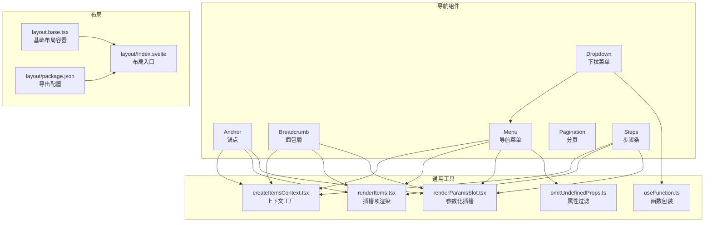
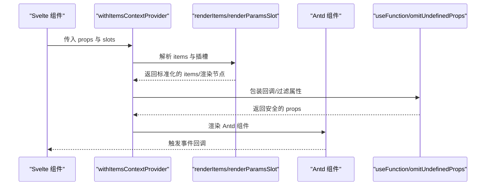
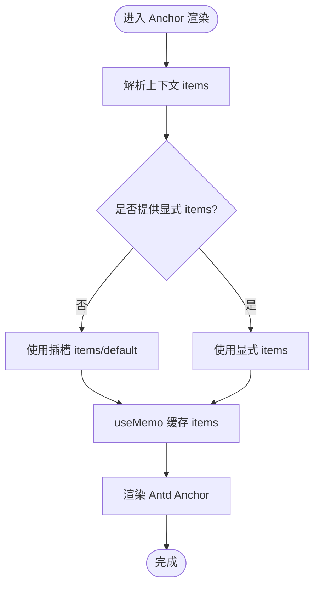
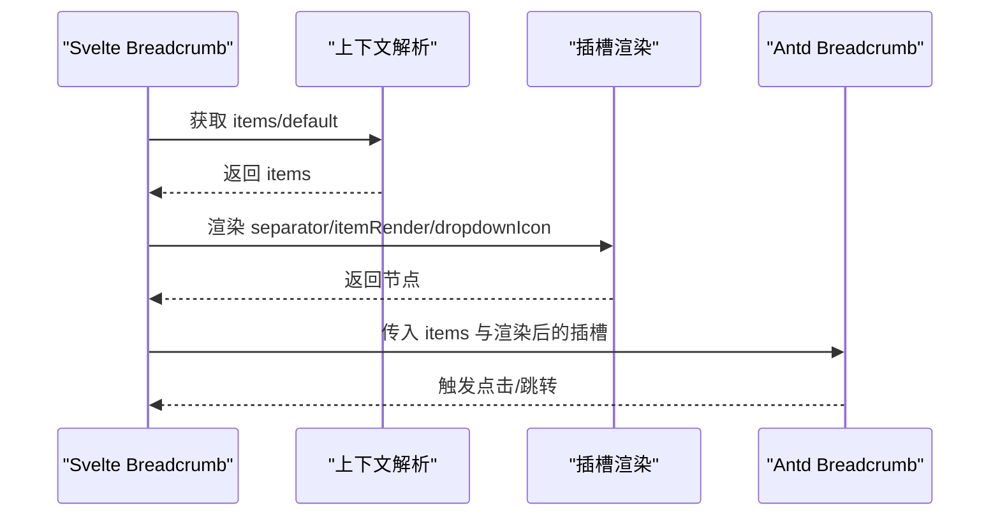
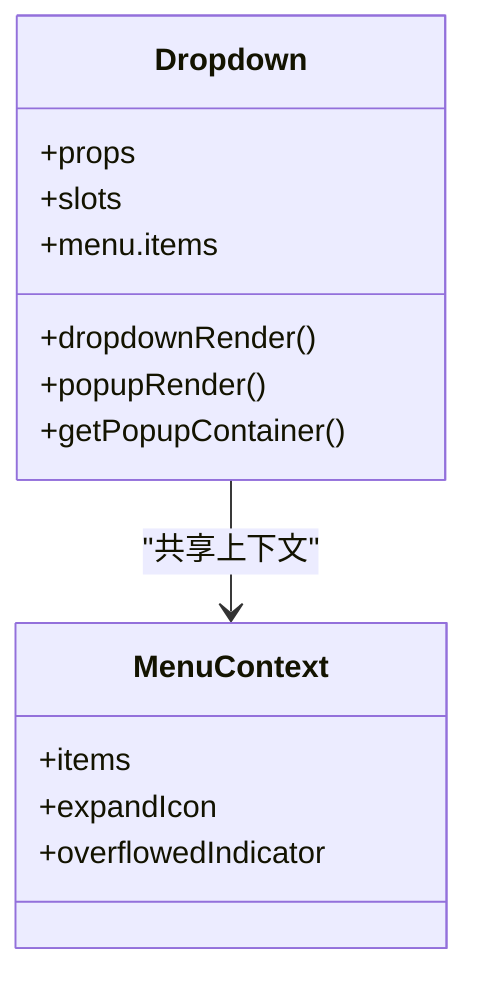
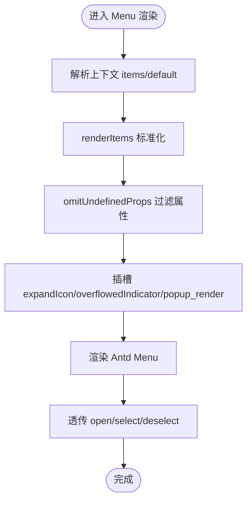
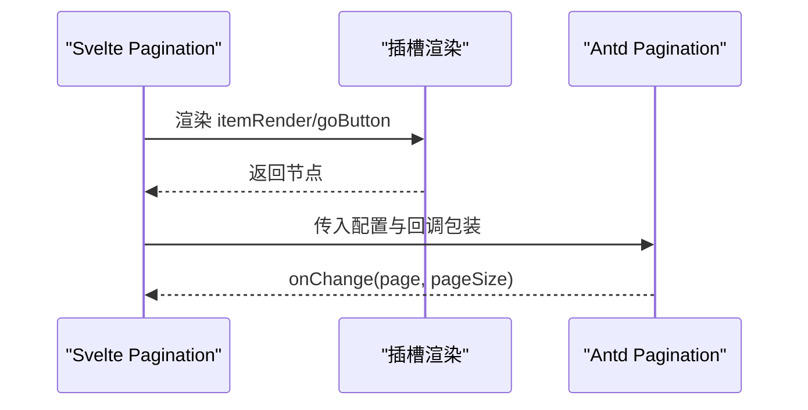
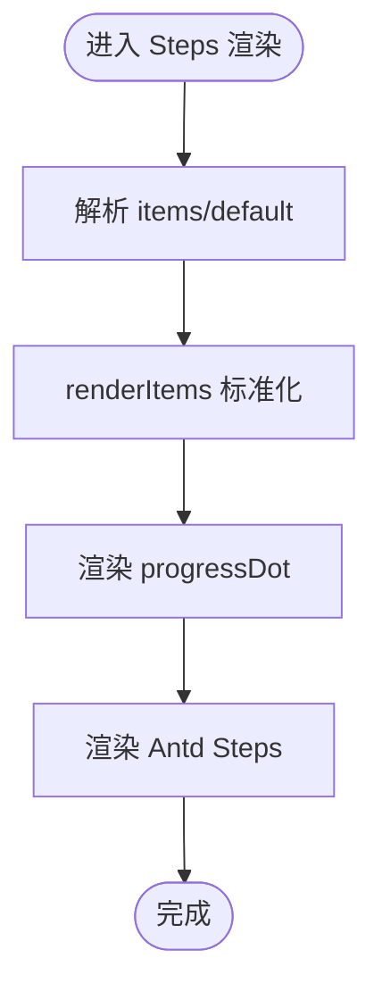
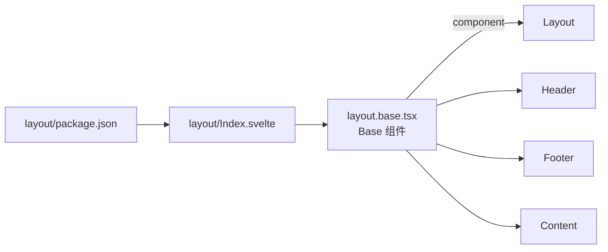
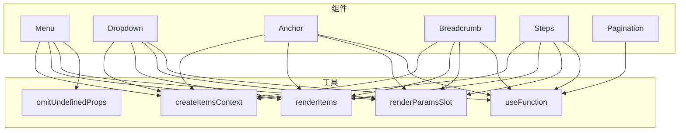

# 导航组件

<cite>
**本文引用的文件**
- [frontend/antd/anchor/anchor.tsx](file://frontend/antd/anchor/anchor.tsx)
- [frontend/antd/anchor/context.ts](file://frontend/antd/anchor/context.ts)
- [frontend/antd/breadcrumb/breadcrumb.tsx](file://frontend/antd/breadcrumb/breadcrumb.tsx)
- [frontend/antd/breadcrumb/context.ts](file://frontend/antd/breadcrumb/context.ts)
- [frontend/antd/dropdown/dropdown.tsx](file://frontend/antd/dropdown/dropdown.tsx)
- [frontend/antd/menu/menu.tsx](file://frontend/antd/menu/menu.tsx)
- [frontend/antd/menu/context.ts](file://frontend/antd/menu/context.ts)
- [frontend/antd/pagination/pagination.tsx](file://frontend/antd/pagination/pagination.tsx)
- [frontend/antd/steps/steps.tsx](file://frontend/antd/steps/steps.tsx)
- [frontend/antd/steps/context.ts](file://frontend/antd/steps/context.ts)
- [frontend/antd/layout/layout.base.tsx](file://frontend/antd/layout/layout.base.tsx)
- [frontend/antd/layout/Index.svelte](file://frontend/antd/layout/Index.svelte)
- [frontend/antd/layout/package.json](file://frontend/antd/layout/package.json)
- [frontend/utils/createItemsContext.tsx](file://frontend/utils/createItemsContext.tsx)
- [frontend/utils/renderItems.tsx](file://frontend/utils/renderItems.tsx)
- [frontend/utils/renderParamsSlot.tsx](file://frontend/utils/renderParamsSlot.tsx)
- [frontend/utils/hooks/useFunction.ts](file://frontend/utils/hooks/useFunction.ts)
- [frontend/utils/omitUndefinedProps.ts](file://frontend/utils/omitUndefinedProps.ts)
</cite>

## 目录

1. [简介](#简介)
2. [项目结构](#项目结构)
3. [核心组件](#核心组件)
4. [架构总览](#架构总览)
5. [详细组件分析](#详细组件分析)
6. [依赖关系分析](#依赖关系分析)
7. [性能考量](#性能考量)
8. [故障排查指南](#故障排查指南)
9. [结论](#结论)
10. [附录](#附录)

## 简介

本文件系统性梳理并讲解 Ant Design 导航相关组件在本仓库中的实现与使用方式，覆盖以下组件：锚点（Anchor）、面包屑（Breadcrumb）、下拉菜单（Dropdown）、导航菜单（Menu）、分页（Pagination）、步骤条（Steps）。文档重点阐述：

- 组件的状态管理与事件处理机制
- 与路由系统的集成思路与最佳实践
- 权限控制在导航中的落地方式
- 导航模式设计指南：顶部导航、侧边导航、混合导航
- 多层级导航的实现方法与性能优化建议
- 交互设计与用户体验优化要点

## 项目结构

导航相关组件主要位于前端目录下的 antd 子模块中，采用“按需渲染 + 上下文注入”的通用模式组织，配合工具函数完成插槽渲染与属性适配。

图表来源

- [frontend/antd/anchor/anchor.tsx:1-46](file://frontend/antd/anchor/anchor.tsx#L1-L46)
- [frontend/antd/breadcrumb/breadcrumb.tsx:1-67](file://frontend/antd/breadcrumb/breadcrumb.tsx#L1-L67)
- [frontend/antd/dropdown/dropdown.tsx:1-111](file://frontend/antd/dropdown/dropdown.tsx#L1-L111)
- [frontend/antd/menu/menu.tsx:1-96](file://frontend/antd/menu/menu.tsx#L1-L96)
- [frontend/antd/steps/steps.tsx:1-52](file://frontend/antd/steps/steps.tsx#L1-L52)
- [frontend/antd/layout/layout.base.tsx:1-40](file://frontend/antd/layout/layout.base.tsx#L1-L40)
- [frontend/antd/layout/Index.svelte:1-18](file://frontend/antd/layout/Index.svelte#L1-L18)
- [frontend/antd/layout/package.json:1-15](file://frontend/antd/layout/package.json#L1-L15)
- [frontend/utils/createItemsContext.tsx](file://frontend/utils/createItemsContext.tsx)
- [frontend/utils/renderItems.tsx](file://frontend/utils/renderItems.tsx)
- [frontend/utils/renderParamsSlot.tsx](file://frontend/utils/renderParamsSlot.tsx)
- [frontend/utils/hooks/useFunction.ts](file://frontend/utils/hooks/useFunction.ts)
- [frontend/utils/omitUndefinedProps.ts](file://frontend/utils/omitUndefinedProps.ts)

章节来源

- [frontend/antd/anchor/anchor.tsx:1-46](file://frontend/antd/anchor/anchor.tsx#L1-L46)
- [frontend/antd/breadcrumb/breadcrumb.tsx:1-67](file://frontend/antd/breadcrumb/breadcrumb.tsx#L1-L67)
- [frontend/antd/dropdown/dropdown.tsx:1-111](file://frontend/antd/dropdown/dropdown.tsx#L1-L111)
- [frontend/antd/menu/menu.tsx:1-96](file://frontend/antd/menu/menu.tsx#L1-L96)
- [frontend/antd/pagination/pagination.tsx:1-55](file://frontend/antd/pagination/pagination.tsx#L1-L55)
- [frontend/antd/steps/steps.tsx:1-52](file://frontend/antd/steps/steps.tsx#L1-L52)
- [frontend/antd/layout/layout.base.tsx:1-40](file://frontend/antd/layout/layout.base.tsx#L1-L40)
- [frontend/antd/layout/Index.svelte:1-18](file://frontend/antd/layout/Index.svelte#L1-L18)
- [frontend/antd/layout/package.json:1-15](file://frontend/antd/layout/package.json#L1-L15)

## 核心组件

本节对各导航组件进行总体能力与行为说明，便于快速建立认知框架。

- 锚点（Anchor）
  - 负责页面内定位与高亮，支持容器选择器与当前锚点回调
  - 通过上下文注入 items，支持插槽化子项渲染
- 面包屑（Breadcrumb）
  - 展示当前页面路径，支持自定义分隔符、项渲染器与下拉图标
  - 支持通过插槽替换默认渲染逻辑
- 下拉菜单（Dropdown）
  - 基于 Ant Design Dropdown，内部可嵌套菜单项，支持弹层渲染与溢出指示器
  - 与菜单上下文共享 items 渲染策略
- 导航菜单（Menu）
  - 支持展开图标、溢出指示器与弹出渲染
  - 提供 open/select/deselect 事件透传
- 分页（Pagination）
  - 支持总数渲染、跳转按钮与自定义页码渲染
  - 事件回调统一由函数包装器处理
- 步骤条（Steps）
  - 支持进度点自定义渲染
  - 通过上下文注入 items，支持插槽化子项

章节来源

- [frontend/antd/anchor/anchor.tsx:1-46](file://frontend/antd/anchor/anchor.tsx#L1-L46)
- [frontend/antd/breadcrumb/breadcrumb.tsx:1-67](file://frontend/antd/breadcrumb/breadcrumb.tsx#L1-L67)
- [frontend/antd/dropdown/dropdown.tsx:1-111](file://frontend/antd/dropdown/dropdown.tsx#L1-L111)
- [frontend/antd/menu/menu.tsx:1-96](file://frontend/antd/menu/menu.tsx#L1-L96)
- [frontend/antd/pagination/pagination.tsx:1-55](file://frontend/antd/pagination/pagination.tsx#L1-L55)
- [frontend/antd/steps/steps.tsx:1-52](file://frontend/antd/steps/steps.tsx#L1-L52)

## 架构总览

导航组件普遍采用“Svelte 包装 + React 组件 + 插槽渲染 + 上下文注入”的统一架构。其关键特征如下：

- 使用 sveltify 将 React 组件桥接为 Svelte 组件
- 通过 withItemsContextProvider 注入 items 上下文，统一处理 children 与 slots 的组合
- 使用 renderItems 与 renderParamsSlot 实现插槽项与参数化插槽的渲染
- 使用 useFunction 对回调进行包装，确保在 Svelte 环境中稳定执行
- 使用 omitUndefinedProps 过滤未定义属性，避免向底层组件传递无效值

图表来源

- [frontend/antd/menu/menu.tsx:1-96](file://frontend/antd/menu/menu.tsx#L1-L96)
- [frontend/antd/breadcrumb/breadcrumb.tsx:1-67](file://frontend/antd/breadcrumb/breadcrumb.tsx#L1-L67)
- [frontend/antd/steps/steps.tsx:1-52](file://frontend/antd/steps/steps.tsx#L1-L52)
- [frontend/antd/dropdown/dropdown.tsx:1-111](file://frontend/antd/dropdown/dropdown.tsx#L1-L111)
- [frontend/utils/renderItems.tsx](file://frontend/utils/renderItems.tsx)
- [frontend/utils/renderParamsSlot.tsx](file://frontend/utils/renderParamsSlot.tsx)
- [frontend/utils/hooks/useFunction.ts](file://frontend/utils/hooks/useFunction.ts)
- [frontend/utils/omitUndefinedProps.ts](file://frontend/utils/omitUndefinedProps.ts)

## 详细组件分析

### 锚点（Anchor）分析

- 数据流与状态
  - 通过上下文注入 items，支持 children 与 slots 的组合
  - 使用 useMemo 缓存 items 计算结果，避免重复渲染
- 事件与回调
  - getContainer 与 getCurrentAnchor 通过 useFunction 包装，保证在 Svelte 中稳定调用
- 插槽与渲染
  - 优先使用显式 items；否则从上下文解析 default 或 items 插槽
- 性能与可用性
  - 仅在必要时重新计算 items，减少渲染开销
  - 通过隐藏 children 容器避免重复渲染

图表来源

- [frontend/antd/anchor/anchor.tsx:1-46](file://frontend/antd/anchor/anchor.tsx#L1-L46)
- [frontend/antd/anchor/context.ts:1-7](file://frontend/antd/anchor/context.ts#L1-L7)

章节来源

- [frontend/antd/anchor/anchor.tsx:1-46](file://frontend/antd/anchor/anchor.tsx#L1-L46)
- [frontend/antd/anchor/context.ts:1-7](file://frontend/antd/anchor/context.ts#L1-L7)

### 面包屑（Breadcrumb）分析

- 数据流与状态
  - 合并 items 与插槽，支持自定义分隔符与项渲染器
  - dropdownIcon 与 separator 可通过插槽替换
- 插槽与渲染
  - itemRender 与 dropdown_icon、separator 通过 renderParamsSlot 与 ReactSlot 渲染
- 回调与事件
  - 保持与 Antd Breadcrumb 的接口一致，无额外封装

图表来源

- [frontend/antd/breadcrumb/breadcrumb.tsx:1-67](file://frontend/antd/breadcrumb/breadcrumb.tsx#L1-L67)
- [frontend/antd/breadcrumb/context.ts:1-7](file://frontend/antd/breadcrumb/context.ts#L1-L7)

章节来源

- [frontend/antd/breadcrumb/breadcrumb.tsx:1-67](file://frontend/antd/breadcrumb/breadcrumb.tsx#L1-L67)
- [frontend/antd/breadcrumb/context.ts:1-7](file://frontend/antd/breadcrumb/context.ts#L1-L7)

### 下拉菜单（Dropdown）分析

- 数据流与状态
  - 内部菜单项通过菜单上下文注入，支持 expandIcon 与溢出指示器插槽
  - dropdownRender 与 popupRender 支持参数化插槽
- 事件与回调
  - getPopupContainer 通过 useFunction 包装
- 与菜单的关系
  - 共享菜单上下文，复用 items 渲染策略

图表来源

- [frontend/antd/dropdown/dropdown.tsx:1-111](file://frontend/antd/dropdown/dropdown.tsx#L1-L111)
- [frontend/antd/menu/context.ts:1-7](file://frontend/antd/menu/context.ts#L1-L7)

章节来源

- [frontend/antd/dropdown/dropdown.tsx:1-111](file://frontend/antd/dropdown/dropdown.tsx#L1-L111)
- [frontend/antd/menu/context.ts:1-7](file://frontend/antd/menu/context.ts#L1-L7)

### 导航菜单（Menu）分析

- 数据流与状态
  - 通过上下文注入 items，支持 expandIcon、溢出指示器与弹出渲染插槽
  - open/select/deselect 事件透传
- 属性处理
  - 使用 omitUndefinedProps 过滤未定义属性，避免向底层组件传递无效值
- 插槽与渲染
  - expandIcon、overflowedIndicator、popup_render 通过 renderParamsSlot 与 ReactSlot 渲染

图表来源

- [frontend/antd/menu/menu.tsx:1-96](file://frontend/antd/menu/menu.tsx#L1-L96)
- [frontend/antd/menu/context.ts:1-7](file://frontend/antd/menu/context.ts#L1-L7)
- [frontend/utils/omitUndefinedProps.ts](file://frontend/utils/omitUndefinedProps.ts)

章节来源

- [frontend/antd/menu/menu.tsx:1-96](file://frontend/antd/menu/menu.tsx#L1-L96)
- [frontend/antd/menu/context.ts:1-7](file://frontend/antd/menu/context.ts#L1-L7)

### 分页（Pagination）分析

- 数据流与状态
  - 支持 showTotal、itemRender、showQuickJumper.goButton 等插槽化配置
  - onChange 回调通过 useFunction 包装
- 插槽与渲染
  - itemRender 与 goButton 通过 renderParamsSlot 与 ReactSlot 渲染

图表来源

- [frontend/antd/pagination/pagination.tsx:1-55](file://frontend/antd/pagination/pagination.tsx#L1-L55)

章节来源

- [frontend/antd/pagination/pagination.tsx:1-55](file://frontend/antd/pagination/pagination.tsx#L1-L55)

### 步骤条（Steps）分析

- 数据流与状态
  - 通过上下文注入 items，支持 progressDot 插槽化
  - 通过 useFunction 包装 progressDot 回调
- 插槽与渲染
  - progressDot 通过 renderParamsSlot 渲染

图表来源

- [frontend/antd/steps/steps.tsx:1-52](file://frontend/antd/steps/steps.tsx#L1-L52)
- [frontend/antd/steps/context.ts:1-7](file://frontend/antd/steps/context.ts#L1-L7)

章节来源

- [frontend/antd/steps/steps.tsx:1-52](file://frontend/antd/steps/steps.tsx#L1-L52)
- [frontend/antd/steps/context.ts:1-7](file://frontend/antd/steps/context.ts#L1-L7)

### 布局（Layout）与导航模式

- 基础布局容器
  - Base 组件根据 component 参数动态选择 Layout、Header、Footer、Content
  - 通过类名区分样式作用域
- 布局入口与导出
  - Index.svelte 作为入口，layout/package.json 提供 Gradio 导出配置

图表来源

- [frontend/antd/layout/layout.base.tsx:1-40](file://frontend/antd/layout/layout.base.tsx#L1-L40)
- [frontend/antd/layout/Index.svelte:1-18](file://frontend/antd/layout/Index.svelte#L1-L18)
- [frontend/antd/layout/package.json:1-15](file://frontend/antd/layout/package.json#L1-L15)

章节来源

- [frontend/antd/layout/layout.base.tsx:1-40](file://frontend/antd/layout/layout.base.tsx#L1-L40)
- [frontend/antd/layout/Index.svelte:1-18](file://frontend/antd/layout/Index.svelte#L1-L18)
- [frontend/antd/layout/package.json:1-15](file://frontend/antd/layout/package.json#L1-L15)

## 依赖关系分析

- 组件间耦合
  - Dropdown 与 Menu 共享菜单上下文，形成弱耦合的复用关系
  - Anchor、Breadcrumb、Steps、Menu 均依赖 createItemsContext 工厂与 renderItems
- 外部依赖
  - Ant Design React 组件库
  - Svelte Preprocess React（sveltify、ReactSlot）
  - 工具函数（useFunction、renderItems、renderParamsSlot、omitUndefinedProps）

图表来源

- [frontend/antd/menu/menu.tsx:1-96](file://frontend/antd/menu/menu.tsx#L1-L96)
- [frontend/antd/dropdown/dropdown.tsx:1-111](file://frontend/antd/dropdown/dropdown.tsx#L1-L111)
- [frontend/antd/anchor/anchor.tsx:1-46](file://frontend/antd/anchor/anchor.tsx#L1-L46)
- [frontend/antd/breadcrumb/breadcrumb.tsx:1-67](file://frontend/antd/breadcrumb/breadcrumb.tsx#L1-L67)
- [frontend/antd/steps/steps.tsx:1-52](file://frontend/antd/steps/steps.tsx#L1-L52)
- [frontend/antd/pagination/pagination.tsx:1-55](file://frontend/antd/pagination/pagination.tsx#L1-L55)
- [frontend/utils/createItemsContext.tsx](file://frontend/utils/createItemsContext.tsx)
- [frontend/utils/renderItems.tsx](file://frontend/utils/renderItems.tsx)
- [frontend/utils/renderParamsSlot.tsx](file://frontend/utils/renderParamsSlot.tsx)
- [frontend/utils/hooks/useFunction.ts](file://frontend/utils/hooks/useFunction.ts)
- [frontend/utils/omitUndefinedProps.ts](file://frontend/utils/omitUndefinedProps.ts)

章节来源

- [frontend/antd/menu/menu.tsx:1-96](file://frontend/antd/menu/menu.tsx#L1-L96)
- [frontend/antd/dropdown/dropdown.tsx:1-111](file://frontend/antd/dropdown/dropdown.tsx#L1-L111)
- [frontend/antd/anchor/anchor.tsx:1-46](file://frontend/antd/anchor/anchor.tsx#L1-L46)
- [frontend/antd/breadcrumb/breadcrumb.tsx:1-67](file://frontend/antd/breadcrumb/breadcrumb.tsx#L1-L67)
- [frontend/antd/steps/steps.tsx:1-52](file://frontend/antd/steps/steps.tsx#L1-L52)
- [frontend/antd/pagination/pagination.tsx:1-55](file://frontend/antd/pagination/pagination.tsx#L1-L55)

## 性能考量

- 渲染优化
  - 大量组件使用 useMemo 缓存 items 计算结果，避免不必要的重渲染
  - 通过 renderItems 与 renderParamsSlot 统一插槽渲染，减少分支判断
- 回调与属性
  - 使用 useFunction 包装回调，确保在 Svelte 生命周期内稳定执行
  - 使用 omitUndefinedProps 过滤未定义属性，降低底层组件处理负担
- 复杂度与扩展性
  - 上下文工厂 createItemsContext 为多个组件提供一致的 items 注入策略，提升扩展性
  - 插槽化设计使组件具备更强的可定制性，同时保持默认行为稳定

## 故障排查指南

- 插槽未生效
  - 检查插槽键名是否与组件约定一致（如 menu.items、itemRender、progressDot 等）
  - 确认插槽节点已正确传递给组件（ReactSlot 与 renderParamsSlot）
- items 不显示
  - 确认上下文是否正确注入（withItemsContextProvider）
  - 检查 children 与 slots 的组合是否被正确解析
- 回调不触发
  - 确认回调是否通过 useFunction 包装
  - 检查事件透传链路（onOpenChange/onSelect/onDeselect 等）
- 布局异常
  - 检查 layout.base 的 component 参数与类名映射
  - 确认样式作用域未被外部覆盖

章节来源

- [frontend/antd/menu/menu.tsx:1-96](file://frontend/antd/menu/menu.tsx#L1-L96)
- [frontend/antd/dropdown/dropdown.tsx:1-111](file://frontend/antd/dropdown/dropdown.tsx#L1-L111)
- [frontend/antd/anchor/anchor.tsx:1-46](file://frontend/antd/anchor/anchor.tsx#L1-L46)
- [frontend/antd/breadcrumb/breadcrumb.tsx:1-67](file://frontend/antd/breadcrumb/breadcrumb.tsx#L1-L67)
- [frontend/antd/steps/steps.tsx:1-52](file://frontend/antd/steps/steps.tsx#L1-L52)
- [frontend/antd/pagination/pagination.tsx:1-55](file://frontend/antd/pagination/pagination.tsx#L1-L55)
- [frontend/antd/layout/layout.base.tsx:1-40](file://frontend/antd/layout/layout.base.tsx#L1-L40)

## 结论

本仓库的导航组件以统一的上下文与插槽渲染策略为核心，实现了高内聚、低耦合的组件体系。通过 useMemo、useFunction、renderItems 等工具的协同，既保证了性能，又提供了强大的可定制性。结合布局组件，可灵活构建顶部导航、侧边导航、混合导航等多种导航模式，并在路由集成与权限控制方面具备良好的扩展空间。

## 附录

- 导航模式设计指南（概念性建议）
  - 顶部导航：适合入口清晰、层级较浅的场景；搭配 Breadcrumb 提升路径感知
  - 侧边导航：适合内容丰富、需要快速切换的后台系统；搭配 Anchor 快速定位
  - 混合导航：顶部主导航 + 侧边二级导航，兼顾全局与局部操作
- 路由集成与权限控制（概念性建议）
  - 路由集成：将路由元信息注入到菜单/面包屑/步骤条的 items 中，实现导航与路由联动
  - 权限控制：在渲染前对 items 进行过滤，仅展示用户有权限的节点
- 多层级导航实现与性能考虑（概念性建议）
  - 使用虚拟滚动与懒加载减少大列表渲染压力
  - 对深层级菜单启用折叠与缓存，避免频繁重渲染
  - 在路由切换时保留必要的导航状态，提升用户体验
