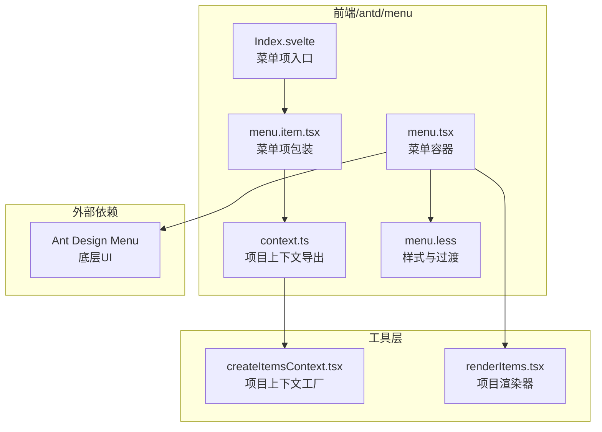
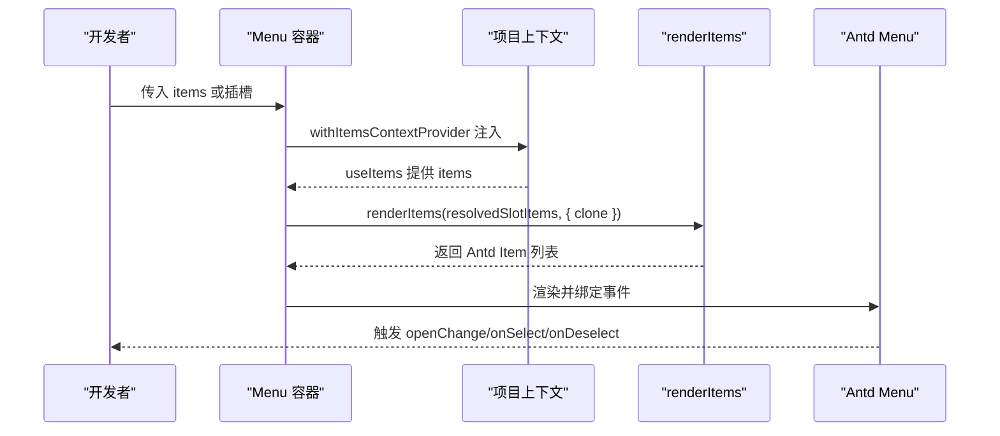
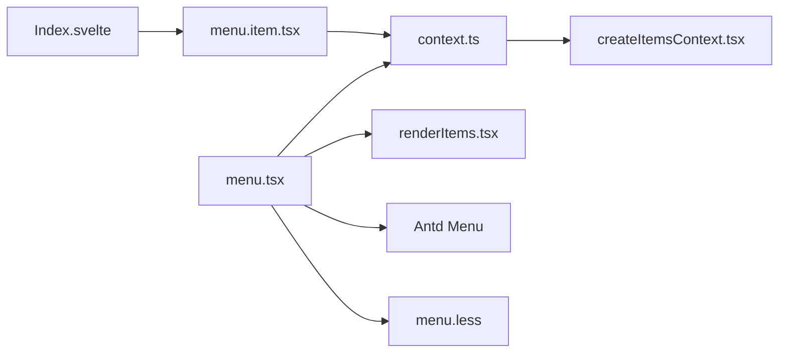

# 导航菜单组件（Menu）

<cite>
**本文档引用的文件**
- [menu.tsx](file://frontend/antd/menu/menu.tsx)
- [menu.item.tsx](file://frontend/antd/menu/item/menu.item.tsx)
- [Index.svelte](file://frontend/antd/menu/item/Index.svelte)
- [context.ts](file://frontend/antd/menu/context.ts)
- [menu.less](file://frontend/antd/menu/menu.less)
- [createItemsContext.tsx](file://frontend/utils/createItemsContext.tsx)
- [renderItems.tsx](file://frontend/utils/renderItems.tsx)
- [README.md](file://docs/components/antd/menu/README.md)
</cite>

## 目录

1. [简介](#简介)
2. [项目结构](#项目结构)
3. [核心组件](#核心组件)
4. [架构总览](#架构总览)
5. [详细组件分析](#详细组件分析)
6. [依赖关系分析](#依赖关系分析)
7. [性能考虑](#性能考虑)
8. [故障排查指南](#故障排查指南)
9. [结论](#结论)
10. [附录](#附录)

## 简介

本文件系统性地介绍导航菜单组件（Menu）的设计与实现，覆盖布局模式、菜单项配置、状态管理、交互行为、图标与禁用、子菜单嵌套、水平/垂直布局切换、折叠展开机制、响应式适配、与路由系统的集成（动态菜单、权限控制、面包屑联动）、手风琴与多选模式、可搜索菜单等高级能力，并提供使用示例、样式定制与性能优化建议。

## 项目结构

菜单组件由“容器组件 + 菜单项组件 + 上下文与渲染工具”三部分组成，采用 Ant Design 的 Menu 组件作为底层实现，通过 Svelte 预处理桥接为 React 组件，结合自研的“项目上下文”系统实现灵活的菜单项收集与渲染。

图表来源

- [menu.tsx:14-93](file://frontend/antd/menu/menu.tsx#L14-L93)
- [menu.item.tsx:9-33](file://frontend/antd/menu/item/menu.item.tsx#L9-L33)
- [Index.svelte:13-83](file://frontend/antd/menu/item/Index.svelte#L13-L83)
- [context.ts:1-7](file://frontend/antd/menu/context.ts#L1-L7)
- [createItemsContext.tsx:97-273](file://frontend/utils/createItemsContext.tsx#L97-L273)
- [renderItems.tsx:8-113](file://frontend/utils/renderItems.tsx#L8-L113)

章节来源

- [menu.tsx:1-96](file://frontend/antd/menu/menu.tsx#L1-L96)
- [menu.item.tsx:1-36](file://frontend/antd/menu/item/menu.item.tsx#L1-L36)
- [Index.svelte:1-84](file://frontend/antd/menu/item/Index.svelte#L1-L84)
- [context.ts:1-7](file://frontend/antd/menu/context.ts#L1-L7)
- [menu.less:1-45](file://frontend/antd/menu/menu.less#L1-L45)
- [createItemsContext.tsx:1-274](file://frontend/utils/createItemsContext.tsx#L1-L274)
- [renderItems.tsx:1-114](file://frontend/utils/renderItems.tsx#L1-L114)

## 核心组件

- 菜单容器（Menu）
  - 作用：封装 Ant Design Menu，统一事件透传、插槽渲染、图标与溢出指示器的自定义渲染、以及项目上下文注入。
  - 关键点：支持 slots 扩展（如 expandIcon、overflowedIndicator、popupRender），支持 items 或插槽两种数据源；内部通过 renderItems 将“项目上下文”转换为 Antd 所需的 ItemType 数组。
- 菜单项（MenuItem）
  - 作用：将“项目上下文”中的菜单项包装为 Antd MenuItem/SubMenu，自动识别类型（普通项/子菜单），并注入样式类名。
- 项目上下文（createItemsContext）
  - 作用：提供“项目收集 + 子项目收集”的上下文，支持多插槽、索引定位、属性与子项变换、变更回调等。
- 渲染器（renderItems）
  - 作用：将“项目上下文”树形结构渲染为 Antd 所需的 props 结构，支持插槽注入、克隆、参数化插槽等。

章节来源

- [menu.tsx:14-93](file://frontend/antd/menu/menu.tsx#L14-L93)
- [menu.item.tsx:9-33](file://frontend/antd/menu/item/menu.item.tsx#L9-L33)
- [createItemsContext.tsx:97-273](file://frontend/utils/createItemsContext.tsx#L97-L273)
- [renderItems.tsx:8-113](file://frontend/utils/renderItems.tsx#L8-L113)

## 架构总览

菜单组件采用“容器 + 项包装 + 上下文”的分层设计，通过 Svelte 预处理桥接到 React，再由 React 调用 Antd Menu。项目上下文负责在运行时收集菜单项及其插槽，最终由渲染器输出为 Antd 可识别的数据结构。

图表来源

- [menu.tsx:18-54](file://frontend/antd/menu/menu.tsx#L18-L54)
- [createItemsContext.tsx:171-184](file://frontend/utils/createItemsContext.tsx#L171-L184)
- [renderItems.tsx:8-113](file://frontend/utils/renderItems.tsx#L8-L113)

## 详细组件分析

### 菜单容器（Menu）

- 数据源选择
  - 支持直接传入 items（Antd Item 类型数组）或通过插槽收集（default/items 插槽）。
  - 若插槽存在，则优先使用插槽中的 items；否则回退到 default 插槽。
- 插槽扩展
  - expandIcon：自定义展开图标，支持带参数渲染。
  - overflowedIndicator：溢出指示器（如“更多”按钮）。
  - popupRender：下拉弹层自定义渲染。
- 事件透传
  - onOpenChange、onSelect、onDeselect 原样透传至 Antd Menu。
- 性能优化
  - 使用 useMemo 缓存 items 计算结果，避免重复渲染。
  - 仅在 items 或 resolvedSlotItems 变更时重新计算。

章节来源

- [menu.tsx:14-93](file://frontend/antd/menu/menu.tsx#L14-L93)

### 菜单项（MenuItem）

- 类型识别
  - 当存在默认插槽子项时，自动识别为子菜单（SubMenu）；否则为普通菜单项（MenuItem）。
- 样式类名
  - 自动注入 ms-gr-antd-menu-item 或 ms-gr-antd-menu-item-{type}，便于主题与样式定制。
- 插槽处理
  - 将 icon 插槽以克隆方式注入到 Antd 的 icon 字段，确保图标与文本间距一致。

章节来源

- [menu.item.tsx:9-33](file://frontend/antd/menu/item/menu.item.tsx#L9-L33)

### 项目上下文（createItemsContext）

- 多插槽支持
  - 允许定义多个插槽（如 default、items），并通过 setItem 按索引写入。
- 子项目收集
  - ItemHandler 内部再次包裹 ItemsContextProvider，形成“父级收集 + 子级收集”的树形结构。
- 属性与子项变换
  - itemProps 与 itemChildren 支持对当前项的 props 与 children 进行变换，便于动态生成。
- 变更通知
  - onChange 回调返回当前插槽下的完整 items，便于上层监听变化。

章节来源

- [createItemsContext.tsx:97-273](file://frontend/utils/createItemsContext.tsx#L97-L273)

### 渲染器（renderItems）

- 插槽注入
  - 将项目上下文中记录的插槽元素注入到对应字段（支持嵌套路径），并支持 withParams 的参数化插槽。
- 克隆与强制克隆
  - clone 控制是否克隆节点；forceClone 在 withParams 时默认启用，保证参数传递正确。
- 子项递归
  - 对 children 字段进行递归渲染，形成完整的菜单树。
- 键值生成
  - 为每个项生成稳定 key，避免 React diff 异常。

章节来源

- [renderItems.tsx:8-113](file://frontend/utils/renderItems.tsx#L8-L113)

### 样式与响应式（menu.less）

- 图标与文本间距
  - 当存在图标时，自动为相邻文本设置 margin-inline-start，并添加过渡动画。
- 折叠模式
  - 在内联折叠（inline-collapsed）状态下，隐藏文本，仅显示图标，提升空间利用率。
- 动画与过渡
  - 通过 CSS 变量控制过渡时长与缓动，保证视觉一致性。

章节来源

- [menu.less:1-45](file://frontend/antd/menu/menu.less#L1-L45)

### Svelte 入口（Index.svelte）

- 属性与插槽处理
  - 通过 getProps/processProps 获取组件属性与附加属性，支持 visible 控制可见性。
  - 将 icon 插槽以克隆方式注入到 Antd 的 icon 字段。
- 主题与样式
  - 支持 elem_id、elem_classes、elem_style 注入，便于主题与样式定制。
- 条件渲染
  - 仅在 visible 为真时渲染 children。

章节来源

- [Index.svelte:1-84](file://frontend/antd/menu/item/Index.svelte#L1-L84)

## 依赖关系分析

- 组件耦合
  - Menu 依赖 createItemsContext 与 renderItems；MenuItem 依赖 ItemHandler 与 context；Svelte 入口负责属性与插槽预处理。
- 外部依赖
  - Ant Design Menu 作为底层 UI；ReactSlot 用于插槽渲染；classnames 用于类名拼接。
- 循环依赖
  - 通过“导出工厂 + 上下文注入”的方式避免循环依赖；Menu 与 MenuItem 通过上下文解耦。

图表来源

- [menu.tsx:1-96](file://frontend/antd/menu/menu.tsx#L1-L96)
- [context.ts:1-7](file://frontend/antd/menu/context.ts#L1-L7)
- [createItemsContext.tsx:1-274](file://frontend/utils/createItemsContext.tsx#L1-L274)
- [renderItems.tsx:1-114](file://frontend/utils/renderItems.tsx#L1-L114)
- [menu.item.tsx:1-36](file://frontend/antd/menu/item/menu.item.tsx#L1-L36)
- [Index.svelte:1-84](file://frontend/antd/menu/item/Index.svelte#L1-L84)
- [menu.less:1-45](file://frontend/antd/menu/menu.less#L1-L45)

章节来源

- [menu.tsx:1-96](file://frontend/antd/menu/menu.tsx#L1-L96)
- [menu.item.tsx:1-36](file://frontend/antd/menu/item/menu.item.tsx#L1-L36)
- [Index.svelte:1-84](file://frontend/antd/menu/item/Index.svelte#L1-L84)
- [context.ts:1-7](file://frontend/antd/menu/context.ts#L1-L7)
- [createItemsContext.tsx:1-274](file://frontend/utils/createItemsContext.tsx#L1-L274)
- [renderItems.tsx:1-114](file://frontend/utils/renderItems.tsx#L1-L114)
- [menu.less:1-45](file://frontend/antd/menu/menu.less#L1-L45)

## 性能考虑

- 渲染缓存
  - Menu 中对 items 计算使用 useMemo，避免不必要的重渲染。
- 事件函数记忆化
  - createItemsContext 内部使用 useMemoizedFn，减少回调函数重建带来的副作用。
- 插槽克隆策略
  - 默认克隆插槽元素，避免 DOM 复用导致的状态错乱；在 withParams 场景下强制克隆。
- 递归渲染优化
  - renderItems 仅对有效项进行过滤与映射，避免空项参与渲染。

章节来源

- [menu.tsx:46-54](file://frontend/antd/menu/menu.tsx#L46-L54)
- [createItemsContext.tsx:203-254](file://frontend/utils/createItemsContext.tsx#L203-L254)
- [renderItems.tsx:19-22](file://frontend/utils/renderItems.tsx#L19-L22)

## 故障排查指南

- 插槽未生效
  - 检查插槽名称是否在 allowedSlots 中声明；确认插槽元素已正确注入到 ItemHandler 的 slots。
- 图标不显示或文本不出现
  - 确认图标插槽已通过 Svelte 入口注入到 icon 字段；检查菜单处于折叠模式时的行为。
- 事件未触发
  - 确认 Menu 是否正确透传 onOpenChange/onSelect/onDeselect；检查 Antd 版本兼容性。
- 子菜单不展开
  - 检查子项 children 是否通过 renderItems 正确递归；确认 itemChildren 回调返回了正确的子项列表。
- 样式异常
  - 检查是否引入了 menu.less；确认主题变量（如 --ms-gr-ant-menu-icon-margin-inline-end）是否正确设置。

章节来源

- [menu.tsx:35-88](file://frontend/antd/menu/menu.tsx#L35-L88)
- [menu.item.tsx:16-30](file://frontend/antd/menu/item/menu.item.tsx#L16-L30)
- [Index.svelte:69-78](file://frontend/antd/menu/item/Index.svelte#L69-L78)
- [menu.less:1-45](file://frontend/antd/menu/menu.less#L1-L45)

## 结论

该菜单组件通过“容器 + 项包装 + 上下文”的架构，实现了对 Ant Design Menu 的增强与扩展，具备灵活的插槽系统、强大的子菜单与图标支持、良好的性能与可维护性。配合路由系统与权限控制，可快速构建复杂导航场景。

## 附录

### 使用示例（路径指引）

- 基础示例
  - 参考文档示例标签：<demo name="basic"></demo>
  - 示例文件位置：docs/components/antd/menu/README.md
- 动态菜单与权限控制
  - 通过 items 属性动态传入菜单项；在 onChange 中根据用户权限过滤项。
- 面包屑联动
  - 在 onSelect 中更新面包屑数据源；结合路由参数生成标题与路径。
- 手风琴与多选
  - 使用 onOpenChange/onSelect 控制展开状态与选中项；Antd Menu 原生支持手风琴与多选模式。
- 可搜索菜单
  - 在外部实现搜索输入框，过滤 items 后传入 Menu；或在插槽中注入搜索组件。

章节来源

- [README.md:1-8](file://docs/components/antd/menu/README.md#L1-L8)

### 样式定制指南

- 自定义图标与文本间距
  - 修改 --ms-gr-ant-menu-icon-margin-inline-end 变量以调整图标与文本间距。
- 折叠模式文本隐藏
  - 通过 menu.less 中的折叠规则控制文本显隐与过渡效果。
- 主题类名
  - 使用 ms-gr-antd-menu-item-\* 类名进行主题化样式覆盖。

章节来源

- [menu.less:1-45](file://frontend/antd/menu/menu.less#L1-L45)

### 高级功能实现要点

- 子菜单嵌套
  - 通过 ItemHandler 的 itemChildren 回调返回子项数组，renderItems 会递归渲染。
- 图标设置
  - 在 Svelte 入口中将 icon 插槽注入到 Antd 的 icon 字段。
- 禁用状态
  - 通过 Antd MenuItem 的 disabled 属性控制禁用；在项目上下文中动态设置。
- 响应式适配
  - Antd Menu 自身支持响应式；结合 CSS 变量与布局容器实现最佳体验。

章节来源

- [menu.item.tsx:16-30](file://frontend/antd/menu/item/menu.item.tsx#L16-L30)
- [Index.svelte:69-78](file://frontend/antd/menu/item/Index.svelte#L69-L78)
- [renderItems.tsx:99-112](file://frontend/utils/renderItems.tsx#L99-L112)
