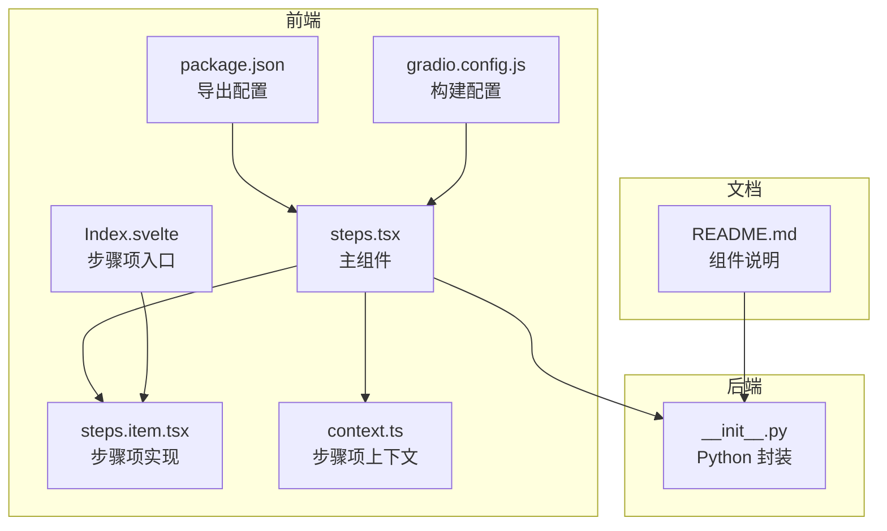
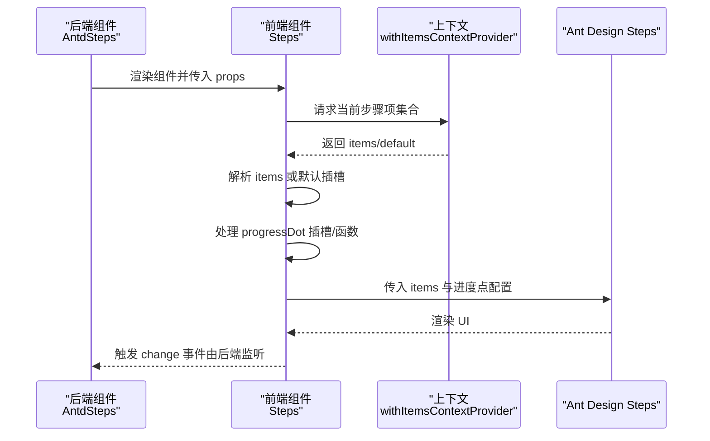
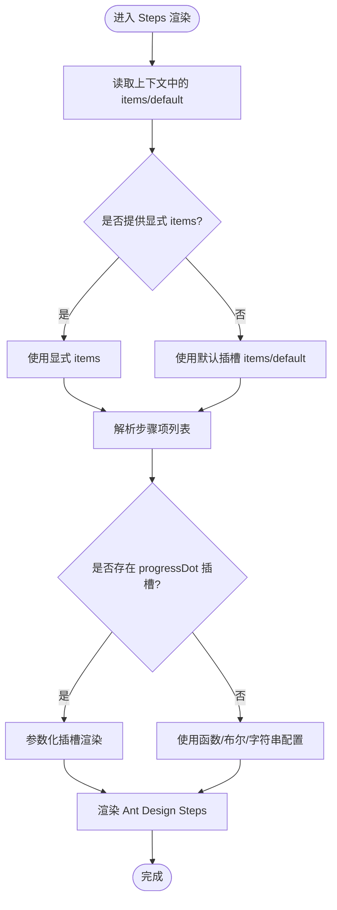
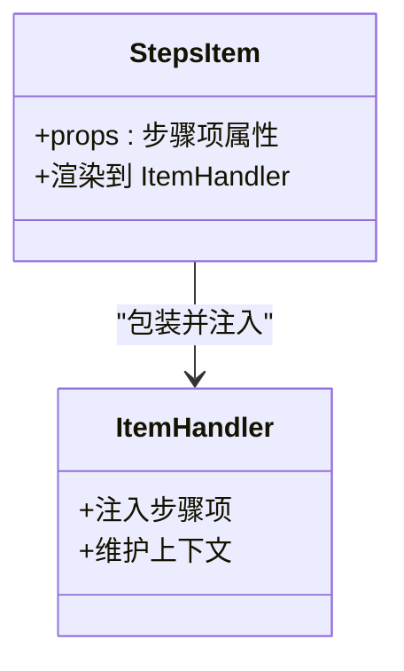
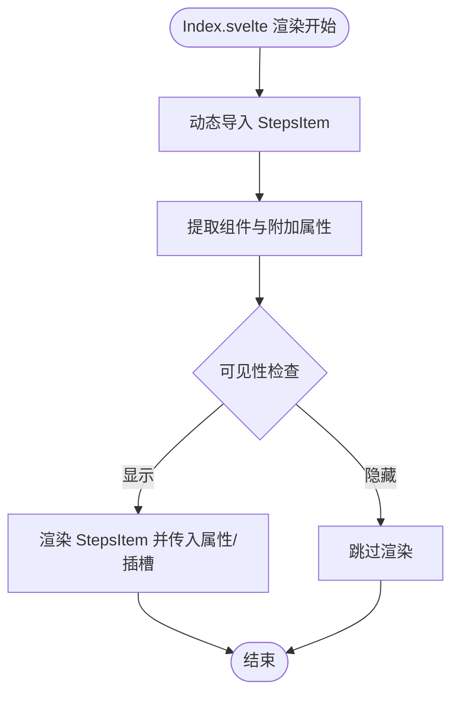
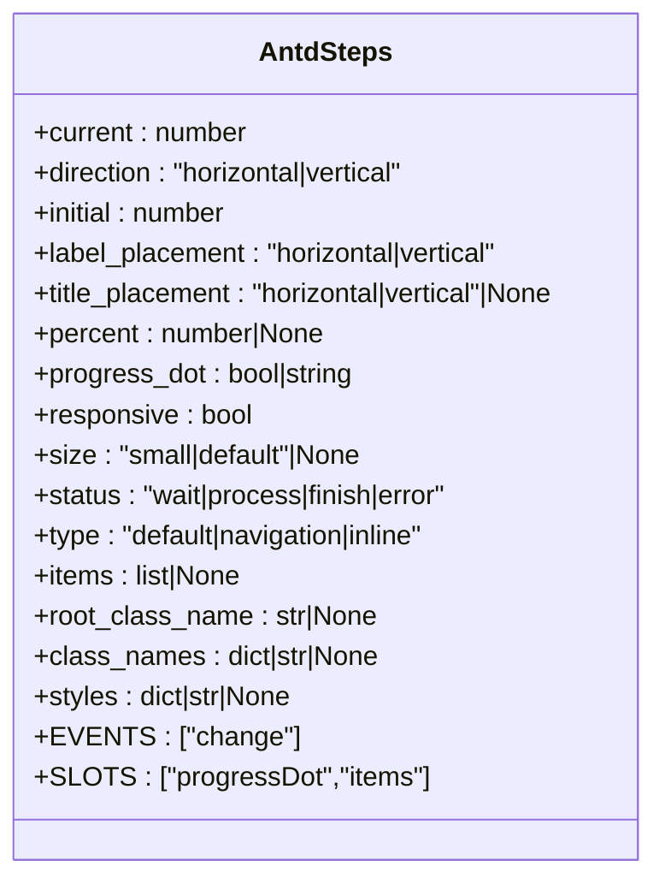
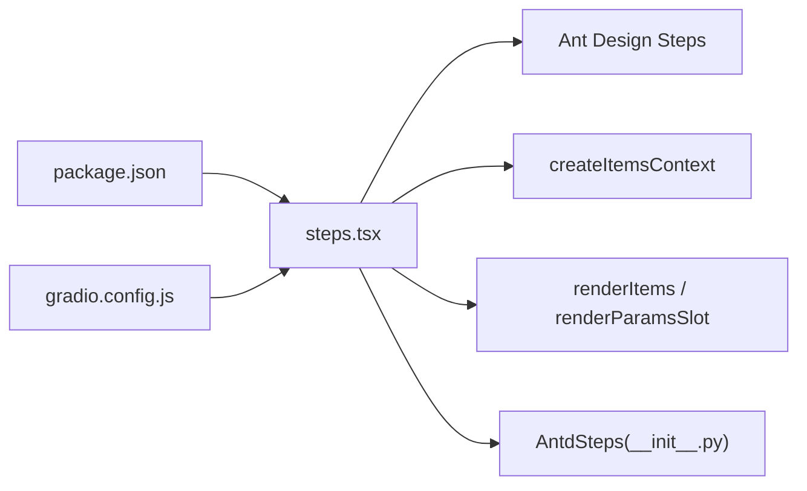

# 步骤条组件 (Steps)

<cite>
**本文引用的文件**   
- [steps.tsx](file://frontend/antd/steps/steps.tsx)
- [steps.item.tsx](file://frontend/antd/steps/item/steps.item.tsx)
- [Index.svelte](file://frontend/antd/steps/item/Index.svelte)
- [context.ts](file://frontend/antd/steps/context.ts)
- [package.json](file://frontend/antd/steps/package.json)
- [gradio.config.js](file://frontend/antd/steps/gradio.config.js)
- [__init__.py](file://backend/modelscope_studio/components/antd/steps/__init__.py)
- [README.md](file://docs/components/antd/steps/README.md)
</cite>

## 目录

1. [简介](#简介)
2. [项目结构](#项目结构)
3. [核心组件](#核心组件)
4. [架构总览](#架构总览)
5. [详细组件分析](#详细组件分析)
6. [依赖关系分析](#依赖关系分析)
7. [性能考量](#性能考量)
8. [故障排查指南](#故障排查指南)
9. [结论](#结论)
10. [附录](#附录)

## 简介

步骤条（Steps）用于在任务流程中引导用户按顺序完成多个阶段，是典型的流程指示组件。本组件基于 Ant Design 的 Steps 实现，并通过 Gradio/Svelte 前端桥接层提供 Python 后端可直接使用的组件形态。它支持多种布局模式（水平/垂直）、尺寸规格（默认/小型）、状态管理（等待/进行中/完成/错误），以及进度点自定义（progressDot 插槽）。组件还提供与表单向导、业务流程、用户注册等场景的集成能力，并支持样式定制与响应式适配。

## 项目结构

步骤条组件由前端 Svelte 组件与后端 ModelScope 组件封装共同构成，前后端交互遵循 Gradio 的组件约定。关键文件分布如下：

- 前端：steps.tsx（主组件）、steps.item.tsx（步骤项封装）、Index.svelte（步骤项入口）、context.ts（步骤项上下文）、package.json（导出配置）、gradio.config.js（构建配置）
- 后端：**init**.py（Python 封装，暴露属性与事件）
- 文档：README.md（组件说明与示例占位）

**图表来源**

- [steps.tsx:1-52](file://frontend/antd/steps/steps.tsx#L1-L52)
- [steps.item.tsx:1-14](file://frontend/antd/steps/item/steps.item.tsx#L1-L14)
- [Index.svelte:1-65](file://frontend/antd/steps/item/Index.svelte#L1-L65)
- [context.ts:1-7](file://frontend/antd/steps/context.ts#L1-L7)
- [package.json:1-15](file://frontend/antd/steps/package.json#L1-L15)
- [gradio.config.js:1-4](file://frontend/antd/steps/gradio.config.js#L1-L4)
- [**init**.py:1-95](file://backend/modelscope_studio/components/antd/steps/__init__.py#L1-L95)
- [README.md:1-8](file://docs/components/antd/steps/README.md#L1-L8)

**章节来源**

- [steps.tsx:1-52](file://frontend/antd/steps/steps.tsx#L1-L52)
- [steps.item.tsx:1-14](file://frontend/antd/steps/item/steps.item.tsx#L1-L14)
- [Index.svelte:1-65](file://frontend/antd/steps/item/Index.svelte#L1-L65)
- [context.ts:1-7](file://frontend/antd/steps/context.ts#L1-L7)
- [package.json:1-15](file://frontend/antd/steps/package.json#L1-L15)
- [gradio.config.js:1-4](file://frontend/antd/steps/gradio.config.js#L1-L4)
- [**init**.py:1-95](file://backend/modelscope_studio/components/antd/steps/__init__.py#L1-L95)
- [README.md:1-8](file://docs/components/antd/steps/README.md#L1-L8)

## 核心组件

- 主组件 Steps（前端）：负责接收 props、解析 slots（如 progressDot）、合并 items 数据源（显式 items 或插槽 items/default），并将最终数据传递给 Ant Design 的 Steps。
- 步骤项 StepsItem（前端）：作为步骤项的 React 包装器，通过 ItemHandler 上下文将步骤项注入到 Steps 容器中。
- 步骤项入口 Index.svelte：在 Svelte 中渲染 StepsItem，并处理可见性、类名、ID、内联样式、插槽等属性。
- 上下文 context：提供 createItemsContext 能力，使 Steps 与 StepsItem 之间建立稳定的父子关系与数据通道。
- 后端封装 AntdSteps：提供丰富的属性（current、direction、size、status、type、responsive 等），并声明支持的 slots（progressDot、items）。

**章节来源**

- [steps.tsx:10-49](file://frontend/antd/steps/steps.tsx#L10-L49)
- [steps.item.tsx:7-11](file://frontend/antd/steps/item/steps.item.tsx#L7-L11)
- [Index.svelte:16-64](file://frontend/antd/steps/item/Index.svelte#L16-L64)
- [context.ts:3-4](file://frontend/antd/steps/context.ts#L3-L4)
- [**init**.py:11-77](file://backend/modelscope_studio/components/antd/steps/__init__.py#L11-L77)

## 架构总览

步骤条的运行时控制流如下：前端 Steps 组件从上下文读取步骤项集合，解析 items 或默认插槽；若存在 progressDot 插槽，则以参数化插槽方式渲染；否则回退到函数或布尔值形式。Ant Design 的 Steps 接收最终的 items 与进度点配置，渲染 UI 并触发 change 事件（由后端监听）。

**图表来源**

- [steps.tsx:16-44](file://frontend/antd/steps/steps.tsx#L16-L44)
- [context.ts:3-4](file://frontend/antd/steps/context.ts#L3-L4)
- [**init**.py:16-20](file://backend/modelscope_studio/components/antd/steps/__init__.py#L16-L20)

**章节来源**

- [steps.tsx:16-44](file://frontend/antd/steps/steps.tsx#L16-L44)
- [context.ts:3-4](file://frontend/antd/steps/context.ts#L3-L4)
- [**init**.py:16-20](file://backend/modelscope_studio/components/antd/steps/__init__.py#L16-L20)

## 详细组件分析

### 步骤条主组件（Steps）

- 功能职责
  - 接收 Ant Design Steps 的所有可用 props，并扩展 children 支持。
  - 通过上下文读取步骤项集合，优先使用显式 items，其次使用默认插槽 items/default。
  - 进度点配置支持两种形式：插槽 progressDot（参数化渲染）或函数/布尔值。
  - 使用 useMemo 对 items 进行稳定化处理，避免不必要的重渲染。
- 关键行为
  - 隐藏 children（display: none）以避免重复渲染，实际内容通过插槽注入。
  - progressDot 的优先级：存在插槽则使用插槽渲染，否则使用函数或原生布尔/字符串配置。
- 典型用法
  - 在 items 中直接传入步骤数组，或通过插槽注入步骤项。
  - 使用 progressDot 插槽来自定义每个步骤点的渲染逻辑。

**图表来源**

- [steps.tsx:18-44](file://frontend/antd/steps/steps.tsx#L18-L44)

**章节来源**

- [steps.tsx:10-49](file://frontend/antd/steps/steps.tsx#L10-L49)

### 步骤项（StepsItem）

- 功能职责
  - 作为步骤项的 React 包装器，将步骤项属性与上下文结合，交由 ItemHandler 处理。
  - 通过 sveltify 将 TypeScript/React 组件桥接到 Svelte 生态。
- 集成要点
  - 与 Steps 的上下文配合，确保步骤项被正确注入到容器中。
  - 支持额外属性透传与内部索引（itemIndex）传递。

**图表来源**

- [steps.item.tsx:7-11](file://frontend/antd/steps/item/steps.item.tsx#L7-L11)
- [context.ts:3-4](file://frontend/antd/steps/context.ts#L3-L4)

**章节来源**

- [steps.item.tsx:7-11](file://frontend/antd/steps/item/steps.item.tsx#L7-L11)
- [context.ts:3-4](file://frontend/antd/steps/context.ts#L3-L4)

### 步骤项入口（Index.svelte）

- 功能职责
  - 在 Svelte 中动态导入 StepsItem 并渲染。
  - 处理可见性、类名、ID、内联样式、插槽等属性。
  - 将子节点通过 {@render children()} 注入到 StepsItem。
- 设计要点
  - 使用 getProps/processProps 获取并过滤不需要透传的内部属性。
  - 通过 getSlotKey 获取插槽键，传递给 StepsItem 以便插槽识别。

**图表来源**

- [Index.svelte:16-64](file://frontend/antd/steps/item/Index.svelte#L16-L64)

**章节来源**

- [Index.svelte:1-65](file://frontend/antd/steps/item/Index.svelte#L1-L65)

### 后端封装（AntdSteps）

- 属性概览（节选）
  - 当前步骤 current、方向 direction（horizontal/vertical）、初始值 initial、标签位置 label_placement、标题位置 title_placement、百分比 percent、进度点 progress_dot、响应式 responsive、尺寸 size（small/default）、状态 status（wait/process/finish/error）、类型 type（default/navigation/inline）、根类名 root_class_name、类名 class_names、样式 styles、插槽 items/progressDot 等。
- 事件
  - change：监听步骤变更事件（由后端绑定）。
- 其他
  - FRONTEND_DIR 指向前端 steps 组件目录。
  - skip_api 为 True，表示该组件不参与标准 API 流程。

**图表来源**

- [**init**.py:25-77](file://backend/modelscope_studio/components/antd/steps/__init__.py#L25-L77)

**章节来源**

- [**init**.py:11-77](file://backend/modelscope_studio/components/antd/steps/__init__.py#L11-L77)

## 依赖关系分析

- 前端依赖
  - 使用 Ant Design 的 Steps 作为底层 UI 组件。
  - 通过 sveltify 将 React 组件桥接到 Svelte。
  - 通过 createItemsContext 提供步骤项上下文。
  - 使用 renderItems/renderParamsSlot 渲染步骤项与插槽。
- 后端依赖
  - 通过 ModelScopeLayoutComponent 与 Gradio 交互。
  - 通过 resolve_frontend_dir 指定前端组件目录。
- 导出与构建
  - package.json 指定 Gradio 与默认导出路径。
  - gradio.config.js 基于全局 defineConfig 进行构建配置。

**图表来源**

- [package.json:4-12](file://frontend/antd/steps/package.json#L4-L12)
- [gradio.config.js:1-4](file://frontend/antd/steps/gradio.config.js#L1-L4)
- [steps.tsx:1-8](file://frontend/antd/steps/steps.tsx#L1-L8)
- [**init**.py:77-77](file://backend/modelscope_studio/components/antd/steps/__init__.py#L77-L77)

**章节来源**

- [package.json:1-15](file://frontend/antd/steps/package.json#L1-L15)
- [gradio.config.js:1-4](file://frontend/antd/steps/gradio.config.js#L1-L4)
- [steps.tsx:1-8](file://frontend/antd/steps/steps.tsx#L1-L8)
- [**init**.py:77-77](file://backend/modelscope_studio/components/antd/steps/__init__.py#L77-L77)

## 性能考量

- 数据稳定化：通过 useMemo 对 items 进行稳定化处理，减少不必要的重渲染。
- 插槽渲染：progressDot 插槽采用参数化渲染，避免在每次渲染中重复创建复杂结构。
- 可见性控制：步骤项入口对 visible 进行判断，隐藏不可见项，降低 DOM 开销。
- 事件绑定：仅在需要时绑定 change 事件，避免无谓的回调触发。

[本节为通用性能建议，无需特定文件引用]

## 故障排查指南

- 问题：步骤项未显示
  - 检查 Steps 是否正确注入了 items 或插槽 items/default。
  - 确认步骤项的 visible 属性是否为真。
- 问题：进度点未按预期渲染
  - 若使用 progressDot 插槽，请确认插槽键与组件约定一致。
  - 若使用函数/布尔值，请确认传入的配置与 Ant Design 的期望一致。
- 问题：样式或类名未生效
  - 检查 root_class_name、class_names、styles 的传入是否正确。
  - 确认 CSS 作用域与覆盖规则。
- 问题：响应式布局异常
  - 检查 responsive 与 direction 的组合使用是否符合预期。
  - 确认父容器的宽度与断点设置。

**章节来源**

- [steps.tsx:20-44](file://frontend/antd/steps/steps.tsx#L20-L44)
- [Index.svelte:49-64](file://frontend/antd/steps/item/Index.svelte#L49-L64)
- [**init**.py:25-77](file://backend/modelscope_studio/components/antd/steps/__init__.py#L25-L77)

## 结论

步骤条组件通过清晰的前后端分层设计，实现了对 Ant Design Steps 的完整封装与扩展。其支持多布局、多状态、可定制进度点与响应式适配，适用于表单向导、业务流程与用户注册等多种场景。通过上下文与插槽机制，组件具备良好的可组合性与可维护性。

[本节为总结性内容，无需特定文件引用]

## 附录

### 步骤项（Item）配置选项

- 基础属性
  - 标题：用于步骤项的标题文本。
  - 描述：用于步骤项的描述文本。
  - 图标：用于步骤项的图标元素。
- 状态与行为
  - 状态：wait、process、finish、error，用于指示步骤当前状态。
  - 可见性：visible 控制步骤项是否渲染。
  - 内部索引：itemIndex 用于标识步骤项在列表中的位置。
- 插槽与样式
  - 插槽：支持通过插槽注入自定义内容。
  - 类名与 ID：elem_classes、elem_id 用于样式与定位。
  - 内联样式：elem_style 用于局部样式覆盖。

**章节来源**

- [Index.svelte:16-64](file://frontend/antd/steps/item/Index.svelte#L16-L64)
- [steps.item.tsx:7-11](file://frontend/antd/steps/item/steps.item.tsx#L7-L11)

### 布局模式与应用场景

- 水平步骤条（horizontal）
  - 适合线性流程，如表单向导、支付流程。
- 垂直步骤条（vertical）
  - 适合长流程或需要强调时间顺序的场景。
- 小型步骤条（small）
  - 适合空间受限或需要简洁呈现的界面。

**章节来源**

- [**init**.py:30-39](file://backend/modelscope_studio/components/antd/steps/__init__.py#L30-L39)

### 与表单向导、业务流程、用户注册的集成

- 表单向导
  - 使用 current 与 status 控制当前步骤与状态；通过 change 事件同步后端状态。
- 业务流程
  - 使用 direction 与 responsive 实现流程可视化；使用 progress_dot 自定义流程节点。
- 用户注册
  - 使用 size 与 type 切换不同风格；使用 items 与插槽组织注册步骤。

**章节来源**

- [**init**.py:25-77](file://backend/modelscope_studio/components/antd/steps/__init__.py#L25-L77)
- [steps.tsx:16-44](file://frontend/antd/steps/steps.tsx#L16-L44)

### 样式定制与响应式适配

- 样式定制
  - 使用 root_class_name、class_names、styles 进行整体与局部样式控制。
  - 通过 elem_classes、elem_id、elem_style 精细化控制步骤项外观。
- 响应式适配
  - 使用 responsive 与 direction 组合，适配移动端与桌面端布局。

**章节来源**

- [**init**.py:40-77](file://backend/modelscope_studio/components/antd/steps/__init__.py#L40-L77)
- [Index.svelte:52-58](file://frontend/antd/steps/item/Index.svelte#L52-L58)

### 使用示例与最佳实践

- 示例参考
  - 文档中提供基础示例占位，可结合后端 AntdSteps 的属性与插槽进行演示。
- 最佳实践
  - 明确步骤状态与导航逻辑，避免状态错乱。
  - 合理使用 progress_dot 插槽，保持视觉一致性。
  - 在复杂流程中拆分步骤，提升用户体验。

**章节来源**

- [README.md:1-8](file://docs/components/antd/steps/README.md#L1-L8)
- [**init**.py:25-77](file://backend/modelscope_studio/components/antd/steps/__init__.py#L25-L77)
