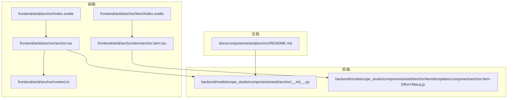
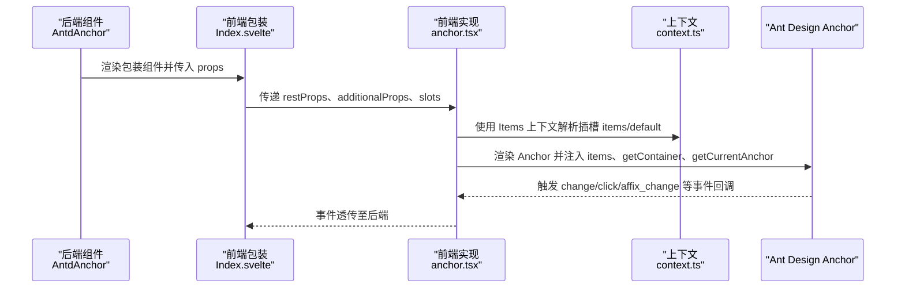
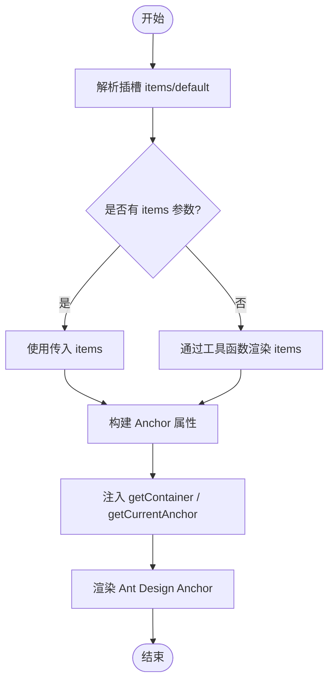
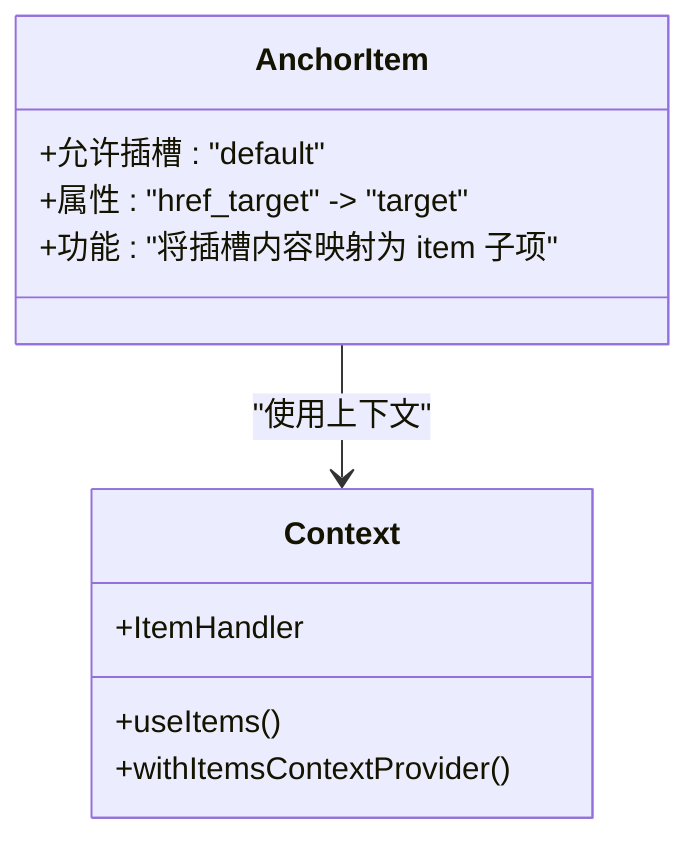
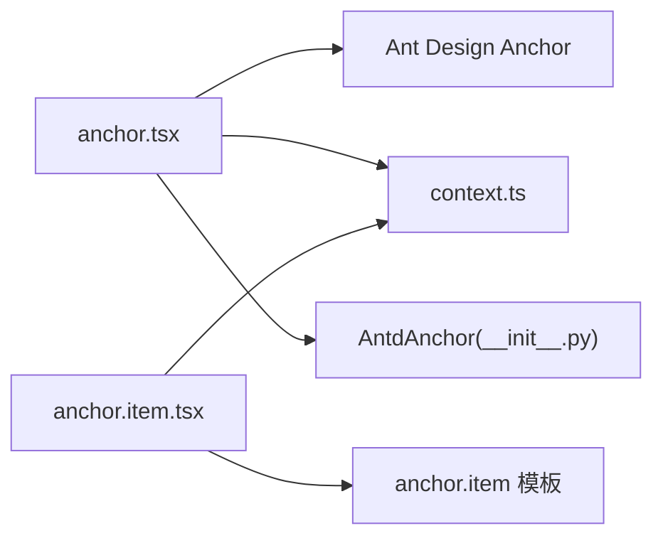

# 锚点组件（Anchor）

<cite>
**本文引用的文件**
- [frontend/antd/anchor/Index.svelte](file://frontend/antd/anchor/Index.svelte)
- [frontend/antd/anchor/anchor.tsx](file://frontend/antd/anchor/anchor.tsx)
- [frontend/antd/anchor/context.ts](file://frontend/antd/anchor/context.ts)
- [frontend/antd/anchor/item/Index.svelte](file://frontend/antd/anchor/item/Index.svelte)
- [frontend/antd/anchor/item/anchor.item.tsx](file://frontend/antd/anchor/item/anchor.item.tsx)
- [backend/modelscope_studio/components/antd/anchor/__init__.py](file://backend/modelscope_studio/components/antd/anchor/__init__.py)
- [backend/modelscope_studio/components/antd/anchor/item/templates/component/anchor.item-DRmYMecq.js](file://backend/modelscope_studio/components/antd/anchor/item/templates/component/anchor.item-DRmYMecq.js)
- [docs/components/antd/anchor/README.md](file://docs/components/antd/anchor/README.md)
- [backend/modelscope_studio/utils/dev/component.py](file://backend/modelscope_studio/utils/dev/component.py)
</cite>

## 目录

1. [简介](#简介)
2. [项目结构](#项目结构)
3. [核心组件](#核心组件)
4. [架构总览](#架构总览)
5. [详细组件分析](#详细组件分析)
6. [依赖关系分析](#依赖关系分析)
7. [性能考量](#性能考量)
8. [故障排查指南](#故障排查指南)
9. [结论](#结论)
10. [附录](#附录)

## 简介

锚点组件用于在单页内提供可点击的导航链接，支持滚动定位到对应标题或区域，并可结合固定模式（Affix）在页面滚动时保持可见。本组件基于 Ant Design 的 Anchor 组件进行封装，提供以下能力：

- 滚动定位：根据锚点项的目标位置进行平滑或直接跳转
- 链接生成：支持通过 items 列表或插槽动态生成锚点项
- 激活状态管理：自动高亮当前处于可视区域内的锚点项
- 嵌套结构：锚点项支持嵌套，形成层级化导航
- 事件与扩展：支持 change、click、affix_change 等事件绑定，以及 affix 固定模式

## 项目结构

锚点组件由前端 Svelte 包装层与后端 Gradio 组件层共同构成，同时提供锚点项子组件以支持嵌套与插槽渲染。

图表来源

- [frontend/antd/anchor/Index.svelte:1-66](file://frontend/antd/anchor/Index.svelte#L1-L66)
- [frontend/antd/anchor/anchor.tsx:1-46](file://frontend/antd/anchor/anchor.tsx#L1-L46)
- [frontend/antd/anchor/context.ts:1-7](file://frontend/antd/anchor/context.ts#L1-L7)
- [frontend/antd/anchor/item/Index.svelte:1-75](file://frontend/antd/anchor/item/Index.svelte#L1-L75)
- [frontend/antd/anchor/item/anchor.item.tsx:1-22](file://frontend/antd/anchor/item/anchor.item.tsx#L1-L22)
- [backend/modelscope_studio/components/antd/anchor/**init**.py:1-117](file://backend/modelscope_studio/components/antd/anchor/__init__.py#L1-L117)
- [backend/modelscope_studio/components/antd/anchor/item/templates/component/anchor.item-DRmYMecq.js:1-450](file://backend/modelscope_studio/components/antd/anchor/item/templates/component/anchor.item-DRmYMecq.js#L1-L450)
- [docs/components/antd/anchor/README.md:1-8](file://docs/components/antd/anchor/README.md#L1-L8)

章节来源

- [frontend/antd/anchor/Index.svelte:1-66](file://frontend/antd/anchor/Index.svelte#L1-L66)
- [frontend/antd/anchor/anchor.tsx:1-46](file://frontend/antd/anchor/anchor.tsx#L1-L46)
- [frontend/antd/anchor/context.ts:1-7](file://frontend/antd/anchor/context.ts#L1-L7)
- [frontend/antd/anchor/item/Index.svelte:1-75](file://frontend/antd/anchor/item/Index.svelte#L1-L75)
- [frontend/antd/anchor/item/anchor.item.tsx:1-22](file://frontend/antd/anchor/item/anchor.item.tsx#L1-L22)
- [backend/modelscope_studio/components/antd/anchor/**init**.py:1-117](file://backend/modelscope_studio/components/antd/anchor/__init__.py#L1-L117)
- [backend/modelscope_studio/components/antd/anchor/item/templates/component/anchor.item-DRmYMecq.js:1-450](file://backend/modelscope_studio/components/antd/anchor/item/templates/component/anchor.item-DRmYMecq.js#L1-L450)
- [docs/components/antd/anchor/README.md:1-8](file://docs/components/antd/anchor/README.md#L1-L8)

## 核心组件

- 顶层锚点组件（AntdAnchor）
  - 负责接收 items 列表或插槽 children，将其转换为 Ant Design Anchor 所需的 items 结构
  - 支持 affix、bounds、offsetTop、direction、replace、rootClassName 等属性
  - 提供 change、click、affix_change 事件绑定入口
- 锚点项组件（AntdAnchorItem）
  - 作为锚点项的容器，支持默认插槽内容渲染
  - 通过上下文系统与父级锚点组件协作，实现嵌套与层级展示

章节来源

- [backend/modelscope_studio/components/antd/anchor/**init**.py:11-117](file://backend/modelscope_studio/components/antd/anchor/__init__.py#L11-L117)
- [frontend/antd/anchor/anchor.tsx:1-46](file://frontend/antd/anchor/anchor.tsx#L1-L46)
- [frontend/antd/anchor/context.ts:1-7](file://frontend/antd/anchor/context.ts#L1-L7)
- [frontend/antd/anchor/item/Index.svelte:1-75](file://frontend/antd/anchor/item/Index.svelte#L1-L75)
- [frontend/antd/anchor/item/anchor.item.tsx:1-22](file://frontend/antd/anchor/item/anchor.item.tsx#L1-L22)

## 架构总览

下图展示了从后端 Gradio 组件到前端 Svelte/React 包装层，再到 Ant Design Anchor 的调用链路，以及事件与插槽的传递过程。

图表来源

- [frontend/antd/anchor/Index.svelte:1-66](file://frontend/antd/anchor/Index.svelte#L1-L66)
- [frontend/antd/anchor/anchor.tsx:1-46](file://frontend/antd/anchor/anchor.tsx#L1-L46)
- [frontend/antd/anchor/context.ts:1-7](file://frontend/antd/anchor/context.ts#L1-L7)
- [backend/modelscope_studio/components/antd/anchor/**init**.py:11-33](file://backend/modelscope_studio/components/antd/anchor/__init__.py#L11-L33)

## 详细组件分析

### 顶层锚点组件（AntdAnchor）

- 功能特性
  - 接收 items 列表或插槽 children，内部通过工具函数将插槽转换为 items
  - 支持 getContainer、getCurrentAnchor 自定义容器与当前锚点判定逻辑
  - 提供 affix 固定模式、bounds 边界距离、offsetTop 顶部偏移、direction 方向、replace 替换历史等配置
  - 事件：change（锚点变化）、click（点击）、affix_change（固定状态变化）
- 数据流
  - 插槽 items/default → 上下文解析 → Ant Design Anchor items
  - getContainer/getCurrentAnchor 通过 useFunction 包装后传入 Ant Design Anchor
- 适用场景
  - 文档目录、长列表导航、帮助中心、产品介绍页等需要快速跳转的场景

图表来源

- [frontend/antd/anchor/anchor.tsx:13-42](file://frontend/antd/anchor/anchor.tsx#L13-L42)

章节来源

- [frontend/antd/anchor/anchor.tsx:1-46](file://frontend/antd/anchor/anchor.tsx#L1-L46)
- [backend/modelscope_studio/components/antd/anchor/**init**.py:38-98](file://backend/modelscope_studio/components/antd/anchor/__init__.py#L38-L98)

### 锚点项组件（AntdAnchorItem）

- 功能特性
  - 作为锚点项的容器，支持默认插槽内容渲染
  - 通过 ItemHandler 将插槽内容映射为 AntdAnchor 的 item 子项
  - 支持 href_target 属性映射为 target 属性，便于控制链接打开方式
- 嵌套结构
  - 通过 createItemsContext 与父级协作，支持多层嵌套的锚点项
- 适用场景
  - 在复杂文档中对章节进行分组与层级化展示

图表来源

- [frontend/antd/anchor/item/anchor.item.tsx:1-22](file://frontend/antd/anchor/item/anchor.item.tsx#L1-L22)
- [frontend/antd/anchor/context.ts:1-7](file://frontend/antd/anchor/context.ts#L1-L7)

章节来源

- [frontend/antd/anchor/item/Index.svelte:1-75](file://frontend/antd/anchor/item/Index.svelte#L1-L75)
- [frontend/antd/anchor/item/anchor.item.tsx:1-22](file://frontend/antd/anchor/item/anchor.item.tsx#L1-L22)
- [backend/modelscope_studio/components/antd/anchor/item/templates/component/anchor.item-DRmYMecq.js:437-449](file://backend/modelscope_studio/components/antd/anchor/item/templates/component/anchor.item-DRmYMecq.js#L437-L449)

### 事件与生命周期

- change：当当前激活的锚点发生变化时触发
- click：点击锚点链接时触发
- affix_change：当固定模式（Affix）状态改变时触发
- 生命周期：组件在退出作用域时会更新布局标记，确保渲染顺序正确

章节来源

- [backend/modelscope_studio/components/antd/anchor/**init**.py:20-33](file://backend/modelscope_studio/components/antd/anchor/__init__.py#L20-L33)
- [backend/modelscope_studio/utils/dev/component.py:24-26](file://backend/modelscope_studio/utils/dev/component.py#L24-L26)

## 依赖关系分析

- 前端包装层依赖 Ant Design Anchor 组件，通过 sveltify 与 withItemsContextProvider 进行桥接
- 插槽系统通过 createItemsContext 实现父子组件通信，支持 items/default 两种插槽
- 后端组件继承自 ModelScopeLayoutComponent，提供统一的布局与事件绑定能力

图表来源

- [frontend/antd/anchor/anchor.tsx:1-46](file://frontend/antd/anchor/anchor.tsx#L1-L46)
- [frontend/antd/anchor/context.ts:1-7](file://frontend/antd/anchor/context.ts#L1-L7)
- [frontend/antd/anchor/item/anchor.item.tsx:1-22](file://frontend/antd/anchor/item/anchor.item.tsx#L1-L22)
- [backend/modelscope_studio/components/antd/anchor/**init**.py:1-117](file://backend/modelscope_studio/components/antd/anchor/__init__.py#L1-L117)
- [backend/modelscope_studio/components/antd/anchor/item/templates/component/anchor.item-DRmYMecq.js:1-450](file://backend/modelscope_studio/components/antd/anchor/item/templates/component/anchor.item-DRmYMecq.js#L1-L450)

章节来源

- [frontend/antd/anchor/anchor.tsx:1-46](file://frontend/antd/anchor/anchor.tsx#L1-L46)
- [frontend/antd/anchor/context.ts:1-7](file://frontend/antd/anchor/context.ts#L1-L7)
- [frontend/antd/anchor/item/anchor.item.tsx:1-22](file://frontend/antd/anchor/item/anchor.item.tsx#L1-L22)
- [backend/modelscope_studio/components/antd/anchor/**init**.py:1-117](file://backend/modelscope_studio/components/antd/anchor/__init__.py#L1-L117)
- [backend/modelscope_studio/components/antd/anchor/item/templates/component/anchor.item-DRmYMecq.js:1-450](file://backend/modelscope_studio/components/antd/anchor/item/templates/component/anchor.item-DRmYMecq.js#L1-L450)

## 性能考量

- items 渲染优化
  - 使用 useMemo 缓存 items 计算结果，避免不必要的重渲染
  - 优先传入 items 参数而非依赖插槽，减少插槽解析成本
- 函数包装
  - 通过 useFunction 包装 getContainer/getCurrentAnchor，确保回调稳定且可复用
- 滚动监听
  - 合理设置 bounds 与 offsetTop，避免频繁触发 change 事件
  - 在大文档中建议使用 replace 替换历史记录，减少内存占用
- 固定模式（Affix）
  - affix 模式会在滚动时保持可见，注意容器选择与层级关系，避免遮挡

## 故障排查指南

- 锚点不生效
  - 检查 getContainer 是否指向正确的滚动容器；若未设置，可能无法正确计算可视区域
  - 确认目标元素存在且具有对应的锚点标识
- 激活状态不更新
  - 检查 bounds 与 offsetTop 设置是否合理；过小的边界可能导致切换不及时
  - 确认 getCurrentAnchor 返回值与 items 中的 key 或 href 匹配
- 链接打开行为异常
  - href_target 映射为 target，确认是否需要在新窗口或当前窗口打开
- 事件未触发
  - 确认事件绑定是否启用（bind_change_event、bind_click_event、bind_affix_change_event）
  - 检查 affix 模式下的状态变化是否符合预期

章节来源

- [frontend/antd/anchor/anchor.tsx:13-42](file://frontend/antd/anchor/anchor.tsx#L13-L42)
- [backend/modelscope_studio/components/antd/anchor/**init**.py:20-33](file://backend/modelscope_studio/components/antd/anchor/__init__.py#L20-L33)

## 结论

锚点组件通过前后端协同的方式，提供了灵活的锚点导航能力。其核心优势在于：

- 通过 items 与插槽双通道生成锚点项，满足不同场景需求
- 与 Ant Design Anchor 深度集成，具备完善的滚动定位与激活状态管理
- 事件体系完善，便于扩展交互与埋点统计
- 支持嵌套结构与固定模式，适合复杂文档与长页面导航

## 附录

- 使用示例与文档
  - 参考文档中的基础示例，了解基本用法与参数说明
- 常见问题
  - 若页面存在多个滚动容器，请明确指定 getContainer
  - 大文档建议开启 replace 以优化历史记录管理
  - 如需自定义高亮策略，可通过 getCurrentAnchor 定制

章节来源

- [docs/components/antd/anchor/README.md:1-8](file://docs/components/antd/anchor/README.md#L1-L8)
