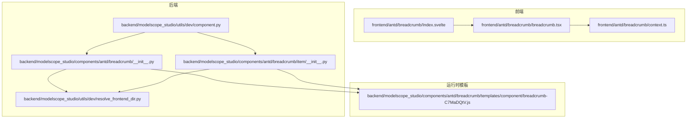
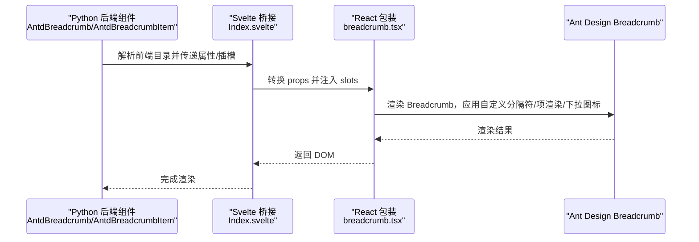
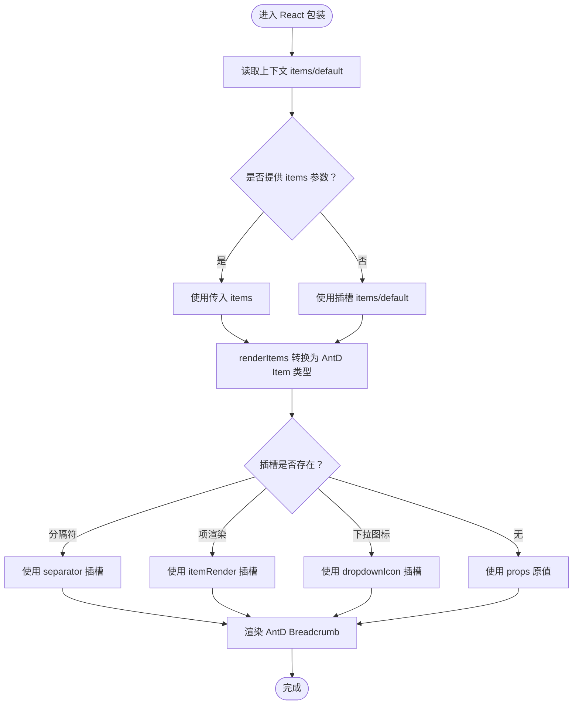
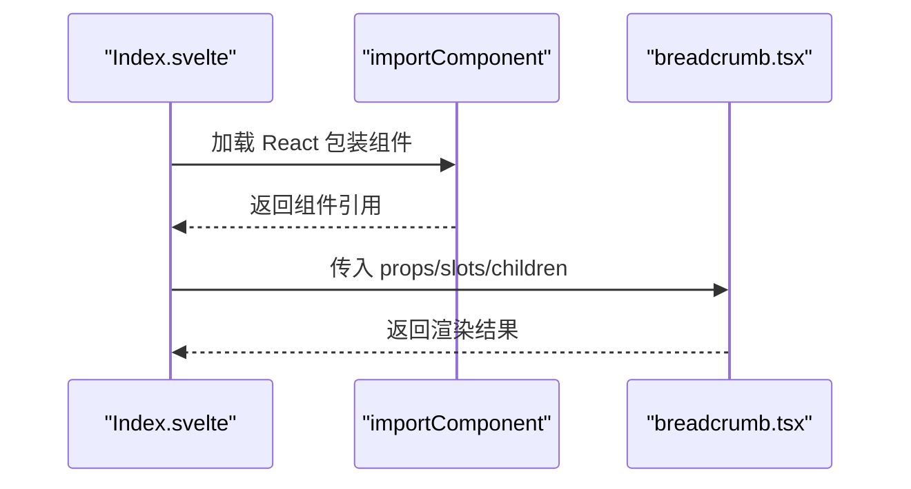
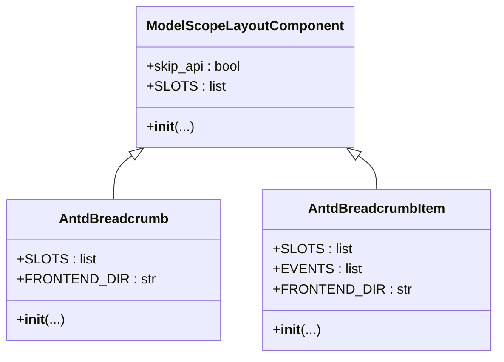
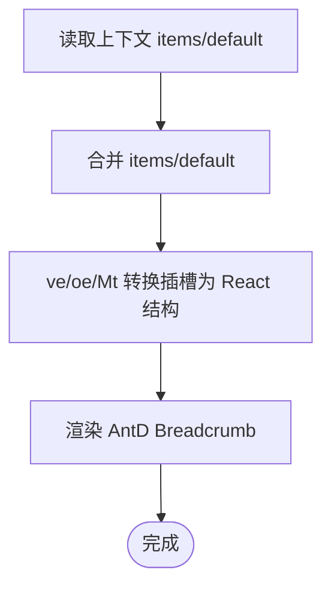
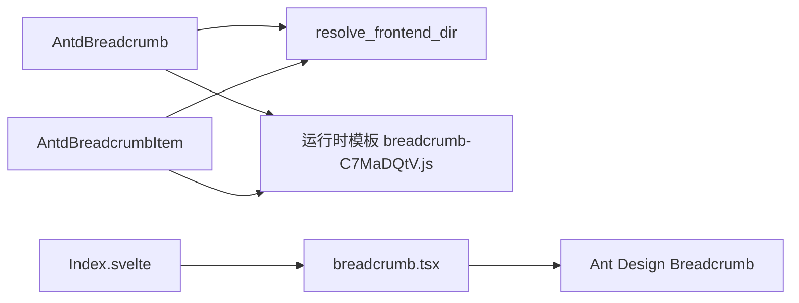

# 面包屑组件（Breadcrumb）

<cite>
**本文引用的文件**
- [frontend/antd/breadcrumb/breadcrumb.tsx](file://frontend/antd/breadcrumb/breadcrumb.tsx)
- [frontend/antd/breadcrumb/context.ts](file://frontend/antd/breadcrumb/context.ts)
- [frontend/antd/breadcrumb/Index.svelte](file://frontend/antd/breadcrumb/Index.svelte)
- [backend/modelscope_studio/components/antd/breadcrumb/__init__.py](file://backend/modelscope_studio/components/antd/breadcrumb/__init__.py)
- [backend/modelscope_studio/components/antd/breadcrumb/item/__init__.py](file://backend/modelscope_studio/components/antd/breadcrumb/item/__init__.py)
- [backend/modelscope_studio/utils/dev/component.py](file://backend/modelscope_studio/utils/dev/component.py)
- [backend/modelscope_studio/utils/dev/resolve_frontend_dir.py](file://backend/modelscope_studio/utils/dev/resolve_frontend_dir.py)
- [docs/components/antd/breadcrumb/README.md](file://docs/components/antd/breadcrumb/README.md)
- [docs/components/antd/breadcrumb/README-zh_CN.md](file://docs/components/antd/breadcrumb/README-zh_CN.md)
- [backend/modelscope_studio/components/antd/breadcrumb/templates/component/breadcrumb-C7MaDQtV.js](file://backend/modelscope_studio/components/antd/breadcrumb/templates/component/breadcrumb-C7MaDQtV.js)
</cite>

## 目录

1. [简介](#简介)
2. [项目结构](#项目结构)
3. [核心组件](#核心组件)
4. [架构总览](#架构总览)
5. [详细组件分析](#详细组件分析)
6. [依赖关系分析](#依赖关系分析)
7. [性能考量](#性能考量)
8. [故障排查指南](#故障排查指南)
9. [结论](#结论)
10. [附录：使用示例与最佳实践](#附录使用示例与最佳实践)

## 简介

面包屑组件用于在层级结构中显示当前位置，并允许用户返回上层状态。本仓库中的面包屑组件基于 Ant Design 的 Breadcrumb 实现，通过 React 包装与 Svelte 前端桥接，同时提供 Python 后端组件以支持 Gradio 生态下的布局与事件绑定。组件支持：

- 导航路径展示与点击跳转
- 自定义分隔符与每个面包屑项的渲染
- 下拉菜单与溢出指示器等高级交互
- 与路由系统集成时的动态路径生成与权限控制
- 多语言与主题样式定制

## 项目结构

面包屑组件由前端 React 包装层、Svelte 桥接层、后端 Gradio 组件层以及运行时模板组成，整体结构如下：

图示来源

- [frontend/antd/breadcrumb/Index.svelte:1-78](file://frontend/antd/breadcrumb/Index.svelte#L1-L78)
- [frontend/antd/breadcrumb/breadcrumb.tsx:1-67](file://frontend/antd/breadcrumb/breadcrumb.tsx#L1-L67)
- [frontend/antd/breadcrumb/context.ts:1-7](file://frontend/antd/breadcrumb/context.ts#L1-L7)
- [backend/modelscope_studio/components/antd/breadcrumb/**init**.py:1-73](file://backend/modelscope_studio/components/antd/breadcrumb/__init__.py#L1-L73)
- [backend/modelscope_studio/components/antd/breadcrumb/item/**init**.py:1-114](file://backend/modelscope_studio/components/antd/breadcrumb/item/__init__.py#L1-L114)
- [backend/modelscope_studio/utils/dev/component.py:1-169](file://backend/modelscope_studio/utils/dev/component.py#L1-L169)
- [backend/modelscope_studio/utils/dev/resolve_frontend_dir.py:1-17](file://backend/modelscope_studio/utils/dev/resolve_frontend_dir.py#L1-L17)
- [backend/modelscope_studio/components/antd/breadcrumb/templates/component/breadcrumb-C7MaDQtV.js:1-766](file://backend/modelscope_studio/components/antd/breadcrumb/templates/component/breadcrumb-C7MaDQtV.js#L1-L766)

章节来源

- [frontend/antd/breadcrumb/Index.svelte:1-78](file://frontend/antd/breadcrumb/Index.svelte#L1-L78)
- [frontend/antd/breadcrumb/breadcrumb.tsx:1-67](file://frontend/antd/breadcrumb/breadcrumb.tsx#L1-L67)
- [frontend/antd/breadcrumb/context.ts:1-7](file://frontend/antd/breadcrumb/context.ts#L1-L7)
- [backend/modelscope_studio/components/antd/breadcrumb/**init**.py:1-73](file://backend/modelscope_studio/components/antd/breadcrumb/__init__.py#L1-L73)
- [backend/modelscope_studio/components/antd/breadcrumb/item/**init**.py:1-114](file://backend/modelscope_studio/components/antd/breadcrumb/item/__init__.py#L1-L114)
- [backend/modelscope_studio/utils/dev/component.py:1-169](file://backend/modelscope_studio/utils/dev/component.py#L1-L169)
- [backend/modelscope_studio/utils/dev/resolve_frontend_dir.py:1-17](file://backend/modelscope_studio/utils/dev/resolve_frontend_dir.py#L1-L17)
- [backend/modelscope_studio/components/antd/breadcrumb/templates/component/breadcrumb-C7MaDQtV.js:1-766](file://backend/modelscope_studio/components/antd/breadcrumb/templates/component/breadcrumb-C7MaDQtV.js#L1-L766)

## 核心组件

- 前端 React 包装：负责将 Ant Design 的 Breadcrumb 与 Slots 渲染系统对接，支持自定义分隔符、项渲染函数与下拉图标。
- Svelte 桥接：将后端传入的属性与插槽转换为前端可消费的 props，并按需引入 React 组件。
- 后端组件：提供 AntdBreadcrumb 与 AntdBreadcrumbItem，支持事件绑定、插槽与前端目录解析。
- 运行时模板：包含实际的 React 组件实现与插槽处理逻辑。

章节来源

- [frontend/antd/breadcrumb/breadcrumb.tsx:1-67](file://frontend/antd/breadcrumb/breadcrumb.tsx#L1-L67)
- [frontend/antd/breadcrumb/Index.svelte:1-78](file://frontend/antd/breadcrumb/Index.svelte#L1-L78)
- [backend/modelscope_studio/components/antd/breadcrumb/**init**.py:1-73](file://backend/modelscope_studio/components/antd/breadcrumb/__init__.py#L1-L73)
- [backend/modelscope_studio/components/antd/breadcrumb/item/**init**.py:1-114](file://backend/modelscope_studio/components/antd/breadcrumb/item/__init__.py#L1-L114)
- [backend/modelscope_studio/components/antd/breadcrumb/templates/component/breadcrumb-C7MaDQtV.js:1-766](file://backend/modelscope_studio/components/antd/breadcrumb/templates/component/breadcrumb-C7MaDQtV.js#L1-L766)

## 架构总览

面包屑组件的调用链从后端到前端如下：

图示来源

- [frontend/antd/breadcrumb/Index.svelte:1-78](file://frontend/antd/breadcrumb/Index.svelte#L1-L78)
- [frontend/antd/breadcrumb/breadcrumb.tsx:1-67](file://frontend/antd/breadcrumb/breadcrumb.tsx#L1-L67)
- [backend/modelscope_studio/components/antd/breadcrumb/**init**.py:1-73](file://backend/modelscope_studio/components/antd/breadcrumb/__init__.py#L1-L73)
- [backend/modelscope_studio/components/antd/breadcrumb/item/**init**.py:1-114](file://backend/modelscope_studio/components/antd/breadcrumb/item/__init__.py#L1-L114)
- [backend/modelscope_studio/components/antd/breadcrumb/templates/component/breadcrumb-C7MaDQtV.js:1-766](file://backend/modelscope_studio/components/antd/breadcrumb/templates/component/breadcrumb-C7MaDQtV.js#L1-L766)

## 详细组件分析

### 前端 React 包装（breadcrumb.tsx）

- 功能要点
  - 使用 sveltify 将 Svelte 组件桥接到 React。
  - 通过 withItemsContextProvider 提供面包屑项上下文。
  - 支持 slots：separator、itemRender、dropdownIcon；优先使用插槽，否则回退到 props。
  - 使用 renderItems 将插槽项转换为 Ant Design 所需的 ItemType 列表。
  - 使用 renderParamsSlot 渲染带参数的 itemRender 插槽。
- 关键流程
  - 读取上下文中的 items/default。
  - 计算最终 items 列表（items 优先于插槽）。
  - 渲染 Ant Design Breadcrumb，并注入自定义分隔符与项渲染。

图示来源

- [frontend/antd/breadcrumb/breadcrumb.tsx:1-67](file://frontend/antd/breadcrumb/breadcrumb.tsx#L1-L67)
- [frontend/antd/breadcrumb/context.ts:1-7](file://frontend/antd/breadcrumb/context.ts#L1-L7)
- [backend/modelscope_studio/components/antd/breadcrumb/templates/component/breadcrumb-C7MaDQtV.js:727-761](file://backend/modelscope_studio/components/antd/breadcrumb/templates/component/breadcrumb-C7MaDQtV.js#L727-L761)

章节来源

- [frontend/antd/breadcrumb/breadcrumb.tsx:1-67](file://frontend/antd/breadcrumb/breadcrumb.tsx#L1-L67)
- [frontend/antd/breadcrumb/context.ts:1-7](file://frontend/antd/breadcrumb/context.ts#L1-L7)
- [backend/modelscope_studio/components/antd/breadcrumb/templates/component/breadcrumb-C7MaDQtV.js:727-761](file://backend/modelscope_studio/components/antd/breadcrumb/templates/component/breadcrumb-C7MaDQtV.js#L727-L761)

### Svelte 桥接（Index.svelte）

- 功能要点
  - 获取后端传入的 props 与附加属性。
  - 将事件名映射为 Ant Design 所需的驼峰命名。
  - 将 children 渲染为 React 组件的子节点。
  - 通过 importComponent 异步加载 React 包装的 Breadcrumb。
- 关键流程
  - processProps 将属性标准化并处理事件别名。
  - getSlots 获取插槽集合。
  - 渲染 Breadcrumb 并传入 slots 与 children。

图示来源

- [frontend/antd/breadcrumb/Index.svelte:1-78](file://frontend/antd/breadcrumb/Index.svelte#L1-L78)
- [frontend/antd/breadcrumb/breadcrumb.tsx:1-67](file://frontend/antd/breadcrumb/breadcrumb.tsx#L1-L67)

章节来源

- [frontend/antd/breadcrumb/Index.svelte:1-78](file://frontend/antd/breadcrumb/Index.svelte#L1-L78)

### 后端组件（AntdBreadcrumb / AntdBreadcrumbItem）

- AntdBreadcrumb
  - 支持插槽：separator、itemRender、items、dropdownIcon。
  - 通过 resolve_frontend_dir 指向前端 breadcrumb 目录。
  - 继承 ModelScopeLayoutComponent，具备布局组件通用能力。
- AntdBreadcrumbItem
  - 支持插槽：title、menu._、dropdownProps._、dropdownProps.menu.\*。
  - 支持事件：click、menu*\*、dropdownProps*\* 等，用于与路由或菜单交互。
  - 通过 resolve_frontend_dir 指向前端 breadcrumb/item 子组件目录。

图示来源

- [backend/modelscope_studio/utils/dev/component.py:11-169](file://backend/modelscope_studio/utils/dev/component.py#L11-L169)
- [backend/modelscope_studio/components/antd/breadcrumb/**init**.py:1-73](file://backend/modelscope_studio/components/antd/breadcrumb/__init__.py#L1-L73)
- [backend/modelscope_studio/components/antd/breadcrumb/item/**init**.py:1-114](file://backend/modelscope_studio/components/antd/breadcrumb/item/__init__.py#L1-L114)

章节来源

- [backend/modelscope_studio/components/antd/breadcrumb/**init**.py:1-73](file://backend/modelscope_studio/components/antd/breadcrumb/__init__.py#L1-L73)
- [backend/modelscope_studio/components/antd/breadcrumb/item/**init**.py:1-114](file://backend/modelscope_studio/components/antd/breadcrumb/item/__init__.py#L1-L114)
- [backend/modelscope_studio/utils/dev/component.py:1-169](file://backend/modelscope_studio/utils/dev/component.py#L1-L169)
- [backend/modelscope_studio/utils/dev/resolve_frontend_dir.py:1-17](file://backend/modelscope_studio/utils/dev/resolve_frontend_dir.py#L1-L17)

### 运行时模板（breadcrumb-C7MaDQtV.js）

- 功能要点
  - 提供 createItemsContext 上下文，用于在 React 层共享面包屑项。
  - 提供 renderItems 与 renderParamsSlot 的运行时实现，支持插槽克隆与参数化渲染。
  - 将 Svelte 插槽转换为 React 可消费的结构，支持嵌套插槽与菜单项。
- 关键流程
  - 从上下文读取 items/default。
  - 使用 ve/oe/Mt 等工具函数将插槽转换为 AntD 所需的 props。
  - 渲染 AntD Breadcrumb，并应用自定义分隔符与项渲染。

图示来源

- [backend/modelscope_studio/components/antd/breadcrumb/templates/component/breadcrumb-C7MaDQtV.js:727-761](file://backend/modelscope_studio/components/antd/breadcrumb/templates/component/breadcrumb-C7MaDQtV.js#L727-L761)
- [backend/modelscope_studio/components/antd/breadcrumb/templates/component/breadcrumb-C7MaDQtV.js:649-726](file://backend/modelscope_studio/components/antd/breadcrumb/templates/component/breadcrumb-C7MaDQtV.js#L649-L726)

章节来源

- [backend/modelscope_studio/components/antd/breadcrumb/templates/component/breadcrumb-C7MaDQtV.js:1-766](file://backend/modelscope_studio/components/antd/breadcrumb/templates/component/breadcrumb-C7MaDQtV.js#L1-L766)

## 依赖关系分析

- 前端依赖
  - React 包装依赖 Ant Design Breadcrumb 类型与渲染工具。
  - Svelte 桥接依赖 @svelte-preprocess-react 的组件导入与插槽系统。
- 后端依赖
  - AntdBreadcrumb/AntdBreadcrumbItem 依赖 resolve_frontend_dir 解析前端目录。
  - 继承 ModelScopeLayoutComponent，复用布局组件通用能力。
- 运行时依赖
  - 模板文件提供插槽与上下文处理逻辑，确保前后端一致的渲染行为。

图示来源

- [backend/modelscope_studio/components/antd/breadcrumb/**init**.py:56-56](file://backend/modelscope_studio/components/antd/breadcrumb/__init__.py#L56-L56)
- [backend/modelscope_studio/components/antd/breadcrumb/item/**init**.py:97-97](file://backend/modelscope_studio/components/antd/breadcrumb/item/__init__.py#L97-L97)
- [backend/modelscope_studio/utils/dev/resolve_frontend_dir.py:4-16](file://backend/modelscope_studio/utils/dev/resolve_frontend_dir.py#L4-L16)
- [backend/modelscope_studio/components/antd/breadcrumb/templates/component/breadcrumb-C7MaDQtV.js:1-766](file://backend/modelscope_studio/components/antd/breadcrumb/templates/component/breadcrumb-C7MaDQtV.js#L1-L766)
- [frontend/antd/breadcrumb/Index.svelte:1-78](file://frontend/antd/breadcrumb/Index.svelte#L1-L78)
- [frontend/antd/breadcrumb/breadcrumb.tsx:1-67](file://frontend/antd/breadcrumb/breadcrumb.tsx#L1-L67)

章节来源

- [backend/modelscope_studio/components/antd/breadcrumb/**init**.py:1-73](file://backend/modelscope_studio/components/antd/breadcrumb/__init__.py#L1-L73)
- [backend/modelscope_studio/components/antd/breadcrumb/item/**init**.py:1-114](file://backend/modelscope_studio/components/antd/breadcrumb/item/__init__.py#L1-L114)
- [backend/modelscope_studio/utils/dev/resolve_frontend_dir.py:1-17](file://backend/modelscope_studio/utils/dev/resolve_frontend_dir.py#L1-L17)
- [frontend/antd/breadcrumb/Index.svelte:1-78](file://frontend/antd/breadcrumb/Index.svelte#L1-L78)
- [frontend/antd/breadcrumb/breadcrumb.tsx:1-67](file://frontend/antd/breadcrumb/breadcrumb.tsx#L1-L67)
- [backend/modelscope_studio/components/antd/breadcrumb/templates/component/breadcrumb-C7MaDQtV.js:1-766](file://backend/modelscope_studio/components/antd/breadcrumb/templates/component/breadcrumb-C7MaDQtV.js#L1-L766)

## 性能考量

- 插槽克隆策略
  - 插槽渲染默认采用克隆策略，避免重复渲染开销，但可通过 forceClone 控制。
- 计算缓存
  - 使用 useMemo 缓存最终 items 列表，减少不必要的重渲染。
- 事件映射
  - 在 Svelte 层统一进行事件名驼峰化映射，降低运行时转换成本。
- 模板优化
  - 运行时模板提供稳定的插槽转换与上下文合并逻辑，减少分支判断与对象拷贝。

章节来源

- [frontend/antd/breadcrumb/breadcrumb.tsx:44-51](file://frontend/antd/breadcrumb/breadcrumb.tsx#L44-L51)
- [frontend/antd/breadcrumb/Index.svelte:27-58](file://frontend/antd/breadcrumb/Index.svelte#L27-L58)
- [backend/modelscope_studio/components/antd/breadcrumb/templates/component/breadcrumb-C7MaDQtV.js:190-206](file://backend/modelscope_studio/components/antd/breadcrumb/templates/component/breadcrumb-C7MaDQtV.js#L190-L206)

## 故障排查指南

- 插槽未生效
  - 确认插槽名称正确（如 separator、itemRender），并在 React 包装层已声明支持。
  - 检查插槽元素是否存在于 children 中，且未被隐藏或移除。
- 事件未触发
  - 确认事件名称已在后端组件中注册（如 click、menu*\*、dropdownProps*\*）。
  - 检查 Svelte 层是否正确映射为 AntD 所需的驼峰命名。
- 路由集成问题
  - 若使用下拉菜单或溢出指示器，请确认菜单项的 href/path 与路由匹配。
  - 对于权限控制，建议在 itemRender 中根据用户权限动态决定渲染内容。
- 样式异常
  - 使用 elem_classes/elem_style 或 classNames/styles 传入样式，确保与 AntD 主题兼容。
  - 如需覆盖默认样式，建议通过 CSS Modules 或主题变量进行定制。

章节来源

- [backend/modelscope_studio/components/antd/breadcrumb/item/**init**.py:15-46](file://backend/modelscope_studio/components/antd/breadcrumb/item/__init__.py#L15-L46)
- [frontend/antd/breadcrumb/Index.svelte:51-57](file://frontend/antd/breadcrumb/Index.svelte#L51-L57)
- [backend/modelscope_studio/components/antd/breadcrumb/templates/component/breadcrumb-C7MaDQtV.js:370-391](file://backend/modelscope_studio/components/antd/breadcrumb/templates/component/breadcrumb-C7MaDQtV.js#L370-L391)

## 结论

面包屑组件通过前后端协同设计，实现了灵活的路径展示与用户引导。其核心优势在于：

- 插槽化扩展：支持自定义分隔符、项渲染与下拉图标。
- 事件驱动：内置丰富的事件监听，便于与路由系统集成。
- 主题适配：通过样式属性与运行时上下文，轻松适配不同主题。
- 性能友好：利用缓存与克隆策略，降低渲染成本。

## 附录：使用示例与最佳实践

- 基础用法
  - 参考文档示例，快速搭建面包屑路径。
- 动态路径生成
  - 使用 items 参数或插槽 items 动态构建路径数组，结合路由参数生成标题与链接。
- 权限控制
  - 在 itemRender 中根据用户角色决定是否渲染某一项或禁用点击。
- 多语言支持
  - 将标题与分隔符文案通过插槽传入，或在 itemRender 中根据语言环境切换。
- 样式定制
  - 使用 elem_classes/ elem_style 或 classNames/styles 传入自定义样式；必要时通过主题变量覆盖默认样式。
- 性能优化
  - 合理使用 forceClone 与 useMemo，避免不必要的克隆与重渲染。
  - 对长列表启用下拉菜单与溢出指示器，减少渲染节点数量。

章节来源

- [docs/components/antd/breadcrumb/README.md:1-8](file://docs/components/antd/breadcrumb/README.md#L1-L8)
- [docs/components/antd/breadcrumb/README-zh_CN.md:1-8](file://docs/components/antd/breadcrumb/README-zh_CN.md#L1-L8)
- [frontend/antd/breadcrumb/breadcrumb.tsx:44-51](file://frontend/antd/breadcrumb/breadcrumb.tsx#L44-L51)
- [backend/modelscope_studio/components/antd/breadcrumb/templates/component/breadcrumb-C7MaDQtV.js:727-761](file://backend/modelscope_studio/components/antd/breadcrumb/templates/component/breadcrumb-C7MaDQtV.js#L727-L761)
