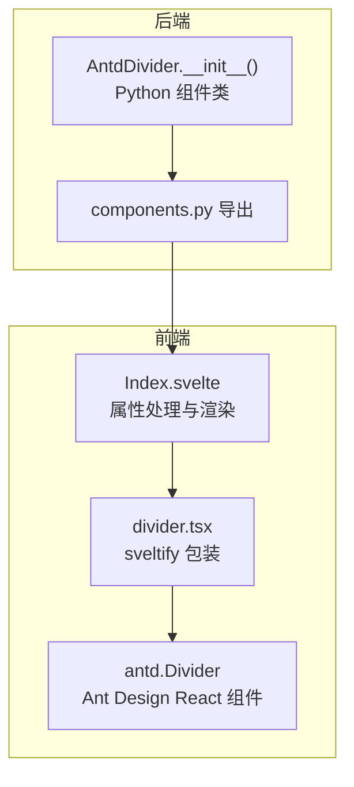
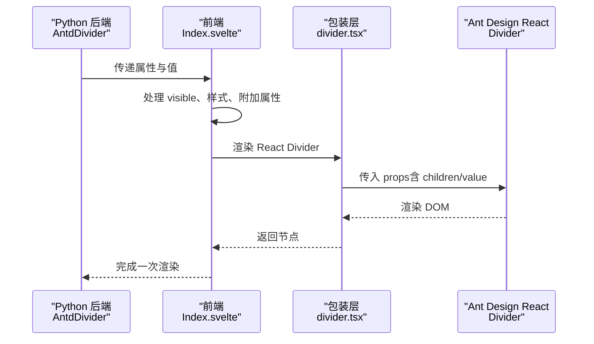
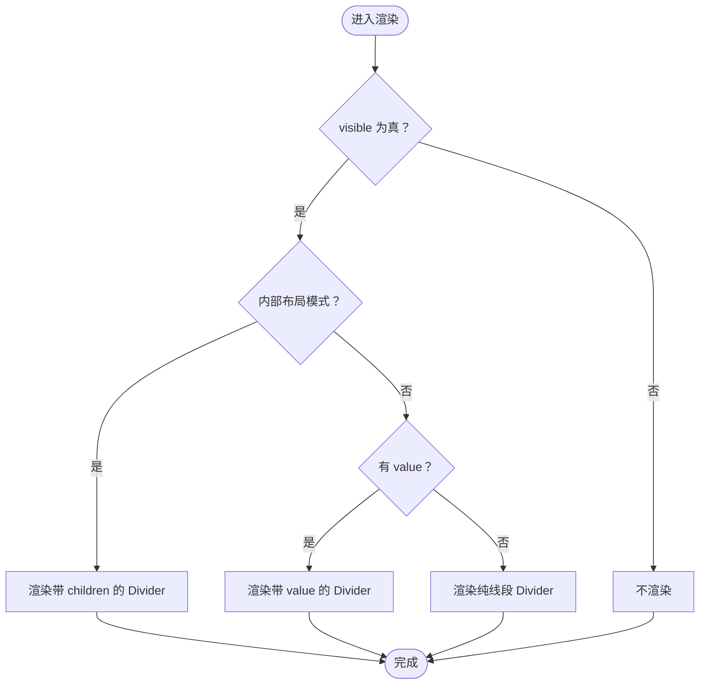
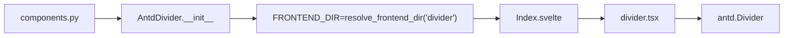

# Divider 分割线

<cite>
**本文引用的文件**
- [divider.tsx](file://frontend/antd/divider/divider.tsx)
- [Index.svelte](file://frontend/antd/divider/Index.svelte)
- [__init__.py](file://backend/modelscope_studio/components/antd/divider/__init__.py)
- [components.py](file://backend/modelscope_studio/components/antd/components.py)
- [README.md](file://docs/components/antd/divider/README.md)
- [README-zh_CN.md](file://docs/components/antd/divider/README-zh_CN.md)
- [basic.py](file://docs/components/antd/divider/demos/basic.py)
- [basic.py（表单）](file://docs/components/antd/form/demos/basic.py)
- [basic.py（布局）](file://docs/components/antd/layout/demos/basic.py)
</cite>

## 目录

1. [简介](#简介)
2. [项目结构](#项目结构)
3. [核心组件](#核心组件)
4. [架构总览](#架构总览)
5. [详细组件分析](#详细组件分析)
6. [依赖关系分析](#依赖关系分析)
7. [性能与可访问性](#性能与可访问性)
8. [使用场景与示例](#使用场景与示例)
9. [故障排查](#故障排查)
10. [结论](#结论)

## 简介

Divider 分割线用于在内容之间建立视觉分隔，帮助用户快速识别信息区块。该组件基于 Ant Design Divider 实现，支持水平与垂直两种方向、多种线条样式（实线、虚线、点线）、标题文本居中与左右对齐、纯文本风格等能力，并提供灵活的样式覆盖接口，便于在不同布局与主题下统一风格。

## 项目结构

Divider 组件由后端 Python 组件类与前端 Svelte 包装层组成，通过 Gradio 风格的属性传递到 Ant Design React 组件，最终渲染为浏览器可见的分割线。

图表来源

- [**init**.py:1-95](file://backend/modelscope_studio/components/antd/divider/__init__.py#L1-L95)
- [components.py:37-37](file://backend/modelscope_studio/components/antd/components.py#L37-L37)
- [Index.svelte:1-75](file://frontend/antd/divider/Index.svelte#L1-L75)
- [divider.tsx:1-15](file://frontend/antd/divider/divider.tsx#L1-L15)

章节来源

- [**init**.py:1-95](file://backend/modelscope_studio/components/antd/divider/__init__.py#L1-L95)
- [components.py:37-37](file://backend/modelscope_studio/components/antd/components.py#L37-L37)
- [Index.svelte:1-75](file://frontend/antd/divider/Index.svelte#L1-L75)
- [divider.tsx:1-15](file://frontend/antd/divider/divider.tsx#L1-L15)

## 核心组件

- 后端组件类：AntdDivider，负责定义属性、默认值、样式与渲染策略，并声明前端资源路径。
- 前端包装层：Index.svelte 负责属性合并、样式注入与条件渲染；divider.tsx 使用 sveltify 将 Ant Design React Divider 桥接为 Svelte 可用组件。

关键职责

- 属性映射：将 Python 层的 dashed、variant、orientation、orientation_margin、plain、type、size、value、elem_style、elem_classes 等映射到 React Divider。
- 渲染分支：根据是否传入 children 或 value 决定渲染带文本或纯线段的分割线。
- 样式注入：通过 elem_style 与 elem_classes 注入自定义样式与类名。

章节来源

- [**init**.py:21-76](file://backend/modelscope_studio/components/antd/divider/__init__.py#L21-L76)
- [Index.svelte:23-57](file://frontend/antd/divider/Index.svelte#L23-L57)
- [divider.tsx:5-12](file://frontend/antd/divider/divider.tsx#L5-L12)

## 架构总览

下图展示了从 Python 组件到浏览器渲染的调用链路与数据流。

图表来源

- [**init**.py:77-77](file://backend/modelscope_studio/components/antd/divider/__init__.py#L77-L77)
- [Index.svelte:60-74](file://frontend/antd/divider/Index.svelte#L60-L74)
- [divider.tsx:5-12](file://frontend/antd/divider/divider.tsx#L5-L12)

## 详细组件分析

### 属性与配置项

- 类型与方向
  - type: horizontal | vertical，控制水平或垂直分割线。
  - size: small | middle | large（仅水平有效），影响分割线整体尺寸。
- 线条样式
  - variant: dashed | dotted | solid，控制线型。
  - dashed: 布尔开关（兼容旧版），与 variant=dashed 等价。
- 文本与对齐
  - value 或插槽内容：作为分割线上的文本。
  - orientation: left | right | center | start | end，控制文本位置。
  - orientation_margin: 数字或字符串（带单位时按指定单位解析，无单位时按 px 解析），设置文本与边界的间距。
  - plain: 是否以“纯文本”风格显示文本。
- 样式与外观
  - elem_style: 注入内联样式（如 borderColor）。
  - elem_classes: 注入额外 CSS 类。
  - root_class_name: 根元素类名（由上层容器传入）。
  - additional_props: 其他透传属性。
- 布局与可见性
  - visible: 控制组件是否渲染。
  - as_item、\_internal、render 等：框架内部属性，影响渲染上下文。

章节来源

- [**init**.py:21-76](file://backend/modelscope_studio/components/antd/divider/__init__.py#L21-L76)
- [Index.svelte:13-57](file://frontend/antd/divider/Index.svelte#L13-L57)

### 渲染逻辑与分支

- 当存在子内容（children）或 value 时，渲染带文本的分割线。
- 否则渲染纯线段分割线。
- 支持在布局内部模式下直接渲染子节点。

图表来源

- [Index.svelte:60-74](file://frontend/antd/divider/Index.svelte#L60-L74)

### 文本居中与对齐

- 通过 orientation=center（或等价的 start/end）实现文本居中。
- 通过 orientation=left/right 或 orientation=start/end 并配合 orientation_margin 控制文本与边界的间距。
- plain=True 时，文本以更轻量的样式呈现，适合小字号或弱提示场景。

章节来源

- [**init**.py:27-32](file://backend/modelscope_studio/components/antd/divider/__init__.py#L27-L32)
- [basic.py:11-26](file://docs/components/antd/divider/demos/basic.py#L11-L26)

### 样式定制与颜色配置

- 通过 elem_style 注入 borderColor、borderWidth 等样式，实现颜色与粗细定制。
- 通过 elem_classes 注入自定义 CSS 类，满足复杂主题需求。
- variant 与 dashed 提供线型切换（实线/虚线/点线）。

章节来源

- [basic.py:11-26](file://docs/components/antd/divider/demos/basic.py#L11-L26)
- [**init**.py:26-32](file://backend/modelscope_studio/components/antd/divider/__init__.py#L26-L32)

### 响应式行为与屏幕适配

- 组件本身不内置媒体查询逻辑，但可通过 elem_style 与布局容器（如 Flex、Layout）实现响应式表现。
- 在水平布局中，size 可微调分割线的整体视觉尺寸；在垂直布局中，size 不生效。
- 在窄屏设备上，建议结合容器宽度与文本长度调整 orientation 与 margin，避免文本截断。

章节来源

- [**init**.py:32-34](file://backend/modelscope_studio/components/antd/divider/__init__.py#L32-L34)
- [basic.py（布局）:42-88](file://docs/components/antd/layout/demos/basic.py#L42-L88)

## 依赖关系分析

- 后端导出：AntdDivider 在 antd 组件集中被统一导出，便于按模块化方式使用。
- 前端桥接：Index.svelte 通过 importComponent 动态加载 divider.tsx，后者使用 sveltify 将 Ant Design React Divider 包装为 Svelte 组件。
- 属性透传：除框架保留字段外，其余属性均透传至 React Divider，确保与 Ant Design API 保持一致。

图表来源

- [components.py:37-37](file://backend/modelscope_studio/components/antd/components.py#L37-L37)
- [**init**.py:77-77](file://backend/modelscope_studio/components/antd/divider/__init__.py#L77-L77)
- [Index.svelte:10-10](file://frontend/antd/divider/Index.svelte#L10-L10)
- [divider.tsx:3-3](file://frontend/antd/divider/divider.tsx#L3-L3)

章节来源

- [components.py:37-37](file://backend/modelscope_studio/components/antd/components.py#L37-L37)
- [**init**.py:77-77](file://backend/modelscope_studio/components/antd/divider/__init__.py#L77-L77)
- [Index.svelte:10-10](file://frontend/antd/divider/Index.svelte#L10-L10)
- [divider.tsx:3-3](file://frontend/antd/divider/divider.tsx#L3-L3)

## 性能与可访问性

- 渲染开销：组件为轻量级纯展示，动态导入与条件渲染避免不必要的重绘。
- 可访问性：文本内容通过语义化标签渲染，建议为重要分割线提供简短描述（如 aria-label），提升屏幕阅读器体验。
- 主题一致性：通过 elem_style 与 elem_classes 统一样式，减少重复计算与样式冲突。

[本节为通用建议，无需特定文件引用]

## 使用场景与示例

### 表单分组

- 在表单中使用分割线对不同业务域进行分组，提升可读性。
- 示例参考：表单演示中展示了分割线在表单控件之间的分隔用法。

章节来源

- [basic.py（表单）:16-90](file://docs/components/antd/form/demos/basic.py#L16-L90)

### 内容区域划分

- 在文章或页面中使用水平分割线划分段落，配合 orientation=center 实现标题式分隔。
- 示例参考：基础演示中展示了不同 variant 与带文本的分割线用法。

章节来源

- [basic.py:5-29](file://docs/components/antd/divider/demos/basic.py#L5-L29)

### 导航菜单分隔

- 在导航列表中使用垂直分割线或水平分割线分隔菜单项，注意在窄屏下调整 orientation 与 margin，避免文本溢出。
- 建议：垂直分割线优先用于侧边导航，水平分割线用于顶部或底部导航。

[本小节为概念性说明，无需特定文件引用]

### 响应式布局中的表现

- 结合 Flex、Layout 等布局组件，在不同屏幕尺寸下调整分割线方向与文本长度。
- 建议：在移动端优先使用水平分割线与较短文本，必要时隐藏文本仅保留线段。

章节来源

- [basic.py（布局）:42-88](file://docs/components/antd/layout/demos/basic.py#L42-L88)

## 故障排查

- 文本未显示
  - 检查是否传入了 value 或子内容；若未传入，组件将渲染纯线段。
  - 确认 visible 为 True。
- 文本位置异常
  - orientation 设置为 left/right/start/end 时，需配合 orientation_margin 调整间距。
  - plain 会影响文本视觉权重，必要时移除以获得更强的分隔感。
- 线条样式无效
  - dashed 与 variant=dashed 等价；确保未同时设置冲突属性。
  - elem_style 中的 borderColor、borderWidth 等需与目标平台兼容。
- 垂直分割线尺寸无效
  - size 仅对 horizontal 生效；vertical 下请通过容器宽度与边框控制视觉尺寸。

章节来源

- [Index.svelte:60-74](file://frontend/antd/divider/Index.svelte#L60-L74)
- [**init**.py:26-34](file://backend/modelscope_studio/components/antd/divider/__init__.py#L26-L34)

## 结论

Divider 分割线组件以简洁的 API 提供了丰富的视觉表达能力，既能满足基础的线段分隔，也能胜任带文本的标题式分隔。通过类型、线型、对齐与样式等多维配置，可在不同布局与主题中稳定地实现信息层级与空间分隔。建议在实际项目中结合布局容器与响应式策略，合理选择 orientation 与 size，并通过 elem_style/elem_classes 实现品牌化与主题化定制。
