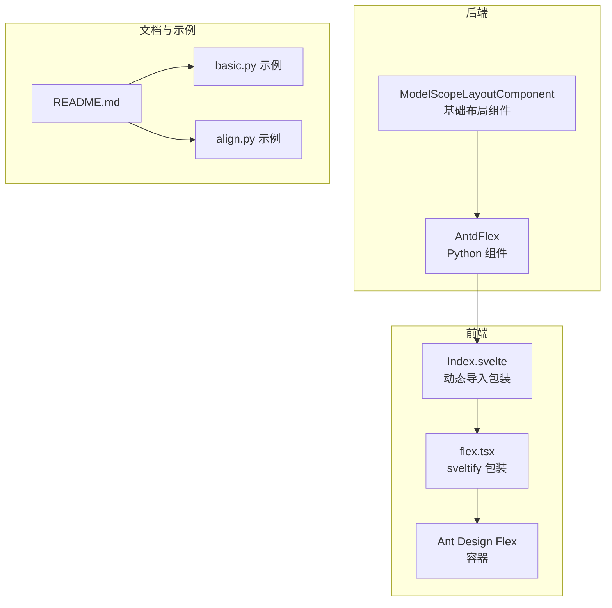
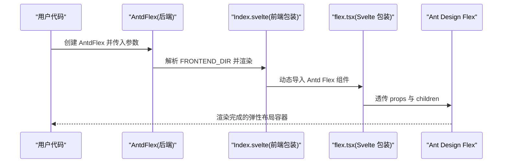
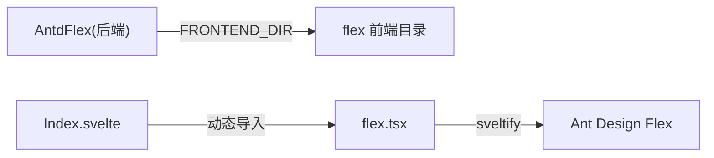

# Flex 弹性布局

<cite>
**本文引用的文件**
- [frontend/antd/flex/flex.tsx](file://frontend/antd/flex/flex.tsx)
- [frontend/antd/flex/Index.svelte](file://frontend/antd/flex/Index.svelte)
- [backend/modelscope_studio/components/antd/flex/__init__.py](file://backend/modelscope_studio/components/antd/flex/__init__.py)
- [docs/components/antd/flex/README.md](file://docs/components/antd/flex/README.md)
- [docs/components/antd/flex/demos/basic.py](file://docs/components/antd/flex/demos/basic.py)
- [docs/components/antd/flex/demos/align.py](file://docs/components/antd/flex/demos/align.py)
- [backend/modelscope_studio/utils/dev/component.py](file://backend/modelscope_studio/utils/dev/component.py)
</cite>

## 目录

1. [简介](#简介)
2. [项目结构](#项目结构)
3. [核心组件](#核心组件)
4. [架构总览](#架构总览)
5. [详细组件分析](#详细组件分析)
6. [依赖分析](#依赖分析)
7. [性能考虑](#性能考虑)
8. [故障排查指南](#故障排查指南)
9. [结论](#结论)
10. [附录](#附录)

## 简介

本篇文档围绕 Flex 弹性布局组件展开，系统阐述其在模型空间（ModelScope Studio）中的实现与使用方式。Flex 组件基于 Ant Design 的 Flex 容器能力，提供主轴与交叉轴对齐、排列方向、换行控制、间距设置等能力，并通过 Gradio 生态进行前后端桥接。文档将从概念到实践，覆盖以下主题：

- 核心概念：主轴/交叉轴、justify-content、align-items、align-content 对应关系
- 关键属性：orientation/vertical、wrap、justify、align、flex、gap
- 实战场景：按钮组对齐、内容区域分布、响应式卡片布局
- 复杂嵌套布局与最佳实践
- 兼容性与跨浏览器注意事项

## 项目结构

Flex 组件在仓库中采用“后端 Python 组件 + 前端 Svelte 包装 + Ant Design Flex 容器”的分层设计：

- 后端：Python 类负责参数校验、渲染策略与前端资源定位
- 前端：Svelte 组件负责动态导入、属性透传与样式拼接
- 依赖：通过 svelte-preprocess-react 将 React/Ant Design 组件桥接到 Svelte

图表来源

- [backend/modelscope_studio/components/antd/flex/**init**.py:8-98](file://backend/modelscope_studio/components/antd/flex/__init__.py#L8-L98)
- [frontend/antd/flex/Index.svelte:10-61](file://frontend/antd/flex/Index.svelte#L10-L61)
- [frontend/antd/flex/flex.tsx:1-11](file://frontend/antd/flex/flex.tsx#L1-L11)
- [docs/components/antd/flex/README.md:1-9](file://docs/components/antd/flex/README.md#L1-L9)

章节来源

- [backend/modelscope_studio/components/antd/flex/**init**.py:8-98](file://backend/modelscope_studio/components/antd/flex/__init__.py#L8-L98)
- [frontend/antd/flex/Index.svelte:1-62](file://frontend/antd/flex/Index.svelte#L1-L62)
- [frontend/antd/flex/flex.tsx:1-11](file://frontend/antd/flex/flex.tsx#L1-L11)
- [docs/components/antd/flex/README.md:1-9](file://docs/components/antd/flex/README.md#L1-L9)

## 核心组件

- AntdFlex（后端）
  - 负责接收并校验所有 Flex 相关参数（方向、换行、主轴/交叉轴对齐、flex 缩写、间距等），并将这些参数映射为前端可消费的 props。
  - 提供 FRONTEND_DIR 指向前端 flex 目录，确保运行时正确加载前端组件。
  - 遵循 ModelScopeLayoutComponent 的布局语义，参与应用级布局上下文。

- Index.svelte（前端包装）
  - 使用 importComponent 动态导入前端 flex 组件，避免首屏阻塞。
  - 通过 getProps/processProps 获取并处理组件属性，支持额外属性透传与可见性控制。
  - 将 elem_id、elem_classes、elem_style 等通用属性注入到最终渲染节点。

- flex.tsx（Svelte 包装）
  - 使用 sveltify 将 Ant Design 的 Flex 容器转换为 Svelte 可用的组件，直接透传 props 与 children。

- 文档与示例
  - README.md 提供基本说明与示例占位
  - basic.py 与 align.py 展示了垂直/水平方向切换、主轴/交叉轴对齐的交互式示例

章节来源

- [backend/modelscope_studio/components/antd/flex/**init**.py:21-79](file://backend/modelscope_studio/components/antd/flex/__init__.py#L21-L79)
- [frontend/antd/flex/Index.svelte:13-42](file://frontend/antd/flex/Index.svelte#L13-L42)
- [frontend/antd/flex/flex.tsx:4-8](file://frontend/antd/flex/flex.tsx#L4-L8)
- [docs/components/antd/flex/README.md:1-9](file://docs/components/antd/flex/README.md#L1-L9)
- [docs/components/antd/flex/demos/basic.py:8-23](file://docs/components/antd/flex/demos/basic.py#L8-L23)
- [docs/components/antd/flex/demos/align.py:8-41](file://docs/components/antd/flex/demos/align.py#L8-L41)

## 架构总览

下图展示了从用户代码到最终渲染的调用链路，体现 Flex 组件在前后端之间的协作关系：

图表来源

- [backend/modelscope_studio/components/antd/flex/**init**.py:81-81](file://backend/modelscope_studio/components/antd/flex/__init__.py#L81-L81)
- [frontend/antd/flex/Index.svelte:10-10](file://frontend/antd/flex/Index.svelte#L10-L10)
- [frontend/antd/flex/flex.tsx:4-8](file://frontend/antd/flex/flex.tsx#L4-L8)

## 详细组件分析

### 后端类：AntdFlex 参数与行为

- 关键参数
  - orientation/vertical：控制排列方向（水平/垂直）
  - wrap：控制单行或多行显示
  - justify：主轴对齐（start/end/center/flex-start/flex-end/space-\* 等）
  - align：交叉轴对齐（start/end/center/flex-start/flex-end/baseline/stretch 等）
  - flex：flex 缩写属性
  - gap：元素间距（small/middle/large 或数值）
  - component/root_class_name/class_names/styles/as_item/\_internal：通用属性与样式注入
  - 可见性与 DOM 注入：elem_id/elem_classes/elem_style/visible/render

- 行为特征
  - skip_api=True：不暴露为标准 API 组件，适合内部布局使用
  - FRONTEND_DIR 指向前端 flex 目录，保证运行时组件可用
  - 继承自 ModelScopeLayoutComponent，具备布局上下文能力

章节来源

- [backend/modelscope_studio/components/antd/flex/**init**.py:21-79](file://backend/modelscope_studio/components/antd/flex/__init__.py#L21-L79)
- [backend/modelscope_studio/utils/dev/component.py:11-52](file://backend/modelscope_studio/utils/dev/component.py#L11-L52)

### 前端包装：Index.svelte

- 动态导入：通过 importComponent 延迟加载 flex.tsx，减少首屏开销
- 属性处理：getProps/processProps 提取并合并组件属性、附加属性、可见性与 DOM 注入
- 样式拼接：elem_classes 与固定类名组合，elem_id/elem_style 注入到根节点
- 条件渲染：根据 visible 控制是否渲染

章节来源

- [frontend/antd/flex/Index.svelte:13-42](file://frontend/antd/flex/Index.svelte#L13-L42)
- [frontend/antd/flex/Index.svelte:48-61](file://frontend/antd/flex/Index.svelte#L48-L61)

### Svelte 包装：flex.tsx

- 使用 sveltify 将 Ant Design Flex 容器桥接为 Svelte 组件
- 直接透传 props 与 children，保持与 Antd Flex 的一致语义

章节来源

- [frontend/antd/flex/flex.tsx:4-8](file://frontend/antd/flex/flex.tsx#L4-L8)

### 示例：基础与对齐

- basic.py：展示垂直/水平方向切换与间距设置
- align.py：展示主轴/交叉轴对齐选项与交互更新

章节来源

- [docs/components/antd/flex/demos/basic.py:8-23](file://docs/components/antd/flex/demos/basic.py#L8-L23)
- [docs/components/antd/flex/demos/align.py:8-41](file://docs/components/antd/flex/demos/align.py#L8-L41)

### 关键属性与 CSS Flex 对应关系

- 主轴与交叉轴
  - 主轴：由排列方向决定（horizontal/vertical 对应 row/column）
  - 交叉轴：垂直于主轴的方向
- 对齐关系
  - justify-content ↔ justify（主轴对齐）
  - align-items ↔ align（交叉轴对齐）
  - align-content ↔ 多行时的交叉轴分布（wrap 为 wrap/ wrap-reverse 时生效）

章节来源

- [backend/modelscope_studio/components/antd/flex/**init**.py:52-58](file://backend/modelscope_studio/components/antd/flex/__init__.py#L52-L58)

### 实际应用场景

- 按钮组对齐：使用 justify/align 快速实现水平或垂直居中、两端对齐等
- 内容区域分布：利用 gap 与 wrap 实现响应式网格与换行
- 响应式卡片布局：结合 orientation/vertical 与 justify/align 实现卡片流式排列与对齐

章节来源

- [docs/components/antd/flex/demos/basic.py:8-23](file://docs/components/antd/flex/demos/basic.py#L8-L23)
- [docs/components/antd/flex/demos/align.py:8-41](file://docs/components/antd/flex/demos/align.py#L8-L41)

### 复杂嵌套布局与最佳实践

- 嵌套策略
  - 外层容器设置主轴对齐与换行，内层容器聚焦交叉轴对齐
  - 使用 gap 控制层级间间距，避免硬编码 margin/padding
- 最佳实践
  - 优先使用 vertical/orientation 控制方向，再用 justify/align 微调
  - 在多行场景下，合理选择 wrap 与 align-content 的组合
  - 结合交互组件（如 Segmented）动态切换对齐方式，提升可探索性

章节来源

- [docs/components/antd/flex/demos/align.py:8-41](file://docs/components/antd/flex/demos/align.py#L8-L41)

## 依赖分析

- 组件耦合
  - AntdFlex 仅依赖前端 flex 目录，通过 FRONTEND_DIR 解析路径，降低耦合度
  - Index.svelte 与 flex.tsx 之间为松散耦合，前者负责运行时加载，后者负责桥接
- 外部依赖
  - Ant Design Flex：提供核心布局能力
  - svelte-preprocess-react：提供 sveltify 与动态导入工具
- 可能的循环依赖
  - 当前结构无明显循环依赖；若后续扩展，需避免后端组件相互引用

图表来源

- [backend/modelscope_studio/components/antd/flex/**init**.py:81-81](file://backend/modelscope_studio/components/antd/flex/__init__.py#L81-L81)
- [frontend/antd/flex/Index.svelte:10-10](file://frontend/antd/flex/Index.svelte#L10-L10)
- [frontend/antd/flex/flex.tsx:4-8](file://frontend/antd/flex/flex.tsx#L4-L8)

章节来源

- [backend/modelscope_studio/components/antd/flex/**init**.py:81-81](file://backend/modelscope_studio/components/antd/flex/__init__.py#L81-L81)
- [frontend/antd/flex/Index.svelte:10-10](file://frontend/antd/flex/Index.svelte#L10-L10)
- [frontend/antd/flex/flex.tsx:4-8](file://frontend/antd/flex/flex.tsx#L4-L8)

## 性能考虑

- 动态导入优化：Index.svelte 使用 importComponent 延迟加载，减少首屏体积与渲染时间
- 属性透传最小化：仅传递必要属性，避免冗余计算与重排
- 间距与换行：合理使用 gap 与 wrap，避免过度嵌套导致的复杂布局回流

## 故障排查指南

- 组件不可见
  - 检查 visible 是否为 true
  - 确认 elem_style/ elem_classes 是否导致溢出或隐藏
- 方向与对齐异常
  - 确认 orientation/vertical 与 justify/align 的组合是否符合预期
  - 在多行场景下检查 wrap 与 align-content 的影响
- 运行时加载失败
  - 确认 FRONTEND_DIR 指向正确且前端包已构建
  - 查看动态导入是否抛错（Index.svelte 中的 {#await} 分支）

章节来源

- [frontend/antd/flex/Index.svelte:48-61](file://frontend/antd/flex/Index.svelte#L48-L61)
- [backend/modelscope_studio/components/antd/flex/**init**.py:81-81](file://backend/modelscope_studio/components/antd/flex/__init__.py#L81-L81)

## 结论

Flex 弹性布局组件在模型空间中以“后端参数 + 前端包装 + Antd Flex 容器”的方式实现，既保持了与 CSS Flex 的语义一致性，又提供了良好的可配置性与可维护性。通过 orientation/vertical、wrap、justify、align、flex、gap 等关键属性，能够高效覆盖按钮组对齐、内容区域分布、响应式卡片布局等常见场景；配合动态导入与属性透传机制，兼顾性能与灵活性。

## 附录

- 示例入口
  - 基础示例：[basic.py:1-26](file://docs/components/antd/flex/demos/basic.py#L1-L26)
  - 对齐示例：[align.py:1-45](file://docs/components/antd/flex/demos/align.py#L1-L45)
- 文档说明：[README.md:1-9](file://docs/components/antd/flex/README.md#L1-L9)
