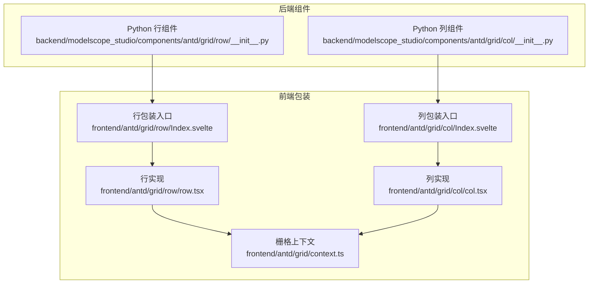
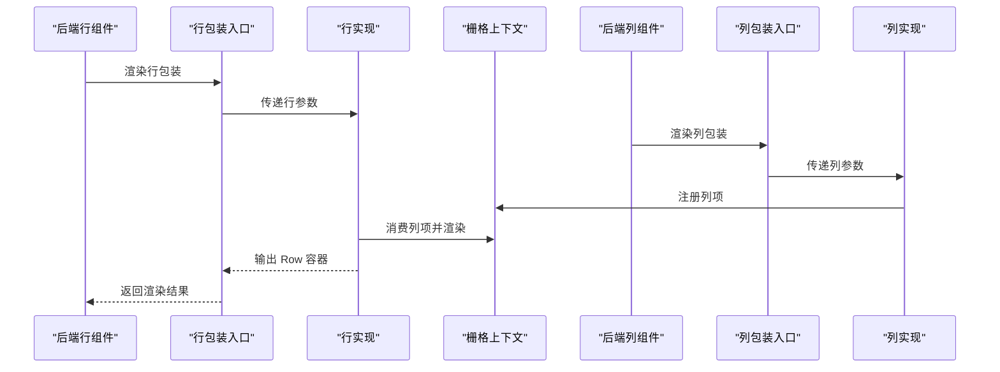
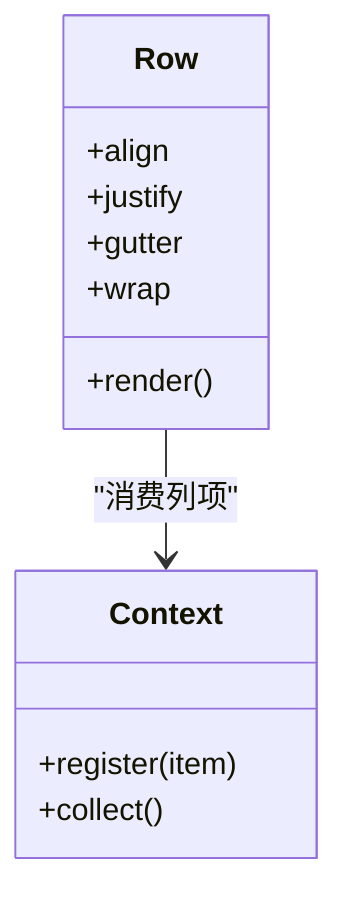
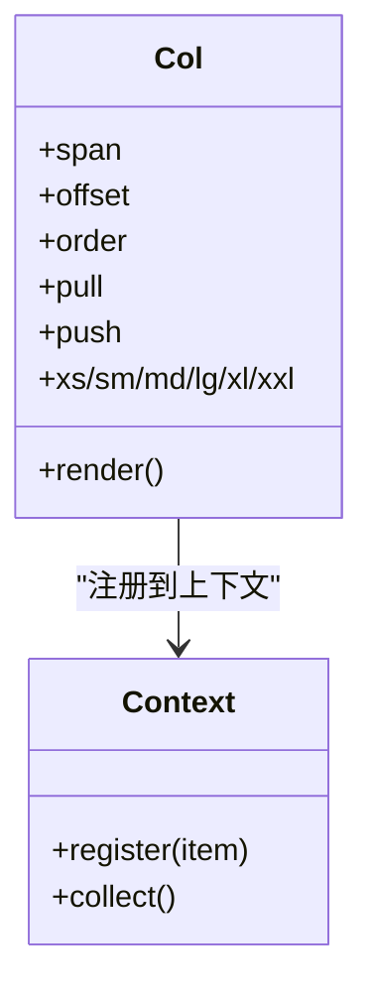
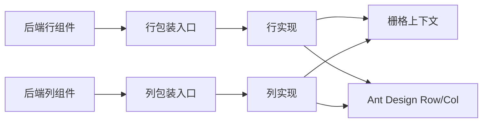

# Grid 栅格

<cite>
**本文引用的文件**
- [frontend/antd/grid/row/Index.svelte](file://frontend/antd/grid/row/Index.svelte)
- [frontend/antd/grid/row/row.tsx](file://frontend/antd/grid/row/row.tsx)
- [frontend/antd/grid/col/Index.svelte](file://frontend/antd/grid/col/Index.svelte)
- [frontend/antd/grid/col/col.tsx](file://frontend/antd/grid/col/col.tsx)
- [frontend/antd/grid/context.ts](file://frontend/antd/grid/context.ts)
- [backend/modelscope_studio/components/antd/grid/row/__init__.py](file://backend/modelscope_studio/components/antd/grid/row/__init__.py)
- [backend/modelscope_studio/components/antd/grid/col/__init__.py](file://backend/modelscope_studio/components/antd/grid/col/__init__.py)
- [docs/components/antd/grid/README.md](file://docs/components/antd/grid/README.md)
- [docs/components/antd/grid/demos/basic.py](file://docs/components/antd/grid/demos/basic.py)
- [docs/components/antd/grid/demos/playground.py](file://docs/components/antd/grid/demos/playground.py)
</cite>

## 目录

1. [简介](#简介)
2. [项目结构](#项目结构)
3. [核心组件](#核心组件)
4. [架构总览](#架构总览)
5. [详细组件分析](#详细组件分析)
6. [依赖关系分析](#依赖关系分析)
7. [性能考虑](#性能考虑)
8. [故障排查指南](#故障排查指南)
9. [结论](#结论)
10. [附录](#附录)

## 简介

本篇文档围绕 Grid 栅格组件展开，系统性阐述其设计原理、24 栅格体系与响应式断点配置，并深入讲解 Row 与 Col 的使用方法（含栅格偏移、排序、嵌套规则、对齐方式等），提供仪表板布局、产品展示页面、表单布局等常见场景的应用思路，同时给出响应式行为说明与性能优化建议。

## 项目结构

Grid 组件由前端 Svelte 包装层与后端 Python 组件层协同构成：前端负责渲染与上下文传递，后端负责参数透传与生命周期控制；文档侧提供示例与说明。

**图表来源**

- [frontend/antd/grid/row/Index.svelte:1-61](file://frontend/antd/grid/row/Index.svelte#L1-L61)
- [frontend/antd/grid/row/row.tsx:1-34](file://frontend/antd/grid/row/row.tsx#L1-L34)
- [frontend/antd/grid/col/Index.svelte:1-77](file://frontend/antd/grid/col/Index.svelte#L1-L77)
- [frontend/antd/grid/col/col.tsx:1-14](file://frontend/antd/grid/col/col.tsx#L1-L14)
- [frontend/antd/grid/context.ts:1-7](file://frontend/antd/grid/context.ts#L1-L7)
- [backend/modelscope_studio/components/antd/grid/row/**init**.py:1-94](file://backend/modelscope_studio/components/antd/grid/row/__init__.py#L1-L94)
- [backend/modelscope_studio/components/antd/grid/col/**init**.py:1-114](file://backend/modelscope_studio/components/antd/grid/col/__init__.py#L1-L114)

**章节来源**

- [frontend/antd/grid/row/Index.svelte:1-61](file://frontend/antd/grid/row/Index.svelte#L1-L61)
- [frontend/antd/grid/col/Index.svelte:1-77](file://frontend/antd/grid/col/Index.svelte#L1-L77)
- [frontend/antd/grid/row/row.tsx:1-34](file://frontend/antd/grid/row/row.tsx#L1-L34)
- [frontend/antd/grid/col/col.tsx:1-14](file://frontend/antd/grid/col/col.tsx#L1-L14)
- [frontend/antd/grid/context.ts:1-7](file://frontend/antd/grid/context.ts#L1-L7)
- [backend/modelscope_studio/components/antd/grid/row/**init**.py:1-94](file://backend/modelscope_studio/components/antd/grid/row/__init__.py#L1-L94)
- [backend/modelscope_studio/components/antd/grid/col/**init**.py:1-114](file://backend/modelscope_studio/components/antd/grid/col/__init__.py#L1-L114)

## 核心组件

- 行组件（Row）
  - 支持对齐方式、间距、换行等属性，用于承载多个列并管理布局方向与分布。
  - 关键参数：align、justify、gutter、wrap 等。
- 列组件（Col）
  - 支持跨度、偏移、排序、左右推动、响应式断点等，用于具体的内容区块。
  - 关键参数：span、offset、order、pull、push、xs/sm/md/lg/xl/xxl 等。

上述参数在后端组件中均有明确声明与默认值，便于在 Python 层直接使用。

**章节来源**

- [backend/modelscope_studio/components/antd/grid/row/**init**.py:30-76](file://backend/modelscope_studio/components/antd/grid/row/__init__.py#L30-L76)
- [backend/modelscope_studio/components/antd/grid/col/**init**.py:30-95](file://backend/modelscope_studio/components/antd/grid/col/__init__.py#L30-L95)

## 架构总览

Grid 的运行时流程如下：后端 Python 组件接收参数并渲染前端包装组件；前端包装组件再调用 Ant Design 的 Row/Col 实现，并通过上下文机制收集 Col 子项，最终组合为标准栅格布局。

**图表来源**

- [frontend/antd/grid/row/Index.svelte:10-44](file://frontend/antd/grid/row/Index.svelte#L10-L44)
- [frontend/antd/grid/row/row.tsx:7-31](file://frontend/antd/grid/row/row.tsx#L7-L31)
- [frontend/antd/grid/col/Index.svelte:10-47](file://frontend/antd/grid/col/Index.svelte#L10-L47)
- [frontend/antd/grid/col/col.tsx:7-11](file://frontend/antd/grid/col/col.tsx#L7-L11)
- [frontend/antd/grid/context.ts:3-4](file://frontend/antd/grid/context.ts#L3-L4)

## 详细组件分析

### 行组件（Row）分析

- 设计要点
  - 基于 Ant Design Row，支持水平排列（justify）、垂直对齐（align）、间距（gutter）、自动换行（wrap）等。
  - 通过上下文收集子 Col 并统一渲染，避免直接在 Row 中写死子元素。
- 使用建议
  - 在复杂布局中优先设置 gutter，以保证跨断点的一致性。
  - 合理使用 wrap，避免长列表导致的横向滚动问题。
- 参数要点
  - align：top/middle/bottom/stretch
  - justify：start/end/center/space-between/space-around/space-evenly
  - gutter：数字或对象（含断点）或数组 [水平, 垂直]
  - wrap：布尔值

**图表来源**

- [frontend/antd/grid/row/row.tsx:7-31](file://frontend/antd/grid/row/row.tsx#L7-L31)
- [frontend/antd/grid/context.ts:3-4](file://frontend/antd/grid/context.ts#L3-L4)

**章节来源**

- [frontend/antd/grid/row/Index.svelte:12-42](file://frontend/antd/grid/row/Index.svelte#L12-L42)
- [frontend/antd/grid/row/row.tsx:7-31](file://frontend/antd/grid/row/row.tsx#L7-L31)
- [backend/modelscope_studio/components/antd/grid/row/**init**.py:30-76](file://backend/modelscope_studio/components/antd/grid/row/__init__.py#L30-L76)

### 列组件（Col）分析

- 设计要点
  - 基于 Ant Design Col，支持 span、offset、order、pull、push 等基础能力。
  - 支持响应式断点 xs/sm/md/lg/xl/xxl，可分别指定 span 或完整属性对象。
  - 通过上下文注册自身，供 Row 统一调度。
- 使用建议
  - 合理规划每行总 span 不超过 24，超出则自动换行。
  - 使用 offset/push/pull 实现视觉偏移与重排，但需注意可访问性与语义化。
  - 在移动端优先使用 xs，桌面端使用更大断点，确保不同设备体验一致。
- 参数要点
  - span：占位栅格数（0 对应不显示）
  - offset/push/pull：偏移/左移/右移
  - order：排序
  - xs/sm/md/lg/xl/xxl：断点级配置

**图表来源**

- [frontend/antd/grid/col/col.tsx:7-11](file://frontend/antd/grid/col/col.tsx#L7-L11)
- [frontend/antd/grid/context.ts:3-4](file://frontend/antd/grid/context.ts#L3-L4)
- [backend/modelscope_studio/components/antd/grid/col/**init**.py:30-95](file://backend/modelscope_studio/components/antd/grid/col/__init__.py#L30-L95)

**章节来源**

- [frontend/antd/grid/col/Index.svelte:23-47](file://frontend/antd/grid/col/Index.svelte#L23-L47)
- [frontend/antd/grid/col/col.tsx:7-11](file://frontend/antd/grid/col/col.tsx#L7-L11)
- [backend/modelscope_studio/components/antd/grid/col/**init**.py:30-95](file://backend/modelscope_studio/components/antd/grid/col/__init__.py#L30-L95)

### 响应式断点与行为

- 断点定义
  - xs：屏幕宽度小于 576px，且为默认断点
  - sm：≥ 576px
  - md：≥ 768px
  - lg：≥ 992px
  - xl：≥ 1200px
  - xxl：≥ 1600px
- 配置方式
  - 可直接传入整数 span，也可传入对象，按断点分别配置 span 与其他属性（如 offset、order 等）。
- 行为说明
  - 当一行内所有列的 span 总和超过 24 时，溢出列会整体换行。
  - gutter 支持断点级配置，可实现不同屏幕下的差异化间距。

**章节来源**

- [backend/modelscope_studio/components/antd/grid/col/**init**.py:58-72](file://backend/modelscope_studio/components/antd/grid/col/__init__.py#L58-L72)
- [backend/modelscope_studio/components/antd/grid/row/**init**.py:54-60](file://backend/modelscope_studio/components/antd/grid/row/__init__.py#L54-L60)

### 嵌套规则与对齐方式

- 嵌套规则
  - Row 内仅放置 Col；Col 内可继续放置 Row，形成嵌套栅格。
  - 注意嵌套层级不要过深，避免样式与可维护性问题。
- 对齐方式
  - Row 提供水平（justify）与垂直（align）对齐，结合 gutter 实现稳定布局。
  - 垂直对齐支持 stretch，使列高度自适应容器高度。

**章节来源**

- [backend/modelscope_studio/components/antd/grid/row/**init**.py:34-40](file://backend/modelscope_studio/components/antd/grid/row/__init__.py#L34-L40)
- [backend/modelscope_studio/components/antd/grid/row/**init**.py:56-59](file://backend/modelscope_studio/components/antd/grid/row/__init__.py#L56-L59)

### 实际应用案例

- 仪表板布局
  - 使用 Row 的 gutter 与 wrap 控制卡片间距与换行；Col 的 span 与响应式断点适配多屏。
  - 在窄屏下减少列数，宽屏下增加列数，保持信息密度与可读性。
- 产品展示页面
  - 头图区域使用单列铺满；商品列表使用等分列；侧栏使用固定 span，主内容区自适应。
  - 通过 xs/sm/md/lg/xl/xxl 分别配置不同断点下的列数与间距。
- 表单布局
  - 小型表单项使用较小 span，复合字段使用较大 span；在 xs 下合并为单列，提升移动端可用性。
  - 使用 offset 进行微调，但避免过度偏移影响阅读顺序。

（以上为通用布局策略说明，具体实现请参考示例）

**章节来源**

- [docs/components/antd/grid/README.md:1-9](file://docs/components/antd/grid/README.md#L1-L9)
- [docs/components/antd/grid/demos/basic.py:7-24](file://docs/components/antd/grid/demos/basic.py#L7-L24)
- [docs/components/antd/grid/demos/playground.py:17-90](file://docs/components/antd/grid/demos/playground.py#L17-L90)

## 依赖关系分析

- 组件耦合
  - Col 通过上下文注册自身，Row 从上下文中收集并渲染，降低直接耦合度。
  - 前端包装组件仅负责参数透传与渲染，逻辑集中在 Row/Col 实现与上下文中。
- 外部依赖
  - 依赖 Ant Design 的 Row/Col 组件，复用成熟的栅格系统。
  - 使用 Svelte Preprocess React 工具链进行桥接与插槽处理。

**图表来源**

- [frontend/antd/grid/row/Index.svelte:10-18](file://frontend/antd/grid/row/Index.svelte#L10-L18)
- [frontend/antd/grid/col/Index.svelte:10-21](file://frontend/antd/grid/col/Index.svelte#L10-L21)
- [frontend/antd/grid/row/row.tsx:3-5](file://frontend/antd/grid/row/row.tsx#L3-L5)
- [frontend/antd/grid/col/col.tsx:3-5](file://frontend/antd/grid/col/col.tsx#L3-L5)
- [frontend/antd/grid/context.ts:3-4](file://frontend/antd/grid/context.ts#L3-L4)

**章节来源**

- [frontend/antd/grid/row/Index.svelte:10-44](file://frontend/antd/grid/row/Index.svelte#L10-L44)
- [frontend/antd/grid/col/Index.svelte:10-47](file://frontend/antd/grid/col/Index.svelte#L10-L47)
- [frontend/antd/grid/row/row.tsx:3-5](file://frontend/antd/grid/row/row.tsx#L3-L5)
- [frontend/antd/grid/col/col.tsx:3-5](file://frontend/antd/grid/col/col.tsx#L3-L5)
- [frontend/antd/grid/context.ts:3-4](file://frontend/antd/grid/context.ts#L3-L4)

## 性能考虑

- 减少不必要的重渲染
  - 合理拆分子组件，避免整行频繁更新；对 Col 的响应式断点配置尽量静态化，减少动态计算。
- 控制嵌套层级
  - 嵌套越深，样式计算与布局成本越高；建议不超过三层嵌套。
- 合理使用 gutter
  - 大量小间距可能引发频繁回流；可统一在 Row 上设置 gutter，避免在每个 Col 单独设置。
- 选择合适的断点
  - 仅在必要断点启用响应式配置，避免过多条件分支导致的渲染开销。
- 使用 span 与 wrap
  - 通过合理的 span 分配与 wrap，减少复杂计算与额外的 DOM 结构。

（本节为通用优化建议，不涉及特定文件分析）

## 故障排查指南

- 列未显示或错位
  - 检查每行总 span 是否超过 24；若超过，溢出列会整体换行。
  - 检查 xs/sm/md/lg/xl/xxl 断点配置是否冲突。
- 偏移/排序无效
  - 确认 Col 的 offset/push/pull/order 是否在正确断点下生效。
  - 确保 Row 的 justify/align 未覆盖预期的视觉效果。
- 响应式不生效
  - 确认断点参数类型为对象时，包含正确的属性（如 span、offset 等）。
  - 确认父级 Row 的 gutter/justify/align 未与断点配置产生冲突。
- 性能问题
  - 检查是否存在深层嵌套与大量动态计算；适当简化布局结构。
  - 避免在 Col 上重复设置相同的间距与样式，统一在 Row 上配置。

**章节来源**

- [backend/modelscope_studio/components/antd/grid/col/**init**.py:58-72](file://backend/modelscope_studio/components/antd/grid/col/__init__.py#L58-L72)
- [backend/modelscope_studio/components/antd/grid/row/**init**.py:54-60](file://backend/modelscope_studio/components/antd/grid/row/__init__.py#L54-L60)

## 结论

Grid 栅格组件通过后端参数与前端包装的协作，提供了与 Ant Design 一致的栅格能力，并在此基础上增强了响应式断点与上下文收集机制。合理使用 Row/Col 的对齐、间距、嵌套与断点配置，可在多场景下快速构建稳定、可维护的布局方案。

## 附录

- 示例入口
  - 基础示例：[docs/components/antd/grid/demos/basic.py:7-24](file://docs/components/antd/grid/demos/basic.py#L7-L24)
  - 演练场示例：[docs/components/antd/grid/demos/playground.py:17-90](file://docs/components/antd/grid/demos/playground.py#L17-L90)
- 文档说明：[docs/components/antd/grid/README.md:1-9](file://docs/components/antd/grid/README.md#L1-L9)
