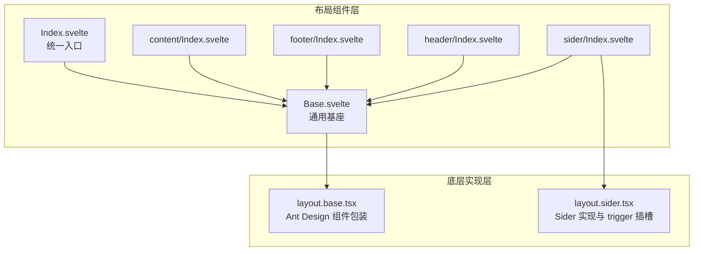
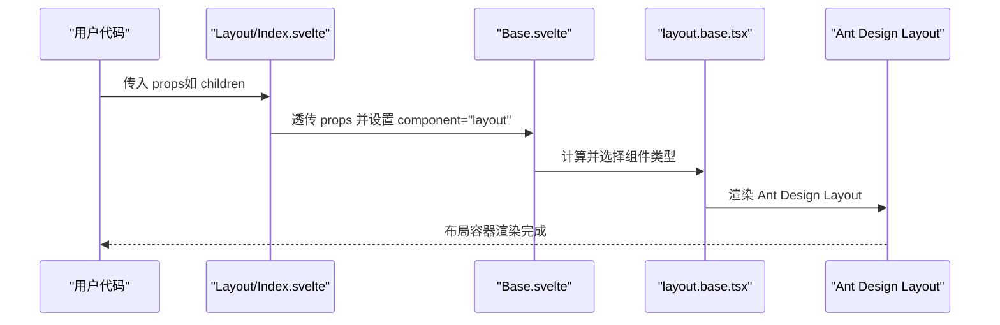
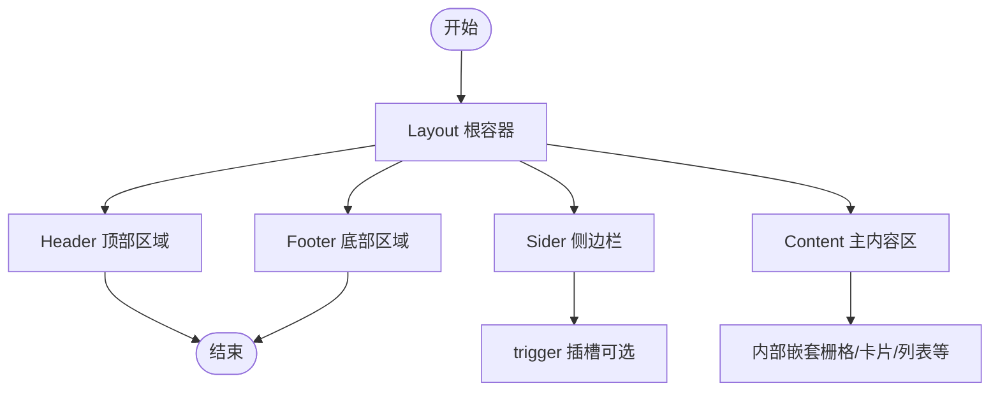
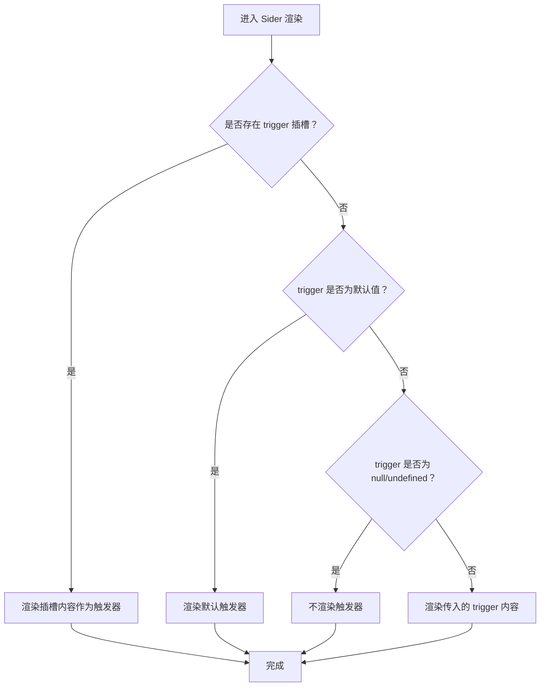
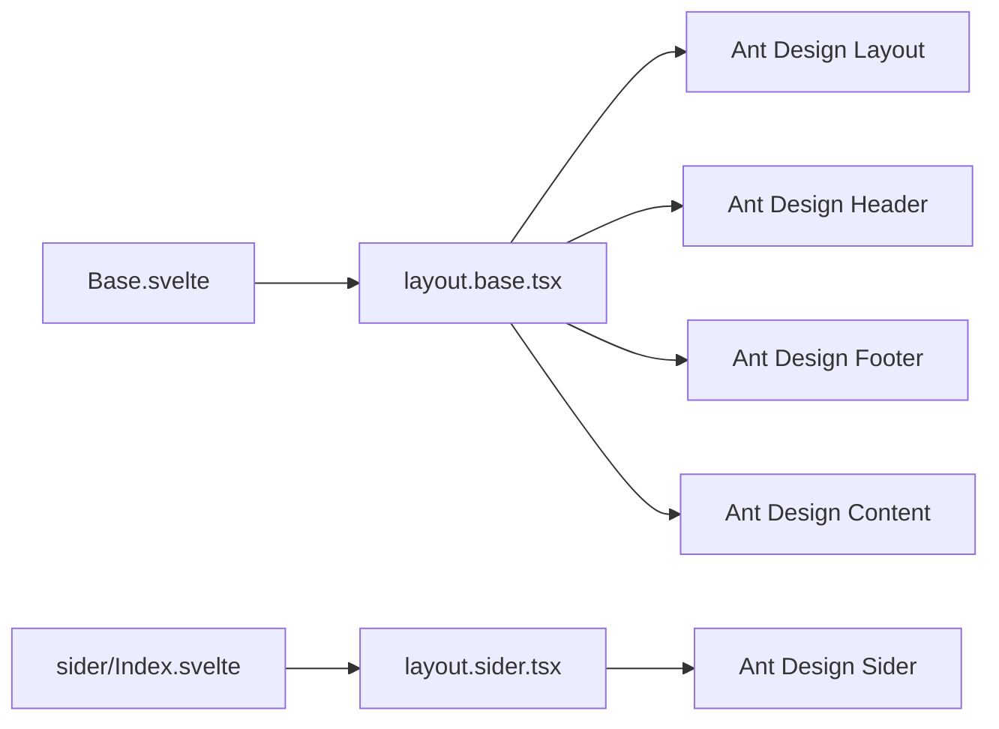

# Layout 布局

<cite>
**本文引用的文件**
- [frontend/antd/layout/Index.svelte](file://frontend/antd/layout/Index.svelte)
- [frontend/antd/layout/Base.svelte](file://frontend/antd/layout/Base.svelte)
- [frontend/antd/layout/layout.base.tsx](file://frontend/antd/layout/layout.base.tsx)
- [frontend/antd/layout/content/Index.svelte](file://frontend/antd/layout/content/Index.svelte)
- [frontend/antd/layout/footer/Index.svelte](file://frontend/antd/layout/footer/Index.svelte)
- [frontend/antd/layout/header/Index.svelte](file://frontend/antd/layout/header/Index.svelte)
- [frontend/antd/layout/sider/Index.svelte](file://frontend/antd/layout/sider/Index.svelte)
- [frontend/antd/layout/sider/layout.sider.tsx](file://frontend/antd/layout/sider/layout.sider.tsx)
- [docs/components/antd/layout/README.md](file://docs/components/antd/layout/README.md)
</cite>

## 目录

1. [简介](#简介)
2. [项目结构](#项目结构)
3. [核心组件](#核心组件)
4. [架构总览](#架构总览)
5. [详细组件分析](#详细组件分析)
6. [依赖关系分析](#依赖关系分析)
7. [性能考量](#性能考量)
8. [故障排查指南](#故障排查指南)
9. [结论](#结论)
10. [附录](#附录)

## 简介

本篇文档系统性介绍 Layout 布局组件的整体架构与使用方法，覆盖 Header、Sider、Content、Footer 等布局区域的组合与嵌套规则；解释响应式行为与固定定位策略；提供侧边栏布局、顶部导航布局、混合布局等经典页面模板思路；并说明与栅格系统的结合使用及在不同屏幕尺寸下的自适应表现。同时给出样式定制、主题切换与动画效果等高级能力的实践建议。

## 项目结构

Layout 组件采用“统一基座 + 区域子组件”的分层设计：

- 基础层：Index.svelte 作为入口，Base.svelte 负责属性处理与渲染，layout.base.tsx 将 Svelte 包装为 Ant Design 的具体组件（Header/Footer/Content/Layout）。
- 区域层：header、footer、content、sider 各自通过 Index.svelte 指定 component 类型，复用 Base.svelte 渲染逻辑。
- 特殊区域：sider 提供独立的 layout.sider.tsx，支持 trigger 插槽以实现折叠触发器。

图表来源

- [frontend/antd/layout/Index.svelte:1-18](file://frontend/antd/layout/Index.svelte#L1-L18)
- [frontend/antd/layout/Base.svelte:1-71](file://frontend/antd/layout/Base.svelte#L1-L71)
- [frontend/antd/layout/layout.base.tsx:1-40](file://frontend/antd/layout/layout.base.tsx#L1-L40)
- [frontend/antd/layout/sider/Index.svelte:1-62](file://frontend/antd/layout/sider/Index.svelte#L1-L62)
- [frontend/antd/layout/sider/layout.sider.tsx:1-26](file://frontend/antd/layout/sider/layout.sider.tsx#L1-L26)

章节来源

- [frontend/antd/layout/Index.svelte:1-18](file://frontend/antd/layout/Index.svelte#L1-L18)
- [frontend/antd/layout/Base.svelte:1-71](file://frontend/antd/layout/Base.svelte#L1-L71)
- [frontend/antd/layout/layout.base.tsx:1-40](file://frontend/antd/layout/layout.base.tsx#L1-L40)
- [frontend/antd/layout/content/Index.svelte:1-15](file://frontend/antd/layout/content/Index.svelte#L1-L15)
- [frontend/antd/layout/footer/Index.svelte:1-15](file://frontend/antd/layout/footer/Index.svelte#L1-L15)
- [frontend/antd/layout/header/Index.svelte:1-15](file://frontend/antd/layout/header/Index.svelte#L1-L15)
- [frontend/antd/layout/sider/Index.svelte:1-62](file://frontend/antd/layout/sider/Index.svelte#L1-L62)
- [frontend/antd/layout/sider/layout.sider.tsx:1-26](file://frontend/antd/layout/sider/layout.sider.tsx#L1-L26)

## 核心组件

- Layout（整体容器）
  - 入口：Index.svelte 将 props 透传给 Base.svelte，并指定 component 为 layout。
  - 基座：Base.svelte 复用通用属性处理逻辑，最终由 layout.base.tsx 决定渲染 Ant Design 的 Layout 容器。
- Header（顶部区域）
  - 入口：header/Index.svelte 指定 component 为 header，复用 Base.svelte 渲染 Ant Design 的 Header。
- Footer（底部区域）
  - 入口：footer/Index.svelte 指定 component 为 footer，复用 Base.svelte 渲染 Ant Design 的 Footer。
- Content（内容区域）
  - 入口：content/Index.svelte 指定 component 为 content，复用 Base.svelte 渲染 Ant Design 的 Content。
- Sider（侧边栏）
  - 入口：sider/Index.svelte 通过异步加载 layout.sider.tsx，实现 Ant Design 的 Sider，并支持 trigger 插槽。

章节来源

- [frontend/antd/layout/Index.svelte:1-18](file://frontend/antd/layout/Index.svelte#L1-L18)
- [frontend/antd/layout/Base.svelte:1-71](file://frontend/antd/layout/Base.svelte#L1-L71)
- [frontend/antd/layout/layout.base.tsx:1-40](file://frontend/antd/layout/layout.base.tsx#L1-L40)
- [frontend/antd/layout/header/Index.svelte:1-15](file://frontend/antd/layout/header/Index.svelte#L1-L15)
- [frontend/antd/layout/footer/Index.svelte:1-15](file://frontend/antd/layout/footer/Index.svelte#L1-L15)
- [frontend/antd/layout/content/Index.svelte:1-15](file://frontend/antd/layout/content/Index.svelte#L1-L15)
- [frontend/antd/layout/sider/Index.svelte:1-62](file://frontend/antd/layout/sider/Index.svelte#L1-L62)
- [frontend/antd/layout/sider/layout.sider.tsx:1-26](file://frontend/antd/layout/sider/layout.sider.tsx#L1-L26)

## 架构总览

下图展示从 Svelte 到 Ant Design 的渲染链路，以及 Sider 的 trigger 插槽机制：

图表来源

- [frontend/antd/layout/Index.svelte:1-18](file://frontend/antd/layout/Index.svelte#L1-L18)
- [frontend/antd/layout/Base.svelte:1-71](file://frontend/antd/layout/Base.svelte#L1-L71)
- [frontend/antd/layout/layout.base.tsx:1-40](file://frontend/antd/layout/layout.base.tsx#L1-L40)

章节来源

- [frontend/antd/layout/Index.svelte:1-18](file://frontend/antd/layout/Index.svelte#L1-L18)
- [frontend/antd/layout/Base.svelte:1-71](file://frontend/antd/layout/Base.svelte#L1-L71)
- [frontend/antd/layout/layout.base.tsx:1-40](file://frontend/antd/layout/layout.base.tsx#L1-L40)

## 详细组件分析

### 布局嵌套与区域组合

- 嵌套规则
  - Layout 作为根容器，可直接包含 Header、Sider、Content、Footer。
  - Sider 通常置于 Layout 左侧，Content 置于右侧，Header/ Footer 分别位于顶部与底部。
  - 可在 Content 中继续嵌套更细粒度的布局或栅格系统。
- 响应式与固定定位
  - 通过 Sider 的折叠属性与断点配置，实现移动端自适应。
  - Header/ Footer 固定高度时，需确保 Content 的高度计算不受干扰，避免滚动冲突。
- 触发器与交互
  - Sider 支持自定义 trigger 插槽，用于实现折叠按钮与图标切换。

图表来源

- [frontend/antd/layout/header/Index.svelte:1-15](file://frontend/antd/layout/header/Index.svelte#L1-L15)
- [frontend/antd/layout/sider/Index.svelte:1-62](file://frontend/antd/layout/sider/Index.svelte#L1-L62)
- [frontend/antd/layout/content/Index.svelte:1-15](file://frontend/antd/layout/content/Index.svelte#L1-L15)
- [frontend/antd/layout/footer/Index.svelte:1-15](file://frontend/antd/layout/footer/Index.svelte#L1-L15)

章节来源

- [frontend/antd/layout/header/Index.svelte:1-15](file://frontend/antd/layout/header/Index.svelte#L1-L15)
- [frontend/antd/layout/sider/Index.svelte:1-62](file://frontend/antd/layout/sider/Index.svelte#L1-L62)
- [frontend/antd/layout/content/Index.svelte:1-15](file://frontend/antd/layout/content/Index.svelte#L1-L15)
- [frontend/antd/layout/footer/Index.svelte:1-15](file://frontend/antd/layout/footer/Index.svelte#L1-L15)

### Sider 组件与触发器插槽

- 触发器机制
  - 若提供 trigger 插槽，则优先使用插槽内容；若未提供且 trigger 为默认值，则渲染默认触发器；否则按传入的 trigger 值决定是否显示。
- 折叠状态管理
  - 结合 Sider 的 collapsed 状态与 trigger 行为，实现点击切换展开/收起。

图表来源

- [frontend/antd/layout/sider/layout.sider.tsx:1-26](file://frontend/antd/layout/sider/layout.sider.tsx#L1-L26)

章节来源

- [frontend/antd/layout/sider/layout.sider.tsx:1-26](file://frontend/antd/layout/sider/layout.sider.tsx#L1-L26)

### 经典页面布局模板

- 侧边栏布局
  - 使用 Layout + Header + Sider + Content + Footer 的组合，Sider 固定宽度并在移动端可折叠。
- 顶部导航布局
  - 使用 Layout + Header（仅顶部导航）+ Content，Sider 可省略或隐藏。
- 混合布局
  - 在 Content 内部嵌套栅格系统，实现多列内容与侧边信息面板的组合。

章节来源

- [docs/components/antd/layout/README.md:1-8](file://docs/components/antd/layout/README.md#L1-L8)

### 与栅格系统的结合

- 在 Content 中使用栅格 Row/Col 进行列划分，配合响应式断点实现自适应。
- 注意：当 Header/ Footer 高度固定时，Content 的高度计算需考虑可视区域剩余空间，避免溢出或滚动异常。

## 依赖关系分析

- 组件耦合
  - 所有区域组件均依赖 Base.svelte 的属性处理与渲染流程，降低重复代码，提升一致性。
  - Sider 独立实现 layout.sider.tsx，避免与通用 Base 流程耦合，增强扩展性。
- 外部依赖
  - Ant Design 的 Layout、Header、Footer、Content、Sider 组件作为渲染目标。
  - Svelte Slot 与 React Slot 的桥接用于插槽传递与克隆。

图表来源

- [frontend/antd/layout/Base.svelte:1-71](file://frontend/antd/layout/Base.svelte#L1-L71)
- [frontend/antd/layout/layout.base.tsx:1-40](file://frontend/antd/layout/layout.base.tsx#L1-L40)
- [frontend/antd/layout/sider/Index.svelte:1-62](file://frontend/antd/layout/sider/Index.svelte#L1-L62)
- [frontend/antd/layout/sider/layout.sider.tsx:1-26](file://frontend/antd/layout/sider/layout.sider.tsx#L1-L26)

章节来源

- [frontend/antd/layout/Base.svelte:1-71](file://frontend/antd/layout/Base.svelte#L1-L71)
- [frontend/antd/layout/layout.base.tsx:1-40](file://frontend/antd/layout/layout.base.tsx#L1-L40)
- [frontend/antd/layout/sider/Index.svelte:1-62](file://frontend/antd/layout/sider/Index.svelte#L1-L62)
- [frontend/antd/layout/sider/layout.sider.tsx:1-26](file://frontend/antd/layout/sider/layout.sider.tsx#L1-L26)

## 性能考量

- 异步加载
  - Sider 通过 importComponent 异步加载实现，减少初始包体与首屏阻塞。
- 属性透传与派生
  - Base.svelte 对属性进行统一处理与派生，避免不必要的重渲染。
- 样式类名
  - 通过条件拼接类名，避免运行时大量字符串拼接开销。

章节来源

- [frontend/antd/layout/sider/Index.svelte:1-62](file://frontend/antd/layout/sider/Index.svelte#L1-L62)
- [frontend/antd/layout/Base.svelte:1-71](file://frontend/antd/layout/Base.svelte#L1-L71)

## 故障排查指南

- 无内容渲染
  - 检查 visible 属性是否被置为 false；确认 Base.svelte 的可见性判断逻辑。
- Sider 触发器不显示
  - 确认是否提供了 trigger 插槽；检查 trigger 值是否为 null/undefined 或默认值。
- 样式异常
  - 确认是否正确拼接了类名；检查是否有外部样式覆盖导致布局错位。

章节来源

- [frontend/antd/layout/Base.svelte:1-71](file://frontend/antd/layout/Base.svelte#L1-L71)
- [frontend/antd/layout/sider/layout.sider.tsx:1-26](file://frontend/antd/layout/sider/layout.sider.tsx#L1-L26)

## 结论

Layout 布局组件通过统一的基座与区域化拆分，实现了对 Ant Design 布局体系的完整封装。借助 Sider 的触发器插槽与异步加载机制，既保证了灵活性，也兼顾了性能。结合栅格系统与响应式断点，可快速搭建多种经典页面布局模板，并通过样式与主题定制满足复杂业务场景。

## 附录

- 示例入口参考：[docs/components/antd/layout/README.md:1-8](file://docs/components/antd/layout/README.md#L1-L8)
