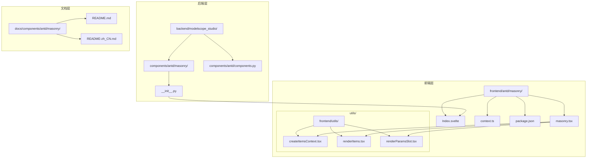
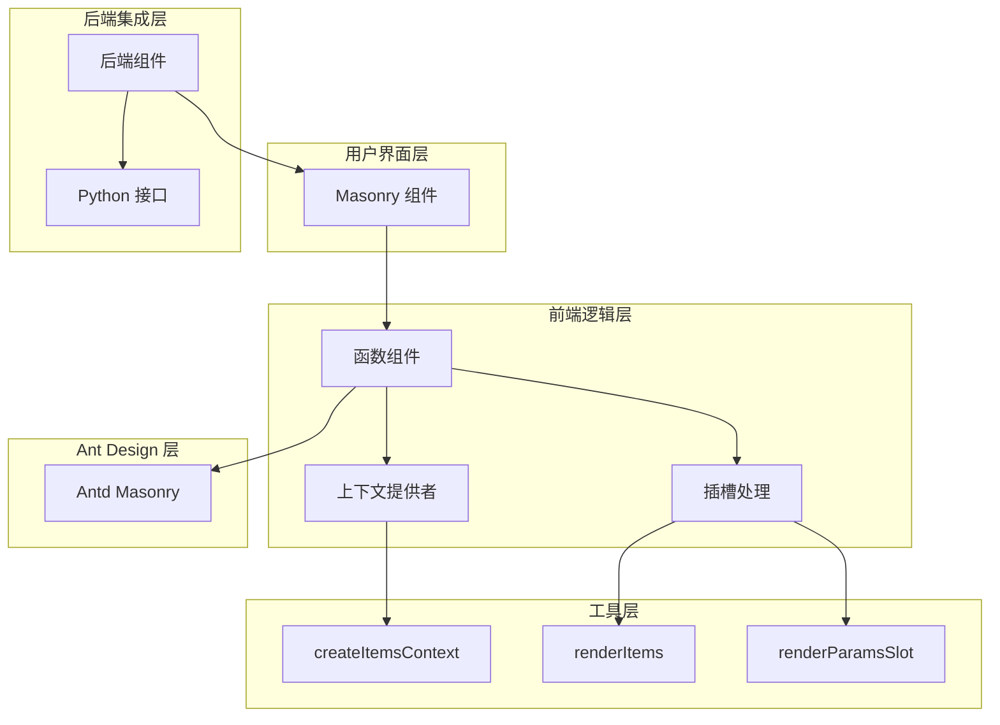
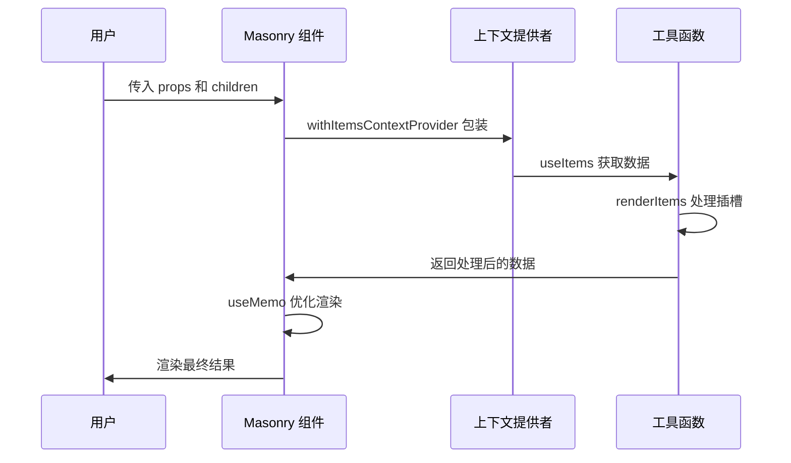
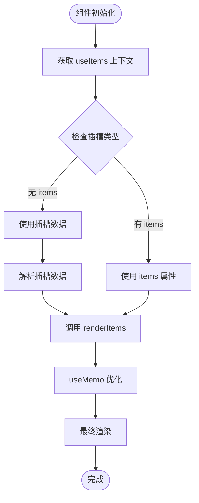
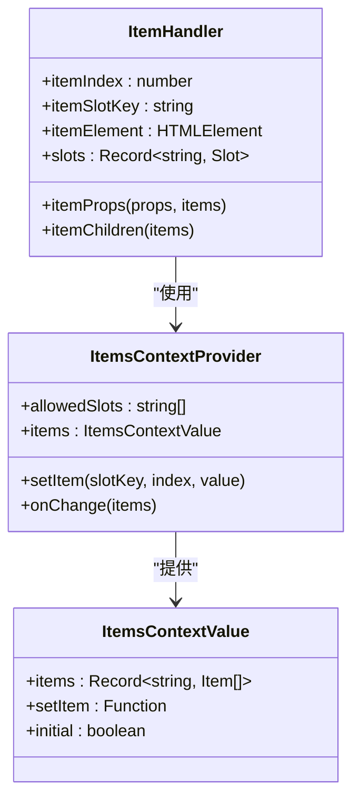
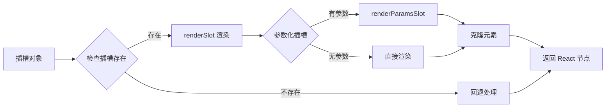
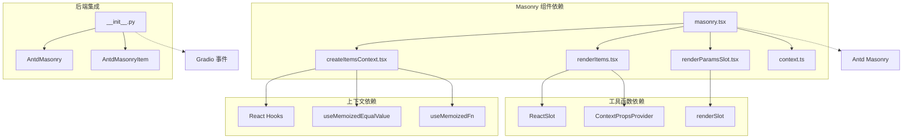

# Masonry 瀑布流布局

<cite>
**本文档引用的文件**
- [frontend/antd/masonry/masonry.tsx](file://frontend/antd/masonry/masonry.tsx)
- [frontend/antd/masonry/context.ts](file://frontend/antd/masonry/context.ts)
- [frontend/antd/masonry/Index.svelte](file://frontend/antd/masonry/Index.svelte)
- [frontend/antd/masonry/package.json](file://frontend/antd/masonry/package.json)
- [backend/modelscope_studio/components/antd/masonry/__init__.py](file://backend/modelscope_studio/components/antd/masonry/__init__.py)
- [backend/modelscope_studio/components/antd/components.py](file://backend/modelscope_studio/components/antd/components.py)
- [frontend/utils/createItemsContext.tsx](file://frontend/utils/createItemsContext.tsx)
- [frontend/utils/renderItems.tsx](file://frontend/utils/renderItems.tsx)
- [frontend/utils/renderParamsSlot.tsx](file://frontend/utils/renderParamsSlot.tsx)
- [docs/components/antd/masonry/README.md](file://docs/components/antd/masonry/README.md)
- [docs/components/antd/masonry/README-zh_CN.md](file://docs/components/antd/masonry/README-zh_CN.md)
</cite>

## 目录

1. [简介](#简介)
2. [项目结构](#项目结构)
3. [核心组件](#核心组件)
4. [架构概览](#架构概览)
5. [详细组件分析](#详细组件分析)
6. [依赖关系分析](#依赖关系分析)
7. [性能考虑](#性能考虑)
8. [故障排除指南](#故障排除指南)
9. [结论](#结论)

## 简介

Masonry 瀑布流布局是 ModelScope Studio 中的一个重要布局组件，基于 Ant Design 的 Masonry 组件实现。该组件专门用于显示具有不同高度的内容，如图片、卡片等，能够自动创建瀑布流效果，使内容在多列布局中均匀分布。

瀑布流布局特别适用于以下场景：

- 展示具有不规则高度的图片或卡片
- 需要在列之间均匀分布内容
- 需要响应式列数调整的布局需求

## 项目结构

ModelScope Studio 采用前后端分离的架构设计，Masonry 组件在项目中的组织结构如下：



**图表来源**

- [frontend/antd/masonry/masonry.tsx:1-52](file://frontend/antd/masonry/masonry.tsx#L1-L52)
- [frontend/antd/masonry/Index.svelte:1-64](file://frontend/antd/masonry/Index.svelte#L1-L64)
- [backend/modelscope_studio/components/antd/masonry/**init**.py:1-83](file://backend/modelscope_studio/components/antd/masonry/__init__.py#L1-L83)

**章节来源**

- [frontend/antd/masonry/masonry.tsx:1-52](file://frontend/antd/masonry/masonry.tsx#L1-L52)
- [frontend/antd/masonry/Index.svelte:1-64](file://frontend/antd/masonry/Index.svelte#L1-L64)
- [backend/modelscope_studio/components/antd/masonry/**init**.py:1-83](file://backend/modelscope_studio/components/antd/masonry/__init__.py#L1-L83)

## 核心组件

### 前端核心组件

Masonry 组件的核心实现位于 `frontend/antd/masonry/masonry.tsx` 文件中，该组件使用了 React 和 Ant Design 的 Masonry 组件，并集成了 ModelScope Studio 的组件系统。

主要特性包括：

- **React 包装器**: 使用 `sveltify` 将 Svelte 组件包装为 React 组件
- **上下文管理**: 集成 `createItemsContext` 实现组件间的数据共享
- **插槽渲染**: 支持自定义插槽渲染功能
- **动态内容**: 支持动态内容更新和重新渲染

### 后端集成组件

后端组件位于 `backend/modelscope_studio/components/antd/masonry/__init__.py`，提供了 Python 接口与前端组件的桥接。

关键属性和方法：

- **EVENTS**: 定义了 `layout_change` 事件监听
- **SLOTS**: 支持 `items` 和 `itemRender` 插槽
- **PROPS**: 提供 `columns`、`gutter`、`fresh` 等配置选项

**章节来源**

- [frontend/antd/masonry/masonry.tsx:10-49](file://frontend/antd/masonry/masonry.tsx#L10-L49)
- [backend/modelscope_studio/components/antd/masonry/**init**.py:10-65](file://backend/modelscope_studio/components/antd/masonry/__init__.py#L10-L65)

## 架构概览

Masonry 组件的整体架构采用了分层设计，确保了良好的可维护性和扩展性：



**图表来源**

- [frontend/antd/masonry/masonry.tsx:1-52](file://frontend/antd/masonry/masonry.tsx#L1-L52)
- [frontend/utils/createItemsContext.tsx:97-184](file://frontend/utils/createItemsContext.tsx#L97-L184)
- [frontend/utils/renderItems.tsx:8-113](file://frontend/utils/renderItems.tsx#L8-L113)

## 详细组件分析

### Masonry 组件实现

Masonry 组件的核心实现包含以下关键部分：

#### 组件包装和属性处理

组件使用 `sveltify` 函数将 Svelte 组件包装为 React 组件，支持属性传递和事件处理：



**图表来源**

- [frontend/antd/masonry/masonry.tsx:16-48](file://frontend/antd/masonry/masonry.tsx#L16-L48)
- [frontend/antd/masonry/context.ts:3-4](file://frontend/antd/masonry/context.ts#L3-L4)

#### 数据流处理机制

组件通过 `createItemsContext` 实现数据流管理：



**图表来源**

- [frontend/antd/masonry/masonry.tsx:18-43](file://frontend/antd/masonry/masonry.tsx#L18-L43)
- [frontend/utils/renderItems.tsx:8-113](file://frontend/utils/renderItems.tsx#L8-L113)

**章节来源**

- [frontend/antd/masonry/masonry.tsx:1-52](file://frontend/antd/masonry/masonry.tsx#L1-L52)
- [frontend/antd/masonry/context.ts:1-7](file://frontend/antd/masonry/context.ts#L1-L7)

### 上下文管理系统

`createItemsContext` 提供了完整的上下文管理功能：

#### 上下文提供者模式



**图表来源**

- [frontend/utils/createItemsContext.tsx:108-170](file://frontend/utils/createItemsContext.tsx#L108-L170)
- [frontend/utils/createItemsContext.tsx:190-261](file://frontend/utils/createItemsContext.tsx#L190-L261)

#### 数据处理流程

组件的数据处理遵循以下流程：

1. **数据收集**: 从插槽中收集所有子元素
2. **数据转换**: 将 HTML 元素转换为内部数据结构
3. **上下文传递**: 通过 React Context 在组件树中传递数据
4. **状态管理**: 使用 useState 和 useEffect 管理组件状态

**章节来源**

- [frontend/utils/createItemsContext.tsx:97-274](file://frontend/utils/createItemsContext.tsx#L97-L274)

### 插槽渲染系统

Masonry 组件支持灵活的插槽渲染机制：

#### 插槽处理函数



**图表来源**

- [frontend/utils/renderParamsSlot.tsx:5-49](file://frontend/utils/renderParamsSlot.tsx#L5-L49)
- [frontend/utils/renderItems.tsx:72-94](file://frontend/utils/renderItems.tsx#L72-L94)

**章节来源**

- [frontend/utils/renderParamsSlot.tsx:1-51](file://frontend/utils/renderParamsSlot.tsx#L1-L51)
- [frontend/utils/renderItems.tsx:1-114](file://frontend/utils/renderItems.tsx#L1-L114)

## 依赖关系分析

### 组件依赖图



**图表来源**

- [frontend/antd/masonry/masonry.tsx:1-6](file://frontend/antd/masonry/masonry.tsx#L1-L6)
- [frontend/utils/createItemsContext.tsx:1-18](file://frontend/utils/createItemsContext.tsx#L1-L18)
- [backend/modelscope_studio/components/antd/masonry/**init**.py:1-8](file://backend/modelscope_studio/components/antd/masonry/__init__.py#L1-L8)

### 关键依赖说明

1. **Ant Design Masonry**: 核心布局组件，提供瀑布流布局功能
2. **React Hooks**: 用于状态管理和性能优化
3. **Gradio 集成**: 支持 Python 后端的事件处理
4. **Svelte Preprocess**: 实现 Svelte 到 React 的转换

**章节来源**

- [frontend/antd/masonry/masonry.tsx:1-6](file://frontend/antd/masonry/masonry.tsx#L1-L6)
- [backend/modelscope_studio/components/antd/masonry/**init**.py:23-27](file://backend/modelscope_studio/components/antd/masonry/__init__.py#L23-L27)

## 性能考虑

### 渲染优化策略

Masonry 组件采用了多种性能优化技术：

#### useMemo 优化

组件使用 `useMemo` 缓存计算结果，避免不必要的重新渲染：

```typescript
const memoizedItems = useMemo(() => {
  return items || renderItems(resolvedSlotItems);
}, [items, resolvedSlotItems]);
```

#### 事件处理优化

使用 `useFunction` 和 `useMemoizedFn` 优化事件处理器的性能：

```typescript
const itemRenderFunction = useFunction(props.itemRender);
```

#### 条件渲染

通过条件渲染减少 DOM 操作：

```html
<div style={{ display: 'none' }}>{children}</div>
```

### 内存管理

组件实现了智能的内存管理机制：

1. **引用缓存**: 使用 `useRef` 缓存昂贵的计算结果
2. **状态同步**: 通过 `useEffect` 同步状态变化
3. **清理机制**: 在组件卸载时清理事件监听器

## 故障排除指南

### 常见问题及解决方案

#### 1. 组件不显示内容

**症状**: Masonry 组件渲染为空白

**可能原因**:

- 插槽数据未正确设置
- items 属性未提供
- React 组件未正确包装

**解决方法**:

1. 检查插槽是否正确传递
2. 确认 items 属性是否包含有效数据
3. 验证组件包装是否正确

#### 2. 布局错乱

**症状**: 瀑布流布局显示异常

**可能原因**:

- 列数配置不正确
- 边距设置不当
- 内容高度计算错误

**解决方法**:

1. 检查 columns 配置
2. 调整 gutter 设置
3. 确保内容具有正确的高度信息

#### 3. 性能问题

**症状**: 组件渲染缓慢或卡顿

**可能原因**:

- 大量数据导致的渲染压力
- 不必要的重新渲染
- 事件处理器性能问题

**解决方法**:

1. 使用虚拟滚动处理大量数据
2. 优化 useMemo 的依赖项
3. 减少事件处理器的复杂度

**章节来源**

- [frontend/antd/masonry/masonry.tsx:36-43](file://frontend/antd/masonry/masonry.tsx#L36-L43)
- [frontend/utils/createItemsContext.tsx:124-153](file://frontend/utils/createItemsContext.tsx#L124-L153)

## 结论

Masonry 瀑布流布局组件是 ModelScope Studio 中一个功能强大且设计精良的布局解决方案。该组件通过以下特点展现了优秀的架构设计：

### 主要优势

1. **模块化设计**: 采用清晰的模块划分，便于维护和扩展
2. **性能优化**: 实现了多种性能优化技术，确保流畅的用户体验
3. **灵活性**: 支持多种配置选项和自定义渲染功能
4. **类型安全**: 完整的 TypeScript 类型定义，提供良好的开发体验

### 技术亮点

- **上下文管理模式**: 通过 `createItemsContext` 实现了强大的数据流管理
- **插槽渲染系统**: 支持复杂的插槽渲染和参数化渲染
- **React 集成**: 无缝集成到 React 生态系统中
- **后端兼容**: 提供 Python 后端接口，支持 Gradio 事件处理

### 应用场景

Masonry 组件特别适用于以下场景：

- 图片画廊展示
- 卡片内容布局
- 动态内容容器
- 响应式网格布局

该组件为 ModelScope Studio 提供了强大的布局能力，是构建现代化 Web 应用的重要基础设施之一。
