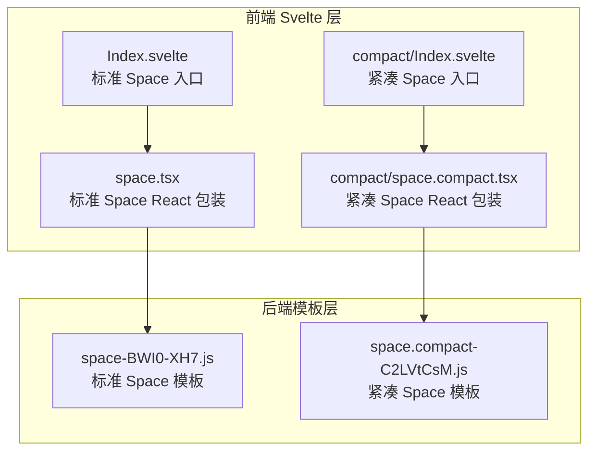
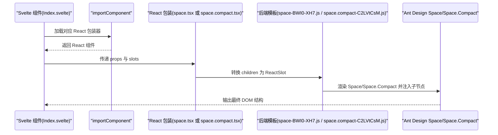
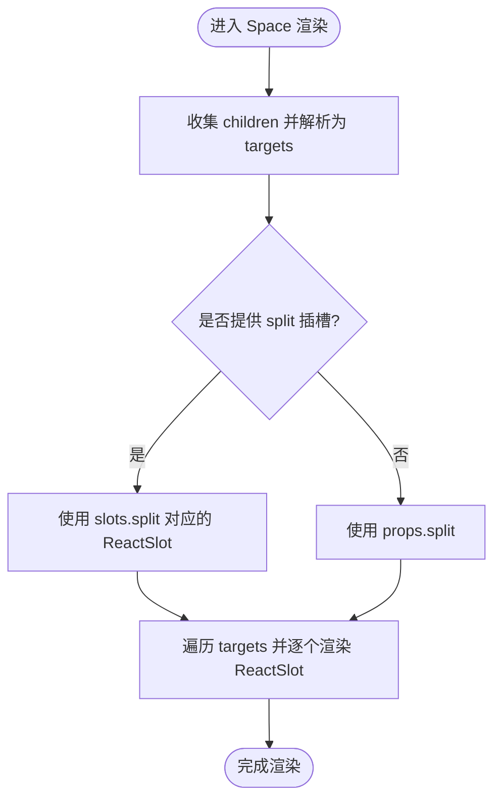
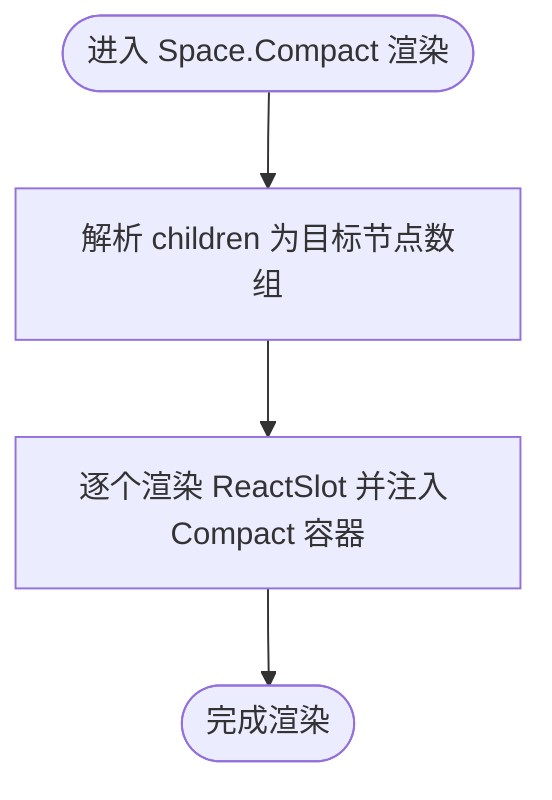
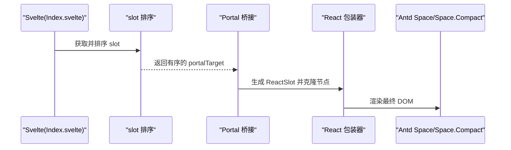
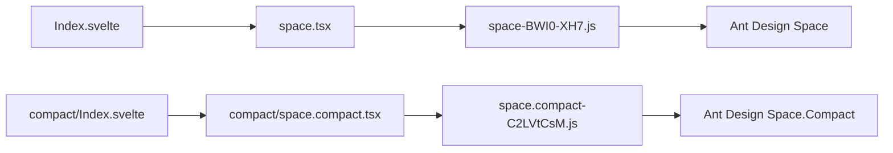

# Space 间距

<cite>
**本文引用的文件**   
- [frontend/antd/space/space.tsx](file://frontend/antd/space/space.tsx)
- [frontend/antd/space/Index.svelte](file://frontend/antd/space/Index.svelte)
- [frontend/antd/space/compact/space.compact.tsx](file://frontend/antd/space/compact/space.compact.tsx)
- [frontend/antd/space/compact/Index.svelte](file://frontend/antd/space/compact/Index.svelte)
- [backend/modelscope_studio/components/antd/space/templates/component/space-BWI0-XH7.js](file://backend/modelscope_studio/components/antd/space/templates/component/space-BWI0-XH7.js)
- [backend/modelscope_studio/components/antd/space/compact/templates/component/space.compact-C2LVtCsM.js](file://backend/modelscope_studio/components/antd/space/compact/templates/component/space.compact-C2LVtCsM.js)
- [docs/components/antd/space/README.md](file://docs/components/antd/space/README.md)
- [docs/components/antd/space/README-zh_CN.md](file://docs/components/antd/space/README-zh_CN.md)
</cite>

## 目录

1. [简介](#简介)
2. [项目结构](#项目结构)
3. [核心组件](#核心组件)
4. [架构总览](#架构总览)
5. [详细组件分析](#详细组件分析)
6. [依赖关系分析](#依赖关系分析)
7. [性能考量](#性能考量)
8. [故障排查指南](#故障排查指南)
9. [结论](#结论)
10. [附录](#附录)

## 简介

Space 间距组件用于在多个子元素之间自动插入统一的间距，支持方向控制、间距大小配置，并可与分隔符插槽协作。该仓库提供了两种形态：

- 标准 Space：基于 Ant Design 的 Space 组件封装，负责自动分配间距与方向控制。
- 紧凑模式 Space Compact：基于 Ant Design 的 Space.Compact 封装，强调更紧密的布局与紧凑的间距策略。

此外，组件通过 Svelte 与 React 的桥接机制，将 Svelte 子节点映射到 React Space/Space.Compact 的子节点，确保在 Gradio 生态中稳定渲染。

## 项目结构

Space 组件由前端 Svelte 层与后端模板层共同构成：

- 前端 Svelte 层：负责属性透传、样式拼接、可见性控制与子节点渲染。
- 后端模板层：生成最终的 React 包装器，处理 slot 排序、ReactSlot 渲染与 Portal 桥接。

**图表来源**

- [frontend/antd/space/Index.svelte:1-61](file://frontend/antd/space/Index.svelte#L1-L61)
- [frontend/antd/space/space.tsx:1-29](file://frontend/antd/space/space.tsx#L1-L29)
- [backend/modelscope_studio/components/antd/space/templates/component/space-BWI0-XH7.js:651-679](file://backend/modelscope_studio/components/antd/space/templates/component/space-BWI0-XH7.js#L651-L679)
- [frontend/antd/space/compact/Index.svelte:1-60](file://frontend/antd/space/compact/Index.svelte#L1-L60)
- [frontend/antd/space/compact/space.compact.tsx:1-24](file://frontend/antd/space/compact/space.compact.tsx#L1-L24)
- [backend/modelscope_studio/components/antd/space/compact/templates/component/space.compact-C2LVtCsM.js:651-674](file://backend/modelscope_studio/components/antd/space/compact/templates/component/space.compact-C2LVtCsM.js#L651-L674)

**章节来源**

- [frontend/antd/space/Index.svelte:1-61](file://frontend/antd/space/Index.svelte#L1-L61)
- [frontend/antd/space/compact/Index.svelte:1-60](file://frontend/antd/space/compact/Index.svelte#L1-L60)
- [docs/components/antd/space/README.md:1-8](file://docs/components/antd/space/README.md#L1-L8)
- [docs/components/antd/space/README-zh_CN.md:1-8](file://docs/components/antd/space/README-zh_CN.md#L1-L8)

## 核心组件

- 标准 Space（Space）：负责自动收集子节点、注入分隔符插槽、按顺序渲染子项，支持方向、大小、对齐等配置。
- 紧凑 Space（Space.Compact）：在紧凑模式下，减少默认间距，强调相邻元素的紧密排列，适合工具栏、按钮组等密集布局。

两者均通过 Svelte 的 importComponent 动态加载对应的 React 包装器，并将 slots 与额外属性透传给底层 React 组件。

**章节来源**

- [frontend/antd/space/space.tsx:7-26](file://frontend/antd/space/space.tsx#L7-L26)
- [frontend/antd/space/compact/space.compact.tsx:7-21](file://frontend/antd/space/compact/space.compact.tsx#L7-L21)
- [frontend/antd/space/Index.svelte:10-60](file://frontend/antd/space/Index.svelte#L10-L60)
- [frontend/antd/space/compact/Index.svelte:10-60](file://frontend/antd/space/compact/Index.svelte#L10-L60)

## 架构总览

Space 的调用链路从 Svelte 到 React，再回到 DOM，涉及 slot 解析、子节点排序与 Portal 桥接。

**图表来源**

- [frontend/antd/space/Index.svelte:10-60](file://frontend/antd/space/Index.svelte#L10-L60)
- [frontend/antd/space/space.tsx:7-26](file://frontend/antd/space/space.tsx#L7-L26)
- [backend/modelscope_studio/components/antd/space/templates/component/space-BWI0-XH7.js:651-679](file://backend/modelscope_studio/components/antd/space/templates/component/space-BWI0-XH7.js#L651-L679)
- [frontend/antd/space/compact/Index.svelte:10-60](file://frontend/antd/space/compact/Index.svelte#L10-L60)
- [frontend/antd/space/compact/space.compact.tsx:7-21](file://frontend/antd/space/compact/space.compact.tsx#L7-L21)
- [backend/modelscope_studio/components/antd/space/compact/templates/component/space.compact-C2LVtCsM.js:651-674](file://backend/modelscope_studio/components/antd/space/compact/templates/component/space.compact-C2LVtCsM.js#L651-L674)

## 详细组件分析

### 标准 Space 组件

- 自动子节点收集：通过工具函数解析 children，将其转换为 ReactSlot，保证顺序与克隆策略可控。
- 分隔符插槽：支持通过 slots.split 注入分隔符，若未提供则回退到 props.split。
- 属性透传：除内部属性外，其余 props 透传至 Ant Design Space，保持与原生一致的 API。

**图表来源**

- [frontend/antd/space/space.tsx:8-25](file://frontend/antd/space/space.tsx#L8-L25)
- [backend/modelscope_studio/components/antd/space/templates/component/space-BWI0-XH7.js:656-673](file://backend/modelscope_studio/components/antd/space/templates/component/space-BWI0-XH7.js#L656-L673)

**章节来源**

- [frontend/antd/space/space.tsx:7-26](file://frontend/antd/space/space.tsx#L7-L26)
- [backend/modelscope_studio/components/antd/space/templates/component/space-BWI0-XH7.js:651-679](file://backend/modelscope_studio/components/antd/space/templates/component/space-BWI0-XH7.js#L651-L679)

### 紧凑 Space 组件

- 紧凑模式：使用 Ant Design 的 Space.Compact，减少默认间距，适合按钮组、工具条等需要紧密排列的场景。
- 子节点处理：与标准 Space 类似，先隐藏原始 children，再以 ReactSlot 方式逐一渲染，确保 slot 排序与克隆策略一致。

**图表来源**

- [frontend/antd/space/compact/space.compact.tsx:8-20](file://frontend/antd/space/compact/space.compact.tsx#L8-L20)
- [backend/modelspace_studio/components/antd/space/compact/templates/component/space.compact-C2LVtCsM.js:651-669](file://backend/modelspace_studio/components/antd/space/compact/templates/component/space.compact-C2LVtCsM.js#L651-L669)

**章节来源**

- [frontend/antd/space/compact/space.compact.tsx:7-21](file://frontend/antd/space/compact/space.compact.tsx#L7-L21)
- [backend/modelspace_studio/components/antd/space/compact/templates/component/space.compact-C2LVtCsM.js:651-674](file://backend/modelspace_studio/components/antd/space/compact/templates/component/space.compact-C2LVtCsM.js#L651-L674)

### Svelte 到 React 的桥接机制

- Slot 排序：根据 slotIndex 与 subSlotIndex 对子节点进行稳定排序，保证渲染顺序一致。
- Portal 桥接：将 Svelte 的 slot 内容克隆并挂载到 React 环境，同时保留事件监听与样式。
- 可见性与样式：通过 Svelte 层拼接 className 与内联样式，最终注入到 React 组件上。

**图表来源**

- [frontend/antd/space/Index.svelte:44-60](file://frontend/antd/space/Index.svelte#L44-L60)
- [backend/modelspace_studio/components/antd/space/templates/component/space-BWI0-XH7.js:642-650](file://backend/modelspace_studio/components/antd/space/templates/component/space-BWI0-XH7.js#L642-L650)
- [frontend/antd/space/compact/Index.svelte:43-60](file://frontend/antd/space/compact/Index.svelte#L43-L60)
- [backend/modelspace_studio/components/antd/space/compact/templates/component/space.compact-C2LVtCsM.js:642-650](file://backend/modelspace_studio/components/antd/space/compact/templates/component/space.compact-C2LVtCsM.js#L642-L650)

**章节来源**

- [frontend/antd/space/Index.svelte:10-60](file://frontend/antd/space/Index.svelte#L10-L60)
- [frontend/antd/space/compact/Index.svelte:10-60](file://frontend/antd/space/compact/Index.svelte#L10-L60)
- [backend/modelspace_studio/components/antd/space/templates/component/space-BWI0-XH7.js:642-650](file://backend/modelspace_studio/components/antd/space/templates/component/space-BWI0-XH7.js#L642-L650)
- [backend/modelspace_studio/components/antd/space/compact/templates/component/space.compact-C2LVtCsM.js:642-650](file://backend/modelspace_studio/components/antd/space/compact/templates/component/space.compact-C2LVtCsM.js#L642-L650)

## 依赖关系分析

- 组件耦合：Space 与 Space.Compact 在前端层共享相同的桥接逻辑，仅在底层使用的 Ant Design 组件不同。
- 外部依赖：依赖 Ant Design 的 Space/Space.Compact；通过 @svelte-preprocess-react 提供 slot 与 ReactSlot 支持。
- 后端模板：模板层负责将 Svelte 的 slot 排序与 Portal 桥接逻辑转化为可执行的 React 代码。

**图表来源**

- [frontend/antd/space/Index.svelte:10-60](file://frontend/antd/space/Index.svelte#L10-L60)
- [frontend/antd/space/space.tsx:1-29](file://frontend/antd/space/space.tsx#L1-L29)
- [backend/modelspace_studio/components/antd/space/templates/component/space-BWI0-XH7.js:651-679](file://backend/modelspace_studio/components/antd/space/templates/component/space-BWI0-XH7.js#L651-L679)
- [frontend/antd/space/compact/Index.svelte:10-60](file://frontend/antd/space/compact/Index.svelte#L10-L60)
- [frontend/antd/space/compact/space.compact.tsx:1-24](file://frontend/antd/space/compact/space.compact.tsx#L1-L24)
- [backend/modelspace_studio/components/antd/space/compact/templates/component/space.compact-C2LVtCsM.js:651-674](file://backend/modelspace_studio/components/antd/space/compact/templates/component/space.compact-C2LVtCsM.js#L651-L674)

**章节来源**

- [frontend/antd/space/space.tsx:1-29](file://frontend/antd/space/space.tsx#L1-L29)
- [frontend/antd/space/compact/space.compact.tsx:1-24](file://frontend/antd/space/compact/space.compact.tsx#L1-L24)
- [backend/modelspace_studio/components/antd/space/templates/component/space-BWI0-XH7.js:651-679](file://backend/modelspace_studio/components/antd/space/templates/component/space-BWI0-XH7.js#L651-L679)
- [backend/modelspace_studio/components/antd/space/compact/templates/component/space.compact-C2LVtCsM.js:651-674](file://backend/modelspace_studio/components/antd/space/compact/templates/component/space.compact-C2LVtCsM.js#L651-L674)

## 性能考量

- 子节点克隆与 Portal：通过克隆与 Portal 挂载，避免直接操作真实 DOM，但需注意大量子节点时的渲染成本。
- slot 排序稳定性：基于索引的排序在数据量较大时仍保持稳定，但建议尽量减少不必要的 slot 变化以降低重排开销。
- SSR 与 Hugging Face Space：在某些部署环境下需禁用 SSR 以避免自定义组件兼容问题，这会影响首屏渲染时间，建议在构建阶段优化资源加载。

[本节为通用性能建议，不直接分析具体文件]

## 故障排查指南

- 子节点未正确渲染：检查 Svelte 层是否正确传递 slots 与 children，确认 slotIndex 与 subSlotIndex 是否设置正确。
- 分隔符未生效：确认 split 插槽是否正确传入，或 props.split 是否按预期提供。
- SSR 兼容问题：在 Hugging Face Space 中遇到界面异常时，尝试在 demo.launch 中添加 ssr_mode=False 参数。

**章节来源**

- [frontend/antd/space/space.tsx:15-17](file://frontend/antd/space/space.tsx#L15-L17)
- [docs/components/antd/space/README.md:1-8](file://docs/components/antd/space/README.md#L1-L8)
- [docs/components/antd/space/README-zh_CN.md:1-8](file://docs/components/antd/space/README-zh_CN.md#L1-L8)

## 结论

Space 间距组件通过 Svelte 与 React 的桥接，实现了在 Gradio 生态中对 Ant Design Space/Space.Compact 的无缝集成。标准 Space 适用于常规布局，Space.Compact 则更适合需要紧凑排列的场景。借助 slot 排序与 Portal 桥接，组件在复杂布局中也能保持良好的可维护性与一致性。

[本节为总结性内容，不直接分析具体文件]

## 附录

- 使用示例：参见文档目录下的示例标签，可在相应页面查看基础用法演示。
- 文档入口：标准 Space 与紧凑 Space 的文档说明位于 docs/components/antd/space 下。

**章节来源**

- [docs/components/antd/space/README.md:5-8](file://docs/components/antd/space/README.md#L5-L8)
- [docs/components/antd/space/README-zh_CN.md:5-8](file://docs/components/antd/space/README-zh_CN.md#L5-L8)
