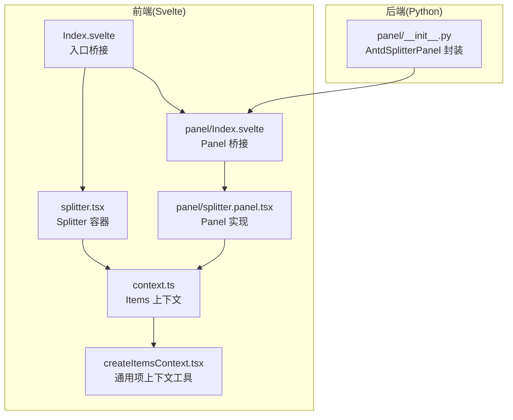
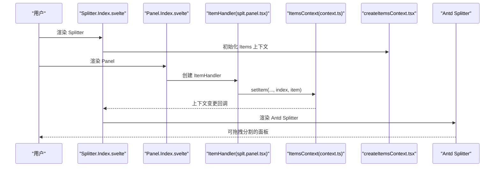
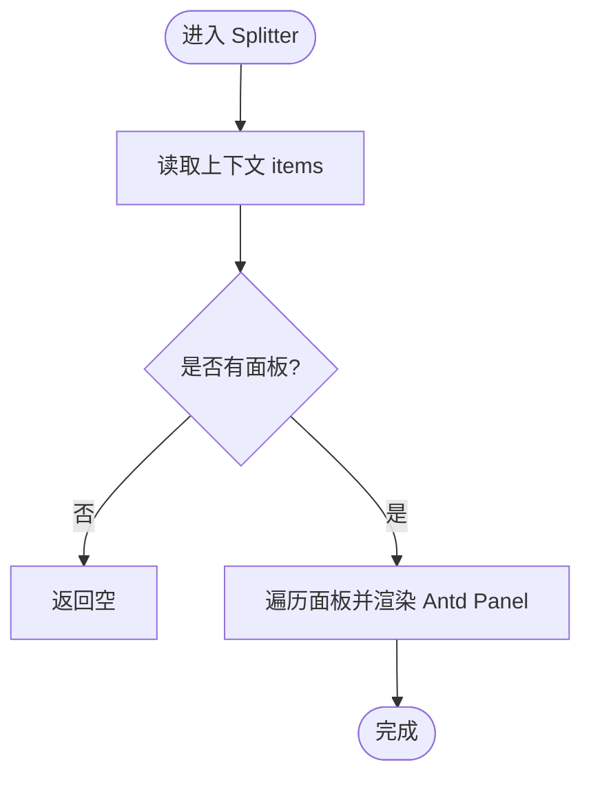
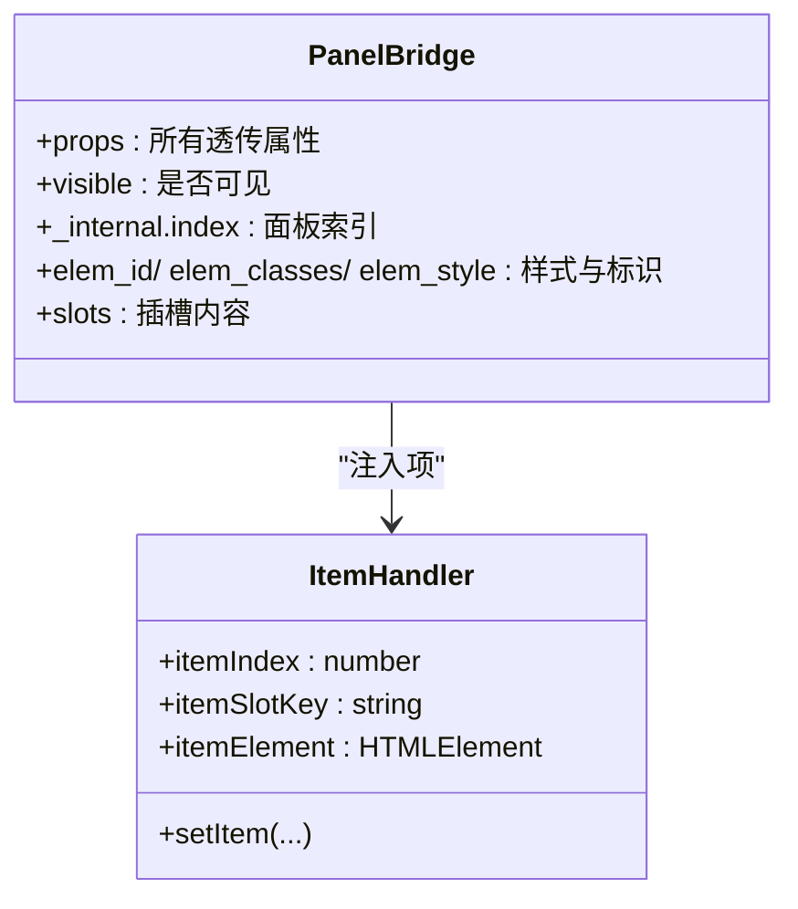
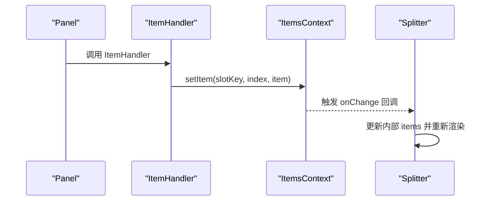
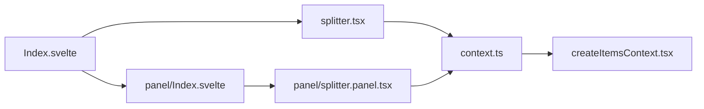

# Splitter 分割面板

<cite>
**本文引用的文件**
- [frontend/antd/splitter/Index.svelte](file://frontend/antd/splitter/Index.svelte)
- [frontend/antd/splitter/splitter.tsx](file://frontend/antd/splitter/splitter.tsx)
- [frontend/antd/splitter/panel/Index.svelte](file://frontend/antd/splitter/panel/Index.svelte)
- [frontend/antd/splitter/panel/splitter.panel.tsx](file://frontend/antd/splitter/panel/splitter.panel.tsx)
- [frontend/antd/splitter/context.ts](file://frontend/antd/splitter/context.ts)
- [frontend/utils/createItemsContext.tsx](file://frontend/utils/createItemsContext.tsx)
- [backend/modelscope_studio/components/antd/splitter/panel/__init__.py](file://backend/modelscope_studio/components/antd/splitter/panel/__init__.py)
- [docs/components/antd/splitter/README.md](file://docs/components/antd/splitter/README.md)
</cite>

## 目录

1. [简介](#简介)
2. [项目结构](#项目结构)
3. [核心组件](#核心组件)
4. [架构总览](#架构总览)
5. [详细组件分析](#详细组件分析)
6. [依赖关系分析](#依赖关系分析)
7. [性能考量](#性能考量)
8. [故障排查指南](#故障排查指南)
9. [结论](#结论)
10. [附录](#附录)

## 简介

Splitter 是一个基于 Ant Design 的分割面板组件，用于将界面划分为多个可拖拽调整大小的区域。它支持水平与垂直两种方向，并通过子组件 Panel 实现面板的声明式组织。该组件广泛适用于代码编辑器（左右布局）、图片对比（左右或上下）、多视图并排展示等场景。

本组件文档将从架构设计、数据流、拖拽与尺寸控制、响应式与交互体验、样式与无障碍等方面进行系统化说明，并提供典型应用示例与最佳实践建议。

## 项目结构

Splitter 在前端采用 Svelte + React Slot 的桥接方式，后端通过 Python 组件封装属性与渲染逻辑。核心文件分布如下：

- 前端入口与桥接：frontend/antd/splitter/Index.svelte
- 分割容器实现：frontend/antd/splitter/splitter.tsx
- 面板子组件桥接：frontend/antd/splitter/panel/Index.svelte
- 面板子组件实现：frontend/antd/splitter/panel/splitter.panel.tsx
- 上下文与项管理：frontend/antd/splitter/context.ts、frontend/utils/createItemsContext.tsx
- 后端 Panel 组件封装：backend/modelscope_studio/components/antd/splitter/panel/**init**.py
- 文档与示例入口：docs/components/antd/splitter/README.md

图表来源

- [frontend/antd/splitter/Index.svelte:1-71](file://frontend/antd/splitter/Index.svelte#L1-L71)
- [frontend/antd/splitter/splitter.tsx:1-38](file://frontend/antd/splitter/splitter.tsx#L1-L38)
- [frontend/antd/splitter/panel/Index.svelte:1-77](file://frontend/antd/splitter/panel/Index.svelte#L1-L77)
- [frontend/antd/splitter/panel/splitter.panel.tsx:1-14](file://frontend/antd/splitter/panel/splitter.panel.tsx#L1-L14)
- [frontend/antd/splitter/context.ts:1-7](file://frontend/antd/splitter/context.ts#L1-L7)
- [frontend/utils/createItemsContext.tsx:1-274](file://frontend/utils/createItemsContext.tsx#L1-L274)
- [backend/modelscope_studio/components/antd/splitter/panel/**init**.py:1-85](file://backend/modelscope_studio/components/antd/splitter/panel/__init__.py#L1-L85)

章节来源

- [frontend/antd/splitter/Index.svelte:1-71](file://frontend/antd/splitter/Index.svelte#L1-L71)
- [frontend/antd/splitter/splitter.tsx:1-38](file://frontend/antd/splitter/splitter.tsx#L1-L38)
- [frontend/antd/splitter/panel/Index.svelte:1-77](file://frontend/antd/splitter/panel/Index.svelte#L1-L77)
- [frontend/antd/splitter/panel/splitter.panel.tsx:1-14](file://frontend/antd/splitter/panel/splitter.panel.tsx#L1-L14)
- [frontend/antd/splitter/context.ts:1-7](file://frontend/antd/splitter/context.ts#L1-L7)
- [frontend/utils/createItemsContext.tsx:1-274](file://frontend/utils/createItemsContext.tsx#L1-L274)
- [backend/modelscope_studio/components/antd/splitter/panel/**init**.py:1-85](file://backend/modelscope_studio/components/antd/splitter/panel/__init__.py#L1-L85)
- [docs/components/antd/splitter/README.md:1-8](file://docs/components/antd/splitter/README.md#L1-L8)

## 核心组件

- Splitter 容器：负责接收子面板集合，渲染 Ant Design 的分割容器，并将每个 Panel 渲染为 Antd 的 Panel 子项。
- Panel 子组件：作为面板的占位与渲染单元，通过 Items 上下文收集面板属性与插槽内容，最终注入到 Splitter 中。
- Items 上下文：提供“项收集”能力，允许 Panel 在渲染时向 Splitter 注入自身属性与 DOM 内容。
- 后端封装：Python 层的 AntdSplitterPanel 提供默认尺寸、最小/最大尺寸、可折叠、可调整等属性的声明与传递。

章节来源

- [frontend/antd/splitter/splitter.tsx:7-35](file://frontend/antd/splitter/splitter.tsx#L7-L35)
- [frontend/antd/splitter/panel/splitter.panel.tsx:7-11](file://frontend/antd/splitter/panel/splitter.panel.tsx#L7-L11)
- [frontend/antd/splitter/context.ts:3-4](file://frontend/antd/splitter/context.ts#L3-L4)
- [frontend/utils/createItemsContext.tsx:97-184](file://frontend/utils/createItemsContext.tsx#L97-L184)
- [backend/modelscope_studio/components/antd/splitter/panel/**init**.py:8-68](file://backend/modelscope_studio/components/antd/splitter/panel/__init__.py#L8-L68)

## 架构总览

Splitter 的运行时流程如下：

- Svelte 入口桥接组件加载 Splitter 与 Panel 组件；
- Panel 通过 ItemHandler 将自身属性与插槽内容写入 Items 上下文；
- Splitter 使用 withItemsContextProvider 包裹，读取上下文中收集的面板列表；
- 最终渲染 Ant Design 的 Splitter 与 Panel。

图表来源

- [frontend/antd/splitter/Index.svelte:10-52](file://frontend/antd/splitter/Index.svelte#L10-L52)
- [frontend/antd/splitter/panel/Index.svelte:10-69](file://frontend/antd/splitter/panel/Index.svelte#L10-L69)
- [frontend/antd/splitter/panel/splitter.panel.tsx:7-11](file://frontend/antd/splitter/panel/splitter.panel.tsx#L7-L11)
- [frontend/antd/splitter/context.ts:3-4](file://frontend/antd/splitter/context.ts#L3-L4)
- [frontend/utils/createItemsContext.tsx:108-170](file://frontend/utils/createItemsContext.tsx#L108-L170)
- [frontend/antd/splitter/splitter.tsx:7-35](file://frontend/antd/splitter/splitter.tsx#L7-L35)

## 详细组件分析

### Splitter 容器组件

- 责任边界：将收集到的面板项映射为 Ant Design 的 Panel，并渲染分割容器。
- 关键点：
  - 使用 withItemsContextProvider 包裹，确保能读取到由 Panel 注入的 items。
  - 通过 ReactSlot 将插槽内容渲染到对应 Panel。
  - 当没有面板时，不渲染任何内容，避免空容器造成的布局问题。

图表来源

- [frontend/antd/splitter/splitter.tsx:8-35](file://frontend/antd/splitter/splitter.tsx#L8-L35)

章节来源

- [frontend/antd/splitter/splitter.tsx:7-35](file://frontend/antd/splitter/splitter.tsx#L7-L35)

### Panel 子组件

- 责任边界：作为单个面板的占位与渲染单元，负责将自身属性与插槽内容注入到 Items 上下文。
- 关键点：
  - 通过 ItemHandler 将 itemIndex、itemSlotKey、itemElement 等信息写入上下文。
  - 支持 visible 控制显示；支持额外属性透传与样式类名绑定。
  - 插槽内容通过 Svelte slot 机制收集，并在 Splitter 中以 ReactSlot 渲染。

图表来源

- [frontend/antd/splitter/panel/Index.svelte:25-69](file://frontend/antd/splitter/panel/Index.svelte#L25-L69)
- [frontend/antd/splitter/panel/splitter.panel.tsx:7-11](file://frontend/antd/splitter/panel/splitter.panel.tsx#L7-L11)
- [frontend/antd/splitter/context.ts:3-4](file://frontend/antd/splitter/context.ts#L3-L4)

章节来源

- [frontend/antd/splitter/panel/Index.svelte:14-69](file://frontend/antd/splitter/panel/Index.svelte#L14-L69)
- [frontend/antd/splitter/panel/splitter.panel.tsx:7-11](file://frontend/antd/splitter/panel/splitter.panel.tsx#L7-L11)
- [frontend/antd/splitter/context.ts:3-4](file://frontend/antd/splitter/context.ts#L3-L4)

### Items 上下文与项收集机制

- 作用：在组件树中建立“项收集”通道，使 Panel 能够将自身属性与 DOM 内容写入 Splitter。
- 关键点：
  - withItemsContextProvider：为组件树提供 ItemsContextProvider，维护 items 映射与 setItem 方法。
  - useItems：在 Splitter 中读取 items 列表。
  - ItemHandler：在 Panel 渲染时写入项，支持 itemProps、itemChildren 等扩展能力。

图表来源

- [frontend/utils/createItemsContext.tsx:108-170](file://frontend/utils/createItemsContext.tsx#L108-L170)
- [frontend/utils/createItemsContext.tsx:186-261](file://frontend/utils/createItemsContext.tsx#L186-L261)
- [frontend/antd/splitter/splitter.tsx:8-11](file://frontend/antd/splitter/splitter.tsx#L8-L11)

章节来源

- [frontend/utils/createItemsContext.tsx:97-184](file://frontend/utils/createItemsContext.tsx#L97-L184)
- [frontend/utils/createItemsContext.tsx:186-261](file://frontend/utils/createItemsContext.tsx#L186-L261)
- [frontend/antd/splitter/context.ts:3-4](file://frontend/antd/splitter/context.ts#L3-L4)

### 后端封装与属性传递

- AntdSplitterPanel 提供以下关键属性（来自 Python 封装）：
  - default_size：默认尺寸
  - min / max：最小/最大尺寸
  - size：当前尺寸
  - collapsible：是否可折叠
  - resizable：是否可调整
  - elem_id / elem_classes / elem_style：样式与标识
- 这些属性会通过 Svelte 桥接层透传至前端组件，最终影响 Ant Design Splitter 的行为与外观。

章节来源

- [backend/modelscope_studio/components/antd/splitter/panel/**init**.py:8-68](file://backend/modelscope_studio/components/antd/splitter/panel/__init__.py#L8-L68)

## 依赖关系分析

- 组件耦合：
  - Splitter 依赖 Items 上下文来获取面板集合。
  - Panel 通过 ItemHandler 依赖 Items 上下文写入自身项。
  - 前端桥接层（Index.svelte）负责将属性与插槽透传给 React 组件。
- 外部依赖：
  - Ant Design 的 Splitter/Panel 接口。
  - Svelte Preprocess React 工具链（sveltify、ReactSlot、processProps 等）。
- 潜在循环依赖：
  - 通过上下文与回调解耦，避免直接互相引用导致的循环。

图表来源

- [frontend/antd/splitter/Index.svelte:10-52](file://frontend/antd/splitter/Index.svelte#L10-L52)
- [frontend/antd/splitter/splitter.tsx:5-6](file://frontend/antd/splitter/splitter.tsx#L5-L6)
- [frontend/antd/splitter/panel/Index.svelte:10-11](file://frontend/antd/splitter/panel/Index.svelte#L10-L11)
- [frontend/antd/splitter/panel/splitter.panel.tsx:5-5](file://frontend/antd/splitter/panel/splitter.panel.tsx#L5-L5)
- [frontend/antd/splitter/context.ts:3-4](file://frontend/antd/splitter/context.ts#L3-L4)
- [frontend/utils/createItemsContext.tsx:1-274](file://frontend/utils/createItemsContext.tsx#L1-L274)

章节来源

- [frontend/antd/splitter/Index.svelte:1-71](file://frontend/antd/splitter/Index.svelte#L1-L71)
- [frontend/antd/splitter/splitter.tsx:1-38](file://frontend/antd/splitter/splitter.tsx#L1-L38)
- [frontend/antd/splitter/panel/Index.svelte:1-77](file://frontend/antd/splitter/panel/Index.svelte#L1-L77)
- [frontend/antd/splitter/panel/splitter.panel.tsx:1-14](file://frontend/antd/splitter/panel/splitter.panel.tsx#L1-L14)
- [frontend/antd/splitter/context.ts:1-7](file://frontend/antd/splitter/context.ts#L1-L7)
- [frontend/utils/createItemsContext.tsx:1-274](file://frontend/utils/createItemsContext.tsx#L1-L274)

## 性能考量

- 渲染策略
  - Splitter 仅在存在面板时渲染容器，避免空渲染带来的开销。
  - 通过 useMemoizedEqualValue 与 useMemoizedFn 降低上下文更新频率与重复渲染。
- 事件与状态
  - setItem 与 onChange 仅在值变化时触发，减少不必要的重渲染。
- 建议
  - 对于大量面板或频繁调整尺寸的场景，建议限制面板数量与更新频率。
  - 合理设置最小/最大尺寸，避免极端尺寸导致的重排抖动。

章节来源

- [frontend/antd/splitter/splitter.tsx:15-31](file://frontend/antd/splitter/splitter.tsx#L15-L31)
- [frontend/utils/createItemsContext.tsx:113-153](file://frontend/utils/createItemsContext.tsx#L113-L153)
- [frontend/utils/createItemsContext.tsx:234-254](file://frontend/utils/createItemsContext.tsx#L234-L254)

## 故障排查指南

- 面板未显示
  - 检查 Panel 的 visible 是否为真；确认桥接层已正确透传 visible。
  - 确认 Panel 是否成功写入 Items 上下文（检查 setItem 调用与索引）。
- 拖拽无效
  - 确认 resizable 与可调整方向设置正确；检查 Ant Design 版本与样式是否完整。
- 尺寸异常
  - 检查 min/max 与 default_size 的设置是否合理；避免设置为 0 或负数。
- 插槽内容不渲染
  - 确认 Panel 的插槽绑定与 ReactSlot 的使用一致；避免插槽被提前销毁。

章节来源

- [frontend/antd/splitter/panel/Index.svelte:52-69](file://frontend/antd/splitter/panel/Index.svelte#L52-L69)
- [frontend/antd/splitter/splitter.tsx:14-31](file://frontend/antd/splitter/splitter.tsx#L14-L31)
- [backend/modelscope_studio/components/antd/splitter/panel/**init**.py:62-66](file://backend/modelscope_studio/components/antd/splitter/panel/__init__.py#L62-L66)

## 结论

Splitter 通过 Items 上下文与 Svelte/React 桥接，实现了灵活的面板组织与渲染。其核心优势在于：

- 面向用户的声明式 API（Panel 子组件）
- 与 Ant Design 的深度集成（拖拽、方向、尺寸控制）
- 可扩展的项收集机制（支持动态增删改）

在实际应用中，建议结合业务场景合理设置尺寸约束与交互行为，并关注性能与可维护性。

## 附录

### 配置与属性参考

- Splitter 容器
  - 方向：由 Ant Design 的方向属性控制（水平/垂直）
  - 拖拽：由 Ant Design 的拖拽能力提供
  - 事件：resizeStart/resizEnd（通过桥接层映射）
- Panel 子组件
  - default_size / size：默认/当前尺寸
  - min / max：最小/最大尺寸
  - collapsible / resizable：可折叠/可调整
  - elem_id / elem_classes / elem_style：样式与标识
  - visible：是否可见

章节来源

- [frontend/antd/splitter/Index.svelte:25-52](file://frontend/antd/splitter/Index.svelte#L25-L52)
- [frontend/antd/splitter/splitter.tsx:16-30](file://frontend/antd/splitter/splitter.tsx#L16-L30)
- [backend/modelscope_studio/components/antd/splitter/panel/**init**.py:61-66](file://backend/modelscope_studio/components/antd/splitter/panel/__init__.py#L61-L66)

### 应用场景示例

- 代码编辑器：左侧文件树/大纲，右侧代码编辑区，支持左右拖拽调整宽度。
- 图片对比：左右或上下排列两张图片，支持拖拽调整比例。
- 多视图展示：三栏布局（左/中/右），中间为主视图，两侧为工具/预览。

章节来源

- [docs/components/antd/splitter/README.md:1-8](file://docs/components/antd/splitter/README.md#L1-L8)

### 响应式与交互体验

- 响应式行为：根据容器宽度/高度自适应面板比例；建议在小屏设备上启用可折叠能力。
- 交互体验：拖拽过程提供视觉反馈；建议设置合理的最小尺寸，避免误触过小。

章节来源

- [backend/modelscope_studio/components/antd/splitter/panel/**init**.py:14-16](file://backend/modelscope_studio/components/antd/splitter/panel/__init__.py#L14-L16)

### 样式定制与无障碍

- 样式定制：通过 elem_classes 与 elem_style 注入自定义样式；注意与 Ant Design 默认样式的兼容性。
- 动画效果：可结合 CSS 过渡或第三方动画库实现平滑尺寸切换。
- 无障碍：为拖拽手柄提供可访问标签与键盘操作提示；确保可折叠状态具备明确的 ARIA 属性。

章节来源

- [frontend/antd/splitter/panel/Index.svelte:54-55](file://frontend/antd/splitter/panel/Index.svelte#L54-L55)
- [frontend/antd/splitter/splitter.tsx:16-30](file://frontend/antd/splitter/splitter.tsx#L16-L30)
