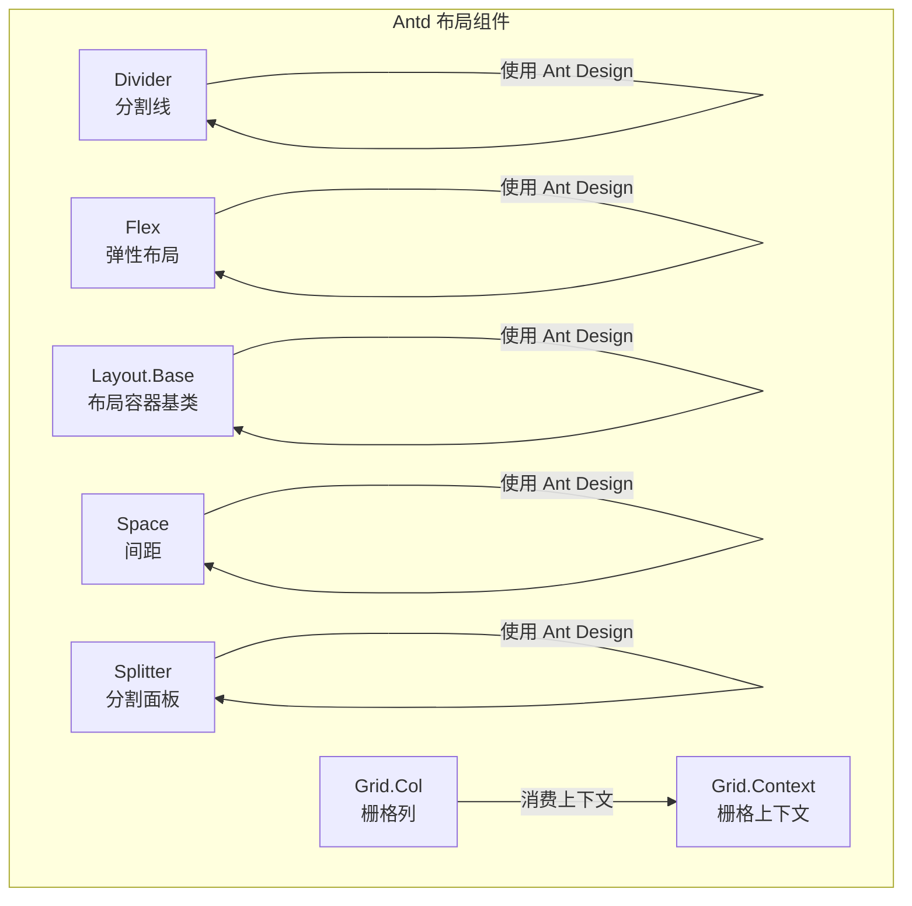
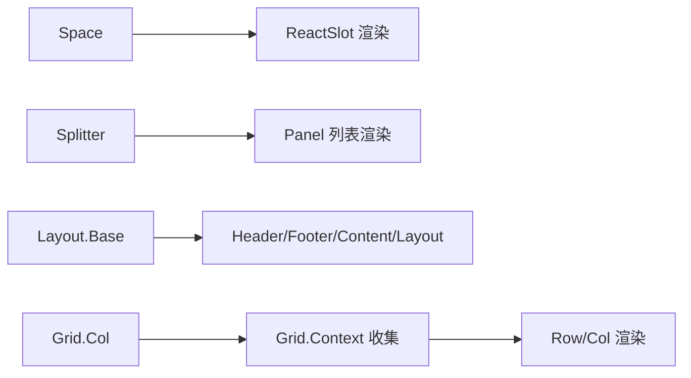
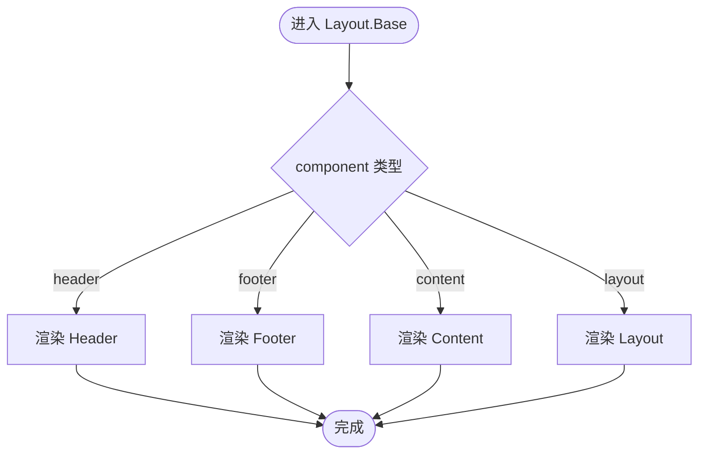
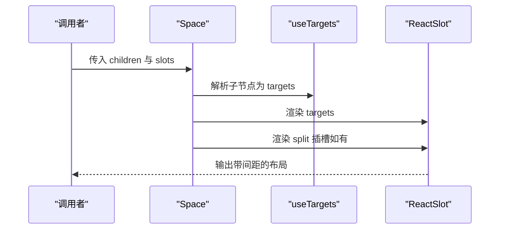
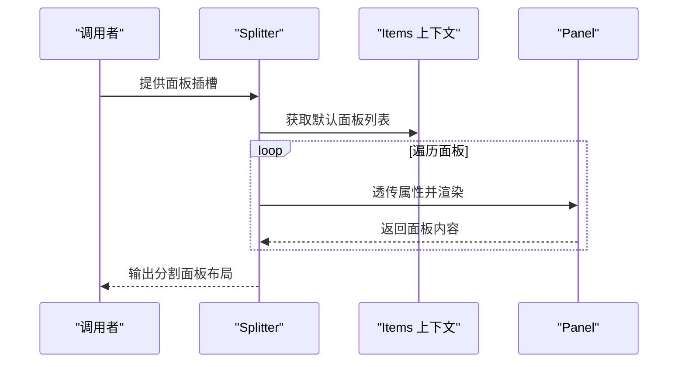
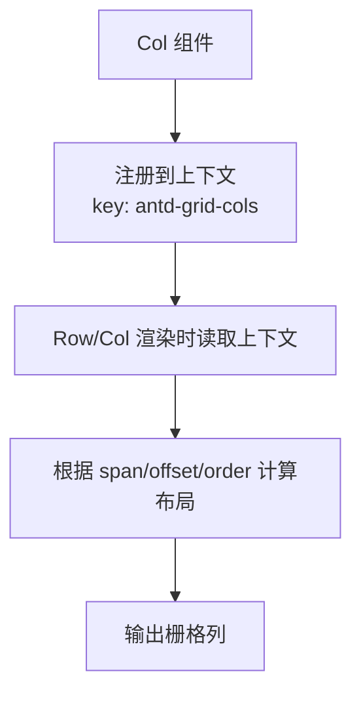
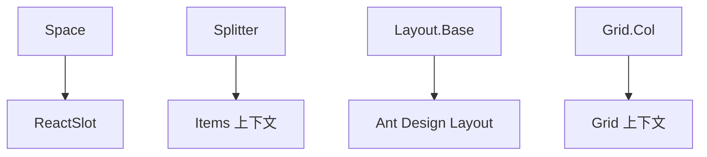

# 布局组件

<cite>
**本文引用的文件**
- [divider.tsx](file://frontend/antd/divider/divider.tsx)
- [flex.tsx](file://frontend/antd/flex/flex.tsx)
- [layout.base.tsx](file://frontend/antd/layout/layout.base.tsx)
- [space.tsx](file://frontend/antd/space/space.tsx)
- [splitter.tsx](file://frontend/antd/splitter/splitter.tsx)
- [context.ts](file://frontend/antd/grid/context.ts)
- [col.tsx](file://frontend/antd/grid/col/col.tsx)
</cite>

## 目录

1. [简介](#简介)
2. [项目结构](#项目结构)
3. [核心组件](#核心组件)
4. [架构总览](#架构总览)
5. [组件详解](#组件详解)
6. [依赖关系分析](#依赖关系分析)
7. [性能与响应式特性](#性能与响应式特性)
8. [移动端与屏幕适配](#移动端与屏幕适配)
9. [故障排查](#故障排查)
10. [结论](#结论)
11. [附录：复杂页面布局示例与最佳实践](#附录复杂页面布局示例与最佳实践)

## 简介

本章节面向使用 Ant Design 布局组件的开发者，系统梳理分割线、弹性布局、栅格、布局容器、间距、分割面板、瀑布流布局等组件在本仓库中的实现方式与使用要点。文档重点说明各组件的布局算法思想、响应式行为、嵌套规则与组合模式，并给出移动端适配与屏幕尺寸兼容性建议。

## 项目结构

这些布局组件位于前端目录下的 antd 子模块中，采用“Svelte 包裹 React 组件”的统一封装策略（通过 sveltify 将 Ant Design 的 React 组件桥接为 Svelte 可用的组件），并在部分场景下引入上下文与工具函数以支持更复杂的布局能力（如栅格列收集、分割面板子项渲染）。

图示来源

- [divider.tsx:1-15](file://frontend/antd/divider/divider.tsx#L1-L15)
- [flex.tsx:1-11](file://frontend/antd/flex/flex.tsx#L1-L11)
- [layout.base.tsx:1-40](file://frontend/antd/layout/layout.base.tsx#L1-L40)
- [space.tsx:1-29](file://frontend/antd/space/space.tsx#L1-L29)
- [splitter.tsx:1-38](file://frontend/antd/splitter/splitter.tsx#L1-L38)
- [context.ts:1-7](file://frontend/antd/grid/context.ts#L1-L7)
- [col.tsx:1-14](file://frontend/antd/grid/col/col.tsx#L1-L14)

章节来源

- [divider.tsx:1-15](file://frontend/antd/divider/divider.tsx#L1-L15)
- [flex.tsx:1-11](file://frontend/antd/flex/flex.tsx#L1-L11)
- [layout.base.tsx:1-40](file://frontend/antd/layout/layout.base.tsx#L1-L40)
- [space.tsx:1-29](file://frontend/antd/space/space.tsx#L1-L29)
- [splitter.tsx:1-38](file://frontend/antd/splitter/splitter.tsx#L1-L38)
- [context.ts:1-7](file://frontend/antd/grid/context.ts#L1-L7)
- [col.tsx:1-14](file://frontend/antd/grid/col/col.tsx#L1-L14)

## 核心组件

- 分割线 Divider：对 Ant Design 的 Divider 进行轻量封装，支持无子节点时的空标签渲染与有子节点时的透传渲染。
- 弹性布局 Flex：对 Ant Design 的 Flex 进行简单封装，直接透传属性与子节点。
- 布局容器 Layout.Base：根据传入的 component 类型动态选择 Header、Footer、Content 或 Layout，并注入样式类名以便区分。
- 间距 Space：基于 Ant Design 的 Space，扩展了插槽渲染与 split 插槽支持，内部使用 useTargets 将子节点映射到目标集合。
- 分割面板 Splitter：基于 Ant Design 的 Splitter，结合上下文收集默认面板列表，将每个面板的元素与属性透传给 Panel。
- 栅格 Grid：通过上下文收集列（Col）并将其注入 Row/Col 渲染逻辑；Col 组件通过 ItemHandler 将自身注册到上下文中。
- 瀑布流布局 Masonry：基于 Ant Design 的 Masonry 组件，支持响应式列数配置与项目高度自动调整，适合图片墙、卡片流等不等高布局场景。可参考 [Masonry 瀑布流布局](file://.qoder/repowiki/zh/content/Ant%20Design%20%E7%BB%84%E4%BB%B6%E5%BA%93/%E5%B8%83%E5%B1%80%E7%BB%84%E4%BB%B6/Masonry%20%E7%80%91%E5%B8%83%E6%B5%81%E5%B8%83%E5%B1%80.md) 详细了解。

章节来源

- [divider.tsx:1-15](file://frontend/antd/divider/divider.tsx#L1-L15)
- [flex.tsx:1-11](file://frontend/antd/flex/flex.tsx#L1-L11)
- [layout.base.tsx:1-40](file://frontend/antd/layout/layout.base.tsx#L1-L40)
- [space.tsx:1-29](file://frontend/antd/space/space.tsx#L1-L29)
- [splitter.tsx:1-38](file://frontend/antd/splitter/splitter.tsx#L1-L38)
- [context.ts:1-7](file://frontend/antd/grid/context.ts#L1-L7)
- [col.tsx:1-14](file://frontend/antd/grid/col/col.tsx#L1-L14)

## 架构总览

下图展示了布局组件之间的依赖与协作关系：Space 与 Splitter 在渲染前会先解析子节点并建立目标映射；Layout.Base 动态选择具体布局子组件；Grid 通过上下文机制收集 Col 并参与栅格布局。

图示来源

- [space.tsx:1-29](file://frontend/antd/space/space.tsx#L1-L29)
- [splitter.tsx:1-38](file://frontend/antd/splitter/splitter.tsx#L1-L38)
- [layout.base.tsx:1-40](file://frontend/antd/layout/layout.base.tsx#L1-L40)
- [context.ts:1-7](file://frontend/antd/grid/context.ts#L1-L7)
- [col.tsx:1-14](file://frontend/antd/grid/col/col.tsx#L1-L14)

## 组件详解

### 分割线 Divider

- 实现要点
  - 使用 sveltify 包装 Ant Design 的 Divider。
  - 当存在子节点时，渲染带子节点的分割线；否则渲染空分割线。
- 嵌套规则
  - 作为分隔符使用，可放置于任意容器内；不改变父容器的布局模式。
- 响应式行为
  - 由 Ant Design 决定，默认不涉及断点控制。
- 典型用法
  - 在列表、表单或卡片之间插入分割线，提升视觉层次。

章节来源

- [divider.tsx:1-15](file://frontend/antd/divider/divider.tsx#L1-L15)

### 弹性布局 Flex

- 实现要点
  - 使用 sveltify 包装 Ant Design 的 Flex，直接透传属性与子节点。
- 布局算法
  - 遵循 Flexbox 规范，支持主轴、交叉轴、换行、对齐等常见属性。
- 嵌套规则
  - Flex 内部可继续嵌套 Flex、Grid、Space 等布局组件，形成复合布局。
- 响应式行为
  - Flex 属性可随断点变化，配合 Ant Design 的断点配置实现自适应。
- 典型用法
  - 头部导航、卡片组、按钮组等需要灵活对齐与分布的场景。

章节来源

- [flex.tsx:1-11](file://frontend/antd/flex/flex.tsx#L1-L11)

### 布局容器 Layout.Base

- 实现要点
  - 根据 component 参数动态选择渲染 Header、Footer、Content 或 Layout。
  - 为非 layout 的子组件注入样式类名，便于样式区分与调试。
- 布局算法
  - 通过 Ant Design 的 Layout 家族组件实现页面框架布局。
- 嵌套规则
  - Header/Footer/Content 必须作为 Layout 的直接子节点；可嵌套侧边栏（Sider）等子组件。
- 响应式行为
  - 结合 Sider 的折叠/展开与断点策略，实现响应式侧边栏。
- 典型用法
  - 页面整体框架：顶部导航 + 侧边菜单 + 主体内容 + 底部信息。

图示来源

- [layout.base.tsx:1-40](file://frontend/antd/layout/layout.base.tsx#L1-L40)

章节来源

- [layout.base.tsx:1-40](file://frontend/antd/layout/layout.base.tsx#L1-L40)

### 间距 Space

- 实现要点
  - 使用 Ant Design 的 Space，并扩展了插槽渲染与 split 插槽支持。
  - 内部通过 useTargets 将子节点映射为目标集合，再通过 ReactSlot 渲染。
- 布局算法
  - 按方向与大小计算元素间的间距，支持包裹、压缩等组合模式。
- 嵌套规则
  - 可嵌套任意组件；split 插槽用于渲染分隔符。
- 响应式行为
  - 间距值可随断点变化，实现不同屏幕下的间距优化。
- 典型用法
  - 导航按钮组、操作按钮组、表单项之间的紧凑排列。

图示来源

- [space.tsx:1-29](file://frontend/antd/space/space.tsx#L1-L29)

章节来源

- [space.tsx:1-29](file://frontend/antd/space/space.tsx#L1-L29)

### 分割面板 Splitter

- 实现要点
  - 使用 Ant Design 的 Splitter，并通过上下文收集默认面板列表。
  - 将每个面板的元素与属性透传给 Panel，实现灵活的多面板布局。
- 布局算法
  - 基于拖拽或固定比例的分割布局，支持水平与垂直方向。
- 嵌套规则
  - 子面板通过上下文注册，每个面板独立渲染其内容。
- 响应式行为
  - 可结合断点调整初始比例与最小尺寸，保证移动端可用性。
- 典型用法
  - 代码编辑器 + 预览区、左右内容对比、多视图并排展示。

图示来源

- [splitter.tsx:1-38](file://frontend/antd/splitter/splitter.tsx#L1-L38)

章节来源

- [splitter.tsx:1-38](file://frontend/antd/splitter/splitter.tsx#L1-L38)

### 栅格 Grid（Col 与上下文）

- 实现要点
  - Col 通过 ItemHandler 将自身注册到名为 antd-grid-cols 的上下文中。
  - 上下文提供 withItemsContextProvider 与 useItems，用于收集与消费列定义。
- 布局算法
  - 基于 24 栅格系统，Col 的 span/offset/order/gutter 等属性决定列宽与顺序。
- 嵌套规则
  - Col 必须置于 Row/Col 的上下文中；可通过断点配置实现响应式。
- 响应式行为
  - 支持 xs/sm/md/lg/xl 等断点，按断点设置不同的 span/offset。
- 典型用法
  - 表单网格、卡片网格、图片墙等。

图示来源

- [context.ts:1-7](file://frontend/antd/grid/context.ts#L1-L7)
- [col.tsx:1-14](file://frontend/antd/grid/col/col.tsx#L1-L14)

章节来源

- [context.ts:1-7](file://frontend/antd/grid/context.ts#L1-L7)
- [col.tsx:1-14](file://frontend/antd/grid/col/col.tsx#L1-L14)

## 依赖关系分析

- 组件间耦合
  - Space 与 Splitter 对 ReactSlot 与上下文有直接依赖，用于插槽与子项渲染。
  - Layout.Base 依赖 Ant Design 的 Layout 家族组件，动态选择子组件类型。
  - Grid 通过上下文实现 Col 的收集与消费，降低 Row/Col 的耦合度。
- 外部依赖
  - 所有组件均依赖 Ant Design 的对应组件，布局算法与样式由 Ant Design 统一提供。
- 潜在循环依赖
  - 未发现直接循环依赖；上下文仅用于数据传递，不反向依赖组件。

图示来源

- [space.tsx:1-29](file://frontend/antd/space/space.tsx#L1-L29)
- [splitter.tsx:1-38](file://frontend/antd/splitter/splitter.tsx#L1-L38)
- [layout.base.tsx:1-40](file://frontend/antd/layout/layout.base.tsx#L1-L40)
- [context.ts:1-7](file://frontend/antd/grid/context.ts#L1-L7)
- [col.tsx:1-14](file://frontend/antd/grid/col/col.tsx#L1-L14)

章节来源

- [space.tsx:1-29](file://frontend/antd/space/space.tsx#L1-L29)
- [splitter.tsx:1-38](file://frontend/antd/splitter/splitter.tsx#L1-L38)
- [layout.base.tsx:1-40](file://frontend/antd/layout/layout.base.tsx#L1-L40)
- [context.ts:1-7](file://frontend/antd/grid/context.ts#L1-L7)
- [col.tsx:1-14](file://frontend/antd/grid/col/col.tsx#L1-L14)

## 性能与响应式特性

- 性能特性
  - 组件均采用轻量封装，避免额外状态管理开销；Space 的 useTargets 仅在初始化阶段进行一次映射。
  - Layout.Base 使用 useMemo 缓存组件类型，减少不必要的重渲染。
- 响应式行为
  - Flex、Space、Grid、Splitter 的响应式主要由 Ant Design 的断点与属性驱动；可在断点配置中分别设置不同尺寸下的布局参数。
  - 建议在设计阶段明确断点阈值与列数，避免频繁重排。

## 移动端与屏幕适配

- 通用策略
  - 使用断点配置（如 xs/sm/md/lg/xl）针对小屏设备调整列宽、间距与布局方向。
  - 在 Space 中使用紧凑模式与合适的间距，避免移动端横向滚动。
  - 在 Splitter 中设置最小面板尺寸与初始比例，确保触控可用性。
- 布局容器
  - 在小屏设备上优先使用纵向布局（Flex 方向列），必要时隐藏次要区域或使用抽屉式侧边栏。
- 栅格系统
  - 合理设置 offset 与 order，使内容在小屏上保持可读性与可点击性。

## 故障排查

- 子节点未正确渲染
  - Space 会在内部隐藏 children 并通过 ReactSlot 渲染 targets，请确认是否正确使用插槽。
- 分割面板为空
  - Splitter 依赖上下文提供的默认面板列表，若面板为空则不渲染；请检查插槽命名与上下文注册。
- 栅格列未生效
  - 确认 Col 已在 Row/Col 的上下文中注册；检查断点配置与 span/offset 是否合理。
- 布局容器类型错误
  - Layout.Base 仅支持 header/footer/content/layout 四种类型；传入其他值将回退为 Layout。

章节来源

- [space.tsx:1-29](file://frontend/antd/space/space.tsx#L1-L29)
- [splitter.tsx:1-38](file://frontend/antd/splitter/splitter.tsx#L1-L38)
- [layout.base.tsx:1-40](file://frontend/antd/layout/layout.base.tsx#L1-L40)
- [context.ts:1-7](file://frontend/antd/grid/context.ts#L1-L7)
- [col.tsx:1-14](file://frontend/antd/grid/col/col.tsx#L1-L14)

## 结论

本仓库的布局组件以“轻封装 + 上下文”为核心设计思路，既复用了 Ant Design 的成熟布局算法与样式体系，又在插槽渲染、动态组件选择与上下文收集方面提供了扩展能力。通过断点配置与合理的嵌套规则，可构建出兼顾桌面端与移动端的高质量页面布局。

## 附录：复杂页面布局示例与最佳实践

- 示例一：仪表盘页
  - 使用 Layout.Base 构建头部 + 侧边 + 主体；主体内使用 Flex 与 Space 组织卡片与操作区；底部使用 Divider 分隔。
  - 断点策略：小屏时将操作区折叠至卡片内或使用抽屉。
- 示例二：内容编辑页
  - 使用 Splitter 将左侧目录树与右侧编辑器分割；编辑器内使用 Grid 实现表单栅格；底部使用 Space 放置操作按钮。
  - 断点策略：小屏时将目录树隐藏，编辑器全宽显示。
- 示例三：对比展示页
  - 使用 Splitter 将左右两块内容并排；每块内容内部使用 Flex 与 Space 实现标题、描述与操作的对齐。
  - 断点策略：小屏时切换为纵向堆叠，保证阅读体验。

最佳实践

- 优先使用 Flex 与 Space 组织简单布局，复杂场景再引入 Splitter。
- 在栅格系统中统一断点配置，避免同一页面出现多套断点策略。
- 为布局容器注入语义化类名，便于样式覆盖与调试。
- 移动端优先考虑触摸交互与可点击区域大小，适当增大间距与字号。
