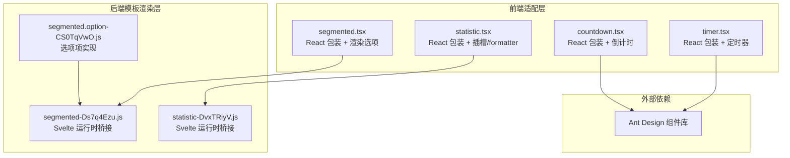
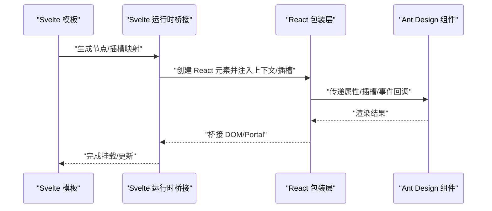
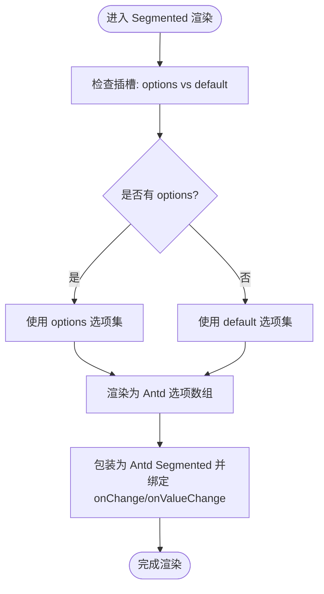
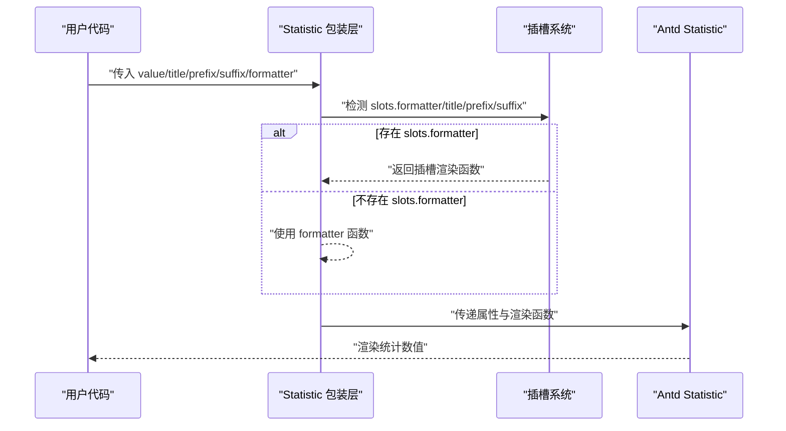
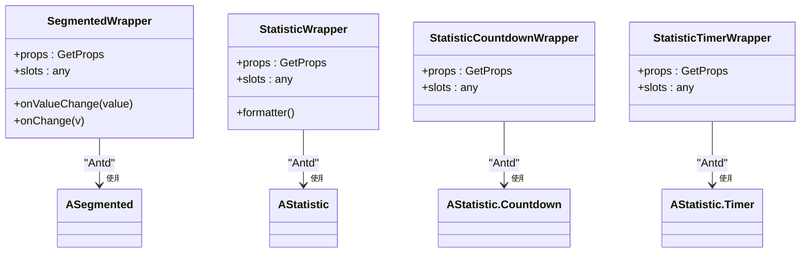
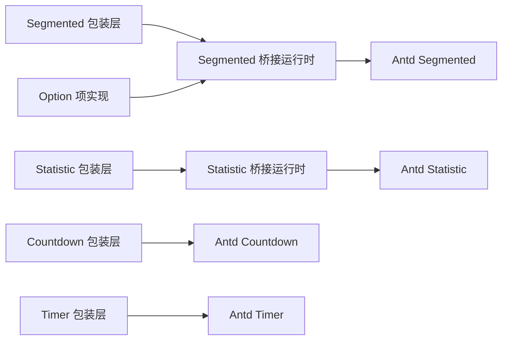

# 分段控制器与统计数值组件

<cite>
**本文引用的文件**   
- [frontend/antd/segmented/segmented.tsx](file://frontend/antd/segmented/segmented.tsx)
- [backend/modelscope_studio/components/antd/segmented/templates/component/segmented-Ds7q4Ezu.js](file://backend/modelscope_studio/components/antd/segmented/templates/component/segmented-Ds7q4Ezu.js)
- [backend/modelscope_studio/components/antd/segmented/option/templates/component/segmented.option-CS0TqVwO.js](file://backend/modelscope_studio/components/antd/segmented/option/templates/component/segmented.option-CS0TqVwO.js)
- [frontend/antd/statistic/statistic.tsx](file://frontend/antd/statistic/statistic.tsx)
- [backend/modelscope_studio/components/antd/statistic/templates/component/statistic-DvxTRiyV.js](file://backend/modelscope_studio/components/antd/statistic/templates/component/statistic-DvxTRiyV.js)
- [frontend/antd/statistic/countdown/statistic.countdown.tsx](file://frontend/antd/statistic/countdown/statistic.countdown.tsx)
- [frontend/antd/statistic/timer/statistic.timer.tsx](file://frontend/antd/statistic/timer/statistic.timer.tsx)
- [docs/components/antd/segmented/README-zh_CN.md](file://docs/components/antd/segmented/README-zh_CN.md)
- [docs/components/antd/statistic/README-zh_CN.md](file://docs/components/antd/statistic/README-zh_CN.md)
</cite>

## 目录

1. [引言](#引言)
2. [项目结构](#项目结构)
3. [核心组件](#核心组件)
4. [架构总览](#架构总览)
5. [详细组件分析](#详细组件分析)
6. [依赖关系分析](#依赖关系分析)
7. [性能考量](#性能考量)
8. [故障排查指南](#故障排查指南)
9. [结论](#结论)
10. [附录](#附录)

## 引言

本文件聚焦于两个前端组件：分段控制器（Segmented）与统计数值（Statistic）。前者用于在多个互斥选项中进行选择，后者用于展示数值、标题、前后缀以及支持倒计时与定时器功能。本文将从架构、数据流、处理逻辑、集成点、错误处理与性能特性等维度，系统性地阐述这两个组件的设计与使用方式，并提供可视化图示帮助理解。

## 项目结构

- 组件由前端适配层（React 包装 + Svelte 预处理）与后端模板渲染层（Svelte 运行时桥接）共同构成。
- 分段控制器通过上下文注入选项集合，支持“选项组”（option）组合使用；统计数值组件支持插槽（slots）与函数式 formatter 的灵活扩展。
- 文档侧提供了基础示例入口，便于快速上手。

**图表来源**

- [frontend/antd/segmented/segmented.tsx:1-47](file://frontend/antd/segmented/segmented.tsx#L1-L47)
- [backend/modelscope_studio/components/antd/segmented/templates/component/segmented-Ds7q4Ezu.js:695-719](file://backend/modelscope_studio/components/antd/segmented/templates/component/segmented-Ds7q4Ezu.js#L695-L719)
- [backend/modelscope_studio/components/antd/segmented/option/templates/component/segmented.option-CS0TqVwO.js:441-447](file://backend/modelscope_studio/components/antd/segmented/option/templates/component/segmented.option-CS0TqVwO.js#L441-L447)
- [frontend/antd/statistic/statistic.tsx:1-34](file://frontend/antd/statistic/statistic.tsx#L1-L34)
- [backend/modelscope_studio/components/antd/statistic/templates/component/statistic-DvxTRiyV.js:685-715](file://backend/modelscope_studio/components/antd/statistic/templates/component/statistic-DvxTRiyV.js#L685-L715)
- [frontend/antd/statistic/countdown/statistic.countdown.tsx:1-27](file://frontend/antd/statistic/countdown/statistic.countdown.tsx#L1-L27)
- [frontend/antd/statistic/timer/statistic.timer.tsx:1-29](file://frontend/antd/statistic/timer/statistic.timer.tsx#L1-L29)

**章节来源**

- [docs/components/antd/segmented/README-zh_CN.md:1-8](file://docs/components/antd/segmented/README-zh_CN.md#L1-L8)
- [docs/components/antd/statistic/README-zh_CN.md:1-9](file://docs/components/antd/statistic/README-zh_CN.md#L1-L9)

## 核心组件

- 分段控制器（Segmented）
  - 支持通过属性传入选项数组或通过“选项组”（option）插槽注入选项集合。
  - 提供值变更回调 onValueChange 与原生 onChange 的组合事件。
  - 支持禁用状态、块级显示（通过隐藏 children 实现）。
- 统计数值（Statistic）
  - 支持 title、prefix、suffix、formatter 等插槽与属性的组合使用。
  - 支持自定义格式化函数与 ReactSlot 插槽渲染。
- 统计数值子组件
  - 倒计时（Countdown）：接收时间戳或毫秒值，自动转换为毫秒。
  - 定时器（Timer）：基于当前时间的定时器展示。

**章节来源**

- [frontend/antd/segmented/segmented.tsx:10-44](file://frontend/antd/segmented/segmented.tsx#L10-L44)
- [frontend/antd/statistic/statistic.tsx:8-31](file://frontend/antd/statistic/statistic.tsx#L8-L31)
- [frontend/antd/statistic/countdown/statistic.countdown.tsx:6-24](file://frontend/antd/statistic/countdown/statistic.countdown.tsx#L6-L24)
- [frontend/antd/statistic/timer/statistic.timer.tsx:10-26](file://frontend/antd/statistic/timer/statistic.timer.tsx#L10-L26)

## 架构总览

下图展示了从 Svelte 模板到 React 包装再到 Ant Design 组件的完整调用链路，以及插槽与上下文如何参与渲染。

**图表来源**

- [backend/modelscope_studio/components/antd/segmented/templates/component/segmented-Ds7q4Ezu.js:695-719](file://backend/modelscope_studio/components/antd/segmented/templates/component/segmented-Ds7q4Ezu.js#L695-L719)
- [backend/modelscope_studio/components/antd/statistic/templates/component/statistic-DvxTRiyV.js:685-715](file://backend/modelscope_studio/components/antd/statistic/templates/component/statistic-DvxTRiyV.js#L685-L715)
- [backend/modelscope_studio/components/antd/segmented/option/templates/component/segmented.option-CS0TqVwO.js:441-447](file://backend/modelscope_studio/components/antd/segmented/option/templates/component/segmented.option-CS0TqVwO.js#L441-L447)

## 详细组件分析

### 分段控制器（Segmented）分析

- 选项配置与“选项组”组合
  - 通过上下文注入“options/default”两组插槽，优先使用 options，否则回退到 default。
  - 使用 useMemo 缓存选项列表，避免不必要的重渲染。
- 受控与非受控模式
  - 外部可直接传入 value/onChange 实现受控；同时提供 onValueChange 作为内部值变更回调。
- 禁用状态与块级显示
  - 通过隐藏 children 的方式保持结构一致性，不影响外层布局。
- 动态更新与样式定制
  - 选项项（option）通过桥接运行时实现插槽与上下文的动态注入，支持样式与事件透传。

**图表来源**

- [frontend/antd/segmented/segmented.tsx:15-44](file://frontend/antd/segmented/segmented.tsx#L15-L44)
- [backend/modelscope_studio/components/antd/segmented/templates/component/segmented-Ds7q4Ezu.js:695-719](file://backend/modelscope_studio/components/antd/segmented/templates/component/segmented-Ds7q4Ezu.js#L695-L719)

**章节来源**

- [frontend/antd/segmented/segmented.tsx:10-44](file://frontend/antd/segmented/segmented.tsx#L10-L44)
- [backend/modelscope_studio/components/antd/segmented/templates/component/segmented-Ds7q4Ezu.js:695-719](file://backend/modelscope_studio/components/antd/segmented/templates/component/segmented-Ds7q4Ezu.js#L695-L719)
- [backend/modelscope_studio/components/antd/segmented/option/templates/component/segmented.option-CS0TqVwO.js:441-447](file://backend/modelscope_studio/components/antd/segmented/option/templates/component/segmented.option-CS0TqVwO.js#L441-L447)

### 统计数值（Statistic）分析

- 数值显示、单位设置与格式化
  - 支持 title/prefix/suffix 的插槽与属性双通道；formatter 支持函数与插槽两种形式。
- 倒计时（Countdown）与定时器（Timer）
  - 倒计时与定时器均对 value 做毫秒转换，确保与 Antd 组件期望一致。
- 插槽与函数式 formatter 的组合
  - 当存在 slots.formatter 时优先使用插槽渲染，否则回退到函数式 formatter。

**图表来源**

- [frontend/antd/statistic/statistic.tsx:8-31](file://frontend/antd/statistic/statistic.tsx#L8-L31)
- [backend/modelscope_studio/components/antd/statistic/templates/component/statistic-DvxTRiyV.js:685-715](file://backend/modelscope_studio/components/antd/statistic/templates/component/statistic-DvxTRiyV.js#L685-L715)

**章节来源**

- [frontend/antd/statistic/statistic.tsx:8-31](file://frontend/antd/statistic/statistic.tsx#L8-L31)
- [frontend/antd/statistic/countdown/statistic.countdown.tsx:6-24](file://frontend/antd/statistic/countdown/statistic.countdown.tsx#L6-L24)
- [frontend/antd/statistic/timer/statistic.timer.tsx:10-26](file://frontend/antd/statistic/timer/statistic.timer.tsx#L10-L26)

### 组件类关系图（代码级）

**图表来源**

- [frontend/antd/segmented/segmented.tsx:10-44](file://frontend/antd/segmented/segmented.tsx#L10-L44)
- [frontend/antd/statistic/statistic.tsx:8-31](file://frontend/antd/statistic/statistic.tsx#L8-L31)
- [frontend/antd/statistic/countdown/statistic.countdown.tsx:6-24](file://frontend/antd/statistic/countdown/statistic.countdown.tsx#L6-L24)
- [frontend/antd/statistic/timer/statistic.timer.tsx:10-26](file://frontend/antd/statistic/timer/statistic.timer.tsx#L10-L26)

## 依赖关系分析

- 组件间耦合
  - 分段控制器与选项项（option）通过上下文建立松耦合关系，选项项本身不直接依赖控制器，而是由桥接层统一调度。
  - 统计数值组件与其子组件（countdown/timer）共享相同的桥接与插槽机制。
- 外部依赖
  - 统一依赖 Ant Design 组件库，保证 UI 行为与样式一致性。
- 潜在循环依赖
  - 当前结构采用“桥接层 -> React 包装层 -> Antd”的单向依赖，未见循环依赖迹象。

**图表来源**

- [backend/modelscope_studio/components/antd/segmented/templates/component/segmented-Ds7q4Ezu.js:695-719](file://backend/modelscope_studio/components/antd/segmented/templates/component/segmented-Ds7q4Ezu.js#L695-L719)
- [backend/modelscope_studio/components/antd/segmented/option/templates/component/segmented.option-CS0TqVwO.js:441-447](file://backend/modelscope_studio/components/antd/segmented/option/templates/component/segmented.option-CS0TqVwO.js#L441-L447)
- [backend/modelscope_studio/components/antd/statistic/templates/component/statistic-DvxTRiyV.js:685-715](file://backend/modelscope_studio/components/antd/statistic/templates/component/statistic-DvxTRiyV.js#L685-L715)
- [frontend/antd/statistic/countdown/statistic.countdown.tsx:15-21](file://frontend/antd/statistic/countdown/statistic.countdown.tsx#L15-L21)
- [frontend/antd/statistic/timer/statistic.timer.tsx:17-23](file://frontend/antd/statistic/timer/statistic.timer.tsx#L17-L23)

**章节来源**

- [backend/modelscope_studio/components/antd/segmented/templates/component/segmented-Ds7q4Ezu.js:695-719](file://backend/modelscope_studio/components/antd/segmented/templates/component/segmented-Ds7q4Ezu.js#L695-L719)
- [backend/modelscope_studio/components/antd/statistic/templates/component/statistic-DvxTRiyV.js:685-715](file://backend/modelscope_studio/components/antd/statistic/templates/component/statistic-DvxTRiyV.js#L685-L715)

## 性能考量

- 渲染优化
  - 分段控制器使用 useMemo 对选项数组进行缓存，减少不必要的重渲染。
  - 统计数值组件在存在 slots.formatter 时，通过插槽渲染函数避免额外的 props 传递开销。
- DOM 显示策略
  - 通过将 children 设置为不可见（display: none），在桥接层中以“contents”方式插入真实节点，降低布局抖动风险。
- 时间参数转换
  - 倒计时与定时器在传入数值时统一转换为毫秒，避免外部传参差异导致的性能波动。

**章节来源**

- [frontend/antd/segmented/segmented.tsx:30-38](file://frontend/antd/segmented/segmented.tsx#L30-L38)
- [frontend/antd/statistic/countdown/statistic.countdown.tsx:17-17](file://frontend/antd/statistic/countdown/statistic.countdown.tsx#L17-L17)
- [frontend/antd/statistic/timer/statistic.timer.tsx:19-19](file://frontend/antd/statistic/timer/statistic.timer.tsx#L19-L19)

## 故障排查指南

- 选项不显示或不生效
  - 确认是否正确使用“选项组”插槽（options/default），且插槽元素已正确挂载。
  - 检查 onValueChange 与 onChange 是否同时绑定，确保值变更事件链路完整。
- 插槽内容未渲染
  - 确认 slots.formatter/title/prefix/suffix 是否正确传入，且桥接层已启用对应插槽渲染。
- 倒计时/定时器数值异常
  - 确认传入 value 单位是否为秒（内部会转换为毫秒），避免重复乘以 1000。
- 样式或事件透传问题
  - 检查桥接层上下文合并逻辑，确认样式与事件在桥接阶段未被忽略。

**章节来源**

- [frontend/antd/segmented/segmented.tsx:26-29](file://frontend/antd/segmented/segmented.tsx#L26-L29)
- [frontend/antd/statistic/statistic.tsx:18-28](file://frontend/antd/statistic/statistic.tsx#L18-L28)
- [frontend/antd/statistic/countdown/statistic.countdown.tsx:17-20](file://frontend/antd/statistic/countdown/statistic.countdown.tsx#L17-L20)
- [frontend/antd/statistic/timer/statistic.timer.tsx:19-22](file://frontend/antd/statistic/timer/statistic.timer.tsx#L19-L22)

## 结论

分段控制器与统计数值组件通过统一的桥接与插槽机制，实现了与 Ant Design 组件的高度一致性和灵活扩展能力。分段控制器强调选项的动态注入与事件回调的组合；统计数值组件则在格式化与插槽渲染方面提供了强大的可塑性。结合本文的架构图与流程图，开发者可以更高效地在表单与仪表板场景中应用这两个组件。

## 附录

- 示例入口
  - 分段控制器与统计数值的基础示例可在文档侧找到，便于快速验证组件行为。

**章节来源**

- [docs/components/antd/segmented/README-zh_CN.md:5-8](file://docs/components/antd/segmented/README-zh_CN.md#L5-L8)
- [docs/components/antd/statistic/README-zh_CN.md:7-9](file://docs/components/antd/statistic/README-zh_CN.md#L7-L9)
