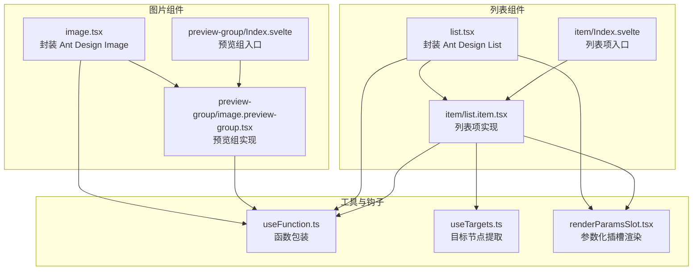
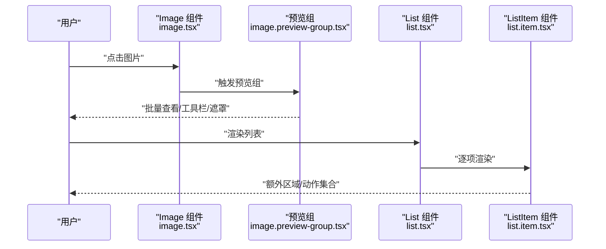
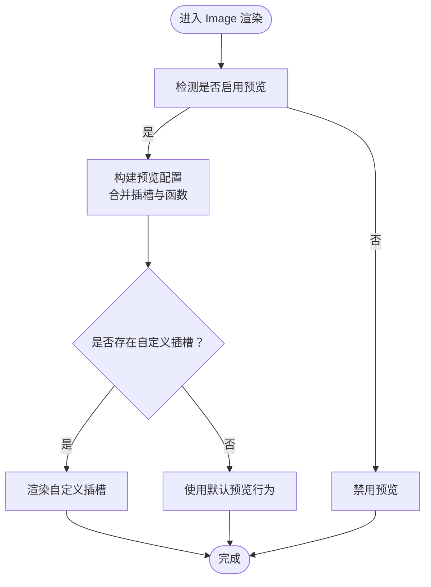
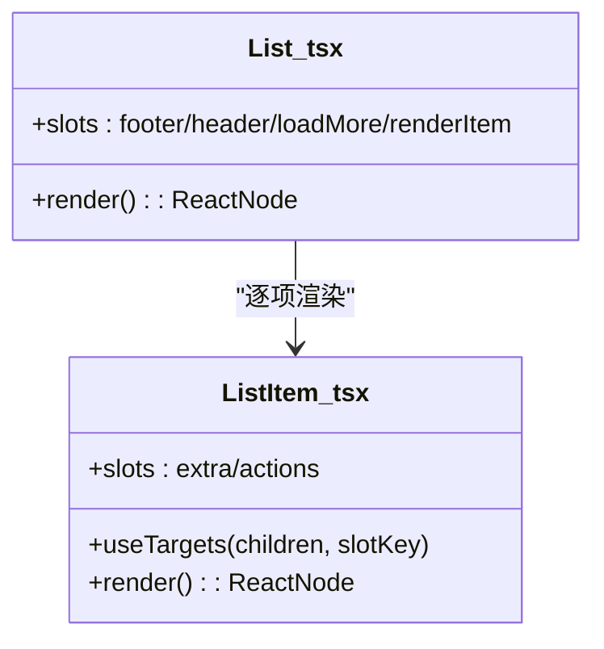
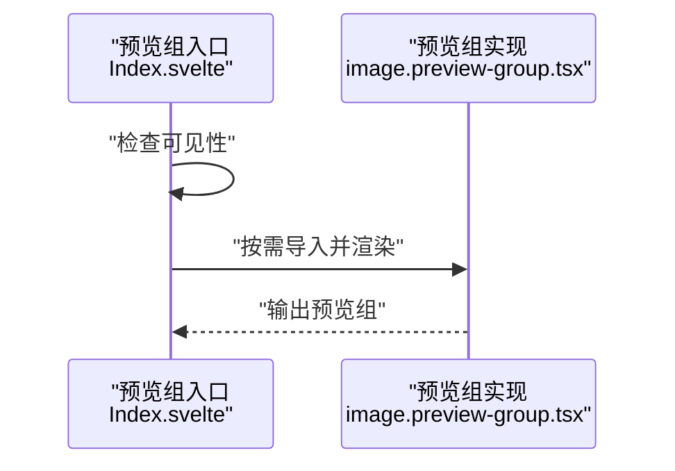
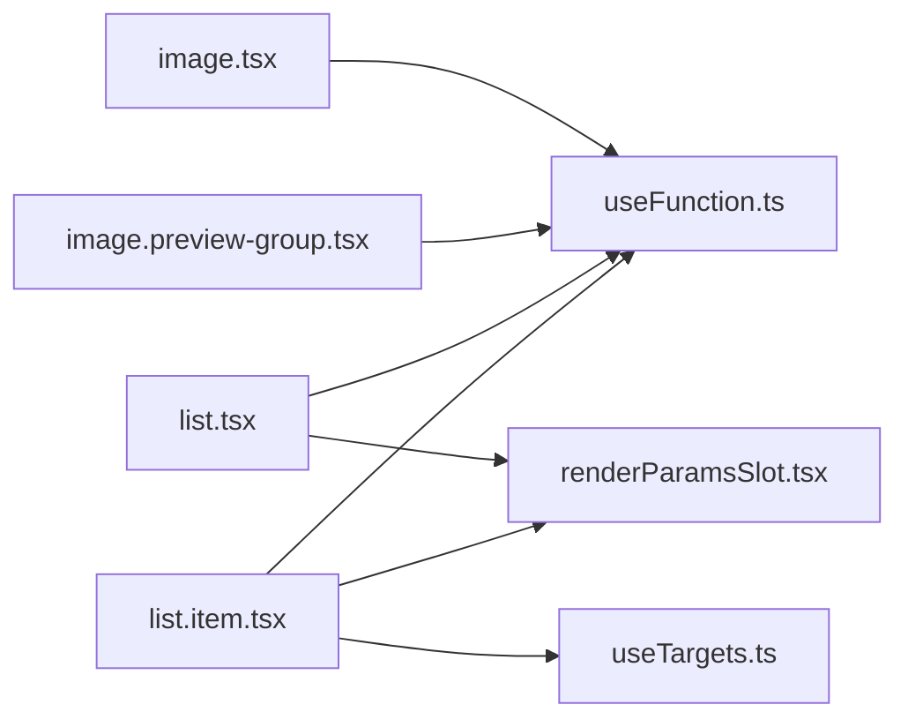

# 图片与列表组件

<cite>
**本文引用的文件**
- [frontend/antd/image/image.tsx](file://frontend/antd/image/image.tsx)
- [frontend/antd/image/preview-group/image.preview-group.tsx](file://frontend/antd/image/preview-group/image.preview-group.tsx)
- [frontend/antd/image/preview-group/Index.svelte](file://frontend/antd/image/preview-group/Index.svelte)
- [frontend/antd/list/list.tsx](file://frontend/antd/list/list.tsx)
- [frontend/antd/list/item/list.item.tsx](file://frontend/antd/list/item/list.item.tsx)
- [frontend/antd/list/item/Index.svelte](file://frontend/antd/list/item/Index.svelte)
- [frontend/utils/hooks/useFunction.ts](file://frontend/utils/hooks/useFunction.ts)
- [frontend/utils/hooks/useTargets.ts](file://frontend/utils/hooks/useTargets.ts)
- [frontend/utils/renderParamsSlot.tsx](file://frontend/utils/renderParamsSlot.tsx)
</cite>

## 目录

1. [简介](#简介)
2. [项目结构](#项目结构)
3. [核心组件](#核心组件)
4. [架构总览](#架构总览)
5. [详细组件分析](#详细组件分析)
6. [依赖关系分析](#依赖关系分析)
7. [性能考量](#性能考量)
8. [故障排查指南](#故障排查指南)
9. [结论](#结论)
10. [附录](#附录)

## 简介

本文件聚焦于图片(Image)与列表(List)两大组件族，系统性梳理其在前端层的封装方式、能力边界与扩展点，并结合仓库现有实现，给出可操作的使用建议与最佳实践。重点覆盖：

- 图片组件：预览组的批量查看、懒加载、错误处理与图片裁剪的可用性与限制；缩放控制、旋转功能与下载支持的现状与扩展路径。
- 列表组件：基础列表结构、列表项(item)的元数据(meta)、垂直列表布局与动态数据绑定；虚拟滚动、无限加载与数据过滤的现状与扩展路径；以及在不同设备上的自适应显示与响应式布局设计。

## 项目结构

围绕图片与列表组件，前端采用 Svelte + Ant Design 的组合模式：

- 组件入口通过 Svelte 文件导出，内部以 sveltify 将 Ant Design 的 React 组件桥接为 Svelte 可用形态。
- 预览组与列表项通过延迟导入（importComponent）按需加载，配合 slots 机制实现灵活的渲染扩展。
- 工具函数与 hooks 提供通用能力：函数包装、参数化插槽渲染、目标节点提取等。

**图表来源**

- [frontend/antd/image/image.tsx:1-89](file://frontend/antd/image/image.tsx#L1-L89)
- [frontend/antd/image/preview-group/Index.svelte:1-72](file://frontend/antd/image/preview-group/Index.svelte#L1-L72)
- [frontend/antd/image/preview-group/image.preview-group.tsx:1-55](file://frontend/antd/image/preview-group/image.preview-group.tsx#L1-L55)
- [frontend/antd/list/list.tsx:1-36](file://frontend/antd/list/list.tsx#L1-L36)
- [frontend/antd/list/item/Index.svelte:1-60](file://frontend/antd/list/item/Index.svelte#L1-L60)
- [frontend/antd/list/item/list.item.tsx:1-29](file://frontend/antd/list/item/list.item.tsx#L1-L29)
- [frontend/utils/hooks/useFunction.ts:1-13](file://frontend/utils/hooks/useFunction.ts#L1-L13)
- [frontend/utils/hooks/useTargets.ts:1-52](file://frontend/utils/hooks/useTargets.ts#L1-L52)
- [frontend/utils/renderParamsSlot.tsx:1-51](file://frontend/utils/renderParamsSlot.tsx#L1-L51)

**章节来源**

- [frontend/antd/image/image.tsx:1-89](file://frontend/antd/image/image.tsx#L1-L89)
- [frontend/antd/image/preview-group/Index.svelte:1-72](file://frontend/antd/image/preview-group/Index.svelte#L1-L72)
- [frontend/antd/image/preview-group/image.preview-group.tsx:1-55](file://frontend/antd/image/preview-group/image.preview-group.tsx#L1-L55)
- [frontend/antd/list/list.tsx:1-36](file://frontend/antd/list/list.tsx#L1-L36)
- [frontend/antd/list/item/Index.svelte:1-60](file://frontend/antd/list/item/Index.svelte#L1-L60)
- [frontend/antd/list/item/list.item.tsx:1-29](file://frontend/antd/list/item/list.item.tsx#L1-L29)

## 核心组件

- 图片(Image)：通过 sveltify 包装 Ant Design 的 Image 组件，支持占位符、预览配置与插槽扩展。预览组提供批量查看能力，支持自定义遮罩、关闭图标与工具栏。
- 列表(List)：通过 sveltify 包装 Ant Design 的 List 组件，支持页眉/页脚、加载更多与自定义渲染项。列表项支持额外区域与动作集合，并通过 useTargets 自动提取带特定 slotKey 的子节点。

**章节来源**

- [frontend/antd/image/image.tsx:14-86](file://frontend/antd/image/image.tsx#L14-L86)
- [frontend/antd/image/preview-group/image.preview-group.tsx:13-52](file://frontend/antd/image/preview-group/image.preview-group.tsx#L13-L52)
- [frontend/antd/list/list.tsx:8-33](file://frontend/antd/list/list.tsx#L8-L33)
- [frontend/antd/list/item/list.item.tsx:6-26](file://frontend/antd/list/item/list.item.tsx#L6-L26)

## 架构总览

下图展示图片与列表组件在前端层的调用链与插槽扩展点：

**图表来源**

- [frontend/antd/image/image.tsx:24-85](file://frontend/antd/image/image.tsx#L24-L85)
- [frontend/antd/image/preview-group/image.preview-group.tsx:18-51](file://frontend/antd/image/preview-group/image.preview-group.tsx#L18-L51)
- [frontend/antd/list/list.tsx:11-32](file://frontend/antd/list/list.tsx#L11-L32)
- [frontend/antd/list/item/list.item.tsx:9-25](file://frontend/antd/list/item/list.item.tsx#L9-L25)

## 详细组件分析

### 图片组件（Image）

- 批量查看（预览组）
  - 预览组通过延迟导入与条件渲染实现按需加载，避免首屏负担。
  - 支持自定义遮罩、关闭图标与工具栏，工具栏与图像渲染可通过插槽传入或函数回调形式注入。
  - 预览容器的挂载位置可通过 getContainer 函数定制，便于嵌入到指定 DOM 容器。
- 懒加载与错误处理
  - 当前实现未显式声明懒加载与错误处理逻辑；若需要，可在上层业务中结合浏览器原生属性或第三方库进行增强。
- 图片裁剪
  - 该实现未暴露裁剪相关参数；如需裁剪，可在上层业务中对资源进行预处理或引入专门的裁剪库。
- 缩放控制、旋转功能与下载支持
  - 当前实现未内置缩放、旋转与下载按钮；可通过自定义工具栏插槽添加相应控件，并结合外部库实现交互。
- 插槽与函数包装
  - 使用 useFunction 对传入的函数进行稳定化处理，renderParamsSlot 支持将参数传递给插槽渲染函数，提升灵活性。

**图表来源**

- [frontend/antd/image/image.tsx:24-85](file://frontend/antd/image/image.tsx#L24-L85)
- [frontend/antd/image/preview-group/image.preview-group.tsx:18-51](file://frontend/antd/image/preview-group/image.preview-group.tsx#L18-L51)
- [frontend/utils/hooks/useFunction.ts:5-12](file://frontend/utils/hooks/useFunction.ts#L5-L12)
- [frontend/utils/renderParamsSlot.tsx:5-50](file://frontend/utils/renderParamsSlot.tsx#L5-L50)

**章节来源**

- [frontend/antd/image/image.tsx:14-86](file://frontend/antd/image/image.tsx#L14-L86)
- [frontend/antd/image/preview-group/image.preview-group.tsx:13-52](file://frontend/antd/image/preview-group/image.preview-group.tsx#L13-L52)
- [frontend/utils/hooks/useFunction.ts:1-13](file://frontend/utils/hooks/useFunction.ts#L1-L13)
- [frontend/utils/renderParamsSlot.tsx:1-51](file://frontend/utils/renderParamsSlot.tsx#L1-L51)

### 列表组件（List）

- 基础列表结构与动态数据绑定
  - 通过 sveltify 包装 Ant Design List，支持页眉/页脚、加载更多与自定义渲染项。
  - 渲染项可通过插槽传入，或以函数形式注入，实现灵活的数据绑定与视图渲染。
- 列表项（Item）与元数据（meta）
  - 列表项支持“额外区域”与“动作集合”，动作集合通过 useTargets 自动从子节点中提取带特定 slotKey 的元素，保证顺序与索引可控。
- 垂直列表布局
  - 默认沿用 Ant Design 的垂直布局策略，适用于大多数场景；如需横向或网格布局，可在上层业务中结合样式或布局组件实现。

**图表来源**

- [frontend/antd/list/list.tsx:8-33](file://frontend/antd/list/list.tsx#L8-L33)
- [frontend/antd/list/item/list.item.tsx:6-26](file://frontend/antd/list/item/list.item.tsx#L6-L26)
- [frontend/utils/hooks/useTargets.ts:5-51](file://frontend/utils/hooks/useTargets.ts#L5-L51)

**章节来源**

- [frontend/antd/list/list.tsx:8-33](file://frontend/antd/list/list.tsx#L8-L33)
- [frontend/antd/list/item/list.item.tsx:6-26](file://frontend/antd/list/item/list.item.tsx#L6-L26)
- [frontend/utils/hooks/useTargets.ts:1-52](file://frontend/utils/hooks/useTargets.ts#L1-L52)

### 预览组（Preview Group）

- 批量查看与可见性控制
  - 预览组入口通过 Svelte 的延迟导入与可见性判断，仅在需要时渲染实际组件，减少初始开销。
  - 支持通过 props 控制预览可见性变化事件，便于与上层状态联动。
- 插槽与容器挂载
  - 支持自定义遮罩与关闭图标；容器挂载位置通过 getContainer 函数定制，便于嵌入到指定容器。

**图表来源**

- [frontend/antd/image/preview-group/Index.svelte:55-71](file://frontend/antd/image/preview-group/Index.svelte#L55-L71)
- [frontend/antd/image/preview-group/image.preview-group.tsx:18-51](file://frontend/antd/image/preview-group/image.preview-group.tsx#L18-L51)

**章节来源**

- [frontend/antd/image/preview-group/Index.svelte:14-71](file://frontend/antd/image/preview-group/Index.svelte#L14-L71)
- [frontend/antd/image/preview-group/image.preview-group.tsx:18-52](file://frontend/antd/image/preview-group/image.preview-group.tsx#L18-L52)

## 依赖关系分析

- 组件与工具函数
  - 图片与列表组件均依赖 useFunction 进行函数稳定化，确保回调在 props 变更时不重复创建。
  - 列表项依赖 useTargets 提取带特定 slotKey 的子节点，实现动作集合的自动装配。
  - renderParamsSlot 提供参数化插槽渲染能力，支持向插槽传参并强制克隆，保证多次渲染的一致性。
- 组件间耦合
  - 图片预览组与图片组件解耦：预览组作为独立组件存在，通过 props 与插槽与图片组件协作。
  - 列表项与列表组件解耦：列表项通过延迟导入与插槽机制实现独立渲染，降低耦合度。

**图表来源**

- [frontend/antd/image/image.tsx:3-4](file://frontend/antd/image/image.tsx#L3-L4)
- [frontend/antd/image/preview-group/image.preview-group.tsx:3-4](file://frontend/antd/image/preview-group/image.preview-group.tsx#L3-L4)
- [frontend/antd/list/list.tsx:4-5](file://frontend/antd/list/list.tsx#L4-L5)
- [frontend/antd/list/item/list.item.tsx:3-4](file://frontend/antd/list/item/list.item.tsx#L3-L4)
- [frontend/utils/hooks/useFunction.ts:1-13](file://frontend/utils/hooks/useFunction.ts#L1-L13)
- [frontend/utils/hooks/useTargets.ts:1-52](file://frontend/utils/hooks/useTargets.ts#L1-L52)
- [frontend/utils/renderParamsSlot.tsx:1-51](file://frontend/utils/renderParamsSlot.tsx#L1-L51)

**章节来源**

- [frontend/utils/hooks/useFunction.ts:1-13](file://frontend/utils/hooks/useFunction.ts#L1-L13)
- [frontend/utils/hooks/useTargets.ts:1-52](file://frontend/utils/hooks/useTargets.ts#L1-L52)
- [frontend/utils/renderParamsSlot.tsx:1-51](file://frontend/utils/renderParamsSlot.tsx#L1-L51)

## 性能考量

- 按需加载与延迟导入
  - 预览组与列表项均采用延迟导入策略，仅在可见时渲染，有助于减少首屏负载与内存占用。
- 函数稳定化
  - 使用 useFunction 对回调进行 memo 化，避免因 props 变更导致的重复创建，降低重渲染成本。
- 插槽渲染优化
  - renderParamsSlot 强制克隆与参数透传，确保插槽渲染的确定性与可复用性，减少不必要的重复计算。

**章节来源**

- [frontend/antd/image/preview-group/Index.svelte:55-71](file://frontend/antd/image/preview-group/Index.svelte#L55-L71)
- [frontend/antd/list/item/Index.svelte:46-59](file://frontend/antd/list/item/Index.svelte#L46-L59)
- [frontend/utils/hooks/useFunction.ts:5-12](file://frontend/utils/hooks/useFunction.ts#L5-L12)
- [frontend/utils/renderParamsSlot.tsx:23-49](file://frontend/utils/renderParamsSlot.tsx#L23-L49)

## 故障排查指南

- 预览组不显示
  - 检查可见性 props 与入口组件的可见性判断逻辑，确认预览组已按需导入并渲染。
  - 若使用自定义遮罩或关闭图标，请确认插槽是否正确传入且未被覆盖。
- 工具栏/图像渲染无效
  - 确认传入的函数是否通过 useFunction 包装，避免因函数引用变化导致的失效。
  - 若使用插槽，请确认 renderParamsSlot 的参数传递是否正确。
- 列表项动作集合为空
  - 检查子节点是否带有正确的 slotKey 与索引信息，确保 useTargets 能够正确提取。
- 性能问题
  - 若出现频繁重渲染，检查是否在父组件中频繁变更回调或插槽内容；建议使用 useFunction 或稳定化策略。

**章节来源**

- [frontend/antd/image/preview-group/Index.svelte:55-71](file://frontend/antd/image/preview-group/Index.svelte#L55-L71)
- [frontend/antd/image/preview-group/image.preview-group.tsx:18-51](file://frontend/antd/image/preview-group/image.preview-group.tsx#L18-L51)
- [frontend/antd/list/item/list.item.tsx:10-21](file://frontend/antd/list/item/list.item.tsx#L10-L21)
- [frontend/utils/hooks/useFunction.ts:5-12](file://frontend/utils/hooks/useFunction.ts#L5-L12)
- [frontend/utils/renderParamsSlot.tsx:23-49](file://frontend/utils/renderParamsSlot.tsx#L23-L49)

## 结论

- 图片组件通过预览组实现了批量查看与灵活的插槽扩展，当前未内置懒加载、错误处理、裁剪、缩放、旋转与下载功能，但具备良好的扩展空间。
- 列表组件提供了基础的结构与动态绑定能力，列表项的动作集合通过 useTargets 自动装配，适合在上层业务中结合样式与布局实现响应式与自适应显示。
- 在性能方面，组件普遍采用延迟导入与函数稳定化策略，有助于在复杂场景下保持良好的运行效率。

## 附录

- 扩展建议
  - 图片：在上层业务中引入懒加载与错误处理策略；若需裁剪、缩放、旋转与下载，可结合外部库与自定义工具栏插槽实现。
  - 列表：在上层业务中引入虚拟滚动与无限加载；数据过滤可通过外部状态与渲染条件实现；响应式布局可通过样式与断点策略适配多端设备。
